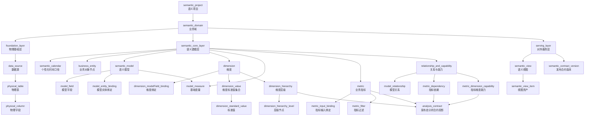
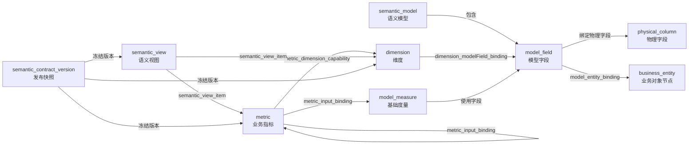
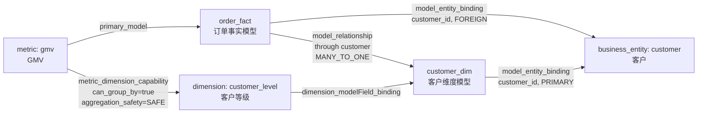
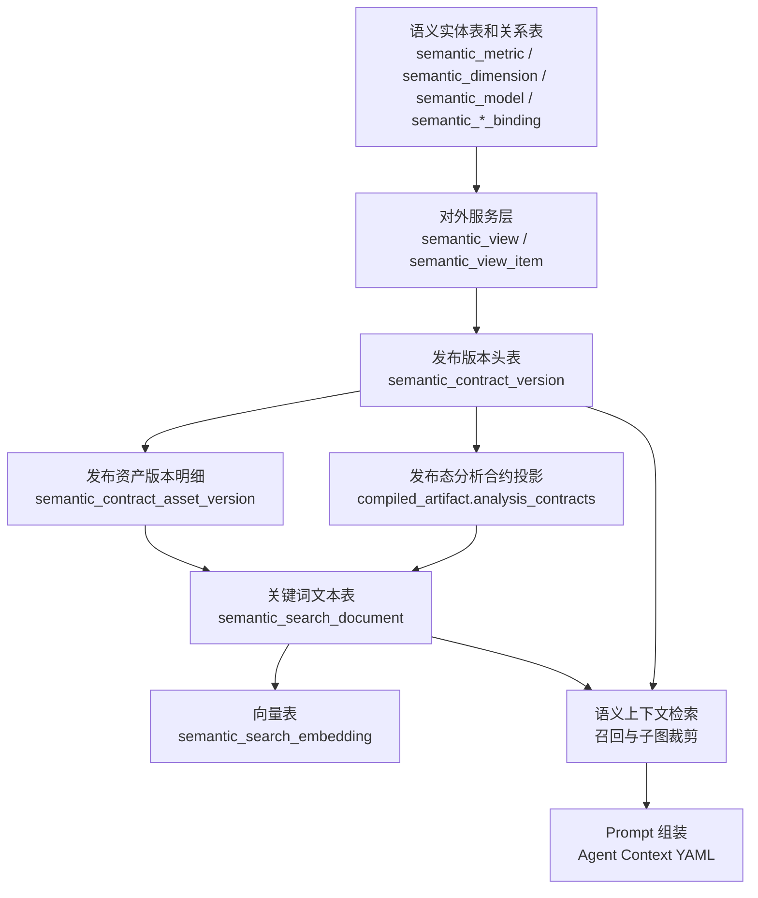
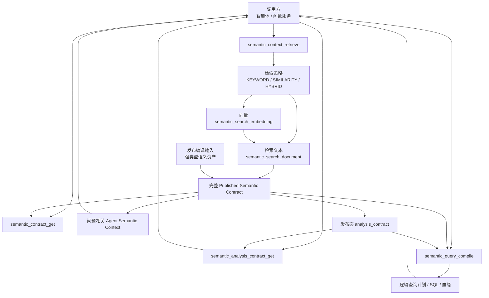

# A-Semantic Layer

## 语义层基础设计

### 1. 文档目标

本文定义企业语义层的目标业务模型、发布存储和运行服务边界。

语义层定义统一业务口径与查询能力。智能问数、报表和分析接口消费同一发布合约。

本文目标：

- 定义语义层从底层到上层的层级关系。
- 定义每类语义实体必须存储哪些字段。
- 说明这些字段分别表达什么业务不变量。
- 定义指标公式、指标驱动、维度贡献和维度下钻的通用分析语义。
- 定义编辑、审核、发布、版本和回滚规则。
- 定义发布态语义检索、分析合约读取和语义查询编译服务。

### 2. 开源项目参考

| 项目 | 参考点 | 本设计中的体现 |
| --- | --- | --- |
| [MetricFlow / dbt Semantic Layer](https://github.com/dbt-labs/metricflow) | `semantic_model / entity / dimension / measure / metric` 分层；通过实体连接模型；指标请求基于语义资产 | `semantic_model`、`business_entity`、`model_entity_binding`、`model_measure`、`metric`、`metric_input_binding` |
| [Cube](https://github.com/cube-js/cube) | `cube / measure / dimension / join / view`；headless semantic layer；统一暴露给 BI、API、应用 | `semantic_model`、`model_measure`、`dimension`、`model_relationship`、`semantic_view` |
| [WrenAI](https://github.com/Canner/WrenAI) | MDL 结构化语义定义；models、columns、relationships、views、metrics、enums、approved joins | `model_field`、`dimension_value`、`dimension_mapping`、`model_relationship`、`semantic_contract_version` |
| [Malloy](https://github.com/malloydata/malloy) | 语义建模语言和可复用分析资产；source、measure、dimension、join、view 可组合 | `metric_input_binding`、`metric_filter`、`semantic_view`、可复用派生指标 |
| [Lightdash](https://github.com/lightdash/lightdash) | 把 metrics、dimensions、joins、描述、权限、上下文作为可治理资产 | `certification_status`、`owner`、`contract_status`、`semantic_view`、权限和可见性字段 |
| [Apache Ossie](https://github.com/apache/ossie) | 语义合约的结构化和版本化设计 | `semantic_contract_version`、`semantic_contract_asset_version`、`schema_fingerprint` |

### 3. 总体设计原则

#### 3.1 分层语义模型

语义模型分为物理基础、语义建模和对外服务三层。模型、实体、度量、指标、维度及其关系分别建模，显式保存指标输入、固定筛选、粒度、关系基数和聚合安全约束。

#### 3.2 模型通过实体相连

模型关系通过业务实体绑定建立，物理连接条件仅在发布合约内部保存。

例如：

```text
order_fact.customer_id -> customer 实体
customer_dim.customer_id -> customer 实体
```

连接依据为同一业务实体及已发布关系，不使用字段名相似度推断。

#### 3.3 指标和维度之间必须有能力契约

不是所有指标都能按所有维度分析。

例如：

- GMV 可以按商品类目分析。
- 平台库存快照不一定能按订单支付渠道分析。
- 用户留存率可以按注册渠道分析，但不一定能按订单收货城市分析。

`metric_dimension_capability` 定义以下能力：

```text
某指标 + 某维度
是否可分组
是否可过滤
是否可下钻
是否有行数放大风险
是否需要预聚合
通过哪条关系路径获得维度
```


#### 3.4 编辑态和发布态分离

语义资产编辑时可以是草稿，可以由 AI 辅助补全，可以待人工审核。

但运行态必须只读已发布的不可变合约版本。

发布流程：

```text
编辑态资产表 -> 校验 -> 发布 -> semantic_contract_version + semantic_contract_asset_version -> 运行态读取
```

发布合约支持版本化、内容对比和生成新版本的回滚。YAML 仅用于模型上下文，不用于编辑或发布。

#### 3.5 分析路径必须由语义关系推导

趋势、同比环比、维度贡献、指标公式拆解、驱动指标分析和多层下钻，不得由调用方根据字段名称临时猜测。

语义层需要让以下关系可以被确定性推导：

```text
指标公式拆解
  <- metric.expr_ast
  <- metric_input_binding

指标驱动树
  <- metric_input_binding
  <- metric_dependency

维度贡献方向
  <- metric_dimension_capability

维度下钻路径
  <- dimension_hierarchy
  <- dimension_hierarchy_level

跨模型分析路径
  <- model_relationship
  <- metric_dimension_capability.relation_path
```

这些关系是通用业务语义，不属于某个 Agent 或某套提示词。智能问数、报表、指标平台和分析 API 应消费同一份发布态分析合约。

发布时将上述强类型资产编译成只读 `analysis_contract` 投影，用于快速读取；投影不是新的编辑态事实源，不能反向覆盖指标、维度和关系定义。

### 4. 总体层级关系

三大块关系图：



文本结构：

```text
semantic_project / 语义项目
└── semantic_domain / 业务域
    ├── foundation_layer / 物理基础层
    │   └── data_source
    │       └── physical_table
    │           └── physical_column
    │
    ├── semantic_core_layer / 语义建模层
    │   ├── personalization / 个性化语义配置
    │   │   └── semantic_calendar
    │   ├── business_object_node / 业务对象节点
    │   │   └── business_entity
    │   ├── model / 语义模型
    │   │   └── semantic_model
    │   │       ├── model_field
    │   │       ├── model_entity_binding
    │   │       └── model_measure
    │   ├── dimension / 维度
    │   │   ├── dimension
    │   │   ├── dimension_modelField_binding
    │   │   ├── dimension_value
    │   │   │   └── dimension_standard_value
    │   │   ├── dimension_mapping
    │   │   └── dimension_hierarchy
    │   │       └── dimension_hierarchy_level
    │   ├── metric / 指标
    │   │   └── metric
    │   │       ├── metric_input_binding
    │   │       └── metric_filter
    │   └── relation / 关系与能力
    │       ├── model_relationship
    │       ├── metric_dependency
    │       └── metric_dimension_capability
    │
    └── serving_layer / 对外服务层
        ├── semantic_view
        │   └── semantic_view_item
        └── semantic_contract_version
```

说明：

- `foundation_layer / 物理基础层`：只描述数据在哪里、表字段是什么，不表达业务口径。
- `semantic_core_layer / 语义建模层`：表达业务实体、语义模型、指标、维度、维度值集合、关系和能力，是语义层主体。
- `serving_layer / 对外服务层`：控制对外暴露哪些语义资产，并通过发布版本冻结运行态合约。
- `semantic_project` 和 `semantic_domain` 是组织边界，不是三层之一；它们负责把资产归到某个项目和业务域。

核心关系：

```text
semantic_model 通过 model_entity_binding 绑定 business_entity
semantic_model 通过 model_field 绑定 physical_column
dimension 通过 dimension_modelField_binding 绑定 model_field
model_measure 属于 semantic_model，并使用 model_field
metric 通过 metric_input_binding 依赖 model_measure 或其他 metric
model_relationship 通过 entity_binding 连接 semantic_model
metric_dimension_capability 决定 metric 能否使用 dimension
semantic_view 决定对外暴露哪些 metric、dimension、entity
semantic_contract_version 冻结一次发布后的完整语义层
semantic_project 通过 default_calendar_id 指定项目默认时间口径
analysis_contract 由发布版本中的指标公式、输入绑定、依赖、维度能力和层级关系编译生成
```

### 5. 语义资产类型

语义资产在管理页面中可以按项目、业务域和类型分组展示，但语义层本质上不是一棵树，而是一张图。

语义图中的节点和边：



```text
文件组织 = 树
语义关系 = 图
节点 = 稳定对象
边 = 绑定、连接、依赖、能力、暴露关系
```

因此需要区分每个存储实体的类型：

| 类型 | 含义 | 实体 |
| --- | --- | --- |
| `CONTAINER / 容器` | 组织资产边界，不直接参与业务计算 | `semantic_project`、`semantic_domain` |
| `PHYSICAL_NODE / 物理节点` | 描述物理数据对象 | `data_source`、`physical_table`、`physical_column` |
| `SEMANTIC_NODE / 语义节点` | 描述稳定业务对象或语义对象 | `business_entity`、`semantic_model`、`model_field`、`dimension`、`dimension_value`、`dimension_standard_value`、`dimension_hierarchy`、`model_measure`、`metric`、`semantic_calendar`、`semantic_view` |
| `EDGE / 边` | 描述节点之间的绑定、连接、依赖、能力或暴露关系 | `model_entity_binding`、`dimension_modelField_binding`、`model_relationship`、`metric_input_binding`、`metric_dependency`、`metric_dimension_capability`、`dimension_mapping`、`dimension_hierarchy_level`、`semantic_view_item` |
| `COMPONENT / 定义组件` | 描述某个节点内部的定义片段 | `metric_filter` |
| `SNAPSHOT / 快照` | 冻结发布态语义图或其确定性编译投影 | `semantic_contract_version`、`analysis_contract` |

`business_entity` 的类型是 `SEMANTIC_NODE / 语义节点`。它不是一个流程阶段，而是语义图里的业务对象节点。它的作用是让多个模型可以通过同一个稳定业务对象建立关系。

例如：

```text
business_entity:
- customer / 客户

model_entity_binding:
- order_fact.customer_id -> customer, role = FOREIGN
- customer_dim.customer_id -> customer, role = PRIMARY

model_relationship:
- order_fact -> customer_dim
- through_entity = customer
- cardinality = MANY_TO_ONE
```

这时系统才能判断：

```text
GMV 在 order_fact
客户等级在 customer_dim
order_fact 可以通过 customer 连接 customer_dim
这个连接是 MANY_TO_ONE，不会放大 GMV
```

`business_entity` 例子：



### 6. 公共字段

核心语义资产使用以下公共字段；纯关系明细的专有字段按对应实体表定义。数据库类型和空值约束由 D 定义。

| 字段 | 类型 | 含义 |
| --- | --- | --- |
| `id` | bigint | 内部主键 |
| `oid` | bigint | 租户或组织 ID |
| `project_id` | bigint | 所属语义项目 |
| `domain_id` | bigint | 所属业务域 |
| `name` | varchar | 程序编码，使用稳定唯一的英文标识 |
| `biz_name` | varchar | 业务展示名，通常是中文 |
| `description` | text | 业务解释 |
| `aliases` | json | 同义词、历史叫法、常见问法 |
| `tags` | json | 分类标签 |
| `owner` | varchar | 负责人或团队 |
| `status` | varchar | 生命周期状态：`ACTIVE / DISABLED / DEPRECATED` |
| `contract_status` | varchar | 治理状态：`DRAFT / IN_REVIEW / APPROVED / PUBLISHED` |
| `version` | bigint | 资产版本 |
| `created_at` | datetime | 创建时间 |
| `updated_at` | datetime | 更新时间 |
| `created_by` | varchar | 创建人 |
| `updated_by` | varchar | 修改人 |
| `ext` | json | 扩展字段，避免频繁改表 |

### 7. 实体设计

#### 7.1 Organization Boundary / 组织边界

##### 7.1.1 semantic_project（CONTAINER：语义项目容器）

语义项目。通常对应一个数据产品、一个问数空间、一个业务线或一个可独立发布的语义合约集合。

| 字段 | 含义 |
| --- | --- |
| `id` | 项目主键 |
| `oid` | 组织 ID |
| `project_key` | 项目唯一编码 |
| `name` | 项目程序名 |
| `biz_name` | 项目展示名 |
| `description` | 项目说明 |
| `default_dialect` | 默认 SQL 方言，例如 `postgres`、`mysql`、`clickhouse` |
| `default_timezone` | 默认时区 |
| `default_calendar_id` | 项目默认时间口径，指向 `semantic_calendar` |
| `repo_url` | 语义定义仓库地址，可选 |
| `active_contract_version_id` | 当前线上生效的合约版本 |
| `owner` | 项目负责人 |
| `status` | 项目状态 |
| `created_at / updated_at` | 时间字段 |
| `ext` | 扩展配置 |

说明：

`semantic_project` 只保留项目级默认引用，不直接保存 `calendar_type`、`week_start_day`、`fiscal_year_start_month`。这些字段属于时间口径配置，必须进入独立的 `semantic_calendar`。

时间口径由独立日历资产定义。项目可包含多套日历，业务域、模型和指标通过显式引用覆盖项目默认日历。

##### 7.1.2 semantic_domain（CONTAINER：业务域容器）

业务域。例如交易域、用户域、商品域、财务域。业务域负责定义资产边界。

| 字段 | 含义 |
| --- | --- |
| `id` | 业务域主键 |
| `oid` | 组织 ID |
| `project_id` | 所属项目 |
| `parent_domain_id` | 上级业务域 |
| `domain_key` | 业务域编码 |
| `name` | 程序名 |
| `biz_name` | 展示名 |
| `description` | 业务域说明 |
| `domain_type` | 主题域、应用域、分析域等 |
| `boundary_desc` | 业务边界说明 |
| `default_entity_id` | 默认核心实体 |
| `owner_team` | 负责团队 |
| `status` | 状态 |
| `version` | 版本 |
| `ext` | 扩展信息 |

#### 7.2 Foundation Layer / 物理基础层

这一层只描述数据在哪里、表字段是什么，以及物理元数据的同步状态。它不直接表达指标口径、业务维度和跨模型分析能力。

##### 7.2.1 data_source（PHYSICAL_NODE：物理数据源节点）

物理数据源。只记录连接引用和元数据状态，不直接保存密钥。

| 字段 | 含义 |
| --- | --- |
| `id` | 数据源主键 |
| `oid` | 组织 ID |
| `project_id` | 所属项目 |
| `connection_id` | 指向系统连接配置 |
| `source_type` | 数据源类型：数据库、湖仓、文件、API 等 |
| `database_type` | 数据库类型 |
| `database_version` | 数据库版本 |
| `default_database` | 默认库名 |
| `default_schema` | 默认 schema |
| `metadata_sync_status` | 元数据同步状态 |
| `last_sync_at` | 最近同步时间 |
| `status` | 是否启用 |
| `ext` | 扩展信息 |

##### 7.2.2 physical_table（PHYSICAL_NODE：data_source -> physical_table）

物理表、视图或物化视图。这里只描述物理对象，不表达业务口径。

| 字段 | 含义 |
| --- | --- |
| `id` | 物理表主键 |
| `oid` | 组织 ID |
| `data_source_id` | 所属数据源 |
| `database_name` | 库名 |
| `schema_name` | schema 名 |
| `table_name` | 表名 |
| `object_type` | `TABLE / VIEW / MATERIALIZED_VIEW` |
| `table_comment` | 数据库原始注释 |
| `row_count` | 估算行数 |
| `size_bytes` | 估算存储大小 |
| `partition_keys` | 分区字段 |
| `primary_keys` | 物理主键 |
| `ddl_fingerprint` | DDL 指纹 |
| `last_synced_at` | 最近元数据同步时间 |
| `status` | 状态 |
| `ext` | 扩展信息 |

##### 7.2.3 physical_column（PHYSICAL_NODE：physical_table -> physical_column）

物理字段。用于元数据识别和模型字段绑定。

| 字段 | 含义 |
| --- | --- |
| `id` | 字段主键 |
| `oid` | 组织 ID |
| `table_id` | 所属物理表 |
| `column_name` | 字段名 |
| `data_type` | 原始数据库类型 |
| `normalized_type` | 归一类型：`string / number / time / boolean / json` |
| `ordinal_position` | 字段顺序 |
| `nullable` | 是否可空 |
| `is_primary_key` | 是否物理主键 |
| `is_partition_key` | 是否分区字段 |
| `is_time_key` | 是否时间字段 |
| `column_comment` | 数据库原始注释 |
| `sample_values` | 样例值 |
| `statistics` | 基础统计信息，例如基数、空值率、最大最小值 |
| `classification` | 敏感级别，例如 PII、财务敏感 |
| `last_synced_at` | 最近同步时间 |
| `status` | 状态 |
| `ext` | 扩展信息 |

#### 7.3 Semantic Core Layer / 语义建模层

这一层是语义层主体，负责把物理表字段转成稳定的业务实体、语义模型、维度、指标、维度值集合、关系和能力。个性化语义配置也放在这一层，因为它影响业务问题解释和指标口径。

##### 7.3.1 semantic_calendar（SEMANTIC_NODE：项目时间口径节点）

时间口径配置。它定义“本周”“上周”“本财年”“本财季”“工作日”“业务日”等时间概念如何解释。

这里把 `semantic_calendar` 放在语义建模层里的个性化语义配置部分。原因是时间口径本质上是项目、业务域、组织在语义定义上的差异配置。

语义日历配置仅包含影响业务解释、指标口径和时间范围的规则，不包含页面偏好。

| 字段 | 含义 |
| --- | --- |
| `id` | 日历配置主键 |
| `oid` | 组织 ID |
| `project_id` | 所属项目 |
| `calendar_key` | 日历编码 |
| `name` | 程序名 |
| `biz_name` | 展示名 |
| `description` | 日历口径说明 |
| `calendar_type` | `NATURAL / FISCAL / BUSINESS / RETAIL` |
| `timezone` | 日历使用的时区 |
| `week_start_day` | 一周起始日，例如 1 表示周一 |
| `fiscal_year_start_month` | 财年起始月，例如 4 表示财年从 4 月开始 |
| `fiscal_year_label_policy` | 财年命名规则：按开始年份、结束年份或自定义 |
| `time_spine_model_id` | 时间轴模型，参考 MetricFlow time spine |
| `calendar_table_id` | 专门日历表，可用于节假日、业务日、零售周 |
| `supported_granularities` | 支持的时间粒度，例如 day、week、month、fiscal_quarter、business_day |
| `holiday_calendar_key` | 节假日日历编码 |
| `business_day_rule` | 工作日或业务日规则 |
| `is_default` | 是否项目默认日历 |
| `status` | 状态 |
| `contract_status` | 治理状态 |
| `version` | 版本 |
| `ext` | 扩展配置 |

日历影响以下指标口径：

```text
本周 GMV
上周新增用户
本财年收入
本财季利润率
近 4 个业务周订单数
```

如果语义层不统一这些定义，同一个问题在不同报表、不同 SQL 或不同 AI 生成结果里可能得到不同答案。

##### 7.3.2 business_entity（SEMANTIC_NODE：业务对象节点）

业务实体。表示跨模型稳定存在的业务对象，例如客户、订单、商品、门店、员工。

业务实体是语义节点。字段到实体的绑定由 `model_entity_binding` 表达，模型之间的关系由 `model_relationship` 表达。

| 字段 | 含义 |
| --- | --- |
| `id` | 实体主键 |
| `oid` | 组织 ID |
| `project_id` | 所属项目 |
| `domain_id` | 所属业务域 |
| `entity_key` | 实体编码 |
| `name` | 程序名 |
| `biz_name` | 展示名 |
| `description` | 实体定义 |
| `entity_type` | `CORE / TRANSACTION / EVENT / LOOKUP` |
| `key_type` | 主键类型：代理键、自然键、复合键 |
| `dimension_value_key` | 主键维度值集合，可选 |
| `identity_rule` | 实体识别规则 |
| `canonical_model_id` | 推荐主模型，可选 |
| `aliases` | 实体别名 |
| `owner` | 负责人 |
| `status` | 状态 |
| `contract_status` | 治理状态 |
| `version` | 版本 |
| `ext` | 扩展信息 |

##### 7.3.3 semantic_model（SEMANTIC_NODE：物理数据到语义建模的基础节点）

语义模型定义物理数据的业务粒度、字段、度量和实体绑定。

| 字段 | 含义 |
| --- | --- |
| `id` | 模型主键 |
| `oid` | 组织 ID |
| `project_id` | 所属项目 |
| `domain_id` | 所属业务域 |
| `model_key` | 模型编码 |
| `name` | 程序名 |
| `biz_name` | 展示名 |
| `description` | 模型说明 |
| `model_type` | `FACT / DIMENSION / EVENT / SNAPSHOT / BRIDGE / AGGREGATE` |
| `source_type` | `PHYSICAL_TABLE / SQL / VIEW` |
| `physical_table_id` | 绑定物理表 |
| `source_sql_ast` | 派生模型的结构化表达式 |
| `source_sql_text` | 兼容存储的 SQL 文本，不作为长期唯一事实 |
| `grain_type` | 粒度类型：实体粒度、事件粒度、快照粒度 |
| `grain_keys` | 粒度字段集合 |
| `primary_entity_id` | 主业务实体 |
| `default_time_field_id` | 默认时间字段 |
| `default_filter_ast` | 模型默认过滤条件 |
| `refresh_policy` | 刷新策略 |
| `quality_level` | 可信等级 |
| `owner` | 负责人 |
| `status` | 状态 |
| `contract_status` | 治理状态 |
| `version` | 版本 |
| `ext` | 扩展信息 |

##### 7.3.4 model_field（SEMANTIC_NODE：semantic_model -> model_field）

模型字段。模型字段可以来自物理字段，也可以是派生字段。

| 字段 | 含义 |
| --- | --- |
| `id` | 模型字段主键 |
| `oid` | 组织 ID |
| `model_id` | 所属语义模型 |
| `field_key` | 字段编码 |
| `name` | 程序名 |
| `biz_name` | 展示名 |
| `description` | 字段说明 |
| `aliases` | 业务别名、内部称呼和历史名称 |
| `example_questions` | 该字段作为明细属性时的典型问题 |
| `physical_column_id` | 绑定物理字段，可为空 |
| `field_role` | `ENTITY_KEY / DIMENSION / MEASURE_INPUT / TIME / ATTRIBUTE` |
| `expression_type` | `PHYSICAL_COLUMN / FORMULA / CONSTANT` |
| `expr_ast` | 派生表达式 |
| `expr_text` | 兼容展示的表达式文本 |
| `data_type` | 字段类型 |
| `semantic_type` | 语义类型：金额、数量、时间、状态、地域等 |
| `nullable` | 是否可空 |
| `unit` | 业务单位 |
| `format` | 展示格式编码 |
| `format_policy` | 统一格式策略：币种、缩放、小数位、千分位、百分比、正负值和空值 |
| `dimension_value_id` | 绑定维度值集合 |
| `is_hidden` | 是否对外隐藏 |
| `is_sensitive` | 是否敏感 |
| `can_expose_as_detail` | 是否允许作为发布态明细字段查询 |
| `default_sort_order` | 明细查询未指定排序时的稳定默认排序 |
| `status` | 状态 |
| `contract_status` | 治理状态 |
| `version` | 版本 |
| `ext` | 扩展信息 |

##### 7.3.5 model_entity_binding（EDGE：model_field -> business_entity）

模型和业务实体的绑定。它说明某个模型里的哪个字段代表哪个实体。

| 字段 | 含义 |
| --- | --- |
| `id` | 绑定主键 |
| `oid` | 组织 ID |
| `model_id` | 所属模型 |
| `entity_id` | 绑定业务实体 |
| `field_id` | 对应模型字段 |
| `entity_role` | `PRIMARY / FOREIGN / UNIQUE / NATURAL` |
| `key_kind` | `SINGLE / COMPOSITE` |
| `composite_field_ids` | 复合键字段集合 |
| `is_model_grain` | 是否构成模型粒度 |
| `required` | 是否必有 |
| `validity_filter_ast` | 该绑定成立的过滤条件，可选 |
| `confidence` | 绑定可信度 |
| `status` | 状态 |
| `contract_status` | 治理状态 |
| `version` | 版本 |
| `ext` | 扩展信息 |

##### 7.3.6 dimension（SEMANTIC_NODE：维度节点）

维度。表示业务上稳定的分析维度，例如地区、渠道、客户等级、商品类目、时间。

| 字段 | 含义 |
| --- | --- |
| `id` | 维度主键 |
| `oid` | 组织 ID |
| `project_id` | 所属项目 |
| `domain_id` | 所属业务域 |
| `dimension_key` | 维度编码 |
| `name` | 程序名 |
| `biz_name` | 展示名 |
| `description` | 维度定义 |
| `applicable_scenarios` | 维度适用的分析场景 |
| `excluded_scenarios` | 维度不适用或容易误用的场景 |
| `example_questions` | 使用该维度的典型问题 |
| `entity_id` | 所属实体，可为空 |
| `dimension_type` | `CATEGORICAL / TIME / NUMERIC / GEO / STATUS / BOOLEAN` |
| `value_type` | 值类型 |
| `dimension_value_id` | 绑定维度标准值集合 |
| `default_grain` | 默认粒度 |
| `sort_rule` | 排序规则 |
| `is_high_cardinality` | 是否高基数维度 |
| `aliases` | 同义词 |
| `owner` | 负责人 |
| `status` | 状态 |
| `contract_status` | 治理状态 |
| `version` | 版本 |
| `ext` | 扩展信息 |

##### 7.3.7 dimension_modelField_binding（EDGE：dimension -> model_field）

维度到模型字段的绑定。同一个维度可以在多个模型里有不同物理实现。

| 字段 | 含义 |
| --- | --- |
| `id` | 绑定主键 |
| `oid` | 组织 ID |
| `dimension_id` | 维度 |
| `model_id` | 所属模型 |
| `field_id` | 绑定模型字段 |
| `usages` | 支持用途：分组、过滤、展示、时间分桶 |
| `binding_quality` | 绑定质量：明确、推断、待审核 |
| `dimension_mapping_id` | 维度值映射规则 |
| `grain_effect` | 是否改变分析粒度 |
| `is_default` | 是否默认绑定 |
| `validity_filter_ast` | 绑定成立条件 |
| `status` | 状态 |
| `contract_status` | 治理状态 |
| `version` | 版本 |
| `ext` | 扩展信息 |

##### 7.3.8 dimension_value（SEMANTIC_NODE：维度标准值集合节点）

维度标准值集合。用于管理枚举、状态、等级、地域、渠道等标准值集合。

| 字段 | 含义 |
| --- | --- |
| `id` | 维度值集合主键 |
| `oid` | 组织 ID |
| `project_id` | 所属项目 |
| `domain_id` | 所属业务域 |
| `dimension_value_key` | 维度值集合编码 |
| `name` | 程序名 |
| `biz_name` | 展示名 |
| `description` | 维度值集合说明 |
| `value_type` | 值类型 |
| `is_open_set` | 是否开放枚举 |
| `canonicalization_policy` | 归一化规则 |
| `source_of_truth` | 标准来源 |
| `owner` | 负责人 |
| `status` | 状态 |
| `contract_status` | 治理状态 |
| `version` | 版本 |
| `ext` | 扩展信息 |

##### 7.3.9 dimension_standard_value（SEMANTIC_NODE：dimension_value -> dimension_standard_value）

维度值集合中的标准值。

| 字段 | 含义 |
| --- | --- |
| `id` | 标准值主键 |
| `oid` | 组织 ID |
| `dimension_value_id` | 所属维度值集合 |
| `canonical_value` | 标准值 |
| `display_name` | 展示名 |
| `description` | 值含义 |
| `aliases` | 别名 |
| `sort_order` | 排序 |
| `parent_value_id` | 上级标准值，可选 |
| `valid_from` | 生效开始时间 |
| `valid_to` | 生效结束时间 |
| `status` | 状态 |
| `version` | 版本 |
| `ext` | 扩展信息 |

##### 7.3.10 dimension_mapping（EDGE：model_field raw value -> dimension_standard_value）

原始值到标准值的映射。用于解决不同表里状态码、枚举值、中文名不一致的问题。

| 字段 | 含义 |
| --- | --- |
| `id` | 映射主键 |
| `oid` | 组织 ID |
| `dimension_id` | 对应维度 |
| `model_field_id` | 原始字段 |
| `raw_value` | 原始值 |
| `dimension_standard_value_id` | 标准值 |
| `match_type` | `EXACT / REGEX / RANGE / EXPRESSION` |
| `priority` | 匹配优先级 |
| `valid_from` | 生效开始时间 |
| `valid_to` | 生效结束时间 |
| `status` | 状态 |
| `version` | 版本 |
| `ext` | 扩展信息 |

##### 7.3.11 dimension_hierarchy（SEMANTIC_NODE：维度层级节点）

维度层级。例如国家、省份、城市、门店，或者一级类目、二级类目、三级类目。

| 字段 | 含义 |
| --- | --- |
| `id` | 层级主键 |
| `oid` | 组织 ID |
| `project_id` | 所属项目 |
| `domain_id` | 所属业务域 |
| `hierarchy_key` | 层级编码 |
| `name` | 程序名 |
| `biz_name` | 展示名 |
| `description` | 层级说明 |
| `hierarchy_type` | `FIXED_LEVEL / PARENT_CHILD / RAGGED` |
| `applies_to_entity_id` | 适用实体 |
| `root_dimension_id` | 根维度 |
| `rollup_rule` | 汇总规则 |
| `strictness` | 是否严格层级 |
| `drilldown_enabled` | 该层级是否允许用于下钻分析 |
| `analysis_priority` | 多条合法层级并存时的推荐优先级，数值越小优先级越高 |
| `recommended_depth` | 默认分析深度，实际执行受停止条件限制 |
| `maximum_depth` | 该业务层级允许的最大分析深度，不能超过实际层级节点数 |
| `review_policy` | 哪些层级或条件需要人工复核，例如进入敏感明细层级前复核 |
| `owner` | 负责人 |
| `status` | 状态 |
| `contract_status` | 治理状态 |
| `version` | 版本 |
| `ext` | 扩展信息 |

维度层级业务不变量：

- `dimension_hierarchy_level.level_order` 必须形成可解析的有向无环路径。
- 相邻层级必须具有可验证的业务包含关系，不能只因为字段名称相似就建立下钻边。
- 层级上卷必须保持指标聚合语义；非可加指标需要通过指标维度能力单独声明可用性。
- `maximum_depth` 不能超过已发布层级的实际可达深度。
- `review_policy` 和 `requires_review` 只表达业务复核边界，不保存 Agent Run、用户确认记录或提示词。

##### 7.3.12 dimension_hierarchy_level（EDGE：dimension_hierarchy -> dimension）

维度层级中的具体层级节点。

| 字段 | 含义 |
| --- | --- |
| `id` | 层级节点主键 |
| `oid` | 组织 ID |
| `hierarchy_id` | 所属层级 |
| `level_order` | 层级顺序 |
| `dimension_id` | 当前层级维度 |
| `parent_level_id` | 上级层级 |
| `required` | 是否必选 |
| `rollup_expr_ast` | 特殊汇总表达式，可选 |
| `can_drill_from_parent` | 是否允许从上级层级进入当前层级 |
| `can_rollup_to_parent` | 是否允许从当前层级上卷到上级层级 |
| `analysis_priority` | 同层存在多个后续方向时的推荐顺序 |
| `minimum_contribution_threshold` | 进入该层级继续分析的默认最小贡献阈值，可为空 |
| `requires_review` | 进入该层级前是否需要人工复核 |
| `status` | 状态 |
| `ext` | 扩展信息 |

##### 7.3.13 model_measure（SEMANTIC_NODE：semantic_model -> model_measure）

模型内基础度量。例如金额求和、订单数去重、用户数去重。

| 字段 | 含义 |
| --- | --- |
| `id` | 度量主键 |
| `oid` | 组织 ID |
| `model_id` | 所属模型 |
| `measure_key` | 度量编码 |
| `name` | 程序名 |
| `biz_name` | 展示名 |
| `description` | 度量说明 |
| `field_id` | 度量字段 |
| `expr_ast` | 度量表达式 |
| `expr_text` | 表达式文本 |
| `aggregation` | `SUM / COUNT / COUNT_DISTINCT / AVG / MIN / MAX` |
| `distinct_key_field_ids` | 去重键 |
| `filter_ast` | 度量内过滤 |
| `additivity` | `ADDITIVE / SEMI_ADDITIVE / NON_ADDITIVE` |
| `non_additive_dimension_id` | 不可加维度 |
| `time_field_id` | 时间字段 |
| `unit` | 单位 |
| `format` | 展示格式 |
| `status` | 状态 |
| `contract_status` | 治理状态 |
| `version` | 版本 |
| `ext` | 扩展信息 |

##### 7.3.14 metric（SEMANTIC_NODE：业务指标节点）

业务指标。例如 GMV、支付订单数、客单价、留存率、库存金额。

| 字段 | 含义 |
| --- | --- |
| `id` | 指标主键 |
| `oid` | 组织 ID |
| `project_id` | 所属项目 |
| `domain_id` | 所属业务域 |
| `metric_key` | 指标编码 |
| `name` | 程序名 |
| `biz_name` | 展示名 |
| `description` | 指标口径说明 |
| `applicable_scenarios` | 指标适用场景说明 |
| `excluded_scenarios` | 指标不适用场景说明 |
| `example_questions` | 可命中该指标的典型业务问题 |
| `confusable_metrics` | 易混淆指标引用、区别说明和推荐消歧问题 |
| `metric_type` | `SIMPLE / DERIVED / RATIO / CUMULATIVE / CONVERSION / SNAPSHOT` |
| `primary_model_id` | 主模型 |
| `expr_ast` | 指标公式 |
| `expr_text` | 指标公式文本 |
| `default_time_dimension_id` | 默认时间维度 |
| `result_grain` | 指标结果粒度 |
| `additivity` | 指标可加性 |
| `unit` | 单位 |
| `format` | 展示格式 |
| `format_policy` | 指标统一格式策略：币种、缩放、小数位、千分位、百分比、正负值和空值 |
| `business_direction` | 越大越好、越小越好、中性 |
| `change_decomposition_type` | 变化拆解类型：`ADDITIVE / MULTIPLICATIVE / RATIO / DIFFERENCE / NONE` |
| `change_decomposition_method` | 变化贡献计算方法，例如直接差额、对数分解、Shapley 分解或比率分解 |
| `driver_analysis_enabled` | 是否允许沿指标依赖继续分析驱动指标 |
| `absolute_tolerance` | 公式拆解或驱动分析允许的绝对残差，使用指标单位 |
| `relative_tolerance` | 无量纲相对对账容差 |
| `zero_value_policy` | 输入为零、跨零或分母为零时的变化拆解策略 |
| `analysis_policy` | 指标级通用分析策略，例如默认贡献阈值和需要复核的条件 |
| `certification_status` | 认证状态 |
| `deprecated_by_metric_id` | 替代指标 |
| `owner` | 负责人 |
| `status` | 状态 |
| `contract_status` | 治理状态 |
| `version` | 版本 |
| `ext` | 扩展信息 |

指标变化拆解业务不变量：

- `change_decomposition_type` 必须与 `expr_ast`、`metric_type` 和输入绑定一致。
- `MULTIPLICATIVE`、`RATIO` 等非加法关系必须声明可复现的确定性拆解方法。
- `driver_analysis_enabled=true` 时，至少存在一个可分析的指标输入或发布态指标依赖边。
- 指标适用场景、不适用场景和易混淆指标属于业务语义，发布时必须进入检索文档和合约快照。
- `analysis_policy` 只能描述通用业务分析约束，不能保存某次问数的计划、预算、结果或用户操作。

`format_policy` 使用以下结构：

```json
{
  "value_type": "currency",
  "unit": "CNY",
  "scale": 1,
  "decimal_places": 2,
  "use_thousands_separator": true,
  "percentage": false,
  "negative_style": "minus",
  "null_display": "--"
}
```

同一指标的回答、表格、图表、报告和分析 Evidence 必须使用同一发布版本中的格式策略。格式化只改变展示值，不能改变原始计算值和精度。

##### 7.3.15 metric_input_binding（EDGE：metric -> model_measure / metric / model_field）

指标输入绑定。表示一个指标依赖哪些度量、字段、常量、参数或其他指标。它是指标节点到输入资产节点的边。

| 字段 | 含义 |
| --- | --- |
| `id` | 输入绑定主键 |
| `oid` | 组织 ID |
| `metric_id` | 所属指标 |
| `input_type` | `MEASURE / METRIC / FIELD / CONSTANT / PARAMETER` |
| `input_id` | 被依赖资产 ID |
| `input_alias` | 在公式里的别名 |
| `role` | `NUMERATOR / DENOMINATOR / BASE / WINDOW / CONDITION` |
| `driver_role` | 输入在指标变化解释中的角色：`PRIMARY / SUPPORTING / CONTROL / NONE` |
| `can_analyze_as_driver` | 是否允许把该输入作为驱动因素继续分析 |
| `driver_priority` | 多个驱动输入并存时的推荐分析顺序 |
| `expected_effect` | 输入对指标的预期影响方向：`POSITIVE / NEGATIVE / NON_MONOTONIC / UNKNOWN` |
| `attribution_method_override` | 该输入需要覆盖指标默认变化拆解方法时使用 |
| `required` | 是否必需 |
| `aggregation_override` | 聚合覆盖 |
| `sequence_order` | 顺序 |
| `status` | 状态 |
| `version` | 版本 |
| `ext` | 扩展信息 |

指标输入业务不变量：

- `can_analyze_as_driver=true` 的输入必须能够通过发布态语义资产独立计算或继续展开。
- `expected_effect` 是业务预期方向，用于校验和解释，不替代真实数据计算。
- `attribution_method_override` 必须与指标公式类型兼容。
- 常量、参数和条件输入可以参与公式，但只有具备可查询事实来源的输入才能形成数据驱动 Evidence。

##### 7.3.16 metric_filter（COMPONENT：metric 内部口径组件）

指标口径过滤。用于表达指标定义内置的业务条件。

例如：

```text
支付订单数 = count(distinct order_id)
where order_status in 已支付状态集合
```

| 字段 | 含义 |
| --- | --- |
| `id` | 过滤主键 |
| `oid` | 组织 ID |
| `metric_id` | 所属指标 |
| `filter_ast` | 结构化过滤条件 |
| `filter_text` | 过滤条件文本，用于展示和兼容 |
| `scope` | `PRE_AGG / POST_AGG / INPUT` |
| `applies_to_input_alias` | 作用于哪个输入 |
| `reason` | 业务原因说明 |
| `status` | 状态 |
| `version` | 版本 |
| `ext` | 扩展信息 |

##### 7.3.17 model_relationship（EDGE：semantic_model -> semantic_model）

模型关系定义连接条件、方向、基数和聚合风险。

| 字段 | 含义 |
| --- | --- |
| `id` | 关系主键 |
| `oid` | 组织 ID |
| `project_id` | 所属项目 |
| `domain_id` | 所属业务域 |
| `relationship_key` | 关系编码 |
| `name` | 程序名 |
| `biz_name` | 展示名 |
| `description` | 关系说明 |
| `left_model_id` | 左模型 |
| `right_model_id` | 右模型 |
| `left_entity_binding_id` | 左侧实体绑定 |
| `right_entity_binding_id` | 右侧实体绑定 |
| `join_type` | `LEFT / INNER / FULL` |
| `cardinality` | `ONE_TO_ONE / ONE_TO_MANY / MANY_TO_ONE / MANY_TO_MANY` |
| `join_condition_ast` | 结构化 join 条件 |
| `join_condition_text` | join 条件文本 |
| `relationship_role` | 查找关系、事实到维度、桥接关系等 |
| `fanout_risk` | 是否有行数放大风险 |
| `requires_pre_aggregation` | 是否需要预聚合 |
| `valid_direction` | 允许的分析方向 |
| `trust_level` | 可信等级 |
| `status` | 状态 |
| `contract_status` | 治理状态 |
| `version` | 版本 |
| `ext` | 扩展信息 |

##### 7.3.18 metric_dependency（EDGE：metric -> metric）

指标依赖关系由 metric_input_binding 和公式 AST 派生，用于检索、校验及影响分析；不独立编辑。

| 字段 | 含义 |
| --- | --- |
| `id` | 依赖主键 |
| `oid` | 组织 ID |
| `project_id` | 所属项目 |
| `domain_id` | 所属业务域 |
| `source_metric_id` | 依赖方指标 |
| `target_metric_id` | 被依赖指标 |
| `dependency_type` | `FORMULA / RATIO / WINDOW / COMPARISON / CONDITION` |
| `dependency_role` | 被依赖指标在源指标中的业务角色 |
| `can_analyze_as_driver` | 是否允许沿该依赖边继续分析驱动指标 |
| `analysis_priority` | 同层驱动指标的推荐分析顺序 |
| `expected_effect` | 目标指标变化对源指标的预期影响方向 |
| `attribution_method` | 沿该边进行变化归因时使用的方法；为空时继承源指标定义 |
| `residual_allocation` | 无法解释的残差如何处理：保留、按权重分摊或判定不支持 |
| `requires_review` | 沿该依赖边继续分析前是否需要人工复核 |
| `required` | 是否强依赖 |
| `path_depth` | 依赖深度 |
| `status` | 状态 |
| `version` | 版本 |
| `ext` | 扩展信息 |

指标依赖业务不变量：

- 指标依赖图必须无环；循环依赖不能发布。
- `metric_dependency` 由发布过程根据 `metric_input_binding` 和指标公式生成，不能成为与输入绑定冲突的第二事实源。
- `can_analyze_as_driver=true` 的边必须指向当前发布版本中可计算的指标。
- `path_depth`、传递依赖和影响范围由发布编译器计算，不由编辑者手工维护。
- 依赖边上的分析属性可以由输入绑定派生，也可以作为发布时固化的规范化结果。

##### 7.3.19 metric_dimension_capability（EDGE：metric -> dimension）

指标和维度之间的能力契约。这张表决定某个指标能不能按某个维度分析。

| 字段 | 含义 |
| --- | --- |
| `id` | 能力主键 |
| `oid` | 组织 ID |
| `project_id` | 所属项目 |
| `domain_id` | 所属业务域 |
| `metric_id` | 指标 |
| `dimension_id` | 维度 |
| `can_group_by` | 是否可分组 |
| `can_filter` | 是否可过滤 |
| `can_order_by` | 是否可排序 |
| `can_drill_down` | 是否可下钻 |
| `can_contribute` | 是否可做贡献度分析 |
| `analysis_priority` | 多个合法维度并存时的推荐分析顺序 |
| `contribution_method` | 维度贡献计算方法，例如差额贡献、占比变化或结构变化 |
| `contribution_baseline` | 贡献分析基准：上一周期、同期、目标值或调用方显式基准 |
| `minimum_contribution_threshold` | 保留并继续分析的默认最小贡献阈值 |
| `absolute_tolerance` | 各维度值贡献合计与指标总变化之间允许的残差 |
| `maximum_member_count` | 该维度一次贡献分析允许展开的最大成员数 |
| `supported_time_grains` | 该指标维度组合允许的时间粒度 |
| `drill_hierarchy_id` | 继续沿维度层级下钻时使用的层级，可为空 |
| `requires_review` | 使用该维度进行贡献分析或继续下钻前是否需要人工复核 |
| `binding_strategy` | `DIRECT / ENTITY_JOIN / BRIDGE / PRE_AGG / DENORMALIZED` |
| `dimension_modelField_binding_id` | 实际维度绑定 |
| `target_model_id` | 维度所在模型 |
| `relation_path` | 需要经过的模型关系路径 |
| `aggregation_safety` | `SAFE / REQUIRES_PRE_AGG / UNSAFE` |
| `pre_aggregation_grain` | 需要预聚合的粒度 |
| `time_alignment_policy` | 时间对齐策略 |
| `relative_tolerance` | 无量纲相对对账容差 |
| `reason` | 支持或不支持原因 |
| `status` | 状态 |
| `contract_status` | 治理状态 |
| `version` | 版本 |
| `ext` | 扩展信息 |

指标维度分析业务不变量：

- `can_contribute=true` 必须同时满足可分组、聚合安全和时间对齐要求。
- 维度贡献查询必须能够对账到同一指标、同一时间范围和同一筛选下的总变化。
- 对账使用 absolute_tolerance 与 relative_tolerance，计算规则由 C3 定义；对账失败不能生成完整归因结论。
- `drill_hierarchy_id` 必须包含当前维度，且每个后续层级都存在可用的指标维度能力。
- `UNSAFE` 关系不能通过配置贡献方法强行变成可用；必须先修复模型关系或增加预聚合语义。
- `analysis_priority` 只在多个方向都合法时用于排序，不能绕过权限、粒度和关系校验。

#### 7.4 Serving Layer / 对外服务层

这一层定义语义资产如何对外暴露，以及发布后的运行态合约。它不重新定义指标和维度，只选择、组织、冻结中间语义建模层已经治理过的资产。

##### 7.4.1 semantic_view（SEMANTIC_NODE：对外语义视图节点）

语义视图。它定义某个场景、角色或 API 对外能看到哪些指标、维度、实体和层级。

| 字段 | 含义 |
| --- | --- |
| `id` | 视图主键 |
| `oid` | 组织 ID |
| `project_id` | 所属项目 |
| `domain_id` | 所属业务域 |
| `view_key` | 视图编码 |
| `name` | 程序名 |
| `biz_name` | 展示名 |
| `description` | 视图说明 |
| `view_type` | `SUBJECT_AREA / ROLE / APP_SCENARIO / PUBLIC_API` |
| `primary_entity_id` | 主实体 |
| `default_time_dimension_id` | 默认时间维度 |
| `access_policy_id` | 权限策略 |
| `default_metric_ids` | 默认指标 |
| `allowed_analysis_types` | 视图允许对外提供的分析能力，例如趋势、对比、贡献、驱动和下钻 |
| `analysis_scope_policy` | 视图级分析范围约束，例如允许使用的层级和最大业务下钻深度 |
| `certification_status` | 认证状态 |
| `owner` | 负责人 |
| `status` | 状态 |
| `contract_status` | 治理状态 |
| `version` | 版本 |
| `ext` | 扩展信息 |

##### 7.4.2 semantic_view_item（EDGE：semantic_view -> metric / dimension / detail field / entity / hierarchy）

语义视图中的资产条目。

| 字段 | 含义 |
| --- | --- |
| `id` | 视图条目主键 |
| `oid` | 组织 ID |
| `view_id` | 所属视图 |
| `asset_type` | `METRIC / LOGICAL_DIMENSION / DETAIL_FIELD / ENTITY / HIERARCHY` |
| `asset_id` | 资产 ID |
| `alias` | 视图内别名 |
| `display_order` | 展示顺序 |
| `is_default` | 是否默认展示 |
| `visibility` | `VISIBLE / HIDDEN / INTERNAL` |
| `required_filter_ast` | 使用该视图必须带的过滤 |
| `analysis_visibility` | 资产作为分析目标、驱动依赖或内部计算依赖时的可见性 |
| `status` | 状态 |
| `version` | 版本 |
| `ext` | 扩展信息 |

##### 7.4.3 semantic_contract_version（SNAPSHOT：对外服务层发布版本）

语义合约发布版本。每次 Serving Layer 发布生成一条版本记录。

| 字段 | 含义 |
| --- | --- |
| `id` | 合约版本主键 |
| `oid` | 组织 ID |
| `project_id` | 所属项目 |
| `domain_id` | 所属业务域，可为空 |
| `semantic_view_id` | 对应的对外语义视图 |
| `contract_version` | 合约版本号 |
| `status` | `ACTIVE / SUPERSEDED / ARCHIVED`；草稿和审核状态属于编辑流程，不进入已发布快照状态 |
| `schema_fingerprint` | 结构指纹 |
| `compiled_artifact` | 完整发布产物快照，使用内部 JSON/结构化对象保存，并包含 `analysis_contracts` |
| `validation_report` | 发布校验结果 |
| `approval_snapshot` | 本次发布对应的提交、审核和批准记录摘要 |
| `previous_version_id` | 上一个版本 |
| `published_by` | 发布人 |
| `published_at` | 发布时间 |
| `changelog` | 变更说明 |
| `created_at` | 创建时间 |
| `ext` | 扩展信息 |

发布流程固定为：

```text
编辑者保存草稿
-> 编辑者提交审核
-> 审核者批准或驳回
-> 发布者发布不可变版本
```

允许同一人同时担任编辑者、审核者和发布者，但每个动作必须分别记录操作者、时间和意见。发布后的版本不可原地修改。

回滚不修改历史发布版本，也不让版本号倒退。系统以历史版本内容创建新草稿，重新校验、审核并发布为更高的版本号。

语义视图发布业务不变量：

- 对外暴露的指标必须同时冻结公式输入、过滤、模型、关系、维度能力、格式策略和分析依赖。
- 对外明细字段必须以 `DETAIL_FIELD` 进入语义视图，并且对应 `model_field.can_expose_as_detail=true`；未发布的物理字段不能由调用方直接查询。
- 指标的内部驱动依赖可以不直接展示给普通调用方，但必须作为 `DEPENDENCY` 资产进入发布版本。
- `allowed_analysis_types` 只能收窄底层资产能力，不能把底层不支持的分析类型声明为支持。
- 视图级最大下钻深度不能超过相关维度层级和指标能力允许的深度。

##### 7.4.4 analysis_contract（SNAPSHOT：发布态分析合约投影）

`analysis_contract` 是发布时从指标、指标输入、指标依赖、指标维度能力和维度层级编译出的只读投影。它让问数、报表、指标平台和分析 API 可以使用同一套分析语义，而不需要各自遍历完整语义图。

它不是独立编辑资产，不单独维护业务事实。它作为 `semantic_contract_version.compiled_artifact` 的稳定模块保存，也可以在运行时缓存中建立按指标索引。

结构：

| 模块 | 含义 |
| --- | --- |
| `metric_ref` | 指标稳定编码和资产版本 |
| `formula` | 规范化公式 AST、输入绑定和变化拆解类型 |
| `drivers` | 可继续分析的直接驱动指标、角色、优先级和预期影响 |
| `dimension_directions` | 可用于贡献分析的维度、优先级、方法、关系路径和安全性 |
| `drill_paths` | 合法维度层级路径、层级顺序和复核节点 |
| `time_policy` | 默认时间维度、允许粒度、对比对齐规则 |
| `thresholds` | 贡献阈值、残差阈值和业务允许的最大深度 |
| `validation_fingerprint` | 分析合约内容指纹和发布校验摘要 |

发布编译规则：

- 指标公式只能来自 `metric.expr_ast` 和 `metric_input_binding`。
- 指标驱动树只能来自可计算的指标输入和无环 `metric_dependency`。
- 维度分析方向只能来自 `metric_dimension_capability.can_contribute=true` 的安全能力边。
- 下钻路径只能来自已发布 `dimension_hierarchy` 和可用的逐层指标维度能力。
- 任一依赖资产发生版本变化时，必须生成新的分析合约指纹。
- 分析合约不包含 Agent、Prompt、Run、Plan、工具调用或某次分析结果。

语义层中的阈值表示业务资产自身的适用边界。调用方还可以配置更严格的资源、并发和自动执行限制，最终执行上限取两者中更严格的值；调用方不能用运行配置放宽语义层声明的最大深度、成员数、残差或复核要求。

分析方法编码必须稳定、可版本化，并且由确定性分析引擎实现。基础编码如下：

| 方法编码 | 适用关系 | 语义 |
| --- | --- | --- |
| `DIRECT_DELTA` | 加法指标 | 各输入变化量直接组成指标总变化 |
| `MULTIPLICATIVE_LOG_DECOMPOSITION` | 乘法指标且输入为正 | 使用对数平均方法拆解各因子贡献 |
| `SHAPLEY_FORMULA_DECOMPOSITION` | 多输入非线性公式 | 按输入替换顺序的平均边际贡献拆解 |
| `RATIO_DECOMPOSITION` | 比率指标 | 分解分子变化、分母变化及残差 |
| `PERIOD_DELTA_CONTRIBUTION` | 维度值贡献 | 计算各维度值在对比期之间的差额贡献 |
| `SHARE_CHANGE_DECOMPOSITION` | 构成占比 | 分解规模变化和结构变化影响 |

基准编码如下：

| 基准编码 | 语义 |
| --- | --- |
| `PREVIOUS_PERIOD` | 上一相邻周期 |
| `YEAR_OVER_YEAR` | 去年同期 |
| `TARGET_VALUE` | 业务目标值 |
| `EXPLICIT_RANGE` | 调用方显式提供的对比范围 |

算法的详细公式、输入 ResultSet 和输出 Evidence 由分析工具设计定义；语义层只负责声明某个指标和能力边允许使用哪种已注册方法。

发布校验至少包含：

| 校验编码 | 校验内容 |
| --- | --- |
| `METRIC_FORMULA_BINDINGS_COMPLETE` | 指标公式引用与输入绑定完整一致 |
| `METRIC_DECOMPOSITION_VALID` | 变化拆解类型和方法与指标公式兼容 |
| `METRIC_DEPENDENCY_ACYCLIC` | 指标依赖图无环 |
| `METRIC_DRIVER_COMPUTABLE` | 可分析驱动指标在当前发布版本中可独立计算 |
| `DIMENSION_CONTRIBUTION_SAFE` | 贡献维度具备安全关系路径、粒度和时间对齐 |
| `DIMENSION_HIERARCHY_VALID` | 维度层级无环、层级顺序和上下卷关系有效 |
| `DRILL_PATH_CAPABILITY_COMPLETE` | 下钻路径中每层均存在指标维度能力 |
| `ANALYSIS_THRESHOLD_VALID` | 贡献、残差、成员数和深度阈值合法 |
| `METRIC_FORMAT_POLICY_VALID` | 数字格式策略与指标类型、单位一致 |
| `ANALYSIS_CONTRACT_REPRODUCIBLE` | 编译投影可以由冻结资产重新生成并得到相同指纹 |

上述校验失败时不能发布。发布后运行态只读取校验通过的不可变版本。

### 8. 关键关系表总结

| 关系 | 说明 | 关键表 |
| --- | --- | --- |
| 物理字段到模型字段 | 表达模型字段来自哪个物理字段 | `model_field.physical_column_id` |
| 模型到实体 | 表达模型中的哪个字段代表哪个业务实体 | `model_entity_binding` |
| 模型到模型 | 表达两个模型能否通过实体关联 | `model_relationship` |
| 维度到模型字段 | 表达某个业务维度在某个模型中的物理实现 | `dimension_modelField_binding` |
| 原始值到标准值 | 表达枚举、状态码、等级等维度值映射 | `dimension_mapping` |
| 维度到维度 | 表达下钻、上卷、层级路径 | `dimension_hierarchy_level` |
| 指标到基础度量 | 表达简单指标依赖的基础聚合 | `metric_input_binding` |
| 指标到指标 | 表达派生指标、比率指标、累计指标依赖 | `metric_input_binding`、`metric_dependency` |
| 指标到维度 | 表达指标能否按某维度分析 | `metric_dimension_capability` |
| 视图到资产 | 表达某个业务场景暴露哪些资产 | `semantic_view_item` |
| 项目到默认日历 | 表达项目默认的时间口径 | `semantic_project.default_calendar_id` |
| 发布版本到资产 | 表达一次发布冻结了哪些资产版本 | `semantic_contract_asset_version` |
| 发布版本到分析合约 | 表达指标公式、驱动、贡献维度和下钻路径的只读运行投影 | `analysis_contract` |

### 9. 可发布的最小闭环

一个可供智能问数、报表和分析 API 使用的发布版本，至少需要形成以下闭环：

```text
organization_boundary / 组织边界
- semantic_project
- semantic_domain

foundation_layer / 物理基础层
- data_source
- physical_table
- physical_column

semantic_core_layer / 语义建模层
- semantic_calendar
- business_entity
- semantic_model
- model_field
- model_entity_binding
- dimension
- dimension_modelField_binding
- model_measure
- metric
- metric_input_binding
- metric_filter
- metric_dependency
- model_relationship
- metric_dimension_capability
- dimension_value
- dimension_standard_value
- dimension_mapping
- dimension_hierarchy
- dimension_hierarchy_level

serving_layer / 对外服务层
- semantic_view
- semantic_view_item
- semantic_contract_version
- analysis_contract
```

分析能力按指标独立声明：

- 枚举或业务值维度必须有标准值和映射；开放集合维度可以声明 `is_open_set=true`。
- 派生、比率或复合指标必须有可验证的输入绑定和依赖图；简单指标可以没有指标依赖边。
- 支持下钻的维度必须有层级；没有业务层级的维度不能为了自动下钻强行创建层级。
- 支持原因归因的指标必须声明公式拆解、驱动指标或贡献维度中的至少一种合法路径。
- 语义视图发布时必须冻结它暴露资产的全部传递依赖和分析合约。

### 10. Agent Semantic Context YAML

YAML 只服务于模型上下文，不作为语义资产的编辑格式、发布格式、数据库存储格式或通用交换格式。

语义管理员通过管理页面维护强类型语义资产；发布编译器将已批准资产生成内部 `Published Semantic Contract`；`semantic_context_retrieve` 再根据当前问题，从固定版本的发布合约中裁剪出 `Agent Semantic Context`，最后序列化为 YAML 注入模型。


边界要求：

- YAML 只描述本次问题相关的业务实体、指标、维度、值、能力、限制和分析路径。
- YAML 中的全部事实必须来自同一个 `semantic_contract_version`。
- YAML 不是完整企业语义层的镜像，不要求包含当前语义视图中的所有资产。
- YAML 不回写数据库，不参与语义资产版本管理，也不能作为下一次发布的输入。
- YAML 不包含数据源凭证、物理表、物理字段、Join 条件、权限表达式和 SQL。
- Agent 不根据 YAML 自由生成 SQL，只生成结构化语义查询请求；SQL 由 `semantic_query_compile` 确定性生成。
- JSON 是服务内部接口和持久化结构；YAML 只在组装模型 Prompt 时生成。

#### 10.1 上下文完整性的含义

对于纳入上下文的资产，提供当前理解、规划和分析所需的定义、依赖、能力及限制。上下文不包含无关企业资产。

上下文生成过程为：

```text
用户问题和 Intent
-> 召回直接命中的指标、维度、实体、明细字段和值
-> 从固定发布合约扩展必要关系
-> 补齐每个命中实体的定义、计算依赖、分析驱动、维度能力和限制
-> 补齐本次分析需要的层级、标准值和合法分析路径
-> 应用用户可见范围
-> 按模型上下文预算裁剪低相关分支
-> 生成 Agent Semantic Context YAML
```

扩展规则：

| 直接命中对象 | 必须扩展的相关内容 |
| --- | --- |
| 指标 | 指标口径、固定筛选、时间策略、计算输入、分析驱动、兼容维度、支持分析和限制 |
| 维度 | 业务定义、操作符、值集合、层级关系、兼容指标、高基数和敏感限制 |
| 业务实体 | 粒度、可展示明细字段、默认标签、可达指标、维度和关联实体 |
| 维度值 | 所属维度、标准值、别名、原始值映射结果和匹配证据 |
| 明细字段 | 所属实体、展示能力、筛选能力、排序规则和敏感级别 |
| 分析意图 | 可执行分析路径、阈值、最大深度和不支持原因 |

#### 10.2 YAML 顶层结构

```yaml
context: {}
matched_assets: []
entities: []
metrics: []
dimensions: []
dimension_values: []
detail_fields: []
analysis_paths: []
unsupported: []
retrieval_evidence: []
context_boundary: {}
```

| 模块 | 含义 |
| --- | --- |
| `context` | 上下文 ID、问题、意图、语义视图、合约版本、语言和时区 |
| `matched_assets` | 用户原文直接命中的资产以及匹配方式 |
| `entities` | 当前问题相关的业务实体及可达能力 |
| `metrics` | 指标定义、计算、分析关系、维度能力和限制 |
| `dimensions` | 维度定义、操作符、值语义、层级和兼容指标 |
| `dimension_values` | 当前问题涉及的标准值和映射证据 |
| `detail_fields` | 当前问题允许展示或筛选的明细字段 |
| `analysis_paths` | 当前问题可执行的趋势、对比、贡献、归因和下钻路径 |
| `unsupported` | 与当前问题相关但语义层明确不支持的能力及原因 |
| `retrieval_evidence` | 召回、别名、值匹配和候选评分证据 |
| `context_boundary` | 已包含资产、被裁剪数量和截断状态 |

#### 10.3 指标操作描述

指标不能只提供名称和公式。每个进入 YAML 的指标必须区分以下四类关系：

| 字段 | 含义 |
| --- | --- |
| `calculation_inputs` | 指标本身依赖哪些 Measure、Metric、Field、Constant 或 Parameter |
| `analysis_drivers` | 原因分析时允许继续分析哪些指标，以及影响方向和拆解方式 |
| `dimension_capabilities` | 该指标可以按哪些维度执行分组、筛选、排序、贡献分析和下钻 |
| `supported_analyses` | 该指标整体支持哪些查询和分析类型 |

指标结构：

```yaml
key: avg_order_value
version: 1
name: 客单价
aliases:
  - 平均订单金额
definition: 支付成功订单的平均成交金额
domain: trade
owner: trade-analysis
metric_type: RATIO
value_type: NUMBER
unit: CNY
format_policy:
  style: CURRENCY
  decimal_places: 2

calculation:
  expression: gmv / paid_order_count
  decomposition_type: RATIO
  decomposition_method: RATIO_DECOMPOSITION
  filters: []
  time_policy:
    default_time_dimension: pay_time
    required_time_filter: false

calculation_inputs:
  - input_type: METRIC
    asset: gmv
    role: NUMERATOR
  - input_type: METRIC
    asset: paid_order_count
    role: DENOMINATOR

analysis_drivers:
  - metric: gmv
    role: NUMERATOR
    priority: 1
    expected_effect: POSITIVE
    decomposition_method: RATIO_DECOMPOSITION
  - metric: paid_order_count
    role: DENOMINATOR
    priority: 2
    expected_effect: NEGATIVE
    decomposition_method: RATIO_DECOMPOSITION

supported_analyses:
  - METRIC_VALUE
  - PERIOD_COMPARISON
  - TREND
  - FORMULA_ATTRIBUTION
  - DRIVER_ANALYSIS

dimension_capabilities:
  - dimension: customer_level
    operations:
      - GROUP
      - FILTER
      - ORDER
      - DISPLAY
    supported_time_grains:
      - day
      - week
      - month
    aggregation_safety: SAFE

constraints:
  zero_value_policy: DENOMINATOR_ZERO_UNSUPPORTED
  unsupported:
    - analysis: SHARE
      reason: 客单价不是可加指标，不能直接计算成员占总体的占比
```

指标引用另一个指标时，被引用指标也必须进入 `metrics`，但可以通过 `context_boundary.inclusion_reason=CALCULATION_DEPENDENCY` 标明它不是用户直接提到的指标。

#### 10.4 维度、实体和分析路径

维度至少包含：

- `key / version / name / aliases / definition`；
- `semantic_type / value_type`；
- `filter_operators`；
- `capabilities`：`GROUP / FILTER / ORDER / DISPLAY / CONTRIBUTION / DRILLDOWN`；
- 标准值集合或开放集合策略；
- 所属层级、当前层级、父子维度和下钻限制；
- 当前上下文相关的兼容指标；
- 高基数、最大成员数和敏感级别。

业务实体至少包含：

- 业务定义和粒度；
- 主键或自然键的业务语义；
- 默认标签维度；
- 允许展示的明细字段；
- 当前问题相关的可达指标、维度和关联实体。

`analysis_paths` 不是 Agent 自行推测的路径，而是从发布态分析合约中投影出的合法路径。例如：

```yaml
analysis_paths:
  - path_id: gmv_dimension_contribution
    analysis_type: DIMENSION_CONTRIBUTION
    metric: gmv
    candidate_dimensions:
      - dimension: customer_level
        priority: 10
        method: PERIOD_DELTA_CONTRIBUTION
      - dimension: province
        priority: 20
        method: PERIOD_DELTA_CONTRIBUTION

  - path_id: gmv_geography_drilldown
    analysis_type: AUTO_DRILLDOWN
    metric: gmv
    hierarchy: customer_geography
    path:
      - province
      - city
    maximum_depth: 2
```

#### 10.5 完整 Agent Context YAML 示例

```yaml
context:
  context_id: semantic_context_01J...
  semantic_view: trade_analysis
  contract_version: 12
  query: 本月成交金额下降的原因是什么
  intent: ROOT_CAUSE_ANALYSIS
  language: zh-CN
  timezone: Asia/Shanghai

matched_assets:
  - asset_type: METRIC
    asset_key: gmv
    matched_text: 成交金额
    match_type: ALIAS

entities:
  - key: order
    name: 订单
    definition: 一次提交并可进入支付流程的交易单据
    grain: 每个订单一行
    reachable_metrics:
      - gmv
    reachable_dimensions:
      - customer_level
      - province
      - city

metrics:
  - key: gmv
    version: 5
    name: 成交金额
    aliases:
      - 销售额
      - 交易额
    definition: 支付成功订单的支付金额总和
    metric_type: SIMPLE
    value_type: NUMBER
    unit: CNY
    calculation:
      formula_type: AGGREGATION
      filters:
        - dimension: pay_status
          operator: IN
          values:
            - paid
      time_policy:
        default_time_dimension: pay_time
        required_time_filter: false
    calculation_inputs:
      - input_type: MEASURE
        asset: pay_amount_sum
        role: BASE
    analysis_drivers: []
    supported_analyses:
      - METRIC_VALUE
      - PERIOD_COMPARISON
      - TREND
      - DIMENSION_CONTRIBUTION
      - AUTO_DRILLDOWN
    dimension_capabilities:
      - dimension: customer_level
        operations:
          - GROUP
          - FILTER
          - CONTRIBUTION
        contribution_method: PERIOD_DELTA_CONTRIBUTION
        priority: 10
      - dimension: province
        operations:
          - GROUP
          - FILTER
          - CONTRIBUTION
          - DRILLDOWN
        hierarchy: customer_geography
        contribution_method: PERIOD_DELTA_CONTRIBUTION
        priority: 20
    constraints:
      zero_value_policy: ALLOW_ZERO
      unsupported: []

dimensions:
  - key: customer_level
    name: 客户等级
    definition: 客户当前会员等级
    semantic_type: CATEGORY
    value_type: STRING
    filter_operators:
      - EQ
      - IN
      - NOT_IN
    capabilities:
      - GROUP
      - FILTER
      - CONTRIBUTION
    compatible_metrics:
      - gmv

  - key: province
    name: 省份
    definition: 客户归属省级行政区
    semantic_type: GEO_PROVINCE
    value_type: STRING
    filter_operators:
      - EQ
      - IN
      - NOT_IN
    capabilities:
      - GROUP
      - FILTER
      - CONTRIBUTION
      - DRILLDOWN
    hierarchy:
      key: customer_geography
      level: 1
      next_dimension: city
    compatible_metrics:
      - gmv

dimension_values:
  - dimension: pay_status
    standard_value: paid
    display_name: 已支付
    aliases:
      - 支付成功
      - 已付款

detail_fields: []

analysis_paths:
  - path_id: gmv_dimension_contribution
    analysis_type: DIMENSION_CONTRIBUTION
    metric: gmv
    candidate_dimensions:
      - dimension: customer_level
        priority: 10
        method: PERIOD_DELTA_CONTRIBUTION
      - dimension: province
        priority: 20
        method: PERIOD_DELTA_CONTRIBUTION

  - path_id: gmv_geography_drilldown
    analysis_type: AUTO_DRILLDOWN
    metric: gmv
    hierarchy: customer_geography
    path:
      - province
      - city
    maximum_depth: 2

unsupported: []

retrieval_evidence:
  - asset_type: METRIC
    asset_key: gmv
    source: EXACT_ALIAS
    score: 1.0

context_boundary:
  included_assets:
    - asset_ref: metric.gmv
      inclusion_reason: DIRECT_MATCH
    - asset_ref: dimension.customer_level
      inclusion_reason: ANALYSIS_CAPABILITY
    - asset_ref: dimension.province
      inclusion_reason: ANALYSIS_CAPABILITY
    - asset_ref: dimension.city
      inclusion_reason: HIERARCHY_DEPENDENCY
  omitted_asset_count: 16
  truncated: false
```

#### 10.6 生成与消费规则

1. 每个 Run 生成的 YAML 固定使用一个 `contract_version`，运行过程中不得切换。
2. 相同问题可以因权限、会话上下文或发布版本不同而生成不同 YAML。
3. 直接命中资产、计算依赖、分析依赖和层级依赖必须记录不同的 `inclusion_reason`。
4. 发生语义歧义时，YAML 可以同时包含多个候选，但必须在 `unsupported` 或候选状态中标明需要澄清，不能替 Agent 擅自选择。
5. 未配置为语义资产的字段不得进入 YAML，系统必须返回“不支持并要求补充语义配置”。
6. 上下文被裁剪时必须设置 `context_boundary.truncated=true` 并记录遗漏数量。
7. YAML 只在模型调用前生成；服务内部仍使用与其字段等价的强类型对象或 JSON，避免业务逻辑依赖文本解析。
8. 模型输出不得修改 YAML 中的语义事实；后续工具调用必须通过资产 `key` 和固定合约版本引用语义资产。
### 11. 运行协议边界

语义服务提供资产、能力与安全查询，不决定业务计划和工具调用顺序。主 Agent 与子智能体按 C1 运行；查询工具在 C2 绑定用户意图，按本文编译协议生成查询；分析工具按 C3 消费发布态分析合约。语义版本、权限和数据快照均由 Run 固定。

## 语义层存储方式

### 1. 设计结论

存储按以下三层组织：

```text
foundation_layer / 物理基础层
semantic_core_layer / 语义建模层
serving_layer / 对外服务层
```

实体表和关系表按前文设计直接存 PostgreSQL。语义层的图关系由这些强类型关系表表达，例如 `semantic_model_entity_binding`、`semantic_dimension_modelField_binding`、`semantic_model_relationship`、`semantic_metric_input_binding`、`semantic_metric_dimension_capability`、`semantic_view_item`。

发布与检索表：

| 表 | 类型 | 作用 |
| --- | --- | --- |
| `semantic_contract_version` | 发布对象 | Serving Layer 的发布版本头表 |
| `semantic_contract_asset_version` | 发布投影 | 记录一次发布包含哪些资产以及资产版本 |
| `semantic_search_document` | 发布投影 | 保存可做关键词检索的文本单元 |
| `semantic_search_embedding` | 发布投影 | 保存文本单元对应的 embedding |

核心关系：

```text
semantic_* 实体表和关系表
  -> semantic_view / semantic_view_item
  -> semantic_contract_version
  -> semantic_contract_asset_version
  -> semantic_search_document
  -> semantic_search_embedding
```

语义层不设计文件化事实源。编辑态事实存数据库，发布态完整合约保存为内部 JSON/结构化对象，Agent 上下文在模型调用前序列化为 YAML。

### 2. 开源项目存储方式参考

| 项目 | 存储方式 | 对本设计的参考 |
| --- | --- | --- |
| MetricFlow / dbt Semantic Layer | 使用 YAML 定义 semantic model、entity、dimension、measure、metric；解析后生成 `semantic_manifest.json` | 源定义和发布产物分离；运行态读取稳定 manifest |
| Cube | 使用 YAML 或 JavaScript 定义 cube、measure、dimension、join、view | 建模资产和对外 view 分离；语义定义可文件化 |
| WrenAI | 使用 MDL YAML 文件描述 models、columns、relationships、views、cubes；编译成 `target/mdl.json` | 源 YAML 与编译产物分离；发布产物可被运行态和智能体稳定读取 |
| Lightdash | 从 dbt YAML 或 Lightdash YAML 读取 metrics、dimensions、joins、权限和展示配置；服务端保存项目、权限、状态 | 文件适合版本管理，产品化协作仍需要服务端存储 |

这些项目共同说明：实体定义、发布版本、搜索文本和向量必须分开存。

### 3. 实体与关系存储

前文设计的实体表和关系表就是语义层主存储，直接存 PostgreSQL。

| 层级 | 表 |
| --- | --- |
| 组织边界 | `semantic_project`、`semantic_domain` |
| 物理基础层 | `semantic_data_source`、`semantic_physical_table`、`semantic_physical_column` |
| 语义建模层 / 模型 | `semantic_model`、`semantic_model_field`、`semantic_model_measure` |
| 语义建模层 / 业务对象 | `semantic_business_entity`、`semantic_model_entity_binding` |
| 语义建模层 / 维度 | `semantic_dimension`、`semantic_dimension_modelField_binding`、`semantic_dimension_value`、`semantic_dimension_standard_value`、`semantic_dimension_mapping` |
| 语义建模层 / 指标 | `semantic_metric`、`semantic_metric_input_binding`、`semantic_metric_filter`、`semantic_metric_dependency` |
| 语义建模层 / 关系与能力 | `semantic_model_relationship`、`semantic_metric_dimension_capability`、`semantic_dimension_hierarchy`、`semantic_dimension_hierarchy_level` |
| 对外服务层 | `semantic_view`、`semantic_view_item`、`semantic_contract_version` |

`analysis_contract` 不新增独立编辑表。它由发布编译器生成并保存在 `semantic_contract_version.compiled_artifact.analysis_contracts`，必要时可以建立按合约版本和指标键索引的只读缓存。缓存丢失后必须能够从发布态强类型资产重新编译。

这些表负责保存业务事实。每个资产自己的 `version` 字段表示单个资产版本，例如：

```text
semantic_metric.gmv.version = 5
semantic_dimension.channel.version = 2
semantic_model.order_fact.version = 7
```

### 4. semantic_contract_version

`semantic_contract_version` 是 Serving Layer 的发布版本头表。

它表示某个 `semantic_view` 的一次发布，不表示一次问数，也不替代单个资产自己的 `version`。

例如：

```text
semantic_view = trade_analysis
semantic_contract_version = 12
```

含义是：`trade_analysis` 这个对外语义视图发布到了第 12 版。

字段结构：

| 字段 | 类型 | 含义 |
| --- | --- | --- |
| `id` | bigint | 发布版本主键 |
| `oid` | bigint | 组织 ID |
| `project_id` | bigint | 所属项目 |
| `domain_id` | bigint | 所属业务域，可为空 |
| `semantic_view_id` | bigint | 对应的对外语义视图 |
| `contract_version` | bigint | 该视图的发布版本号 |
| `schema_version` | bigint | 合约结构版本 |
| `schema_fingerprint` | varchar | 本次发布内容指纹 |
| `status` | varchar | `ACTIVE / SUPERSEDED / ARCHIVED`；编辑和审核状态由编辑流程记录保存 |
| `compiled_artifact` | jsonb | 必填，保存发布后生成的完整 JSON 结构和 `analysis_contracts` |
| `validation_report` | jsonb | 发布校验结果 |
| `submitted_by` | bigint | 提交审核人 |
| `submitted_at` | datetime | 提交审核时间 |
| `approved_by` | bigint | 审核批准人 |
| `approved_at` | datetime | 审核批准时间 |
| `approval_comment` | text | 审核意见 |
| `previous_version_id` | bigint | 上一个发布版本 |
| `published_by` | bigint | 发布人 |
| `published_at` | datetime | 发布时间 |
| `changelog` | text | 变更说明 |
| `created_at / updated_at` | datetime | 时间字段 |

约束和索引：

| 约束或索引 | 用途 |
| --- | --- |
| `unique(oid, semantic_view_id, contract_version)` | 同一个视图下版本号唯一 |
| `unique(oid, semantic_view_id) where status = 'ACTIVE'` | 同一个视图只能有一个生效版本 |
| `btree(oid, project_id, domain_id, status)` | 查询某项目或业务域下的发布版本 |

`compiled_artifact` 使用 JSONB 的原因：

| 原因 | 说明 |
| --- | --- |
| 保存发布产物 | 发布编译后的完整结构化 JSON 可以原样固化 |
| 支持内部读取 | 语义服务可以按固定版本读取发布产物 |
| 支持复现 | 按历史版本精确读取运行合约 |
| 不承担核心关系 | 核心资产版本关系存 `semantic_contract_asset_version` |
| 保存分析投影 | `analysis_contracts` 固化该版本可用的指标公式拆解、驱动、贡献维度和下钻路径 |

### 5. semantic_contract_asset_version

`semantic_contract_asset_version` 是新增表。

它记录一次发布包含哪些资产，以及这些资产在发布时分别是什么版本。

例如：

```text
contract_version = 12
  semantic_metric.gmv -> version 5
  semantic_dimension.channel -> version 2
  semantic_model.order_fact -> version 7
  semantic_model_relationship.order_customer -> version 3
```

字段结构：

| 字段 | 类型 | 含义 |
| --- | --- | --- |
| `id` | bigint | 明细主键 |
| `oid` | bigint | 组织 ID |
| `project_id` | bigint | 所属项目 |
| `domain_id` | bigint | 所属业务域，可为空 |
| `semantic_view_id` | bigint | 对应的对外语义视图 |
| `contract_version_id` | bigint | 对应 `semantic_contract_version.id` |
| `asset_layer` | varchar | 资产所属层级：`FOUNDATION / CORE / SERVING` |
| `asset_type` | varchar | 资产类型，例如 `METRIC`、`DIMENSION`、`MODEL`、`MODEL_RELATIONSHIP`、`METRIC_DEPENDENCY`、`METRIC_DIMENSION_CAPABILITY`、`DIMENSION_HIERARCHY` |
| `asset_id` | bigint | 资产主键 |
| `asset_key` | varchar | 资产稳定编码 |
| `asset_version` | bigint | 该资产发布时的版本 |
| `asset_role` | varchar | 资产在发布合约中的角色：`EXPOSED / DEPENDENCY / ANALYSIS_DEPENDENCY / RELATION / FILTER / TIME_POLICY` |
| `is_exposed` | boolean | 是否直接对外暴露 |
| `is_required` | boolean | 是否为执行该视图所必需 |
| `content_fingerprint` | varchar | 该资产发布内容指纹 |
| `sort_order` | int | 排序 |
| `created_at` | datetime | 创建时间 |

约束和索引：

| 约束或索引 | 用途 |
| --- | --- |
| `unique(contract_version_id, asset_type, asset_id)` | 同一发布版本中同一资产只出现一次 |
| `btree(oid, semantic_view_id, contract_version_id, asset_type)` | 按视图版本读取资产清单 |
| `btree(oid, asset_type, asset_id, asset_version)` | 反查某资产版本被哪些合约使用 |

这个表解决的是“整体发布版本”和“单个资产版本”的对应关系。

### 6. semantic_search_document

`semantic_search_document` 是新增表。

检索文档是发布语义资产的文本投影，用于关键词、全文检索与向量生成。

这个表只保存从发布态语义资产抽取出来的检索文本，不保存新的语义事实。

典型文本单元：

```text
semantic_metric.gmv.name
semantic_metric.gmv.aliases
semantic_metric.gmv.definition
semantic_metric.gmv.usage
semantic_metric.gmv.applicable_scenarios
semantic_metric.gmv.excluded_scenarios
semantic_metric.gmv.example_questions
semantic_metric.gmv.confusable_metrics
semantic_dimension.channel.name
semantic_dimension.channel.aliases
semantic_dimension.channel.value
semantic_model.order_fact.scope
semantic_metric.gmv.analysis_contract
```

字段结构：

| 字段 | 类型 | 含义 |
| --- | --- | --- |
| `id` | bigint | 文档主键 |
| `oid` | bigint | 组织 ID |
| `project_id` | bigint | 所属项目 |
| `domain_id` | bigint | 所属业务域，可为空 |
| `semantic_view_id` | bigint | 对应的对外语义视图 |
| `contract_version_id` | bigint | 来源发布版本 |
| `contract_asset_version_id` | bigint | 来源发布资产明细 |
| `asset_type` | varchar | 来源资产类型 |
| `asset_id` | bigint | 来源资产主键 |
| `asset_version` | bigint | 来源资产版本 |
| `document_key` | varchar | 文档稳定编码 |
| `document_type` | varchar | `NAME / ALIAS / DEFINITION / USAGE / EXCLUSION / EXAMPLE / VALUE / RELATION / ANALYSIS` |
| `title` | text | 文档标题 |
| `content` | text | 原始文本 |
| `keyword_text` | text | 归一化后的关键词文本 |
| `embedding_text` | text | 用于生成 embedding 的文本 |
| `keyword_tokens` | text[] | 分词后的关键词数组 |
| `lexical_vector` | tsvector | 全文检索向量 |
| `payload` | jsonb | 返回时需要的轻量结构化信息 |
| `content_fingerprint` | varchar | 文档内容指纹 |
| `status` | varchar | `ACTIVE / DISABLED / DELETED` |
| `created_at / updated_at` | datetime | 时间字段 |

关键词字段说明：

| 字段 | 作用 |
| --- | --- |
| `content` | 保留原始业务文本，用于展示和解释 |
| `keyword_text` | 保存归一化文本，用于名称、别名、短语匹配 |
| `embedding_text` | 保存适合向量化的完整语义文本 |
| `keyword_tokens` | 保存中文分词、业务词典切词、别名词 |
| `lexical_vector` | 保存数据库全文检索向量 |
| `payload` | 保存资产 ID、资产类型、字段绑定、口径摘要等轻量信息 |

约束和索引：

| 约束或索引 | 用途 |
| --- | --- |
| `unique(contract_version_id, document_key)` | 同一发布版本中文档编码唯一 |
| `btree(oid, project_id, semantic_view_id, contract_version_id, asset_type, status)` | 按发布范围过滤 |
| `gin(keyword_tokens)` | 关键词数组匹配 |
| `gin(lexical_vector)` | 全文检索 |
| `gin(keyword_text gin_trgm_ops)` | 名称、别名、短语模糊匹配 |

### 7. semantic_search_embedding

`semantic_search_embedding` 是新增表。

向量由 semantic_search_document.embedding_text 生成，固定关联文档版本和模型版本。

向量不写回指标表、维度表、模型表，也不写进 `semantic_contract_version.compiled_artifact`。

字段结构：

| 字段 | 类型 | 含义 |
| --- | --- | --- |
| `id` | bigint | 向量主键 |
| `oid` | bigint | 组织 ID |
| `project_id` | bigint | 所属项目 |
| `semantic_view_id` | bigint | 对应的对外语义视图 |
| `contract_version_id` | bigint | 来源发布版本 |
| `document_id` | bigint | 对应 `semantic_search_document.id` |
| `embedding_profile` | varchar | 向量配置名称 |
| `embedding_provider` | varchar | 向量模型提供方 |
| `embedding_model` | varchar | 向量模型名称 |
| `embedding_dimension` | int | 向量维度 |
| `embedding` | vector | 向量值 |
| `text_fingerprint` | varchar | 生成向量时使用文本的指纹 |
| `status` | varchar | `ACTIVE / DISABLED / DELETED` |
| `created_at / updated_at` | datetime | 时间字段 |

约束和索引：

| 约束或索引 | 用途 |
| --- | --- |
| `unique(document_id, embedding_profile)` | 同一文档同一向量配置只保留一份向量 |
| `btree(oid, project_id, semantic_view_id, contract_version_id, status)` | 按发布范围过滤 |
| `vector(embedding)` | 向量相似度计算 |

向量生成来源只从 `semantic_search_document` 取文本：

```text
semantic_search_document.embedding_text
semantic_search_document.content
```

实际执行时优先使用：

```text
semantic_search_document.embedding_text
```

每类检索文档必须按版本化模板生成非空 embedding_text；缺少模板或文本时返回 SEARCH_DOCUMENT_INVALID，不从其他字段静默替代。

生成后写入：

```text
semantic_search_embedding.embedding
semantic_search_embedding.text_fingerprint
```

### 8. Agent 上下文序列化

YAML 不落库为语义资产，也不形成独立文件目录。`semantic_context_retrieve` 返回强类型上下文对象，Prompt 组装器在模型调用前将其序列化为 YAML；运行审计需要保存时，保存等价 JSON 对象及其指纹，不把 YAML 文本作为事实源。

### 9. 存储关系图



### 10. 存储对象职责总结

| 存储对象 | 类型 | 职责 |
| --- | --- | --- |
| `semantic_*` 实体表和关系表 | PostgreSQL 表 | 保存语义层事实源 |
| `semantic_view` | PostgreSQL 表 | 定义对外语义视图 |
| `semantic_view_item` | PostgreSQL 表 | 定义视图暴露哪些资产 |
| `semantic_contract_version` | PostgreSQL 表 | 保存 Serving Layer 发布版本头信息和编译后的 `analysis_contracts` |
| `semantic_contract_asset_version` | PostgreSQL 表 | 保存发布版本包含的资产版本明细 |
| `semantic_search_document` | PostgreSQL 表 | 保存关键词检索文本 |
| `semantic_search_embedding` | PostgreSQL 表 | 保存文本对应的 embedding |
| Agent Context YAML | 临时模型上下文 | 由问题相关语义子图序列化生成，只服务于模型调用 |

最终存储边界：

```text
semantic_* 表保存语义事实
semantic_view / semantic_view_item 保存对外暴露范围
semantic_contract_version 保存一次发布
semantic_contract_asset_version 保存该发布包含的资产版本
semantic_search_document 保存关键词文本
semantic_search_embedding 保存向量
Prompt 组装器临时生成 Agent Context YAML
```

## 语义层的服务方式

### 1. 服务定位

语义层对外提供四类发布态服务：

```text
semantic_context_retrieve
semantic_contract_get
semantic_analysis_contract_get
semantic_query_compile
```

它们分别负责：

- 根据业务问题检索和组装相关语义上下文；
- 按固定发布版本读取内部完整发布合约；
- 读取指标公式、驱动、贡献维度和下钻路径；
- 校验结构化语义查询并编译确定性查询计划和 SQL。

检索返回命中资产及其必要依赖组成的语义上下文。

对外调用方不直接感知底层的 `semantic_metric`、`semantic_dimension`、`semantic_model`、`semantic_model_relationship` 等表，也不需要自己继续拼装指标、维度、模型、关系、字段和约束。

对外服务边界必须是：

```text
输入用户问题
  -> 在指定 semantic_view 的发布态语义范围内检索
  -> 从完整发布合约裁剪并返回问题相关 semantic context

输入 semantic_view 和 contract_version
  -> 读取不可变 Published Semantic Contract
  -> 返回内部结构化 JSON

输入指标和分析目的
  -> 在同一发布版本中读取 analysis_contract
  -> 返回合法驱动、维度贡献和下钻路径

输入结构化 semantic query
  -> 校验发布资产、能力、关系、粒度和时间
  -> 编译确定性逻辑计划和 SQL
```

四个服务必须显式使用同一个 `semantic_contract_version`。调用方不能在同一次分析中混用不同发布版本的上下文、分析合约和查询编译结果。

### 2. 核心服务：semantic_context_retrieve

上下文检索服务使用稳定名称：

```text
semantic_context_retrieve
```

它的职责是：

```text
根据用户问题，检索并组装一份可用于后续问数的语义上下文。
```

服务输入：

| 字段 | 含义 |
| --- | --- |
| `query` | 用户原始问题 |
| `oid` | 组织 ID |
| `project_id` | 项目 ID |
| `domain_id` | 业务域 ID，可为空 |
| `semantic_view_id` | 对外语义视图 ID |
| `contract_version_id` | 固定发布版本，必填；仅 Run 准备服务负责解析当前 ACTIVE 版本 |
| `strategy` | 检索策略：`KEYWORD / SIMILARITY / HYBRID` |
| `user_context` | 用户身份、权限、语言、时区等上下文 |

服务输出为问题相关的完整语义子图：

| 模块 | 含义 |
| --- | --- |
| `contract` | 本次使用的语义视图和发布版本 |
| `context_id` | 本次语义上下文的稳定标识，用于绑定、审计和模型调用追踪 |
| `query_context` | 用户问题、识别到的时间范围、分析意图 |
| `matched_assets` | 本次命中的语义资产摘要 |
| `entities` | 相关业务实体、粒度、可达指标、维度和明细字段 |
| `metrics` | 相关指标的定义、口径、计算输入、分析驱动、维度能力、支持分析和限制 |
| `dimensions` | 相关维度的定义、操作符、层级、标准值引用、兼容指标和限制 |
| `dimension_values` | 相关维度值、标准值、映射关系 |
| `detail_fields` | 已发布并与当前实体相关的可展示明细字段 |
| `analysis_paths` | 当前指标可执行的公式拆解、驱动、维度贡献和下钻路径 |
| `unsupported` | 当前相关但不支持的能力及其确定原因 |
| `retrieval_evidence` | 检索命中的文本、分数、来源资产，用于解释和调试 |
| `context_boundary` | 已包含资产、遗漏数量和是否因上下文预算截断 |

示例结构：

```yaml
context:
  context_id: semantic_context_01J...
  semantic_view: trade_analysis
  contract_version: 12
  query: 最近三个月不同渠道的成交金额趋势

query_context:
  time_range:
    type: recent
    amount: 3
    unit: month

matched_assets:
  - asset_type: METRIC
    asset_key: gmv
    name: 成交金额
  - asset_type: DIMENSION
    asset_key: channel
    name: 渠道

metrics:
  - key: gmv
    name: 成交金额
    aliases:
      - 销售额
      - 交易额
    definition: 支付成功订单的商品成交总额
    calculation:
      formula_type: AGGREGATION
      filters:
        - dimension: pay_status
          operator: IN
          values: [paid]
    calculation_inputs:
      - input_type: MEASURE
        asset: order_fact.pay_amount_sum
        role: BASE
    analysis_drivers: []
    supported_analyses: [TREND, DIMENSION_CONTRIBUTION]
    dimension_capabilities:
      - dimension: channel
        operations: [GROUP, FILTER, ORDER, DISPLAY, CONTRIBUTION]
        supported_time_grains: [day, week, month]

dimensions:
  - key: channel
    name: 渠道
    aliases:
      - 来源渠道
      - 流量渠道
    capabilities: [GROUP, FILTER, ORDER, DISPLAY, CONTRIBUTION]
    compatible_metrics: [gmv]

analysis_paths:
  - analysis_type: TREND
    metric: gmv
    dimension: channel

unsupported: []
retrieval_evidence: []
context_boundary:
  included_asset_refs: [metric.gmv, dimension.channel]
  omitted_asset_count: 0
  truncated: false
```

### 3. 核心服务：semantic_contract_get

`semantic_contract_get` 按语义视图和固定版本读取完整 `Published Semantic Contract`，用于语义服务内部组装、查询编译和审计。它是内部结构化读取接口，普通问数 Agent 不直接调用，也不提供 YAML 导出。

服务输入：

| 字段 | 含义 |
| --- | --- |
| `semantic_view_id` | 对外语义视图 |
| `contract_version_id` | 固定发布版本；必填，不接受编辑态版本 |
| `projection` | `FULL / CATALOG / EXECUTION / ANALYSIS / VALIDATION` |

返回内容必须来自 `semantic_contract_version.compiled_artifact` 或其同指纹 Artifact，不得运行时重新读取未发布编辑态资产拼接。`projection=FULL` 返回完整结构化合约；其他投影只用于减少服务间传输体积，不能产生新的语义事实。

### 4. 核心服务：semantic_analysis_contract_get

`semantic_analysis_contract_get` 根据一个或多个指标和分析目的，返回发布版本中已经校验的分析语义。

服务输入：

| 字段 | 含义 |
| --- | --- |
| `semantic_view_id` | 对外语义视图 |
| `contract_version_id` | 固定发布版本，必填 |
| `metric_keys` | 需要分析的指标集合 |
| `analysis_types` | `FORMULA / DRIVER / DIMENSION_CONTRIBUTION / DRILLDOWN` |
| `dimension_keys` | 调用方已经确定的维度，可为空 |
| `time_grain` | 当前分析时间粒度，可为空 |

服务输出：

| 模块 | 含义 |
| --- | --- |
| `formula_contracts` | 规范化公式、输入、拆解类型和方法 |
| `driver_graph` | 可继续分析的直接驱动指标和依赖边 |
| `dimension_directions` | 合法贡献维度、优先级、方法和关系安全信息 |
| `drill_paths` | 合法层级路径、逐层能力和复核节点 |
| `thresholds` | 贡献、残差和业务最大深度 |
| `unsupported_reasons` | 当前发布版本不能支持的分析类型及原因 |

该服务只返回发布态事实，不决定某次分析实际执行哪些方向，也不保存运行预算和计划。

### 5. 核心服务：semantic_query_compile

`semantic_query_compile` 接收结构化语义查询，不接收模型自由生成的 SQL。

服务输入：

| 字段 | 含义 |
| --- | --- |
| `semantic_view_id` | 对外语义视图 |
| `contract_version_id` | 固定发布版本，必填 |
| `metric_keys` | 查询指标 |
| `dimension_keys` | 分组或展示维度 |
| `detail_field_keys` | 明细字段；只能引用语义视图发布的 `DETAIL_FIELD` |
| `time_range` | 结构化时间范围 |
| `time_grain` | 时间粒度 |
| `filters` | 使用语义资产和值表达的结构化筛选 |
| `order_by` | 指标或维度排序 |
| `limit` | 查询结果限制 |
| `query_purpose` | 指标、趋势、对比、贡献、驱动或明细查询目的 |

编译流程：

```text
校验资产属于发布版本
-> 校验指标维度能力
-> 展开指标公式和输入
-> 选择安全关系路径
-> 校验粒度、可加性和时间对齐
-> 解析标准维度值和筛选
-> 生成逻辑查询计划
-> 编译方言 SQL 和绑定参数
-> 返回查询血缘与能力校验结果
```

服务输出：

| 模块 | 含义 |
| --- | --- |
| `semantic_query_plan` | 规范化逻辑查询计划 |
| `compiled_sql` | 确定性编译 SQL |
| `bound_parameters` | 绑定参数，不拼接用户文本 |
| `result_schema` | 预期结果列、语义角色、单位和格式 |
| `lineage` | 指标、维度、模型、字段和关系路径 |
| `capability_report` | 聚合安全、时间对齐和限制校验结果 |
| `contract_version_id` | 实际使用的发布版本 |

权限过滤由编译器通过 PermissionFacade 获取并注入逻辑查询计划，再生成 SQL。数据执行层只验证权限指纹和当前授权，不再次拼接权限条件。

查询编译业务不变量：

- 指标、维度、维度值和明细字段都必须属于指定发布版本。
- 未发布字段不能退回物理表字段查询，也不能通过字段名相似度临时放行。
- 明细查询必须具有稳定排序；调用方未指定排序时使用已发布的默认排序和实体键补齐。
- `query_purpose` 为贡献、驱动或下钻时，必须同时校验对应 `analysis_contract`。
- 编译器只能选择发布版本中冻结的关系路径，不运行时猜测 JOIN。

### 6. 检索策略

对外仍然是同一个 `semantic_context_retrieve` 服务，但通过 `strategy` 参数选择检索策略。

| 策略 | 含义 | 适合场景 |
| --- | --- | --- |
| `KEYWORD` | 关键词检索 | 用户表达和语义资产名称、别名、业务词、字段名、标准值比较接近 |
| `SIMILARITY` | 相似度检索 | 用户表达比较口语化，和语义资产名称不完全一致 |
| `HYBRID` | 混合检索 | 同时使用关键词和相似度召回，再融合排序；作为默认策略 |

三种策略返回的内容结构一致，区别只在召回和排序方式。

返回结构：

```text
keyword 检索返回 semantic_context
similarity 检索返回 semantic_context
hybrid 检索返回 semantic_context
```

### 7. 语义上下文的组装边界

`semantic_search_document` 和 `semantic_search_embedding` 只负责召回入口。

最终返回的 Agent 语义上下文，需要以固定版本的完整发布合约为事实源组装：

```text
semantic_search_document / semantic_search_embedding
  -> 命中 asset_type / asset_id / asset_version
  -> 在 Published Semantic Contract 中定位命中资产
  -> 扩展计算依赖、分析驱动、维度能力、层级和值集合
  -> 应用权限、Intent 和上下文预算
  -> 输出 Agent Semantic Context
```

对象职责：

| 对象 | 职责 |
| --- | --- |
| `semantic_search_document` | 负责让语义资产可以被检索到 |
| `semantic_search_embedding` | 负责保存检索文本对应的向量 |
| 强类型语义表 | 负责保存编辑态的准确业务语义事实 |
| `Published Semantic Contract` | 负责冻结一次发布的完整运行态语义事实 |
| `semantic_context_retrieve` | 负责从完整发布合约裁剪问题相关语义子图 |

### 8. 服务关系图



### 9. 服务设计结论

语义层不直接暴露资产表，也不让调用方自行拼装物理字段、关系和 SQL。对外提供四个稳定的发布态能力：

```text
semantic_context_retrieve
semantic_contract_get
semantic_analysis_contract_get
semantic_query_compile
```

其中 `semantic_context_retrieve` 支持三种检索策略：

```text
keyword
similarity
hybrid
```

`semantic_contract_get` 在内部读取完整发布合约；`semantic_context_retrieve` 从该合约返回问题相关的完整语义子图，随后由 Prompt 组装器序列化为 Agent Context YAML；`semantic_analysis_contract_get` 返回可复用分析语义；`semantic_query_compile` 把结构化语义查询编译成确定性查询计划和 SQL。

四者共享同一发布版本和能力校验规则，从而保证智能问数、报表、指标平台和分析 API 使用一致口径。

## 确定性查询编译规范

### 1. 协议与资产标识

C2.SemanticQueryRequest 是问数查询的唯一执行请求。本文 metric_keys、dimension_keys 等字段为该请求中的语义部分；Run、权限与快照引用由服务端补齐。编译器不直接接收用户原文推断 SQL。

语义资产 key 为发布版本内稳定英文编码，name 为程序名称，biz_name 为业务展示名称。数据库字段语义与 D 保持一致。模型只能使用已检索上下文中的 key，不接收内部 bigint 或物理字段作为替代。

### 2. 表达式 AST

发布公式使用判别联合 Expr：

| kind | 字段 | 校验 |
| --- | --- | --- |
| LITERAL | value、value_type | 有类型常量，Decimal 使用字符串 |
| FIELD | model_key、field_key | 仅发布编译内部使用 |
| INPUT | input_key | 必须来自 metric_input_binding |
| BINARY | operator、left、right | operator 为 ADD / SUB / MUL / DIV |
| AGGREGATE | function、argument | SUM / COUNT / COUNT_DISTINCT / MIN / MAX / AVG |
| CASE | branches、else_expr | 条件使用受控 FilterExpr |
| TIME_BUCKET | calendar_key、grain、field | 日历与粒度均已发布 |

不支持任意函数名、原始 SQL 字符串、动态标识符和执行代码。已有文本表达式必须在发布前解析为合法 AST；运行编译只读取 AST。指标依赖图必须无环。算术除零生成受控空值状态，不能依赖数据库异常掩盖不支持的定义域。

### 3. 逻辑查询计划

LogicalQueryPlan 字段：plan_id、contract_version_id、source_models、metric_expansions、joins、filters、permission_filters、group_keys、aggregations、post_aggregation、order_by、limit、result_schema、lineage、fingerprint。

固定编译步骤：

1. 验证资产属于指定 SemanticView 发布版本。
2. 展开指标输入、固定口径和依赖，拒绝循环。
3. 确定每个基础度量的粒度、可加维度与时间策略。
4. 选择发布时冻结的 relation_path，不运行时搜索替代 JOIN。
5. 对存在行数放大风险的关系执行下述聚合安全规则。
6. 绑定日历、标准值和用户过滤；分离聚合前过滤与 having。
7. 注入 C6 权限逻辑片段，权限条件与用户条件顶层 AND 组合。
8. 生成逻辑算子与结果类型，执行方言编译和参数绑定。
9. 检查只读 AST、单语句、允许函数和数据源一致性。
10. 返回 CompiledQuery、血缘、完整性依据与成本估算。

### 4. 粒度与聚合安全

| 场景 | 编译规则 |
| --- | --- |
| 单事实表可加指标 | 在请求维度与时间粒度上聚合 |
| 事实到唯一维表 | 仅允许发布关系证明目标键唯一的 JOIN |
| 一对多关系 | 先按声明的 pre_aggregation_grain 聚合，连接后不得再次复制度量；无法证明则拒绝 |
| 多事实表指标 | 各事实先按相同公共分组键独立聚合，再按键对齐；禁止先连明细事实表 |
| COUNT_DISTINCT | 对发布的实体键在最终请求粒度计算；不把分组去重计数相加作为全局去重 |
| AVG / 比率 | 保留分子分母，在最终粒度重新计算；不平均各组比率 |
| 期初/期末快照 | 按发布时间角色和稳定实体键选取边界记录，再在允许维度聚合 |
| 多对多桥接 | 必须有发布的分配权重或去重规则；无规则返回 AGGREGATION_UNSAFE |

配置中的 SAFE 必须在发布验证中取得依据，不能只由人工勾选绕过唯一性、基数和粒度校验。关系目标键的唯一性证据保存检查时间与数据范围；执行发现重复键时明确失败。

### 5. 空值、时间和排序

NULL、无成员记录和数值零分开表示。发布的 missing_member_policy、zero_fill_policy 与 C3 数值状态共同决定结果；未声明时保留缺失，不自动补零。

时间范围左闭右开，数据库时区转换由 calendar.timezone 决定。财年、营业日和同期映射使用发布日历；不将所有周期换算成固定天数。

明细默认排序使用发布的 default_order 与唯一实体键；无稳定排序能力返回 DETAIL_ORDER_UNSUPPORTED。分组排名以指标排序后追加维度标准键，保证相同快照下结果稳定。用户 Top N 在数据库聚合与排序之后执行。

### 6. 方言与只读限制

DialectAdapter 注册方言版本、类型映射、时间函数、参数格式、窗口函数和成本估算能力。首期验收 PostgreSQL 与 MySQL；其他方言必须通过相同契约测试后启用。数据快照能力按 C2 单独校验，不以方言支持替代快照支持。

只允许 SELECT 与只读 CTE。禁止 DDL、DML、多个语句、写文件、危险存储过程及未注册函数。即使通过 AST 校验，数据源连接也必须使用只读权限或只读事务。所有值参数化；标识符只能来自发布资产，按方言规则引用。

### 7. 发布事务与检索版本

发布前对批准的不可变资产版本执行引用、依赖、粒度、AST、分析能力和检索文档校验。事务锁定 SemanticView，分配递增版本，写入完整合约、资产版本和关键词文档，再切换 active_contract_version_id 并写审计。失败整体回滚。

Embedding 在发布事务后生成，具有独立状态。检索策略在 RuntimeSnapshot 固定：KEYWORD 不依赖向量；SIMILARITY / HYBRID 要求该版本索引 READY，否则返回 SEMANTIC_INDEX_NOT_READY。不能在运行中静默从 HYBRID 切到 KEYWORD。新 Run 可使用管理员明确配置的 KEYWORD 策略。

### 8. 分析配置与数值验收

analysis_contract 保存方法版本、定义域、missing_member_policy、absolute_tolerance、relative_tolerance、maximum_member_count、下钻路径和 anomaly_profiles。absolute_tolerance 使用指标单位，relative_tolerance 为无量纲比例；对账公式统一为 C3 定义。两项分别保存，不使用含义不明确的统一容差字段。

anomaly_profiles 使用 C3 定义的 detector 与参数 Schema，保存于 metric.analysis_policy 并随发布版本冻结，不建立独立可变运行事实。

编译验收用例必须同时包含：输入 SemanticQueryRequest、发布合约版本、预期逻辑计划、SQL/参数和预期结果。必测单表汇总、维表关联、一对多拒绝、多事实先聚合、去重计数、比率、快照指标、日历对齐、权限过滤、稳定排序及高基数 OTHER 对账。仅比较 SQL 文本不能替代结果正确性校验。
