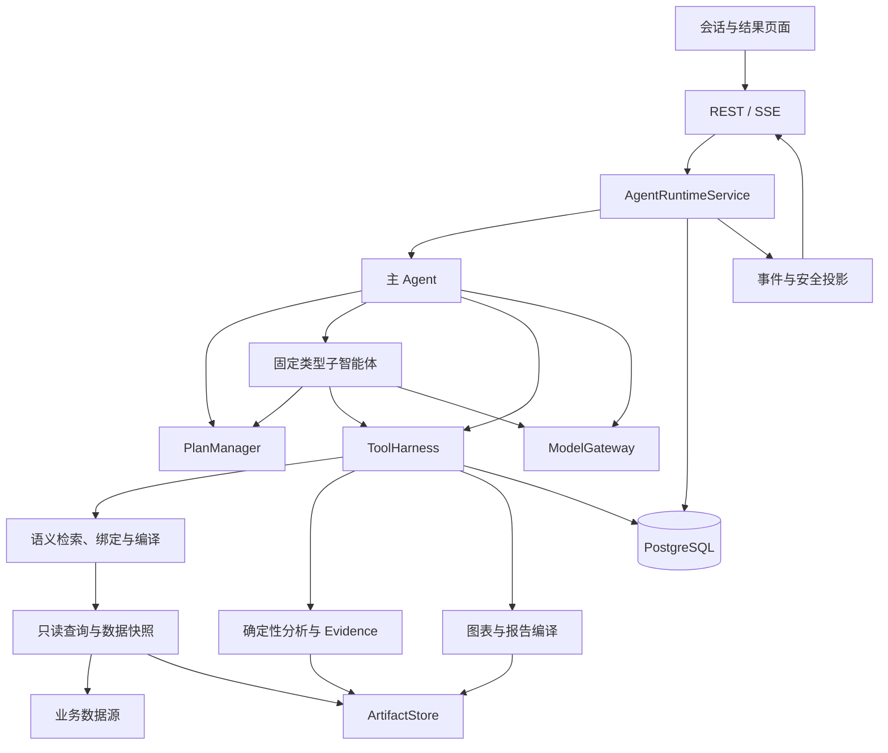

# C-智能问数总体架构

## 1. 架构范围

系统采用主 Agent、固定类型子智能体和业务计划。主 Agent 是用户交互与最终回答的唯一决策主体；子智能体执行局部查询、分析和报告任务。模型负责规划、工具选择和结果判断；确定性服务负责语义、权限、SQL、计算、证据与状态提交。

本文定义模块边界和端到端调用关系。领域细节由下表唯一维护，其他文档引用，不重复定义协议。

| 文档 | 权威范围 |
| --- | --- |
| A-Semantic Layer | 语义资产、发布合约、检索与编译算法 |
| B-智能问数方案 | 实施范围、模块交付、依赖与验收 |
| C1-Agent运行时详细设计 | Run、Agent、Plan、决策、子任务、确认与恢复 |
| C2-问题理解与语义查询详细设计 | QuestionContext、绑定、查询请求和快照执行 |
| C3-分析工具与自动下钻详细设计 | 工具、ResultSet、计算、Evidence 和下钻 |
| C4-会话、结果交付与前端事件详细设计 | REST、SSE、用户视图、回答、图表与报告 |
| C5-模型运行时与提示词详细设计 | 模型任务、路由、提示词和输出适配 |
| C6-公共协议、权限与可观测性详细设计 | 公共类型、身份、权限、错误与审计 |
| D-智能问数数据库设计 | 表、索引、事务、存储与清理 |

## 2. 业务边界

支持指标、明细、趋势、同比环比、排名占比、异常、维度贡献、公式分解、驱动分析、自动下钻和系统内报告。所有能力由发布语义资产声明；缺失资产或能力时明确返回不支持，不绕过语义层查询物理字段。

一个 Run 固定一个数据集、一个数据源、一个语义视图、一个发布版本及一个数据快照。用户独立追问创建新 Run；历史结果仅用于理解，结论使用新查询。报告只在明确请求时创建。监控使用同一执行架构，输出系统内通知。

明细最多 200 行，聚合最多 1000 行；总体分析可在数据源内全量计算后返回有界完整结果。查询结果不分页。自动下钻第 1～3 层可执行，第 4 层确认，第 5 层为硬上限。系统不提供模型生成 SQL、任意代码执行、公开分享或报告外部分发。

## 3. 总体结构

模型不能直接访问数据源或权威仓储。Runtime 经 ModelGateway 获取候选决策，经过校验才创建调用。PlanManager 只管理业务任务和依赖，不选择工具，不编译 SQL。

## 4. 模块与依赖

| 模块 | 所有权 | 依赖 |
| --- | --- | --- |
| Conversation / Delivery | 会话、用户视图、回答和内容制品 | Runtime 公开接口、结果读取、权限投影 |
| Agent Runtime | AgentInstance、计划、决策、确认、完成和恢复 | 模型 Gateway、工具 Harness、事件、仓储 |
| Question Understanding | QuestionContext、需求和约束 | 模型语言任务、语义检索、历史理解投影 |
| Tool Runtime | ToolDefinition、ToolCall、Attempt、Observation | 业务工具、权限、配额、快照 |
| Semantic Services | 编辑发布、绑定、能力、查询编译 | PermissionFacade、数据源元数据适配 |
| Query Execution | QueryExecution 与快照连接 | 编译产物、数据源只读连接、ArtifactStore |
| Analysis | 确定性计算、下钻候选、Evidence | ResultSet、analysis_contract |
| Model Runtime | 路由、Prompt、调用和 Schema 校验 | Provider 适配、受限配置 |
| Common | 公共类型、权限、错误、审计、Trace | 身份和策略服务 |

跨模块使用 Service 和稳定 DTO，不引用其他模块 ORM。模块部署在同一应用代码体系，通过独立进程隔离耗时任务；不要求以微服务拆分每个 Service。

## 5. 计划与执行关系

MainPlan 和 LocalPlan 共享业务步骤协议。计划结构有版本，步骤运行状态与结果单独存储。步骤包含业务描述、验收条件和依赖，不包含工具、参数或执行器。

执行单位关系：Run → AgentInstance → AgentDecision → ToolCall → ToolAttempt。子任务由 MAIN 的 delegate_task 创建独立 AgentInstance，其 LocalPlan 和结果归属该子任务。

同一 Agent 决策串行，工具及不同 Agent 可以并行。主步骤可等待多个子任务；ALL、ANY、REQUIRED 由独立等待订阅表达。模型响应只有通过当前代次、上下文和权限校验后才能生效。

## 6. 端到端流程

### 6.1 查询

1. API 创建消息和 CREATED Run，持久化准备触发器。
2. Runtime 取得额度，固定语义、权限和运行配置，生成 QuestionContext 与语义上下文。
3. MAIN 创建 MainPlan，程序计算 READY。
4. MAIN 调用 query_metric / query_detail，或委派 QUERY_AGENT 创建 LocalPlan。
5. 工具绑定意图，必要时请求语义确认；绑定通过后编译 SQL。
6. 查询执行服务取得当前 Run 数据快照，执行只读查询并保存 ResultSet、Evidence 与 Observation。
7. Agent 根据结果完成步骤或调整计划。
8. MAIN 提交 finish_run，系统校验需求覆盖、数字绑定和引用后原子提交回答与 FINISHED。

### 6.2 分析与下钻

MAIN 委派 ANALYSIS_AGENT；子 Agent 创建业务 LocalPlan，先取得比较数据，再调用确定性分析工具。下钻候选来自发布 analysis_contract，Agent 选择候选，explore_drilldown 执行固定查询与计算。子任务通过 finish_subtask 交付结果，MAIN 汇总最终回答。

查询和计算工具不自行创建计划或继续选择方向。用户确认通过主会话处理，确认后只恢复冻结调用或所属 Agent。

### 6.3 报告

用户明确请求报告后，MAIN 准备当前 Run 数据与 Evidence，再委派 REPORT_AGENT 组织内容。报告子任务不能查询数据源。ReportDocument、ChartSpec 和回答均使用结果引用及数字绑定，保存前校验。

## 7. 状态与一致性

RunStatus 唯一集合为 CREATED、RUNNING、WAITING_CONFIRMATION、FINISHING、FINISHED、FAILED、CANCELLING、CANCELLED。AgentPhase、步骤状态和子任务状态分别维护，详细迁移见 C1。

- 语义、模型、提示词和工具版本在 Run 内不可切换。
- 用户需求修订只来自正式交互命令；计划修改不能删除用户约束。
- 数据快照失效使原 Run 失败，重跑创建新 Run，不拼接新旧快照。
- 权限撤销阻止派发、结果提交和读取，权限扩大后使用新 Run。
- 业务状态、事件、审计和触发器同事务提交。
- 只读外部调用允许技术重试，正式业务结果最多提交一次。
- 取消最多等待 300 秒，迟到结果不能进入正式结果链。

## 8. 部署单元

使用相同应用构建产物，以不同进程角色部署：

| 进程 | 职责 |
| --- | --- |
| api | REST、SSE、读取视图和接收命令 |
| scheduler | Run 额度、触发器、任务领取、租约恢复和监控到期 |
| worker-model | 语言任务、主/子 Agent 模型调用 |
| worker-query | 编译后查询、结果写入 |
| snapshot-owner | 导出事务快照或持有串行查询连接 |
| worker-analysis | 分析、Evidence、图表和报告编译 |

PostgreSQL 保存状态和可靠任务；Redis 传递非权威唤醒；ArtifactStore 使用持久化卷保存不可变大对象。多进程必须共享同一受控制品存储；多主机部署必须提供共享持久化存储，不依赖各主机独立临时目录。

snapshot-owner 只维护业务数据源连接，不在元数据库内保持长事务。失联处理遵循 C2；不能通过新连接重建旧快照的身份。

## 9. 容量与性能约束

部署目标为 50 在线用户、100 活动 Run、单用户最多 5 个活动 Run、约 10 个数据源。CREATED 和 WAITING_CONFIRMATION 不占活动执行额度。每 Run 最多 3 个活动子任务、每决策最多 4 个调用；数据源连接与模型配额独立限制实际并行。

性能验收区分 API、调度、模型和查询：API 接受请求不等待外部调用；SSE 延迟从事件提交时计算；端到端耗时分别记录模型和业务数据源时间。容量测试必须包含资源不足时的排队、取消和恢复，不能仅测空 Run 吞吐。

## 10. 实施约束

首期以单数据源完整流程验证语义、权限、快照、工具、证据和交付，再扩展三类子任务、标准分析与下钻。实施顺序、模块并行条件和交付验收由 B 定义。数据库设计与协议同步修改，任何 DTO 变更必须更新对应 Schema、存储映射、事件投影及契约测试。
