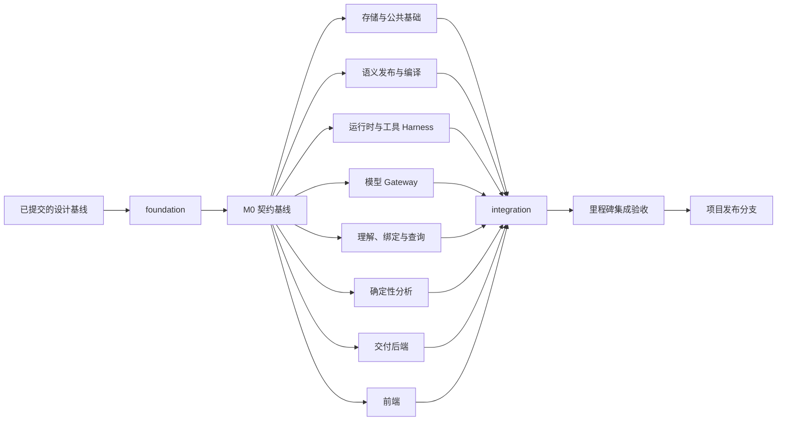

# E-智能问数 Git 工作树并行实施计划

## 1. 计划范围

本计划依据 A、B、C、C1～C6、D 十份技术文档，规定通过 Git worktree 实现模块并行开发的分支结构、文件所有权、依赖、合并顺序和验收条件。执行架构保持主 Agent、固定类型子智能体与业务计划，不调整业务协议。

本文中的目录为目标文件归属，不代表现有工程结构。启动实施时由基础分支建立目标目录与公开接口，其他分支不得自行创建同义目录或复制公共对象。

本计划只定义实施过程，不创建工作树、不执行代码开发、不修改数据库。工期以里程碑和依赖控制；人员数量、模型与数据源部署配置确定后再安排日期。

## 2. 分支与工作树结构

### 2.1 分支类型

| 分支 | 用途 | 写入规则 |
| --- | --- | --- |
| 项目发布分支 | 接收通过完整验收的里程碑版本 | 由集成负责人合并 |
| `codex/chatbi-integration` | 持续集成基线 | 只接收已审查的工作包 PR |
| `codex/chatbi-foundation` | 初始目录、公共契约、测试基础设施 | M0 初始基础分支 |
| `codex/chatbi-<module>-<milestone>` | 模块阶段交付 | 一个分支对应一个负责人和一个交付范围 |
| `codex/chatbi-contract-<change>` | 公共契约变更 | 先于依赖它的模块 PR 合并 |
| `codex/chatbi-migration-<change>` | 数据库迁移 | 由存储负责人串行维护 |

发布分支名称由启动记录指定，不预设为 main 或 master。工作包从已通过验收的 integration 提交创建，不从其他未合并工作分支创建。

每个活动分支使用独立工作树。同一分支不能在多个工作树同时检出。目录约定为仓库同级的 `chatbi-worktrees/<work-package-id>`，不把工作树嵌入源代码目录。

### 2.2 合并结构



工作树隔离文件修改，不隔离数据库、Redis、端口和外部账号。环境隔离遵循第 7 章。

## 3. M0：建立可并行开发的基础

### 3.1 M0-A：契约与目录基线

分支：`codex/chatbi-foundation`。

交付内容：

1. 按 C 的模块边界建立包目录、公开 Service 接口和依赖注入端口。
2. 将 A、C1～C6 的字段定义转换为 Pydantic 模型及 JSON Schema。
3. 定义控制函数、工具 Schema、事件目录、OpenAPI 和前端生成类型。
4. 明确 UnitOfWork、Repository、ArtifactStore、PermissionFacade、ModelGateway、QueryExecution 的接口。
5. 建立固定语义合约、两期数据、事件序列、模型响应和工具结果 fixture。
6. 提供遵循真实接口的测试替身；生产环境不得启用替身。
7. 建立代码检查、契约验证、迁移验证与模块测试入口。
8. 建立工作包记录模板和文件所有权清单。

退出条件：所有公共引用均可解析；Schema 禁止额外字段；JSON 示例通过校验；接口具备返回类型和错误语义；消费者能使用同一份 fixture 编写测试；目标目录和所有者固定。

M0-A 未完成时，只允许设计契约和测试样例，不同时编写互不兼容的模块实现。

### 3.2 M0-B：运行所需公共基础

M0-A 合并后，以下基础工作与业务模块可同时启动：

| 分支 | 交付 | 真实集成前必须满足 |
| --- | --- | --- |
| `codex/chatbi-storage-m0` | D 对应 ORM、初始迁移、UnitOfWork、仓储实现 | 跨对象事务、唯一约束和锁顺序测试通过 |
| `codex/chatbi-security-m0` | ActorContext、PermissionSnapshot、权限复核、错误与安全投影 | 权限拒绝和变更行为可验证 |
| `codex/chatbi-artifacts-m0` | 制品暂存、提交、完整性、清理、事件与审计基础设施 | 状态、事件、审计及制品引用可原子提交 |

业务模块此时使用 M0-A 的接口和替身独立开发。只有上述真实基础实现合并并通过测试，才能执行 M1 完整流程验收。

## 4. 模块工作树与文件所有权

目录均相对于仓库根目录。`<module>` 取 runtime、understanding、query、analysis、delivery、model、security 等已登记模块名。

| 工作包 | 主要所有权 | 禁止直接修改 |
| --- | --- | --- |
| CONTRACT | `backend/apps/chatbi/models/dto/`、语义 DTO、`contracts/`、生成脚本、共享 fixture | 业务算法与运行状态实现 |
| STORAGE | ORM、`backend/apps/chatbi/repository/`、语义仓储、`backend/alembic/`、UnitOfWork | DTO、业务状态转换规则 |
| SECURITY | `backend/apps/chatbi/services/security/`、权限与安全投影测试 | 查询 SQL 拼接、前端授权判断 |
| ARTIFACT | 制品服务、事件存储服务、审计实现及其测试 | 业务事件载荷定义 |
| SEMANTIC | `backend/apps/semantic/services/`、发布与编译测试 | 问题理解、Agent 计划、权限规则事实源 |
| RUNTIME | `backend/apps/chatbi/orchestration/agent_runtime/`、`services/tool_runtime/`、运行时测试 | Provider 适配、具体分析算法、DTO 副本 |
| MODEL | `backend/apps/chatbi/services/model_runtime/`、`prompts/`、Provider 适配和模型测试 | 控制函数 Schema、Run 状态写入 |
| QUERY | `backend/apps/chatbi/services/understanding/`、`services/query/`、快照适配与查询测试 | 语义 SQL 编译器、业务计划实现 |
| ANALYSIS | `backend/apps/chatbi/services/analysis/`、分析工具与算法测试 | ToolHarness、模型决策循环 |
| DELIVERY | `backend/apps/chatbi/services/delivery/`、模块 API 路由、后端交付测试 | Agent 状态机、前端生成类型 |
| WEB | `frontend/src/features/chatbi/`、页面与事件归并测试 | 后端协议、手工修改生成客户端 |
| INTEGRATION | 应用装配入口、进程入口、部署配置、全链路测试、工作包记录 | 未经模块负责人审查的内部实现 |

共享文件归属：

- 依赖清单、锁文件、根测试配置、CI 和部署入口：INTEGRATION。
- 公共 DTO、错误枚举、事件枚举、工具 Schema：CONTRACT。
- 数据库迁移与 ORM：STORAGE。
- 应用总路由、工具总注册表、依赖注入装配：INTEGRATION；模块提供注册函数，不自行修改总入口。
- C1 的业务状态与迁移规则：RUNTIME；STORAGE 只实现相应存储约束。
- A～D 设计定义：对应模块提出变更，CONTRACT 统一处理跨文档一致性。

文件越界不是由合并工具自动决定。确需修改其他工作包文件时，先拆出所属工作包的前置 PR；不在多个工作树复制公共实现。

## 5. 工作包拆分与提交顺序

每个模块按可独立审查的阶段提交，不等待整个模块全部完成。下表中的依赖均指已合并的接口或实现版本。

| PR 编号 | 分支后缀 | 交付范围 | 开发依赖 | 合并或验收依赖 |
| --- | --- | --- | --- | --- |
| S1 | semantic-publication-m1 | 资产校验、发布版本、上下文检索 | M0-A | STORAGE、SECURITY |
| S2 | semantic-compiler-m1 | 单表和安全维表编译、权限注入、结果 Schema | M0-A | S1、SECURITY |
| R1 | runtime-core-m1 | Run、Agent、MainPlan、步骤与单轮决策 | M0-A | STORAGE、事件审计基础 |
| R2 | runtime-tools-m1 | Harness、租约、幂等、取消、完成事务 | R1 接口 | R1、ARTIFACT、SECURITY |
| L1 | model-gateway-m1 | 路由、语言任务、主 Agent 调用、重试和校验 | M0-A | 契约与 Provider stub 测试 |
| Q1 | query-understanding-m1 | QuestionContext、绑定、时间和值、歧义 | M0-A | L1、S1 |
| Q2 | query-snapshot-m1 | PostgreSQL 快照、查询执行、完整性和结果 | M0-A | S2、STORAGE、ARTIFACT、SECURITY |
| A1 | analysis-evidence-m1 | QUERY_FACT、SEMANTIC_FACT、证据路径校验 | M0-A | ARTIFACT、STORAGE |
| D1 | delivery-core-m1 | 会话、Snapshot、SSE、数字绑定回答 | M0-A | R1/R2、A1、SECURITY |
| W1 | web-core-m1 | 会话、计划、确认、结果与重连 | M0-A | D1 真实 API |
| I1 | integration-m1 | 装配单指标完整流程及故障测试 | 上述契约 | S2、R2、L1、Q1/Q2、A1、D1、W1 |
| R3 | runtime-subagents-m2 | 三类子任务、LocalPlan、等待和回传 | M1 基线 | 子任务故障与可见性测试 |
| Q3 | query-followup-m2 | 历史实体指代、两期查询、MySQL 快照 | M1 基线 | 新 Run 重查与 MySQL 一致性测试 |
| A2 | analysis-standard-m2 | 对比、趋势、排名占比 | M1 基线 | Q3 输出契约及真实数据测试 |
| D2/W2 | delivery/web-subagents-m2 | 子任务视图、标准图表、追问交互 | M1 基线 | R3、A2、Q3 |
| S3 | semantic-analysis-m3 | 分析合约、多事实和扩展指标编译 | M2 基线 | 发布及编译数值验证 |
| A3 | analysis-attribution-m3 | 异常、贡献、公式和驱动 | M2 基线 | S3、完整输入 ResultSet |
| A4 | analysis-drilldown-m3 | 候选、会话合并、深度和停止 | A3 接口 | A3、R3、S3 |
| D3/W3 | delivery/web-report-m4 | 报告、反馈、软删除和通知 | M3 基线 | REPORT_AGENT、权限与制品服务 |
| R4 | runtime-monitor-m4 | 低优先级监控和重复调度防护 | M3 基线 | 通知接口、取消和权限测试 |
| I4 | integration-release-m4 | 部署、压测、清理和升级验证 | M3 基线 | 全部 M4 工作包 |

表中合并依赖不是禁止提前编码。依赖尚未合并时，消费者使用冻结契约和测试替身；不得把“替身测试通过”记录为真实功能验收通过。

## 6. 跨模块事务与装配

### 6.1 事务所有权

STORAGE 提供共享 UnitOfWork，业务管理器拥有事务边界。仓储方法不自行 commit；同一用例通过同一 UnitOfWork 访问 Run、调用、结果、事件和审计仓储。

| 事务 | 业务所有者 | 参与模块 |
| --- | --- | --- |
| Run 创建 | RUNTIME | DELIVERY、STORAGE、事件审计 |
| 决策和 PlanPatch 提交 | RUNTIME | MODEL 输出、STORAGE、配额 |
| 工具正式结果提交 | RUNTIME / ToolHarness | QUERY 或 ANALYSIS、ARTIFACT、STORAGE、事件审计 |
| 子任务结果回传 | RUNTIME | STORAGE、Observation、等待订阅 |
| 回答终态提交 | RUNTIME / FinishManager | DELIVERY 校验、STORAGE、事件审计 |
| 语义发布 | SEMANTIC | STORAGE、SECURITY、检索文档 |

工具返回待提交产物，由 Harness 统一完成正式提交；分析工具不能在自己的连接中提前发布 Evidence。制品先暂存再提交引用，遵循 D。

### 6.2 模块装配交付

每个模块 PR 提供公开构造函数、依赖列表、注册函数和模块测试。INTEGRATION 在集中入口绑定真实实现。缺失必需实现时启动明确失败；测试替身只在测试装配中注册，不作为生产 fallback。

## 7. 工作树环境隔离

每个工作树包含独立的本地配置，配置文件不提交凭证。环境标识使用工作包 ID，记录在实施台账。

| 资源 | 隔离规则 |
| --- | --- |
| Python / 前端依赖 | 每工作树独立虚拟环境和安装目录；包下载缓存可共享 |
| PostgreSQL 元数据库 | 每工作树独立数据库与限定权限用户，禁止连接共享联调库执行迁移 |
| 业务测试数据库 | QUERY / SEMANTIC 使用独立实例或独立测试库；快照与并发写入测试不得共享数据 |
| Redis | 每工作树独立实例或 DB；键前缀、Stream/Channel 名包含环境标识 |
| ArtifactStore | 每工作树独立根目录，禁止共用清理目录 |
| API / 前端端口 | 由环境台账分配，启动前检查冲突 |
| 模型账号与预算 | 单独配置测试额度；默认测试使用 Provider stub，真实调用显式启用 |
| 集成环境 | 只运行 integration 已合并提交；禁止挂载未提交的模块代码 |

故障测试、迁移、取消和清理任务只能操作所属环境。多个工作树共用一个 PostgreSQL schema 不满足隔离要求。

## 8. Git 操作流程

以下命令是实施模板，不在编写计划时执行。启动人提供已提交设计文档的基线 commit SHA。未提交文件不会自动进入其他工作树，必须先形成设计基线提交；不得通过复制各工作树未提交文件代替版本同步。

### 8.1 创建集成工作树

```bash
# 指定已审查的设计基线提交。
CHATBI_BASE_SHA='<设计基线提交 SHA>'
CHATBI_WORKTREE_ROOT='<仓库同级工作树目录的绝对路径>'

git worktree add -b codex/chatbi-integration \
  "$CHATBI_WORKTREE_ROOT/integration" "$CHATBI_BASE_SHA"
```

### 8.2 创建模块工作树

```bash
# 使用已通过契约验收的集成提交，不使用其他未合并功能分支。
CHATBI_CONTRACT_SHA='<M0-A 集成提交 SHA>'

git worktree add -b codex/chatbi-runtime-core-m1 \
  "$CHATBI_WORKTREE_ROOT/runtime-core-m1" "$CHATBI_CONTRACT_SHA"

git worktree add -b codex/chatbi-model-gateway-m1 \
  "$CHATBI_WORKTREE_ROOT/model-gateway-m1" "$CHATBI_CONTRACT_SHA"
```

通过远程 PR 协作时，启动记录指定远程名，并发布 integration 与工作包分支。不得假设远程一定名为 origin。

### 8.3 同步与提交

1. 工作包保存 base_commit、contract_version、migration_head 与所有权路径。
2. 开发者只提交本工作包路径；新增依赖、Schema 和迁移提交前置 PR。
3. 本地检查通过后，提交以 integration 为目标的 PR，说明依赖 PR 和未完成能力。
4. PR 合并前将已测试的 integration 提交合入工作分支并解决冲突，保留公开分支历史。
5. 在候选合并结果上运行相关模块和消费者测试，再串行合并。

共享分支不 rebase 或强制推送。私有未发布分支可整理提交，但不得改写其他工作包已依赖的提交。消费者不 cherry-pick 尚未合并的生产者代码；共同依赖先提取为前置 PR。

### 8.4 工作树结束

工作包 PR 合并且验证完成后记录 merge_commit。确认该工作树无未提交内容、无独有未合并提交、无活动进程后，使用 `git worktree remove` 移除。分支删除和测试环境清理由负责人执行，不使用强制删除绕过状态检查。

## 9. 合并队列与契约变更

### 9.1 合并次序

同一里程碑内优先合并：契约 → 迁移和公共基础 → 服务实现 → 消费者实现 → 集中装配 → 全链路验收。

同一层无依赖 PR 可以并行审查，但向 integration 的合并串行执行。每次合并后基础检查必须保持通过；失败时停止后续合并，修复或 revert 导致失败的提交。revert 代码前评估已执行迁移，不把代码回退等同于数据库自动回退。

### 9.2 契约变更流程

变更记录必须包含：权威文档章节、变更原因、生产者、消费者、字段和错误码影响、存储影响、兼容策略、测试样例。

- 兼容性新增：先合并带默认值的契约和消费者兼容处理，再启用生产者输出。
- 破坏性变更：同一个集成变更集更新生产者、消费者、存储与事件；全部通过后切换 major 版本。
- 仅修改生成 Schema 或前端类型而不修改来源模型的 PR 不合并。
- 不通过新增 `dict[str, Any]`、忽略未知字段或静默默认值绕过契约冲突。

### 9.3 迁移流程

仅 STORAGE 创建迁移文件并分配迁移依赖。其他工作包提交表字段需求，不自行建立多个迁移 head。每次迁移验证空库升级、前一里程碑升级、约束与并发行为。不能安全降级的迁移明确标记，使用前向修复；不得以清空业务表作为回退方案。

## 10. 里程碑验收

| 基线 | 通过条件 | 允许启动的下一阶段 |
| --- | --- | --- |
| M0-A | 共享契约、接口、fixture、目录所有权通过 | 所有模块独立开发 |
| M0-B | 真实事务、权限、制品、事件与审计通过 | M1 真实联调 |
| M1 | 单指标完整流程、确认、取消、过期输出隔离、SSE 重连通过 | 子任务和标准分析 |
| M2 | 三类子任务、等待策略、两期分析、图表、历史实体重查通过 | 归因与下钻 |
| M3 | 分解对账、算法定义域、候选合并、深度确认和停止通过 | 报告、监控与发布验证 |
| M4 | 全功能、权限、故障、迁移、容量和清理通过 | 合并项目发布分支 |

验收执行 B 第 7～9 章，不重复设定不同的业务阈值。基础内部性能目标为命令接口 p95 ≤ 500 ms、事件提交至 SSE 可读 p95 ≤ 1 s、空闲额度下领取 p95 ≤ 1 s。真实模型与数据源耗时独立记录。

分支完成定义：实现、模块测试、消费者契约测试、所有权检查、迁移影响说明和 PR 审查全部完成。里程碑完成定义：真实实现装配与全链路验收通过。两种完成状态不能混用。

## 11. 人员与并行度安排

工作包不等于必须同时运行的工作树数量。只为正在执行的工作包创建活动工作树。

四个执行席位时采用以下分配；集成负责人兼任席位 A：

| 阶段 | 席位 A | 席位 B | 席位 C | 席位 D |
| --- | --- | --- | --- | --- |
| M0-A | 契约与目录 | 配合审核，不独立修改公共文件 | fixture 需求 | 前端事件样例需求 |
| M0-B / M1 前段 | 存储、权限、制品基础 | 语义发布与编译 | 运行时 | 模型 Gateway，完成后问题理解 |
| M1 后段 | 集成、交付后端 | 快照查询及语义联调 | Harness、证据提交与故障 | 前端与理解联调 |
| M2 | 集成与交付 | 追问、两期与 MySQL | 子任务与等待 | 标准分析与图表 |
| M3 | 集成与交付 | 扩展编译与分析合约 | 下钻会话和确认 | 异常、公式与贡献 |
| M4 | 发布和运维 | 数据正确性与迁移 | 监控、恢复与清理 | 报告与前端验收 |

一个席位切换模块时关闭或暂停前一工作包，不同时成为多个未完成共享文件的写入者。人员更多时，优先拆开存储、安全、交付后端和前端；不能通过增加人员取消契约与真实集成依赖。

关键依赖链为：M0 契约 → 发布合约 → 查询编译与快照 → 正式 ResultSet / Evidence → 完成校验与交付。运行时、模型和前端可以提前并行，但不能替代该链的真实数据正确性验收。

## 12. 工作包任务模板

每个工作包保存以下记录，路径为 `implementation/work-packages/<id>.md`：

| 字段 | 必填内容 |
| --- | --- |
| id / owner | 唯一工作包 ID、负责人 |
| branch / worktree | 分支、工作树绝对路径 |
| base_commit / contract_version | 起点提交与契约版本 |
| design_refs | 权威技术文档和章节 |
| scope / excluded_scope | 本次交付与不包含功能 |
| owned_paths / shared_changes | 可修改目录、前置共享文件 PR |
| dependencies | 开发依赖、合并依赖、真实验收依赖 |
| public_interfaces | 生产和消费的 DTO、Service、事件 |
| fixtures / environment | fixture 版本、独立环境标识 |
| acceptance | 可执行验收用例和通过条件 |
| migration / rollback | 存储变化、升级和回退限制 |
| status / evidence | NOT_STARTED / DEVELOPING / REVIEW / MERGED / VERIFIED；测试报告和提交引用 |

任务指令必须要求中文代码注释、小范围修改、统一业务不变量入口、明确错误、禁止可选导入失败对象赋值为 None。不得要求开发者在冲突时自行选择另一种架构。

## 13. 启动清单

1. 将 A～E 文档作为一次已审查设计基线提交。
2. 记录发布分支、远程名、基线 SHA、工作树根目录和集成负责人。
3. 创建 integration 与 foundation 工作树。
4. 完成 M0-A 契约和文件所有权验收，记录不可变基线 SHA。
5. 按人员容量创建基础设施与模块工作树，分配独立环境。
6. 按 PR 依赖和合并队列持续集成，逐里程碑完成真实验收。

基础设施、测试替身和实际模块完成状态均记录在工作包台账。未通过的能力不得在发布注册表中启用。
