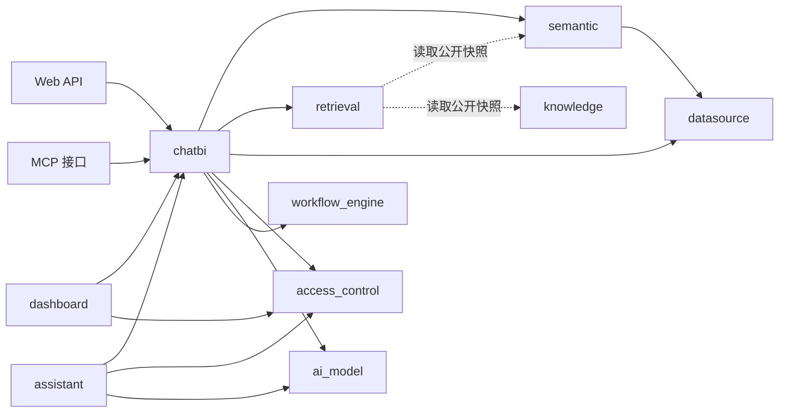

# SQLBot 后端迁移变更日志（append-only）

> 本文件由 2026-07-19 架构评审 R0 批次建立（评审文档见 docs/tech/12/13/14）。
> 以下第一部分是当日 `DDD_MIGRATION_PLAN.md` 的完整冻结存档（含 P0–P5 全部 43 批实施日志），保持原文未删改；
> 此后每个批次的实施记录以小节形式追加在文件末尾，现行计划见 `DDD_MIGRATION_PLAN.md`。

---

# 第一部分：2026-07-19 计划全文冻结存档

# SQLBot 后端 DDD 分阶段迁移方案

> 状态：实施中
> 日期：2026-07-18  
> 适用范围：`backend/apps/` 业务代码及其直接依赖  
> 目标读者：后端开发人员、架构负责人、测试人员和后续维护人员

## 1. 目标与范围

### 1.1 背景

SQLBot 后端已经形成数据源接入、语义建模、统一检索、对话问数、Agent、Graph 工作流、仪表板和嵌入式助手等能力。随着功能增加，当前目录逐渐同时使用业务名称、技术名称和历史名称，部分模块之间出现双向依赖，同一业务能力也存在新旧实现并存的情况。

当前 `semantic` 已经开始按照 `api/services/repository/models` 结构迁移，为其他业务模块提供了可参考的分层方式。但 DDD 改造不能只统一目录形式，还需要明确每个领域拥有的数据、业务规则、公开契约和事务边界。

### 1.2 迁移目标

本次迁移需要达到以下目标：

1. 以业务能力划分领域，不再把 `crud`、`db`、`template`、`capabilities` 等技术职责当成业务领域。
2. 每类业务数据只有一个权威归属，消除术语、问数链路和权限判断的重复实现。
3. 领域内部遵循 `backend/apps/AGENTS.md` 约定，API、Service、Repository、ORM 和 DTO 职责清晰。
4. 跨领域只通过公开 Service、稳定 DTO、端口或领域事件协作，不直接使用其他领域的 ORM 和具体仓储。
5. Graph 和 Agent 可以作为不同执行方式存在，但必须共享问题理解、检索、SQL 编译、权限、执行和回答等业务能力。
6. 保持现有 API 和数据库迁移可控，采用小步迁移，不进行无关重构。
7. 建立依赖规则测试，防止迁移完成后重新出现循环依赖。

### 1.3 不在本次范围内的事项

本方案不要求在第一阶段完成以下工作：

- 不要求立即将现有数据库表名全部改为新的领域名称。
- 不要求为了形式完整建立空目录、空接口或没有实际用途的领域实体。
- 不要求将 SQLModel 全面替换为另一种 ORM。
- 不要求把 Graph 和 Agent 合并为一种运行机制。
- 不要求同步重写前端页面和全部外部 API。
- 不要求一次性移除所有兼容入口，但兼容入口只能转发到唯一业务实现。

### 1.4 文档中的状态定义

本文使用以下状态区分当前实现和目标设计：

| 状态 | 含义 |
| --- | --- |
| 已实现 | 当前工作区中已经存在并可定位到代码的能力 |
| 部分实现 | 已有主要结构，但边界、依赖或唯一实现尚未完全收敛 |
| 目标设计 | 本方案建议的最终职责和依赖方向，不能描述为当前已完成能力 |
| 迁移动作 | 为达到目标设计需要执行的代码、数据或测试调整 |

## 2. 当前架构评估

### 2.1 当前模块概况

`backend/apps/` 当前主要包含以下几类目录：

| 当前目录 | 当前主要职责 | 评估 |
| --- | --- | --- |
| `semantic` | 主题域、数据集、模型、指标、维度、术语、语义 SQL 编译 | 已形成较完整的领域分层，可作为业务领域保留 |
| `retrieval` | 统一检索契约、索引、召回、重排、门控和追踪 | 已具备独立生命周期，应作为支撑领域重整分层 |
| `chat` | 会话、记录、历史问数链路、结果和日志 | 属于 ChatBI 领域的一部分，不应独立承担完整问数流程 |
| `agent` | Agent Run、工具循环、澄清、事件和预算 | 是 ChatBI 的一种执行方式，不是独立业务领域 |
| `workflow` | ChatBI Graph 定义、节点、条件和能力适配 | 是 ChatBI 的另一种执行方式，不是通用工作流引擎本身 |
| `workflow_engine` | 通用图运行、节点调度、检查点、事件、交互和制品 | 属于运行平台，不应反向依赖具体 ChatBI 业务 |
| `datasource` | 数据源、物理表字段、导入、权限和推荐问题 | 混合了数据源领域、访问控制和知识资源职责 |
| `db` | 多数据库连接、元数据读取和 SQL 执行 | 是数据源基础设施，不是业务领域 |
| `system` | 用户、工作空间、AI 模型、助手、认证、API Key 和系统变量 | 职责过多，需要按业务生命周期拆分 |
| `data_training` | 问题、SQL 示例、关联资产和 Embedding | 实际是 SQL 示例知识，不是模型训练领域 |
| `terminology` | 旧术语维护和向量 | 与 `semantic` 中术语重复 |
| `dashboard` | 仪表板目录、画布和图表配置 | 可作为独立支撑领域保留 |
| `ai_model` | LLM、Embedding 客户端和模型工厂 | 与 `system` 中 AI 模型配置共同组成 AI 模型领域 |
| `capabilities` | 问题理解、语义检索、SQL 校验和执行 | 是 ChatBI 的能力端口与实现集合，不是领域 |
| `mcp` | MCP 登录、数据源列表和问数入口 | 是外部接口适配层，不拥有业务数据 |
| `template` | SQL、图表、分析、预测等提示模板 | 是 ChatBI 或 AI 模型相关资源，不是领域 |
| `settings`、`swagger` | 文件下载、旧术语模型、接口国际化 | 属于平台或接口支持，其中旧术语模型应清理 |

### 2.2 已有的良好基础

当前项目并非从零开始迁移，以下能力可以直接保留和演进：

1. `semantic` 已经区分 API、Service、Repository、ORM 和 DTO，并开始使用仓储接口隔离持久化。
2. `retrieval` 已经定义统一请求、资源、索引代次、查询决策和通道诊断，具备独立支撑领域的基础。
3. `workflow_engine` 已经形成运行模型、端口、仓储、事件和运行时结构，通用执行能力相对完整。
4. `workflow` 已通过能力网关调用问题理解、检索、SQL 和回答能力，方向上符合业务编排与能力实现分离的要求。
5. Agent 和 Graph 已开始共享 Semantic 与 Retrieval 能力，为收敛重复实现提供了基础。
6. 已有 Semantic、Retrieval、Workflow 和 Workflow Engine 测试，可以作为迁移回归基线。

### 2.3 主要问题

#### 2.3.1 目录不等于领域

当前 `db`、`template`、`capabilities` 和 `mcp` 都是技术职责或接口形式。如果直接按照现有目录实施 DDD，会把技术实现误认为业务边界，无法解决跨目录依赖和数据所有权问题。

#### 2.3.2 `system` 聚合了多个不同生命周期

`system/models/system_model.py` 同时定义 AI 模型、工作空间、成员关系、助手、认证和 API Key。它们的创建条件、权限规则、调用方和变更原因不同，不应继续由一个宽泛的 `system` 领域统一管理。

#### 2.3.3 同一业务数据存在多个事实源

迁移开始时存在以下术语模型：

- `terminology.models.Terminology`
- `semantic.models.orm.SemanticTerm`
- `settings.models.term_model`

多套术语模型会导致维护入口、Embedding、关联资产和查询结果不一致。2026-07-18 已确认
`settings.models.term_model` 没有运行时和 Alembic 引用，但该文件可能是尚未提交的工作区内容，当前保留；
后续仍需完成旧 Terminology 与 SemanticTerm 的数据和入口合并。目标状态必须只保留 Semantic 术语一个权威实现。

#### 2.3.4 问数业务能力存在多条实现链路

当前存在旧 `chat/task/llm.py`、Agent 工具链和 Graph 能力适配。Graph 和 Agent 可以保留不同的规划与运行方式，但不能各自维护 SQL 校验、权限应用、检索和执行规则。旧 Chat 链路也不能长期作为第三套独立能力实现存在。

#### 2.3.5 通用运行平台反向依赖具体业务

`workflow` 依赖 `workflow_engine` 是合理方向，但 `workflow_engine/api/service.py` 又直接导入 `chat`、`semantic` 和 `workflow`。这使通用引擎无法独立复用，也形成双向依赖。

业务图定义、ChatRecord 投影和 Semantic 数据集解析应由 ChatBI 应用层组装，不应放入通用工作流引擎。

#### 2.3.6 基础设施反向依赖业务模块

`apps/db/db.py` 直接导入 Datasource ORM、Assistant DTO 和 System Service。数据库连接工具因此无法作为稳定基础设施使用，也会把 Assistant 的外部数据源逻辑传播到普通数据源执行代码。

目标状态应由 Datasource 领域定义连接和查询端口，再由不同连接适配器实现本地数据源、外部助手数据源和 Elasticsearch 等连接方式。

#### 2.3.7 跨领域直接使用 ORM

当前 Chat、Workflow Engine、System 权限、Dashboard 和 Retrieval 等模块会直接导入其他模块的 ORM。这样调用方会依赖对方的表结构和查询方式，任何字段调整都会扩散到多个领域。

跨领域接口应返回 DTO 或明确的引用对象，例如只传递 `dataset_id`、`datasource_id`、`tenant_id` 和经过授权的资源范围，而不是传递 SemanticDataset、CoreDatasource 或 UserModel。

#### 2.3.8 Service 和 API 中存在数据库与事务逻辑

部分 API 和 Service 直接创建 Session、拼接 SQL、查询 ORM 并提交事务，与 `backend/apps/AGENTS.md` 中的分层规则不一致。迁移时不能只移动文件，需要把查询和事务同时收敛到仓储实现。

### 2.4 当前依赖关系结论

根据当前 Python 静态导入关系，`ai_model`、`capabilities`、`chat`、`data_training`、`datasource`、`db`、`retrieval`、`semantic`、`system`、`template`、`terminology`、`workflow` 和 `workflow_engine` 处于同一个大的循环依赖组。

这说明迁移的首要任务不是统一目录名，而是建立以下稳定边界：

1. ChatBI 对外提供统一问数入口。
2. Semantic 对外提供语义资产读取、编译和变更契约。
3. Retrieval 对外提供索引和检索契约。
4. Datasource 对外提供元数据和受控查询契约。
5. Access Control 对外提供身份、资源授权和数据策略契约。
6. Workflow Engine 只提供通用运行能力。

## 3. 领域划分

### 3.1 划分原则

领域边界依据以下因素确定：

- 是否拥有独立的业务数据和状态生命周期。
- 是否包含只能在一个位置表达的业务不变量。
- 是否有明确的创建、修改、启用、删除和查询行为。
- 是否可以通过稳定契约被其他领域调用。
- 是否会因为不同原因独立变化。

最终建议形成 2 个核心领域、7 个支撑领域和 1 个通用运行平台。

### 3.2 核心领域

#### 3.2.1 `semantic`

Semantic 负责把物理数据结构转换为稳定的业务语义，是 ChatBI 正确生成和执行查询的核心事实源。

**拥有的数据**

- 主题域
- 数据集
- 语义模型和模型关系
- 模型字段和度量
- 指标
- 维度和受控维值
- 业务术语
- 资产别名和资产关系
- 数据集模型及资产配置

**业务不变量**

1. 同一租户和业务范围内，业务名称必须满足唯一性约束。
2. 指标和维度必须关联有效模型，数据集只能引用已允许的语义资产。
3. 模型关系必须引用同一主题域中的有效模型，并通过统一规则校验 Join。
4. SQL 编译只能使用经过检索门控和权限放行的资产 ID。
5. 术语只能有一个权威事实源，关联指标和维度必须可验证。
6. Schema 版本变化必须可触发检索索引更新，但 Semantic 不直接操作 Retrieval 内部表。

**公开能力**

- 语义资产维护 Service
- 数据集 Schema 查询
- 语义资产快照或变更通知
- 语义查询编译
- 数据源物理元数据映射

**不负责**

- 不负责向量索引的存储和召回。
- 不负责数据库连接和 SQL 实际执行。
- 不负责用户会话和问数流程。

#### 3.2.2 `chatbi`

ChatBI 负责从用户问题到可展示结果的完整业务流程，是系统对外提供智能问数能力的核心领域。

**拥有的数据**

- 会话
- 会话记录
- 问数结果和状态
- 问数步骤日志与模型用量记录
- Agent Run、Step、Trace 和 Clarification
- 与会话关联的 Graph Run 引用或投影

**业务不变量**

1. 每次问题执行必须属于明确的租户、用户和会话上下文。
2. 问题理解结果是检索规划的唯一自然语言输入，不允许不同执行方式重复改写并产生不同资产绑定。
3. SQL 编译只能使用 Retrieval 明确放行的 Semantic 资产。
4. 执行前必须依次完成 SQL 安全校验和数据权限应用。
5. Graph 和 Agent 必须共享相同的能力实现和权限规则。
6. 一条会话记录只能有一个最终状态，暂停、恢复、失败和取消必须有确定状态转换。
7. 大结果集不得无限写入会话表，应通过制品引用或受控摘要保存。

**公开能力**

- 创建和管理会话
- 发起问数、流式问数和继续澄清
- 查询执行状态、事件和结果
- 生成分析、预测和推荐问题
- 删除会话及其执行记录和制品

**内部执行方式**

- Graph：确定性流程、条件路由和暂停恢复。
- Agent：受控工具循环和模型规划。

Graph 和 Agent 是 ChatBI 内部执行方式，不对其他领域暴露内部模型。

### 3.3 支撑领域

#### 3.3.1 `datasource`

Datasource 负责外部数据连接及其物理元数据，是 Semantic 建模和 ChatBI 查询执行的基础。

**拥有的数据**

- 数据源连接定义
- 物理表和字段缓存
- 表字段选中状态和自定义注释
- 物理表关系或外键元数据
- Excel 导入产生的数据源信息

**业务不变量**

1. 数据源必须属于明确工作空间，连接配置必须经过加密存储和受控解密。
2. 连接检测、元数据同步和查询执行必须使用同一连接类型解析规则。
3. 表和字段必须属于对应数据源，元数据同步不能产生跨数据源引用。
4. 查询和预览必须经过调用方授权，Datasource 不自行推断用户权限。
5. 数据库驱动错误必须显式返回，不得静默返回空结果。

**公开能力**

- 数据源维护
- 连接检测
- 物理元数据发现与同步
- 受控数据预览
- 受控 SQL 执行网关

`apps/db` 中的多数据库实现应迁入 Datasource 的仓储或连接适配实现，不再作为独立领域。

#### 3.3.2 `knowledge`

Knowledge 负责维护可用于问数规划和回答的人工知识资源。

**拥有的数据**

- SQL 示例
- 问题示例
- 推荐问题
- 未来的文档、FAQ 和结构化知识资源
- 示例与数据集、数据源、Semantic 资产的引用关系

**业务不变量**

1. SQL 示例必须标明租户、适用数据集或数据源和启用状态。
2. 可用于执行参考的 SQL 示例必须经过验证，并在使用时重新通过当前权限和 Semantic 编译校验。
3. 推荐问题只负责展示建议，不直接作为已授权查询执行。
4. Knowledge 拥有源内容，Embedding 和检索单元属于 Retrieval 的派生数据。

旧 `data_training` 应迁入本领域并使用 SQL 示例或问题示例等准确名称。

#### 3.3.3 `retrieval`

Retrieval 负责把多个领域的公开资源投影为统一索引，并提供可观测、可判歧义的检索结果。

**拥有的数据**

- 检索来源
- 检索资源和检索单元
- Embedding
- 索引代次和索引任务
- 查询追踪和通道诊断
- 检索策略版本

**业务不变量**

1. 检索结果必须携带稳定资源 ID、来源、版本和权限范围。
2. 权限、租户、数据集和资产状态必须在召回前过滤。
3. 向量相似度不能单独证明语义资产绑定正确。
4. 新索引必须完整构建成功后才能原子激活，失败时保留旧的活动代次。
5. 索引是派生数据，必须可重建和回滚。
6. 检索通道不可用时必须返回明确诊断，未知异常不能静默降级。

**公开能力**

- 注册和同步检索来源
- 重建、激活和回滚索引代次
- 按 Profile 执行统一检索
- 返回绑定结果、证据和诊断

Retrieval 可以通过适配器读取 Semantic 和 Knowledge 的公开快照，但不得直接修改它们的源数据。

#### 3.3.4 `access_control`

Access Control 负责确认调用者身份、工作空间范围和数据访问策略。

**拥有的数据**

- 用户和第三方身份绑定
- 认证配置
- 工作空间和成员关系
- API Key
- 角色和资源授权关系
- 行权限和列权限规则
- 系统变量及用户变量值

**业务不变量**

1. 每个受保护请求必须解析为明确调用者和当前工作空间。
2. 用户只能访问当前工作空间授权范围内的资源。
3. API Key、助手密钥和登录令牌必须有明确的状态和失效规则。
4. 行列权限必须在 SQL 执行前形成确定的数据访问策略。
5. 权限规则缺失、字段失效或变量无效时不能默认放行。
6. 权限判断只能有一个统一入口，API 装饰器不能自行查询其他领域 ORM。

**公开能力**

- 身份认证和当前调用者解析
- 工作空间成员管理
- 资源授权判断
- 数据访问策略解析
- API Key 管理

Datasource 和 ChatBI 只能消费权限判断结果，不直接读取 Access Control 的内部表。

#### 3.3.5 `ai_model`

AI Model 负责模型供应商配置和运行时模型客户端创建。

**拥有的数据**

- 模型供应商
- 模型类型和基础模型名称
- API 地址和加密凭据
- 默认模型状态
- 模型能力配置

**业务不变量**

1. 同一模型配置必须具有明确类型、协议和状态。
2. 默认模型只能从可用模型中选择，并保持唯一。
3. 模型连接测试和运行时客户端必须使用同一配置解析逻辑。
4. API Key 不应传播到 ChatBI DTO、日志或检索结果。
5. LLM 和 Embedding 的模型选择必须显式，配置错误不得静默使用其他模型。

`system` 中的 AI 模型 API 和 ORM 应与当前 `apps/ai_model` 合并为一个领域。

#### 3.3.6 `assistant`

Assistant 负责发布和管理可供外部使用的问数助手应用。

**拥有的数据**

- 助手名称和说明
- 应用 ID 和应用密钥
- 允许访问的数据源或数据集范围
- 外部来源配置
- 允许的来源域名
- 自定义模型选择

**业务不变量**

1. 助手必须属于明确租户，并绑定可访问的数据范围。
2. 应用密钥必须唯一、可禁用并避免明文扩散。
3. 助手的自定义模型必须引用有效 AI Model 配置。
4. 外部数据源接口失败必须显式返回，不能自动切换到其他来源。
5. Assistant 只负责发布配置，实际问数通过 ChatBI 公开服务执行。

MCP、嵌入页面和普通 Web API 是不同接口形式，不属于 Assistant 的内部业务模型。

#### 3.3.7 `dashboard`

Dashboard 负责保存和展示问数结果形成的仪表板内容。

**拥有的数据**

- 仪表板和目录树
- 画布布局
- 组件配置
- 图表配置
- 结果或查询引用

**业务不变量**

1. 仪表板必须属于明确工作空间和创建者。
2. 同级资源命名规则必须由 Dashboard 统一校验。
3. 删除目录时必须明确子资源处理规则。
4. Dashboard 不直接读取 Chat ORM 或执行未经校验的原始 SQL。
5. 重新加载数据应通过受控查询能力，并再次应用当前权限。

### 3.4 通用运行平台

#### 3.4.1 `workflow_engine`

Workflow Engine 负责通用图流程运行，不负责 ChatBI 业务规则。

**拥有的数据**

- Workflow Definition
- Workflow Run
- Node Execution
- Checkpoint
- Event
- Interaction Request
- Artifact 及其清理状态

**平台不变量**

1. Workflow Definition 必须在发布前完成节点、边、条件和 Handler 校验。
2. Run 状态转换、租约、重试、暂停和恢复必须确定且可追踪。
3. 事件序列和检查点必须与 Run 进度一致。
4. 节点输出只能通过约定的 Context Patch 更新上下文。
5. Engine 不得导入 Chat、Semantic、Datasource 等业务领域。

ChatBI 负责提供图定义、Handler、条件和能力适配，并在应用装配层把它们注入 Workflow Engine。

### 3.5 不作为领域保留的目录

| 当前目录 | 目标归属 |
| --- | --- |
| `db` | `datasource` 的连接和查询基础设施 |
| `capabilities` | `chatbi` 的 Service、端口或适配实现 |
| `template` | `chatbi` 或 `ai_model` 的模板资源和模板读取实现 |
| `mcp` | `backend/interfaces/mcp` 外部接口适配 |
| `swagger` | `common` 或接口层的国际化支持 |
| `settings` | 平台配置或公共文件接口；其中旧术语模型删除 |
| `common/audit` | 跨领域审计基础设施，通过统一接口记录审计事件 |

## 4. 目标架构

### 4.1 领域关系



图中的实线表示运行时调用，虚线表示索引构建时读取公开资源。Semantic 和 Knowledge 的写入不依赖 Retrieval 具体实现，可以通过事件或抽象索引端口通知索引更新。

### 4.2 目标目录

```text
backend/
├── apps/
│   ├── access_control/
│   ├── ai_model/
│   ├── assistant/
│   ├── chatbi/
│   ├── dashboard/
│   ├── datasource/
│   ├── knowledge/
│   ├── retrieval/
│   └── semantic/
├── platform/
│   └── workflow_engine/
├── interfaces/
│   └── mcp/
├── common/
└── main.py
```

迁移期间可以暂时保留 `apps/workflow_engine` 和 `apps/mcp` 路径，先修正依赖方向，再移动目录。目录移动必须与调用方导入更新在同一阶段完成，不能长期保留两套实现。

### 4.3 领域内部结构

所有业务领域遵循 `backend/apps/AGENTS.md`，只创建实际需要的层：

```text
apps/<domain>/
├── api/
├── services/
├── repository/
│   └── <technology>/
├── models/
│   ├── orm/
│   └── dto/
├── utils/
├── errors.py
└── __init__.py
```

补充约束如下：

1. `api` 只接收请求、解析身份、组装依赖和映射错误。
2. `services` 负责业务流程和业务校验，只依赖仓储接口或其他领域公开契约。
3. `repository` 根目录定义领域需要的最小数据接口，技术子目录提供实现。
4. `models/orm` 只表示持久化结构，不能被其他领域直接导入。
5. `models/dto` 存放领域边界传输对象，同一契约只定义一次。
6. `utils` 只存放无外部副作用且真实复用的辅助函数。
7. 若 Graph 或 Agent 的内部代码较多，可以在 `chatbi` 下建立职责明确的 `orchestration/graph` 和 `orchestration/agent`，但业务 Service 仍是唯一实现。

### 4.4 ChatBI 目标结构示例

```text
apps/chatbi/
├── api/
│   ├── conversations.py
│   ├── queries.py
│   └── interactions.py
├── services/
│   ├── conversation_service.py
│   ├── query_service.py
│   ├── question_understanding.py
│   ├── query_planning.py
│   ├── sql_execution.py
│   ├── answer_service.py
│   └── deletion_service.py
├── orchestration/
│   ├── agent/
│   └── graph/
├── repository/
│   ├── conversation_repository.py
│   ├── execution_repository.py
│   └── sqlmodel/
├── models/
│   ├── orm/
│   └── dto/
├── errors.py
└── __init__.py
```

这里的 `orchestration` 只负责读取 ChatBI DTO、调用业务 Service 和推进状态，不重新实现检索、SQL 校验或权限逻辑。

### 4.5 跨领域契约

跨领域调用至少遵守以下规则：

| 调用方 | 被调用方 | 允许传递的内容 | 禁止传递的内容 |
| --- | --- | --- | --- |
| ChatBI | Semantic | 数据集引用、资产引用、编译请求和编译结果 DTO | Semantic ORM、具体仓储、数据库 Session |
| ChatBI | Retrieval | 检索请求、Scope、绑定结果和诊断 DTO | 检索表模型、内部索引查询对象 |
| ChatBI | Datasource | 连接引用、元数据请求、受控查询和查询结果 DTO | CoreDatasource ORM、原始连接对象 |
| ChatBI | Access Control | 调用者、资源引用、授权请求和数据策略 DTO | User ORM、工作空间 ORM、权限表模型 |
| ChatBI | AI Model | 模型用途、模型引用、调用请求和用量结果 | API Key、模型 ORM、供应商客户端实例 |
| Retrieval | Semantic/Knowledge | 公开资源快照、版本和变更事件 | 对方 ORM 和仓储实现 |
| Dashboard | ChatBI/Datasource | 已授权结果引用或受控查询请求 | Chat ORM、拼接后直接执行的 SQL |

### 4.6 应用装配位置

依赖装配保留在最外层：

- 各领域 API 可以创建本领域 Service 和具体仓储。
- 跨领域的完整问数装配由 ChatBI API 或明确的启动工厂负责。
- `apps/api.py` 只注册路由，不承载业务规则。
- Workflow Engine 的 Registry、RunStore、EventPublisher 和 ChatBI Handler 由 ChatBI 装配函数连接。
- 不允许通过函数内部导入隐藏循环依赖。

## 5. 迁移原则

### 5.1 小步迁移

每个阶段只处理一个明确边界，并同时完成代码、调用方、测试和旧实现清理。不能先复制一套新目录，再长期保留旧逻辑独立运行。

### 5.2 唯一实现

同一个业务能力只能有一个权威实现，例如：

- 术语维护只由 Semantic 提供。
- 问题理解只由 ChatBI 统一 Service 提供。
- Semantic Binding 只由 Retrieval 统一服务提供。
- SQL 语义编译只由 Semantic Compiler 提供。
- SQL 安全校验和执行入口只保留一个共享实现。
- 工作空间和资源权限只由 Access Control 判断。

Graph、Agent、MCP 和 Web API 只能调用这些实现，不能复制规则。

### 5.3 先建立契约，再迁移实现

需要跨领域复用的能力先定义最小 DTO 和端口，然后迁移具体实现。调用方改用新契约后，再移动 ORM、仓储和内部文件。

### 5.4 数据库表名与代码领域分开迁移

代码归属调整不要求立即修改表名。第一阶段可以继续使用 `headless_*`、`sys_*` 和 `core_*` 表名，只要 ORM 已归入正确领域。

表名调整必须单独设计数据库迁移、兼容窗口和回滚方案，不能与大规模代码移动同时进行。

### 5.5 事务边界

- 单领域写操作由该领域仓储或工作单元控制事务。
- 跨领域流程不共享数据库 Session。
- 需要跨领域一致性时，优先采用“本领域事务提交后发布事件”的方式。
- 如果事件暂时无法落地，应用 Service 可以顺序调用，但必须允许后续步骤失败后重试，不能伪装成原子事务。

### 5.6 错误处理

- 领域错误不包含 HTTP 状态码。
- API 负责将已知领域错误映射为接口响应。
- 未知异常直接失败并记录诊断，不使用宽泛异常捕获返回空数据。
- 可选依赖导入失败时使用明确抛出 `ImportError` 的存根类或惰性加载函数，禁止把导入失败对象设置为 `None`。

### 5.7 兼容入口

迁移期间保留旧 API 时，旧入口必须：

1. 只做参数转换和转发。
2. 不再执行独立查询和业务校验。
3. 有明确的调用方迁移清单和删除条件。
4. 通过测试证明新旧入口调用的是同一业务 Service。

## 6. 分阶段迁移计划

### 6.1 阶段 P0：建立迁移基线和依赖约束

**实施状态：已完成**

截至 2026-07-18，已新增 `tests/architecture/test_dependency_baseline.py` 和
`tests/architecture/known_dependency_violations.json`，完成以下依赖基线：

- P0 初始记录 40 条跨领域内部模型依赖；P1、P2 累计清理 12 条后当前为 28 条。
- P0 初始记录 29 条跨领域具体实现依赖；P1、P2 累计清理 10 条后当前为 19 条。
- 1 条跨领域 API 依赖。
- 6 条 Workflow Engine 对业务模块的依赖。
- P0 初始记录 10 条函数内部业务模块导入；P1 清理 1 条后当前为 9 条。

基线测试不把这些历史依赖视为合规设计。测试会阻止新增违规依赖；历史依赖被清理后，
对应基线也必须在同一变更中删除。P0 剩余工作是让首批调用方在实际迁移中采用公开契约；
不提前创建尚无调用方的共享 DTO。

当前重复能力的收敛决策如下：

| 能力 | 当前实现 | 保留和迁移决策 | 禁止继续扩展的实现 |
| --- | --- | --- | --- |
| 问题分类 | `workflow.capabilities.adapters.question.QuestionAdapter.classify` | 提取为 ChatBI 问题分类 Service，Graph Adapter 只转换上下文 | 旧 `chat/task/llm.py` 中的分类分支 |
| 问题重写、意图和澄清 | Agent 使用 ChatBI `QuestionUnderstandingService`，Graph 使用 `QuestionAdapter` 和 ChatBI 意图投影 Service | 保留 Graph 主题域、维度候选和并行子任务编排，继续迁移确定性校验与修复规则 | Graph Adapter 仍维护候选映射、重试与降级编排 |
| 语义绑定 | `retrieval.service.RetrievalService` | 作为唯一检索执行服务；Graph 和 Agent 只保留请求、响应转换 | `capabilities.semantic.retrieval` 中新增独立检索策略 |
| 数据集 Schema | `semantic.services.schema_service.SemanticSchemaService` | 作为唯一 Schema 读取 Service | 调用方直接使用 Semantic Repository 或 ORM 拼装 Schema |
| 语义 SQL 编译 | `semantic.services.sql_compiler.SemanticSQLCompiler` | 作为唯一编译器；ChatBI 统一组装编译请求 | Graph、Agent 和旧 Chat 各自生成规则 SQL |
| SQL 校验 | `capabilities.sql.validator.SqlValidateTool` | 迁入 ChatBI SQL Service 并由所有执行方式共享 | 在 Adapter 或 Agent Tool 中复制校验规则 |
| 数据权限 | `DataPolicyService` 统一解析真实行列权限和变量，旧 Chat、Datasource 预览及 Graph 运行时均使用 Access Control 公开入口 | 后续由 ChatBI 统一 SQL Service 消费稳定数据策略 DTO，Agent 迁移时必须接入同一入口 | 默认透传的 `PermissionTool`、旧 `datasource.crud.permission` 和独立变量解析 |
| SQL 执行 | `apps.db.db.exec_sql`、`SqlExecuteTool`、`SessionSqlExecutionGateway` | 建立 Datasource 查询网关作为唯一底层执行入口，ChatBI 统一串联权限和校验 | 旧 Chat、Graph、Agent 直接调用数据库函数 |
| 时间范围标准化 | `capabilities.time_slots` | 迁入 ChatBI 公共规则并保持一个实现 | Workflow Adapter 和问题理解各自维护时间规则 |
| 回答生成 | 旧 Chat 和 Graph `AnswerAdapter` 均有实现 | 先定义统一 Answer DTO，再提取 ChatBI AnswerService；迁移前不增加第三套实现 | Agent、Graph 节点中继续增加独立回答规则 |

现有 API 路径在迁移期间保持兼容，目标所有权如下：

| 当前 API 前缀 | 目标所有者 | 迁移要求 |
| --- | --- | --- |
| `/semantic` | Semantic | 保持主路径 |
| `/system/terminology` | Semantic | 转发到 SemanticTermService，前端迁移后删除 |
| `/system/data-training` | Knowledge | 保持兼容路径，内部改为 SQL 示例 Service |
| `/chat`、`/chat/agent`、`/graph` | ChatBI | 可以保留不同入口，但必须调用统一 ChatBI Service |
| `/datasource`、`/table_relation` | Datasource | API 保持兼容，Service 和 Repository 分层迁移 |
| `/recommended_problem` | Knowledge | 迁移所有权后保留短期兼容入口 |
| `/login`、`/user`、`/system/workspace`、`/system/apikey`、`/sys_variable` | Access Control | 第一阶段保持路径不变，只调整内部所有权 |
| `/system/aimodel` | AI Model | 第一阶段保持路径不变 |
| `/system/assistant` | Assistant | 第一阶段保持路径不变 |
| `/dashboard` | Dashboard | 保持主路径 |
| `/mcp` | 外部接口层 | 改为调用 Access Control、Datasource 和 ChatBI 公开 Service |

**目标**

在移动代码前明确当前行为、公开契约和禁止依赖，避免迁移过程中继续增加耦合。

**任务**

1. 固化现有 Semantic、Retrieval、Graph、Agent、Chat、Datasource 和权限测试基线。
2. 增加跨领域依赖检查脚本或测试，输出领域间导入关系和循环依赖。
3. 定义首批公开契约：当前调用者、资源引用、数据集引用、数据源引用、模型引用和查询结果。
4. 列出旧 Chat、Agent、Graph 对问题理解、检索、SQL、权限和回答能力的实现位置。
5. 为每项重复能力确定唯一保留实现和删除对象。
6. 记录当前 API 路径、数据库表和主要前端调用方。

**完成标准**

- 重复能力清单具有明确的保留方案。
- 依赖测试能够识别新增跨领域 ORM 导入。
- 后续阶段涉及的 API 契约有回归测试。
- 本阶段不改变业务行为。

### 6.2 阶段 P1：完成 Semantic 边界并统一术语

**实施状态：已完成**

截至 2026-07-18，已确认 `settings.models.term_model`、`term_schema_creator` 没有后端运行时和
Alembic 引用。由于这些文件不属于当前 `HEAD`，可能是尚未提交的工作区内容，本阶段保留并登记为
待确认项。`/system/terminology` 的查询、创建、更新、启停和删除已经切换到 Semantic；术语前端与
Excel 已迁入 `/semantic/terms`。旧 `apps/terminology` 业务实现已删除，只为当前 XPack 版本保留固定导入
路径，并将查询字段映射到 SemanticTerm；旧表只允许在 088 升级前由迁移脚本读取。外部 API 兼容窗口
仅保留 Semantic 内的转发路由。

本阶段已完成以下增量：

1. Semantic 数据集索引 Service 改为依赖 `DatasetIndexGateway`，不再由 Semantic 仓储直接创建
   Retrieval 协调器，也不再把 `SemanticDataset` ORM 传给 Retrieval。
2. 新增数据集索引版本、任务创建结果和重建结果 DTO；Retrieval 只消费 Semantic 的公开 DTO 与
   `DatasetSchema`。
3. 新增 `SemanticTerm.related_datasets` 和 087 数据库迁移。空数组表示作用于整个主题域，非空数组
   表示只进入指定数据集的运行时 Schema，并同步生成 `TERM -> DATASET` 资产关系。
4. 新增 `LegacyTermMigrationPlanner`，对租户、主题域、数据集、指标、维度、同名术语和数据源范围执行
   显式校验，输出总数、候选数、跳过数、冲突数和失败明细。
5. 新增 `scripts/migrate_legacy_terminology.py`。脚本默认只预检；只有显式传入 `--apply` 且冲突、失败
   均为 0 时，才在一个事务中写入 SemanticTerm 和资产关系。只有同时显式指定 `--purge-source` 才清理
   已核对的源记录；孤立或名称为空的子记录会阻止清理。重复执行时，相同目标术语会记为跳过。
6. 新增 088 删表迁移。迁移在旧表非空时明确失败，要求先完成预检、迁移和源数据清理。当前本地数据库
   预检为 0 条旧术语、0 冲突、0 失败，已按正式流程升级到 088，旧表已删除。
7. `SemanticTermService` 已统一执行名称清理、同主题域重名校验，以及数据集、指标、维度的租户和主题域
   引用校验；正常 API 写入与迁移规划不再使用两套引用规则。
8. 新增 `TermSearchResult` 和 `SemanticTermQueryService` 公开只读契约。查询只读取指定数据集的运行时
   Schema，按名称和别名进行确定性匹配，不读取旧 `terminology` 表，也不在失败时静默回退。
9. Agent 新记录继承会话绑定的 `dataset_id`，`search_terminology` 工具改为调用 Semantic 术语查询服务；
   未绑定数据集或服务未装配时返回明确错误。由此删除 1 条跨领域具体实现依赖和 1 条函数内部导入。
10. 术语迁移规划器已通过有效的 `SemanticDatasetModelConfig` 和 `SemanticModel.datasource_id` 建立
    租户隔离的数据源到数据集映射。映射缺失、无效，或旧记录已有数据集范围与解析结果不一致时，
    分别报告明确失败或冲突，不允许写入；预检报告会列出每个候选实际解析出的主题域和关联资产 ID。
11. 旧 Chat 中已经绑定 `dataset_id` 的记录改为通过 `ChatTermContextService` 调用
    `SemanticTermQueryService`，不再读取旧术语表；Semantic 查询为空或失败时不会回退旧实现。
12. 外部动态数据源 Assistant 类型 1、3 因不存在本地模型关系，显式拒绝绑定本地 Semantic 数据集；
    其他 Assistant 只有在请求提供并通过租户、数据集、模型和数据源校验后才建立绑定。未绑定数据集的
    Chat 不注入术语上下文，也不再读取旧表，由此删除 Chat 到旧术语具体实现的最后一条依赖。
13. `/system/terminology` 核心管理路径已迁入 `semantic/api/legacy_terms.py`。兼容层只转换旧响应字段，
    创建、更新、启停、批量删除和列表查询均调用 `SemanticTermService`，不再调用旧 CRUD 或写旧表；
    因此再删除 1 条旧术语 API 到 Chat 内部模型的依赖。
14. Semantic 术语管理现在可读取和启停禁用记录，批量删除先校验全部租户内引用，再在一次提交中清理
    术语主记录、别名和资产关系。应用启动已停止补旧术语向量，术语删除审计名称改为读取
    `headless_term`，避免后台任务和审计继续依赖旧事实源。
15. 新增 Semantic 术语 Excel 端口、Excel 仓储实现和应用服务，固定使用 `domain_id`、`name`、
    `aliases`、`description`、`dataset_ids`、`enabled` 六列。模板、导入、导出和失败明细工作簿均通过
    `/semantic/terms` 提供，导入逐行调用 `SemanticTermService`，不写旧表；旧 Excel 路径继续返回明确
    HTTP 409，防止旧数据源范围文件被误用。
16. 术语配置前端已直接调用 `/semantic/terms`，范围选择由数据源改为主题域和数据集，搜索、分页和批量
    删除不再依赖 `/system/terminology`。Semantic 资产页编辑术语时会保留并可调整数据集范围，同时保留
    既有关联指标和维度，避免全量更新 DTO 清空关系。
17. 删除审计的资源联合查询已统一使用本地 Semantic 实现。所有模块的删除审计不再通过 XPack 联合查询
    引用旧 `terminology` 表，解除旧表下线前的隐藏运行时依赖。
18. 删除无调用的旧术语 API、CRUD、旧 ORM 和术语专用 Embedding 后台入口。迁移脚本使用脚本内只读旧表
    映射；`apps/terminology` 仅保留当前 XPack 固定导入路径，导出的查询别名实际指向 `headless_term`，
    不映射旧表。架构基线同步减少 1 条跨领域内部模型依赖。

旧运行时模块和旧表迁移已经完成，当前只保留 `/system/terminology` 外部兼容路径。兼容写入会明确拒绝
数据源范围并要求有效 `domain_id`；旧 Excel 也已停止使用。目标环境升级 088 前必须先执行迁移脚本预检，
再显式使用 `--apply --purge-source`；只要旧表仍有记录，数据库升级就会中止，不会自动丢弃数据。
`specific_ds=true` 的历史记录在迁移预检中只会使用有效数据集—模型配置解析范围；数据源没有关联 Semantic
数据集时返回 `LEGACY_TERM_DATASOURCE_SCOPE_UNRESOLVED`，跨主题域或与已有 `dataset_ids` 不一致时返回冲突，
不能静默扩大术语范围。Agent、Chat、Assistant、动态数据源和术语管理运行时均已停止读取旧术语表。
完成外部调用确认后，可以删除最后的 Semantic 兼容路由和兼容 DTO、Service。

**目标**

把 Semantic 确立为语义资产唯一事实源，完成当前已开始的分层迁移。

**任务**

1. 完成 `semantic/api`、`services`、`repository`、`models/orm` 和 `models/dto` 的职责校验。
2. 清除 Semantic Service 对具体 SQLModel 仓储实现的直接依赖。
3. 将旧 `terminology` 数据映射到 SemanticTerm。已完成迁移规划、执行和源数据清理能力。
4. 将别名、数据集范围和关联资产转换为 Semantic 术语及资产关系。已完成。
5. 将旧 `/system/terminology` API 改为 SemanticTermService 的兼容转发入口。核心管理路径已完成，
   Semantic Excel 使用新路径；旧 Excel 路径明确拒绝旧契约。
6. 迁移前端术语调用到 `/semantic/terms` 后删除旧入口。前端迁移已完成，旧入口等待外部调用确认后删除。
7. 删除 `settings.models.term_model` 及无效接口。
8. Semantic 索引重建只依赖抽象索引端口，不直接写 Retrieval 表。

**数据迁移要求**

- 同一租户和词语需要定义冲突处理规则。
- 旧 `dataset_ids` 和 `mapped_assets` 必须验证引用是否有效。
- 迁移结果需要提供总数、成功数、冲突数和失败明细。
- 088 升级前由迁移脚本只读旧表；只有显式迁移和清理成功后才允许删表。

**完成标准**

- 术语核心管理和 Excel 只有 Semantic 一套写入 Service；Excel 旧写入已经关闭。
- Semantic Service 测试不使用真实数据库 Session。
- Repository 测试覆盖租户隔离、关系同步和级联删除。
- 旧术语 API 不包含独立业务逻辑。
- 旧 `apps/terminology` 业务实现已删除，最小 XPack 导入兼容映射只读取 Semantic；088 对非空旧表实施
  硬性保护。

**本阶段验证**

- `tests/semantic`、`tests/retrieval`、`tests/architecture`、`tests/agent`、`tests/chat` 和 Graph API
  调用方回归：324 个测试通过。
- Semantic 索引协调器 PostgreSQL 集成测试通过。
- Graph 会话调用方回归测试通过。
- 本次增量修改文件的 Ruff 检查通过。
- 088 已完成一次真实降级和再升级验证；当前本地数据库位于 088，旧 `terminology` 表不存在。应用启动及
  XPack 审计联合查询验证通过，XPack 术语查询实际指向 `headless_term`。
- 前端术语 API、术语配置页和多语言文件通过定向 ESLint、Prettier；Vite 生产构建通过。完整
  `npm run build` 仍被项目既有的 12 处 `LicenseGenerator` 全局类型缺失阻塞，本次未修改该授权模块。
- 本阶段前一批 11 个生产代码入口，以及 Semantic 查询契约、服务、装配入口、Agent 端口、术语迁移
  规划器、迁移脚本、Chat 术语上下文服务和数据集绑定服务通过 Mypy。本次新增的术语兼容 DTO、Service、
  Repository、API 入口，以及术语 Excel DTO、端口、仓储、Service 和 API 通过 Mypy。Agent、旧 Chat
  与存储同步大文件仍有既有严格类型问题，本次未扩大为无关重构。

### 6.3 阶段 P2：拆分 Access Control、AI Model 和 Assistant

**实施状态：已完成**

截至 2026-07-18，三个领域的第一轮边界确认如下：

- Access Control 负责用户、认证、工作空间、成员关系、API Key 和统一资源授权；系统参数继续属于平台配置。
- AI Model 负责模型配置持久化、运行时配置解析、密钥解密和模型客户端创建。
- Assistant 负责助手配置、公开数据源范围、外部数据源接入信息和动态域名；物理连接执行仍通过 Datasource
  公开契约完成。

本阶段已完成第一批 AI Model 迁移：

1. `AiModelDetail` 和 `AiModelBase` 已迁入 `ai_model/models/orm`；`system_model.py` 只保留当前 API 与
   XPack 所需的兼容引用，不再定义 `ai_model` 表。
2. 新增 `StoredAIModelConfig`、`LLMConfig`、`AIModelConfigRepository`、SQLModel 仓储实现和
   `AIModelRuntimeConfigService`，模型工厂不再创建数据库 Session 或查询 System ORM。
3. 指定模型不存在时返回 `AI_MODEL_NOT_FOUND`，不再静默改用默认模型；默认模型未配置、配置 JSON
   非法、参数缺失或键重复时均返回明确领域错误。
4. 运行时配置解析不再修改参与客户端缓存的配置字典，Azure 专用参数从副本中提取。
5. 本地默认模型配置通过新 Service 读取成功；应用启动和旧 System 模型引用兼容验证通过。架构基线减少
   1 条 AI Model 到 System 内部 ORM 的跨领域依赖。
6. `/system/aimodel` 路径保持兼容，但全部路由已迁入 `ai_model/api/model_config.py`；旧
   `system/api/aimodel.py` 已删除。API 只负责权限、审计、响应和领域错误转换，不再直接查询数据库。
7. 新增 AI Model 管理 DTO、管理仓储端口、SQLModel 实现和 `AIModelManagementService`。创建、编辑、
   查询、删除和默认模型切换统一经过 Service；System 中的 DTO 文件只保留导入兼容。
8. 普通编辑不能改变默认状态，默认模型不能删除；首个模型自动成为默认模型，后续默认切换在一个事务中
   清除旧默认并设置新默认。新增 089 PostgreSQL 部分唯一索引，为并发写入提供最终唯一约束。
9. 089 升级前会校验：存在模型时必须恰好有一个默认模型，数据不满足时明确中止，不擅自选择默认项。
   当前本地数据库已完成真实升级、降级和再升级验证，位于 089。
10. 启动密钥加密和旧供应商编号修正迁入 `AIModelSecretMigrationService`；旧
    `system/crud/aimodel_manage.py` 已删除。当前数据重复执行迁移更新数为 0。

本阶段已完成 Access Control 授权边界、身份管理和令牌认证三批迁移：

1. 新增 `access_control/models/dto`、`repository`、`services` 和接口适配层，调用者、授权要求、角色判断和
   工作空间资源范围已形成明确边界。
2. `AuthorizationService` 成为角色与资源授权的唯一规则入口；Service 只依赖
   `WorkspaceResourceScopeRepository` 端口，不使用 FastAPI、Session、ORM 或其他领域 CRUD。
3. Chat 和 Datasource 分别通过公开范围适配器提供会话 ID 和数据源 ID。Access Control 的组装入口只依赖
   这些适配器，不直接导入 Chat 或 Datasource ORM；Datasource 继续复用原授权范围缓存键。
4. `require_permissions`、`SqlbotPermission` 和授权请求上下文已迁入 Access Control。全部生产调用方改用
   `apps.access_control.permission`，`system/schemas/permission.py` 只保留旧导入路径兼容转发。
5. 现有 `role`、`type` 和 `keyExpression` 声明方式、管理员与工作空间管理员规则、空批量操作和接口错误文本
   保持兼容；缺失资源参数、无效资源引用、未知角色和未知资源类型改为明确拒绝，不再静默放行。
6. 架构基线已移除 System 权限模块直接依赖 Chat ORM、Datasource ORM 和 Datasource CRUD 的 3 条违规记录。
7. `UserModel`、`UserPlatformModel`、`WorkspaceModel` 和 `UserWsModel` 已迁入
   `access_control/models/orm`；用户、工作空间和成员 DTO 迁入 `models/dto`。System 旧模型文件
   只保留 XPack 和历史导入路径所需的同对象转发。
8. 新增 `IdentityWorkspaceRepository` 端口、SQLModel 实现和 `IdentityWorkspaceService`。账号、邮箱格式、
   工作空间存在性、成员绑定和密码更新规则集中在 Service；成员集合与用户当前工作空间
   在一个仓储事务中同步更新。
9. `/user` 管理路由和 `/system/workspace` 工作空间路由已迁入 `access_control/api`，对外路径、
   权限声明、审计类型和主要错误文本保持不变；API 不再执行 SQL 或组织事务。
10. 登录、认证中间件、审计和 MCP 已改用 Access Control 公开身份查询入口。MCP 不再直接读取
    System 用户 ORM、成员 ORM 或用户 CRUD，架构基线同步减少 3 条历史违规。
11. 新增 090 数据库迁移，对用户账号和 `(uid, oid)` 成员关系建立唯一约束。升级前会显式
    检查重复账号、重复成员关系、孤立成员关系和无效当前工作空间，不合法时中止并报告数量。
12. System 中的用户 Excel 适配路由暂时保留；XPack 依赖的 `create` 和 `edit` 同名入口只转调
    Access Control Service。待 XPack 发布包改用 Access Control 公开入口后删除这两个兼容函数。
13. `AuthenticationModel` 和 `ApiKeyModel` 已迁入 `access_control/models/orm`，认证、退出和
    API Key DTO 迁入 `models/dto`。System 旧模型和 DTO 路径仅转发同一对象，保持 XPack 兼容。
14. 新增 `ApiKeyRepository`、SQLModel 实现、`ApiKeyService` 和 `AuthenticationService`。本地登录的
    密码、用户状态、工作空间和来源校验已归并为一个入口。每个用户最多 5 个 API Key 的规则由
    Service 定义，仓储通过锁定用户行保证并发创建时不超限。
15. `/login` 和 `/system/apikey` 路由已迁入 `access_control/api`，原路径、请求结构、审计类型、
    缓存键和错误文本保持不变。System 认证中间件的 Bearer 和 API Key 分支已委托 Access Control；
    Assistant 和 Embedded 分支已在 Assistant 领域迁移时一并移出 System。
16. MCP 的本地登录和 Bearer 校验改用同一 `AuthenticationService`，不再自行维护用户状态和
    工作空间校验。新增 091 数据库迁移，为 `access_key` 建立唯一约束、为 `uid` 建立查询索引；
    升级前显式拦截重复 Key、孤立用户引用和历史超限数据。

本阶段已完成 Access Control 数据策略和权限变量迁移：

1. 新增权限变量 DTO、仓储端口、SQLModel 仓储和 `AccessVariableService`。变量名称、类型、定义范围、
   系统变量不可修改以及用户绑定值范围由 Service 统一校验；用户创建和更新不再直接保存未校验变量值。
2. `system_variable` ORM 与 4 个 `/sys_variable` 路由已迁入 Access Control，旧 System 模型路径只转发
   同一对象，旧 API 和 CRUD 已删除。删除操作现在提交事务，系统内置变量不能被修改或删除。
3. 新增稳定的 `DataPolicy`、行过滤表达式和禁止列 DTO，以及 `DataPolicyRepository` 和
   `DataPolicyService`。规则、白名单、字段、变量和条件配置异常均明确失败，不再跳过无效条件后放大访问范围。
4. 行权限 SQL 值统一转义，数据库标识符按方言转义；自定义变量绑定必须满足定义范围，姓名、账号和邮箱
   系统变量只从已认证调用者读取。列权限中的无效 `enable` 值和未知过滤类型会明确拒绝。
5. Datasource 通过公开的物理表字段目录向 Access Control 提供最小元数据契约；Access Control 仓储只读取
   自身所需权限事实，不再导入 XPack 权限 ORM，消除了由外部模型初始化引起的循环导入。
6. Datasource 预览和表结构、旧 Chat 行权限以及 Graph v1 `PermissionAdapter` 已接入同一数据策略入口；
   缺少身份、工作空间或数据源信息，以及 Provider 返回结构错误时 Graph 明确拒绝，不使用默认放行。
7. 删除旧 `datasource/crud/permission.py` 和 `row_permission.py`，架构基线同步减少 1 条跨领域内部模型依赖
   和 1 条跨领域具体实现依赖。
8. 新增 093 数据库迁移，为权限变量增加非空数组、非空名称、类型、创建人和名称唯一约束，以及类型名称
   查询索引；升级前对历史数据逐项预检，不自动修复不明确数据。

本阶段已完成 Assistant 迁移：

1. 新建 `apps/assistant`，按 ORM、DTO、仓储端口、SQLModel 仓储、Service、外部 HTTP 适配和 API
   分层。`AssistantModel`、助手 DTO 和 12 个 `/system/assistant` 路由均已归属 Assistant；原
   System API 和认证中间件已删除，XPack 仍使用的模型、Schema 和 CRUD 路径只转发到唯一实现。
2. 助手工作空间、类型、数据源范围和自定义模型引用由 `AssistantService` 统一校验。创建、修改、详情、
   界面配置和删除不再由 API 直接查询或提交数据库，读取与修改都会拒绝跨工作空间资源。
3. Datasource 新增数据源摘要、外部连接 DTO 和目录公开契约。普通助手的公开列表只允许引用同工作空间
   数据源；离线请求只返回明确配置的 `public_list`。`apps/db` 不再导入 Assistant DTO 或 System CRUD。
4. AI Model 新增不暴露密钥的模型引用校验 Service；助手启用自定义模型时必须引用已存在的模型，指定
   无效模型不会回退到默认模型。
5. 高级助手的外部数据源调用迁入 `repository/external`。接口失败、响应结构错误、凭据错误和解密错误
   均显式失败；未知数据库类型不会作为可用数据源返回。
6. Assistant 和 Embedded 令牌认证迁入 `access_control/api/authentication.py` 与
   `assistant/token_authentication.py`。Embedded 令牌先按应用选择密钥，再完整验签，并校验令牌
   `appId` 与记录一致；公开 Assistant 信息 DTO 不再返回 `app_secret`。
7. 动态 CORS 域名从 Assistant Service 读取，不再宽泛捕获数据库错误。界面配置更新只删除明确移除或
   被新文件替换的资源，未提交的 Logo 和悬浮图标不再被误删。
8. 新增 092 数据库迁移，使 `oid` 非空，限制有效 Assistant 类型，并为 `app_id`、`app_secret`
   建立唯一约束、为 `(oid, type)` 建立查询索引。升级前会显式拦截重复标识、重复密钥、空工作空间和
   无效类型。
9. 架构基线移除 3 条跨领域内部模型依赖和 4 条跨领域具体实现依赖；Chat、DataTraining、Datasource
   Embedding、DB 和审计调用方已改用 Assistant、Datasource 的公开契约。

**目标**

消除宽泛 `system` 模块，把不同生命周期的业务资源迁入独立领域。

**任务**

1. 创建 `access_control`，统一授权、用户、工作空间、成员关系、认证配置和 API Key 已完成。
2. 把 `require_permissions` 中的数据库查询改为统一授权 Service 调用。已完成。
3. 将行列权限和变量解析迁入 Access Control，输出稳定的数据策略 DTO。已完成。
4. 合并 `system` 中 AI 模型 ORM/API 与现有 `apps/ai_model`。ORM、API、DTO 和管理流程已迁移；
   System 仅保留 XPack 和旧导入路径需要的兼容引用。
5. 为模型配置建立仓储接口，模型工厂不再直接查询 System ORM。运行时读取链路已完成。
6. 创建 `assistant`，迁移助手 ORM、API、外部数据源配置和动态域名管理。已完成。
7. Assistant 通过 Datasource 和 AI Model 的公开契约校验引用。已完成。
8. 系统参数保留为平台配置，不放入 Access Control。

**完成标准**

- `system/models/system_model.py` 被拆分，不再定义多个领域 ORM。
- Access Control 不直接导入 Chat 或 Datasource ORM。
- AI Model 的配置读取和客户端创建通过同一 Service。
- Assistant 不直接调用 Chat 内部函数。
- 旧 System API 只保留必要兼容路由。

**本批验证**

- AI Model、Semantic、Retrieval、Architecture、Agent、Capabilities、Chat、Workflow 和 Graph API
  调用方回归保持通过，并已包含在本轮完整后端回归中。
- AI Model 与架构基线定向测试 21 个通过，覆盖模型归属、运行时配置、管理事务、密钥迁移、路由归属和
  089 非法存量数据拦截。
- AI Model 新增和修改文件通过 Ruff；DTO、仓储、Service、组装入口、模型工厂及测试通过 Mypy。
- 本地默认模型通过新 Service 成功解析，应用启动、ORM 单一映射和旧 System 兼容引用验证通过。
- 前端继续使用原 `/system/aimodel` 契约，无需同步修改；OpenAPI 构建和全部 8 个既有路由注册验证通过。
- Access Control 纯规则、资源范围组合、参数表达式、装饰器委托和旧导入路径兼容定向测试 17 项通过；
  新增授权代码和测试通过 Ruff、Mypy。
- Access Control 用户、工作空间和架构定向测试与既有授权测试共 28 项通过；新增 ORM、DTO、
  仓储、Service、组装入口和接口代码通过 Ruff，核心模型、仓储、Service 与公开身份入口通过 Mypy。
- 090 已完成真实升级、降级和再升级验证；用户账号和成员关系两个唯一约束已经过数据库反射确认。
- Access Control 认证、API Key 和既有领域及架构定向测试共 42 项通过。新增模型、仓储、
  Service、令牌校验与 API 通过 Ruff 和 Mypy；应用与 XPack 完整导入通过。
- 091 已完成真实升级、降级和再升级验证；API Key 唯一约束和用户查询索引已经过数据库反射确认。
- Assistant 与架构定向测试 21 项通过；Assistant 核心 DTO、ORM、仓储、Service、组装、令牌认证及
  Datasource、AI Model 公开契约通过 Ruff 和 Mypy。XPack 完整导入和 12 个原 Assistant 路由注册通过。
- 092 已完成真实升级、降级和再升级验证；当前本地数据库位于 092，助手类型检查、应用标识和应用密钥
  唯一约束、工作空间非空约束及工作空间类型索引已经过数据库反射确认。
- 应用导入和 OpenAPI 构建通过，共生成 154 个路径；数据源、AI 模型、工作空间和术语等受保护路由均保留。
- Access Control 数据策略、变量、身份绑定和 Workflow 权限调用方定向测试 29 项通过；新增领域代码通过
  Ruff，15 个核心 DTO、仓储、Service、组装入口和 Datasource 公开契约通过严格 Mypy 检查。
- 093 已完成真实升级、降级和再升级验证；当前本地数据库位于 093，5 个检查约束、名称唯一约束和
  类型名称索引已经过数据库反射确认，3 条内置变量数据保持完整。
- 完整应用导入和 OpenAPI 构建继续生成 154 个路径，4 个 `/sys_variable` 路由均归属 Access Control。
- 完整后端回归 716 项通过；架构守卫当前记录 28 条跨领域内部模型依赖和 19 条跨领域具体实现依赖，
  本批各减少 1 条且未新增违规项。

### 6.4 阶段 P3：收敛 Datasource 与数据库连接实现

**实施状态：已完成**

截至 2026-07-19，已完成六批基础边界、元数据、数据源维护、物理关系、连接适配和推荐问题迁移：

1. `CoreDatasource`、`CoreTable` 和 `CoreField` 已迁入 `datasource/models/orm`，连接、元数据和导入
   请求对象已迁入 `models/dto`。旧 `models/datasource.py` 只保留 Datasource 对象导入兼容，不再定义
   ORM 或 DTO；推荐问题最终已迁入 Knowledge。
2. 原 `apps/db` 中数据库类型、SQL 模板、本地数据引擎、Elasticsearch 和多数据库驱动实现已迁入
   `datasource/repository/connectors`，生产代码不再导入 `apps.db`，原目录已删除。
3. 新增 `DatasourceConnectionRepository`、`DatasourceConnectionGateway`、最小连接快照 DTO 和
   `DatasourceConnectionService`。Service 统一提供连接检测、版本读取、表字段发现和只读查询执行，
   不直接依赖数据库驱动或 SQLModel ORM。
4. Capabilities SQL 执行和 Semantic 实时元数据发现已改用 Datasource 公开 Service，清除 1 条跨领域
   具体实现依赖和 3 条函数内业务模块导入；架构基线同时移除原 DB 模块的 4 条反向依赖。
5. Assistant 外部数据源继续使用 `ExternalDatasource` 公开 DTO，连接配置转换位于 Datasource 边界；
   未知数据库类型和缺失达梦驱动均抛出明确错误，不使用 `None` 或静默回退。
6. Datasource 表和数据源 Embedding 的新增写入、后台补写及应用启动任务已删除。旧数据库列暂时保留，
   只用于数据库兼容；旧 Chat 读取链路将在统一 ChatBI 阶段接入 Retrieval 后删除。
7. 新增 SQLite 连接检测、元数据读取、字段读取、只读查询和驱动错误传播测试。驱动错误不会被转换为空表
   或空字段列表。
8. 新增物理元数据 DTO、`DatasourceMetadataRepository` 和 `DatasourceMetadataService`。表选择、表字段
   查询、字段同步和本地注释编辑接口已改用公开 Service，旧 `crud/table.py`、`crud/field.py` 已删除。
9. 表选择与字段同步改为先完整读取远端元数据，再一次性替换本地快照；表、字段和 `datasource.num` 在
   同一个仓储事务中更新，远端读取或数据库提交失败时不会留下部分同步结果。
10. 创建数据源时先 `flush` 数据源记录，再由 Metadata Service 在同一事务保存物理元数据；删除数据源时，
    数据源、表和字段也在同一个本地元数据事务中删除。
11. 新增 `ExcelImportGateway` 和 `ExcelImportService`。所有 Sheet 会先完成解析，再使用同一个数据库事务
    建表和写入；任一 Sheet 失败时整体回滚，导入成功或失败都会清理临时文件，并拒绝访问上传目录之外的路径。
12. `/parseExcel` 使用安全文件名并在预览失败时清理临时文件；`/importToDb` 和旧 `/uploadExcel` 已接入
    同一 Excel Service。原 `to_sql` 后再次 `COPY` 的重复写入逻辑已删除。
13. Datasource、Assistant、Semantic、Capabilities、Chat 和架构定向回归 195 项通过；完整后端回归
    727 项通过。应用 OpenAPI 继续生成 154 个路径，Datasource 既有主要接口保持不变。
14. 新增 `DatasourceRecord`、`UpdateDatasource`、`DatasourceRepository`、`DatasourceService` 和
    `DatasourceMaintenanceGateway`。数据源列表、详情、创建、更新和删除接口不再调用旧维护 CRUD，
    API 也不再使用 ORM 作为这些接口的请求或响应模型。
15. 数据源名称唯一性、类型名称解析、创建时数据源与物理元数据共同回滚、删除时本地表字段事务已统一到
    Datasource Service 和仓储。Excel 物理表清理由维护网关负责，并使用数据库方言转义表名。
16. MCP 数据源列表改用 `DatasourceService`，Chat 实时图表查询改用 `DatasourceConnectionService`，已从
    架构基线移除 2 条跨领域具体实现依赖。
17. 新增数据源创建、回滚、名称冲突、更新和外部清理失败测试。第三批跨模块定向回归 201 项通过，完整
    后端回归 732 项通过；Ruff、Mypy、应用导入和 154 个 OpenAPI 路径验证通过。
18. 新增物理关系图 DTO、`DatasourcePhysicalRelationRepository` 和
    `DatasourcePhysicalRelationService`，`/table_relation` 读写接口不再直接访问 ORM，并继续保留原路径。
19. 物理关系统一校验节点表、边端点表及字段归属，拒绝跨数据源表、字段归属错误和表自关联。图组件的
    位置、样式等附加属性通过 DTO 保留，不进入 Semantic 的业务模型 Join 结构。
20. 数据源基本信息更新已禁止直接写入 `table_relation`，物理关系的用户维护只保留一个写入入口。表选择或
    字段同步删除物理资源时，会在同一个元数据事务中移除失效节点和边，避免关系图继续引用已删除的表或字段。
21. 新增物理关系归属校验、自关联拒绝、元数据变化清理和提交失败回滚测试。第四批跨模块定向回归
    208 项通过，完整后端回归 739 项通过；Ruff、Mypy、OpenAPI 154 个路径和关系请求 DTO 验证通过。
22. 新增外部数据源到 `DatasourceConnection` 的统一适配入口。外部连接会在进入驱动层前一次性生成加密
    连接快照，转换过程不再修改 Assistant 外部 DTO，未知或缺失数据库类型会抛出明确错误。
23. 多数据库驱动实现已移除 Assistant 外部 DTO 分支，只处理 `DatasourceConnection` 或迁移期本地 ORM
    兼容对象。旧 Chat 外部数据源执行也改为持有独立连接快照，表规则和外部 Schema 仍保留在原业务 DTO。
24. SQL 模板选择已从具体 ORM 改为只依赖最小数据源类型协议。14 种数据库类型均新增连接检测、版本、
    表字段元数据、查询执行和只读 SQL 的统一 Service 契约测试；SQLite 继续保留真实文件数据库集成测试。
25. 第五批跨模块定向回归 238 项通过，完整后端回归 769 项通过；Ruff、Mypy、应用导入和 OpenAPI
    154 个路径验证通过。其他数据库的真实驱动集成仍需要对应数据库环境，不用模拟成功掩盖驱动错误。
26. 推荐问题的 ORM、DTO、Repository、Service 和 API 已迁入 Knowledge，继续映射原
    `ds_recommended_problem` 表，不新增数据迁移；Datasource 中原推荐问题 API、CRUD 和模型定义已删除。
27. Datasource 新增最小推荐配置公开端口，Knowledge 仓储在共享会话事务中同时更新
    `core_datasource.recommended_config` 并整批替换推荐问题，提交失败时统一回滚。
28. Chat 首条欢迎记录改用 Knowledge 公开 Service 获取自定义推荐问题，架构基线移除
    `chat -> datasource.crud.recommended_problem` 违规依赖；原 3 个推荐问题 API 路径及 JSON 字符串响应保持。
29. Knowledge、Chat 和架构定向回归 22 项通过，完整后端回归 780 项通过；Knowledge 核心代码通过 Ruff
    和严格 Mypy 检查，应用 OpenAPI 继续生成 154 个路径。

**目标**

让 Datasource 成为物理数据连接和元数据的唯一边界，消除 `db` 对业务模块的反向依赖。

**任务**

1. 将 CoreDatasource、CoreTable、CoreField 的 ORM 与 DTO 分开。已完成第一轮拆分。
2. 为数据源维护、元数据发现、连接检测和查询执行定义最小仓储或网关接口。数据源基本信息、连接、
   物理元数据和查询接口已完成。
3. 将 `apps/db` 中各数据库连接实现迁入 Datasource 技术实现目录。已完成。
4. 将 Assistant 外部数据源转换为统一连接 DTO，不再让普通 DB 模块导入 Assistant。外部和本地连接均已
   统一为驱动层连接快照；旧 Chat 的外部 Schema 读取已集中到 `legacy_dependencies.py`，待 P5 后续随旧流程删除。
5. 将 Excel 文件导入与数据源创建放入同一应用流程，明确文件清理和失败回滚。Excel 导入事务、临时文件
   清理及数据源创建时的元数据事务已完成；现有两步 API 契约暂时保留。
6. 物理表关系保留在 Datasource；业务模型 Join 只保留在 Semantic。物理关系 DTO、校验、仓储和
   Service 已完成，Semantic 继续使用独立的模型关系结构。
7. 删除数据源内部旧 Embedding 写入逻辑，统一由 Retrieval 的 Schema Source 投影负责。新增写入和后台
   补写已删除；旧 Chat 读取兼容待 P5 删除。
8. 把推荐问题移出 Datasource，迁入 Knowledge。已完成，原表名和 API 路径保持兼容。

**完成标准**

- `apps/db` 不再作为独立业务目录。
- Datasource Service 不直接使用数据库驱动和查询语句。
- 每种连接类型有连接检测、元数据读取和查询执行测试。
- 数据库驱动错误不会被转换为空表或空字段列表。

### 6.5 阶段 P4：建立 Knowledge，并隔离 Retrieval 来源

**实施状态：核心任务已完成**

截至 2026-07-19，已完成六批推荐问题、SQL 示例资源迁移和 Retrieval 来源隔离：

1. 已建立 Knowledge 的推荐问题 DTO、ORM、Repository、Service、API 和组装入口，推荐问题源数据只有一个
   权威写入实现。
2. 原 `ds_recommended_problem` 表名和 3 个 `/recommended_problem` API 路径保持不变，前端依赖的
   `questions` JSON 字符串响应保持兼容。
3. 推荐配置与问题整批替换已统一事务；问题的数据源归属、创建人和创建时间由 Service 统一写入，不再信任
   请求项中的归属和审计字段。
4. Chat 已通过 Knowledge 公开 Service 读取自定义推荐问题，不再导入 Datasource 推荐问题 CRUD。
5. `data_training` 的 ORM、DTO、维护 Repository、查询 Repository、Service 和 API 已迁入 Knowledge，
   继续映射原 `data_training` 表并保留全部 `/system/data-training` 路径。
6. SQL 示例列表不再关联 Datasource ORM，数据源和高级应用名称分别通过 Datasource、Assistant 公开目录解析；
   更新、启停和删除均增加工作空间范围约束，禁止跨工作空间修改源数据。
7. Agent SQL 示例工具和旧 Chat 提示词组装已统一调用 `SQLExampleQueryService`，删除对旧
   `data_training.curd` 的直接依赖；源表即时词法结果与 Retrieval 活动 generation 结果合并并保持原输出格式。
8. 内容创建、更新、启停和删除会调用明确的索引提交端口。当前已由 Retrieval Source Adapter 提交 durable
   generation；旧 `data_training.embedding` 不再读写，仅保留 ORM 和数据库字段兼容。
9. 旧 `apps/data_training/api` 和 `curd` 已删除。由于已安装 XPack 仍硬编码旧模型路径，
   `apps/data_training/models/data_training_model.py` 暂时只保留 Knowledge 对象别名，不再拥有模型定义。
10. SQL 示例、Agent、Chat、XPack 和架构定向回归 101 项通过，完整后端回归 793 项通过；Knowledge 核心代码
    通过 Ruff 和严格 Mypy 检查，应用 OpenAPI 继续生成 154 个路径。
11. Knowledge 已提供工作空间级 SQL 示例完整快照，快照只包含启用资源，并通过稳定内容 hash 生成
    `source_version`；Retrieval 的 SQL 示例投影只读取公开 DTO，不导入 Knowledge ORM 或具体仓储。
12. 新增 SQL 示例 Retrieval Source Adapter，统一使用 `sql_exemplar` 来源、工作空间命名空间和完整重建
    generation。创建、更新、启停、删除和批量导入会在同一事务内提交源数据、完整投影和 durable job，
    索引暂存失败时源数据不提交。
13. Semantic 专用 worker 已收敛为统一 Retrieval worker，应用启动时恢复所有来源的 pending job；SQL 示例
    源事务提交后会立即唤醒对应 job。禁用或删除资源通过完整快照产生明确失效，构建失败时旧活动 generation
    保持不变。
14. 第三批曾暂时保留旧 SQL 示例向量维护，以保证 `SQL_EXEMPLAR` 查询 profile 接管前的兼容性；第四批已完成
    查询切换并删除旧运行链路。第三批 Knowledge、Retrieval、Semantic 和架构定向回归 126 项通过，完整后端
    回归 799 项通过。
15. 新增 `SQLExampleRetriever`，按照 `SQL_EXEMPLAR` profile 在活动 generation 上执行词法和向量召回、RRF
    融合及结果数量限制；查询统一按工作空间、数据源或助手元数据硬过滤，不读取 rebuilding、failed、
    superseded generation 和已失效资源。
16. 向量 provider 配置错误和运行失败会产生明确通道状态；只有显式允许 lexical fallback 时才保留词法结果，
    禁止降级时错误直接向上抛出。Knowledge 查询仍保留源表词法路径，用于索引异步激活前的即时一致性。
17. 删除旧 `knowledge.repository.embedding`、`common.utils.embedding_threads`、启动缺失向量补全和源数据变更后的
    旧向量写入。第四批 Knowledge、Retrieval、Agent、Chat、XPack 和架构定向回归 201 项通过，完整后端回归
    804 项通过；新增代码通过 Ruff 和严格 Mypy，OpenAPI 保持 154 个路径。
18. Retrieval 的 7 个 SQLModel 持久化模型已迁入 `models/orm`，请求、命中、决策和诊断 DTO 已迁入
    `models/dto`。生产代码和基线采集脚本统一使用新路径，ORM 与跨领域 DTO 的边界可以由导入路径直接识别。
19. `apps.retrieval.models` 包和 `apps.retrieval.schemas` 文件只保留兼容转发，旧导入与新定义保持同一对象身份；
    新增架构守卫禁止 Retrieval 运行时代码重新使用兼容入口。第五批 Retrieval 和架构定向回归 105 项通过，
    完整后端回归 807 项通过；Retrieval 全目录通过 Ruff 和严格 Mypy。
20. SQL 示例新增独立 `verification_status`，状态只允许 `UNVERIFIED` 和 `VERIFIED`；启停状态继续只表达是否
    对外生效，不能代替内容与引用验证。Alembic `094_sql_example_verification` 会校验历史记录的必填内容、
    工作空间引用和关联资产结构，满足条件的记录迁移为 `VERIFIED`，其余记录保留为 `UNVERIFIED`，避免把
    无效历史数据静默纳入检索。
21. Semantic 新增数据集引用公开 DTO 和只读 Service，向 Knowledge 返回数据集所属数据源、可用指标和维度 ID；
    Knowledge 不导入 Semantic ORM 或具体仓储。数据源和高级应用仍分别通过 Datasource、Assistant 公开目录校验。
22. 创建、更新和 Excel 批量导入已统一经过 SQL 示例引用校验入口：数据源和高级应用必须属于当前工作空间，
    数据集必须有效，数据源与数据集范围必须一致，关联资产必须使用 `METRIC` 或 `DIMENSION` 且属于指定数据集。
    历史 `type/id`、`assetType/assetId` 输入会在 DTO 边界统一转换为 `asset_type/asset_id`，重复引用只保留一份。
23. Retrieval 完整快照、源表即时词法查询和最终命中读取均只接受已启用且 `VERIFIED` 的记录；最终命中再次使用
    工作空间条件过滤，避免旧 generation、跨工作空间 ID 或未验证记录绕过 Knowledge 状态规则。
24. 第六批 Knowledge、Semantic、Retrieval 和架构定向回归 268 项通过，完整后端回归 817 项通过；相关代码
    通过 Ruff 和严格 Mypy，Alembic head 为 `094_sql_example_verification`，OpenAPI 保持 154 个路径。

**目标**

明确知识源与检索索引的所有权，完成 SQL 示例和未来知识资源的扩展边界。

**任务**

1. 创建 `knowledge`，将 `data_training` 重命名并迁移为 SQL 示例资源。已完成源数据、维护 API 和查询入口
   迁移；只保留 XPack 所需的旧模型导入别名。
2. 将 `DsRecommendedProblem` 迁入 Knowledge 的推荐问题资源。已完成，保留原表名兼容。
3. 定义 SQL 示例状态、验证状态、适用数据集和关联资产规则。已完成独立验证状态、历史数据兼容迁移、
   数据源/高级应用/数据集范围校验、关联资产规范化及检索前状态过滤。
4. 为 Semantic、Knowledge 和可选 Schema 定义独立 Retrieval Source Adapter。Semantic 和 Knowledge 已完成；
   当前没有确认独立 Schema 检索来源需求，因此不创建无调用方的可选适配器。
5. Retrieval 只读取公开资源快照，不导入对方 ORM 和具体仓储。Semantic 和 SQL 示例来源已完成。
6. 内容变更后通过事件或索引端口提交重建请求。SQL 示例已接入 Retrieval durable job，并与源数据使用同一
   事务；旧向量读写链路已删除。
7. 将 `retrieval/models.py` 和 `schemas.py` 分别迁入 ORM 与 DTO 目录。已完成，旧路径只保留兼容转发。
8. 将检索查询、索引构建和来源投影分开，保持主流程可读。统一 worker、SQL 示例来源投影、索引协调和
   `SQL_EXEMPLAR` 查询执行器已拆分完成。

**完成标准**

- Knowledge 是 SQL 示例和推荐问题的唯一写入入口。
- Retrieval 可以只依赖 Fake Source 测试完整索引流程。
- Semantic 和 Knowledge 删除时能够产生明确的索引删除或失效动作。
- 索引构建失败时旧活动代次保持可查询。

### 6.6 阶段 P5：建立统一 ChatBI 领域

**实施状态：进行中**

截至 2026-07-19，已完成第一批统一 SQL 查询链路、第二批会话生命周期收敛、第三批会话记录状态与结果投影统一、
第四批语义 SQL 编译入口收敛、第五批语义检索与物理 Schema 查询收敛、第六批执行绑定规则统一，以及第七批
问题理解确定性校验规则收敛、第八批会话最终结果大小边界统一、第九批旧 Chat 核心结果写入收敛，以及第十批
Agent、Graph 结果 Artifact 生命周期统一、第十一批旧 Chat 辅助结果写入收敛、第十二批推荐问题生成流程收敛，
第十三批分析和预测生成流程收敛、第十四批数据源选择流程收敛、第十五批图表生成流程收敛、第十六批
主 SQL 生成模型编排收敛、第十七批动态 SQL 生成编排收敛、第十八批权限 SQL 生成编排收敛，以及第十九批
旧 Chat SQL 执行入口收敛、第二十批旧 Chat 查询结果标准化与记录投影收敛、第二十一批问题理解模型调用边界收敛，
第二十二批问题理解业务 DTO 与提示词规则收敛、第二十三批问题理解 Service 归属收敛、第二十四批 Graph 意图投影规则收敛、
第二十五批 Graph 意图校验收敛、第二十六批 Graph 问题输入投影收敛、第二十七批 Graph 意图降级推断收敛、第二十八批
结构化回答生成收敛、第二十九批回答上下文投影收敛、第三十批最终回复组合收敛、第三十一批 Agent 查询最终回答
投影收敛、第三十二批旧 Chat 主查询终态一致性收敛、第三十三批会话历史与日志响应 DTO 收敛，以及第三十四批旧 LLM
查询上下文 DTO 收敛、第三十五批 MCP 请求 Schema 归属收敛、第三十六批图表展示列 DTO 收敛、第三十七批旧 Chat
SSE 与模型日志适配收敛、第三十八批生成历史消息投影收敛、第三十九批生成上下文范围投影收敛、第四十批
自定义提示词读取边界收敛、第四十一批跨领域调用与旧流程依赖定位修正、第四十二批本地物理 Schema
上下文收敛，以及第四十三批数据源候选范围与排序收敛：

1. 新增 `apps/chatbi` 公开领域入口和 `QueryService`，统一执行权限应用、只读 SQL 校验、数据源查询、结果采样
   和数值摘要；Service 只依赖执行端口，不直接依赖 Session、Datasource ORM 或数据库驱动。
2. Graph 原 `PermissionAdapter` 的行列权限实现迁入 ChatBI `SQLPermissionService`，旧路径只保留对象身份一致的
   兼容转发；真实运行时继续使用 Access Control 的 `SessionDataPolicyProvider`，权限策略不在 ChatBI 内重复实现。
3. Agent 的 `validate_sql` 和 `execute_sql` 工具已改为调用同一个 `QueryService`，执行时明确传入工作空间、用户、
   数据源和允许表范围；不再直接组装 `GuardedSqlExecutor`、`SqlValidateTool` 或权限工具。
4. Graph `SqlAdapter` 的单查询和拆分查询已改为调用同一个 `QueryService`；权限改写后的 SQL 会再次经过只读校验，
   避免行级过滤改写绕过安全检查。完整结果仍由 Graph Artifact 端口保存，QueryService 不依赖 Workflow Engine。
5. 旧 `GuardedSqlExecutor` 已收敛为 `QueryService` 兼容包装，数据库查询适配器独立为 `SqlExecuteTool`，不再维护
   第二套“权限→校验→执行→采样”流程。
6. 新增架构守卫，禁止 Agent SQL 工具重新直接依赖旧 SQL 能力实现，并禁止 Graph `SqlAdapter` 恢复独立执行链。
   第一批 ChatBI、Agent、Graph、Capabilities 和架构定向回归 107 项通过。
7. 建立 `ConversationService`、会话 Repository 端口和 SQLModel 仓储，统一会话创建、所有权读取、列表、重命名
   和删除入口；Service 不依赖 Session，也不直接导入 Semantic、Datasource、Knowledge 或 Workflow Engine。
8. `Chat`、`ChatRecord`、`ChatLog` 及其枚举迁入 `apps/chatbi/models/orm`，`CreateChat`、`RenameChat` 和
   `ChatInfo` 迁入 `models/dto`；旧 `apps.chat.models.chat_model` 保留同一对象的兼容导出，不重复注册 ORM 表。
9. 会话与首条欢迎记录由仓储一次 flush、Service 一次 commit，任一持久化步骤失败统一 rollback，不再分两次提交
   产生只有会话、没有欢迎记录的部分状态。推荐问题和 Semantic 数据集绑定通过端口组装。
10. Chat HTTP API、Assistant 会话入口和 MCP 会话创建已直接调用 `ConversationService`；Agent 会话所有权校验也改用
    ChatBI 读取 Service，删除继续通过端口复用现有 Graph Run 与 Artifact 级联清理能力。
11. 旧 `apps/chat/curd/chat.py` 的创建、列表、重命名和用户删除函数只保留兼容转发；基础读取和历史读取的所有权规则
    均由 `ConversationService` 表达。MCP 不再跨领域导入 Chat API，相关依赖基线已移除。
12. 第二批 ChatBI、Chat、Agent、MCP 和架构定向回归 52 项通过；当前完整后端回归 836 项通过，新增代码通过
    Ruff 和严格 Mypy，`git diff --check` 通过，OpenAPI 保持 154 个路径。
13. 新增 `ChatRecordService`、Repository 端口和 SQLModel 仓储，统一创建、状态转换、错误记录和最终结果投影；
    对外状态固定为 `created`、`running`、`waiting_user`、`succeeded`、`failed`、`cancelled`，Agent Run 的
    `finished` 和 Graph Run 的 `waiting_input` 只在各自执行器内部保留，并在 ChatRecord 边界转换。
14. `succeeded`、`failed`、`cancelled` 统一设置 `finish=true` 和 `finish_time`；失败必须包含明确错误，成功记录
    不能重新进入运行态。失败重试可以进入 `created` 或 `running`，但必须清除旧答案、SQL、图表、数据和错误，
    避免终态快照污染新一次执行。
15. Agent 的创建、运行、澄清、成功、失败和取消流程已通过 `ChatRecordService` 更新会话记录；Agent 最终答案、
    SQL、图表和数据统一投影到 ChatRecord，不再由 Agent CRUD 分别维护记录终态字段。
16. Graph 历史投影已拆为通用投影端口和 ChatBI 业务网关。`workflow_engine/api/chat_history.py` 不再直接依赖
    Chat、ChatBI ORM 或业务仓储，ChatBI 记录读取、创建和状态更新由 `apps.chatbi.workflow_gateway` 组装；Graph
    重试会清除旧终态结果，等待输入统一对外显示为 `waiting_user`。
17. 旧 Chat 的完成和错误入口已改为转调 `ChatRecordService`；分析、预测记录也通过统一创建入口生成，欢迎记录
    显式写入 `succeeded` 和完成时间。Agent API 与 Loop 已改用 ChatBI 公开 ChatRecord 模型路径，新增架构守卫
    防止 Agent、Graph 和旧 Chat 恢复直接维护状态或绕过统一创建入口。
18. 第三批 ChatBI、Agent、Chat、Graph 和架构组合回归 226 项通过，完整后端回归 849 项通过；新增代码通过
    Ruff 和严格 Mypy，应用导入和 `git diff --check` 通过，OpenAPI 保持 154 个路径。
19. Semantic 新增公开的语义 SQL 编译请求、结果 DTO 和 `SemanticSQLCompilationService`，统一负责数据集 Schema
    加载和 `SemanticSQLCompiler` 调用；ChatBI 不再自行装配 Semantic 仓储或直接读取 Semantic ORM。
20. ChatBI 新增 `SemanticQueryService`，统一把 Semantic 编译结果投影为 SQL、表、指标、维度、数据源和已使用资产；
    数据源解析和资产投影规则不再由 Graph SQL Adapter 单独维护，编译失败统一保留明确错误编码。
21. Agent `compile_semantic_sql` 工具和 Graph `SqlAdapter` 已改为调用同一个 `SemanticQueryService`。Graph 正式运行时
    由 ChatBI 组装该服务；旧 `apps.capabilities.semantic.compile` 只保留兼容函数，并转发到 Semantic 公开编译服务，
    不再维护另一套 Schema 加载和编译流程。
22. 第四批 Agent、Graph、ChatBI、Semantic 和架构组合回归 539 项通过，完整后端回归 854 项通过；新增服务和 DTO
    通过 Ruff 与严格 Mypy，依赖基线未增加违规项。
23. ChatBI 新增 `SemanticRetrievalService`，统一根据工作空间、用户、数据集、原问题、改写问题和确认后的意图构造
    Retrieval 请求。Graph 获取完整检索结果，Agent 使用同一结果的受控裁剪投影，候选截断、公开字段和歧义状态
    不再由 `capabilities` 单独维护。
24. Agent `search_semantic_assets` 工具和 Graph `SemanticKnowledgeAdapter` 已改为调用同一个 ChatBI 检索服务；Graph
    运行时复用已有的带 Schema Provider 的 Retrieval Service。旧 `apps.capabilities.semantic.retrieval` 只保留兼容
    函数和旧测试入口，实际请求组装及 Agent 投影均转发到 ChatBI。
25. ChatBI 新增 `PhysicalSchemaService`，通过 Datasource 公开元数据 Service 统一读取已启用表和字段、应用表名或注释
    过滤，并返回 ChatBI DTO。Agent `get_dataset_schema` 不再在工具方法内导入 Datasource ORM 或直接执行 SQL；依赖
    基线同步减少 Agent 到 Datasource 内部模型和函数内导入两条历史违规。
26. 第五批 Agent、Graph、ChatBI、Retrieval、Workflow 和架构组合回归 538 项通过，完整后端回归 861 项通过；新增
    服务和 DTO 通过 Ruff 与严格 Mypy，`git diff --check` 通过。
27. ChatBI 新增 `ExecutionBindingService` 和稳定 DTO，统一根据会话绑定、请求数据集和请求数据源确定执行上下文；
    数据集或数据源与会话不一致时分别返回 `CHAT_DATASET_MISMATCH`、`CHAT_DATASOURCE_MISMATCH`，必需绑定缺失时
    返回明确错误，不再由不同执行器自行选择或覆盖。
28. Agent 创建 ChatRecord 前先通过统一绑定服务校验，请求指定的数据源不能覆盖会话已有数据源；未绑定数据集的
    会话仍可显式使用数据源执行非语义查询，但 Semantic 检索和编译不会再按数据源自动选择排序第一的数据集，避免
    多数据集环境下绑定到错误口径。
29. Graph 交互式会话的数据集边界也改为调用同一服务，并通过现有 ChatBI Workflow Gateway 暴露给通用引擎 API，
    保持 `CHAT_NOT_FOUND` 和 `CHAT_DATASET_MISMATCH` HTTP 契约不变，没有新增 Workflow Engine 业务依赖基线。
30. 第六批 Agent、Graph、ChatBI、Workflow Engine 和架构组合回归 447 项通过，完整后端回归 871 项通过；新增
    服务和 DTO 通过 Ruff 与严格 Mypy，`git diff --check` 通过。
31. ChatBI 新增 `QuestionUnderstandingValidationService` 和稳定校验 DTO，统一表达重写上下文缺失、未知意图、
    指标缺失、意图冲突、时间范围不支持、主题域歧义、维度角色歧义、筛选值缺失以及普通维度误用时间值等规则；
    校验结果与 Agent、Graph 的展示和节点契约解耦，各执行器只负责投影既有输出结构。
32. Agent 的问题理解和澄清恢复已改为调用统一校验服务，原 `_validate` 重复规则已删除；问题重写、意图识别和
    维度识别仍保持严格模型输出，不增加静默降级，澄清后只重新执行无模型副作用的统一校验。
33. Graph `IntentPostProcessor` 和维度子任务重试已调用同一校验服务，主题域与维度槽位继续投影为原有
    `slot_issues`，时间表达误入普通维度仍按原契约触发模型重试；Graph 的分类、重写、意图识别节点和路由顺序
    保持不变。时间表达识别与归一化的权威实现迁入 ChatBI，旧 Capabilities 和 Graph 路径只保留兼容导出。
34. 第七批 Agent、Graph、ChatBI、Workflow、Workflow Engine 和架构组合回归 434 项通过，完整后端回归
    878 项通过；新增和修改代码通过定向 Ruff 与严格 Mypy，`git diff --check` 通过，OpenAPI 保持 154 个路径。
35. ChatBI 新增 `ChatRecordResultLimits`，由 `ChatRecordService` 统一限制最终答案、图表答案、SQL、图表配置和
    数据快照大小；Agent、Graph 只提交结果投影，不再各自决定会话表可写入的数据规模。
36. 超大答案、SQL 或图表配置返回明确的 `CHAT_RECORD_*_TOO_LARGE` 错误，所有大小校验在记录状态变化前完成，
    避免校验失败后留下已成功但结果不完整的部分状态。超大数据结果保存为包含原始行数、实际保存行数、
    `result_truncated=true` 和可选 Artifact 引用的受控摘要；非法 JSON 和无法容纳的摘要明确失败，不静默丢失。
37. Agent SQL 工具保留 `artifact_ref` 到最终结果投影边界，小结果继续保持原有 `fields/data` 历史契约；Graph
    继续由既有 Artifact Store 保存完整执行结果，并通过同一个 ChatRecordService 保存最终会话快照。
38. 第八批 Agent、Graph、ChatBI、Workflow、Workflow Engine 和架构组合回归 439 项通过，完整后端回归
    883 项通过；新增和修改代码通过定向 Ruff 与严格 Mypy，`git diff --check` 通过，OpenAPI 保持 154 个路径。
39. `ChatRecordService` 新增不改变记录状态的 `project_result` 和 `project_result_by_id`，统一处理中间 SQL 回答、
    SQL、图表回答、图表配置和执行数据；中间投影与最终成功投影复用同一大小策略，但不会提前设置 `succeeded`。
40. 旧 `apps/chat/curd/chat.py` 的 `save_sql_answer`、`save_sql`、`save_chart_answer`、`save_chart` 和
    `save_sql_exec_data` 已改为兼容转发，不再直接更新 ChatRecord 核心结果字段。分析和预测记录复制来源图表、数据时
    也经过统一投影入口，避免绕过第八批建立的大小边界。
41. 已完成的终态记录禁止再次写入中间结果，统一返回 `CHAT_RECORD_RESULT_UPDATE_TERMINAL`；大小校验失败时记录状态
    和原结果保持不变。新增架构守卫，防止旧 Chat 恢复对核心结果字段的直接赋值或 `update(ChatRecord)`。
42. 第九批 Chat、Agent、Graph、ChatBI、Workflow Engine 和架构组合回归 443 项通过，完整后端回归 887 项通过；
    新增和修改代码通过定向 Ruff 与严格 Mypy，`git diff --check` 通过，OpenAPI 保持 154 个路径。
43. ChatBI 新增稳定的 `ChatBIResultArtifactRef`、`ResultArtifactWriteData` 和 `ResultArtifactService`，统一执行归属、
    Artifact 写入、引用投影和会话级清理入口；Service 只依赖通用端口，不导入 Workflow Engine、Session、ORM 或
    文件存储实现，`chat_id` 与 `record_id` 必须同时存在或同时缺失，保留独立 Graph Run 的原有能力。
44. Agent 和 Graph SQL 执行已调用同一个结果 Artifact Service，完整结果统一保存 `query_id`、字段、全量行和行数，
    Artifact 元数据统一记录执行 ID、执行类型、会话和记录归属。Agent 不再依赖底层执行器偶然返回引用；写入失败
    明确返回 `sql_result_artifact_write_failed`，Graph 保持原有 `SQL_RESULT_ARTIFACT_WRITE_FAILED` 节点契约。
45. 会话删除改为通过统一 Artifact 清理端口按 `chat_id` 查找 Agent、Graph Artifact，同时保留旧 Graph run ID 的
    兼容清理；清理任务与元数据删除在会话删除事务内登记，提交成功后再处理正文。Agent run、步骤、事件和澄清记录
    也进入同一会话生命周期，旧删除服务不再直接操作 Workflow Artifact ORM 或 Cleanup Service。
46. 第十批 Chat、Agent、Graph、ChatBI、Workflow Engine 和架构组合回归 466 项通过，完整后端回归 893 项通过；
    新增和修改代码通过定向 Ruff，新 DTO、Service、外层适配器和 Agent 删除服务通过严格 Mypy，`git diff --check`
    通过，OpenAPI 保持 154 个路径。
47. ChatBI 新增 `ChatRecordAuxiliaryProjection` 和分析、预测类型 DTO，`ChatRecordService` 统一保存分析回答、预测回答、
    预测数据、推荐问题、数据源选择回答及记录执行绑定。辅助结果补写不改变记录状态，允许成功记录异步补充推荐问题；
    文本和预测数据继续受统一大小边界约束，非法的数据源与引擎组合明确返回 `CHAT_RECORD_DATASOURCE_BINDING_INVALID`。
48. 分析、预测派生记录改由 `ChatRecordService.create_auxiliary` 创建，来源记录关系、执行类型、模型 ID、图表和数据快照
    只在一个入口复制；扩展推荐问题提升到 Chat 的 `articles_number > 4` 规则也迁入 Service，通过仓储在同一事务内更新
    ChatRecord 和 Chat，避免记录更新成功而会话推荐状态失败的部分提交。
49. 旧 `apps/chat/curd/chat.py` 的 `save_analysis_answer`、`save_predict_answer`、`save_predict_data`、
    `save_recommend_question_answer` 和 `save_select_datasource_answer` 已改为兼容转发，不再直接赋值或
    `update(ChatRecord)`；推荐问题 JSON 提取移除宽泛异常吞掉，无法提取时显式保存空列表的历史契约保持不变。
50. 第十一批 Chat、Agent、Graph、ChatBI、Workflow Engine 和架构组合回归 473 项通过，完整后端回归 900 项通过；
    新增和修改代码通过定向 Ruff，ChatBI DTO、Service 和仓储通过严格 Mypy，`git diff --check` 通过，OpenAPI
    保持 154 个路径。
51. ChatBI 新增推荐问题生成输入、稳定消息、模型分块和生成事件 DTO，以及 `RecommendedQuestionService`；历史问题、
    提示词构造和模型流分别通过最小端口注入。Service 统一校验记录 ID、当前问题和生成数量，整理历史问题，累计正文、
    思考内容和 token 用量，从模型输出中提取第一个合法 JSON 数组，过滤空值和非字符串项并按请求数量截断。
52. 推荐问题历史查询由 SQLModel 仓储按数据源读取最近成功问题；现有模板和 LangChain 模型映射放入 ChatBI 技术
    适配器，ChatBI Service 不导入模板、LangChain、旧 Chat、Session 或 ORM。模型正文、独立思考字段、思考标签和
    token 用量解析迁入 AI Model 通用流解析模块，旧 Chat 与推荐问题调用不再维护两套解析逻辑。
53. 旧 `LLMService.generate_recommend_questions_task` 只保留物理 Schema 准备、生成日志和原有 SSE 字典投影，提示词
    组装、历史读取、模型流消费、JSON 归一化和 ChatRecord 推荐结果写入均转交 ChatBI Service；旧
    `guess_sys_question`、`guess_user_question` 已删除，`recommended_question_result` 和 `recommended_question` SSE
    类型保持不变，旧 CRUD 推荐写入继续作为兼容转发入口保留。
54. 第十二批 Chat、Agent、Graph、ChatBI、Workflow Engine 和架构组合回归 485 项通过，完整后端回归 914 项通过；
    新增和修改代码通过定向 Ruff，新 DTO、Service、仓储、AI Model 流解析和外层适配器通过严格 Mypy，
    `git diff --check` 通过，OpenAPI 保持 154 个路径。
55. ChatBI 新增分析预测生成输入、稳定消息、模型分块和生成事件 DTO，以及 `AnalysisPredictionService`；Service 通过
    提示词和模型流端口统一消费分析、预测模型输出，累计正文、思考内容和 token 用量，并根据明确的辅助类型只投影
    `analysis` 或 `predict` 字段。记录 ID 和辅助类型在模型调用前校验，非法输入返回明确错误。
56. 现有分析、预测模板和 LangChain 消息转换放入 ChatBI 技术适配器；分析继续接收术语和分析自定义提示，预测继续
    接收预测自定义提示，两者保持原有字段和数据格式。ChatBI Service 不导入模板、LangChain、旧 Chat、Session 或
    ORM，结果写入继续复用 `ChatRecordService` 的辅助结果大小边界和事务内 flush。
57. 旧 `LLMService.generate_analysis` 和 `generate_predict` 只保留字段与数据准备、术语或自定义提示加载、生成日志和
    原有 SSE 字典投影，提示词组装、模型流消费和 ChatRecord 结果写入均转交 ChatBI Service；旧
    `analysis_sys_question`、`analysis_user_question`、`predict_sys_question`、`predict_user_question` 已删除，
    `analysis-result`、`predict-result` 及完成事件契约保持不变，旧 CRUD 写入继续作为兼容转发入口保留。
58. 第十三批 Chat、Agent、Graph、ChatBI、Workflow Engine 和架构组合回归 497 项通过，完整后端回归 926 项通过；
    新增和修改代码通过定向 Ruff，新 DTO、Service 和外层适配器通过严格 Mypy，`git diff --check` 通过，OpenAPI
    保持 154 个路径。
59. ChatBI 新增数据源候选、选择输入、稳定消息、模型分块和选择事件 DTO，以及 `DatasourceSelectionService`；Service
    统一单候选自动选择、多候选提示词和模型流、首个合法 JSON 对象解析、模型失败信息处理及候选范围校验。模型返回的
    数据源 ID 必须属于调用方传入的候选集合，越界 ID 明确返回 `DATASOURCE_SELECTION_OUT_OF_SCOPE`，不能加载其他
    可见性范围外的数据源。
60. `ChatRecordService` 新增数据源选择绑定入口，ChatRecord 使用包含版本的执行引擎，Chat 使用稳定的基础引擎类型，
    两者通过同一仓储和同一事务更新；自动选择和启用 Embedding 的模型选择也统一补写记录绑定，旧流程中先提交 Chat、
    后提交 ChatRecord 的部分成功风险已移除。模型选择原文继续保存到受大小边界保护的辅助结果字段。
61. 候选数据源查询、Embedding 缩小范围、内部或外部连接实例创建以及后续 SQL 上下文初始化仍保留在外层兼容入口；
    模板和 LangChain 转换迁入 ChatBI 技术适配器。旧 `LLMService.select_datasource` 不再直接调用模型、解析 JSON、更新 Chat
    或调用旧写入函数，`datasource-result` 和最终 `datasource` SSE 契约保持不变；旧 `datasource_sys_question`、
    `datasource_user_question` 已删除，旧 CRUD 写入继续作为兼容转发入口保留。
62. 第十四批 Chat、Agent、Graph、ChatBI、Workflow Engine 和架构组合回归 511 项通过，完整后端回归 940 项通过；
    新增和修改代码通过定向 Ruff，新 DTO、Service、仓储扩展和外层适配器通过严格 Mypy，`git diff --check` 通过，
    OpenAPI 保持 154 个路径。
63. ChatBI 新增图表生成输入、稳定消息、模型分块和生成事件 DTO，以及 `ChartGenerationService`；Service 统一校验
    记录 ID、问题和 SQL，通过提示词与模型流端口累计正文、思考内容和 token 用量，并从模型输出中提取首个合法
    JSON 对象。模板、LangChain 消息转换和模型流适配均位于 ChatBI 技术适配器，ChatBI Service 不导入模板、LangChain、
    旧 Chat、Session、ORM 或 Workflow Engine。
64. 图表配置字段标准化迁入 ChatBI，统一处理表格 `columns[].value`，图表 `axis.x.value`、`axis.y[].value`、
    `axis.y.value`、`axis.series.value` 和 `axis.multi-quota.value` 的小写归一化；模型返回 `type=error` 时保留明确原因，
    非法图表继续返回原有错误 JSON。失败时仍保存 `chart_answer`，成功时通过一次结果投影同时保存 `chart_answer` 和
    `chart`，继续复用 `ChatRecordService` 的大小边界和外层事务。
65. 旧 `LLMService.generate_chart` 只保留 Schema 输入准备、生成日志、SSE 投影以及后续图表和图片展示；提示词构造、
    历史消息、模型流消费、图表解析、标准化和 ChatRecord 结果写入均转交 ChatBI Service。旧 `check_save_chart`、
    `chart_sys_question` 和 `chart_user_question` 已删除，`chart-result`、`chart` 和 `finish` SSE 契约保持不变。
66. 第十五批 Chat、Agent、Graph、ChatBI、Workflow Engine 和架构组合回归 528 项通过，完整后端回归 957 项通过；
    新增和修改代码通过定向 Ruff，新 DTO、Service 和外层适配器通过严格 Mypy，应用导入和 `git diff --check` 通过，
    OpenAPI 保持 154 个路径。
67. ChatBI 新增主 SQL 生成输入、稳定消息、模型分块、结构化结果和生成事件 DTO，以及 `SQLGenerationService`；
    Service 统一校验记录、问题、数据库引擎、Schema 和当前时间，通过提示词与模型流端口累计正文、思考内容和
    token 用量，并在同一入口解析 SQL、表范围、建议图表类型和会话标题。模型业务失败、非法 JSON、非法字段结构和
    空 SQL 均返回明确错误，不再由旧入口多次解析同一模型回答。
68. 现有数据库方言模板、基础 SQL 模板、限行规则、样例 SQL、Schema、样例数据、自定义提示、术语、训练示例、
    历史消息和重新生成提示的组装迁入 ChatBI 技术适配器；LangChain 消息转换和模型流也由适配器实现。ChatBI Service
    不导入模板、LangChain、旧 Chat、Session、ORM 或 Workflow Engine，生成原文通过 `ChatRecordService` 投影到
    `sql_answer`，继续受统一大小边界和外层事务控制。
69. 旧 `LLMService.generate_sql` 只保留稳定输入准备、生成日志和 SSE 投影，主 SQL 提示词构造、历史消息、模型流、
    回答解析和 `sql_answer` 写入均转交 ChatBI Service；旧 `sql_sys_question`、`sql_user_question`、
    `get_chart_type_from_sql_answer` 和 `get_brief_from_sql_answer` 已删除。`sql-result`、`sql` 和 `finish` SSE 契约保持
    不变；动态 SQL 与权限 SQL 仍保留在外层，待后续按各自职责迁移。
70. 第十六批 Chat、Agent、Graph、ChatBI、Workflow Engine 和架构组合回归 550 项通过，完整后端回归 979 项通过；
    新增和修改代码通过定向 Ruff，新 DTO、Service 和外层适配器通过严格 Mypy，应用导入和 `git diff --check` 通过，
    OpenAPI 保持 154 个路径。
71. ChatBI 新增动态 SQL 子查询映射和生成输入 DTO，以及 `DynamicSQLGenerationService`；Service 统一校验原始 SQL、
    数据库引擎和子查询占位映射，消费模型流并复用主 SQL 批次建立的结构化响应解析规则。模型业务失败、非法 JSON、
    非法字段结构和空 SQL 继续返回同一组明确错误，主 SQL 与动态 SQL 不再维护两套响应解析逻辑。
72. 现有动态 SQL 模板和子查询映射序列化迁入 ChatBI 技术适配器，LangChain 转换复用统一 SQL 模型客户端；系统消息
    和用户消息的历史日志标记保持不变。ChatBI Service 不导入模板、LangChain、旧 Chat、Session、ORM 或 Workflow
    Engine，完整模型原文和思考内容仍由外层生成日志保存。
73. 旧 `LLMService.generate_with_sub_sql` 只保留稳定输入准备、生成日志和错误日志投影，提示词构造、模型流消费和响应
    解析均转交 ChatBI Service；旧 `dynamic_sys_question` 和 `dynamic_user_question` 已删除。外部助手表 SQL 到占位符的
    映射、解析后占位 SQL 的 ChatRecord 写入，以及执行前替换为真实子查询的顺序保持不变；`check_save_sql` 当前只为
    权限 SQL 兼容流程保留。
74. 第十七批 Chat、Agent、Graph、ChatBI、Workflow Engine 和架构组合回归 567 项通过，完整后端回归 996 项通过；
    新增和修改代码通过定向 Ruff，新 DTO、Service 和外层适配器通过严格 Mypy，应用导入和 `git diff --check` 通过，
    OpenAPI 保持 154 个路径。
75. ChatBI 新增权限 SQL 筛选条件和生成输入 DTO，以及 `PermissionSQLGenerationService`；Service 统一校验记录、原始
    SQL、数据库引擎和行权限条件，消费模型流并复用统一 SQL 响应解析规则。模型业务失败、非法 JSON、非法字段结构和
    空 SQL 不覆盖已有记录 SQL；成功后由 Service 通过 `ChatRecordService` 投影最终权限 SQL，继续受统一大小边界和
    外层事务控制。
76. 现有权限 SQL 模板和筛选条件序列化迁入 ChatBI 技术适配器，LangChain 转换复用统一 SQL 模型客户端；Access
    Control 数据策略和外部助手表规则均先转换为稳定的 `PermissionSQLFilter`，提示词不再接收外层临时字典。ChatBI
    Service 不导入模板、LangChain、旧 Chat、Session、ORM 或 Workflow Engine。
77. 旧 `LLMService.build_table_filter` 只保留稳定输入准备、生成日志和错误日志投影，提示词构造、模型流、响应解析和
    ChatRecord SQL 写入均转交 ChatBI Service；旧 `filter_sys_question`、`filter_user_question`、`check_sql` 和
    `check_save_sql` 已删除。`LLMService` 不再直接调用 `self.llm.stream`，共享模型流解析只由 ChatBI 技术适配器使用；
    权限条件为空时不调用模型的既有规则保持不变。
78. 第十八批 Chat、Agent、Graph、ChatBI、Workflow Engine 和架构组合回归 586 项通过，完整后端回归 1015 项通过；
    新增和修改代码通过定向 Ruff，新 DTO、Service 和外层适配器通过严格 Mypy，应用导入和 `git diff --check` 通过，
    OpenAPI 保持 154 个路径。
79. ChatBI `QueryService` 支持显式关闭自动 LIMIT，并保留执行器返回的非数据元信息；默认行为保持自动补充 LIMIT，
    Agent 和 Graph 的既有调用不变。旧 Chat 开启查询限制时统一补充 `LIMIT 1000`，关闭限制时不再强制追加 LIMIT；
    字段、完整数据、行数、数值摘要和驱动元信息继续通过同一查询结果返回。
80. 新增连接快照 SQL 执行适配器，使用稳定 `DatasourceConnection` DTO 承接内部数据源和外部助手数据源执行；适配器
    校验请求数据源与连接快照一致，区分结果解析失败和一般执行失败，并把具体数据库驱动调用限制在 ChatBI 技术适配器。
    旧 Chat 已在执行前完成权限 SQL 改写，因此通过无额外策略来源的 `SQLPermissionService` 进入 QueryService，避免
    重复追加同一行权限条件。
81. 旧 `LLMService.execute_sql` 改为调用连接快照装配的 `QueryService`，不再直接调用 `exec_sql`；内部数据源继续传入
    模型确认的表范围，外部助手动态子查询因真实来源表由助手配置控制，不使用主查询表范围重复拒绝。旧结果中的字段、
    数据和编码 SQL 元信息得到保留，`execute-success`、`sql-data`、查询结果保存及后续图表生成契约保持不变。
82. 第十九批 Chat、Agent、Graph、ChatBI、Workflow Engine 和架构组合回归 597 项通过，完整后端回归 1026 项通过；
    新增和修改代码通过定向 Ruff，QueryService 和连接快照适配器通过严格 Mypy，应用导入和 `git diff --check` 通过，
    OpenAPI 保持 154 个路径。
83. ChatBI 新增稳定的 `QueryResultProjectionData` 和 `QueryResultProjectionService`，统一校验记录、数据源、字段、行、
    执行元信息和行数限制输入；Service 只依赖 `ChatRecordService`，不导入旧 Chat、`DataFormat`、Session、ORM 或
    Datasource。查询结果序列化后只通过 `project_result_by_id` 投影一次，继续复用 ChatRecord 的统一字节大小边界。
84. 大整数、大浮点数、嵌套对象和数组中的数值，以及旧驱动返回的 `bytes` 均在同一入口递归标准化；
    `alias.column` 只在短字段不存在时补充 `column`，避免覆盖真实同名列。开启行数限制时最多保留 1000 行并写入
    `limit`，关闭限制时保留全部结果；空结果继续保持不写入 `datasource` 的历史结构，执行器元信息完整保留。
85. 旧 `LLMService.run_task` 已改为使用查询结果投影 Service，删除 `save_sql_data` 及其对
    `save_sql_exec_data`、`prepare_for_orjson` 的依赖，并移除外层两次 `DataFormat` 标准化调用。投影成功后由外层
    显式 commit，失败时 rollback；返回的标准化结果继续供 Markdown、图表和图片流程使用，`execute-success` 和
    `sql-data` SSE 契约保持不变。
86. 第二十批 Chat、Agent、Graph、ChatBI、Workflow Engine 和架构组合回归 614 项通过，完整后端回归 1043 项通过；
    新增和修改代码通过定向 Ruff，新 DTO、Service 和外层适配器通过严格 Mypy，应用导入和 `git diff --check` 通过，
    OpenAPI 保持 154 个路径。
87. ChatBI 新增问题模型调用输入、JSON 解析模式、原始响应和结构化结果 DTO，以及 `QuestionModelService`；统一校验阶段、
    系统提示词和用户提示词，集中处理模型调用失败、空响应、非 JSON 和非对象输出。严格模式只接受完整 JSON 对象，
    对模型输出要求严格的 Agent 不再隐式提取正文；对象提取模式显式兼容 Graph 历史上的 Markdown 或前后缀包装。
88. 新增 ChatBI LangChain 问题模型适配器，统一按需加载系统默认模型、消息转换、正文提取和 token 用量读取。
    Agent 与 Graph 中各自维护的默认问题模型客户端已删除，`LLMFactory`、`get_default_config`、`SystemMessage` 和
    `HumanMessage` 不再进入两条业务链路；依赖基线同步删除两条函数内 AI Model 导入历史违规。
89. Agent 的问题重写、指标与时间意图识别、维度识别三阶段，以及 Graph 的问题分类、问题重写、意图形态、语义线索和
    维度槽位子任务均调用同一个 `QuestionModelService`。Agent 继续对模型错误明确失败，Graph 的子任务降级和执行追踪
    仍由 Graph 编排层显式决定，统一 Service 不吞错误也不实现静默 fallback；两边现有输出 DTO、澄清和节点契约保持不变。
90. 第二十一批 Chat、Agent、Graph、ChatBI、Workflow Engine 和架构组合回归 627 项通过，完整后端回归 1056 项通过；
    新增和修改代码通过定向 Ruff，新 DTO、Service 和 ChatBI 技术适配器通过严格 Mypy，应用导入和 `git diff --check` 通过，
    OpenAPI 保持 154 个路径。
91. ChatBI 新增问题重写公共基类和自然语言意图泛型基类，并迁入 Agent 使用的严格问题重写、维度槽位、时间范围、
    意图识别、维度识别、确定性校验、统一输出和累计用量 DTO。顶级 `apps.capabilities` 不再定义重复模型，只保留兼容
    导出；Agent 继续拒绝额外字段、非法维度角色和非法时间结构。
92. Graph 的问题重写和意图输出继承 ChatBI 公共基类，只增加 `image_profile_hint`、主题域和 Graph 校验结果；公共意图
    基类通过泛型保持 Graph 的字典槽位和时间结构，序列化不会因 Agent 的 `value_confidence`、`normalized` 等默认字段
    扩展现有节点与 API 契约。
93. ChatBI 新增共享的问题重写、指标与时间抽取、维度抽取提示词规则。Agent 与 Graph 共同使用同一组业务不变量，
    各自只保留 JSON 输出格式、Graph 候选主题域与维度映射、Agent 消息类型等执行器特有要求；Agent 严格失败、Graph
    并行子任务、重试、降级和追踪，以及 Agent 澄清恢复不重新调用模型的行为均保持不变。
94. 第二十二批 Chat、Agent、Graph、ChatBI、Workflow Engine 和架构组合回归 635 项通过，完整后端回归 1064 项通过；
    新增和修改代码通过定向 Ruff，共享 DTO、提示词、Agent 兼容入口和 Graph Schema 通过严格 Mypy，应用导入和
    `git diff --check` 通过，OpenAPI 保持 154 个路径。
95. Agent 使用的问题重写、指标与时间识别、维度识别、确定性校验、累计用量合并及模型错误映射已迁入 ChatBI
    `QuestionUnderstandingService`；问题理解异常、模型客户端协议和澄清定点恢复也由同一 Service 模块维护，业务实现
    不再留在顶级 `apps.capabilities`。
96. `QuestionUnderstandingService` 只依赖 ChatBI 模型调用端口、DTO、提示词、校验和时间规则，不导入 Agent、Graph、
    AI Model、LangChain、Session、ORM 或基础设施实现。默认 LangChain 模型通过 ChatBI 组合入口注入，Service 缺少
    模型边界时明确拒绝创建，不使用隐式 fallback。
97. Agent Loop 已直接依赖 ChatBI 公开 Service，并通过 `build_question_understanding_service` 完成默认装配；旧
    `apps.capabilities.question_understanding` 只保留 ChatBI DTO、Service、异常和提示词对象的同一身份兼容导出。
    Agent 严格模型失败、澄清恢复不重新调用模型和 Graph 既有并行、降级、重试及追踪行为保持不变。
98. 第二十三批 Chat、Agent、Graph、ChatBI、Workflow Engine 和架构组合回归 639 项通过，完整后端回归 1068 项通过；
    新增和修改代码通过定向 Ruff，问题理解 Service、兼容入口和组合模块通过严格 Mypy，应用导入和
    `git diff --check` 通过，OpenAPI 保持 154 个路径。
99. ChatBI 新增 `QuestionIntentProjectionData`、`QuestionIntentProjectionResult` 和
    `QuestionIntentProjectionService`，统一清洗分析形态、指标、时间、维度槽位和置信度字段，并在同一入口合并
    Graph 三类意图子任务结果；Service 不依赖 Workflow、Agent、AI Model、基础设施、Session 或 ORM。
100. 缺少明确指标时补充 `metric` 歧义、维度值状态为 `ambiguous` 时补充 `filter_value`、明确时间范围时补充
    `time_dimension` 必需槽位，以及用户已确认分析类型后的置信度提升和意图歧义清理由 ChatBI 单点表达。Graph
    `QuestionAdapter` 删除原 `_merge_intent_parts`、必需槽位白名单和意图反馈写回重复实现。
101. Graph 的候选主题域、候选维度名称映射、时间维度排除、槽位修复重试、并行调度、超时降级、执行追踪和最终节点
    Schema 投影继续保留在 Graph；ChatBI 投影 Service 只处理无模型副作用的自然语言意图规则，现有精确输出结构、
    fallback 来源和追踪字段保持不变。
102. 第二十四批 Chat、Agent、Graph、ChatBI、Workflow Engine 和架构组合回归 643 项通过，完整后端回归 1072 项通过；
    新增和修改代码通过定向 Ruff，意图投影 DTO 与 Service 通过严格 Mypy，应用导入和 `git diff --check` 通过，
    OpenAPI 保持 154 个路径。
103. ChatBI 新增 `QuestionIntentValidationService`，统一把问题理解校验结果投影为 Graph 稳定意图校验契约；维度值误识别
    为时间表达时的修复提示、违规明细、重试计数、最大重试次数和澄清槽位由同一 Service 生成，正常意图、需要澄清的
    维度槽位和主题域槽位继续保持既有输出结构。
104. Graph `QuestionAdapter` 已直接调用 ChatBI 意图校验 Service；最终意图校验、维度子任务修复校验和最大重试次数不再
    依赖 Graph 内部实现。模型再次调用、并行子任务、超时与异常降级、执行追踪、候选主题域与维度映射和节点投影仍由
    Graph 编排层负责，没有迁入无副作用的 ChatBI 校验边界。
105. 旧 `apps.workflow.capabilities.adapters.intent_validation` 删除独立业务实现，只保留
    `IntentPostProcessor`、`IntentValidationAdapter` 与 `QuestionIntentValidationService` 的同一对象身份兼容导出；架构
    守卫禁止新 Service 导入 Agent、Workflow、AI Model、基础设施、LangChain 或 SQLModel，并锁定 Graph 的重试编排归属。
106. 第二十五批定向测试 67 项、架构测试 84 项、Chat、Agent、Graph、ChatBI、Workflow Engine 和架构组合回归 651 项
    通过，完整后端回归 1080 项通过；新增和修改代码通过定向 Ruff，新意图校验 Service 与兼容入口通过严格 Mypy，
    应用导入和 `git diff --check` 通过，OpenAPI 保持 154 个路径。
107. ChatBI 新增共享的问题分类输出基类和 Graph 问题重写投影 DTO；分类类别、风险级别、置信度边界，以及重写问题、
    澄清标记、缺失槽位和图表提示字段由 ChatBI 定义。Graph 节点 Schema 只继承这些公共契约，不再重复声明字段和校验。
108. ChatBI 新增 `QuestionInputProjectionService`，统一空问题、缺少数据集时无需调用模型的固定分类结果，分类模型输出
    校验，以及问题重写输出规范化。上游已有数据集时，模型误报的 `dataset_id` 缺失槽位在同一入口移除，并根据剩余
    缺失槽位重新计算是否需要用户输入。
109. Graph 问题重写的空问题投影和模型失败降级内容已迁入同一 Service；原问题保留、澄清关键词判定、已有用户反馈时
    不重复澄清和 `metric` 缺失槽位结构保持不变。分类模型调用失败和非法输出继续明确失败，重写模型异常是否进入降级、
    模型调用、提示词、节点写入和流程路由仍由 Graph 编排层负责。
110. 第二十六批定向测试 85 项、架构测试 86 项、Chat、Agent、Graph、ChatBI、Workflow Engine 和架构组合回归 658 项
    通过，完整后端回归 1087 项通过；新增和修改代码通过定向 Ruff，共享 DTO、输入投影 Service 和 Graph Schema 通过
    严格 Mypy，应用导入和 `git diff --check` 通过，OpenAPI 保持 154 个路径。
111. ChatBI 新增 `QuestionIntentFallbackService`，统一模型不可用时的轻量自然语言意图推断；模糊问题、指标查询、趋势、
    排名、对比、占比、异常和明细的关键词优先级、置信度、必需槽位和查询形态由同一 Service 维护，不再散落在 Graph
    Adapter。
112. 常见指标、维度、相对时间和绝对月份线索提取，以及维度筛选值、分组角色、时间粒度、排序方向和 TopN 数量推断已
    迁入 ChatBI。降级结果只包含自然语言意图字段，不包含 Graph 主题域候选、节点校验或执行追踪字段；时间 AST 继续由
    统一意图投影 Service 在 Graph 拆分备用载荷时规范化。
113. Graph `QuestionAdapter` 已删除 `_intent_dump`、`_intent_fallback` 及其指标、维度、时间和排序辅助方法，直接消费
    `QuestionIntentFallbackService`。Graph 仍决定空问题短路、哪些子任务因异常或超时使用降级结果，并继续负责备用载荷
    拆分、候选主题域与维度映射、并行执行、超时、错误来源和追踪投影。
114. 第二十七批定向测试 79 项、架构测试 88 项、Chat、Agent、Graph、ChatBI、Workflow Engine 和架构组合回归 670 项
    通过，完整后端回归 1099 项通过；新增和修改代码通过定向 Ruff，意图降级 Service 通过严格 Mypy，应用导入和
    `git diff --check` 通过，OpenAPI 保持 154 个路径。
115. ChatBI 新增结构化回答生成输入、模式、提示词和结果 DTO，以及 `AnswerGenerationService`；Service 统一构造安全回答
    提示词，通过既有结构化模型调用边界提取 JSON 对象并校验回答、警告、渲染类型和引用字段。Graph `AnswerOutput` 只
    继承 ChatBI 结果契约，不再重复声明字段。
116. reject、chitchat 和 generate 三种模式的固定安全文案、模型调用失败警告、输出解析失败警告，以及上游节点失败时
    携带错误码的降级回答由 ChatBI 单点表达。既有可调用回答模型通过 `CallableAnswerModelClient` 兼容适配，测试和运行时
    注入方式保持不变。
117. Graph `AnswerAdapter` 已删除默认 LangChain 客户端、函数内 AI Model 导入、JSON 对象提取和固定降级实现，默认模型
    复用统一问题模型基础设施。Graph 继续负责裁剪问题、计划、执行摘要、知识决策和错误信息，计算多查询占比与对比摘要，
    并在 `compose` 中合成回答、推荐问题和图表；依赖基线同步删除回答适配器的历史函数内导入违规。
118. 第二十八批定向测试 90 项、架构测试 92 项、Chat、Agent、Graph、ChatBI、Workflow Engine 和架构组合回归 683 项
    通过，完整后端回归 1112 项通过；新增和修改代码通过定向 Ruff，回答 DTO、Service、Graph Adapter 和 Schema 通过
    严格 Mypy，应用导入和 `git diff --check` 通过，OpenAPI 保持 154 个路径。
119. ChatBI 新增 `AnswerProjectionData`、`AnswerProjectionResult` 和 `AnswerProjectionService`，统一生成回答模型所需的
    最小上下文。问题、计划、执行结果、知识决策、节点失败和 SQL 错误均按明确白名单投影，SQL 原文、候选载荷、完整
    结果和未授权扩展字段不会进入回答模型输入。
120. 历史单查询扁平执行结果到统一结果列表的兼容转换，以及多查询角色映射、占比、当前值与基线对比、差值和变化率
    计算已迁入 ChatBI。布尔值和非法数字不会参与数值摘要，基线为零时变化率保持空值，样例行、截断标记和 Artifact
    引用结构保持不变。
121. Graph `build_answer_projection` 只负责从 `ChatBIRunContext` 读取原问题、重写问题及各上下文域，并调用
    `AnswerProjectionService`；字段裁剪、扁平结果兼容和多查询摘要辅助方法已从 `AnswerAdapter` 删除。Graph 继续负责
    节点上下文读取、回答 Service 调用和最终回复组合。
122. 第二十九批定向测试 84 项、架构测试 94 项、Chat、Agent、Graph、ChatBI、Workflow Engine 和架构组合回归 690 项
    通过，完整后端回归 1119 项通过；新增和修改代码通过定向 Ruff，回答投影 DTO、Service 和 Graph Adapter 通过严格
    Mypy，应用导入和 `git diff --check` 通过，OpenAPI 保持 154 个路径。
123. ChatBI 新增 `FinalReplyProjectionData`、`FinalReplyProjectionResult` 和 `FinalReplyProjectionService`，统一组合
    最终回答、推荐问题、图表和来源元数据；前端最终回复契约不再由 Graph Schema 独立定义，`FinalReplyOutput` 只继承
    ChatBI 稳定结果 DTO。
124. 最终回答缺失时继续使用“暂时无法生成完整回答，请稍后重试。”，推荐问题保持原有顺序，图表内容原样投影，来源
    元数据固定为 `real_chatbi_v1`；既有字符串转换、空推荐和空图表行为保持不变。
125. Graph `compose` 只负责从 `ChatBIRunContext` 读取回答、推荐问题和图表，并调用
    `FinalReplyProjectionService`；最终回复字段构造、默认回答和来源元数据已从 `AnswerAdapter` 删除。Graph 继续负责
    节点上下文读取、流程路由和节点结果写入。
126. 第三十批定向测试 97 项、架构测试 96 项、Chat、Agent、Graph、ChatBI、Workflow Engine 和架构组合回归 695 项
    通过，完整后端回归 1124 项通过；新增和修改代码通过定向 Ruff，最终回复 DTO、Service、Graph Adapter 和 Schema
    通过严格 Mypy，应用导入和 `git diff --check` 通过，OpenAPI 保持 154 个路径。
127. ChatBI 最终回复契约新增 `QueryFinalReplyProjectionData` 和 `QueryFinalReplyProjectionResult`，并由
    `FinalReplyProjectionService.project_query_answer` 统一处理查询执行完成后的回答、图表、SQL 和非标准口径标记；
    Graph 最终回复组合与 Agent 查询最终回答不再分别维护两套投影入口。
128. 成功执行结果是查询最终回答的统一前置条件，缺少结果继续返回 `execution_required_before_finish`；手写 SQL 的
    非标准指标口径提示、编译 SQL 不追加提示、非表格图表的横轴和数值系列默认选择规则均迁入 ChatBI，既有文案、字段
    和空图表行为保持不变。
129. Agent `FinishTool` 只负责把工具参数和运行状态交给 ChatBI 最终回复 Service，并把稳定 DTO 投影回原有工具载荷；
    Agent Loop 继续负责 ChatRecord 成功写入和 `answer`、`run-finished`、`finish` 三类 SSE 事件，不改变持久化及事件契约。
130. 第三十一批定向测试 49 项、架构测试 97 项、Chat、Agent、Graph、ChatBI、Workflow Engine 和架构组合回归 719 项
    通过，完整后端回归 1128 项通过；新增和修改代码通过定向 Ruff，新增最终回复 DTO 和 Service 通过严格 Mypy，应用
    导入和 `git diff --check` 通过，OpenAPI 保持 154 个路径。
131. 旧 Chat 主查询链经复核没有独立的自然语言最终回答模型；SQL、数据、图表生成和 ChatRecord 写入已分别接入 ChatBI
    Service。当前剩余问题是终态顺序：异常分支先通过 `save_error` 写入失败，`finally` 随后仍无条件调用 `finish` 尝试写入
    成功，违反失败终态不能直接转为成功的统一不变量。
132. `LLMService.run_task` 现在显式记录本次运行是否失败。异常继续先保存原有错误内容并发送既有 `error` 输出，最终清理
    阶段只为未失败的运行调用成功入口；SQL 生成、查询数据和图表阶段的提前结束仍保持原有成功终态、输出顺序和字段。
133. 新增旧 Chat 主查询终态测试，分别覆盖数据源选择失败和 SQL 生成阶段正常结束；架构守卫锁定失败标记与条件成功入口，
    防止再次恢复为无条件成功。旧 `save_error_message` 和 `finish_record` 继续作为 ChatBI `ChatRecordService` 的兼容转发。
134. 第三十二批定向测试 20 项、架构测试 98 项、Chat、Agent、Graph、ChatBI、Workflow Engine 和架构组合回归 722 项
    通过，完整后端回归 1131 项通过；本批差异通过定向 Ruff，应用导入和 `git diff --check` 通过，OpenAPI 保持 154 个路径。
135. ChatBI 新增会话历史 DTO 模块，迁入 `ChatRecordResult`、`ChatLogHistoryItem` 和 `ChatLogHistory`；历史记录字段、
    执行类型可选兼容、步骤消息结构、耗时和 token 字段保持不变，步骤列表改用独立默认工厂，避免实例间共享可变默认值。
136. 旧 `apps.chat.models.chat_model` 删除三类重复定义，只保留指向 ChatBI DTO 的同一对象兼容导出；旧 Chat 历史查询实现
    已直接依赖 ChatBI 公开 DTO，不再通过兼容模型路径获取业务响应契约。Graph 历史迁移测试也改用 ChatBI 公开响应模型。
137. 新增 DTO 对象身份、执行类型兼容和步骤列表隔离测试；架构守卫禁止历史 DTO 导入旧 Chat、Agent、Workflow、FastAPI、
    LangChain 或 SQLModel，并锁定旧模型文件不能重新定义历史响应类。
138. 第三十三批定向测试 28 项、架构测试 100 项、Chat、Agent、Graph、ChatBI、Workflow Engine 和架构组合回归 727 项
    通过，完整后端回归 1136 项通过；新增 DTO 通过严格 Mypy，本批差异通过定向 Ruff，应用导入和 `git diff --check`
    通过，OpenAPI 保持 154 个路径。
139. ChatBI 新增旧查询上下文 DTO 模块，迁入 `AiModelQuestion` 和 `ChatQuestion`；问题、模型、数据库、Schema、SQL、
    术语、自定义提示、训练样例、错误、会话和数据源字段保持原有默认行为，`filter` 同时兼容历史字符串输入和默认列表。
140. 旧 Chat API 和 `LLMService` 已直接依赖 ChatBI `ChatQuestion`，旧 `apps.chat.models.chat_model` 删除重复定义，只保留
    同一对象兼容导出；原有 SQL、图表、推荐、分析、预测、数据源选择、动态 SQL 和权限 SQL 架构守卫改为检查 ChatBI
    查询上下文，确保 DTO 不重新承载提示词或生成方法。
141. 经全仓引用检查，未使用的 `ChatMcp`、`ExcelData`、`SystemPromptMessage`、`HumanPromptMessage` 和
    `AIPromptMessage` 已删除，旧 Chat 模型模块不再依赖 LangChain。仍被图表展示使用的 `AxisObj`，以及带 FastAPI
    `Body` 声明的 MCP 请求模型继续保留在传输适配层。
142. 第三十四批定向测试 26 项、架构测试 102 项、Chat、Agent、Graph、ChatBI、Workflow Engine 和架构组合回归 733 项
    通过，完整后端回归 1142 项通过；新增 DTO 通过严格 Mypy，本批差异通过定向 Ruff，应用导入和 `git diff --check`
    通过，OpenAPI 保持 154 个路径。
143. MCP 新增独立请求 Schema 模块，迁入 `ChatStart`、`McpDs` 和 `McpQuestion`；用户名、密码、token、组织、问题、
    会话、语言、流式开关、数据源和图片返回字段保持原有必填关系、默认值及说明，数据源 ID 继续同时兼容整数和字符串。
144. MCP 路由已直接依赖自身 Schema，不再跨领域导入旧 Chat 模型；旧 `apps.chat.models.chat_model` 删除 MCP 请求定义
    和 FastAPI `Body` 依赖。OpenAPI 继续使用 `ChatStart`、`McpDs`、`McpQuestion` 三个原组件名，请求路径和引用不变。
145. 架构守卫禁止 MCP Schema 依赖旧 Chat、FastAPI 或 SQLModel，并锁定 MCP 路由的 Schema 归属和旧 Chat 模型边界；
    依赖基线同步删除 `apps/mcp/mcp.py -> apps.chat.models.chat_model` 历史违规项。
146. 第三十五批定向测试 3 项、架构测试 105 项、Chat、Agent、Graph、ChatBI、MCP、Workflow Engine 和架构组合回归
    739 项通过，完整后端回归 1148 项通过；新增 Schema 通过严格 Mypy，本批差异通过 Ruff，应用导入和
    `git diff --check` 通过，OpenAPI 保持 154 个路径。
147. 中立数据格式 Schema 新增 `AxisObj`，统一表格与图表展示列的名称、字段值和可选类型；旧 Chat API、旧 LLM
    Markdown 表格投影和 `DataFormat` 已直接使用该稳定 DTO，字段默认值和数据转换结果保持不变。
148. `common.utils.data_format` 不再反向导入旧 Chat 模型，列遍历同时移除无用途的索引变量；旧 `chat_model.py` 删除
    最后一个本地类定义。因 `sqlbot_xpack` 仍使用旧 `AxisObj` 导入路径，旧模块保留指向中立 Schema 同一对象的兼容导出。
149. 新增展示列序列化、默认值、数据转换及兼容对象身份测试；架构守卫锁定 Common 不得依赖 Chat、旧 Chat 模型不得
    重新定义类，以及 API 和旧 LLM 必须从中立 Schema 使用 `AxisObj`。
150. 第三十六批定向测试 7 项、架构测试 108 项、Chat、Agent、Graph、ChatBI、MCP、Workflow Engine 和架构组合回归
    746 项通过，完整后端回归 1155 项通过；新增 Schema 通过严格 Mypy，本批差异通过定向 Ruff，应用导入和
    `git diff --check` 通过，OpenAPI 保持 154 个路径。
151. 旧 Chat 新增任务适配模块，统一 SSE 帧的 `data:` 前缀、JSON 编码和双换行终止符；主查询、推荐问题、分析预测及
    Chat API 错误响应均改用同一编码入口，`id`、`question`、`info`、`finish`、`error` 等事件类型、字段和发送顺序保持不变。
152. 分析、预测、推荐问题、数据源选择、主 SQL、动态 SQL、权限 SQL 和图表生成的提示词日志已统一通过适配函数转换；
    按消息角色和按显式 `system_context` 标记的两类历史规则分别保留，完成事件继续追加相同的 AI 消息、推理内容和 token 用量。
153. 新增 SSE 帧、两类提示词日志和空 AI 内容契约测试；架构守卫禁止旧 LLM 与 Chat API 恢复直接拼装 SSE，并确保适配
    模块只依赖标准类型与 `orjson`，不反向进入 ChatBI、数据库或 Web 框架边界。
154. 第三十七批定向测试 17 项、架构测试 111 项、Chat、Agent、Graph、ChatBI、MCP、Workflow Engine 和架构组合回归
    752 项通过，完整后端回归 1161 项通过；新增适配模块通过严格 Mypy，本批差异通过定向 Ruff，应用导入和
    `git diff --check` 通过，OpenAPI 保持 154 个路径。
155. ChatBI 新增生成历史 DTO，统一承载日志记录 ID、原始消息快照、重生成目标、历史轮数限制，以及可直接用于主 SQL
    和图表生成的历史消息结果；DTO 不依赖 Chat ORM、Session、LangChain 或模板实现。
156. 新增生成历史投影 Service，统一“默认选择最新日志、重生成时选择指定记录、过滤系统上下文、从最后 N 个用户消息
    开始截取、只保留 human/ai 消息”的确定性规则；旧 `LLMService.init_messages` 只负责日志 ORM 到稳定输入的转换和结果赋值，
    原 `get_last_conversation_rounds` 本地实现已删除。
157. 新增最新日志选择、指定重生成记录、缺失重生成记录不回退、系统消息过滤、历史轮数和无用户消息测试；架构守卫禁止
    投影 Service 依赖旧 Chat、Workflow、Datasource、SQLModel 或 LangChain，并锁定旧 LLM 必须使用 ChatBI 投影入口。
158. 第三十八批定向测试 17 项、架构测试 114 项、Chat、Agent、Graph、ChatBI、MCP、Workflow Engine 和架构组合回归
    759 项通过，完整后端回归 1168 项通过；新增 DTO 与 Service 通过严格 Mypy，本批差异通过定向 Ruff，应用导入和
    `git diff --check` 通过，OpenAPI 保持 154 个路径。
159. ChatBI 新增生成上下文范围 DTO，稳定承载默认工作空间、当前用户工作空间、数据源，以及助手 ID、助手工作空间和
    助手类型；结果明确区分提示词查询范围、数据源 SQL 示例范围和助手 SQL 示例分支。
160. 新增生成上下文范围 Service，统一普通调用沿用传入范围、普通助手使用助手工作空间、页面嵌入助手使用当前用户
    工作空间、高级助手清空数据源并按助手 ID 查询 SQL 示例的规则；旧 `filter_custom_prompts` 与
    `filter_training_template` 已删除重复的助手类型判断，只消费同一投影结果。
161. 新增无助手、普通助手、高级助手和页面嵌入助手范围测试，其中高级助手即使 ID 暂时为空也保持助手示例分支；架构
    守卫锁定 Service 只依赖 ChatBI DTO，并禁止旧提示词与 SQL 示例方法重新维护助手类型分支。
162. 第三十九批定向测试 7 项、架构测试 117 项、Chat、Agent、Graph、ChatBI、MCP、Workflow Engine 和架构组合回归
    766 项通过，完整后端回归 1175 项通过；新增 DTO 与 Service 通过严格 Mypy，本批差异通过定向 Ruff，应用导入和
    `git diff --check` 通过，OpenAPI 保持 154 个路径。
163. ChatBI 新增生成自定义提示词类型、查询和结果 DTO，固定 `GENERATE_SQL`、`ANALYSIS`、`PREDICT_DATA` 三类契约；
    新增 Provider 端口与 Service，通过缓存的可用状态表达许可证门控，禁用时返回空结果且不调用外部查询实现。
164. ChatBI 新增 xpack 自定义提示词技术适配器，集中完成许可证判断、ChatBI 类型到 xpack 枚举的转换，以及工作空间、数据源
    和返回日志项适配；旧 `llm.py` 已删除对 xpack 自定义提示词模型、CRUD 和许可证类的直接导入，启用后仍先创建步骤日志
    再执行查询，禁用时继续直接跳过且不写日志。
165. 新增 Service 启用与禁用行为、三类枚举值、xpack 参数映射和许可证适配测试；架构守卫禁止 ChatBI Service 依赖
    xpack、SQLModel、旧 Chat 或 Workflow，并锁定 xpack 依赖只能由 ChatBI 技术适配器承载。
166. 第四十批定向测试 10 项、架构测试 120 项、Chat、Agent、Graph、ChatBI、MCP、Workflow Engine 和架构组合回归
    774 项通过，完整后端回归 1183 项通过；新增 DTO、Service 与 ChatBI 技术适配器通过严格 Mypy，本批差异通过定向 Ruff，
    应用导入和 `git diff --check` 通过，OpenAPI 保持 154 个路径。
167. 删除 SQL 示例和术语的 Provider、DTO 与基础设施转发层。ChatBI `GenerationContextService` 直接调用 Knowledge
    `SQLExampleQueryService` 和 Semantic `SemanticTermQueryService` 两个公开 Service，只在 ChatBI 内组织生成上下文；
    旧 `filter_training_template` 和 `load_term_context` 保持原日志顺序与输出契约。
168. System 新增参数仓储端口、`repository/sqlmodel` 实现和公开 `SystemParameterService`。旧 Chat 通过 System 公开
    Service 读取 `chat` 参数组，ChatBI `GenerationRuntimeSettingsService` 只负责参数值到生成运行配置的投影，不再通过
    Provider 转调 System CRUD。
169. 数据源初始化、候选读取、相关性排序、连接检测、模型装配和 Schema 读取仍属于尚未迁移完成的旧 `LLMService` 依赖，
    统一收口到 `apps/chat/task/legacy_dependencies.py` 并使用 `Legacy*` 命名。该模块是随旧流程删除的临时实现，不是
    ChatBI 领域层，也不是新的长期基础设施层；其中 Schema 读取对 Datasource 旧 CRUD 的依赖已作为 P5 剩余违规显式登记。
170. 删除为旧 Schema 读取额外建立的 ChatBI DTO、Provider 和 Service。本地 Schema、样例数据与外部助手 Schema 的差异
    仍由旧流程临时模块处理，避免将旧实现包装成新的领域契约。
171. 原顶层 `backend/infrastructure` 中真正实现 ChatBI 技术端口的模型、查询和结果投影适配器迁入
    `apps/chatbi/adapters`；Workflow Artifact 具体存储回到 Workflow Engine 自身，所有调用方通过 ChatBI 组合入口获取
    `ResultArtifactService`。
172. 顶层 `backend/infrastructure` 已删除，架构守卫禁止该包和导入重新出现。跨领域契约一致时直接调用对方公开 Service；
    只有外部技术实现或真实契约差异才允许保留适配器。
173. 动态数据源助手类型集合继续由 ChatBI 生成范围 Service 统一维护；旧 Semantic 绑定兼容入口、旧依赖模块和 LLM 编排
    共同引用同一常量，不再重复维护 `{1, 3}` 判断。
174. 旧任务适配模块继续只承载 SSE、日志与错误消息等旧协议投影；成功终态与失败终态已经分离，失败记录保存后不会再进入
    成功完成态。
175. 删除无调用的旧 `execute_sql_with_db`，并从依赖基线移除旧 LLM 到 Datasource ORM、Datasource CRUD 和 System CRUD
    三条历史违规；架构守卫禁止这些直接依赖重新进入 `llm.py`。
176. 第四十一批完成依赖定位修正，但 P5 仍处于进行中。剩余工作是继续拆除 `LLMService` 中的独立业务流程，使旧 HTTP/SSE
    入口最终只保留请求转换、事件输出和兼容错误格式；在该目标完成前不得进入 P6，也不得标记 P5 验收完成。
177. 第四十一批修正后，架构测试 124 项、Chat、Agent、Graph、ChatBI、MCP、Workflow Engine 和架构组合回归 772 项、
    完整后端回归 1201 项全部通过；新增与迁移的 20 个核心文件通过严格 Mypy，应用导入成功，OpenAPI 保持 154 个路径。
178. 本地物理 Schema 读取已从 `legacy_dependencies.py` 迁出。Datasource 元数据仓储新增按表 ID 批量读取字段能力，
    `DatasourceMetadataService.get_schema` 通过一次表查询和一次字段查询返回包含字段的物理表快照，避免旧 Chat 直接调用
    Datasource CRUD 或逐表读取字段。
179. Datasource 连接公开 Service 新增数据库名称和限定行数的样例数据读取能力；具体数据库实现继续位于
    `repository/connectors`，按 PostgreSQL、MySQL、SQL Server、Oracle、DM、ClickHouse 和 Hive 等数据库规则构造限定
    查询。样例查询结果结构非法或执行失败时明确抛错，不再静默返回空结果。
180. ChatBI 新增 `GenerationSchemaContextService`、稳定 Schema 上下文 DTO 和物理表相关性排序端口。该 Service 直接调用
    Datasource、Datasource Metadata、Datasource Connection 和 Access Control 的公开 Service，统一完成可用表与字段筛选、
    禁止列过滤、Embedding 表排序、关系表补全、外键文本、Schema 文本和样例数据组织；Embedding 模型实现位于 ChatBI
    技术适配器，不进入领域 Service。
181. 旧 `LLMService` 的本地数据源 Schema 已改为调用 ChatBI 公开组合入口，不再导入
    `apps.datasource.crud.datasource`。外部助手数据源仍通过 `load_legacy_external_schema_context` 读取其专用 Schema，原因是
    其目录和接口不属于本地 Datasource 契约；该函数只属于待删除的旧流程兼容模块，不作为长期跨领域转换层。
182. 依赖基线已删除旧 Chat 到 Datasource CRUD 的 Schema 读取违规，架构守卫禁止该依赖重新进入；本批不涉及数据库
    结构和数据迁移。P5 仍处于进行中，不能标记完成。
183. 第四十二批 ChatBI、Chat、Datasource 和架构定向回归 457 项，Chat、Agent、Workflow、ChatBI、MCP、
    Workflow Engine 和架构组合回归 776 项，完整后端回归 1210 项全部通过；全部 Python 差异通过 Ruff，本批 12 个核心
    文件通过严格 Mypy，应用导入成功，OpenAPI 保持 154 个路径。
184. P5 的下一批继续收缩 `legacy_dependencies.py` 和 `LLMService`：优先迁移数据源候选读取与相关性排序
    `get_assistant_ds`、`get_ds_embedding`，再处理旧模型运行时 `LLMFactory`、`get_default_config`。目标仍是让旧 HTTP/SSE
    入口只保留请求转换、事件输出和兼容错误格式，并最终删除 `legacy_dependencies.py`。
185. ChatBI 新增 `DatasourceSelectionCandidateService` 和候选排序端口，直接调用 Assistant 与 Datasource 的公开 Service：
    Assistant 决定助手允许访问的数据源范围，Datasource 提供工作空间内本地数据源快照及其 Embedding，ChatBI 负责将范围
    投影为数据源选择候选并执行相关性排序。Service 不导入其他领域仓储、CRUD、ORM 或组合实现。
186. 本地数据源候选使用已持久化的 Embedding 排序，并与物理表排序共用 ChatBI 技术适配器中的向量解析、余弦相似度和
    稳定排序规则；候选缺失、非法向量、维度不一致或排序结果越界均明确抛错。外部 Assistant 数据源没有本地持久化
    Embedding，因此保持 Assistant 返回顺序，不再像旧实现一样对类型 3 的外部数据源 ID 查询本地 ORM，也不再通过宽泛
    异常捕获退回不明确结果。
187. 旧 `LLMService` 已改为调用 ChatBI 候选 Service，`legacy_dependencies.py` 不再导入 `get_assistant_ds` 或
    `get_ds_embedding`，无其他调用方的 `apps/datasource/embedding/ds_embedding.py` 已删除。`get_assistant_ds` 仅因
    `sqlbot_xpack -> apps/system/crud/assistant.py` 的旧导入契约暂留在 Assistant 公开兼容入口，内部 ChatBI 和旧 LLM 链路
    均不再调用；兼容入口只转发 Assistant 公开 Service，不再拥有候选排序实现。
188. 第四十三批 Assistant、ChatBI、Chat、Datasource 和架构定向回归 481 项，Chat、Agent、Workflow、ChatBI、MCP、
    Workflow Engine、Assistant 和架构组合回归 800 项，完整后端回归 1218 项全部通过；全部 Python 差异通过 Ruff，
    本批 6 个核心文件通过严格 Mypy，应用导入成功，OpenAPI 保持 154 个路径。
189. 本批不涉及数据库结构和数据迁移，P5 仍处于进行中。下一批继续移除旧模型运行时装配：将 `LLMFactory`、
    `get_default_config` 从 `legacy_dependencies.py` 迁入 AI Model 的公开运行能力或由 ChatBI 组合入口直接使用，避免继续
    用 `LegacyModelRuntime` 包装长期能力；完成后再盘点外部数据源运行时和外部 Schema 兼容依赖。

**目标**

把 Chat、Agent、Graph 和 Capabilities 收敛为一个 ChatBI 业务领域，保留不同执行方式但消除能力重复。

**任务**

1. 创建 ChatBI 公开 QueryService 和 ConversationService。QueryService 已完成第一批 SQL 查询能力收敛，
   ConversationService 已完成第二批基础会话生命周期收敛。
2. 迁移 Chat、ChatRecord 和 ChatLog，并拆分 ORM 与 DTO。核心 ORM，以及创建、重命名、会话信息、历史记录、日志响应、
   旧 LLM 查询上下文、MCP 请求和图表展示 DTO 已完成归属拆分；旧 `chat_model.py` 只保留 ChatBI 和中立展示类型的兼容导出。
3. 将问题理解、检索调用、SQL 语义编译、SQL 校验、权限应用、执行和回答形成统一 Service 链路。检索、SQL 语义
   编译、SQL 校验、权限应用和执行已统一；问题理解的确定性校验规则、Graph 意图校验结果投影、数据源选择、推荐问题以及分析预测模型调用
   编排、主 SQL 生成编排、动态 SQL 生成编排、权限 SQL 生成编排和图表生成编排已统一；Agent 问题理解编排已迁入
   ChatBI，Graph 的通用意图字段清洗、子任务合并、必需槽位和用户反馈写回已接入 ChatBI 投影 Service，Graph 特有候选
   映射与编排继续保留；Graph 的回答上下文投影、结构化回答生成和最终回复组合，以及 Agent 查询最终回答投影已迁入
   ChatBI。
   问题理解的模型调用、默认模型适配、JSON 解析边界、自然语言业务
   DTO、提示词业务规则、Graph 分类与重写确定性投影、自然语言意图降级推断、修复提示、重试计数、澄清槽位投影、
   回答上下文投影、结构化回答生成、最终回复组合和 Agent 查询最终回答投影已统一；旧 Chat 查询结果标准化和
   ChatRecord 数据投影已统一。
4. Agent 工具改为调用这些 Service，不直接导入 Datasource、Semantic、Knowledge 内部模型。SQL 校验和执行工具
   已完成，语义 SQL 编译、物理 Schema、Semantic 检索、执行绑定和问题理解校验已接入统一入口；问题理解 Service、
   模型调用、提示词与输出 DTO 已迁入统一 ChatBI 边界，旧路径只保留兼容导出；查询最终回答工具已接入 ChatBI 最终回复
   投影 Service。
5. Graph Adapter 改为调用相同 Service。问题理解校验、Semantic 检索、SQL 编译和执行 Adapter 已完成；问题分类、重写、
   三类意图子任务和结构化回答生成已接入统一模型调用边界、公共 DTO、提示词规则、输入投影、
   意图投影、意图降级推断、确定性意图校验、回答上下文投影、回答生成和最终回复投影 Service，Graph 特有的模型失败
   路由、候选主题域、候选维度、并行、模型重试循环、降级触发与备用载荷拆分、上下文读取和最终节点写入继续由 Graph
   编排层负责。
6. 旧 `chat/task/llm.py` 调整为兼容入口或直接删除，不能继续维护独立业务逻辑。SQL、图表、推荐、分析、预测、数据源选择、
   权限 SQL、动态 SQL、查询执行和结果投影均已接入统一 Service；主查询成功与失败终态不再互相覆盖，SSE 编码与模型提示词
   日志转换已迁入旧 Chat 适配模块，SQL 与图表生成历史的日志选择、系统消息过滤和轮数截取已迁入 ChatBI 投影 Service；
   自定义提示词已通过 ChatBI 端口读取，SQL 示例和术语由 ChatBI 直接调用所属领域公开 Service；运行参数由 System 公开
   Service 提供后交给 ChatBI 投影。数据源与模型初始化、连接检测、Schema 和样例数据读取暂时集中在明确标记的旧流程
   依赖模块中。`LLMService` 仍包含较多流程编排和部分独立业务逻辑，需要继续收缩后才能完成 P5。
7. ChatBI 统一管理会话记录状态、澄清状态、错误分类和最终结果投影。会话生命周期、所有权、Agent 与 Graph 的
   记录状态、澄清等待状态及最终结果投影已统一；执行器内部 Run 状态继续保持各自语义。
8. SQL、数据结果和制品保存建立统一大小限制和清理规则。Agent 与 Graph 的 ChatRecord 最终快照大小边界已统一，
   Agent 与 Graph 完整 SQL 结果已接入同一 Artifact Service，会话删除已统一清理两类执行数据和 Artifact；旧 Chat
   的核心 SQL、图表、执行数据、分析、预测、推荐和数据源选择结果均已接入相同边界，查询结果展示标准化与行数截断
   也已收敛到 ChatBI Service。
9. 推荐、分析和预测作为 ChatBI 应用能力调用 AI Model，不放入 ORM 方法或模板模块。辅助记录创建、结果投影和
   推荐提升规则已迁入 ChatBI；提示词组装、模型流消费和自定义提示词读取已进入 ChatBI Service。旧模型运行时装配目前
   仍在旧流程依赖模块，待 `LLMService` 后续收缩时迁入明确的 AI Model 公开能力或随旧入口删除。

**完成标准**

- Graph 和 Agent 对相同规范化输入调用同一 Retrieval、Semantic Compiler、权限和 SQL 执行实现。
- ChatBI Service 不直接导入其他领域 ORM。
- 旧 Chat 链路没有独立的 SQL 校验、权限和执行实现。
- 会话删除能够清理关联 Agent、Graph 和 Artifact 数据。
- 旧 HTTP/SSE 入口只保留协议转换，不再维护独立业务流程。
- `apps/chat/task/legacy_dependencies.py` 随旧 `LLMService` 收缩后删除。

### 6.7 阶段 P6：隔离 Workflow Engine

**目标**

让 Workflow Engine 恢复为不依赖具体业务的通用运行平台。

**任务**

1. 将 Graph API 中与 ChatBI 数据集、ChatRecord 和业务图装配有关的逻辑迁入 ChatBI API。
2. Workflow Engine API 只保留通用 Definition、Run、Event、Trace、Interaction、Cancel 和 Retry 能力。
3. ChatBI 提供 Definition、Handler、Condition 和 Capability Gateway，并在外层完成注册。
4. ChatRecord 投影由 ChatBI Repository 或订阅器负责，Engine 只发布运行事件。
5. 清除 Engine 对 `apps.chat`、`apps.semantic` 和 `apps.workflow` 的导入。
6. 依赖稳定后将目录迁入 `backend/platform/workflow_engine`。

**完成标准**

- Workflow Engine 可以在不导入任何业务领域的测试环境中独立运行。
- ChatBI Graph 流程仍支持创建、事件续传、暂停、恢复、取消和重试。
- Engine 依赖规则测试禁止导入 `backend/apps`。

### 6.8 阶段 P7：整理 Dashboard 和外部接口

**目标**

让展示领域和外部接口只调用公开应用服务，不再直接访问内部模型。

**任务**

1. Dashboard 建立 Service、Repository、ORM 和 DTO 分层。
2. Dashboard 加载数据改为调用受控查询接口，不再导入 Chat CRUD。
3. MCP 迁入 `backend/interfaces/mcp`，身份验证调用 Access Control，问数调用 ChatBI。
4. Assistant Web、Embedded 和 MCP 入口共享应用身份校验和数据范围校验。
5. Prompt 模板按用途迁入 ChatBI 或 AI Model，不再作为顶级业务目录。
6. Swagger 国际化和文件下载接口迁入公共接口支持位置。

**完成标准**

- Dashboard 不导入 Chat ORM 或 CRUD。
- MCP 不导入 Agent Loop、Chat API 和 System ORM。
- 外部入口只依赖公开 Service 和 DTO。

### 6.9 阶段 P8：删除旧实现并完成验收

**目标**

删除迁移期间的旧目录、兼容逻辑和无效数据结构，确保目标架构成为唯一实现。

**任务**

1. 删除已无调用的 `system`、`terminology`、`data_training`、`db`、`capabilities` 和旧 Chat 代码。
2. 删除仅为旧实现保留的 DTO、缓存 Key、配置项和数据库字段。
3. 清理历史品牌名和已经废弃的 `headless` 代码命名；数据库表名是否调整单独评审。
4. 更新开发文档、部署脚本、Alembic 模型导入和测试目录。
5. 执行全量测试、静态检查、数据库升级和降级验证。
6. 检查循环依赖、延迟导入和跨领域 ORM 导入。

**完成标准**

- 每项业务能力只有一个权威实现。
- 旧导入路径不存在独立业务逻辑。
- 领域依赖图无循环依赖。
- 所有领域验收条件通过。

## 7. 文件迁移清单

以下清单描述主要文件和目录的目标归属。实际迁移时应按阶段更新，并补充调用方和删除条件。

| 当前路径 | 目标位置 | 动作 | 说明 |
| --- | --- | --- | --- |
| `apps/semantic/` | `apps/semantic/` | 保留并完善 | 继续按 AGENTS 规则完成分层和公开契约 |
| `apps/terminology/models/` | `apps/semantic/models/orm/` | 合并 | 数据迁入 SemanticTerm，禁止继续双写 |
| `apps/terminology/curd/` | `apps/semantic/services/`、`repository/` | 重写后合并 | Excel 导入、查询和 Embedding 职责分开 |
| `apps/terminology/api/` | `apps/semantic/api/` | 兼容转发后删除 | 前端迁移到 `/semantic/terms` |
| `apps/settings/models/setting_models.py` | `apps/knowledge/` 或删除 | 待确认，当前保留 | 第三套术语模型无运行时引用，但不覆盖工作区未提交内容 |
| `apps/settings/schemas/setting_schemas.py` | `apps/knowledge/` 或删除 | 待确认，当前保留 | DTO 与模型一并确认归属 |
| `apps/data_training/` | `apps/knowledge/` | 迁移并重命名 | 使用 SQL 示例和问题示例等准确名称 |
| `apps/datasource/api/recommended_problem.py` | `apps/knowledge/api/` | 迁移 | 推荐问题不属于数据源连接职责 |
| `apps/datasource/crud/recommended_problem.py` | `apps/knowledge/repository/` | 迁移 | 由 Knowledge 管理源数据 |
| `apps/datasource/models/DsRecommendedProblem` | `apps/knowledge/models/orm/` | 迁移 | 保留原表名可作为过渡 |
| `apps/retrieval/models.py` | `apps/retrieval/models/orm/` | 拆分 | 按 source、generation、resource、unit、job、trace 拆分 |
| `apps/retrieval/schemas.py` | `apps/retrieval/models/dto/` | 拆分 | 保持统一检索契约稳定导出 |
| `apps/retrieval/service.py`、`planner.py`、`policy.py` | `apps/retrieval/services/` | 迁移 | 分别负责应用流程、查询规划和门控规则 |
| `apps/retrieval/indexing.py` | `apps/retrieval/services/`、`repository/` | 按职责拆分 | 编排留在 Service，数据库写入进入仓储 |
| `apps/retrieval/semantic_projector.py` | Retrieval 的 Semantic 来源适配 | 保留后调整依赖 | 只接收 Semantic 公开 DTO，不导入 ORM |
| `apps/system/models/user.py` | `apps/access_control/models/orm/user.py` | 迁移 | 用户和平台身份属于 Access Control |
| `apps/system/models/system_variable_model.py` | `apps/access_control/models/orm/access_variable.py` | 迁移 | 权限变量由数据策略使用 |
| `WorkspaceModel`、`UserWsModel` | `apps/access_control/models/orm/workspace.py` | 拆分迁移 | 明确成员关系和工作空间生命周期 |
| `AuthenticationModel`、`ApiKeyModel` | `apps/access_control/models/orm/` | 拆分迁移 | 认证配置和 API Key 分文件维护 |
| `apps/system/api/login.py`、`user.py`、`workspace.py`、`apikey.py` | `apps/access_control/api/` | 迁移 | API 只调用 Access Control Service |
| `apps/system/middleware/auth.py` | `apps/access_control/api/authentication.py` | 迁移 | 统一解析当前调用者和助手身份 |
| `apps/system/schemas/permission.py` | `apps/access_control/services/`、`models/dto/` | 重写 | 去除直接查询 Chat、Datasource ORM 的逻辑 |
| `apps/datasource/crud/permission.py` | `apps/access_control/services/`、`repository/xpack/` | 拆分迁移 | 权限查询与策略生成分离 |
| `apps/datasource/crud/row_permission.py` | `apps/access_control/services/data_policy_service.py` | 重写迁移 | 优先输出结构化策略，避免散落 SQL 拼接 |
| `AiModelDetail` | `apps/ai_model/models/orm/model_config.py` | 迁移 | 与模型工厂形成同一领域 |
| `apps/system/api/aimodel.py` | `apps/ai_model/api/models.py` | 迁移 | 模型管理、测试和默认设置统一入口 |
| `apps/system/crud/aimodel_manage.py` | `apps/ai_model/services/`、`repository/` | 拆分迁移 | 查询写入进入仓储，规则进入 Service |
| `apps/ai_model/model_factory.py` | `apps/ai_model/services/model_factory.py` | 保留后调整 | 通过仓储接口读取配置，不导入 System ORM |
| `apps/ai_model/openai/` | `apps/ai_model/repository/openai/` 或明确适配目录 | 迁移 | 供应商实现属于技术实现 |
| `AssistantModel` | `apps/assistant/models/orm/assistant.py` | 迁移 | 独立于 Access Control 和 AI Model |
| `apps/system/api/assistant.py` | `apps/assistant/api/assistants.py` | 迁移 | 只做助手配置接口 |
| `apps/system/crud/assistant.py` | `apps/assistant/services/`、`repository/external/` | 拆分 | 外部数据源调用属于 Assistant 外部适配 |
| `apps/system/crud/assistant_manage.py` | `apps/assistant/services/assistant_service.py` | 迁移 | CORS 更新作为配置变更后的明确动作 |
| `apps/datasource/models/datasource.py` | `apps/datasource/models/orm/`、`models/dto/` | 拆分 | Core 模型与请求响应对象分离 |
| `apps/datasource/crud/` | `apps/datasource/services/`、`repository/` | 拆分迁移 | 清除 CRUD 命名，按资源和行为命名 |
| `apps/datasource/embedding/` | Retrieval Schema 来源适配 | 合并或删除 | 不在源表继续维护独立 Embedding 链路 |
| `apps/db/` | `apps/datasource/repository/connectors/` | 迁移 | 多数据库连接、元数据和查询实现 |
| `apps/chat/models/` | `apps/chatbi/models/orm/`、`models/dto/` | 拆分迁移 | 会话事实归 ChatBI |
| `apps/chat/curd/` | `apps/chatbi/services/`、`repository/` | 拆分迁移 | 查询和事务进入仓储，流程进入 Service |
| `apps/chat/task/llm.py` | `apps/chatbi/services/` | 逐项收敛后删除 | 不整体搬迁大型旧流程 |
| `apps/chat/services/` | `apps/chatbi/services/` | 迁移 | 保留删除和绑定等明确职责 |
| `apps/agent/models.py` | `apps/chatbi/models/orm/agent_run.py` | 迁移 | Agent Run 属于 ChatBI 执行记录 |
| `apps/agent/loop.py`、`tools/` | `apps/chatbi/orchestration/agent/` | 迁移 | 工具只调用 ChatBI 统一能力 |
| `apps/agent/api.py` | `apps/chatbi/api/queries.py`、`interactions.py` | 合并 | 与统一问数和澄清入口收敛 |
| `apps/workflow/definitions/`、`nodes/`、`conditions/` | `apps/chatbi/orchestration/graph/` | 迁移 | 这些内容是 ChatBI 业务图 |
| `apps/workflow/capabilities/` | `apps/chatbi/services/` 或 Graph 适配 | 拆分迁移 | 业务实现归 Service，节点转换归适配 |
| `apps/workflow/runtime.py` | ChatBI 应用装配入口 | 迁移 | 负责将业务图注入通用引擎 |
| `apps/capabilities/question_understanding.py` | `apps/chatbi/services/question_understanding_service.py` | 已迁移，保留兼容导出 | Agent 已直接使用 ChatBI Service；Graph 已接入共享 DTO、提示词、模型调用、分类与重写投影、意图投影、降级推断和确定性校验，编排适配继续收敛 |
| `apps/capabilities/semantic/` | ChatBI 对 Semantic/Retrieval 的适配 | 合并 | 兼容转发清理后删除顶级目录 |
| `apps/capabilities/sql/` | ChatBI SQL Service 与 Datasource 查询适配 | 拆分迁移 | 校验、权限、执行保持单一实现 |
| `apps/workflow_engine/` | `backend/platform/workflow_engine/` | 隔离后迁移 | 先清除业务依赖，再移动目录 |
| `apps/dashboard/` | `apps/dashboard/` | 保留并重整 | 按 Service、Repository、ORM 和 DTO 分层 |
| `apps/mcp/` | `backend/interfaces/mcp/` | 迁移 | 只调用公开应用服务 |
| `apps/template/` | `apps/chatbi` 或 `apps/ai_model` | 按用途拆分 | 不再保留顶级模板业务目录 |
| `apps/settings/api/base.py` | 公共文件接口 | 迁移 | 仅负责受控文件下载 |
| `apps/swagger/` | `common` 或接口支持目录 | 迁移 | 不作为业务领域 |
| `apps/api.py` | `apps/api.py` | 保留 | 只做顶层路由注册和装配 |

## 8. 测试与验收

### 8.1 测试分层

每个领域至少建立以下测试：

| 测试类型 | 关注内容 |
| --- | --- |
| Service 单元测试 | 业务流程、业务校验、状态转换和错误类型；使用 Fake Repository |
| Repository 测试 | 租户隔离、查询范围、关系同步、事务、级联和数据库约束 |
| API 契约测试 | 请求响应、身份上下文、权限拒绝和错误映射 |
| 纯规则测试 | 指标质量、模型关系、检索门控、权限表达式和状态机 |
| 跨领域集成测试 | 只覆盖公开契约，不导入对方内部模型 |
| 数据迁移测试 | 升级、数据转换、冲突、重复执行和必要的降级 |

### 8.2 依赖规则测试

必须自动检查以下规则：

1. 任一领域不得导入其他领域的 `models.orm`。
2. Service 不得导入具体仓储实现。
3. Repository 不得导入 Service 或 API。
4. Workflow Engine 不得导入任何 `apps` 业务领域。
5. ChatBI Graph 和 Agent 不得各自导入不同的 SQL 或 Retrieval 实现。
6. 禁止使用函数内部导入规避循环依赖。
7. 已删除旧目录后，测试中不得继续出现旧导入路径。

### 8.3 重点业务回归

迁移期间至少覆盖以下流程：

1. 用户登录、切换工作空间和 API Key 认证。
2. 数据源创建、连接检测、表字段同步、预览和删除。
3. Semantic 数据集、模型、指标、维度、术语和关系维护。
4. Semantic 索引重建、失败保留旧代次和检索诊断。
5. Graph 问数、Agent 问数、澄清、取消、重试和事件续传。
6. SQL 编译白名单、行列权限、SQL 校验和受控执行。
7. 会话历史、分析、预测、推荐问题和删除级联。
8. Dashboard 创建、加载、刷新和权限变化后的重新查询。
9. Assistant 和 MCP 的身份、数据范围和流式响应。

### 8.4 数据库迁移验收

每个涉及数据结构的阶段必须满足：

- Alembic `upgrade` 成功。
- 支持重复执行的迁移不得产生重复数据。
- 数据迁移有数量核对和失败记录。
- 必须降级的迁移完成 `downgrade` 验证；不可逆迁移需要在脚本和发布说明中明确。
- 删除表或字段前确认应用、脚本、前端和历史任务均无调用。
- 索引派生表可以重建，但源数据表不能依赖重建恢复。

### 8.5 总体验收标准

DDD 迁移完成需要同时满足：

- `backend/apps/` 下每个目录都代表明确业务领域。
- 每个领域的数据所有权和业务不变量有唯一实现。
- Service 不直接操作数据库 Session、驱动和查询语句。
- API 不包含持久化和事务逻辑。
- 跨领域调用不传递 ORM 和具体仓储。
- Graph、Agent、Web 和 MCP 共享同一业务能力实现。
- Workflow Engine 不依赖 ChatBI 或其他业务领域。
- 术语、SQL 示例、权限和模型配置不存在重复事实源。
- 旧目录、旧入口和无效兼容代码已删除。
- 依赖图不存在循环依赖。
- 领域测试、主要调用方测试、静态检查和数据库迁移验证全部通过。

## 9. 风险与回滚

### 9.1 主要风险

| 风险 | 影响 | 控制措施 | 回滚方式 |
| --- | --- | --- | --- |
| 术语数据合并冲突 | 检索和业务解释不一致 | 迁移前生成冲突报告，人工确认同名不同义条目 | 保留旧术语表只读并恢复旧兼容入口 |
| Graph、Agent 和旧 Chat 切换不一致 | 相同问题产生不同行为 | 共享能力契约测试，对相同输入比较绑定、权限和 SQL 结果 | 按入口切回旧转发，但不恢复已经删除的数据 |
| 权限迁移遗漏 | 产生越权或错误拒绝 | 权限默认拒绝，覆盖管理员、普通用户、助手和 API Key 场景 | 保留旧权限 Service 作为短期可切换实现 |
| 数据源连接迁移 | 多数据库兼容问题 | 每种数据库建立连接、元数据和执行回归用例 | 保留旧连接适配器并通过统一端口切换 |
| Retrieval 来源解耦 | 索引缺失或版本错误 | 新旧索引结果核对，构建成功后原子切换 | 回滚到上一活动 generation |
| 会话模型迁移 | 历史记录无法展示 | 保持原表名和字段兼容，先改 Repository 再改表 | 切回旧 Repository 读取实现 |
| Workflow Engine 隔离 | Run 恢复和事件流中断 | 保持 Run 表和事件协议不变，增加恢复和断线续传测试 | 恢复旧装配入口，不回滚 Run 数据 |
| 外部 API 调整 | 前端、MCP 或嵌入调用失败 | 保留只转发的兼容路由并记录调用量 | 恢复旧路由映射到同一新 Service |

### 9.2 发布控制

每个阶段发布前需要：

1. 明确本阶段新增入口、兼容入口和删除入口。
2. 明确数据库迁移是否可逆。
3. 记录领域测试、集成测试和手工验证结果。
4. 确认日志中不会输出模型密钥、数据源密码、用户变量和未授权查询结果。
5. 对权限、检索索引和问数执行链路提供运行开关时，开关只能切换实现，不能形成长期双写或双规则。

### 9.3 回滚原则

- 代码回滚不能依赖删除用户新写入的数据。
- 源数据迁移优先采用新增结构、验证、切换读取、停止旧写入、最后删除旧结构的顺序。
- Retrieval 索引通过 generation 回滚，不回滚 Semantic 和 Knowledge 源数据。
- 权限迁移出现不确定状态时默认拒绝访问，不能为了可用性自动放行。
- 兼容入口回滚后仍应调用唯一 Service，禁止重新启用已经废弃的独立业务实现。

## 10. 实施决策摘要

本方案最终确认以下架构决策：

1. Semantic 和 ChatBI 是核心领域。
2. Datasource、Knowledge、Retrieval、Access Control、AI Model、Assistant 和 Dashboard 是支撑领域。
3. Workflow Engine 是通用运行平台，不是 ChatBI 业务领域。
4. Graph 和 Agent 是 ChatBI 的执行方式，不是两个独立业务领域。
5. 旧 Terminology 归并到 Semantic，旧 Data Training 归并到 Knowledge。
6. Retrieval 拥有派生索引，不拥有 Semantic、SQL 示例和文档源数据。
7. DB、Capabilities、Template 和 MCP 不作为业务领域保留。
8. `system` 必须按 Access Control、AI Model、Assistant 和平台配置拆分。
9. 迁移以业务不变量和依赖方向为验收依据，不以文件是否移动完成作为验收依据。
10. 所有兼容入口必须有删除条件，不能长期承载独立业务逻辑。

---

# 第二部分：后续批次日志（此后追加）

## R0（2026-07-19）：规则与文档先行

- 建立本变更日志并冻结旧计划全文；`DDD_MIGRATION_PLAN.md` 重写为 ≤400 行的现行计划。
- `backend/apps/AGENTS.md` 升级为 v2 分级规则（全局边界 + 子域风格分级 + 横切规则）。
- 新建 `backend/COMPAT_LEDGER.md` 兼容台账，首批登记存量兼容入口。
- 新建 `tests/architecture/test_structure_rules.py` 表驱动结构守卫（首批 3 条规则验证机制）。

## R1-a（2026-07-20）：chatbi 理解与会话子域分包

1. 新建 `apps/chatbi/errors.py`：`ChatBIError` 基类 + 会话、会话记录、问题理解 15 个错误类型迁入；
   原有 ValueError/RuntimeError 基类保留为多继承，调用方 except 行为不变。
2. 新建 `services/understanding/` 包：understanding_service（Agent 三阶段编排）、model_invocation
   （`QuestionModelService` 改名 `StructuredModelService`，旧名别名入台账 E3）、validation（校验函数化）、
   intent_projection（投影函数化）、intent_fallback（保留类）、graph_contracts（input_projection 与
   intent_validation 两服务函数化合并 + 兼容薄包装 E4）、prompts、time_range。7 个 Question* 服务
   收敛为 2 个 Service 类 + 1 个模型边界类 + 4 个函数/规则模块。
3. 新建 `services/conversation/` 包：conversation_service、chat_record_service、ports.py（3 个端口
   Protocol 迁出 service 文件）。`ChatRecordResultLimits` 已在 DTO 层，无需另拆 record_limits。
4. `models/orm/conversation.py` 拆为 chat.py、chat_record.py、chat_log.py；`orm/__init__` 导出不变。
5. `services/__init__.py` 降级为兼容导出层（台账 E1），删除
   `QuestionUnderstandingValidationService`、`QuestionInputProjectionService`、
   `QuestionIntentProjectionService` 三个已函数化符号，新增 `StructuredModelService` 与
   `validate_question_understanding`。
6. Graph `QuestionAdapter` 移除 intent_post_processor / intent_projection_service /
   input_projection_service 三个注入参数（无任何注入方），改为直接调用
   `graph_contracts.*` 与 `intent_projection.*` 共享函数；`QuestionUnderstandingService` 移除
   validation_service 注入参数，直接调用共享校验函数。
7. 调用方同批切换：capabilities/question_understanding、time_slots、workflow adapters/intent_validation、
   answer_generation_service、7 个生成服务的 chat_record_service 导入路径。
8. 测试同批改写：5 个 chatbi 单测改为函数式调用/新路径；question_understanding、conversation、record
   三个边界守卫更新到新路径与函数契约。
9. 验证：tests/chatbi + tests/architecture 376 项、agent/chat/workflow/workflow_engine/capabilities/mcp
   429 项全部通过；应用导入与 OpenAPI 154 路径核对通过；Ruff 全过；6 个新模块严格 Mypy 通过。
   本批无行为变化、无数据库变更；全量回归按 R0 分层策略留待 R1-d 收尾批执行。

## R1-b（2026-07-20）：chatbi 生成子域分包

1. 新建 `services/generation/` 包：sql/dynamic_sql/permission_sql/chart/analysis_prediction/
   recommended_questions/answer_generation 七个生成 Service 迁入（git mv 保历史）；
   dynamic/permission 与主 SQL 生成的物理合并推迟到 R2 流式骨架统一时一并做。
2. 新建 `services/generation/context/` 包（Generation* 家族归位）：
   - **函数化 3 个**：`resolve_generation_scope()`（scope.py）、`resolve_runtime_settings()`
     （runtime_settings.py）、`project_generation_history()`（history.py）；
   - `knowledge.py` 承载 `GenerationContextService` 并吸收 `GenerationCustomPromptService`
     （模块级合并，类 API 不变）；`schema_context.py` 保留 `GenerationSchemaContextService`
     （改名 SchemaContextService 推迟到 R1-d 统一改名批）。
3. **函数化 2 个回答投影**：`project_answer_context()`（answer_projection.py）、
   `project_final_reply()` / `project_query_final_reply()`（final_reply.py）；
   `FinalReplyProjectionError` 迁入 `errors.py`。
4. 调用方同批切换：llm.py（3 处 context 调用改函数）、Graph AnswerAdapter（删除 2 个无人注入的
   服务参数，改调函数）、Agent FinishTool（改调 `project_query_final_reply`）。
5. `services/__init__.py` 兼容层同步：删除 5 个已函数化类符号（AnswerProjectionService、
   FinalReplyProjectionService、GenerationContextScopeService、GenerationRuntimeSettingsService、
   GenerationHistoryProjectionService），新增 6 个函数导出。
6. adapters 按技术分组推迟到 R2（六个 LangChain 客户端合并后再分组，避免二次搬动）——计划文档
   R1-b 行同步勾注。
7. 测试同批改写：5 个单测改函数式调用；11 个架构守卫文件路径与断言更新。
8. 验证：chatbi+architecture 376 项、agent/chat/workflow 等 429 项通过；应用导入与 OpenAPI 154
   路径核对通过；Ruff 通过（剩余 3 条为 legacy apps/chat 存量告警，随 R3 删除）；5 个函数化新
   模块严格 Mypy 通过。无行为变化、无数据库变更。

## R1-c（2026-07-20）：chatbi 规划与执行子域分包，解除 capabilities 依赖，取消 1:1 端口

1. 新建 `services/planning/` 包：datasource_selection、datasource_candidates、semantic_retrieval、
   semantic_compilation（`SemanticQueryService` 改名 `SemanticCompilationService`，旧名别名 E6）、
   physical_schema、execution_binding（**函数化** `resolve_execution_binding()`，Error 迁 errors.py）。
2. 新建 `services/execution/` 包：guarded_query_service（`QueryService` 改名 `GuardedQueryService`，
   旧名别名 E5）、sql_permission（`PermissionTool` 收编入模块）、sql_validator（自 capabilities 迁入）、
   result_projection、result_artifacts、ports.py（`SQLExecutor` 技术缝端口）。
3. **解除 chatbi → capabilities 依赖（A2 清零）**：`ToolResult` 迁入 `models/dto/tool_result.py`；
   `SqlValidateTool`、`PermissionTool` 迁入执行子域；`SqlExecuteTool` 重写为
   `adapters/execution.py::DatasourceQueryExecutor`（行为逐行保持）。`capabilities` 的 schemas、
   validator、permission、execution_gateway 降级为纯转发桩（台账 B6 更新）；executor/repair 为
   workflow 持有，R4-c 归位。
4. **取消 4 组 1:1 跨域包装端口**（目标设计 §1.2）：`SemanticRetrievalGateway` → 直连
   `RetrievalService`；`SemanticCompilationGateway` → 直连 `SemanticSQLCompilationService`；
   `PermissionPolicyProvider` → 直连 access_control `SessionDataPolicyProvider`；
   `DatasourceMetadataReader` + `PhysicalTableView`/`PhysicalFieldView` → 直连
   `DatasourceMetadataService` 与其公开 DTO（`PhysicalTable`/`PhysicalField` 为公开 DTO，无 ORM 泄漏）。
   `SQLPermissionApplier`（自身 Service 的 1:1 协议）一并取消。
5. 调用方同批切换：composition、workflow_gateway、agent/crud、workflow_engine/api/service、
   workflow/runtime、capabilities/sql/executor、workflow 权限兼容入口、chatbi/adapters/query_execution。
6. 测试同批更新：6 个守卫/单测文件路径与断言、execution_binding 单测函数化。
7. 验证：chatbi+architecture+capabilities 396 项、agent/chat/workflow/engine/mcp 409 项全部通过；
   应用导入与 OpenAPI 154 路径核对通过；Ruff 通过；5 个新增/重写核心模块严格 Mypy 通过。
   `services/` 顶层业务文件清零（仅余兼容 `__init__`），chatbi 对 `apps.capabilities` 导入为 0。
   无行为变化、无数据库变更。

## R1-d（2026-07-20）：组装与公共面收口，守卫整合，R1 收尾

1. 包根游离 builder（`chatbi/conversation.py`、`chat_record.py`）并入唯一组合根 `composition.py`
   并删除；12 处调用方（chat/agent/workflow_gateway/8 个 adapters）同批切换。
2. 建立领域公共面 `apps/chatbi/__init__.py`：26 个符号（≤40）。因旧 Chat 兼容层（台账 B2）仍在
   access_control 初始化链路中导入本包，公共面按 PEP 562 惰性解析以避免放大历史导入链；
   `sql_permission` 对 access_control 策略类型的依赖改为 TYPE_CHECKING 注解专用导入。
   两者动机均已在代码内注明，R3-d 删除 B2 后可回归直接导入。
3. 剩余执行子域错误迁入 `errors.py`（QueryResultProjectionError、ResultArtifactError/WriteError）；
   `ResultArtifactGateway`（防腐端口）迁入 `execution/ports.py`；
   `GenerationSchemaContextService` 改名 `SchemaContextService`（旧名别名，台账 E7）。
   生成子域 6 组 PromptBuilder/ModelClient 内联协议与错误类型随 R2 流式骨架重写一并收口（已计划）。
4. **守卫测试整合**：22 个逐批边界守卫文件合并为 `test_boundaries.py` 单容器（122 条规则逐条保留、
   按来源分节、帮助函数按文件加后缀防冲突）；`tests/architecture` 收敛为 3 个测试文件 + 基线 JSON。
   新增规则只允许进 `test_structure_rules.py` 规则表；各能力被 R2+ 重写时对应小节转表驱动并删除。
5. 验证：架构套件 130 项（数量与合并前一致）；**完整后端回归 1,221 项全部通过**；xpack 导入、
   应用导入与 OpenAPI 154 路径核对通过；Ruff 通过（剩余 3 条 legacy apps/chat 存量）；
   公共面、errors、ports 严格 Mypy 通过。无行为变化、无数据库变更。

**R1 阶段完成。** 度量：services 顶层业务文件 37→0（6 个子域包）；Service 类 37→约 21；
函数化贫血服务 13 个；内联 Protocol 36→约 17（余量为 R2 重写对象）；chatbi→capabilities 依赖 4→0；
1:1 跨域包装端口 ≥6→0；守卫文件 24→3；chatbi 公共面 26 符号。

## R2（2026-07-20）：统一流式生成骨架与共享 DTO

1. 新建 `models/dto/streaming.py`：`ModelMessage` + `ModelStreamChunk` 共享 DTO；5 套同构的
   `{X}Message` / `{X}ModelChunk`（sql/chart/analysis_prediction/recommended_question/
   datasource_selection）全部改为共享类型别名（台账 E2）。事件信封按能力保留——各家族
   completed 事件的载荷字段（result/chart/recommended_question/selected_datasource_id）本就不同，
   强行泛型化会迫使 SSE 消费方改字段名，收益为负（目标设计 §4.3 防过度抽象边界的应用）。
2. 新建 `generation/streaming.py`：`StreamAccumulator` + `stream_generation()` +
   `ensure_prompt_messages()`。七个生成/选择 Service（sql/dynamic/permission/chart/
   analysis_prediction/recommended_questions/datasource_selection）切换到唯一累计实现；
   全仓 `reasoning_content +=` 累计逻辑仅剩 streaming.py 一处；六处 prepare/generate
   双重校验的复制噪声一并消除。
3. 新建 `generation/ports.py`：共享 `GenerationModelClient` 端口 + 7 个能力 PromptBuilder +
   `RecommendedQuestionHistoryProvider`；服务文件内联 Protocol 清零，旧的按能力命名的
   7 个 Client 协议名以别名保留（E2）。
4. 新建 `adapters/langchain.py`：`LangChainGenerationModelClient` 共享客户端；5 个适配器中
   逐字重复的消息转换 + process_stream 循环删除，旧类名以别名保留；dynamic/permission
   适配器的转发导入重定向。
5. 生成/选择家族 6 个错误类型迁入 `errors.py`（SQLGenerationError、DynamicSQLGenerationError、
   PermissionSQLGenerationError、ChartGenerationError、DatasourceSelectionError 均挂
   ChatBIError 基类，except ValueError 行为不变）。`context/history.py` 随消息类型统一删除
   TypeVar 与 factory 参数。
6. 决策记录：dynamic/permission 与主 SQL 的模块物理合并**取消**（骨架统一后各模块已很薄，
   合并只省两个文件名却要动守卫与历史，收益为负）；adapters 目录技术分组顺延至 R4-d
   （与 test_boundaries 对应小节改写同批）。
7. 验证：chatbi/architecture/chat/agent/workflow/capabilities 684 项通过；**完整后端回归
   1,221 项通过**（含 Ruff 修复后复跑）；SSE 契约测试全绿；OpenAPI 154 路径；新增 5 个
   核心模块严格 Mypy 通过。无行为变化、无数据库变更。

## R3-a（2026-07-20）：legacy 关账表 #1–#3，删除 legacy_dependencies.py

1. **#1 模型运行时**：新建 AI Model 公开运行能力 `apps/ai_model/runtime.py`
   （`LLMRuntime` + `build_llm_runtime()`，含 no_reasoning 关闭思考行为）。原
   `LegacyModelRuntime`/`build_legacy_model_runtime` 删除——长期能力不再用 Legacy 包装
   （AGENTS.md v2 §8.3 命名规则落地）。
2. **#2 数据源运行时**：1:1 包装 `get_legacy_local_datasource` 删除，两处调用点改为
   `build_datasource_service(session).get(...)` 直调公开 Service。
3. **#3 外部助手 Schema 与数据源装配**：真正随旧流程死亡的部分（LegacyDatasourceRuntime、
   resolve/check/catalog、外部 Schema 读取）收拢到显式命名的
   `apps/chat/task/external_datasource.py`，模块 docstring 标明台账 B3 与删除条件
   （run_task 收口或 Assistant 外部契约重构）。
4. `apps/chat/task/legacy_dependencies.py` **删除**；llm.py 导入与调用点同批切换；
   适配器测试 monkeypatch 目标改指 ai_model.runtime；边界守卫对应小节更新
   （新增 llm.py 必须依赖 `apps.ai_model.runtime` 的断言）。
5. 验证：chat/architecture/chatbi/agent/workflow 定向 664 项、完整后端回归 1,221 项通过；
   应用导入通过；`apps/ai_model/runtime.py` 严格 Mypy 通过；Ruff 通过。
   无行为变化、无数据库变更。台账 B3 由 external_datasource.py 承接。

## R3-b（2026-07-20）：run_task 与分析/预测编排阶段化拆解（关账表 #4/#5）

1. **特征测试先行**：新增 in_chat 模式到 GENERATE_SQL 提前结束的完整 SSE 事件序列特征测试
   （id/question/sql-result/info/sql/finish 逐帧断言），与既有 2 个终态特征测试共同锁定行为，
   先在旧实现上跑绿再改写。
2. **#4 run_task（374 行）拆为 12 个阶段方法**：主流程收敛为约 50 行的可读顺序调用
   （准备上下文 → 记录头 → 数据源解析 → 连接检查 → SQL 生成 → 标题 → 权限/动态 SQL 策略 →
   SQL 输出 → 提前结束判定 → 执行与投影 → 图表生成 → 最终输出 → 错误投影），阶段方法逐段
   转录原实现、协议输出与终态语义逐位保持；生成器 `yield from` + 返回值传递阶段结果。
   异常分类与错误投影收敛到 `_emit_run_error`，成功/失败终态互斥语义不变。
3. **#5 分析/预测任务同样拆解**：`_emit_auxiliary_header` / `_analysis_stage` / `_predict_stage` /
   `_predict_success_output` 四个阶段方法，SSE、Markdown、JSON 三种输出模式与错误路径保持不变。
4. 7 个基于方法源码的 SSE 契约守卫改为跨阶段方法聚合断言（契约仍由 legacy 流程整体持有），
   表范围断言表达式同步更新。
5. 验证：3 个特征测试全绿（改写前后行为一致）；chat/chatbi/architecture/agent/workflow/mcp
   定向 668 项、**完整后端回归 1,222 项**通过；应用导入通过；Ruff 通过。
   无行为变化、无数据库变更。协议剥离（SSE → chatbi/api/legacy_sse.py）与旧入口收口按计划
   留待 R3-c。

## R3-c 批次修正（2026-07-20，停止规则触发）

尝试执行原关账表 #6（SSE 协议先行迁入 `chatbi/api/legacy_sse.py`）时，依赖基线棘轮正确拦截：
消费方 llm.py 与 api/chat.py 仍在 apps/chat，先移协议文件会新增 2 条跨域 API 导入违规。同时核实
`curd/chat.py` 并非纯转发——约 760 行真实读侧代码（图表配置/数据读取、历史投影、日志、格式化），
需要与流程一起迁移并修复其 semantic/datasource ORM 依赖。

按 AGENTS.md v2 停止规则先改计划：关账表 #6–#10 重排为依赖顺序（R3-c1 写侧转发停用 →
R3-c2 deletion/binding 迁移销账 → R3-c3 读侧迁移销账 → R3-d 流程/协议/路由整体迁入 chatbi/api 并
删除 apps/chat），总项数与范围不变。本次已回退试探性移动，工作区恢复全绿（409 项定向通过）。

## R3-c1（2026-07-20）：旧 Chat 写侧转发停用与删除（关账表新 #6）

1. `curd/chat.py` 的 13 个写侧转发函数全部删除（save_sql_answer/save_analysis_answer/
   save_predict_answer/save_select_datasource_answer/save_recommend_question_answer/save_sql/
   save_chart_answer/save_chart/save_predict_data/save_sql_exec_data/save_error_message/
   finish_record/save_analysis_predict_record），其中 8 个此前已无调用。
2. llm.py 剩余 5 个调用点改为直调 ChatBI `ChatRecordService`：`save_error`（终态 FAILED +
   步骤日志终结语义保持）、`finish`（SUCCEEDED）、`_save_record_sql`（结果投影）、
   `check_save_predict_data`（辅助投影）、分析/预测派生记录创建（create_auxiliary）。
3. 特征测试打桩点从模块级 `save_sql` 改为实例级 `_save_record_sql`；4 个 record 边界守卫从
   "转发必须委托"改为"转发不存在 + llm 直调 ChatRecordService"断言（约束更强）。
4. 验证：定向 409 项、完整后端回归 1,222 项通过；应用导入通过。curd/chat.py 767 行（纯读侧）。
   无行为变化、无数据库变更。

## R3-c2（2026-07-20）：deletion / semantic_binding 迁入 chatbi，基线销账 4 条

1. **新增两个公开契约**：Semantic `SemanticDatasetBindingService`（+SQLModel 仓储与
   `SemanticDatasetExecutionBinding` DTO）承接"默认模型 → 配置顺序"的执行数据源解析规则
   （Semantic 业务不变量归位）；Workflow Engine `run_cleanup.py`
   （list_run_ids_for_chat / delete_runs）承接 Run 及关联行的删除方式。
2. `semantic_binding.py` → `chatbi/services/conversation/dataset_binding.py`：数据集/模型
   解析走 Semantic 公开服务、数据源信息走 Datasource 公开服务；文案与会话侧校验保持逐字
   不变；`DatasetChatBinding` 与既有 `ConversationBinding` 合一（字段完全相同，保留旧名别名）。
3. `deletion.py` → `chatbi/services/conversation/deletion_service.py`：引擎表删除改调
   run_cleanup 公开入口；Agent 清理改为 `ExecutionCleanupGateway` 端口注入（chatbi 不导入
   apps.agent，结构规则保持）；Artifact 服务改必填注入避免组合根循环。
4. `chat/composition.py` 重写为薄接线；chatbi composition 新增旧签名兼容
   `resolve_dataset_chat_binding` 与 `build_chat_deletion_service`。
5. **依赖基线销账 4 条**（首个净下降批次）：chat→engine 内部模型 ×2、
   chat→datasource ORM ×1、chat→semantic ORM ×1；余额 12/8/0/5/1。
6. 验证：定向 538 项、完整后端回归 1,222 项通过；新增 Semantic 服务/仓储、run_cleanup、
   dataset_binding 严格 Mypy 通过；应用导入与 Ruff 通过。无行为变化、无数据库变更。

## R3-c3（2026-07-23）：curd 最后 2 条跨域 ORM 依赖销账（收敛版）

停止规则二次生效：原计划"迁 curd 读侧 ~760 行到 chatbi"经复核不能消除 ORM 违规（chatbi 直取
datasource/semantic ORM 同样违规），真正的依赖修复是"改调公开 Service"；读侧多为旧 SSE/MCP 协议的
pandas/markdown 展示代码，应随 `apps/chat` 整体迁入 chatbi/api（R3-d），不先切成"读服务"。故 R3-c3
收敛为只做 2 条 ORM 基线销账（就地、低风险）。

1. `get_chat_with_records` 中 `session.get(SemanticDataset, ...)` → `SemanticDatasetCatalogService.get_summary`
   （按 id 直取名称、不做工作空间/状态过滤，逐位保持旧展示行为）；`session.get(CoreDatasource, ...)` →
   `DatasourceService.get`，`DatasourceNotFoundError` 对应"数据源不存在"分支。
2. 删除 `from apps.datasource.models.datasource import CoreDatasource` 与
   `from apps.semantic.models.orm import SemanticDataset`；curd 不再导入任一跨域 ORM。
3. **依赖基线销账 2 条**：`chat/curd -> datasource.models`、`chat/curd -> semantic.models.orm`；
   `apps/chat/*` 基线条目全部清零（余额 10/8/0/5/1）。
4. 验证：定向 596 项、完整后端回归 1,222 项通过；应用导入通过；Ruff 仅余 1 条 SQLAlchemy `== False`
   既有告警（未触及）。无行为变化、无数据库变更。`apps/chat` 物理迁移与目录删除留 R3-d 一次完成。

## R3-d（2026-07-23）：旧 Chat 业务源码迁入 chatbi/api，P5 关账

1. `apps/chat` 的旧入口与协议实现整体迁入 ChatBI：
   - `task/llm.py` → `chatbi/api/legacy_chat_flow.py`；
   - `task/external_datasource.py` → `chatbi/api/legacy_external_datasource.py`；
   - `task/legacy_adapter.py` → `chatbi/api/legacy_sse.py`；
   - `curd/chat.py` → `chatbi/api/legacy_read.py`；
   - `api/chat.py` → `chatbi/api/router.py`。
   `legacy_sse.py` 为 121 行，满足单文件不超过 300 行的关账标准。
2. `apps/api.py` 改注册 ChatBI 路由；MCP 改调 `chatbi.composition`；Access Control 的会话资源范围
   读取器迁入 ChatBI 公开面；common、Agent、Workflow Engine 与测试的旧 Chat 模型导入改为
   `apps.chatbi.models`。运行时代码不再导入 `apps.chat.*`。
3. 删除接线保留依赖方向：`legacy_composition.py` 只依赖
   `ExecutionCleanupGateway`，Agent 的具体清理实现由最外层 `apps/api.py` 注册，未让 ChatBI
   反向导入 `apps.agent`。迁移同时把旧推荐问题接线中不存在的
   `list_questions_for_chat()` 修正为 Knowledge 公开契约 `list_for_chat()`，严格 Mypy 通过。
4. Dashboard 改从 ChatBI 公共面读取旧图表数据，删除最后一条
   `dashboard -> apps.chat.curd` 具体实现基线；余额更新为 10/7/0/5/1。
5. xpack 导入验证发现台账 A7/B2 低估外部依赖：当前安装的编译模块至少仍导入
   `apps.chat.models.chat_model.Chat`，若只留 `AxisObj` 会在应用初始化时报
   `ImportError`。因此 `apps/chat` 仅保留 `chat_model.py` 的模型同对象兼容导出与包初始化文件，
   内部调用全部清零，外部删除条件并入 A7 留至 R6；B1/B2/B3/B10 销账。
6. 验证：定向回归 219 项、完整后端回归 1,222 项通过；应用导入与 xpack 初始化通过；
   OpenAPI 保持 154 条路径；变更范围 Ruff（F/I）通过；新增
   `legacy_composition.py`、`resource_scope.py` 严格 Mypy 通过。无数据库变更。

**R3 阶段完成，P5 验收完成。** 下一批进入 R4-a，统一 ChatBI 问数路由并拆分
conversations/queries/interactions；`apps/chat/models/chat_model.py` 外部兼容桩不计入业务源码，
按台账 A7 在 R6 与 xpack 协同清偿。

## R4-a（2026-07-23）：ChatBI 问数路由统一

1. 原 `chatbi/api/router.py` 的旧 `/chat` 接口按真实职责拆分：
   - `conversations.py`：会话创建、读取、重命名、删除，记录数据/日志/用量读取与 Excel 导出；
   - `queries.py`：推荐问题、分析和预测查询；
   - `router.py`：只保留 ChatBI 问数路由聚合。
   HTTP 路径、请求参数、响应类型、SSE 与错误内容保持不变。
2. `router.py::compose_chatbi_router()` 接收 Agent 与 Graph 的 `APIRouter`，聚合
   `/chat`、`/chat/agent`、`/graph` 三组既有入口；`apps/api.py` 从三次独立注册收敛为只注册
   `chatbi_router` 一次。具体执行器 router 由最外层传入，ChatBI 未新增
   `apps.agent` / `apps.workflow` / `apps.workflow_engine.api` 反向依赖。
3. `interactions.py` 暂不建立空壳：Agent 澄清/取消与 Graph 交互/重试仍依赖各自执行器实现，
   此时物理搬入会违反依赖方向。交互路由分别随 R4-b、R4-c 迁入 orchestration 后再按职责归位；
   计划文本同步记录该边界决定。
4. 路由契约测试补充检查：`apps/api.py` 不再直接 include Agent / Graph router，聚合后的
   `/chat/list`、`/chat/agent/stream`、`/graph/queries` 均实际注册。
5. 验证：Chat/Agent/Graph/架构定向回归 198 项、完整后端回归 1,222 项通过；应用导入与
   xpack 初始化通过；OpenAPI 保持 154 条路径，三类兼容路径均存在；变更范围 Ruff（F/I）
   通过；新聚合路由严格 Mypy 通过。无数据库变更。

**R4-a 完成。** 下一批进入 R4-b，将 Agent 的 API、运行循环、ORM 与 CRUD 迁入
`chatbi/orchestration/agent` 及 ChatBI 模型/仓储归属。

## R4-b（2026-07-23）：Agent 编排归入 ChatBI

1. Agent 运行循环、预算、事件、提示词与工具整体迁入
   `apps/chatbi/orchestration/agent/`；MCP 和内部测试切换到新公开路径，旧
   `apps/agent` 目录删除，不保留内部兼容导出。
2. 四个 Agent 执行表及其状态枚举迁入 `chatbi/models/orm/agent_run.py`，入口请求、
   运行配置与事件 DTO 迁入 `chatbi/models/dto/agent.py`，并由 ChatBI 模型公共面统一导出；
   数据库表名、字段与索引保持不变，无数据库迁移。
3. 原 `crud.py` 中 Run、Step、Trace、Clarification 的查询写入与删除职责迁入
   `chatbi/repository/sqlmodel/agent_run_repository.py`。会话归属校验、执行绑定和
   ChatRecord 创建/状态迁移不下沉仓储，继续通过 ConversationReaderService、
   ChatRecordService 与统一执行绑定规则完成。
4. 原 Agent API 迁入 `chatbi/api/interactions.py`，由 ChatBI 聚合 router 直接注册；
   `apps/api.py` 不再导入 Agent 具体实现。`/chat/agent/stream`、澄清、轨迹、事件、
   取消及旧 `/question` 路径均保持不变；Agent 删除能力在 ChatBI 组合范围内注册。
5. 依赖基线中的旧 `apps.agent.models` 内部模型识别项删除，函数内模型工厂历史基线
   只更新为新文件路径；未新增跨领域 ORM、具体实现或 API 依赖。
6. xpack 安装包只读扫描结果为无 `apps.agent` 引用，因此无需新增兼容桩或台账项。
   应用与 xpack 初始化通过；OpenAPI 保持 154 条路径，6 条
   `/api/v1/chat/agent/*` 路径完整。
7. 验证：Agent/会话删除/架构定向回归 197 项通过，完整后端回归 1,222 项通过；
   变更范围 Ruff（F/I）通过。无行为变化、无数据库变更。

**R4-b 完成。** 下一批进入 R4-c，将 Graph 编排归入
`chatbi/orchestration/graph`，并处理其 Workflow Engine 基础设施依赖。

## R4-c（2026-07-23）：Graph 编排归入 ChatBI

1. 原 `apps/workflow` 的图定义、节点、条件、能力适配与运行时整体迁入
   `apps/chatbi/orchestration/graph/`；应用、Workflow Engine API、测试和维护文档统一切换新路径，
   旧目录删除，不保留内部兼容包。已安装的 `sqlbot_xpack` 只读扫描无旧 Graph 路径引用。
2. 原 1,469 行 `capabilities/adapters/question.py` 拆为 5 个职责文件：
   `question.py` 保留节点编排、模型重试、并发子任务与澄清投影；
   `question_input.py` 负责分类和重写提示词；`question_intent.py` 负责意图与语义提示词；
   `question_dimension.py` 负责维度提示词和候选映射；`question_common.py` 保存共享模型契约与主题域规则。
   既有导入继续由 `question.py` 明确导出，调用契约不变。
3. Workflow Engine 新增 `ports/runtime_persistence.py`，公开交互存储、节点执行记录和路由记录最小契约；
   `composition.py` 统一装配 Run、Event、Interaction、NodeExecution 四项数据库实现。
   Graph runtime 改用该公开组合入口，不再直接导入引擎 infrastructure。
4. Semantic 组合入口新增 `build_semantic_schema_service()`，Graph runtime 不再直接依赖
   `SemanticSchemaLoader`。依赖基线同步销账 4 条 Workflow Engine infrastructure 违规和
   1 条 Semantic repository 违规。
5. 台账 B7/E4 清偿：Graph 时间规则直接调用 ChatBI Service；旧
   `intent_validation.py`、`time_slots.py` 兼容导出与
   `QuestionIntentValidationService` 类包装删除，调用方改用函数契约。
6. 架构守卫更新为禁止恢复 `apps.workflow` 旧路径，并禁止 ChatBI Service 反向依赖
   orchestration；Agent 与 capabilities 的执行器边界按新 Graph 路径更新。
7. 验证：Graph、Workflow Engine、ChatBI 与架构定向回归 370 项通过；完整后端回归
   1,222 项通过；应用与 xpack 初始化通过；OpenAPI 保持 154 条路径，
   `/chat`、`/chat/agent`、`/graph` 三类入口完整；变更范围 Ruff（F/I）和 12 个关键模块
   严格 Mypy 通过。无行为变化、无数据库变更。

**R4-c 完成。** 下一批进入 R4-d，解散 `apps/capabilities` 与 `apps/template`，
迁出平台参数，并清偿 R1/R2 剩余兼容导出。

## R4-d（2026-07-23）：解散共享壳目录并清偿迁移兼容

1. `apps/capabilities` 整体删除：SQL 校验、执行器、权限和 `ToolResult` 直接使用
   ChatBI 既有所有者；SQL 修复策略迁入 Graph 能力适配器；问题理解、时间归一化、
   语义检索与编译调用方全部切换到 ChatBI / Retrieval 公开入口。兼容专用测试删除，
   SQL 校验契约测试迁入 ChatBI 测试归属。
2. `apps/template` 整体删除。YAML 模板读取与九个生成提示词入口集中到
   `chatbi/adapters/prompts/`；SQL 示例提示片段由 Knowledge 自己持有，不再反向依赖
   ChatBI 模板适配器。原检索平台设计文档迁入 `apps/retrieval/`。
3. 平台参数从 `apps/system` 迁入 `apps/platform_config`，包含 API、表单处理、
   Service、仓储端口、SQLModel 实现和组合入口；`apps/api.py` 与旧 Chat 流程切换新入口，
   `/system/parameter` 路径保持不变。`system` 只保留台账 A3–A6 的 xpack 兼容职责。
4. R1/R2 兼容面清偿：`chatbi/services/__init__.py` 不再转发业务符号；调用方从
   conversation / execution / generation / planning / understanding 子域导入。
   五套流式 DTO 旧名、旧 ModelClient/LangChain 客户端名及 QuestionModelService、
   QueryService、SemanticQueryService、GenerationSchemaContextService 等别名全部删除。
5. 同批统一长期端口命名：History Provider 改为 Repository，Schema Ranker 改为 Client，
   自定义提示词 Provider 改为 Client；Graph 权限与数据源执行实现使用
   `SQLPermissionService`、`DatasourceQueryExecutor` 权威名称。
6. 台账 B4–B6、D5–D6、E1–E3、E5–E7 全部销账；R4 目标兼容项累计 17/17 已清，
   剩余项均有 R6 归属。依赖基线再销账 2 条 capabilities 对 Semantic 内部实现的依赖；
   结构守卫新增旧顶级目录不得恢复的规则。
7. 验证：目标域回归 609 项、架构测试 135 项、完整后端回归 1,213 项通过；
   变更范围 Ruff（F/I）和 19 个关键模块严格 Mypy 通过；应用与 xpack 初始化成功；
   OpenAPI 保持 154 条路径，`/chat`、`/chat/agent`、`/graph` 三类入口完整。
   无数据库迁移，既有 HTTP 路径与业务行为不变。

**R4 完成。** 下一阶段进入 R5，隔离 Workflow Engine 的剩余业务依赖。

## R5（2026-07-23）：Workflow Engine 业务隔离与平台迁移

1. Workflow Engine API 新增 `WorkflowApiExtension` 注册端口，统一声明数据集解析、
   Chat 会话校验与历史准备、图运行时与定义创建、ChatRecord 投影网关五类能力。
   `GraphApiService` 只依赖该端口，不再 import ChatBI 图实现、Chat 模型或 Semantic ORM；
   未在应用组合根注册时明确抛出 `WORKFLOW_API_EXTENSION_NOT_REGISTERED`。
2. ChatBI 在 `orchestration/graph/api_extension.py` 实现扩展，并由 `apps/api.py`
   显式注册。原会话归属/执行绑定、历史语义上下文、ChatRecord 创建与终态投影规则
   完整迁入该实现；`apps/chatbi/workflow_gateway.py` 删除。
3. Semantic 数据集目录公开服务新增旧数据源引用解析能力，继续按数据集可用状态、
   默认模型、配置顺序和数据集 id 表达唯一映射规则；ChatBI 不直接读取 Semantic ORM。
4. `apps/workflow_engine` 整体迁至 `backend/platform/workflow_engine`，旧目录和旧导入
   不保留。由于 Python 标准库已有 `platform` 模块，项目使用
   `sqlbot_platform.workflow_engine` 导入命名空间，并通过源码映射指向唯一物理目录。
5. Graph API 与 ChatRecord 投影集成测试迁入 `tests/chatbi`；演示脚本同步归位。
   `tests/workflow_engine` 只保留通用引擎测试。架构守卫扩大到整个引擎目录和引擎测试，
   禁止 import `apps`；`workflow_engine_business_imports` 五条基线全部销账。
6. 验证：Workflow Engine、Graph 与 ChatBI 联合回归 316 项通过，架构测试 137 项通过，
   完整后端回归 1,215 项通过；新增端口、ChatBI 实现、Semantic 目录扩展和引擎 API
   严格 Mypy 通过；变更范围 Ruff（F/I）通过；应用与 xpack 初始化成功，OpenAPI 保持
   154 条路径。无数据库变更，Run 表、事件协议、HTTP 路径和恢复语义不变。

**R5 完成。** 下一阶段进入 R6，处理外部接口归位、剩余兼容台账与最终清理。

## R6（2026-07-23）：外部接口归位与最终清理

1. Retrieval 从根目录平铺结构改为四段管道：
   `sources` 持有 Semantic/SQL Example 投影和索引协调，
   `projection` 持有投影契约、载荷与规划，
   `indexing` 持有索引服务、配置和 worker，
   `query` 持有召回、编译、评估、策略和运行时。
   旧平铺文件、`schemas.py` 与 `models/__init__.py` 兼容入口删除，所有运行时、脚本和
   测试导入同步切换。
2. Dashboard 按 API → Service → Repository/SQLModel → ORM 分层，DTO 独立归位并由
   composition 组装；列表、详情、名称校验、创建、修改和删除规则从旧 CRUD 模块迁入，
   画布数据加载只调用 ChatBI 公开 `get_chart_data_ds`，不再依赖旧 Chat CRUD。
   旧 `crud` 目录删除；当前 xpack 仍使用的 `models/dashboard_model.py` 仅保留最小转发。
3. MCP 路由和请求模型迁至 `interfaces/mcp`；`apps/api.py` 改注册新接口入口。
   Settings 的失败文件下载迁至 `interfaces/http/file_download.py`，并修正为 FastAPI
   `HTTPException`；无引用的 Settings 模型与 Schema 整体删除。
   Swagger i18n 实现和 locales 迁至 `common/interfaces`，仓内调用方全部切换，
   `apps/swagger/i18n.py` 仅为当前 xpack 保留最小转发。
4. Semantic 的数据源列表、权限判断、物理元数据发现和 Schema 加载改经 Datasource
   公开 DTO 与组合入口，不再读取 Datasource ORM；Retrieval 的 Semantic Binding 改经
   Semantic 公开 Service；Agent 的模型工厂导入移至模块级。
   `known_dependency_violations.json` 的内部模型、具体实现、跨 API、引擎业务和函数内
   导入五类基线全部清零。Data Training 的 xpack 固定入口作为台账 A2 的明确外部兼容
   文件由守卫单点豁免，不进入历史依赖余额。
5. 删除未被仓内或 xpack 使用的 `apps/system/schemas/permission.py` 和
   `apps/system/models/system_variable_model.py`。通过运行时 import hook 加载当前
   `sqlbot_xpack` 全部可编译模块，确认仍在使用的 terminology、data_training、system、
   chat、dashboard、datasource、swagger 旧路径；这些入口统一标为“外部阻塞”，写明
   审计证据和删除条件。兼容台账已无“活跃”或“待确认”条目。
6. 结构守卫更新 MCP 新位置、Dashboard 禁止旧 Chat 内部依赖，以及已删除的
   `apps/mcp`、`apps/settings` 顶级路径；架构守卫仍集中在 3 个测试文件。
7. 验证：完整后端回归 1,217 项、架构测试 140 项通过；新增与迁移模块严格 Mypy
   58 个源文件通过，变更范围 Ruff 通过；应用与 xpack 初始化成功，OpenAPI 保持
   154 条路径；ChatBI 公共面 28 个符号。无数据库迁移，`headless_*` 表名与历史品牌
   命名留待独立评审。

**R6 完成。** 本轮架构评审执行计划关账；后续仅处理已登记的外部兼容迁移和独立数据库
命名迁移，不再作为 R6 的仓内剩余任务。

## R6 补充清理（2026-07-23）：移除 sqlbot-xpack 运行时依赖

1. 项目明确不再依赖 `sqlbot_xpack`，删除 pyproject 依赖、TestPyPI 源配置和锁文件条目；
   应用启动、路由注册、静态资源挂载、审计与业务代码不再导入该包。
2. License 管理、非本地认证和自定义提示词直接下线，前后端路由、页面、接口、运行时
   过滤器、提示词字段与模板片段一并删除。
3. RSA/AES 加解密、文件校验与存储、平台参数、外观配置、页面嵌入和数据权限改为仓内
   实现，继续使用现有 `rsa`、`sys_arg`、`sys_assistant`、`ds_permission` 和
   `ds_rules` 表，不新增数据库迁移。
4. 删除仅为 Xpack 固定导入路径保留的 chat、terminology、data_training、system、
   datasource、dashboard 与 swagger 兼容文件；架构测试新增依赖和路由防回退检查。
5. 验证结果：最终完整后端回归 1,211 项、12 个关键源文件严格 Mypy、变更范围 Ruff
   和前端生产构建全部通过。

## R6-a（2026-07-23）：建立 Conversation 数据所有权

1. 新建 `apps/conversation`，迁入 `chat`、`chat_record`、`chat_log` ORM、DTO、仓储端口、
   SQLModel 实现、错误类型、资源范围和基础 Service。数据库表名、字段和 HTTP 路径均未
   修改；Service 文件按目录语义命名为 `services/conversation.py` 和
   `services/chat_record.py`，不重复添加 `_service` 后缀。
2. Conversation 创建只接收 ChatBI 已解析完成的数据集绑定和推荐问题；会话自身删除只
   处理 Conversation 拥有的数据。ChatBI 保留 Semantic/Datasource 绑定协调，以及
   Conversation、Agent、Graph、Artifact 的独立事务联合删除协调。
3. ChatBI Generation、Planning、Execution、Agent、Graph、Access Control、MCP 和审计
   调用方切换到 Conversation 公共入口；ChatBI 原会话 ORM、DTO、仓储和 Service 文件
   删除，不保留旧路径转发。`/chat/list` 使用字段一致的 `ConversationSummary` DTO，
   API 的记录读取改经 `ChatRecordService`。
4. Workflow Engine 删除包含 ChatRecord 业务语义的 `api/chat_history.py`。通用扩展只声明
   RunStore 装饰、Run 投影和通用投影错误；Graph ChatRecord 投影器、投影型 RunStore、
   错误码和写入规则全部归入 ChatBI Graph 扩展。
5. Alembic 元数据入口显式加载 Conversation 与 ChatBI ORM，`alembic current` 仍为
   `094_sql_example_verification (head)`，未新增迁移。架构守卫禁止 Conversation 反向
   依赖 ChatBI/Workflow Engine，并禁止 ChatBI 导入 Conversation ORM 或 SQLModel 实现。
6. 验证结果：R6-a 联合回归 591 项、完整后端回归 1,212 项通过；架构测试 137 项通过；
   Conversation、Graph 投影、Workflow API 和删除协调等 26 个核心源文件严格 Mypy
   通过，变更范围 Ruff（F/I）通过。

## R6-b（2026-07-24）：迁移历史读取并删除 legacy_read

1. 删除 `apps/chatbi/api/legacy_read.py`，会话记录列表、结果、预测、图表配置、步骤日志、
   Token 用量和最近问题统一迁入 Conversation `HistoryQueryService` 与
   `SQLModelChatHistoryRepository`；步骤日志写入由 `ChatLogService` 维护。
2. Conversation 新增 `ConversationSnapshot` 公共 DTO。旧 Chat 执行和历史富化通过公开
   Conversation Service 校验用户及工作空间，不再导入或查询 Conversation ORM；会话
   数据源绑定由 Conversation Service 在独立事务中更新。
3. ChatBI `ConversationHistoryReader` 只负责 Semantic/Datasource 展示富化和
   `data_live` 重新执行。Dashboard 直接调用 Datasource 公开连接能力，不再依赖 ChatBI
   读取函数；Excel 导出使用 Conversation 查询结果。
4. 推荐问题接口改为按当前用户读取 ChatRecord；记录数据、预测、日志、用量和导出继续
   保持所有权校验。表驱动架构规则禁止 ChatBI 导入 Conversation models、repository 和
   services 内部路径。
5. 新增 Conversation 快照与绑定、历史查询、步骤日志、历史仓储、ChatBI 富化和推荐问题
   权限专项测试。完整后端回归 1,223 项通过；R6-b 核心生产代码严格 Mypy 与变更范围
   Ruff 通过，差异格式检查无错误。

## R6-c（2026-07-24）：替换旧 LLMService 并删除 legacy 生成入口

1. 推荐问题、分析与预测接口改为通过 ChatBI `AuxiliaryGenerationService` 直接调用
   `RecommendedQuestionService` 与 `AnalysisPredictionService`，结果写入统一经
   Conversation `ChatRecordService` / `ChatLogService`。
2. 新增 `chatbi/api/sse.py` 作为 `/chat` 辅助接口 SSE 编码；新增
   `adapters/assistant_schema.py` 承载助手外部 Schema 读取。推荐问题的本地 Schema
   由 `SchemaContextService` 提供。
3. 删除 `chatbi/api/legacy_chat_flow.py`、`legacy_sse.py`、`legacy_external_datasource.py`。
   仓库运行时代码不再包含 `LLMService`；主问数继续由 Agent / Graph 路径承担。
4. 架构守卫与单元测试改为锚定 `AuxiliaryGenerationService` 与 `queries.py` 边界，
   移除对已删除 `LLMService` 方法体的 AST 断言。

## R6-d（2026-07-24）：清理组合入口与兼容台账

1. 会话创建与联合删除迁入正式 `ChatApplicationService`，由 ChatBI `composition.py`
   的 `build_chat_application_service` / `configure_agent_cleanup` 装配；`chatbi/api/router.py`
   改为正式聚合 Chat、Agent、Graph 路由。
2. 删除 `chatbi/api/legacy_composition.py`。`chatbi/api/` 下不再存在任何 `legacy_*.py`。
3. `COMPAT_LEDGER` 将 C2（`/chat`、`/chat/agent`、`/graph`）转正为正式接口；内部
   `legacy_*` 实现登记为已清。`apps/chatbi/__init__.py` 公共面不导出会话内部实现。
4. 架构守卫与会话删除回归同步切换到新组合入口。

## ChatBI Agent Tool 架构阶段 7（2026-07-28）：旧契约清理与总验收

1. 删除仅由 Graph SQL 适配测试替身使用的旧 ChatBI `ToolResult(success, payload)` DTO 及公共导出；测试替身改用测试文件内局部返回类型，生产 Tool 只保留 `apps.tool.ToolResult`。
2. 新增迁移 `098_remove_agent_step_tool_facts`，删除 `chatbi_agent_step.tool_name` 和 `args_summary`。Step 只保存推理轮次事实，具体工具名称、参数、结果和耗时统一由 `chatbi_agent_tool_call` 保存。
3. Timeline Step 契约和前端类型同步删除旧字段；Tool 展示只读取独立 Tool Call 或产品 Event，不再回退到 Step 工具字段。
4. 同步 `BACKEND_STRUCTURE.md`、Agent Event/Trace 方案和 ChatBI Agent Tool 设计，明确项目自有 Tool Runtime、Datasource 统一查询入口、Event 应用层事务、Tool Call、真实超时和取消状态均为当前实现。
5. 本地 PostgreSQL 已完成 `097 → 098 → 097 → 098` 升级、降级和再升级验证，最终位于 `098_remove_agent_step_tool_facts`。
6. 架构守卫 124 项、完整后端测试 1244 项、前端 Timeline 11 项、前端生产构建、变更范围 Ruff 和定向 ESLint 通过。全目录 Mypy 仍有项目既有基线，未在本批进行无关类型重构。

## ChatBI Agent Tool 架构阶段 8（2026-07-29）：Semantic Tool 公共化

1. `search_semantic_assets` 与 `compile_semantic_sql` 从 ChatBI 专属 Tool 迁入
   `apps/tool/tools/semantic.py`；ChatBI 直接注册公共 Tool，`tools/core.py` 只保留
   `FinishTool`，未增加 Agent 专属转发 Tool。
2. 新增 `SemanticToolContext` 与 `SemanticAssetScope`。Agent 运行层负责投影已确认的
   `RetrievalRequest` 并保存检索范围，公共 Tool 不读取 ChatBI `state`。
3. SQL 编译白名单统一使用 `RetrievalDecision.allowed_asset_ids`。结果处理器不再扫描
   `candidate_groups`，候选资产不能直接进入编译范围；编译前重新校验工作空间、用户、
   数据源、数据集和当前表权限。
4. `datasource_id` 与 `used_assets` 由 `SemanticSQLCompilationService` 统一生成，ChatBI
   编译适配器只转换公开结果；时间表达归一化迁入 Semantic 公共模块，Retrieval 与
   ChatBI 共用同一实现。
5. Graph 的 `SemanticKnowledgeAdapter` 与 `SqlAdapter` 直接调用公共
   `RetrievalService` 和 `SemanticSQLCompilationService`；删除 ChatBI 的语义检索、
   SQL 编译转发 Service、重复 DTO 及组合工厂。
6. 完整后端回归 1241 项通过，依赖基线测试 6 项通过；变更范围 Ruff 和核心源文件
   严格 Mypy 通过。
7. 同步 Tool 架构设计、实施计划、阶段 0 历史基线和可迁移技术指南；HTML 增加
   Agent 与 Workflow 两种调用方式、公共 Semantic Tool 调用关系，并完成 Mermaid、
   代码高亮、导航和页面宽度检查。
8. 修复 Agent Tool 语义澄清恢复链路：服务端依据原始候选补全并校正槽位绑定，恢复时
   由 Retrieval 公共决策函数重新计算状态和编译白名单，并在指标确认后重新应用维度模型
   兼容规则；同时禁止编译参数静默忽略未知字段，并保留不可执行决策的状态明细。

## ChatBI Agent 工具选择与纠错（2026-07-30）

1. 新增每轮规划工作状态，集中投影语义收敛、SQL 产物、最近工具 Observation、推荐动作
   和剩余完成预算；模型继续自主选择工具，但不再依赖长消息历史猜测当前进度。
2. 工具可见性改为按可信进展收缩：语义收敛后进入编译，编译或校验成功后进入执行，执行
   成功后进入回复；预算收紧模式仍保留编译、校验、执行和回复所需的最小完成路径。
3. 标准工具调用在执行前进行进展校验。重复检索、已有 SQL 后再次编译等不合理动作不会
   真正执行，而是返回包含当前进展、可用工具和推荐动作的结构化纠错 Observation；
   `clarify` 保持为模型可主动触发的跨阶段中断能力。
4. `execute_sql` 使用服务端已有的编译或校验 SQL。SQL 内容错误且允许修正时清除旧产物，
   下一轮回到语义编译或物理 SQL 校验，避免重复执行同一失败 SQL。
5. 多值维度筛选从问题理解开始保留数组，Retrieval 投影统一生成 `in`，Semantic SQL
   编译器确定性渲染 `IN (...)`，禁止把多个维度值拼成一个等值字符串。

## ChatBI 确定性时间处理第一阶段（2026-07-31）

1. 新增 `apps/temporal` 核心模块，统一定义 `TemporalContext`，并使用固定
   `reference_at` 将常见相对时间解析为绝对左闭右开范围。
2. 新增迁移 `099_agent_run_temporal_context`。Agent Run 独立持久化时间上下文；
   Graph Run 将同一结构写入不可变 request；既有 Run 按创建时间完成回填。
3. Agent 和 Graph 的问题理解均消费各自 Run 的固定时间上下文。检索与计划层保留已经
   解析的绝对范围，不再重复解释“今天”“上个月”“最近 N 天”等表达。
4. Semantic SQL 编译器只接受合法的 `absolute_range`，删除 `today_provider`、
   `CURRENT_DATE` 和编译阶段的相对日期计算；未绝对化时间结构会明确失败。
5. 完整后端测试 1280 项通过；真实 Agent Run 337、338、339 均按
   `search_semantic_assets → compile_semantic_sql → execute_sql → finish` 完成，
   分别验证今天、上个月和最近 7 天按天趋势。

## ChatBI 模型时间理解第零至第一阶段（2026-07-31）

1. 新增严格的 `TemporalPlan` 判别联合契约，第一版覆盖绝对日期、绝对范围、相对日期、
   滚动范围、自然周期、财政周期和时间分组；时间表达同时保留原文位置与
   `query_filter` / `metric_definition` 作用。
2. 新增 `ResolvedTemporalPlan` 确定性解析入口和现有 `TimeRange` 兼容投影。模型计划
   先经过统一来源、状态和单查询时间范围校验，再使用 Run 固定的 `TemporalContext`
   计算绝对左闭右开范围；本阶段未接入 Agent / Graph 主链路。
3. `TEMPORAL_WEEK_START` 纳入企业时间配置，并在自然周边界计算中真正生效；财政年度
   起始月和标记方式继续由固定 Run 上下文提供。
4. 新增固定时间解释基线，覆盖相对日期、滚动范围、自然周期、财政周期、仅分组、
   指标定义时间和非周一周起始日，并验证 `TemporalPlan → ResolvedTemporalPlan →
   TimeRange → SQL` 全链路。
5. 时间模块及关联问题理解、工作流回归共 90 项通过；变更范围 Ruff 和严格 Mypy
   通过。

## ChatBI 模型时间理解第二阶段（2026-07-31）

1. 新增独立 `TemporalInterpretationService`，复用统一 `StructuredModelService`
   输出严格 `TemporalPlan`；模型输入包含重写问题、指标和时间线索、会话上下文及固定
   `TemporalContext` 配置。
2. 时间模型输出同时执行 Pydantic 结构校验和来源位置、单查询时间范围业务校验；第一次
   非法时返回精确字段错误并只修复一次，连续两次非法或模型调用失败使用明确错误码。
3. 新增 `TemporalShadowObservation`，记录模型计划、确定性解析结果、现有权威
   `TimeRange`、字段级差异或错误。`TEMPORAL_MODEL_SHADOW_ENABLED` 默认关闭；
   开启后观察结果写入 Agent Run 派生状态，但不替换检索、计划或 SQL 输入。
4. 新增开放表达、修复成功、连续非法、模型调用失败、新旧范围一致及模型失败不影响旧
   结果测试。问题理解、时间模块、Agent、Workflow 定向回归 134 项通过，架构边界、
   DTO 和 Agent 澄清回归 142 项通过；变更范围 Ruff 和严格 Mypy 通过。

## ChatBI 模型时间旁路评估（2026-07-31）

1. 新增 `TemporalShadowStatistics` 和统一汇总函数，分别统计匹配、差异、不可比较、模型
   错误、解析错误、字段差异、错误码和计划状态，避免只用单一总体匹配率判断切换条件。
2. 新增只读 `scripts/evaluate_temporal_shadow.py`，按租户、时间窗口和 Run 上限读取
   `derived_state.temporal_shadow_observation`；损坏记录明确失败，输出只包含聚合数据，
   不包含用户问题、模型计划或旧时间原文。
3. 当前默认模型首次执行 7 条固定时间基线时，7 条均形成合法计划，6 条计划和绝对范围
   完全一致；“近7天销量”被误判为全局筛选。统一业务校验新增指标内部时间双向角色约束，
   目标样本在一次修复后改为 `metric_definition`，最终不生成全局时间筛选。
4. 真实数据库只读扫描 165 个既有 Agent Run，旁路观察数为 0，因此第三阶段权威输入
   切换条件尚未满足。关联回归 283 项、变更范围 Ruff 和严格 Mypy 通过。

## ChatBI 模型时间历史回放与稳定性收敛（2026-07-31）

1. 新增只读 `scripts/replay_temporal_shadow.py`，从既有 Agent Run 加载问题理解快照，按
   重写问题去重和抽样后调用独立时间模型。脚本不更新 Run，不执行检索或 SQL，逐条隔离
   可预期模型错误，且输出不包含问题、计划和时间原文。
2. 数据库只读扫描 165 个 Run，其中 138 个包含可回放问题理解，去重后有 36 个不同问题。
   对最新 20 个不同问题执行两次回放：第一次为 15 个匹配、5 个澄清、无模型错误；第二次
   为 16 个匹配、3 个澄清、1 个非法模型输出。两次所有可比较样本均与旧权威时间一致，但
   计划状态和输出合法性存在波动，第三阶段准入条件仍未满足。
3. 历史回放定位到“明确查询日期与指标内部时间同时存在”会被错误标为冲突。统一时间业务
   校验改为受控歧义代码，禁止指标定义内部时间成为全局歧义，并明确第一版滚动范围包含
   基准日；目标历史样本重新回放后计划和绝对范围均匹配。
4. 问题模型适配器正式应用 `QUERY_UNDERSTANDING_TIMEOUT_MS`，通过复制模型配置注入请求
   超时，不修改持久化配置或 Agent 共用配置；非法超时配置明确失败。
5. 时间、问题理解、Agent 和 Workflow 关联回归 296 项通过；变更范围 Ruff 和严格 Mypy
   通过。
6. 历史回放新增 2～10 轮重复试验，使用排除置信度后的完整时间语义指纹比较同一问题，
   聚合状态序列、稳定匹配和不稳定原因；报告仍不包含问题、单条计划或时间原文。
7. 对最新 10 个不同问题执行三轮回放：30 条观察中 28 条匹配、2 条模型调用失败，所有
   可比较结果均与旧权威时间一致；只有 7 个问题的完整时间语义跨轮稳定，稳定率为 70%，
   其中 1 个问题虽然三轮状态都匹配，内部时间计划仍发生变化。
8. 三轮回放累计使用 59,499 tokens，耗时约 9 分 15 秒。回放入口将 OpenAI、HTTPX 和
   HTTPCore 日志限制为 WARNING，避免调试日志输出历史问题和模型请求。当前线上开关只有
   全局布尔控制，增加租户范围、采样比例和延迟预算前不启用全量旁路。
9. 重复回放、隐私日志和错误隔离专项测试 11 项通过；时间、问题理解、Agent 和 Workflow
   最终联合回归 220 项通过，变更范围 Ruff、格式检查和严格 Mypy 通过。

## ChatBI 模型时间理解第三阶段受控接入（2026-07-31）

1. 新增 `TEMPORAL_MODEL_AUTHORITY_ENABLED`，默认关闭；Agent 问题理解和 Graph 意图识别
   在开关启用时统一调用 `TemporalInterpretationService`，旁路与权威模式禁止同时启用。
2. 新增 `TemporalInterpretationResult`，集中保存原始 `TemporalPlan`、确定性解析后的
   `ResolvedTemporalPlan`、兼容 `TimeRange` 和解释来源。权威模式只允许解析后的兼容投影
   进入时间维度绑定和 SQL 编译，不接受模型自行生成的绝对日期。
3. 统一问题理解校验新增 `temporal_clarification_required`。Agent 和 Graph 都会在语义资产
   检索前暂停；常用选项携带服务端生成的结构化计划，选择后直接校验解析，自由文本回答只
   重跑时间任务，不重复无关问题理解子任务。
4. 时间计划、解析结果和解释来源分别写入 Agent 的问题理解派生状态和 Graph 的意图状态，
   澄清恢复继续使用 Run 固定的 `TemporalContext`。模型调用、输出和解析错误不会静默回退。
5. 时间、问题理解、Agent、Graph、检索和 SQL 编译联合回归 243 项通过；变更范围 Ruff 和
   核心时间理解源文件严格 Mypy 通过。历史重复回放稳定率仍为 70%，因此当前环境未开启权威
   开关，生产启用准入仍未满足。

## ChatBI 模型时间理解第四阶段固定原文匹配隔离（2026-07-31）

1. Agent 和 Graph 权威模式不再调用旧时间原文解析器。Graph 同时禁用规则降级中的固定
   时间词提取；时间范围、时间作用和时间分组只由共享 `TemporalPlan` 投影。
2. 统一时间投影先清理旧 `time_grain` 和时间必需槽位，再按当前计划重建。共享校验在
   权威模式下根据计划表达识别误装到普通维度的开放时间文本，旧固定词组识别仅保留给
   明确的兼容模式。
3. Retrieval 删除 `time_range.raw` 补解析，只接受已经生成的 `absolute_range`；Semantic
   SQL 编译 Tool 删除模型时间字符串的再次解析，模型必须原样提交服务端可信绝对范围。
4. `TimeRange.interpretation_source` 统一记录 `legacy_rule`、`model` 和
   `user_confirmation`。权威模式调用或解析失败直接终止，不允许转入旧规则。
5. 新增只读 `scripts/evaluate_temporal_source_usage.py`，按租户和时间窗口统计来源数量及
   `legacy_rule_rate`，不输出用户问题、时间原文或计划。权威开关仍默认关闭，尚未达到旧
   规则下线门槛。
6. 时间、问题理解、Agent、Graph、Retrieval、Tool 和 Semantic SQL 联合回归 299 项通过；
   第四阶段 13 个核心源文件严格 Mypy 与变更范围 Ruff 通过。
