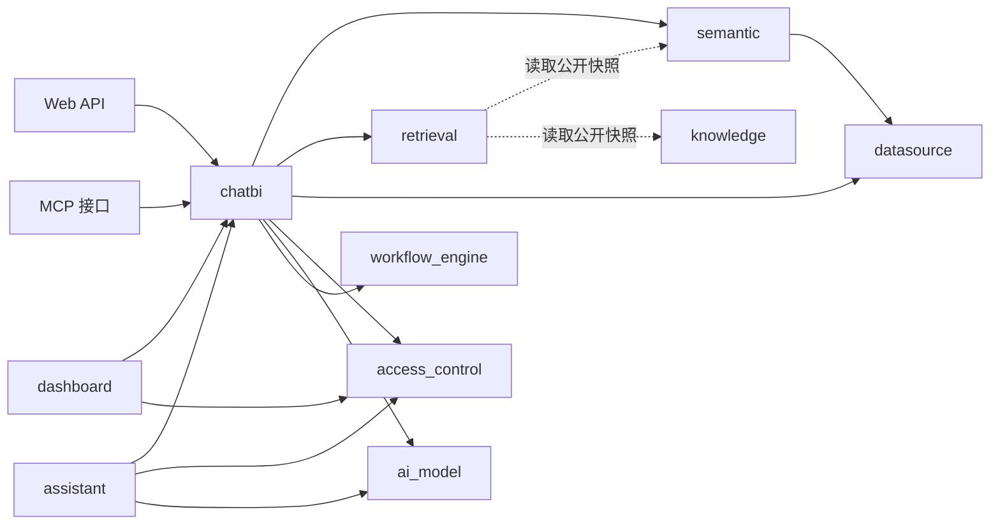

# SQLBot 后端 DDD 分阶段迁移方案

> 状态：实施中
> 日期：2026-07-18  
> 适用范围：`backend/apps/` 业务代码及其直接依赖  
> 目标读者：后端开发人员、架构负责人、测试人员和后续维护人员

## 1. 目标与范围

### 1.1 背景

SQLBot 后端已经形成数据源接入、语义建模、统一检索、对话问数、Agent、Graph 工作流、仪表板和嵌入式助手等能力。随着功能增加，当前目录逐渐同时使用业务名称、技术名称和历史名称，部分模块之间出现双向依赖，同一业务能力也存在新旧实现并存的情况。

当前 `semantic` 已经开始按照 `api/services/repository/models` 结构迁移，为其他业务模块提供了可参考的分层方式。但 DDD 改造不能只统一目录形式，还需要明确每个领域拥有的数据、业务规则、公开契约和事务边界。

### 1.2 迁移目标

本次迁移需要达到以下目标：

1. 以业务能力划分领域，不再把 `crud`、`db`、`template`、`capabilities` 等技术职责当成业务领域。
2. 每类业务数据只有一个权威归属，消除术语、问数链路和权限判断的重复实现。
3. 领域内部遵循 `backend/apps/AGENTS.md` 约定，API、Service、Repository、ORM 和 DTO 职责清晰。
4. 跨领域只通过公开 Service、稳定 DTO、端口或领域事件协作，不直接使用其他领域的 ORM 和具体仓储。
5. Graph 和 Agent 可以作为不同执行方式存在，但必须共享问题理解、检索、SQL 编译、权限、执行和回答等业务能力。
6. 保持现有 API 和数据库迁移可控，采用小步迁移，不进行无关重构。
7. 建立依赖规则测试，防止迁移完成后重新出现循环依赖。

### 1.3 不在本次范围内的事项

本方案不要求在第一阶段完成以下工作：

- 不要求立即将现有数据库表名全部改为新的领域名称。
- 不要求为了形式完整建立空目录、空接口或没有实际用途的领域实体。
- 不要求将 SQLModel 全面替换为另一种 ORM。
- 不要求把 Graph 和 Agent 合并为一种运行机制。
- 不要求同步重写前端页面和全部外部 API。
- 不要求一次性移除所有兼容入口，但兼容入口只能转发到唯一业务实现。

### 1.4 文档中的状态定义

本文使用以下状态区分当前实现和目标设计：

| 状态 | 含义 |
| --- | --- |
| 已实现 | 当前工作区中已经存在并可定位到代码的能力 |
| 部分实现 | 已有主要结构，但边界、依赖或唯一实现尚未完全收敛 |
| 目标设计 | 本方案建议的最终职责和依赖方向，不能描述为当前已完成能力 |
| 迁移动作 | 为达到目标设计需要执行的代码、数据或测试调整 |

## 2. 当前架构评估

### 2.1 当前模块概况

`backend/apps/` 当前主要包含以下几类目录：

| 当前目录 | 当前主要职责 | 评估 |
| --- | --- | --- |
| `semantic` | 主题域、数据集、模型、指标、维度、术语、语义 SQL 编译 | 已形成较完整的领域分层，可作为业务领域保留 |
| `retrieval` | 统一检索契约、索引、召回、重排、门控和追踪 | 已具备独立生命周期，应作为支撑领域重整分层 |
| `chat` | 会话、记录、历史问数链路、结果和日志 | 属于 ChatBI 领域的一部分，不应独立承担完整问数流程 |
| `agent` | Agent Run、工具循环、澄清、事件和预算 | 是 ChatBI 的一种执行方式，不是独立业务领域 |
| `workflow` | ChatBI Graph 定义、节点、条件和能力适配 | 是 ChatBI 的另一种执行方式，不是通用工作流引擎本身 |
| `workflow_engine` | 通用图运行、节点调度、检查点、事件、交互和制品 | 属于运行平台，不应反向依赖具体 ChatBI 业务 |
| `datasource` | 数据源、物理表字段、导入、权限和推荐问题 | 混合了数据源领域、访问控制和知识资源职责 |
| `db` | 多数据库连接、元数据读取和 SQL 执行 | 是数据源基础设施，不是业务领域 |
| `system` | 用户、工作空间、AI 模型、助手、认证、API Key 和系统变量 | 职责过多，需要按业务生命周期拆分 |
| `data_training` | 问题、SQL 示例、关联资产和 Embedding | 实际是 SQL 示例知识，不是模型训练领域 |
| `terminology` | 旧术语维护和向量 | 与 `semantic` 中术语重复 |
| `dashboard` | 仪表板目录、画布和图表配置 | 可作为独立支撑领域保留 |
| `ai_model` | LLM、Embedding 客户端和模型工厂 | 与 `system` 中 AI 模型配置共同组成 AI 模型领域 |
| `capabilities` | 问题理解、语义检索、SQL 校验和执行 | 是 ChatBI 的能力端口与实现集合，不是领域 |
| `mcp` | MCP 登录、数据源列表和问数入口 | 是外部接口适配层，不拥有业务数据 |
| `template` | SQL、图表、分析、预测等提示模板 | 是 ChatBI 或 AI 模型相关资源，不是领域 |
| `settings`、`swagger` | 文件下载、旧术语模型、接口国际化 | 属于平台或接口支持，其中旧术语模型应清理 |

### 2.2 已有的良好基础

当前项目并非从零开始迁移，以下能力可以直接保留和演进：

1. `semantic` 已经区分 API、Service、Repository、ORM 和 DTO，并开始使用仓储接口隔离持久化。
2. `retrieval` 已经定义统一请求、资源、索引代次、查询决策和通道诊断，具备独立支撑领域的基础。
3. `workflow_engine` 已经形成运行模型、端口、仓储、事件和运行时结构，通用执行能力相对完整。
4. `workflow` 已通过能力网关调用问题理解、检索、SQL 和回答能力，方向上符合业务编排与能力实现分离的要求。
5. Agent 和 Graph 已开始共享 Semantic 与 Retrieval 能力，为收敛重复实现提供了基础。
6. 已有 Semantic、Retrieval、Workflow 和 Workflow Engine 测试，可以作为迁移回归基线。

### 2.3 主要问题

#### 2.3.1 目录不等于领域

当前 `db`、`template`、`capabilities` 和 `mcp` 都是技术职责或接口形式。如果直接按照现有目录实施 DDD，会把技术实现误认为业务边界，无法解决跨目录依赖和数据所有权问题。

#### 2.3.2 `system` 聚合了多个不同生命周期

`system/models/system_model.py` 同时定义 AI 模型、工作空间、成员关系、助手、认证和 API Key。它们的创建条件、权限规则、调用方和变更原因不同，不应继续由一个宽泛的 `system` 领域统一管理。

#### 2.3.3 同一业务数据存在多个事实源

迁移开始时存在以下术语模型：

- `terminology.models.Terminology`
- `semantic.models.orm.SemanticTerm`
- `settings.models.term_model`

多套术语模型会导致维护入口、Embedding、关联资产和查询结果不一致。2026-07-18 已确认
`settings.models.term_model` 没有运行时和 Alembic 引用，但该文件可能是尚未提交的工作区内容，当前保留；
后续仍需完成旧 Terminology 与 SemanticTerm 的数据和入口合并。目标状态必须只保留 Semantic 术语一个权威实现。

#### 2.3.4 问数业务能力存在多条实现链路

当前存在旧 `chat/task/llm.py`、Agent 工具链和 Graph 能力适配。Graph 和 Agent 可以保留不同的规划与运行方式，但不能各自维护 SQL 校验、权限应用、检索和执行规则。旧 Chat 链路也不能长期作为第三套独立能力实现存在。

#### 2.3.5 通用运行平台反向依赖具体业务

`workflow` 依赖 `workflow_engine` 是合理方向，但 `workflow_engine/api/service.py` 又直接导入 `chat`、`semantic` 和 `workflow`。这使通用引擎无法独立复用，也形成双向依赖。

业务图定义、ChatRecord 投影和 Semantic 数据集解析应由 ChatBI 应用层组装，不应放入通用工作流引擎。

#### 2.3.6 基础设施反向依赖业务模块

`apps/db/db.py` 直接导入 Datasource ORM、Assistant DTO 和 System Service。数据库连接工具因此无法作为稳定基础设施使用，也会把 Assistant 的外部数据源逻辑传播到普通数据源执行代码。

目标状态应由 Datasource 领域定义连接和查询端口，再由不同连接适配器实现本地数据源、外部助手数据源和 Elasticsearch 等连接方式。

#### 2.3.7 跨领域直接使用 ORM

当前 Chat、Workflow Engine、System 权限、Dashboard 和 Retrieval 等模块会直接导入其他模块的 ORM。这样调用方会依赖对方的表结构和查询方式，任何字段调整都会扩散到多个领域。

跨领域接口应返回 DTO 或明确的引用对象，例如只传递 `dataset_id`、`datasource_id`、`tenant_id` 和经过授权的资源范围，而不是传递 SemanticDataset、CoreDatasource 或 UserModel。

#### 2.3.8 Service 和 API 中存在数据库与事务逻辑

部分 API 和 Service 直接创建 Session、拼接 SQL、查询 ORM 并提交事务，与 `backend/apps/AGENTS.md` 中的分层规则不一致。迁移时不能只移动文件，需要把查询和事务同时收敛到仓储实现。

### 2.4 当前依赖关系结论

根据当前 Python 静态导入关系，`ai_model`、`capabilities`、`chat`、`data_training`、`datasource`、`db`、`retrieval`、`semantic`、`system`、`template`、`terminology`、`workflow` 和 `workflow_engine` 处于同一个大的循环依赖组。

这说明迁移的首要任务不是统一目录名，而是建立以下稳定边界：

1. ChatBI 对外提供统一问数入口。
2. Semantic 对外提供语义资产读取、编译和变更契约。
3. Retrieval 对外提供索引和检索契约。
4. Datasource 对外提供元数据和受控查询契约。
5. Access Control 对外提供身份、资源授权和数据策略契约。
6. Workflow Engine 只提供通用运行能力。

## 3. 领域划分

### 3.1 划分原则

领域边界依据以下因素确定：

- 是否拥有独立的业务数据和状态生命周期。
- 是否包含只能在一个位置表达的业务不变量。
- 是否有明确的创建、修改、启用、删除和查询行为。
- 是否可以通过稳定契约被其他领域调用。
- 是否会因为不同原因独立变化。

最终建议形成 2 个核心领域、7 个支撑领域和 1 个通用运行平台。

### 3.2 核心领域

#### 3.2.1 `semantic`

Semantic 负责把物理数据结构转换为稳定的业务语义，是 ChatBI 正确生成和执行查询的核心事实源。

**拥有的数据**

- 主题域
- 数据集
- 语义模型和模型关系
- 模型字段和度量
- 指标
- 维度和受控维值
- 业务术语
- 资产别名和资产关系
- 数据集模型及资产配置

**业务不变量**

1. 同一租户和业务范围内，业务名称必须满足唯一性约束。
2. 指标和维度必须关联有效模型，数据集只能引用已允许的语义资产。
3. 模型关系必须引用同一主题域中的有效模型，并通过统一规则校验 Join。
4. SQL 编译只能使用经过检索门控和权限放行的资产 ID。
5. 术语只能有一个权威事实源，关联指标和维度必须可验证。
6. Schema 版本变化必须可触发检索索引更新，但 Semantic 不直接操作 Retrieval 内部表。

**公开能力**

- 语义资产维护 Service
- 数据集 Schema 查询
- 语义资产快照或变更通知
- 语义查询编译
- 数据源物理元数据映射

**不负责**

- 不负责向量索引的存储和召回。
- 不负责数据库连接和 SQL 实际执行。
- 不负责用户会话和问数流程。

#### 3.2.2 `chatbi`

ChatBI 负责从用户问题到可展示结果的完整业务流程，是系统对外提供智能问数能力的核心领域。

**拥有的数据**

- 会话
- 会话记录
- 问数结果和状态
- 问数步骤日志与模型用量记录
- Agent Run、Step、Trace 和 Clarification
- 与会话关联的 Graph Run 引用或投影

**业务不变量**

1. 每次问题执行必须属于明确的租户、用户和会话上下文。
2. 问题理解结果是检索规划的唯一自然语言输入，不允许不同执行方式重复改写并产生不同资产绑定。
3. SQL 编译只能使用 Retrieval 明确放行的 Semantic 资产。
4. 执行前必须依次完成 SQL 安全校验和数据权限应用。
5. Graph 和 Agent 必须共享相同的能力实现和权限规则。
6. 一条会话记录只能有一个最终状态，暂停、恢复、失败和取消必须有确定状态转换。
7. 大结果集不得无限写入会话表，应通过制品引用或受控摘要保存。

**公开能力**

- 创建和管理会话
- 发起问数、流式问数和继续澄清
- 查询执行状态、事件和结果
- 生成分析、预测和推荐问题
- 删除会话及其执行记录和制品

**内部执行方式**

- Graph：确定性流程、条件路由和暂停恢复。
- Agent：受控工具循环和模型规划。

Graph 和 Agent 是 ChatBI 内部执行方式，不对其他领域暴露内部模型。

### 3.3 支撑领域

#### 3.3.1 `datasource`

Datasource 负责外部数据连接及其物理元数据，是 Semantic 建模和 ChatBI 查询执行的基础。

**拥有的数据**

- 数据源连接定义
- 物理表和字段缓存
- 表字段选中状态和自定义注释
- 物理表关系或外键元数据
- Excel 导入产生的数据源信息

**业务不变量**

1. 数据源必须属于明确工作空间，连接配置必须经过加密存储和受控解密。
2. 连接检测、元数据同步和查询执行必须使用同一连接类型解析规则。
3. 表和字段必须属于对应数据源，元数据同步不能产生跨数据源引用。
4. 查询和预览必须经过调用方授权，Datasource 不自行推断用户权限。
5. 数据库驱动错误必须显式返回，不得静默返回空结果。

**公开能力**

- 数据源维护
- 连接检测
- 物理元数据发现与同步
- 受控数据预览
- 受控 SQL 执行网关

`apps/db` 中的多数据库实现应迁入 Datasource 的仓储或连接适配实现，不再作为独立领域。

#### 3.3.2 `knowledge`

Knowledge 负责维护可用于问数规划和回答的人工知识资源。

**拥有的数据**

- SQL 示例
- 问题示例
- 推荐问题
- 未来的文档、FAQ 和结构化知识资源
- 示例与数据集、数据源、Semantic 资产的引用关系

**业务不变量**

1. SQL 示例必须标明租户、适用数据集或数据源和启用状态。
2. 可用于执行参考的 SQL 示例必须经过验证，并在使用时重新通过当前权限和 Semantic 编译校验。
3. 推荐问题只负责展示建议，不直接作为已授权查询执行。
4. Knowledge 拥有源内容，Embedding 和检索单元属于 Retrieval 的派生数据。

旧 `data_training` 应迁入本领域并使用 SQL 示例或问题示例等准确名称。

#### 3.3.3 `retrieval`

Retrieval 负责把多个领域的公开资源投影为统一索引，并提供可观测、可判歧义的检索结果。

**拥有的数据**

- 检索来源
- 检索资源和检索单元
- Embedding
- 索引代次和索引任务
- 查询追踪和通道诊断
- 检索策略版本

**业务不变量**

1. 检索结果必须携带稳定资源 ID、来源、版本和权限范围。
2. 权限、租户、数据集和资产状态必须在召回前过滤。
3. 向量相似度不能单独证明语义资产绑定正确。
4. 新索引必须完整构建成功后才能原子激活，失败时保留旧的活动代次。
5. 索引是派生数据，必须可重建和回滚。
6. 检索通道不可用时必须返回明确诊断，未知异常不能静默降级。

**公开能力**

- 注册和同步检索来源
- 重建、激活和回滚索引代次
- 按 Profile 执行统一检索
- 返回绑定结果、证据和诊断

Retrieval 可以通过适配器读取 Semantic 和 Knowledge 的公开快照，但不得直接修改它们的源数据。

#### 3.3.4 `access_control`

Access Control 负责确认调用者身份、工作空间范围和数据访问策略。

**拥有的数据**

- 用户和第三方身份绑定
- 认证配置
- 工作空间和成员关系
- API Key
- 角色和资源授权关系
- 行权限和列权限规则
- 系统变量及用户变量值

**业务不变量**

1. 每个受保护请求必须解析为明确调用者和当前工作空间。
2. 用户只能访问当前工作空间授权范围内的资源。
3. API Key、助手密钥和登录令牌必须有明确的状态和失效规则。
4. 行列权限必须在 SQL 执行前形成确定的数据访问策略。
5. 权限规则缺失、字段失效或变量无效时不能默认放行。
6. 权限判断只能有一个统一入口，API 装饰器不能自行查询其他领域 ORM。

**公开能力**

- 身份认证和当前调用者解析
- 工作空间成员管理
- 资源授权判断
- 数据访问策略解析
- API Key 管理

Datasource 和 ChatBI 只能消费权限判断结果，不直接读取 Access Control 的内部表。

#### 3.3.5 `ai_model`

AI Model 负责模型供应商配置和运行时模型客户端创建。

**拥有的数据**

- 模型供应商
- 模型类型和基础模型名称
- API 地址和加密凭据
- 默认模型状态
- 模型能力配置

**业务不变量**

1. 同一模型配置必须具有明确类型、协议和状态。
2. 默认模型只能从可用模型中选择，并保持唯一。
3. 模型连接测试和运行时客户端必须使用同一配置解析逻辑。
4. API Key 不应传播到 ChatBI DTO、日志或检索结果。
5. LLM 和 Embedding 的模型选择必须显式，配置错误不得静默使用其他模型。

`system` 中的 AI 模型 API 和 ORM 应与当前 `apps/ai_model` 合并为一个领域。

#### 3.3.6 `assistant`

Assistant 负责发布和管理可供外部使用的问数助手应用。

**拥有的数据**

- 助手名称和说明
- 应用 ID 和应用密钥
- 允许访问的数据源或数据集范围
- 外部来源配置
- 允许的来源域名
- 自定义模型选择

**业务不变量**

1. 助手必须属于明确租户，并绑定可访问的数据范围。
2. 应用密钥必须唯一、可禁用并避免明文扩散。
3. 助手的自定义模型必须引用有效 AI Model 配置。
4. 外部数据源接口失败必须显式返回，不能自动切换到其他来源。
5. Assistant 只负责发布配置，实际问数通过 ChatBI 公开服务执行。

MCP、嵌入页面和普通 Web API 是不同接口形式，不属于 Assistant 的内部业务模型。

#### 3.3.7 `dashboard`

Dashboard 负责保存和展示问数结果形成的仪表板内容。

**拥有的数据**

- 仪表板和目录树
- 画布布局
- 组件配置
- 图表配置
- 结果或查询引用

**业务不变量**

1. 仪表板必须属于明确工作空间和创建者。
2. 同级资源命名规则必须由 Dashboard 统一校验。
3. 删除目录时必须明确子资源处理规则。
4. Dashboard 不直接读取 Chat ORM 或执行未经校验的原始 SQL。
5. 重新加载数据应通过受控查询能力，并再次应用当前权限。

### 3.4 通用运行平台

#### 3.4.1 `workflow_engine`

Workflow Engine 负责通用图流程运行，不负责 ChatBI 业务规则。

**拥有的数据**

- Workflow Definition
- Workflow Run
- Node Execution
- Checkpoint
- Event
- Interaction Request
- Artifact 及其清理状态

**平台不变量**

1. Workflow Definition 必须在发布前完成节点、边、条件和 Handler 校验。
2. Run 状态转换、租约、重试、暂停和恢复必须确定且可追踪。
3. 事件序列和检查点必须与 Run 进度一致。
4. 节点输出只能通过约定的 Context Patch 更新上下文。
5. Engine 不得导入 Chat、Semantic、Datasource 等业务领域。

ChatBI 负责提供图定义、Handler、条件和能力适配，并在应用装配层把它们注入 Workflow Engine。

### 3.5 不作为领域保留的目录

| 当前目录 | 目标归属 |
| --- | --- |
| `db` | `datasource` 的连接和查询基础设施 |
| `capabilities` | `chatbi` 的 Service、端口或适配实现 |
| `template` | `chatbi` 或 `ai_model` 的模板资源和模板读取实现 |
| `mcp` | `backend/interfaces/mcp` 外部接口适配 |
| `swagger` | `common` 或接口层的国际化支持 |
| `settings` | 平台配置或公共文件接口；其中旧术语模型删除 |
| `common/audit` | 跨领域审计基础设施，通过统一接口记录审计事件 |

## 4. 目标架构

### 4.1 领域关系



图中的实线表示运行时调用，虚线表示索引构建时读取公开资源。Semantic 和 Knowledge 的写入不依赖 Retrieval 具体实现，可以通过事件或抽象索引端口通知索引更新。

### 4.2 目标目录

```text
backend/
├── apps/
│   ├── access_control/
│   ├── ai_model/
│   ├── assistant/
│   ├── chatbi/
│   ├── dashboard/
│   ├── datasource/
│   ├── knowledge/
│   ├── retrieval/
│   └── semantic/
├── platform/
│   └── workflow_engine/
├── interfaces/
│   └── mcp/
├── common/
└── main.py
```

迁移期间可以暂时保留 `apps/workflow_engine` 和 `apps/mcp` 路径，先修正依赖方向，再移动目录。目录移动必须与调用方导入更新在同一阶段完成，不能长期保留两套实现。

### 4.3 领域内部结构

所有业务领域遵循 `backend/apps/AGENTS.md`，只创建实际需要的层：

```text
apps/<domain>/
├── api/
├── services/
├── repository/
│   └── <technology>/
├── models/
│   ├── orm/
│   └── dto/
├── utils/
├── errors.py
└── __init__.py
```

补充约束如下：

1. `api` 只接收请求、解析身份、组装依赖和映射错误。
2. `services` 负责业务流程和业务校验，只依赖仓储接口或其他领域公开契约。
3. `repository` 根目录定义领域需要的最小数据接口，技术子目录提供实现。
4. `models/orm` 只表示持久化结构，不能被其他领域直接导入。
5. `models/dto` 存放领域边界传输对象，同一契约只定义一次。
6. `utils` 只存放无外部副作用且真实复用的辅助函数。
7. 若 Graph 或 Agent 的内部代码较多，可以在 `chatbi` 下建立职责明确的 `orchestration/graph` 和 `orchestration/agent`，但业务 Service 仍是唯一实现。

### 4.4 ChatBI 目标结构示例

```text
apps/chatbi/
├── api/
│   ├── conversations.py
│   ├── queries.py
│   └── interactions.py
├── services/
│   ├── conversation_service.py
│   ├── query_service.py
│   ├── question_understanding.py
│   ├── query_planning.py
│   ├── sql_execution.py
│   ├── answer_service.py
│   └── deletion_service.py
├── orchestration/
│   ├── agent/
│   └── graph/
├── repository/
│   ├── conversation_repository.py
│   ├── execution_repository.py
│   └── sqlmodel/
├── models/
│   ├── orm/
│   └── dto/
├── errors.py
└── __init__.py
```

这里的 `orchestration` 只负责读取 ChatBI DTO、调用业务 Service 和推进状态，不重新实现检索、SQL 校验或权限逻辑。

### 4.5 跨领域契约

跨领域调用至少遵守以下规则：

| 调用方 | 被调用方 | 允许传递的内容 | 禁止传递的内容 |
| --- | --- | --- | --- |
| ChatBI | Semantic | 数据集引用、资产引用、编译请求和编译结果 DTO | Semantic ORM、具体仓储、数据库 Session |
| ChatBI | Retrieval | 检索请求、Scope、绑定结果和诊断 DTO | 检索表模型、内部索引查询对象 |
| ChatBI | Datasource | 连接引用、元数据请求、受控查询和查询结果 DTO | CoreDatasource ORM、原始连接对象 |
| ChatBI | Access Control | 调用者、资源引用、授权请求和数据策略 DTO | User ORM、工作空间 ORM、权限表模型 |
| ChatBI | AI Model | 模型用途、模型引用、调用请求和用量结果 | API Key、模型 ORM、供应商客户端实例 |
| Retrieval | Semantic/Knowledge | 公开资源快照、版本和变更事件 | 对方 ORM 和仓储实现 |
| Dashboard | ChatBI/Datasource | 已授权结果引用或受控查询请求 | Chat ORM、拼接后直接执行的 SQL |

### 4.6 应用装配位置

依赖装配保留在最外层：

- 各领域 API 可以创建本领域 Service 和具体仓储。
- 跨领域的完整问数装配由 ChatBI API 或明确的启动工厂负责。
- `apps/api.py` 只注册路由，不承载业务规则。
- Workflow Engine 的 Registry、RunStore、EventPublisher 和 ChatBI Handler 由 ChatBI 装配函数连接。
- 不允许通过函数内部导入隐藏循环依赖。

## 5. 迁移原则

### 5.1 小步迁移

每个阶段只处理一个明确边界，并同时完成代码、调用方、测试和旧实现清理。不能先复制一套新目录，再长期保留旧逻辑独立运行。

### 5.2 唯一实现

同一个业务能力只能有一个权威实现，例如：

- 术语维护只由 Semantic 提供。
- 问题理解只由 ChatBI 统一 Service 提供。
- Semantic Binding 只由 Retrieval 统一服务提供。
- SQL 语义编译只由 Semantic Compiler 提供。
- SQL 安全校验和执行入口只保留一个共享实现。
- 工作空间和资源权限只由 Access Control 判断。

Graph、Agent、MCP 和 Web API 只能调用这些实现，不能复制规则。

### 5.3 先建立契约，再迁移实现

需要跨领域复用的能力先定义最小 DTO 和端口，然后迁移具体实现。调用方改用新契约后，再移动 ORM、仓储和内部文件。

### 5.4 数据库表名与代码领域分开迁移

代码归属调整不要求立即修改表名。第一阶段可以继续使用 `headless_*`、`sys_*` 和 `core_*` 表名，只要 ORM 已归入正确领域。

表名调整必须单独设计数据库迁移、兼容窗口和回滚方案，不能与大规模代码移动同时进行。

### 5.5 事务边界

- 单领域写操作由该领域仓储或工作单元控制事务。
- 跨领域流程不共享数据库 Session。
- 需要跨领域一致性时，优先采用“本领域事务提交后发布事件”的方式。
- 如果事件暂时无法落地，应用 Service 可以顺序调用，但必须允许后续步骤失败后重试，不能伪装成原子事务。

### 5.6 错误处理

- 领域错误不包含 HTTP 状态码。
- API 负责将已知领域错误映射为接口响应。
- 未知异常直接失败并记录诊断，不使用宽泛异常捕获返回空数据。
- 可选依赖导入失败时使用明确抛出 `ImportError` 的存根类或惰性加载函数，禁止把导入失败对象设置为 `None`。

### 5.7 兼容入口

迁移期间保留旧 API 时，旧入口必须：

1. 只做参数转换和转发。
2. 不再执行独立查询和业务校验。
3. 有明确的调用方迁移清单和删除条件。
4. 通过测试证明新旧入口调用的是同一业务 Service。

## 6. 分阶段迁移计划

### 6.1 阶段 P0：建立迁移基线和依赖约束

**实施状态：已完成**

截至 2026-07-18，已新增 `tests/architecture/test_dependency_baseline.py` 和
`tests/architecture/known_dependency_violations.json`，完成以下依赖基线：

- P0 初始记录 40 条跨领域内部模型依赖；P1 清理 2 条后当前为 38 条。
- P0 初始记录 29 条跨领域具体实现依赖；P1 清理 3 条后当前为 26 条。
- 1 条跨领域 API 依赖。
- 6 条 Workflow Engine 对业务模块的依赖。
- P0 初始记录 10 条函数内部业务模块导入；P1 清理 1 条后当前为 9 条。

基线测试不把这些历史依赖视为合规设计。测试会阻止新增违规依赖；历史依赖被清理后，
对应基线也必须在同一变更中删除。P0 剩余工作是让首批调用方在实际迁移中采用公开契约；
不提前创建尚无调用方的共享 DTO。

当前重复能力的收敛决策如下：

| 能力 | 当前实现 | 保留和迁移决策 | 禁止继续扩展的实现 |
| --- | --- | --- | --- |
| 问题分类 | `workflow.capabilities.adapters.question.QuestionAdapter.classify` | 提取为 ChatBI 问题分类 Service，Graph Adapter 只转换上下文 | 旧 `chat/task/llm.py` 中的分类分支 |
| 问题重写、意图和澄清 | Agent 使用 `capabilities.question_understanding.QuestionUnderstandingService`，Graph 使用 `QuestionAdapter` | 以 QuestionUnderstanding DTO 和 Service 边界为目标，将 Graph 已有主题域、维度候选和并行子任务能力迁入统一 Service | Graph Adapter 和 Agent Loop 中各自维护业务规则 |
| 语义绑定 | `retrieval.service.RetrievalService` | 作为唯一检索执行服务；Graph 和 Agent 只保留请求、响应转换 | `capabilities.semantic.retrieval` 中新增独立检索策略 |
| 数据集 Schema | `semantic.services.schema_service.SemanticSchemaService` | 作为唯一 Schema 读取 Service | 调用方直接使用 Semantic Repository 或 ORM 拼装 Schema |
| 语义 SQL 编译 | `semantic.services.sql_compiler.SemanticSQLCompiler` | 作为唯一编译器；ChatBI 统一组装编译请求 | Graph、Agent 和旧 Chat 各自生成规则 SQL |
| SQL 校验 | `capabilities.sql.validator.SqlValidateTool` | 迁入 ChatBI SQL Service 并由所有执行方式共享 | 在 Adapter 或 Agent Tool 中复制校验规则 |
| 数据权限 | 旧 Chat 行列权限已有真实数据源；`PermissionAdapter` 有结构化改写能力，但默认 Provider 尚未接入 | 保留真实权限数据读取，接入 Access Control Policy Provider 后统一由 ChatBI 应用；未接入前不能宣称 Graph 和 Agent 权限等价 | 默认透传的 `PermissionTool` 作为正式权限实现 |
| SQL 执行 | `apps.db.db.exec_sql`、`SqlExecuteTool`、`SessionSqlExecutionGateway` | 建立 Datasource 查询网关作为唯一底层执行入口，ChatBI 统一串联权限和校验 | 旧 Chat、Graph、Agent 直接调用数据库函数 |
| 时间范围标准化 | `capabilities.time_slots` | 迁入 ChatBI 公共规则并保持一个实现 | Workflow Adapter 和问题理解各自维护时间规则 |
| 回答生成 | 旧 Chat 和 Graph `AnswerAdapter` 均有实现 | 先定义统一 Answer DTO，再提取 ChatBI AnswerService；迁移前不增加第三套实现 | Agent、Graph 节点中继续增加独立回答规则 |

现有 API 路径在迁移期间保持兼容，目标所有权如下：

| 当前 API 前缀 | 目标所有者 | 迁移要求 |
| --- | --- | --- |
| `/semantic` | Semantic | 保持主路径 |
| `/system/terminology` | Semantic | 转发到 SemanticTermService，前端迁移后删除 |
| `/system/data-training` | Knowledge | 保持兼容路径，内部改为 SQL 示例 Service |
| `/chat`、`/chat/agent`、`/graph` | ChatBI | 可以保留不同入口，但必须调用统一 ChatBI Service |
| `/datasource`、`/table_relation` | Datasource | API 保持兼容，Service 和 Repository 分层迁移 |
| `/recommended_problem` | Knowledge | 迁移所有权后保留短期兼容入口 |
| `/login`、`/user`、`/system/workspace`、`/system/apikey`、`/sys_variable` | Access Control | 第一阶段保持路径不变，只调整内部所有权 |
| `/system/aimodel` | AI Model | 第一阶段保持路径不变 |
| `/system/assistant` | Assistant | 第一阶段保持路径不变 |
| `/dashboard` | Dashboard | 保持主路径 |
| `/mcp` | 外部接口层 | 改为调用 Access Control、Datasource 和 ChatBI 公开 Service |

**目标**

在移动代码前明确当前行为、公开契约和禁止依赖，避免迁移过程中继续增加耦合。

**任务**

1. 固化现有 Semantic、Retrieval、Graph、Agent、Chat、Datasource 和权限测试基线。
2. 增加跨领域依赖检查脚本或测试，输出领域间导入关系和循环依赖。
3. 定义首批公开契约：当前调用者、资源引用、数据集引用、数据源引用、模型引用和查询结果。
4. 列出旧 Chat、Agent、Graph 对问题理解、检索、SQL、权限和回答能力的实现位置。
5. 为每项重复能力确定唯一保留实现和删除对象。
6. 记录当前 API 路径、数据库表和主要前端调用方。

**完成标准**

- 重复能力清单具有明确的保留方案。
- 依赖测试能够识别新增跨领域 ORM 导入。
- 后续阶段涉及的 API 契约有回归测试。
- 本阶段不改变业务行为。

### 6.2 阶段 P1：完成 Semantic 边界并统一术语

**实施状态：进行中**

截至 2026-07-18，已确认 `settings.models.term_model`、`term_schema_creator` 没有后端运行时和
Alembic 引用。由于这些文件不属于当前 `HEAD`，可能是尚未提交的工作区内容，本阶段保留并登记为
待确认项。`/system/terminology` 的查询、创建、更新、启停和删除已经切换到 Semantic；术语前端与
Excel 已迁入 `/semantic/terms`。旧 `apps/terminology` 业务实现已删除，只为当前 XPack 版本保留固定导入
路径，并将查询字段映射到 SemanticTerm；旧表只允许在 088 升级前由迁移脚本读取。外部 API 兼容窗口
仅保留 Semantic 内的转发路由。

本阶段已完成以下增量：

1. Semantic 数据集索引 Service 改为依赖 `DatasetIndexGateway`，不再由 Semantic 仓储直接创建
   Retrieval 协调器，也不再把 `SemanticDataset` ORM 传给 Retrieval。
2. 新增数据集索引版本、任务创建结果和重建结果 DTO；Retrieval 只消费 Semantic 的公开 DTO 与
   `DatasetSchema`。
3. 新增 `SemanticTerm.related_datasets` 和 087 数据库迁移。空数组表示作用于整个主题域，非空数组
   表示只进入指定数据集的运行时 Schema，并同步生成 `TERM -> DATASET` 资产关系。
4. 新增 `LegacyTermMigrationPlanner`，对租户、主题域、数据集、指标、维度、同名术语和数据源范围执行
   显式校验，输出总数、候选数、跳过数、冲突数和失败明细。
5. 新增 `scripts/migrate_legacy_terminology.py`。脚本默认只预检；只有显式传入 `--apply` 且冲突、失败
   均为 0 时，才在一个事务中写入 SemanticTerm 和资产关系。只有同时显式指定 `--purge-source` 才清理
   已核对的源记录；孤立或名称为空的子记录会阻止清理。重复执行时，相同目标术语会记为跳过。
6. 新增 088 删表迁移。迁移在旧表非空时明确失败，要求先完成预检、迁移和源数据清理。当前本地数据库
   预检为 0 条旧术语、0 冲突、0 失败，已按正式流程升级到 088，旧表已删除。
7. `SemanticTermService` 已统一执行名称清理、同主题域重名校验，以及数据集、指标、维度的租户和主题域
   引用校验；正常 API 写入与迁移规划不再使用两套引用规则。
8. 新增 `TermSearchResult` 和 `SemanticTermQueryService` 公开只读契约。查询只读取指定数据集的运行时
   Schema，按名称和别名进行确定性匹配，不读取旧 `terminology` 表，也不在失败时静默回退。
9. Agent 新记录继承会话绑定的 `dataset_id`，`search_terminology` 工具改为调用 Semantic 术语查询服务；
   未绑定数据集或服务未装配时返回明确错误。由此删除 1 条跨领域具体实现依赖和 1 条函数内部导入。
10. 术语迁移规划器已通过有效的 `SemanticDatasetModelConfig` 和 `SemanticModel.datasource_id` 建立
    租户隔离的数据源到数据集映射。映射缺失、无效，或旧记录已有数据集范围与解析结果不一致时，
    分别报告明确失败或冲突，不允许写入；预检报告会列出每个候选实际解析出的主题域和关联资产 ID。
11. 旧 Chat 中已经绑定 `dataset_id` 的记录改为通过 `ChatTermContextService` 调用
    `SemanticTermQueryService`，不再读取旧术语表；Semantic 查询为空或失败时不会回退旧实现。
12. 外部动态数据源 Assistant 类型 1、3 因不存在本地模型关系，显式拒绝绑定本地 Semantic 数据集；
    其他 Assistant 只有在请求提供并通过租户、数据集、模型和数据源校验后才建立绑定。未绑定数据集的
    Chat 不注入术语上下文，也不再读取旧表，由此删除 Chat 到旧术语具体实现的最后一条依赖。
13. `/system/terminology` 核心管理路径已迁入 `semantic/api/legacy_terms.py`。兼容层只转换旧响应字段，
    创建、更新、启停、批量删除和列表查询均调用 `SemanticTermService`，不再调用旧 CRUD 或写旧表；
    因此再删除 1 条旧术语 API 到 Chat 内部模型的依赖。
14. Semantic 术语管理现在可读取和启停禁用记录，批量删除先校验全部租户内引用，再在一次提交中清理
    术语主记录、别名和资产关系。应用启动已停止补旧术语向量，术语删除审计名称改为读取
    `headless_term`，避免后台任务和审计继续依赖旧事实源。
15. 新增 Semantic 术语 Excel 端口、Excel 仓储实现和应用服务，固定使用 `domain_id`、`name`、
    `aliases`、`description`、`dataset_ids`、`enabled` 六列。模板、导入、导出和失败明细工作簿均通过
    `/semantic/terms` 提供，导入逐行调用 `SemanticTermService`，不写旧表；旧 Excel 路径继续返回明确
    HTTP 409，防止旧数据源范围文件被误用。
16. 术语配置前端已直接调用 `/semantic/terms`，范围选择由数据源改为主题域和数据集，搜索、分页和批量
    删除不再依赖 `/system/terminology`。Semantic 资产页编辑术语时会保留并可调整数据集范围，同时保留
    既有关联指标和维度，避免全量更新 DTO 清空关系。
17. 删除审计的资源联合查询已统一使用本地 Semantic 实现。所有模块的删除审计不再通过 XPack 联合查询
    引用旧 `terminology` 表，解除旧表下线前的隐藏运行时依赖。
18. 删除无调用的旧术语 API、CRUD、旧 ORM 和术语专用 Embedding 后台入口。迁移脚本使用脚本内只读旧表
    映射；`apps/terminology` 仅保留当前 XPack 固定导入路径，导出的查询别名实际指向 `headless_term`，
    不映射旧表。架构基线同步减少 1 条跨领域内部模型依赖。

旧运行时模块和旧表迁移已经完成，当前只保留 `/system/terminology` 外部兼容路径。兼容写入会明确拒绝
数据源范围并要求有效 `domain_id`；旧 Excel 也已停止使用。目标环境升级 088 前必须先执行迁移脚本预检，
再显式使用 `--apply --purge-source`；只要旧表仍有记录，数据库升级就会中止，不会自动丢弃数据。
`specific_ds=true` 的历史记录在迁移预检中只会使用有效数据集—模型配置解析范围；数据源没有关联 Semantic
数据集时返回 `LEGACY_TERM_DATASOURCE_SCOPE_UNRESOLVED`，跨主题域或与已有 `dataset_ids` 不一致时返回冲突，
不能静默扩大术语范围。Agent、Chat、Assistant、动态数据源和术语管理运行时均已停止读取旧术语表。
完成外部调用确认后，可以删除最后的 Semantic 兼容路由和兼容 DTO、Service。

**目标**

把 Semantic 确立为语义资产唯一事实源，完成当前已开始的分层迁移。

**任务**

1. 完成 `semantic/api`、`services`、`repository`、`models/orm` 和 `models/dto` 的职责校验。
2. 清除 Semantic Service 对具体 SQLModel 仓储实现的直接依赖。
3. 将旧 `terminology` 数据映射到 SemanticTerm。已完成迁移规划、执行和源数据清理能力。
4. 将别名、数据集范围和关联资产转换为 Semantic 术语及资产关系。已完成。
5. 将旧 `/system/terminology` API 改为 SemanticTermService 的兼容转发入口。核心管理路径已完成，
   Semantic Excel 使用新路径；旧 Excel 路径明确拒绝旧契约。
6. 迁移前端术语调用到 `/semantic/terms` 后删除旧入口。前端迁移已完成，旧入口等待外部调用确认后删除。
7. 删除 `settings.models.term_model` 及无效接口。
8. Semantic 索引重建只依赖抽象索引端口，不直接写 Retrieval 表。

**数据迁移要求**

- 同一租户和词语需要定义冲突处理规则。
- 旧 `dataset_ids` 和 `mapped_assets` 必须验证引用是否有效。
- 迁移结果需要提供总数、成功数、冲突数和失败明细。
- 088 升级前由迁移脚本只读旧表；只有显式迁移和清理成功后才允许删表。

**完成标准**

- 术语核心管理和 Excel 只有 Semantic 一套写入 Service；Excel 旧写入已经关闭。
- Semantic Service 测试不使用真实数据库 Session。
- Repository 测试覆盖租户隔离、关系同步和级联删除。
- 旧术语 API 不包含独立业务逻辑。
- 旧 `apps/terminology` 业务实现已删除，最小 XPack 导入兼容映射只读取 Semantic；088 对非空旧表实施
  硬性保护。

**本阶段验证**

- `tests/semantic`、`tests/retrieval`、`tests/architecture`、`tests/agent`、`tests/chat` 和 Graph API
  调用方回归：324 个测试通过。
- Semantic 索引协调器 PostgreSQL 集成测试通过。
- Graph 会话调用方回归测试通过。
- 本次增量修改文件的 Ruff 检查通过。
- 088 已完成一次真实降级和再升级验证；当前本地数据库位于 088，旧 `terminology` 表不存在。应用启动及
  XPack 审计联合查询验证通过，XPack 术语查询实际指向 `headless_term`。
- 前端术语 API、术语配置页和多语言文件通过定向 ESLint、Prettier；Vite 生产构建通过。完整
  `npm run build` 仍被项目既有的 12 处 `LicenseGenerator` 全局类型缺失阻塞，本次未修改该授权模块。
- 本阶段前一批 11 个生产代码入口，以及 Semantic 查询契约、服务、装配入口、Agent 端口、术语迁移
  规划器、迁移脚本、Chat 术语上下文服务和数据集绑定服务通过 Mypy。本次新增的术语兼容 DTO、Service、
  Repository、API 入口，以及术语 Excel DTO、端口、仓储、Service 和 API 通过 Mypy。Agent、旧 Chat
  与存储同步大文件仍有既有严格类型问题，本次未扩大为无关重构。

### 6.3 阶段 P2：拆分 Access Control、AI Model 和 Assistant

**实施状态：进行中**

截至 2026-07-18，三个领域的第一轮边界确认如下：

- Access Control 负责用户、认证、工作空间、成员关系、API Key 和统一资源授权；系统参数继续属于平台配置。
- AI Model 负责模型配置持久化、运行时配置解析、密钥解密和模型客户端创建。
- Assistant 负责助手配置、公开数据源范围、外部数据源接入信息和动态域名；物理连接执行仍通过 Datasource
  公开契约完成。

本阶段已完成第一批 AI Model 迁移：

1. `AiModelDetail` 和 `AiModelBase` 已迁入 `ai_model/models/orm`；`system_model.py` 只保留当前 API 与
   XPack 所需的兼容引用，不再定义 `ai_model` 表。
2. 新增 `StoredAIModelConfig`、`LLMConfig`、`AIModelConfigRepository`、SQLModel 仓储实现和
   `AIModelRuntimeConfigService`，模型工厂不再创建数据库 Session 或查询 System ORM。
3. 指定模型不存在时返回 `AI_MODEL_NOT_FOUND`，不再静默改用默认模型；默认模型未配置、配置 JSON
   非法、参数缺失或键重复时均返回明确领域错误。
4. 运行时配置解析不再修改参与客户端缓存的配置字典，Azure 专用参数从副本中提取。
5. 本地默认模型配置通过新 Service 读取成功；应用启动和旧 System 模型引用兼容验证通过。架构基线减少
   1 条 AI Model 到 System 内部 ORM 的跨领域依赖。
6. `/system/aimodel` 路径保持兼容，但全部路由已迁入 `ai_model/api/model_config.py`；旧
   `system/api/aimodel.py` 已删除。API 只负责权限、审计、响应和领域错误转换，不再直接查询数据库。
7. 新增 AI Model 管理 DTO、管理仓储端口、SQLModel 实现和 `AIModelManagementService`。创建、编辑、
   查询、删除和默认模型切换统一经过 Service；System 中的 DTO 文件只保留导入兼容。
8. 普通编辑不能改变默认状态，默认模型不能删除；首个模型自动成为默认模型，后续默认切换在一个事务中
   清除旧默认并设置新默认。新增 089 PostgreSQL 部分唯一索引，为并发写入提供最终唯一约束。
9. 089 升级前会校验：存在模型时必须恰好有一个默认模型，数据不满足时明确中止，不擅自选择默认项。
   当前本地数据库已完成真实升级、降级和再升级验证，位于 089。
10. 启动密钥加密和旧供应商编号修正迁入 `AIModelSecretMigrationService`；旧
    `system/crud/aimodel_manage.py` 已删除。当前数据重复执行迁移更新数为 0。

**目标**

消除宽泛 `system` 模块，把不同生命周期的业务资源迁入独立领域。

**任务**

1. 创建 `access_control`，迁移用户、认证、工作空间、成员关系和 API Key。
2. 把 `require_permissions` 中的数据库查询改为统一授权 Service 调用。
3. 将行列权限和变量解析迁入 Access Control，输出稳定的数据策略 DTO。
4. 合并 `system` 中 AI 模型 ORM/API 与现有 `apps/ai_model`。ORM、API、DTO 和管理流程已迁移；
   System 仅保留 XPack 和旧导入路径需要的兼容引用。
5. 为模型配置建立仓储接口，模型工厂不再直接查询 System ORM。运行时读取链路已完成。
6. 创建 `assistant`，迁移助手 ORM、API、外部数据源配置和动态域名管理。
7. Assistant 通过 Datasource 和 AI Model 的公开契约校验引用。
8. 系统参数保留为平台配置，不放入 Access Control。

**完成标准**

- `system/models/system_model.py` 被拆分，不再定义多个领域 ORM。
- Access Control 不直接导入 Chat 或 Datasource ORM。
- AI Model 的配置读取和客户端创建通过同一 Service。
- Assistant 不直接调用 Chat 内部函数。
- 旧 System API 只保留必要兼容路由。

**本批验证**

- AI Model、Semantic、Retrieval、Architecture、Agent、Capabilities、Chat、Workflow 和 Graph API
  调用方回归：556 个测试通过。
- AI Model 与架构基线定向测试 21 个通过，覆盖模型归属、运行时配置、管理事务、密钥迁移、路由归属和
  089 非法存量数据拦截。
- AI Model 新增和修改文件通过 Ruff；DTO、仓储、Service、组装入口、模型工厂及测试通过 Mypy。
- 本地默认模型通过新 Service 成功解析，应用启动、ORM 单一映射和旧 System 兼容引用验证通过。
- 前端继续使用原 `/system/aimodel` 契约，无需同步修改；OpenAPI 构建和全部 8 个既有路由注册验证通过。

### 6.4 阶段 P3：收敛 Datasource 与数据库连接实现

**目标**

让 Datasource 成为物理数据连接和元数据的唯一边界，消除 `db` 对业务模块的反向依赖。

**任务**

1. 将 CoreDatasource、CoreTable、CoreField 的 ORM 与 DTO 分开。
2. 为数据源维护、元数据发现、连接检测和查询执行定义最小仓储或网关接口。
3. 将 `apps/db` 中各数据库连接实现迁入 Datasource 技术实现目录。
4. 将 Assistant 外部数据源转换为统一连接 DTO，不再让普通 DB 模块导入 Assistant。
5. 将 Excel 文件导入与数据源创建放入同一应用流程，明确文件清理和失败回滚。
6. 物理表关系保留在 Datasource；业务模型 Join 只保留在 Semantic。
7. 删除数据源内部旧 Embedding 写入逻辑，统一由 Retrieval 的 Schema Source 投影负责。
8. 把推荐问题移出 Datasource，迁入 Knowledge。

**完成标准**

- `apps/db` 不再作为独立业务目录。
- Datasource Service 不直接使用数据库驱动和查询语句。
- 每种连接类型有连接检测、元数据读取和查询执行测试。
- 数据库驱动错误不会被转换为空表或空字段列表。

### 6.5 阶段 P4：建立 Knowledge，并隔离 Retrieval 来源

**目标**

明确知识源与检索索引的所有权，完成 SQL 示例和未来知识资源的扩展边界。

**任务**

1. 创建 `knowledge`，将 `data_training` 重命名并迁移为 SQL 示例资源。
2. 将 `DsRecommendedProblem` 迁入 Knowledge 的推荐问题资源。
3. 定义 SQL 示例状态、验证状态、适用数据集和关联资产规则。
4. 为 Semantic、Knowledge 和可选 Schema 定义独立 Retrieval Source Adapter。
5. Retrieval 只读取公开资源快照，不导入对方 ORM 和具体仓储。
6. 内容变更后通过事件或索引端口提交重建请求。
7. 将 `retrieval/models.py` 和 `schemas.py` 分别迁入 ORM 与 DTO 目录。
8. 将检索查询、索引构建和来源投影分开，保持主流程可读。

**完成标准**

- Knowledge 是 SQL 示例和推荐问题的唯一写入入口。
- Retrieval 可以只依赖 Fake Source 测试完整索引流程。
- Semantic 和 Knowledge 删除时能够产生明确的索引删除或失效动作。
- 索引构建失败时旧活动代次保持可查询。

### 6.6 阶段 P5：建立统一 ChatBI 领域

**目标**

把 Chat、Agent、Graph 和 Capabilities 收敛为一个 ChatBI 业务领域，保留不同执行方式但消除能力重复。

**任务**

1. 创建 ChatBI 公开 QueryService 和 ConversationService。
2. 迁移 Chat、ChatRecord 和 ChatLog，并拆分 ORM 与 DTO。
3. 将问题理解、检索调用、SQL 语义编译、SQL 校验、权限应用、执行和回答形成统一 Service 链路。
4. Agent 工具改为调用这些 Service，不直接导入 Datasource、Semantic、Knowledge 内部模型。
5. Graph Adapter 改为调用相同 Service。
6. 旧 `chat/task/llm.py` 调整为兼容入口或直接删除，不能继续维护独立业务逻辑。
7. ChatBI 统一管理会话记录状态、澄清状态、错误分类和最终结果投影。
8. SQL、数据结果和制品保存建立统一大小限制和清理规则。
9. 推荐、分析和预测作为 ChatBI 应用能力调用 AI Model，不放入 ORM 方法或模板模块。

**完成标准**

- Graph 和 Agent 对相同规范化输入调用同一 Retrieval、Semantic Compiler、权限和 SQL 执行实现。
- ChatBI Service 不直接导入其他领域 ORM。
- 旧 Chat 链路没有独立的 SQL 校验、权限和执行实现。
- 会话删除能够清理关联 Agent、Graph 和 Artifact 数据。

### 6.7 阶段 P6：隔离 Workflow Engine

**目标**

让 Workflow Engine 恢复为不依赖具体业务的通用运行平台。

**任务**

1. 将 Graph API 中与 ChatBI 数据集、ChatRecord 和业务图装配有关的逻辑迁入 ChatBI API。
2. Workflow Engine API 只保留通用 Definition、Run、Event、Trace、Interaction、Cancel 和 Retry 能力。
3. ChatBI 提供 Definition、Handler、Condition 和 Capability Gateway，并在外层完成注册。
4. ChatRecord 投影由 ChatBI Repository 或订阅器负责，Engine 只发布运行事件。
5. 清除 Engine 对 `apps.chat`、`apps.semantic` 和 `apps.workflow` 的导入。
6. 依赖稳定后将目录迁入 `backend/platform/workflow_engine`。

**完成标准**

- Workflow Engine 可以在不导入任何业务领域的测试环境中独立运行。
- ChatBI Graph 流程仍支持创建、事件续传、暂停、恢复、取消和重试。
- Engine 依赖规则测试禁止导入 `backend/apps`。

### 6.8 阶段 P7：整理 Dashboard 和外部接口

**目标**

让展示领域和外部接口只调用公开应用服务，不再直接访问内部模型。

**任务**

1. Dashboard 建立 Service、Repository、ORM 和 DTO 分层。
2. Dashboard 加载数据改为调用受控查询接口，不再导入 Chat CRUD。
3. MCP 迁入 `backend/interfaces/mcp`，身份验证调用 Access Control，问数调用 ChatBI。
4. Assistant Web、Embedded 和 MCP 入口共享应用身份校验和数据范围校验。
5. Prompt 模板按用途迁入 ChatBI 或 AI Model，不再作为顶级业务目录。
6. Swagger 国际化和文件下载接口迁入公共接口支持位置。

**完成标准**

- Dashboard 不导入 Chat ORM 或 CRUD。
- MCP 不导入 Agent Loop、Chat API 和 System ORM。
- 外部入口只依赖公开 Service 和 DTO。

### 6.9 阶段 P8：删除旧实现并完成验收

**目标**

删除迁移期间的旧目录、兼容逻辑和无效数据结构，确保目标架构成为唯一实现。

**任务**

1. 删除已无调用的 `system`、`terminology`、`data_training`、`db`、`capabilities` 和旧 Chat 代码。
2. 删除仅为旧实现保留的 DTO、缓存 Key、配置项和数据库字段。
3. 清理历史品牌名和已经废弃的 `headless` 代码命名；数据库表名是否调整单独评审。
4. 更新开发文档、部署脚本、Alembic 模型导入和测试目录。
5. 执行全量测试、静态检查、数据库升级和降级验证。
6. 检查循环依赖、延迟导入和跨领域 ORM 导入。

**完成标准**

- 每项业务能力只有一个权威实现。
- 旧导入路径不存在独立业务逻辑。
- 领域依赖图无循环依赖。
- 所有领域验收条件通过。

## 7. 文件迁移清单

以下清单描述主要文件和目录的目标归属。实际迁移时应按阶段更新，并补充调用方和删除条件。

| 当前路径 | 目标位置 | 动作 | 说明 |
| --- | --- | --- | --- |
| `apps/semantic/` | `apps/semantic/` | 保留并完善 | 继续按 AGENTS 规则完成分层和公开契约 |
| `apps/terminology/models/` | `apps/semantic/models/orm/` | 合并 | 数据迁入 SemanticTerm，禁止继续双写 |
| `apps/terminology/curd/` | `apps/semantic/services/`、`repository/` | 重写后合并 | Excel 导入、查询和 Embedding 职责分开 |
| `apps/terminology/api/` | `apps/semantic/api/` | 兼容转发后删除 | 前端迁移到 `/semantic/terms` |
| `apps/settings/models/setting_models.py` | `apps/knowledge/` 或删除 | 待确认，当前保留 | 第三套术语模型无运行时引用，但不覆盖工作区未提交内容 |
| `apps/settings/schemas/setting_schemas.py` | `apps/knowledge/` 或删除 | 待确认，当前保留 | DTO 与模型一并确认归属 |
| `apps/data_training/` | `apps/knowledge/` | 迁移并重命名 | 使用 SQL 示例和问题示例等准确名称 |
| `apps/datasource/api/recommended_problem.py` | `apps/knowledge/api/` | 迁移 | 推荐问题不属于数据源连接职责 |
| `apps/datasource/crud/recommended_problem.py` | `apps/knowledge/repository/` | 迁移 | 由 Knowledge 管理源数据 |
| `apps/datasource/models/DsRecommendedProblem` | `apps/knowledge/models/orm/` | 迁移 | 保留原表名可作为过渡 |
| `apps/retrieval/models.py` | `apps/retrieval/models/orm/` | 拆分 | 按 source、generation、resource、unit、job、trace 拆分 |
| `apps/retrieval/schemas.py` | `apps/retrieval/models/dto/` | 拆分 | 保持统一检索契约稳定导出 |
| `apps/retrieval/service.py`、`planner.py`、`policy.py` | `apps/retrieval/services/` | 迁移 | 分别负责应用流程、查询规划和门控规则 |
| `apps/retrieval/indexing.py` | `apps/retrieval/services/`、`repository/` | 按职责拆分 | 编排留在 Service，数据库写入进入仓储 |
| `apps/retrieval/semantic_projector.py` | Retrieval 的 Semantic 来源适配 | 保留后调整依赖 | 只接收 Semantic 公开 DTO，不导入 ORM |
| `apps/system/models/user.py` | `apps/access_control/models/orm/user.py` | 迁移 | 用户和平台身份属于 Access Control |
| `apps/system/models/system_variable_model.py` | `apps/access_control/models/orm/access_variable.py` | 迁移 | 权限变量由数据策略使用 |
| `WorkspaceModel`、`UserWsModel` | `apps/access_control/models/orm/workspace.py` | 拆分迁移 | 明确成员关系和工作空间生命周期 |
| `AuthenticationModel`、`ApiKeyModel` | `apps/access_control/models/orm/` | 拆分迁移 | 认证配置和 API Key 分文件维护 |
| `apps/system/api/login.py`、`user.py`、`workspace.py`、`apikey.py` | `apps/access_control/api/` | 迁移 | API 只调用 Access Control Service |
| `apps/system/middleware/auth.py` | `apps/access_control/api/authentication.py` | 迁移 | 统一解析当前调用者和助手身份 |
| `apps/system/schemas/permission.py` | `apps/access_control/services/`、`models/dto/` | 重写 | 去除直接查询 Chat、Datasource ORM 的逻辑 |
| `apps/datasource/crud/permission.py` | `apps/access_control/services/`、`repository/xpack/` | 拆分迁移 | 权限查询与策略生成分离 |
| `apps/datasource/crud/row_permission.py` | `apps/access_control/services/data_policy_service.py` | 重写迁移 | 优先输出结构化策略，避免散落 SQL 拼接 |
| `AiModelDetail` | `apps/ai_model/models/orm/model_config.py` | 迁移 | 与模型工厂形成同一领域 |
| `apps/system/api/aimodel.py` | `apps/ai_model/api/models.py` | 迁移 | 模型管理、测试和默认设置统一入口 |
| `apps/system/crud/aimodel_manage.py` | `apps/ai_model/services/`、`repository/` | 拆分迁移 | 查询写入进入仓储，规则进入 Service |
| `apps/ai_model/model_factory.py` | `apps/ai_model/services/model_factory.py` | 保留后调整 | 通过仓储接口读取配置，不导入 System ORM |
| `apps/ai_model/openai/` | `apps/ai_model/repository/openai/` 或明确适配目录 | 迁移 | 供应商实现属于技术实现 |
| `AssistantModel` | `apps/assistant/models/orm/assistant.py` | 迁移 | 独立于 Access Control 和 AI Model |
| `apps/system/api/assistant.py` | `apps/assistant/api/assistants.py` | 迁移 | 只做助手配置接口 |
| `apps/system/crud/assistant.py` | `apps/assistant/services/`、`repository/external/` | 拆分 | 外部数据源调用属于 Assistant 外部适配 |
| `apps/system/crud/assistant_manage.py` | `apps/assistant/services/assistant_service.py` | 迁移 | CORS 更新作为配置变更后的明确动作 |
| `apps/datasource/models/datasource.py` | `apps/datasource/models/orm/`、`models/dto/` | 拆分 | Core 模型与请求响应对象分离 |
| `apps/datasource/crud/` | `apps/datasource/services/`、`repository/` | 拆分迁移 | 清除 CRUD 命名，按资源和行为命名 |
| `apps/datasource/embedding/` | Retrieval Schema 来源适配 | 合并或删除 | 不在源表继续维护独立 Embedding 链路 |
| `apps/db/` | `apps/datasource/repository/connectors/` | 迁移 | 多数据库连接、元数据和查询实现 |
| `apps/chat/models/` | `apps/chatbi/models/orm/`、`models/dto/` | 拆分迁移 | 会话事实归 ChatBI |
| `apps/chat/curd/` | `apps/chatbi/services/`、`repository/` | 拆分迁移 | 查询和事务进入仓储，流程进入 Service |
| `apps/chat/task/llm.py` | `apps/chatbi/services/` | 逐项收敛后删除 | 不整体搬迁大型旧流程 |
| `apps/chat/services/` | `apps/chatbi/services/` | 迁移 | 保留删除和绑定等明确职责 |
| `apps/agent/models.py` | `apps/chatbi/models/orm/agent_run.py` | 迁移 | Agent Run 属于 ChatBI 执行记录 |
| `apps/agent/loop.py`、`tools/` | `apps/chatbi/orchestration/agent/` | 迁移 | 工具只调用 ChatBI 统一能力 |
| `apps/agent/api.py` | `apps/chatbi/api/queries.py`、`interactions.py` | 合并 | 与统一问数和澄清入口收敛 |
| `apps/workflow/definitions/`、`nodes/`、`conditions/` | `apps/chatbi/orchestration/graph/` | 迁移 | 这些内容是 ChatBI 业务图 |
| `apps/workflow/capabilities/` | `apps/chatbi/services/` 或 Graph 适配 | 拆分迁移 | 业务实现归 Service，节点转换归适配 |
| `apps/workflow/runtime.py` | ChatBI 应用装配入口 | 迁移 | 负责将业务图注入通用引擎 |
| `apps/capabilities/question_understanding.py` | `apps/chatbi/services/question_understanding.py` | 迁移 | Graph 和 Agent 共享 |
| `apps/capabilities/semantic/` | ChatBI 对 Semantic/Retrieval 的适配 | 合并 | 兼容转发清理后删除顶级目录 |
| `apps/capabilities/sql/` | ChatBI SQL Service 与 Datasource 查询适配 | 拆分迁移 | 校验、权限、执行保持单一实现 |
| `apps/workflow_engine/` | `backend/platform/workflow_engine/` | 隔离后迁移 | 先清除业务依赖，再移动目录 |
| `apps/dashboard/` | `apps/dashboard/` | 保留并重整 | 按 Service、Repository、ORM 和 DTO 分层 |
| `apps/mcp/` | `backend/interfaces/mcp/` | 迁移 | 只调用公开应用服务 |
| `apps/template/` | `apps/chatbi` 或 `apps/ai_model` | 按用途拆分 | 不再保留顶级模板业务目录 |
| `apps/settings/api/base.py` | 公共文件接口 | 迁移 | 仅负责受控文件下载 |
| `apps/swagger/` | `common` 或接口支持目录 | 迁移 | 不作为业务领域 |
| `apps/api.py` | `apps/api.py` | 保留 | 只做顶层路由注册和装配 |

## 8. 测试与验收

### 8.1 测试分层

每个领域至少建立以下测试：

| 测试类型 | 关注内容 |
| --- | --- |
| Service 单元测试 | 业务流程、业务校验、状态转换和错误类型；使用 Fake Repository |
| Repository 测试 | 租户隔离、查询范围、关系同步、事务、级联和数据库约束 |
| API 契约测试 | 请求响应、身份上下文、权限拒绝和错误映射 |
| 纯规则测试 | 指标质量、模型关系、检索门控、权限表达式和状态机 |
| 跨领域集成测试 | 只覆盖公开契约，不导入对方内部模型 |
| 数据迁移测试 | 升级、数据转换、冲突、重复执行和必要的降级 |

### 8.2 依赖规则测试

必须自动检查以下规则：

1. 任一领域不得导入其他领域的 `models.orm`。
2. Service 不得导入具体仓储实现。
3. Repository 不得导入 Service 或 API。
4. Workflow Engine 不得导入任何 `apps` 业务领域。
5. ChatBI Graph 和 Agent 不得各自导入不同的 SQL 或 Retrieval 实现。
6. 禁止使用函数内部导入规避循环依赖。
7. 已删除旧目录后，测试中不得继续出现旧导入路径。

### 8.3 重点业务回归

迁移期间至少覆盖以下流程：

1. 用户登录、切换工作空间和 API Key 认证。
2. 数据源创建、连接检测、表字段同步、预览和删除。
3. Semantic 数据集、模型、指标、维度、术语和关系维护。
4. Semantic 索引重建、失败保留旧代次和检索诊断。
5. Graph 问数、Agent 问数、澄清、取消、重试和事件续传。
6. SQL 编译白名单、行列权限、SQL 校验和受控执行。
7. 会话历史、分析、预测、推荐问题和删除级联。
8. Dashboard 创建、加载、刷新和权限变化后的重新查询。
9. Assistant 和 MCP 的身份、数据范围和流式响应。

### 8.4 数据库迁移验收

每个涉及数据结构的阶段必须满足：

- Alembic `upgrade` 成功。
- 支持重复执行的迁移不得产生重复数据。
- 数据迁移有数量核对和失败记录。
- 必须降级的迁移完成 `downgrade` 验证；不可逆迁移需要在脚本和发布说明中明确。
- 删除表或字段前确认应用、脚本、前端和历史任务均无调用。
- 索引派生表可以重建，但源数据表不能依赖重建恢复。

### 8.5 总体验收标准

DDD 迁移完成需要同时满足：

- `backend/apps/` 下每个目录都代表明确业务领域。
- 每个领域的数据所有权和业务不变量有唯一实现。
- Service 不直接操作数据库 Session、驱动和查询语句。
- API 不包含持久化和事务逻辑。
- 跨领域调用不传递 ORM 和具体仓储。
- Graph、Agent、Web 和 MCP 共享同一业务能力实现。
- Workflow Engine 不依赖 ChatBI 或其他业务领域。
- 术语、SQL 示例、权限和模型配置不存在重复事实源。
- 旧目录、旧入口和无效兼容代码已删除。
- 依赖图不存在循环依赖。
- 领域测试、主要调用方测试、静态检查和数据库迁移验证全部通过。

## 9. 风险与回滚

### 9.1 主要风险

| 风险 | 影响 | 控制措施 | 回滚方式 |
| --- | --- | --- | --- |
| 术语数据合并冲突 | 检索和业务解释不一致 | 迁移前生成冲突报告，人工确认同名不同义条目 | 保留旧术语表只读并恢复旧兼容入口 |
| Graph、Agent 和旧 Chat 切换不一致 | 相同问题产生不同行为 | 共享能力契约测试，对相同输入比较绑定、权限和 SQL 结果 | 按入口切回旧转发，但不恢复已经删除的数据 |
| 权限迁移遗漏 | 产生越权或错误拒绝 | 权限默认拒绝，覆盖管理员、普通用户、助手和 API Key 场景 | 保留旧权限 Service 作为短期可切换实现 |
| 数据源连接迁移 | 多数据库兼容问题 | 每种数据库建立连接、元数据和执行回归用例 | 保留旧连接适配器并通过统一端口切换 |
| Retrieval 来源解耦 | 索引缺失或版本错误 | 新旧索引结果核对，构建成功后原子切换 | 回滚到上一活动 generation |
| 会话模型迁移 | 历史记录无法展示 | 保持原表名和字段兼容，先改 Repository 再改表 | 切回旧 Repository 读取实现 |
| Workflow Engine 隔离 | Run 恢复和事件流中断 | 保持 Run 表和事件协议不变，增加恢复和断线续传测试 | 恢复旧装配入口，不回滚 Run 数据 |
| 外部 API 调整 | 前端、MCP 或嵌入调用失败 | 保留只转发的兼容路由并记录调用量 | 恢复旧路由映射到同一新 Service |

### 9.2 发布控制

每个阶段发布前需要：

1. 明确本阶段新增入口、兼容入口和删除入口。
2. 明确数据库迁移是否可逆。
3. 记录领域测试、集成测试和手工验证结果。
4. 确认日志中不会输出模型密钥、数据源密码、用户变量和未授权查询结果。
5. 对权限、检索索引和问数执行链路提供运行开关时，开关只能切换实现，不能形成长期双写或双规则。

### 9.3 回滚原则

- 代码回滚不能依赖删除用户新写入的数据。
- 源数据迁移优先采用新增结构、验证、切换读取、停止旧写入、最后删除旧结构的顺序。
- Retrieval 索引通过 generation 回滚，不回滚 Semantic 和 Knowledge 源数据。
- 权限迁移出现不确定状态时默认拒绝访问，不能为了可用性自动放行。
- 兼容入口回滚后仍应调用唯一 Service，禁止重新启用已经废弃的独立业务实现。

## 10. 实施决策摘要

本方案最终确认以下架构决策：

1. Semantic 和 ChatBI 是核心领域。
2. Datasource、Knowledge、Retrieval、Access Control、AI Model、Assistant 和 Dashboard 是支撑领域。
3. Workflow Engine 是通用运行平台，不是 ChatBI 业务领域。
4. Graph 和 Agent 是 ChatBI 的执行方式，不是两个独立业务领域。
5. 旧 Terminology 归并到 Semantic，旧 Data Training 归并到 Knowledge。
6. Retrieval 拥有派生索引，不拥有 Semantic、SQL 示例和文档源数据。
7. DB、Capabilities、Template 和 MCP 不作为业务领域保留。
8. `system` 必须按 Access Control、AI Model、Assistant 和平台配置拆分。
9. 迁移以业务不变量和依赖方向为验收依据，不以文件是否移动完成作为验收依据。
10. 所有兼容入口必须有删除条件，不能长期承载独立业务逻辑。
