# ChatBI 统一检索平台实施计划

> 关联设计：[RETRIEVAL_PLATFORM_DESIGN.md](./RETRIEVAL_PLATFORM_DESIGN.md)
>
> 计划原则：先统一契约和入口，再迁移索引，随后升级检索算法，最后接入新知识源。

## 0. 当前状态

截至 2026-07-15，P0、P1-1～P1-5 已经完成。Graph 与 Agent 已统一到
`RetrievalService`，并直接使用唯一的 `semantic-binding`；现有对外 payload 保持兼容。统一检索存储
已具备 generation 双写、租户隔离和可回滚 migration，Semantic 资产也已具备安全的
resource/unit 投影契约和可增量、可重试、可回滚的索引生命周期。

已交付：

- `apps/retrieval` 严格请求、结果、profile、错误和诊断契约。
- `allowed_asset_ids` 必须同时来自语义绑定候选和槽位最终选中资产。
- 9 条基于数据集 243 真实资产 ID 的语义绑定 Gold Set。
- Graph/Agent 旧结果转换器、基线采集脚本和离线评测脚本。
- 契约、依赖方向、安全边界、Gold Set 和评测指标自动测试。
- 独立于 Workflow/Agent 的 Semantic 检索核心和统一服务入口。
- Graph/Agent 共用的 `semantic-binding` 请求、结果和应用组装工厂；旧策略请求会被明确拒绝。
- dense 通道启动配置检查，以及关闭、配置缺失、超时、维度不一致、索引不可用和查询错误诊断。
- 已知 dense 故障允许显式词法降级，未知异常不再被静默吞掉。
- `RETRIEVAL_EMBEDDING_ALLOW_LEXICAL_FALLBACK` 统一控制生产降级策略。
- 七张统一存储表：source、index generation、resource、unit、embedding、index job、query trace。
- `vector(1024)` 物理 profile、GIN 词法索引、scope 普通索引和 generation 部分唯一索引。
- 复合外键在数据库层阻止跨租户、跨来源和 embedding generation 错配。
- 数据集主题域、模型、指标、维度、术语和受控维值的细粒度 Semantic Projector。
- Join、模型兼容和资产关系只保存结构化 metadata，不把执行关系交给向量判断。
- `content_hash` 与 `embedding_text_hash` 分离，metadata 更新不会触发无意义的向量重算。
- SQL、字段、权限条件和敏感资产不会进入 embedding 文本。
- 检索域独立 durable job、批量 embedding、错误分类、退避重试和 `SKIP LOCKED` 任务领取。
- 增量 generation 自动复制未变化快照和向量，只重新计算文本发生变化的 unit。
- generation 完整性检查、并发安全原子激活、显式重试、保留代际回滚和 reconciliation 诊断。
- Semantic `/knowledge/rebuild` 在同一业务事务内注册 source、投影资源并写入索引任务。
- `semantic-binding` 确定性分槽 QueryPlanner，不使用整句兜底猜测缺失资产。
- exact、批准 alias、`pg_trgm` 和 pgvector dense 通道共用 active-generation 与 ACL 硬过滤。
- 按资源折叠 unit、记录通道原始分数/rank 的 RRF，以及唯一名称/别名快速路径。
- 版本化中文词法 gold set、PostgreSQL benchmark 脚本和固定基线报告。
- `semantic-binding-policy` 按资产类型配置 lexical、dense、rerank 绝对阈值和 top gap。
- exact/alias 身份优先、可选 reranker 封闭候选集以及不同分数量纲不直接比较的门控规则。
- 按必需槽位生成 `resolved/ambiguous/partial/missed/cross_model/degraded` 和可解释 reason codes。
- 模型关系摘要提升到 resource metadata，跨模型判断不依赖某个召回通道恰好命中的 unit。
- `allowed_asset_ids` 统一生成和 SQL 编译前白名单校验入口。

旧实现的 Graph/Agent 基线文件已经删除，避免继续作为当前质量事实。当前基线必须通过
`capture_retrieval_baseline.py` 使用 `semantic-binding` Gold Set 重新采集。缺少 provider API key
时，dense 通道明确标记为 unavailable 并按配置使用词法通道，不会回退旧策略。

## 1. 优先级定义

| 优先级 | 含义 | 进入条件 |
| --- | --- | --- |
| P0 | 当前行为一致性与后续建设的阻塞项 | 立即执行 |
| P1 | Semantic 生产级统一检索能力 | P0 验收完成 |
| P2 | SQL 示例与知识库扩展 | P1 质量和稳定性达标 |
| P3 | 规模化与高级检索能力 | 真实容量或质量数据证明有必要 |

以下工期按一名熟悉项目的后端工程师估算，只用于排依赖和容量，不作为发布日期承诺。前端展示不在本计划范围内。

## 2. 总体执行顺序

```mermaid
flowchart LR
    P00["P0-1 基线与评测集"] --> P01["P0-2 统一契约"] --> P02["P0-3 统一服务入口"] --> P03["P0-4 Graph/Agent 对齐"]
    P03 --> P10["P1-1 检索存储模型"] --> P11["P1-2 Semantic Projector"] --> P12["P1-3 增量索引与 Generation"]
    P12 --> P13["P1-4 混合召回"] --> P14["P1-5 重排与决策门控"] --> P15["P1-6 直接切换"]
    P15 --> P20["P2-1 SQL 示例"] --> P21["P2-2 知识库"]
    P21 --> P30["P3 外部向量库/稀疏与多向量"]
```



强制顺序约束：

1. 不在统一契约完成前改数据库模型。
2. 不在 Graph/Agent 统一入口前扩展新的向量资产类型。
3. 新存储和新排序算法必须分别通过测试与 Gold Set，不在未验证时同时变更。
4. 不在离线评测集和回滚路径存在之前执行正式流量切换。

## 3. P0：统一事实、契约与入口

目标：消除“Graph 使用向量、Agent 未使用向量”和“异常静默退化”的入口差异，同时保持当前业务结果不变。

预计总工作量：10～15 人日。

### P0-1 建立基线与 Gold Set

状态：已完成；优先级：最高；预计 2～3 人日；无前置依赖。

任务：

- 从现有测试、trace 和澄清案例中整理第一版语义绑定评测集。
- 每条样本标注原问题、重写问题、指标/维度槽位、正确候选、应澄清、应未命中和模型兼容性。
- 至少覆盖精确别名、同义表达、同名多口径、多指标、多维度、维值、跨模型、无结果和越权。
- 编写可重复执行的离线 runner，分别记录当前 Graph 和 Agent 结果。
- 固化当前 Precision@1、Recall@5、歧义识别率、未命中准确率和 P50/P95 延迟。

主要测试资产：

- `backend/tests/workflow/test_semantic_knowledge_adapter.py`
- `backend/tests/retrieval/test_semantic_binding.py`
- `backend/tests/agent/test_core_tools.py`
- 新增 `backend/tests/retrieval/golden/` 和评测 runner

退出条件：

- Graph/Agent 的差异可以被测试稳定复现。
- 每个核心业务状态至少有正例和反例。
- 评测结果保存策略版本和测试数据版本。

### P0-2 固化统一契约

状态：已完成；优先级：最高；预计 2～3 人日；依赖 P0-1 的状态样本。

任务：

- 定义 `RetrievalRequest`、`RetrievalSubQuery`、`RetrievalHit`、`RetrievalBundle`。
- 固化 profile：`semantic_binding`、`sql_exemplar`、`knowledge_evidence`、`schema_fallback`。
- 固化状态：`resolved`、`ambiguous`、`partial`、`missed`、`cross_model`、`degraded`。
- 明确机器状态与前端文案分离；`missed` 的默认展示语义为“未找到可直接使用的指标/维度定义”。
- 在结果中强制包含 `strategy_version`、`index_generation`、通道状态和耗时。
- `allowed_asset_ids` 成为可执行资产唯一白名单入口。

拟新增模块：

```text
backend/apps/retrieval/
  __init__.py
  schemas.py
  profiles.py
  errors.py
```

退出条件：

- Pydantic 契约测试覆盖所有状态和额外字段拒绝规则。
- Graph/Agent 能在不依赖具体检索实现的情况下消费同一个 fixture。
- 文档、SQL 示例不能进入 `allowed_asset_ids`，并有反向测试。

### P0-3 建立统一 RetrievalService

状态：已完成；优先级：最高；预计 3～5 人日；依赖 P0-2。

任务：

- 新增 `apps.retrieval.RetrievalService`，作为 Graph 与 Agent 的唯一检索入口。
- 将 Workflow 内的检索、门控和业务 payload 投影统一下沉到检索域。
- 使用 `SemanticSourceProjector.project()` 生成统一检索资源，不保留旧文档构建入口。
- 删除 `capabilities.semantic.retrieval` 对 `workflow` 的反向 import。
- 保留 Agent 工具函数签名和 Graph gateway 结果结构，由统一 payload 投影器转换。
- 依赖方向加入自动测试：`apps.retrieval` 不得 import Agent、Workflow 或 API 层。

主要改动位置：

- `backend/apps/capabilities/semantic/retrieval.py`
- `backend/apps/workflow/capabilities/adapters/knowledge.py`
- `backend/apps/semantic/asset_document.py`
- 新增 `backend/apps/retrieval/service.py`
- 新增 `backend/apps/retrieval/semantic_runtime.py`

退出条件：

- 现有 Graph、Agent、Semantic 单元测试全部通过。
- Gold Set 候选和决策与基线完全等价；差异必须逐条评审。
- 检索核心不存在对编排域的 import。

### P0-4 对齐 Graph/Agent 与错误语义

状态：已完成；优先级：最高；预计 3～4 人日；依赖 P0-3。

任务：

- Graph 和 Agent 在应用组装层注入同一个 `RetrievalService`。
- 移除由调用方是否注入数据库会话决定向量通道是否启用的隐式行为。
- Provider 启动健康检查覆盖 URL、密钥、模型和维度配置。
- 用明确错误类型区分配置错误、provider 超时、维度不一致、索引不可用和查询错误。
- 配置允许词法降级时保留业务决策，并在 `diagnostics.degraded_reason` 记录失败通道；未知异常直接失败并保留 trace。
- 向 SSE/trace 发布统一检索状态，但不改变当前前端展示协议。

主要改动位置：

- `backend/apps/workflow/runtime.py`
- `backend/apps/agent/tools/core.py`
- `backend/apps/workflow/capabilities/adapters/knowledge.py`
- `backend/apps/retrieval/embedding.py`

退出条件：

- 相同请求经 Graph/Agent 返回相同候选、决策、策略版本和通道状态。
- 关闭 embedding、配置错误和 provider 超时分别有测试，且都不会显示为正常向量命中。
- P0 路径 P95 不高于当前基线 20%，不存在额外 LLM 调用。

## 4. P1：Semantic 生产级检索

目标：把指标向量试验升级为指标、维度、术语和选择性维值的可增量、可回滚混合检索。

预计总工作量：24～36 人日。

### P1-1 落地检索存储模型

状态：已完成；优先级：高；预计 4～6 人日；依赖 P0 全部完成。

任务：

- 新建 `retrieval_source/resource/unit/embedding/index_job/query_trace` 模型与 Alembic migration。
- 普通列承载租户、namespace、资源类型、scope、状态和 generation；JSONB 只放低频扩展信息。
- 第一版 pgvector 物理 profile 固定为 BGE-M3 dense 1024 维。
- 添加资源、检索单元和 embedding 的 generation 唯一约束。
- 增加租户、数据集、资源类型、状态和 scope 索引。
- 统一索引验证完成后通过独立迁移删除旧指标专用向量表。

退出条件：

- migration upgrade/downgrade 测试通过。
- 同一资源可写多个 unit，同一 unit 可并存两个 generation。
- 数据库约束阻止跨租户引用、重复 active generation 和维度不匹配。

验收记录（2026-07-14）：

- `080_retrieval_storage_p1` 已完成 `079 -> 080 -> 079 -> 080` 往返验证。
- downgrade 后六张新表全部删除，重新 upgrade 后全部恢复。
- PostgreSQL 集成测试验证双 pending generation 可并存；跨租户引用、重复 active、
  embedding generation 错配和非 1024 维记录均被数据库拒绝。
- `083_remove_legacy_embedding` 已删除旧指标专用向量表，只保留统一检索存储。

### P1-2 实现 Semantic Projector

状态：已完成；优先级：高；预计 4～6 人日；依赖 P1-1。

任务：

- 指标生成 `identity/definition/usage` 检索单元。
- 维度生成 `identity/definition/role` 检索单元。
- 数据集生成 `identity/definition/subject_domain` 检索单元，模型生成 `identity/scope` 检索单元。
- 术语生成定义与关联资产检索单元。
- 维值只接入已治理别名、常用值和配置允许的中低基数集合。
- Join、模型兼容和资产关系保存为结构化 metadata/relationship，不交给向量判断。
- 使用 `content_hash` 判断完整 unit 是否变化，使用 `embedding_text_hash` 保证文本未变化时不重复 embedding。

退出条件：

- 每类 projector 有 snapshot 测试，文本字段、metadata 和 ACL 稳定。
- 敏感字段、SQL 表达式和权限条件不进入 embedding 文本。
- 更新别名只重建受影响的 unit。

验收记录（2026-07-14）：

- 数据集主题域、模型、指标、维度、术语和维值分别生成稳定 resource/unit，旧
  `build_from_schema()` 入口保持兼容。
- Projector snapshot 固化文本、metadata、ACL、模型关系和受控维值策略；显式治理、常用标记
  或配置允许且未超过基数上限的维值才进入投影。
- Semantic Schema 统一携带指标/维度 `sensitive_level`，敏感资产在 Projector 入口排除。
- 安全测试确认模型 SQL、过滤条件、字段名、Join condition、权限条件和维值技术值均不进入
  `embedding_text`。
- 别名更新只产生 `identity` unit 的 upsert/re-embed；关系 metadata 更新只 upsert 对应 unit，
  `reembed_unit_keys` 为空；仅 `source_version` 更新不重建任何 unit。
- 391 个受影响单元/兼容测试与 5 个 PostgreSQL 约束测试通过；Ruff、mypy 通过。

### P1-3 建立增量索引与 Generation

状态：已完成；优先级：高；预计 5～8 人日；依赖 P1-2。

任务：

- 建立检索域自己的 index outbox/job，不直接依赖 Workflow EventOutbox。
- 来源变更与索引事件同事务写入；worker 按资源版本和 content hash 幂等执行。
- embedding 改为批量接口，支持可重试错误、不可重试错误和失败明细。
- 新 generation 全部达到可用条件后原子激活，旧 generation 保留回滚窗口。
- 实现全量 rebuild、增量 update/delete、tombstone 和周期 reconciliation。
- 增加积压、失败率、源/索引版本差监控。

退出条件：

- 重建期间线上查询持续读取旧 generation，不出现空窗。
- 重复事件不产生重复 unit/vector。
- 单资源失败不激活不完整 generation，错误可查询、可重试。
- 删除或停用资产在 SLA 内不可被检索。

验收记录（2026-07-14）：

- `081_retrieval_generation_p1` 新增 generation 状态、profile 快照、任务计数和单 source 唯一
  active generation 约束；index job 通过复合外键绑定同 tenant/source/generation。
- Semantic rebuild 在调用方事务内创建或锁定 source、完成安全投影并写 durable job；此阶段不
  调用外部 provider，因此业务变更与索引事件可以原子提交或一起回滚。
- Semantic rebuild 提交后由后台 worker 消费本次 durable job；应用启动时异步恢复遗留 pending
  job，每个任务独立提交，避免单个失败回滚已经完成的 generation 进度。
- 增量 generation 克隆未触碰的 active unit/vector；文本 hash 不变时复制向量，metadata-only
  更新不调用 provider，delete 使用 tombstone 并在完整快照中移除对应 unit。
- Worker 使用真正的批量 embedding 接口和 `FOR UPDATE SKIP LOCKED` 领取任务；超时、传输错误、
  429/5xx 可重试，4xx、响应结构和维度错误进入明确的终态失败，未知异常直接抛出。
- generation 行锁解决并发最后任务都无法激活的竞态；只有 job 全成功且 unit/vector 完整时才
  原子切换。构建失败时旧 active generation 和 source 可用状态保持不变。
- 提供失败 generation 显式重试、保留完整 generation 回滚、active 指针/版本/数量对账和队列
  积压统计；调度器可按部署频率调用 `process_next()` 与 `reconcile_source()`。
- PostgreSQL 集成测试覆盖幂等、增量向量复用、失败重试、delete、rollback、完整性计数、任务
  领取和 Semantic 事务接入；migration 已完成 `080 -> 081 -> 080 -> 081` 往返验证。

### P1-4 实现分槽 QueryPlanner 与混合召回

状态：已完成；优先级：高；预计 5～7 人日；依赖 P1-3。

任务：

- 从 `QuestionUnderstandingOutput` 确定性生成指标、维度、维值和术语子查询。
- 精确名称/别名、中文词法和 dense 向量并行召回。
- 先做中文词法技术验证：对比现有别名匹配、`pg_trgm`、分词后 `tsvector`；以 Gold Set 结果选型。
- 所有通道在召回前应用 tenant、dataset、asset type、status 和权限过滤。
- 按资源 ID 去重并使用 RRF 融合，记录各通道 rank 和命中字段。
- 唯一精确别名命中时提供快速路径，避免无意义的 embedding 调用。

退出条件：

- 每个 required slot 独立返回候选，不依赖整句单向量结果。
- 无跨租户、跨 scope 和停用资产泄漏。
- 混合 Recall@5 不低于单独最佳通道。
- 中文词法方案有可重复 benchmark，不凭组件偏好选型。

验收记录（2026-07-14）：

- `SemanticBindingQueryPlanner` 为每个指标 mention、维度槽位、已提供维值和显式术语分别生成
  subquery，携带 tenant/scope/type/status/permission 过滤和稳定 fingerprint；不调用模型，
  不生成资产 ID，也不把整句作为缺槽 fallback。
- PostgreSQL Store 的 exact、批准 alias、`pg_trgm` 和 pgvector dense 查询共用同一 active
  generation CTE；tenant、dataset/knowledge base、source、资源状态、permission version 和
  private actor/role ACL 全部在通道召回前过滤。
- 唯一名称或批准别名命中走快速路径并跳过 lexical/dense；非快速路径按资源 ID 折叠多个 unit，
  使用 RRF 融合并保留每个通道的原始 score、rank、matched field/text 和 generation provenance。
- `082_retrieval_hybrid_p1` 启用 `pg_trgm`，为资源标题与 unit 文本建立 active 部分 GIN 索引；
  已完成 `081 -> 082 -> 081 -> 082` 往返验证。首次发现 `concat_ws` 非 IMMUTABLE 后改用不可变
  文本连接表达式，查询与索引表达式保持一致。
- `chinese-lexical` 在 PostgreSQL 实际算子上的 Recall@3 为 exact/alias `0.4`、
  `tsvector(simple)` `0.4`、`pg_trgm` `1.0`、dense `1.0`、RRF `1.0`，因此首版选择
  `pg_trgm`，且融合结果不低于最佳单通道。
- PostgreSQL 集成测试确认四通道读取同一 active generation，并阻止跨租户、跨数据集、停用、
  permission version 不匹配和未授权 private 资产泄漏；正式 Graph/Agent 读流量尚未切换。

### P1-5 重排、决策门控与编译白名单

状态：已完成；优先级：高；预计 4～6 人日；依赖 P1-4。

任务：

- 使用 `SemanticBindingPolicy` 统一执行 slot-aware rerank、决策门控和编译白名单生成。
- 基于绝对置信度、top1/top2 gap、槽位覆盖和模型兼容性决策。
- 可选 cross-encoder 只重排已有候选，不能生成资产 ID 或覆盖硬过滤。
- 统一生成 `allowed_asset_ids`，Graph/Agent 编译链路都从该字段校验。
- 为 `partial/missed/cross_model/degraded` 增加可解释 reason codes。

首版发布门槛：

- Gold Set `Precision@1 >= 95%`。
- required slot `Recall@5 >= 95%`。
- 错误自动 `resolved` 比例不超过 1%，且不能劣于基线。
- 越权候选和未放行资产进入 SQL 编译均为 0。
- 具体阈值若与业务数据不匹配，必须根据标注结果调整并记录原因，不能为了过线修改样本。

实现记录：

- 新增 `SemanticBindingPolicy`，对每个 subquery 独立执行确定性重排、绝对阈值、同量纲
  top1/top2 gap 和必需槽位覆盖门控；RRF 只负责排序，不被伪装为绝对置信度。
- exact/批准 alias 保持身份优先；不同分数量纲的两个强候选在无 reranker 时判为歧义，
  不直接比较 lexical 与 dense 原始值。
- 可选 `CandidateReranker` 只接收检索层生成的候选 ID；重复 ID 或集合外 ID 明确失败，
  provider 不可用时输出 `degraded`，不静默伪装为正常重排。
- 按资源类型配置首版阈值并通过 policy version 固化；这些参数仍需使用 Gold Set 和真实流量校准。
- 模型兼容性读取 Semantic resource metadata：不同指标模型要求拆分，同一指标模型下的
  维度/维值必须对每个已选指标兼容。
- policy 一次生成 `RetrievalBundle.decision.allowed_asset_ids`；新增统一编译校验入口，同时
  拒绝不可执行状态和白名单外资产。
- 聚焦策略、projector 与 schema 测试 30 项通过；统一检索 PostgreSQL 集成测试 17 项通过，
  Ruff 和 Mypy 通过。

### P1-6 语义绑定直接切换与旧策略移除

优先级：高；预计 2～3 人日；依赖 P1-5。

任务：

- Graph/Agent 统一请求默认改为 `semantic-binding`。
- 删除旧执行分支、shadow 线程池、策略灰度表和策略 fallback。
- 统一检索结果继续投影为现有业务 payload，调用方不维护两套消费逻辑。
- 保留 active index generation 的数据级回滚能力，不保留旧检索算法回滚。

退出条件：

- 生产代码中不存在旧策略运行路径。
- 显式旧策略请求返回明确错误，不能静默 fallback。
- Graph/Agent 回归一致，diagnostics 能区分 dense unavailable 与正常检索。
- 语义绑定 P95 暂定不超过 1.5 秒；最终值以真实流量观察为准。

实现记录：

- `RetrievalService` 只组装和执行 `SemanticBindingRunner`，不再读取策略路由配置。
- 检索结果通过 Semantic schema 投影为现有 Graph/Agent payload；索引 metadata 不作为
  SQL 执行事实。
- PostgreSQL statement timeout 与默认 embedding HTTP provider 共用 1.5 秒查询预算。
- embedding 配置异常且允许词法降级时，dense diagnostics 明确记录 unavailable reason code；
  禁止降级时直接抛出配置错误。
- `083_remove_legacy_embedding` 已清理旧指标专用向量表，不保留双写或旧表回退。

## 5. P2：扩展检索来源

P2 的两个子阶段共享平台，但结果必须分组，不能混入同一个资产候选列表。

### P2-1 SQL 示例检索

优先级：中；预计 5～8 人日；依赖 P1 全量稳定。

任务：

- 只收录执行成功、审核通过、脱敏并引用稳定资产 ID 的示例。
- 检索文本使用规范化问题、intent 和 query shape；SQL 放 payload。
- 按数据模型、schema 版本、权限和资产状态过滤。
- 示例只进入 `exemplars`，编译前重新校验当前 `allowed_asset_ids`。
- A/B 评估编译成功率、SQL 正确率和延迟变化，无增益则不扩大收录范围。

退出条件：

- 过期、越权和引用失效资产的示例无法参与规划。
- SQL 正确率有统计显著增益，且无错误资产绕过。

### P2-2 Youtu 类知识库

优先级：中；预计 10～15 人日；依赖 P1 平台稳定，可与 P2-1 后半段并行。

任务：

- 接入 knowledge base/file source adapter。
- 按标题、段落、FAQ、表格、OCR 等内容类型实现 projector/chunker。
- 建立文档级路由、chunk 级混合检索、rerank 和引用结构。
- ACL、知识库、文件、有效期在召回前过滤。
- 结果只进入 `evidence`，不进入 `allowed_asset_ids`。
- 建立独立知识证据 Gold Set 和 Recall/nDCG/引用完整率指标。

退出条件：

- 回答中的每段证据能回溯文件、章节、页码或表格位置。
- 删除文件或撤销权限后，缓存与索引在 SLA 内失效。
- 知识库结果不会改变语义资产白名单。

## 6. P3：规模化与高级能力

优先级：低；没有量化触发条件时不实施。

候选事项：

- 外部 VectorStore：Qdrant、Milvus 或 OpenSearch。
- BGE-M3 sparse/multi-vector 通道。
- 多模态图像向量、复杂表格检索。
- 学习排序、个性化和在线反馈训练。
- 多区域索引、独立检索集群和资源隔离。

触发条件至少满足一项：

- 向量达到千万级并持续增长。
- pgvector 在真实过滤条件下无法满足已确定的 P95/QPS/Recall@K。
- embedding/indexing 负载影响主业务数据库稳定性。
- P1/P2 评测证明 sparse/multi-vector 对目标查询有明确增益。

## 7. 交付批次与评审点

| 批次 | 包含任务 | 评审重点 | 可独立上线 |
| --- | --- | --- | --- |
| M0 | P0-1、P0-2 | 契约、状态语义、评测样本 | 否 |
| M1 | P0-3、P0-4 | 依赖方向、Graph/Agent 一致性、显式降级 | 是 |
| M2 | P1-1～P1-3 | 数据模型、增量一致性、generation 回滚 | 影子索引 |
| M3 | P1-4、P1-5 | 混合检索质量、门控安全性、编译白名单 | 是 |
| M4 | P1-6 | 直接切换、旧策略移除和兼容回归 | 是 |
| M5 | P2-1 | SQL 示例真实增益 | 是 |
| M6 | P2-2 | 知识引用、ACL、删除一致性 | 是 |

每个批次必须提供：

- 变更设计和依赖方向说明。
- migration 与回滚步骤。
- Gold Set 前后对比。
- P50/P95、错误率和 provider 成本。
- 已知风险、索引 generation 回退条件和恢复步骤。

## 8. 下一执行批次

下一批执行语义绑定部署验证，不提前接入 P2 数据源：

1. 配置真实 embedding provider，启动 index worker 并完成试点数据集 generation 构建。
2. 使用 Gold Set 和真实请求校准各资产类型阈值，记录每次参数版本与原因。
3. 验证 P95、错误率、权限和索引空窗指标。
4. 演练 generation 回退；完整观察窗口通过后再进入 P2。

Graph/Agent 已正式读取 `semantic-binding`，不再提供旧策略回退。
