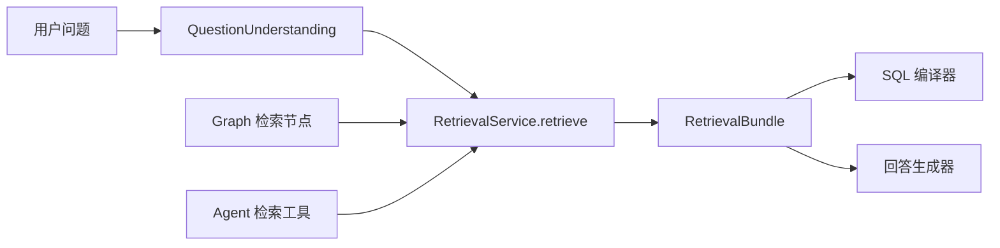
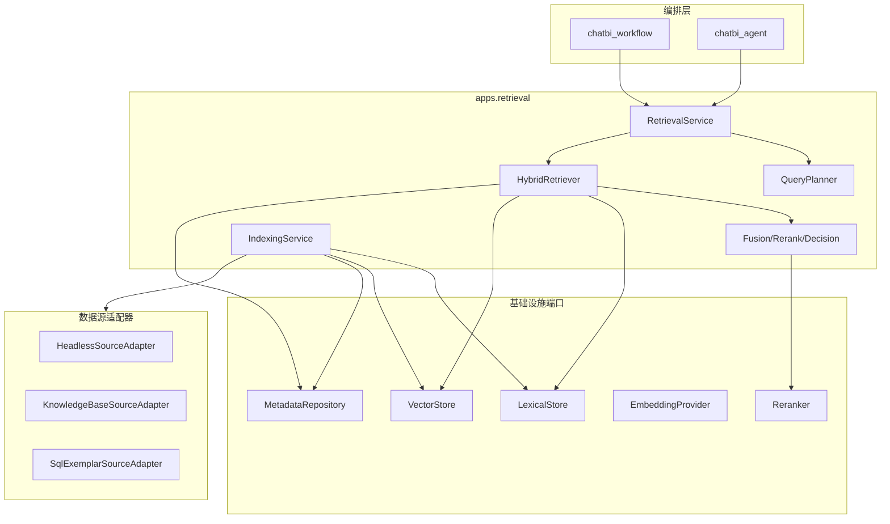

# ChatBI 统一检索平台设计

> 状态：方案评审稿
>
> 日期：2026-07-15
>
> 范围：Headless 语义资产、SQL 示例、未来 Youtu 类知识库，以及 Graph/Agent 的统一检索入口
>
> 实施计划：[RETRIEVAL_PLATFORM_IMPLEMENTATION_PLAN.md](./RETRIEVAL_PLATFORM_IMPLEMENTATION_PLAN.md)
>
> 实施状态：P0、P1-1～P1-5 已完成；`semantic-binding` 是 Graph/Agent 唯一检索策略，旧实现已移除

## 1. 需求理解

本需求不是“给现有指标表增加向量字段”，而是建设一套可被不同编排方式、不同知识源共同使用的检索能力。它需要同时解决五类问题：

1. **知识建模**：哪些对象适合转成可检索文档，哪些对象应保留为关系、规则或实时查询。
2. **查询建模**：用户原问题、上下文重写结果、指标/维度槽位和分析形态如何形成检索请求。
3. **召回与决策**：精确匹配、关键词、向量、关系扩展和重排如何协作，并能可靠判断命中、歧义和未命中。
4. **工程边界**：Graph 和 Agent 共享同一个能力层，Headless、知识库等作为数据源接入，避免编排层反向依赖。
5. **存储与生命周期**：源数据、检索文档、向量、索引任务、模型版本和查询审计如何分离并保持一致。

### 1.1 两种不同的检索目标

必须区分下面两类结果，不能把它们混成一组“相似文本”：

| 目标 | 典型来源 | 结果用途 | 质量偏好 |
| --- | --- | --- | --- |
| 语义绑定 | 指标、维度、维值、术语、模型 | 绑定稳定资产 ID，约束 SQL 编译 | 高精度、可判歧义、可执行 |
| 知识证据 | 文档、FAQ、表格、制度说明 | 为回答提供事实上下文和引用 | 高召回、可追溯、可引用 |

SQL 示例属于第三类“过程经验”：它帮助规划和编译，但既不是业务事实，也不能绕过语义资产校验。

### 1.2 业务不变量

以下约束应只在统一检索层表达一次：

1. 检索结果必须携带稳定资源 ID、来源、版本和权限范围。
2. SQL 编译只能使用本轮语义绑定结果中明确放行的资产 ID。
3. 权限、租户、数据集、资产状态等硬约束必须在召回前过滤，不能依赖模型事后排除。
4. 向量相似度只是候选信号，不能单独证明指标口径正确。
5. Graph 和 Agent 对同一个规范化请求应得到同版本、同策略的结果。
6. 检索通道不可用时必须返回明确的 `degraded` 诊断，禁止静默伪装成正常检索。
7. 索引是源数据的派生物；源数据仍是事实源，索引必须可重建、可切换、可回滚。

## 2. M0 实现评估与 M1 进展

M0 评估时，项目已经具备 pgvector 表、指标文本构造、向量生成和余弦检索能力，
但仍属于局部验证版本：

1. `HeadlessAssetEmbedding` 目前只写入 `METRIC`，唯一键也只允许每个资产保留一份向量，无法自然支持多视图和双模型切换。
2. Graph 运行时注入了 `metric_embedding_session`，Agent 的语义检索垫片没有注入，因此两个入口行为不同。
3. 向量检索使用宽泛异常捕获并静默退回关键词，调用方无法判断向量通道是否真实工作。
4. 重建逻辑先删除旧向量再逐条生成，重建期间没有原子切换，也缺少批处理、增量索引和失败重试状态机。
5. 当前召回是字符串相似度与指标向量结果追加，不是完整的混合召回、融合、重排和决策链路。
6. `chatbi_capabilities.semantic.retrieval` 仍反向导入 Workflow 适配器，说明检索核心尚未形成独立能力边界。

M1 已完成前 2、3、6 项的入口治理：检索核心已下沉到 `apps.retrieval`，Graph 与 Agent
共用 `RetrievalService`，通道状态通过统一 diagnostics 输出，已知故障显式词法降级，
未知异常直接失败。P1-1 进一步新增独立 source/resource/unit/embedding/index job/query trace
存储和 `080_retrieval_storage_p1` migration。P1-2 已实现 Headless 指标、维度、术语和受控
维值的细粒度 Projector，SQL、字段、Join condition 和权限条件不会进入 embedding 文本。
P1-3 新增 generation 状态表、批量 embedding 端口和统一 IndexingService：每次增量构建形成
完整快照，未变化 unit/向量直接复用，全部任务成功后才原子激活；已知失败可重试，旧 active
generation 始终保留并可回滚。P1-4 已新增确定性 QueryPlanner、active-generation 硬过滤、多通道召回
和资源级 RRF；P1-5 已新增版本化重排、按槽位门控、跨模型判定和统一编译白名单校验。
Graph 与 Agent 现已直接使用 `semantic-binding`；旧策略不再保留为 fallback，索引仍通过
active generation 保留数据级回滚能力。

## 3. 哪些数据应该被向量化

### 3.1 Headless 语义资产

一个业务资产可以投影成多个“检索单元”，检索命中后再折叠回同一个资源。这样比把所有字段拼成一段大文本更容易控制权重和解释命中原因。

| 资源 | 建议检索单元 | 是否向量化 | 说明 |
| --- | --- | --- | --- |
| 指标 | 身份、业务定义、使用约束 | 是 | 名称/别名强调精确召回；定义用于语义召回；粒度、聚合方式和适用模型用于过滤与重排 |
| 维度 | 身份、业务定义、角色说明 | 是 | 支持“门店/档口/摊位”等语义映射；必须保留 `group_by/filter` 角色 |
| 维值 | 标准值与别名组 | 选择性 | 只向量化经过治理的别名组、常用值或中低基数值；高基数值走精确/前缀/数据源查询 |
| 业务术语 | 名称、别名、定义、关联资产 | 是 | 用于术语解释和查询扩展，但关联资产仍通过关系表确定 |
| 数据模型/数据集 | 领域摘要、范围、主题 | 是 | 用于先路由到正确领域和数据集，不直接作为可执行字段 |
| 物理表/字段 | 名称、注释、类型摘要 | 可选 | 仅用于明确标记的 schema fallback，不能与已治理语义资产同权竞争 |
| 关联/Join | 关系边和约束 | 否 | 应保留为结构化图关系；可以把关系摘要附加到资产使用视图，但不能靠向量决定 Join |

指标建议至少投影两个检索单元：

```text
metric:{asset_id}:identity
指标名称：销售下单客户数
别名：下单客户数、购买客户数

metric:{asset_id}:definition
业务定义：产生销售订单的去重客户数
统计粒度：日
适用模型：门店销售
可用维度：门店、渠道、客户类型
```

名称和别名同时进入词法索引；定义视图进入词法与向量索引。聚合表达式、真实 SQL 和权限信息放在结构化 payload 中，不作为主要 embedding 文本。

P1-2 的投影契约使用两类 hash 表达不同不变量：

- `content_hash` 覆盖 unit 文本和结构化 metadata，用于判断 unit 是否需要持久化更新。
- `embedding_text_hash` 只覆盖实际送入 provider 的 `title + content + contextual_text`，后续写入
  `retrieval_embedding.text_hash`；ACL、Join 或关系 metadata 单独变化时不重复计算向量。

指标别名只属于 `identity`，定义只属于 `definition`，聚合与模型关系只属于 `usage`；维度和
术语采用同样的单元隔离。敏感级别大于 0 的 Headless 资产在统一 Projector 入口直接排除。

### 3.2 SQL 示例与成功经验

只索引经过验证、脱敏且具有稳定语义引用的示例：

- 规范化问题与确认后的意图摘要。
- 分析形态、查询 shape、时间模式。
- 使用的指标/维度/模型稳定 ID。
- 编译计划版本和执行成功标记。
- SQL 作为返回 payload，不把“裸 SQL 文本”当成唯一召回文本。

示例命中只提供规划参考。编译时仍必须重新通过当前版本语义资产和权限校验，避免复用过期字段、越权条件或旧口径。

### 3.3 Youtu 类知识库

知识库采用“文档资源 + 结构化分块”的方式：

- 文档级摘要：用于先选文件或主题。
- 标题路径：文档名、章节层级、表格名、页码。
- 内容块：按标题、段落、列表、表格或 QA 结构切分。
- 上下文前缀：每个 chunk 带文档名和章节路径，避免块脱离上下文。
- 表格：优先按表头与行组构造块，不按固定字符硬切。
- OCR/图片说明：作为独立内容类型，保留页码和原文件引用。
- ACL、知识库 ID、文件 ID、来源版本和有效期：只作为硬过滤元数据。

固定的 `1000 + 200 overlap` 只能作为普通文本初始值，不能套用到语义资产、表格和 FAQ。每种内容类型应有独立 projector/chunker。

### 3.4 不应直接向量化的数据

- 大量事实表明细行和高基数流水值。
- 密钥、权限表达式、个人敏感信息和无权访问的原文。
- Join 条件、资产状态、租户 ID 等需要精确判断的字段。
- 实时查询结果、临时推理、失败 SQL 和未经确认的模型输出。
- 整个数据集 schema 拼成的超长文档。
- 未经治理的所有维值；这会造成体量膨胀、噪声和数据泄漏风险。

## 4. 用户问题如何参与检索

### 4.1 唯一输入事实源

检索层接收 `QuestionUnderstandingOutput`，不在 Graph 节点、Agent 工具和各检索器中重复改写问题。现有问题理解已经给出：

- `original_question` 与 `rewritten_question`
- `intent_type`、`metric_mentions`
- `dimension_slots` 及其 `group_by/filter/ambiguous` 角色
- `time_range`、`filter_mentions`
- `required_slot_types`、`query_shape`
- 歧义与冲突槽位

检索层只做确定性的 `QueryPlanner` 投影，不让 LLM 在检索阶段生成资产 ID。

### 4.2 统一查询契约

```text
RetrievalRequest
  request_id / tenant_id / actor_id
  original_question / rewritten_question
  intent / inherited_context
  scopes: dataset_ids / knowledge_base_ids / source_ids
  permissions
  profiles: [semantic_binding, sql_exemplar, knowledge_evidence]
  strategy_version

RetrievalSubQuery
  subquery_id
  purpose: metric | dimension | value | term | exemplar | evidence
  text
  role
  required
  filters
```

`QueryPlanner` 对不同用途生成不同子查询：

| 用途 | 查询文本 | 约束 |
| --- | --- | --- |
| 指标绑定 | 每个完整 `metric_mention`，辅以整句上下文 | `asset_type=METRIC`、数据集/领域范围 |
| 维度绑定 | 每个 `dimension_slot.name` | `asset_type=DIMENSION`，保留角色 |
| 维值绑定 | `slot.name + provided value` | 先精确/别名，再选择性向量 |
| 术语解释 | 原业务短语 | `asset_type=TERM` |
| SQL 示例 | 规范化问题 + `intent_type/query_shape` | 只返回已验证、模型兼容的示例 |
| 知识证据 | 完整 `rewritten_question` | 知识库、文件、ACL 和有效期过滤 |

不要把所有槽位和历史上下文拼成一个超长向量查询。它会让指标和维度互相稀释，也无法判断哪个必填槽位未命中。

P1-4 的实现只读取 `RetrievalRequest.intent`：每个显式指标、维度槽位和已提供维值形成独立
required subquery，术语只接受 `subject_domain.terms` 中的显式输入；缺少 mention 时不会用整句
猜测资产。计划包含稳定 fingerprint，便于结果复现和问题定位。

### 4.3 Graph 与 Agent 的使用方式



- Graph 在问题理解/澄清完成后，用确定性节点调用统一服务。
- Agent 工具继续采用“无自由文本参数”，从共享 state 读取已经确认的问题理解，防止 Agent 私自改变检索意图。
- 两个入口只负责传递运行上下文，不注入不同的向量会话或检索器实现。
- 检索结果以同一个 `RetrievalBundle` 返回，Graph/Agent 只选择消费其中哪些分组。

## 5. 检索策略

### 5.1 按 profile 配置策略

不要使用一套全局 `top_k + similarity_threshold`。至少提供以下 profile：

| Profile | 目标 | 主要通道 | 决策方式 |
| --- | --- | --- | --- |
| `semantic_binding` | 可执行资产绑定 | 精确、别名、词法、向量、关系 | 严格槽位覆盖和歧义门控 |
| `sql_exemplar` | 规划示例 | 词法、向量、shape 过滤 | 返回参考，不直接放行资产 |
| `knowledge_evidence` | 文档证据 | 词法、向量、文件级路由、重排 | 相关性、覆盖度和引用完整性 |
| `schema_fallback` | 物理结构兜底 | 精确、词法 | 必须显式启用并标记来源 |

### 5.2 五阶段检索链路


#### 阶段一：硬过滤

在相似度检索前应用：租户、用户权限、数据集/知识库、资产类型、发布状态、模型兼容性、来源版本和有效期。过滤字段必须建立普通 B-tree/GIN/payload 索引。

#### 阶段二：并行多路召回

1. 精确名称和批准别名：最高优先级，但同名多资产仍需判歧义。
2. 词法召回：中文首版选择 PostgreSQL `pg_trgm`，资源标题与 unit 文本分别使用部分 GIN
   索引；`tsvector(simple)` 保留为基准，不作为连续中文主通道。
3. Dense 向量召回：处理同义表达和描述级语义。
4. 关系扩展：对已命中的指标扩展其允许维度、所属模型和关联术语。
5. 示例召回：独立通道，不和资产分数混排。

第一版建议每个槽位：词法 top 20、向量 top 20，合并后最多 50 个候选。知识库可从各通道取 top 40，再进入重排。具体数值必须通过离线评测校准。

#### 阶段三：去重与融合

不同通道分数不可直接加权，因为词法分数、余弦相似度和规则分数没有统一标尺。默认采用 Reciprocal Rank Fusion：

```text
RRF(resource) = sum(1 / (k + rank_channel(resource)))，初始 k = 60
```

检索单元先按资源 ID 折叠，保留每个通道的 rank、原始 score、命中字段和命中文本，用于解释和离线分析。

`chinese-lexical` PostgreSQL 基准的 Recall@3：exact/alias `0.4`、
`tsvector(simple)` `0.4`、`pg_trgm` `1.0`、dense `1.0`、RRF `1.0`。该基准同时实际执行
`pg_trgm` 与 pgvector `<=>`，因此首版词法选择和“融合不低于最佳单通道”均有可重复记录。

#### 阶段四：领域重排

- 对融合后的 top 20～50 使用可选 cross-encoder/reranker。
- 叠加确定性业务特征：精确别名、批准状态、数据模型兼容、必填槽位角色、来源可信度、版本新鲜度。
- LLM 只能在候选集合内重排，不能生成新 ID，也不能推翻权限和兼容性硬约束。
- 低延迟路径中，唯一精确别名命中且不存在冲突时，可跳过向量和重排。

#### 阶段五：决策门控

`semantic_binding` 需要按槽位而不是按整个问题判定：

- `resolved`：所有必需槽位均有唯一、兼容且通过阈值的候选。
- `ambiguous`：top1/top2 差距不足，或同名候选分属不同口径/模型。
- `partial`：部分必需槽位命中，部分未命中。
- `missed`：没有可直接使用的资产定义。
- `cross_model`：各槽位分别命中，但无法在同一可执行模型中组合。
- `degraded`：配置要求的检索通道不可用；同时说明已执行哪些备用通道。

门控参数按 profile、资产类型和模型版本配置，不能复用一个全局 0.7。阈值必须来自标注集校准，并同时使用 top1 绝对置信度、top1/top2 gap、槽位覆盖率和模型兼容性。

对用户展示的文案与机器状态分离。例如机器状态仍可为 `missed`，前端展示“检索完成，未找到可直接使用的指标/维度定义”。

## 6. 工程架构与解耦

### 6.1 模块边界

建议新增独立 bounded context：`backend/apps/retrieval`。它可以依赖 Headless、知识库等来源适配器，但不得依赖 Graph 或 Agent。



核心只保留真实边界，避免把流程拆成大量单次调用的小类：

- `RetrievalService`：统一应用入口，编排完整检索事务。
- `QueryPlanner`：把问题理解投影成分槽查询。
- `HybridRetriever`：执行过滤、各通道召回和候选收集。
- `RetrievalPolicy`：按 profile 完成融合、重排和门控。
- `IndexingService`：消费来源变更并生成检索单元。
- `SourceProjector`：每种来源特有的文档/分块构造逻辑。
- `VectorStore`、`LexicalStore`、`EmbeddingProvider`、`Reranker`：需要替换基础设施时才使用的端口。

### 6.2 统一结果契约

```text
RetrievalHit
  resource_id / resource_type / source_type / source_id
  unit_id / content_kind / title / snippet
  scores: exact / lexical / dense / rerank / final
  ranks_by_channel
  matched_field / matched_text
  metadata / provenance / source_version

RetrievalBundle
  bindings: metrics / dimensions / values / terms / models
  exemplars
  evidence
  decision: status / slot_decisions / ambiguities / allowed_asset_ids
  diagnostics: strategy_version / index_generation / channels / latency / degraded_reason
```

`allowed_asset_ids` 由统一决策器一次生成，SQL 编译器只消费这个字段。知识库 chunk 和 SQL 示例永远不会进入该集合。

### 6.3 配置与错误语义

- 每个 profile 通过版本化配置声明启用通道、top-k、过滤、融合、重排和门控参数。
- Embedding provider 启动时执行配置与健康检查；缺少密钥应明确标记不可用。
- 允许业务配置“向量通道不可用时继续词法检索”，但结果必须是 `degraded`，同时写事件和监控指标。
- 索引构建失败记录单条资源错误并可重试；查询主链路不使用宽泛 `try/catch` 吞掉未知错误。
- 所有结果记录 `strategy_version + embedding_profile + index_generation`，保证问题可复现。

## 7. 向量与检索存储设计

### 7.1 推荐选择

第一阶段继续使用 PostgreSQL + pgvector，原因是当前规模较小、项目已有依赖和迁移、语义资产需要强元数据过滤和事务一致性。此时引入独立向量数据库只会增加双写、一致性、权限和运维成本。

保留 `VectorStore` 端口，在满足以下任一条件后再评估 Qdrant/Milvus/OpenSearch：

- 向量量级进入千万级并持续增长。
- 检索 QPS、索引构建或资源隔离需要独立扩缩容。
- pgvector 在真实过滤条件下无法达到 P95 延迟和召回目标。
- 需要当前 PostgreSQL 方案难以提供的多向量、稀疏向量或分布式能力。

迁移依据必须来自压测和召回评测，不以“向量库更专业”作为理由。

### 7.2 逻辑表模型

```text
retrieval_source
  id, tenant_id, source_type, source_key, config, acl_policy, source_version, status

retrieval_index_generation
  id, tenant_id, source_id, generation, source_version, previous_generation
  embedding_profile/provider/model/dimension, status, job/resource/unit/embedding counts

retrieval_resource
  id, tenant_id, namespace, resource_type, source_id, source_resource_id
  parent_resource_id, title, metadata, acl, source_version, content_hash, status

retrieval_unit
  id, resource_id, unit_key, content_kind, title, content, contextual_text
  language, metadata, lexical_vector, content_hash, index_generation, status

retrieval_embedding
  id, unit_id, embedding_profile, model, dimension, embedding
  text_hash, index_generation, status, error_code, created_at

retrieval_index_job
  id, source_id, resource_id, operation, target_generation
  status, attempts, error_code, available_at, started_at, finished_at

retrieval_query_trace
  request_id, profile, query_hash, filters, channels, candidate_ranks
  decision, strategy_version, index_generation, latency, error_code
```

关键约束：

- `resource` 是可返回的业务实体；`unit` 是它的某个检索视图或知识块。
- `(resource_id, unit_key, index_generation)` 唯一，支持同一资产多视图。
- `(unit_id, embedding_profile, index_generation)` 唯一，支持模型双写和影子评测。
- ACL、租户、数据集、知识库、资产状态是可索引列或规范化字段，不能只放在 JSONB。
- embedding 与源业务表分离，避免模型升级修改业务 schema。

### 7.3 pgvector 物理设计

- 当前 `BAAI/bge-m3` dense 向量为 1024 维，可使用固定 `vector(1024)`。
- 不同维度不要混用同一个 HNSW 索引。逻辑 `retrieval_embedding` 可按 `embedding_profile` 映射到固定维度的物理分区/表。
- 小规模先使用精确扫描作为基准；数据量达到压测阈值后创建 HNSW。
- HNSW 适合读多、召回要求高的在线检索；IVFFlat 只有在构建速度和内存约束更重要时再评估。
- 给 `tenant_id`、`namespace`、`dataset_id/knowledge_base_id`、`resource_type`、`status` 建普通索引。
- 高频且低基数隔离条件可使用分区/部分索引；不要为每个小租户创建一张表或一个 collection。
- approximate search 上线后，持续用同一查询的精确扫描结果测 Recall@K。

### 7.4 索引生命周期


1. 来源变更与 outbox 事件在同一事务提交，避免直接双写向量库。
2. Indexer 按 `source_version + content_hash` 幂等处理新增、更新、删除和发布状态变化。
3. 新 generation 必须是来源的完整快照：增量更新时复制未触碰的 active unit 和向量，只对
   `embedding_text_hash` 变化的 unit 调用 provider，避免“增量 generation 只有半份数据”。
4. 文档、词法索引和向量先以 pending 状态写入；generation 行锁串行化并发任务的最终检查，
   全部任务成功且 unit/vector 数量完整后才原子切换 active generation。
5. 构建中或构建失败时，存在旧 active generation 的 source 仍保持可服务；失败 generation
   独立记录错误和任务明细，不污染旧 active 状态。
6. 模型升级采用影子 generation：双写、离线评测、少量流量验证、切换、保留回滚窗口。
7. 定时 reconciliation 对比源版本、active 指针和 unit/vector 数量，发现漏事件后统一触发 full rebuild。
8. 删除先标记 tombstone 并立即从查询过滤，新 generation 激活后再按保留策略清理旧向量。

## 8. 评测、监控与安全

### 8.1 离线评测集

分别建设三套 gold set，不能只用一组查询评估所有 profile：

| 数据集 | 必要标注 | 核心指标 |
| --- | --- | --- |
| 语义绑定 | 槽位、相关/唯一资产、应澄清、应未命中、模型兼容性 | Precision@1、Recall@K、MRR、槽位覆盖、歧义识别、错误自动绑定率 |
| SQL 示例 | 相关示例、shape/模型兼容性 | nDCG@K、MRR、编译成功率、执行正确率 |
| 知识证据 | 相关 chunk、答案证据、引用位置 | Recall@K、nDCG@K、重排增益、引用完整率、groundedness |

还需覆盖中文简称、别名、错别字、多指标、多维度、同名不同口径、跨模型、无结果和越权查询。

### 8.2 在线指标

- 分通道 P50/P95/P99 延迟、错误率、超时率和 degraded 比例。
- 每类资源的 exact/lexical/vector/rerank 命中贡献。
- 澄清率、澄清后成功率、用户改写率、无结果率。
- 语义绑定后 SQL 编译失败、校验失败和执行失败的归因。
- 索引积压、失败任务、源/索引版本差、向量模型调用成本。
- 近似向量结果对精确扫描结果的 Recall@K。

### 8.3 安全要求

- ACL 在召回前过滤，并在结果组装时做第二次稳定 ID 校验。
- 索引文档禁止写入密钥和不需要检索的敏感字段。
- 查询日志默认保存 hash、结构化槽位和候选 ID；原问题与文档片段按数据治理要求脱敏/限期保留。
- 外部 embedding/reranker provider 必须显式声明数据出域策略。
- 缓存键必须包含 profile、租户/权限版本、scope、策略版本和索引 generation，避免跨权限复用结果。

## 9. 分阶段实施

### Phase 0：契约与基线

- 固化 `RetrievalRequest/RetrievalBundle` 和机器状态语义。
- 从现有 trace、澄清案例和资产别名建立第一版 gold set。
- 记录当前关键词检索、现有指标向量检索的质量和延迟基线。

验收：同一测试问题能确定性判断应命中、应歧义或应未命中。

### Phase 1：统一入口，不改变召回算法

- 建立 `apps.retrieval.RetrievalService`。
- 把当前 `HeadlessKnowledgeAdapter` 中的检索核心下沉，移除 capabilities 对 workflow 的反向依赖。
- Graph 和 Agent 注入同一个 service；删除“入口是否传 session 决定是否向量检索”的差异。
- 暂时封装旧关键词/指标向量通道，但补充显式 channel diagnostics。

验收：Graph/Agent 对相同请求返回相同候选、状态、策略版本和通道状态。

### Phase 2：统一文档与索引生命周期

- 落地 resource/unit/embedding/job 表。
- 实现 Headless projector，覆盖指标、维度、术语和选择性维值。
- 使用 outbox、增量任务、generation 激活和定时对账。
- 迁移现有指标向量，重建过程不删除在线旧 generation。

验收：资产变更在 SLA 内可检索；失败可见、可重试；索引可全量重建和回滚。

### Phase 3：混合检索与门控

- 上线精确/别名、词法、dense、RRF、可选 reranker。
- 按槽位返回决策，统一 `resolved/ambiguous/partial/missed/cross_model/degraded`。
- SQL 编译只接受 `allowed_asset_ids`。

验收：gold set 上错误自动绑定率不劣于基线，Recall@K 和澄清准确率达到评审目标。

### Phase 4：SQL 示例

- 只接入验证成功、脱敏且引用稳定资产 ID 的样本。
- 加入模型版本、schema 版本和 query shape 过滤。
- 评估示例召回对编译成功率和 SQL 正确率的真实增益。

### Phase 5：知识库

- 新增知识库 source adapter 和按内容类型分块的 projector。
- 增加文件级路由、chunk 混合检索、rerank 和引用返回。
- 保持 evidence 与 semantic bindings 分组，禁止知识文本直接放行 SQL 资产。

### Phase 6：规模化评估

- 根据真实容量、QPS、过滤条件和 P95 结果决定是否继续 pgvector。
- 需要外部向量库时，只替换 `VectorStore` 和索引写入实现；上层契约、资源 ID、权限和评测集保持不变。

## 10. 首版建议参数与待校准项

| 参数 | 建议初值 | 说明 |
| --- | --- | --- |
| 语义槽位 lexical/dense top-k | 20 / 20 | 先保证召回，再由融合和门控收敛 |
| 语义融合候选上限 | 50 | 防止重排成本失控 |
| 语义最终候选 | 每槽 5 | 便于判歧义和前端解释 |
| 知识库 lexical/dense top-k | 40 / 40 | 文档证据更偏召回 |
| 知识库 rerank/final | 20 / 6～10 | 由答案长度和引用覆盖校准 |
| RRF k | 60 | 常用稳定初值，不作为永久常量 |
| HNSW 启用阈值 | 由压测决定 | 小规模保留精确扫描基线 |

上述参数必须进入版本化 profile 配置，并通过 gold set、线上反馈和延迟预算调整，不能散落为代码常量。

## 11. 明确结论

1. **检索对象按语义资产、过程示例、知识证据分域，统一入口但不统一业务判定。**
2. **一个资源允许多个检索单元；向量是检索单元的版本化派生物，不属于源业务表。**
3. **用户问题先由共享问题理解形成稳定槽位，再按用途生成多个子查询，而不是只 embedding 整句。**
4. **首选精确/词法/dense 混合召回，使用 RRF 融合、可选重排和按槽位门控。**
5. **Graph 和 Agent 只依赖同一个 RetrievalService，检索能力不依赖任何编排实现。**
6. **第一阶段使用 PostgreSQL + pgvector；通过端口和 generation 机制保留未来迁移能力。**
7. **没有离线评测、显式降级和索引版本，就不应把向量命中直接用于 SQL 资产绑定。**

## 12. 参考资料

### 项目内参考

- `apps/chatbi_capabilities/question_understanding.py`：共享问题理解与槽位结构。
- `apps/headless/metric_embedding.py`：当前指标 embedding 构造、生成与查询。
- `apps/chatbi_workflow/capabilities/adapters/knowledge.py`：当前文档召回和决策逻辑。
- `extra/supersonic`：元数据事件更新、周期重载、元数据过滤和 SQL 示例召回。
- `extra/youtu-rag/utu/rag`：Document/Chunk/Retriever/VectorStore 抽象与知识库构建流程。

### 外部资料

- [pgvector 官方文档](https://github.com/pgvector/pgvector)：索引类型、过滤、分区、不同维度和近似召回评估。
- [PostgreSQL 全文检索](https://www.postgresql.org/docs/current/textsearch-controls.html)：`tsvector`、字段权重和排名。
- [Elastic Hybrid Search](https://www.elastic.co/docs/solutions/search/hybrid-search)：词法与向量混合检索及 RRF。
- [Anthropic Contextual Retrieval](https://www.anthropic.com/engineering/contextual-retrieval)：上下文化分块、BM25、dense 与 rerank 组合。
- [BEIR](https://arxiv.org/abs/2104.08663)：异构检索评测，以及词法、dense 和 rerank 的效果/成本差异。
- [BGE-M3](https://arxiv.org/abs/2402.03216)：多语言 dense、sparse 和 multi-vector 能力。
- [Qdrant Filtering](https://qdrant.tech/documentation/search/filtering/) 与 [Multitenancy](https://qdrant.tech/documentation/tutorials/multiple-partitions/)：元数据过滤和多租户 collection 设计参考。
