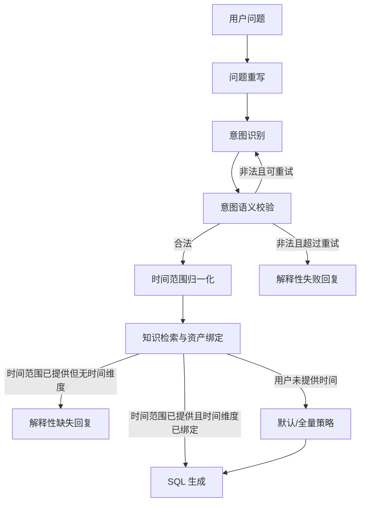

# ChatBI 时间槽位识别与绑定设计

## 背景

当前 ChatBI v1 在意图识别阶段存在两个相关问题：

- 普通维度值可能被误填为时间表达，例如把“今天”填入“店铺”的 `dimension_slots.value`。
- 用户明确提供时间范围后，如果知识检索未绑定到时间维度，流程仍可能继续生成缺少时间条件的 SQL。

这两个问题的共同根因是：时间范围、时间粒度、时间维度绑定没有被完整地作为一等语义槽位处理。当前流程已经有 `time_mentions`、`time_range`、`time_dimension`、默认时间维度候选等概念，但缺少稳定的提示词约束、语义校验回路和受控时间表达。

## 设计目标

1. 防止时间表达进入普通维度值。
2. 用户明确提供时间范围时，必须绑定可查询的时间维度。
3. 区分“用户未提供时间”和“用户提供了时间但系统无法绑定时间字段”。
4. 将灵活自然语言时间值归一为受控结构，避免 SQL 层直接消费原始文本。
5. 尽量减少无意义追问：普通指标查询在用户未说时间时可继续使用数据集默认或全量策略。

## 参考方案

开源 BI 与 Headless BI 项目通常将时间作为专门结构处理：

- Superset 有独立日期解析逻辑，支持 `Last 7 days`、`previous calendar month`、`first day of this month` 等自然语言时间范围。
- Metabase 将日期列过滤区分为 specific date 与 relative date，并提供 `today()`、`now()`、`relativeDateTime()`、`interval()` 等受控表达。
- Cube 在查询 DSL 中使用 `timeDimensions: [{ dimension, dateRange, granularity }]`，时间字段、时间范围和粒度相互独立。
- Lightdash 将时间维度建模为 `DAY`、`WEEK`、`MONTH`、`RAW`、`QUARTER` 等 interval，并区分 rolling/current/completed period。
- SuperSonic 将 ChatBI 链路拆为 Schema Mapper、Semantic Parser、Semantic Corrector、Semantic Translator，适合参考其“语义修正后再进入 SQL 翻译”的边界。

## 总体方案

### 1. 优化意图识别提示词

意图识别提示词需要明确约束：

- `今天`、`今日`、`昨天`、`本周`、`本月`、`最近7天`、`近30天`、`去年同期`、`按天`、`按月` 等只能进入 `time_mentions`、`time_range` 或 `query_shape.time_grain`。
- 普通维度槽位的 `value` 不得是时间表达。
- 如果用户说“今天店铺销售额”，应输出：

```json
{
  "dimension_slots": [
    {
      "name": "店铺",
      "role": "ambiguous",
      "value": null,
      "value_status": "not_provided"
    }
  ],
  "time_mentions": ["今天"],
  "time_range": {
    "raw": "今天",
    "value_status": "provided"
  }
}
```

提示词只能降低模型犯错概率，不能作为唯一防线。

### 2. 增加意图语义校验

在意图识别节点输出后增加确定性校验：

- 遍历 `dimension_slots`。
- 如果 `role=filter` 且 `value_status=provided`，检查 `value` 是否命中时间表达。
- 如果命中，产出 `intent_validation.status=invalid`，并记录错误码。

示例：

```json
{
  "status": "invalid",
  "reason_code": "DIMENSION_VALUE_IS_TIME_EXPRESSION",
  "repair_hint": "普通维度值不能是时间表达；请将“今天”放入 time_range，并将店铺值标记为未提供。"
}
```

该校验不应静默修复后直接进入知识检索，否则错误来源不透明，也容易掩盖提示词问题。

### 3. 校验失败后回到意图识别节点

当意图语义校验失败时，流程回到 `recognize_intent`，并将 `intent_validation` 作为 `user_feedback` 或专门的 `intent_repair_feedback` 传入。

重跑策略：

- 第一次失败：带 repair hint 重跑意图识别。
- 第二次仍失败：使用确定性修正兜底，或进入解释性失败回复。
- 必须设置最大重试次数，避免工作流循环。

这相当于在当前工作流中加入轻量 Semantic Corrector。

### 4. 时间值由用户提供，时间字段由资产提供

需要严格区分两个概念：

- 时间值：用户自然语言提供，例如“今天”“本月”“最近7天”。如果业务问题必须要时间而用户没说，可以向用户追问。
- 时间字段：系统从 Headless 资产中绑定，例如 `stat_date`、`created_at`、`pay_time`。用户不应该补数据库字段名。

因此，用户明确给了时间范围后，知识检索必须绑定一个时间维度：

- 优先使用指标或模型配置的默认时间维度。
- 其次使用数据集默认时间维度。
- 再其次使用唯一可用时间维度。
- 多个可用时间维度且无法判定时，进入系统解释或资产配置问题，不让业务用户选择数据库字段。
- 无可用时间维度时，不能继续生成无时间条件 SQL。

缺失原因示例：

```json
{
  "status": "missed",
  "missing_required_slots": ["time_dimension"],
  "reason_code": "TIME_RANGE_PROVIDED_BUT_TIME_DIMENSION_MISSING",
  "message": "当前指标所在模型没有配置时间维度，无法应用“今天”筛选。"
}
```

### 5. 时间范围归一为受控 AST

`time_range.raw` 保留原文，但 SQL 层应消费归一后的结构。

示例：

```json
{
  "raw": "最近7天",
  "value_status": "provided",
  "normalized": {
    "kind": "relative_range",
    "unit": "day",
    "amount": 7,
    "anchor": "today",
    "include_current": true,
    "timezone": "Asia/Shanghai"
  }
}
```

第一阶段支持范围：

- 单日：今天、今日、昨天、昨日、明天。
- 当前周期：本周、本月、本季度、本年。
- 上一完整周期：上周、上月、上季度、去年。
- 滚动窗口：最近 N 天、近 N 天、最近 N 周、最近 N 月。
- 粒度表达：按天、按周、按月、按季度、按年。

不在第一阶段支持的表达先保留 raw，并标记 `normalized.status=unsupported`，避免错误生成 SQL。

## 数据流



## 用户交互策略

用户未提供时间：

- 普通指标查询默认不追问，走数据集默认时间或全量策略。
- 趋势、同比、环比、异常分析等强依赖时间边界的问题，仍可追问时间范围。

用户已提供时间：

- 如果时间表达可解析且时间维度可绑定，正常生成时间过滤。
- 如果时间表达可解析但无时间维度，返回资产配置层面的解释，不要求用户补数据库字段。
- 如果时间表达不可解析，追问用户换一种明确时间说法，例如“今天、本月、最近7天”。

## 错误与边界

- `DIMENSION_VALUE_IS_TIME_EXPRESSION`：普通维度值命中时间表达，应回到意图识别修正。
- `TIME_RANGE_UNSUPPORTED`：时间表达超出当前解析能力，应追问时间范围。
- `TIME_RANGE_PROVIDED_BUT_TIME_DIMENSION_MISSING`：用户提供时间但资产无时间维度，应返回解释性失败。
- `TIME_DIMENSION_AMBIGUOUS`：存在多个时间维度但无默认配置，应优先提示资产治理问题。
- `INTENT_REPAIR_RETRY_EXCEEDED`：意图修正重试超过上限，应解释失败而不是继续 SQL。

## 测试建议

意图识别提示词测试：

- “今天店铺销售额”不能输出 `{"name":"店铺","value":"今天"}`。
- “今天 1 号店铺销售额”应识别 `time_range=今天`，店铺维度值为 `1`。
- “按月看销售额”应输出时间粒度，不应把“月”当普通维度值。

校验回路测试：

- 模型输出 `店铺=今天` 时，产生 `DIMENSION_VALUE_IS_TIME_EXPRESSION` 并路由回 `recognize_intent`。
- 第二次修正成功后继续知识检索。
- 超过重试次数后不进入 SQL。

知识绑定测试：

- `time_range.value_status=provided` 且有默认时间维度时，生成时间过滤绑定。
- `time_range.value_status=provided` 且没有时间维度时，返回 `TIME_RANGE_PROVIDED_BUT_TIME_DIMENSION_MISSING`。
- `time_range.value_status=not_provided` 时，普通指标查询不强制缺失 `time_dimension`。

时间解析测试：

- 今天、昨天、本月、上月、最近7天、近30天能生成稳定 AST。
- 不支持的时间表达保留 raw 并标记 unsupported。
- SQL 层只消费 normalized AST，不直接解析自然语言原文。

## 非目标

- 不让业务用户选择数据库字段名作为时间维度。
- 不在第一阶段覆盖所有自然语言时间表达。
- 不把所有查询都强制要求时间范围。
- 不用提示词替代确定性校验。

