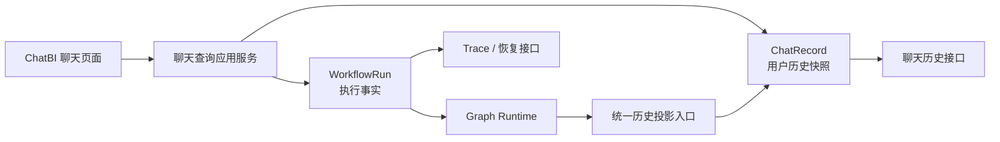

# ChatBI Graph 历史记录持久化与恢复设计

## 1. 背景与问题结论

当前项目已经具备三类持久化能力：

- `chat` / `chat_record` 保存传统聊天历史；
- `workflow_run`、Checkpoint、Event、Interaction 和 Artifact 保存 Graph 执行事实；
- Graph API 在请求携带 `chat_id` 时能够创建 `ChatRecord`，并从最近一次成功 Run 投影语义摘要。

但真实 Graph ChatBI 主链路没有形成完整闭环：

1. 前端 Graph 查询没有提交 `chat_id`，后端因此不会创建 `ChatRecord`；
2. 聊天历史查询没有返回 `status` 和 `trace_id`；
3. 最终答案主要写在前端内存，后端只同步 Run 状态和结束时间；
4. 澄清恢复、取消和重试没有统一同步 `ChatRecord`；
5. 已完成记录重新打开时不会重新加载 Run，导致没有快照的最终答案为空。

因此，Graph Run 并未消失，而是成为无法归属到具体会话的孤立执行记录，刷新或切换会话后无法从聊天历史恢复。

## 2. 目标

- 新产生的交互式 Graph Run 必须属于一个明确的 Chat 和 ChatRecord。
- ChatRecord 保存可独立展示的稳定历史快照。
- WorkflowRun 保存执行事实、恢复状态和技术详情。
- 刷新、重新登录或切换会话后，问题、答案、SQL、状态和 Trace 仍可查看。
- `waiting_input` Run 可以在重新打开会话后继续处理澄清。
- Run 与 ChatRecord 的生命周期状态保持一致。
- 删除会话时清理全部关联 Workflow 数据和 Artifact。
- 独立 Semantic Graph 执行保持可用，并与聊天执行具有明确不同的入口语义。

## 3. 非目标

- 不自动回填当前缺少 `chat_id` / `record_id` 的孤立 Run。
- 不通过用户、数据集和时间窗口推断旧 Run 所属会话。
- 不把完整历史问答、SQL 结果或 Trace 全量输入下一轮模型。
- 不重构 Graph Runtime 的通用节点执行模型。
- 不引入通用事件消费者或完整 CQRS 基础设施。
- 不再次清空现有 `chat`、`chat_record` 或 `workflow_run` 数据。

## 4. 核心架构

采用“执行事实 + 稳定历史投影”的双层模型：



### 4.1 WorkflowRun

WorkflowRun 是执行事实源，负责保存：

- Graph 定义和版本；
- 当前节点和运行状态；
- 轻量上下文；
- Checkpoint；
- NodeExecution；
- Event；
- Interaction；
- Artifact 引用。

Graph Runtime 保持通用，不直接依赖 `ChatRecord`，也不包含聊天页面展示逻辑。

### 4.2 ChatRecord

ChatRecord 是面向用户的稳定读模型，负责保存：

- 用户问题；
- 最终文本答案；
- SQL 摘要；
- 图表展示快照；
- 状态；
- 公开错误摘要；
- `trace_id`；
- 创建和结束时间。

终态历史默认只读取 ChatRecord；只有查看执行详情或恢复非终态 Run 时才访问 Graph API。

### 4.3 核心业务不变量

1. 每个聊天页面发起的 Graph Run 必须具有合法的 `chat_id` 和 `record_id`。
2. 一个 Graph ChatRecord 最多关联一个 WorkflowRun。
3. 重试沿用原 Run 和原 ChatRecord，不创建第二条历史。
4. 终态 ChatRecord 必须能够脱离 Graph Context 独立展示。
5. 独立 Semantic Run 必须通过明确的独立执行入口创建，不能由交互式入口漏传 `chat_id` 后静默产生。
6. Workflow 数据与会话同生命周期。

## 5. 数据模型

### 5.1 WorkflowRun 关联列

在 `workflow_run` 增加：

- `chat_id bigint null`：独立 Run 为空；
- `record_id bigint null`：独立 Run 为空。

索引与约束：

- `record_id` 唯一索引，保证一条聊天记录最多关联一个 Run；
- `(chat_id, created_at)` 索引，支持会话级查询和清理；
- 交互式创建服务同时校验 `chat_id` 与 `record_id`，不以 Context JSON 作为唯一关联依据。

Context 中仍可保留 `chat_id` 和 `record_id`，用于执行节点读取，但数据库列是关联和生命周期管理的标准入口。

### 5.2 ChatRecord 字段

复用现有字段：

- `question`；
- `sql_answer`；
- `sql`；
- `chart_answer`；
- `chart`；
- `status`；
- `trace_id`；
- `error`；
- `finish`；
- `finish_time`。

新增：

- `execution_type`：`legacy | agentic | graph`。

历史记录必须依据自身 `execution_type` 选择展示组件，不能依赖当前全局 ChatBI 流程配置，也不能依赖 `trace_id` 前缀推断执行类型。

### 5.3 Artifact 清理任务

增加面向文件正文删除的轻量清理任务表 `workflow_artifact_cleanup`：

- `artifact_id`：唯一；
- `storage_uri`：待删除文件位置；
- `status`：`pending | succeeded | failed`；
- `attempts`：已尝试次数；
- `last_error`：最近一次明确错误；
- `created_at` / `updated_at`。

该表只解决会话删除后的 Artifact 正文清理，不作为通用事件总线。重复提交相同 `artifact_id` 必须幂等。

## 6. API 契约

### 6.1 交互式 Graph Chat

新增明确的交互式入口：

```text
POST /graph/chats/{chat_id}/queries
POST /graph/chats/{chat_id}/queries/stream
```

入口行为：

1. 校验会话所有权、租户、用户和数据集绑定；
2. 创建 ChatRecord；
3. 创建关联的 WorkflowRun；
4. 返回 `run_id` 和 `record_id`；
5. 执行 Graph 并在边界状态投影聊天快照。

缺少或无权访问会话时直接失败，不允许降级为独立 Run。

### 6.2 独立 Graph 执行

保留现有独立入口：

```text
POST /graph/queries
POST /graph/queries/stream
```

该入口用于 Semantic、调试和评估，不创建 ChatRecord，`workflow_run.chat_id` 与 `record_id` 均为空。

### 6.3 Run 响应

交互式 Run 响应增加：

```json
{
  "run_id": "graph-xxx",
  "record_id": 123,
  "status": "running"
}
```

前端收到响应后，用真实 `record_id` 替换临时展示项。

### 6.4 聊天历史响应

Graph 历史记录至少返回：

```json
{
  "id": 123,
  "chat_id": 10,
  "execution_type": "graph",
  "question": "本月销售额是多少",
  "sql_answer": "本月销售额为……",
  "sql": "SELECT ...",
  "status": "succeeded",
  "trace_id": "graph-xxx",
  "finish": true,
  "finish_time": "2026-07-10T10:00:00",
  "error": null
}
```

## 7. 创建与执行流程

### 7.1 创建事务

1. 校验用户、会话和数据集。
2. 在同一数据库事务中创建：
   - `ChatRecord(status=created, execution_type=graph)`；
   - `WorkflowRun(chat_id, record_id, status=created)`。
3. 任一步失败则整体回滚。
4. 关联关系提交后启动 Graph 执行，使前端断开或进程重启时仍有可恢复记录。
5. Graph 到达本次执行边界后执行统一历史投影。

### 7.2 统一历史投影

只保留一个 Run 到 ChatRecord 的投影入口。业务主流程调用该入口，不允许创建、恢复、取消和重试接口分别手写部分同步逻辑。

| WorkflowRun 状态 | ChatRecord 投影 |
|---|---|
| `created` / `running` | `status=running`、`finish=false` |
| `waiting_input` | `status=waiting_input`、保留 `trace_id`、`finish=false` |
| `succeeded` | 写入最终答案、SQL、图表快照，`finish=true` |
| `failed` | 写入公开错误码和错误摘要，`finish=true` |
| `cancelled` | `status=cancelled`、`finish=true` |
| `retry` | 清除旧错误和终态时间，沿用原记录进入 `running` |

投影入口在以下路径调用：

- 新建并执行；
- 回答澄清并恢复；
- 跳过澄清；
- 取消；
- 重试；
- 运行异常处理。

Run 状态变更和 ChatRecord 投影必须在同一数据库事务中提交。

## 8. 历史语义上下文

新 Run 只读取以下范围内最近一次 `succeeded` 的 Graph 记录：

- 同一用户；
- 同一会话；
- 同一数据集。

允许投影到下一轮的字段：

- 上一轮原始问题；
- 重写后问题；
- 指标；
- 时间范围；
- 维度；
- 过滤条件；
- 查询形态。

明确排除：

- SQL 执行结果；
- 大型资产对象；
- Artifact 正文；
- 完整 Trace；
- 失败、取消和等待输入的记录；
- 其他数据集或其他会话的记录。

## 9. 前端恢复规则

### 9.1 发送阶段

1. 前端创建临时展示项；
2. 调用交互式 Graph Chat API；
3. 后端返回 `record_id` 和 `run_id`；
4. 前端替换临时标识；
5. SSE 中断不删除记录。

### 9.2 重新打开会话

- `succeeded` / `failed` / `cancelled`：直接展示 ChatRecord 快照；
- `running` / `waiting_input`：通过 `trace_id` 查询当前 Run 和待处理 Interaction；
- 展开执行详情时才加载 Trace；
- SSE 重连沿用事件 `sequence`，避免重复消费；
- Run 已不存在但终态快照完整时，历史仍正常展示；
- 非终态 Run 已不存在时，明确提示“运行数据已不可恢复”。

## 10. 错误处理

- 交互式入口没有合法会话关联：拒绝请求，不创建 Run。
- 会话与数据集不匹配：拒绝请求并整体回滚。
- `succeeded` Run 缺少可展示最终答案：抛出 `GRAPH_RESULT_NOT_PROJECTABLE`，不能保存空白成功历史。
- 投影失败：请求失败并回滚对应的 Run 状态变更与 ChatRecord 投影。
- 禁止使用宽泛异常处理吞掉投影错误。
- 禁止用静默 fallback 掩盖关联缺失或快照缺失。

## 11. 会话删除生命周期

删除会话必须经过统一的删除应用服务，不能只调用 `session.delete(chat)`。

清理范围：

```text
Chat
├── ChatRecord
├── ChatLog
└── WorkflowRun
    ├── NodeExecution
    ├── WorkflowCheckpoint
    ├── WorkflowEvent
    ├── InteractionRequest
    └── WorkflowArtifact
        └── Artifact 文件
```

数据库关联数据在一个事务中删除。Artifact 文件通过明确的删除任务处理：

1. 数据库事务把 Artifact 信息写入 `workflow_artifact_cleanup`；
2. 提交会话和运行数据删除；
3. 清理执行器删除 Artifact 正文并把任务标记为 `succeeded`；
4. 删除失败时把任务标记为 `failed`，记录 `last_error`，并按明确的重试策略再次执行。

删除接口必须幂等。独立 Semantic Run 不受会话删除影响。

## 12. 旧数据策略

- 不自动回填当前孤立 WorkflowRun；
- 不按用户、数据集和时间窗口推断所属会话；
- 不在本次迁移中删除孤立 Run；
- 新版本上线后只保证新产生的数据关联正确；
- 孤立 Run 如需清理，后续制定独立、可审计的清理策略。

## 13. 测试设计

### 13.1 后端契约测试

- 交互式入口缺少或无效会话时拒绝创建 Run；
- 请求成功后同时存在相互关联的 ChatRecord 和 WorkflowRun；
- 独立 Graph API 不创建 ChatRecord；
- 同一 `record_id` 不能关联多个 Run；
- 数据集不匹配时不留下记录或 Run。

### 13.2 投影测试

- 覆盖 `running`、`waiting_input`、`succeeded`、`failed`、`cancelled` 和 `retry`；
- 成功 Run 投影最终答案和 SQL；
- 缺少最终答案时返回 `GRAPH_RESULT_NOT_PROJECTABLE`；
- 澄清恢复、取消和重试后 Run 与 ChatRecord 状态一致；
- 投影异常时事务回滚。

### 13.3 历史语义测试

- 只读取同用户、同会话、同数据集最近一次成功记录；
- 忽略失败、取消、等待输入和其他数据集记录；
- 只传递允许的语义摘要；
- 不传递执行结果、Artifact、完整 Trace 或内部资产对象。

### 13.4 删除测试

- 删除会话后全部关联 Workflow 数据消失；
- 独立 Semantic Run 不受影响；
- Artifact 删除失败产生可重试任务；
- 删除接口重复调用保持幂等。

### 13.5 前端测试

- 交互式 Graph Chat 请求携带当前 `chat_id`；
- 临时记录被真实 `record_id` 替换；
- 刷新或切换会话后成功答案仍可见；
- 终态记录不为展示答案重新加载完整 Run；
- `waiting_input` 记录重新打开后恢复澄清卡片；
- SSE 中断后可以恢复；
- 历史按记录自身 `execution_type` 渲染。

## 14. 端到端验收场景

### 14.1 成功问数历史

```text
新建会话
→ 提问
→ Graph 执行
→ 保存最终答案
→ 切换到其他会话
→ 重新打开原会话
→ 问题、答案、SQL、状态和 Trace 均可查看
```

### 14.2 澄清恢复

```text
提问
→ Graph 等待澄清
→ 刷新页面
→ 恢复澄清卡片
→ 提交回答
→ 执行完成
→ 再次刷新
→ 最终答案仍存在
```

## 15. 最终验收标准

1. 新产生的交互式 Graph Run 不再出现孤立记录。
2. 刷新、重新登录和切换会话不会丢失历史答案。
3. WorkflowRun 与 ChatRecord 状态不存在漂移。
4. 会话删除后不遗留关联 Workflow 数据。
5. 独立 Semantic Graph 能力保持兼容。
6. 不自动回填或错误关联旧孤立 Run。
