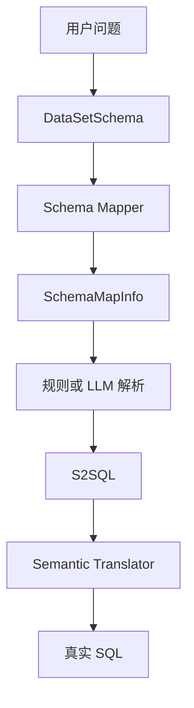
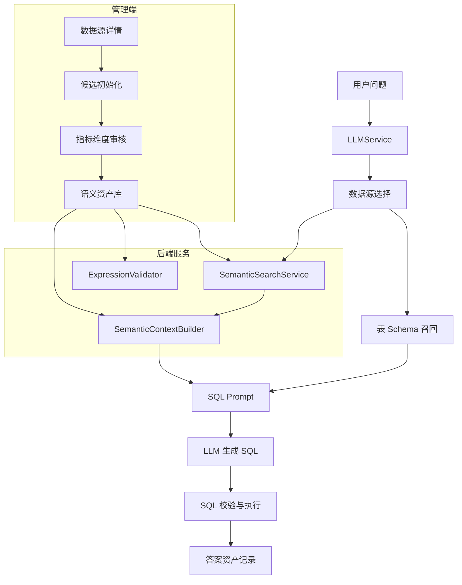
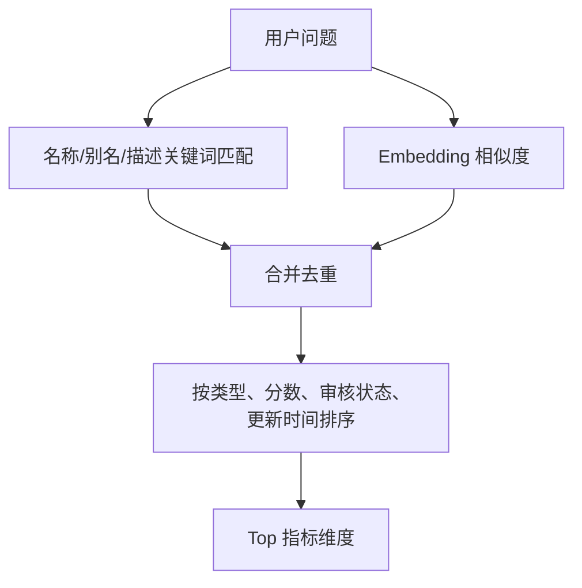
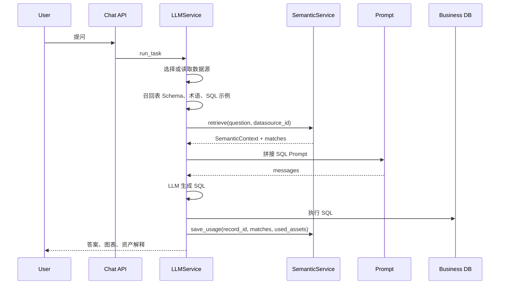

# 指标维度语义层技术设计

**关联 PRD：** [01-metric-dimension-semantic-layer-prd.md](../prd/01-metric-dimension-semantic-layer-prd.md)  
**参考资料：** [supersonic-headless-semantic-layer-analysis.md](../supersonic-headless-semantic-layer-analysis.md)  
**状态：** 草案  
**创建日期：** 2026-05-22  
**目标版本：** P0 基础语义资产，P1 澄清与推荐问题绑定

## 1. 背景与目标

SQLBot 当前问答链路主要依赖数据源、表、字段、术语、SQL 示例和 Prompt。业务用户的问题通常围绕“销售额、订单量、利润、区域、渠道、客户类型、时间”等业务语义展开，但这些概念现在没有稳定的一等资产承载，导致同一业务词可能在不同会话里被映射到不同字段、聚合方式或时间口径。

本设计引入轻量指标维度语义层，把指标和维度从字段注释、术语和 SQL 示例中提升为可治理资产。P0 不建设完整 BI 语义建模平台，而是先服务 SQLBot 的问答准确率、Prompt 上下文、资产解释和后续澄清能力。

### 1.1 设计目标

- 管理员可以从现有字段初始化候选指标维度，并完成审核、禁用和维护。
- 问答链路可以按数据源和问题召回候选指标、维度，并把受控语义上下文注入 SQL Prompt。
- SQL 生成结果可以记录命中和使用的语义资产，支持答案解释和质量追踪。
- P0 兼容现有 SQLBot 架构，不要求先重构为 Supersonic 式 S2SQL 翻译器。

### 1.2 非目标

- P0 不支持复杂跨数据源血缘、跨模型 Join 编排和完整指标市场。
- P0 不自动发布未审核资产，候选资产默认只进入管理端待审核区。
- P0 不替代术语库、SQL 示例、表关系和权限模块。
- P0 不要求 LLM 生成中间语义 SQL；语义资产先作为 Prompt 和审计上下文使用。

## 2. Supersonic Semantic 可借鉴点

Supersonic Semantic 的核心启发是：自然语言问数不应直接面对物理表字段，而应先面对数据集、指标、维度、维值和术语组成的语义 Schema。其链路大致是：



SQLBot 不直接照搬该架构。原因是当前后端是 Python/FastAPI + SQLModel，问答链路已经围绕 `LLMService`、`ChatQuestion`、`get_table_schema`、术语和训练 SQL 检索形成。P0 采用“轻量 Semantic 思路”：

- 借鉴 `s2_metric` 和 `s2_dimension` 的独立资产建模。
- 借鉴 `DataSetSchema` 的统一语义上下文结构。
- 借鉴 `SchemaElementMatch` 的匹配结果，记录命中词、相似度、来源和置信度。
- 暂不引入完整 S2SQL 语义翻译器，先把指标表达式、聚合方式、维度表达式注入 Prompt 并做结果审计。

## 3. 方案选择

### 方案 A：数据源级轻量语义层

在 `CoreDatasource`、`CoreTable`、`CoreField` 之上新增 `semantic_metric` 和 `semantic_dimension`，资产默认按工作空间和数据源隔离。问答时在选定数据源内召回指标维度。

优点是改动小，贴合现有数据源详情页和问答链路。缺点是同一数据源内的不同业务场景隔离较弱。

### 方案 B：数据集级语义层

新增 `semantic_dataset`，由数据集选择暴露哪些指标维度。问答先识别数据集，再在数据集内召回语义资产，接近 Supersonic 的 `s2_data_set`。

优点是业务边界清晰，适合后续智能体、推荐问题和澄清。缺点是 P0 要同时建设数据集管理，首期成本更高。

### 方案 C：只扩展术语和 SQL 示例

把指标口径写进术语或 SQL 示例，避免新增资产模型。

优点是短期改动最小。缺点是无法稳定表达默认聚合、来源字段、审核状态、表达式校验、维度类型和答案资产引用，不满足 PRD 的治理目标。

### 推荐方案

采用 A 到 B 的渐进方案：

- P0 使用数据源级轻量语义层，新增指标维度表、候选初始化、管理 API、检索服务和 Prompt 注入。
- P1 增加 `semantic_dataset` 和资产暴露关系，推荐问题和澄清流程绑定数据集级语义资产。

这样可以先解决 SQL 口径不稳定和资产不可治理的问题，同时保留向 Supersonic 数据集语义层演进的空间。

## 4. 总体架构



### 4.1 新增后端模块

新增 `backend/apps/semantic` 模块：

| 子模块 | 职责 |
| --- | --- |
| `models` | SQLModel 持久化模型和 Pydantic 请求响应对象 |
| `crud` | 指标、维度、候选、审核、检索和审计的数据库操作 |
| `api` | 管理端 API、候选初始化 API、问答内部检索 API |
| `embedding` | 语义资产向量生成、重算和相似度召回 |
| `services` | 候选初始化、表达式校验、语义上下文构建、资产使用记录 |

### 4.2 与现有链路的接入点

| 现有位置 | 改造点 |
| --- | --- |
| `backend/apps/datasource/crud/datasource.py` | 表字段同步后可触发候选指标维度初始化或标记需重新初始化 |
| `backend/apps/chat/task/llm.py` | `filter_terminology_template` 和 `filter_training_template` 后增加语义资产召回 |
| `backend/apps/chat/models/chat_model.py` | `AiModelQuestion` 增加 `semantic_context` 字段，SQL Prompt 增加语义资产段 |
| `backend/apps/chat/models/chat_model.py` / `ChatLog` | 增加语义检索操作类型，记录匹配资产 |
| `backend/apps/chat/models/chat_model.py` / `ChatRecordResult` | 通过 `chat_record_semantic_asset` 暴露答案使用资产，供答案详情展示 |
| `frontend/src/views/ds` | 数据源详情新增“指标维度”入口和治理页面 |

## 5. 数据模型

P0 以数据源级资产为主。所有语义资产必须带 `oid` 和 `datasource_id`，确保工作空间和数据源隔离。

### 5.1 枚举定义

| 枚举 | 值 |
| --- | --- |
| `asset_status` | `CANDIDATE`、`APPROVED`、`DISABLED`、`DEPRECATED` |
| `asset_origin` | `FIELD_INIT`、`MANUAL`、`SQL_EXAMPLE`、`IMPORT` |
| `metric_define_type` | `MEASURE`、`FIELD`、`EXPRESSION`、`DERIVED` |
| `aggregation` | `SUM`、`COUNT`、`COUNT_DISTINCT`、`AVG`、`MIN`、`MAX`、`NONE` |
| `dimension_type` | `CATEGORY`、`TIME`、`IDENTIFIER`、`TEXT`、`BOOLEAN`、`NUMBER` |
| `semantic_type` | `DATE`、`DATETIME`、`REGION`、`CHANNEL`、`CUSTOMER`、`PRODUCT`、`ORG`、`STATUS`、`UNKNOWN` |

### 5.2 `semantic_metric`

| 字段 | 类型 | 说明 |
| --- | --- | --- |
| `id` | bigint | 主键 |
| `oid` | bigint | 工作空间 |
| `datasource_id` | bigint | 数据源 ID |
| `table_id` | bigint nullable | 默认来源表 |
| `field_id` | bigint nullable | 默认来源字段 |
| `name` | varchar(128) | 技术名或稳定标识，例如 `sales_amount` |
| `display_name` | varchar(128) | 展示名，例如“销售额” |
| `aliases` | jsonb | 别名数组 |
| `description` | text | 业务口径说明 |
| `define_type` | varchar(32) | 指标定义方式 |
| `expr` | text | 指标表达式，P0 限制为字段名、聚合表达式或简单 SQL 片段 |
| `default_agg` | varchar(32) | 默认聚合 |
| `filter_sql` | text nullable | 指标级过滤条件 |
| `data_type` | varchar(64) | 数值类型 |
| `data_format` | varchar(64) nullable | 数值格式，例如金额、百分比 |
| `default_time_dimension_id` | bigint nullable | 默认时间维度 |
| `related_dimension_ids` | jsonb | 推荐下钻或可分析维度 |
| `owner_id` | bigint nullable | 负责人 |
| `status` | varchar(32) | 审核状态 |
| `origin` | varchar(32) | 来源 |
| `embedding` | vector nullable | 向量表示 |
| `created_at` / `updated_at` | datetime | 时间戳 |
| `created_by` / `updated_by` | bigint | 操作人 |

唯一约束：

- `(oid, datasource_id, name)`
- `(oid, datasource_id, display_name)` 可选软校验，允许部门口径冲突时使用不同 `name`

### 5.3 `semantic_dimension`

| 字段 | 类型 | 说明 |
| --- | --- | --- |
| `id` | bigint | 主键 |
| `oid` | bigint | 工作空间 |
| `datasource_id` | bigint | 数据源 ID |
| `table_id` | bigint nullable | 来源表 |
| `field_id` | bigint nullable | 来源字段 |
| `name` | varchar(128) | 技术名或稳定标识 |
| `display_name` | varchar(128) | 展示名 |
| `aliases` | jsonb | 别名数组 |
| `description` | text | 说明 |
| `expr` | text | 维度表达式 |
| `dimension_type` | varchar(32) | 维度类型 |
| `semantic_type` | varchar(32) | 语义类型 |
| `data_type` | varchar(64) | 字段类型 |
| `time_granularities` | jsonb | 时间维度支持粒度，例如 day/month/year |
| `default_values` | jsonb | 常用默认值 |
| `owner_id` | bigint nullable | 负责人 |
| `status` | varchar(32) | 审核状态 |
| `origin` | varchar(32) | 来源 |
| `embedding` | vector nullable | 向量表示 |
| `created_at` / `updated_at` | datetime | 时间戳 |
| `created_by` / `updated_by` | bigint | 操作人 |

### 5.4 `semantic_dimension_value`

P0 可只设计表结构，首期 UI 可不完整开放。

| 字段 | 类型 | 说明 |
| --- | --- | --- |
| `id` | bigint | 主键 |
| `dimension_id` | bigint | 维度 ID |
| `value` | text | 真实查询值 |
| `display_value` | text | 展示值 |
| `aliases` | jsonb | 维值别名 |
| `enabled` | boolean | 是否启用 |
| `embedding` | vector nullable | 向量表示 |

### 5.5 `semantic_asset_audit`

记录指标维度变更，满足 PRD 审计要求。

| 字段 | 类型 | 说明 |
| --- | --- | --- |
| `id` | bigint | 主键 |
| `asset_type` | varchar(32) | `METRIC` 或 `DIMENSION` |
| `asset_id` | bigint | 资产 ID |
| `action` | varchar(32) | `CREATE`、`UPDATE`、`APPROVE`、`DISABLE`、`DEPRECATE` |
| `before` | jsonb | 变更前 |
| `after` | jsonb | 变更后 |
| `created_at` | datetime | 操作时间 |
| `created_by` | bigint | 操作人 |

### 5.6 `chat_record_semantic_asset`

记录问答使用了哪些语义资产。

| 字段 | 类型 | 说明 |
| --- | --- | --- |
| `id` | bigint | 主键 |
| `record_id` | bigint | `chat_record.id` |
| `asset_type` | varchar(32) | `METRIC`、`DIMENSION`、`VALUE` |
| `asset_id` | bigint | 资产 ID |
| `role` | varchar(32) | `MATCHED`、`INJECTED`、`USED` |
| `match_word` | text nullable | 命中的用户问题片段 |
| `score` | float nullable | 相似度或综合分 |
| `snapshot` | jsonb | 当时资产快照 |

## 6. 候选初始化

候选初始化从 `CoreField` 出发，结合字段类型、字段名、字段备注和自定义备注生成未审核资产。

### 6.1 指标候选规则

数值字段优先生成指标候选：

| 字段特征 | 默认建议 |
| --- | --- |
| 类型为 int、bigint、decimal、numeric、float、double | `default_agg = SUM` |
| 字段名包含 `amount`、`price`、`fee`、`cost`、`gmv`、`revenue` | `data_format = currency` |
| 字段名包含 `rate`、`ratio`、`percent` | `default_agg = AVG`，`data_format = percent` |
| 字段名包含 `id` 且语义像用户/订单/客户 | 不默认生成指标，除非生成 `COUNT_DISTINCT` 候选 |

生成表达式：

- 普通度量：`expr = "<field_name>"`，Prompt 展示为 `SUM(field_name)`。
- 计数字段：`expr = "<field_name>"`，`default_agg = COUNT_DISTINCT` 或 `COUNT`。

### 6.2 维度候选规则

非度量字段和时间字段生成维度候选：

| 字段特征 | 默认建议 |
| --- | --- |
| 日期/时间类型或字段名包含 `date`、`time`、`day`、`month` | `dimension_type = TIME` |
| 字段名包含 `region`、`province`、`city`、`area` | `semantic_type = REGION` |
| 字段名包含 `channel`、`source`、`platform` | `semantic_type = CHANNEL` |
| 字段名包含 `user`、`customer`、`member` | `semantic_type = CUSTOMER` 或 `IDENTIFIER` |
| varchar/text 且基数可控 | `dimension_type = CATEGORY` |

P0 不强制计算真实基数。后续可以在数据源连接可用时采样统计。

### 6.3 初始化幂等

初始化接口必须幂等：

- 若字段已关联同名候选或审核资产，不重复生成。
- 字段备注变化后只更新仍处于 `CANDIDATE` 的资产描述，不覆盖已审核资产。
- 表字段被删除时不自动删除已审核资产，标记来源字段失效，由管理端提示处理。

## 7. 表达式校验

表达式校验目标是防止审核后的指标维度在 Prompt 中提供错误口径。

### 7.1 P0 校验范围

- 字段引用必须属于同一数据源下已选表。
- `expr` 不允许包含 DDL/DML、分号、多语句、注释逃逸。
- 指标表达式允许字段名、简单算术表达式、聚合函数包装。
- 维度表达式允许字段名、简单 SQL 函数和 CASE 表达式。
- `filter_sql` 只允许布尔条件片段，不允许 `ORDER BY`、`LIMIT`、子查询写操作。

### 7.2 校验方式

首选方式是构造只解析不执行的 SQL：

```sql
SELECT <expr> AS semantic_check_col
FROM <table_name>
WHERE 1 = 0
```

对不支持该方式的数据库方言，降级为：

- 使用 `sqlparse` 做禁止语句检查。
- 使用字段白名单检查引用。
- 保存校验告警，禁止审核通过。

## 8. 语义检索与上下文构建

### 8.1 检索对象

P0 只检索 `APPROVED` 状态资产。可通过配置允许候选资产进入调试链路，但生产默认不注入未审核资产。

检索范围：

- 当前工作空间 `oid`。
- 当前数据源 `datasource_id`。
- `status = APPROVED`。
- 当前用户可访问的数据源。

### 8.2 召回策略

采用关键词 + 向量混合召回：



综合分建议：

```text
score = 0.45 * alias_score
      + 0.35 * embedding_score
      + 0.10 * exact_name_score
      + 0.10 * usage_boost
```

P0 中 `usage_boost` 可以先固定为 0，等资产使用记录积累后再启用。

### 8.3 语义上下文结构

`SemanticContextBuilder` 输出稳定 JSON，并同时渲染为 Prompt 文本。

```json
{
  "metrics": [
    {
      "id": 1,
      "name": "sales_amount",
      "display_name": "销售额",
      "aliases": ["GMV", "业绩", "收入"],
      "description": "已支付订单金额合计",
      "expr": "pay_amount",
      "default_agg": "SUM",
      "table": "orders",
      "field": "pay_amount",
      "score": 0.91
    }
  ],
  "dimensions": [
    {
      "id": 10,
      "name": "order_date",
      "display_name": "下单日期",
      "dimension_type": "TIME",
      "semantic_type": "DATE",
      "expr": "order_date",
      "score": 0.87
    }
  ]
}
```

Prompt 文本示例：

```text
已审核业务指标：
- 销售额(sales_amount): 默认 SUM(pay_amount)，别名 GMV/业绩/收入，口径：已支付订单金额合计。

已审核业务维度：
- 下单日期(order_date): 时间维度，表达式 order_date，支持 day/month/year。

生成 SQL 时优先使用上述业务口径；如果用户问题命中这些业务词，不要自行改写指标表达式或聚合方式。
```

### 8.4 Prompt 长度控制

- 指标 topK 默认 5。
- 维度 topK 默认 8。
- 单资产描述截断到 120 字。
- 只注入命中资产和与命中指标关联的少量维度。
- 没有高置信命中时，不注入全量资产，避免 Prompt 噪声。

## 9. 问答链路改造

P0 目标是在现有 SQL 生成链路中增加语义资产召回和记录。



### 9.1 `LLMService` 改造

新增方法：

```python
def filter_semantic_assets(self, session: Session, oid: int, ds_id: int):
    context, matches = retrieve_semantic_context(
        session=session,
        question=self.chat_question.question,
        oid=oid,
        datasource_id=ds_id,
    )
    self.chat_question.semantic_context = context.prompt_text
    self.semantic_matches = matches
```

调用位置：

- 数据源已确定后。
- `filter_terminology_template`、`filter_training_template`、`filter_custom_prompts` 之后或之前均可；推荐在它们之后，便于后续融合术语别名。
- `init_messages` 之前，确保 SQL Prompt 能拿到 `semantic_context`。

### 9.2 `ChatQuestion` 改造

`AiModelQuestion` 增加：

```python
semantic_context: str = ""
```

`sql_sys_question` 增加模板段：

```python
if self.semantic_context:
    templates["semantic_context"] = _base_template["generate_semantic_context_info"].format(
        semantic_context=self.semantic_context
    )
```

`LLMService.init_messages` 中在 schema 之后、术语和 SQL 示例之前插入语义资产信息。理由是指标维度应约束 SQL 口径，优先级高于示例和补充术语。

### 9.3 操作日志

`OperationEnum` 新增：

- `FILTER_SEMANTIC_ASSET`

日志内容保存：

- 输入问题。
- 候选指标维度 ID、名称、分数、命中词。
- 注入 Prompt 的最终文本。
- 是否为空召回。

## 10. 管理 API

接口路径建议放在 `/semantic`。

### 10.1 指标 API

| 方法 | 路径 | 说明 |
| --- | --- | --- |
| `GET` | `/semantic/metrics/page/{page}/{size}` | 分页查询指标，支持数据源、状态、表、负责人、关键词 |
| `POST` | `/semantic/metrics` | 创建指标 |
| `PUT` | `/semantic/metrics/{id}` | 更新指标 |
| `POST` | `/semantic/metrics/{id}/approve` | 校验并审核通过 |
| `POST` | `/semantic/metrics/{id}/disable` | 禁用 |
| `POST` | `/semantic/metrics/{id}/embedding` | 重建向量 |

### 10.2 维度 API

| 方法 | 路径 | 说明 |
| --- | --- | --- |
| `GET` | `/semantic/dimensions/page/{page}/{size}` | 分页查询维度 |
| `POST` | `/semantic/dimensions` | 创建维度 |
| `PUT` | `/semantic/dimensions/{id}` | 更新维度 |
| `POST` | `/semantic/dimensions/{id}/approve` | 校验并审核通过 |
| `POST` | `/semantic/dimensions/{id}/disable` | 禁用 |
| `POST` | `/semantic/dimensions/{id}/embedding` | 重建向量 |

### 10.3 候选初始化 API

| 方法 | 路径 | 说明 |
| --- | --- | --- |
| `POST` | `/semantic/datasources/{datasource_id}/initialize` | 从字段生成候选指标维度 |
| `GET` | `/semantic/datasources/{datasource_id}/summary` | 返回指标维度数量、候选数量、审核数量 |
| `POST` | `/semantic/datasources/{datasource_id}/validate` | 批量校验表达式 |

## 11. 前端设计

管理入口放在数据源详情页，保持与表字段、表关系和推荐问题同级。

### 11.1 页面结构

- 数据源列表卡片增加“指标维度”入口。
- 指标维度页面使用 tabs：`指标`、`维度`、`候选`、`使用记录`。
- 列表支持状态、来源表、负责人、更新时间和关键词筛选。
- 候选页支持批量审核、批量禁用、批量编辑负责人。

### 11.2 指标编辑表单

关键字段：

- 展示名、技术名、别名、描述。
- 来源表、来源字段。
- 表达式、默认聚合、过滤条件。
- 默认时间维度、关联维度。
- 状态、负责人。

提交审核前必须调用表达式校验。校验失败时展示数据库返回的错误或字段引用错误。

### 11.3 维度编辑表单

关键字段：

- 展示名、技术名、别名、描述。
- 来源表、来源字段、表达式。
- 维度类型、语义类型、数据类型。
- 时间粒度、默认值。
- 状态、负责人。

### 11.4 答案详情展示

在执行详情中增加“语义资产”步骤，展示：

- 命中的指标维度。
- 注入 Prompt 的资产。
- 最终答案标记使用的资产。

普通业务用户在答案详情中只看简化解释，例如“本次使用指标：销售额 = SUM(pay_amount)”。

## 12. 权限与安全

- 语义资产 CRUD 复用数据源管理权限和工作空间权限。
- 问答检索必须遵守当前用户可访问数据源范围。
- 资产表达式不能绕过列权限和行权限；最终 SQL 仍经过现有权限过滤和执行校验。
- 资产快照记录不保存敏感连接配置，只保存名称、口径、表达式和来源字段信息。
- 禁用资产不参与检索，也不显示给业务用户解释。

## 13. 迁移与发布

### 13.1 数据库迁移

新增 Alembic 版本，建议命名为：

```text
067_semantic_metric_dimension.py
```

迁移内容：

- 创建 `semantic_metric`。
- 创建 `semantic_dimension`。
- 创建 `semantic_dimension_value`。
- 创建 `semantic_asset_audit`。
- 创建 `chat_record_semantic_asset`。
- 为 `embedding` 字段使用 pgvector，与术语和训练数据保持一致。
- 为 `(oid, datasource_id, status)`、`table_id`、`field_id` 建索引。

### 13.2 启动与补全任务

参考现有术语和训练数据 embedding 补全任务：

- 启动时扫描缺失 embedding 的已审核语义资产。
- 字段同步后不自动审核，只提示可初始化候选。
- 管理端提供手动重建向量入口。

## 14. 分阶段交付

### P0.1 持久化与候选初始化

- 新增数据表和 SQLModel。
- 新增候选初始化服务。
- 新增指标维度基础 CRUD。
- 支持表达式基础校验。

验收：

- 管理员可以在数据源下生成候选。
- 候选默认 `CANDIDATE`，不进入问答检索。

### P0.2 管理 UI 与审核

- 数据源详情增加指标维度入口。
- 列表、筛选、编辑、审核、禁用。
- 审核时触发表达式校验和 embedding 生成。
- 审计日志可查询。

验收：

- 管理员可以完成从候选到已审核资产的治理闭环。

### P0.3 问答接入

- 语义资产混合召回。
- SQL Prompt 注入语义上下文。
- `ChatLog` 记录语义检索。
- `chat_record_semantic_asset` 记录答案资产快照。

验收：

- 已审核指标维度可以被自然语言问题命中。
- 答案详情可以展示本次命中的指标维度。
- 语义检索 p95 小于 800ms。

### P1.1 澄清流程接入

- 当指标或维度候选分数接近时，输出澄清选项。
- 澄清选项来自已审核资产。
- 用户选择后回填语义上下文并继续 SQL 生成。

### P1.2 推荐问题和数据集

- 增加 `semantic_dataset` 和数据集资产暴露关系。
- 推荐问题绑定指标 ID、维度 ID、默认时间和模板。
- 点击推荐问题时优先使用绑定资产。

## 15. 测试策略

### 15.1 单元测试

- 候选初始化规则：数值字段、时间字段、枚举字段、ID 字段。
- 表达式安全校验：禁止多语句、禁止 DDL/DML、字段白名单。
- 混合召回排序：别名命中、向量命中、去重和 topK。
- Prompt 渲染：长度截断、空召回、资产字段完整性。

### 15.2 集成测试

- 数据源同步后生成候选。
- 审核通过后生成 embedding。
- 问答链路中命中语义资产并写入 `ChatLog`。
- 禁用资产不再参与检索。
- 行列权限开启时 SQL 仍经过现有权限过滤。

### 15.3 回归样例

准备高频问题：

- “最近 7 天销售额趋势”
- “按区域看订单量”
- “哪个渠道 GMV 最高”
- “客户增长怎么样”

验证 SQL 是否使用审核后的指标表达式、默认聚合和时间维度。

## 16. 风险与应对

| 风险 | 影响 | 应对 |
| --- | --- | --- |
| 候选质量不足 | 管理员审核成本高 | 候选默认未审核，提供批量筛选和禁用 |
| Prompt 噪声增加 | SQL 生成效果下降 | topK、描述截断、高置信才注入 |
| 表达式方言差异 | 审核校验失败或误判 | P0 先支持字段级和简单表达式，复杂表达式保留人工校验 |
| 指标口径冲突 | 用户得到不一致答案 | P0 按数据源隔离，P1 用数据集隔离业务场景 |
| embedding 成本增加 | 审核变慢 | 审核后异步生成，检索时无 embedding 则只用关键词 |

## 17. 关键技术决策

- P0 采用数据源级语义资产，降低落地成本。
- 已审核资产才进入生产问答检索。
- Prompt 接入先于语义 SQL 翻译器，避免一次性重构问答链路。
- 资产使用记录采用快照，避免后续口径变更影响历史答案解释。
- 数据集、澄清、推荐问题绑定放入 P1，避免 P0 范围失控。

## 18. 开放问题

- 是否需要在 P0 引入部门或智能体级作用域，还是完全等 P1 数据集解决？
- P0 表达式校验是否必须覆盖所有已支持数据库，还是先按 MySQL/PostgreSQL/Excel 内置库优先？
- 答案资产使用判断是否只记录“注入资产”，还是需要在 SQL 生成后解析 SQL 反推出真正使用资产？
- 已审核资产来源字段被删除时，是自动禁用还是进入“来源失效”状态？
