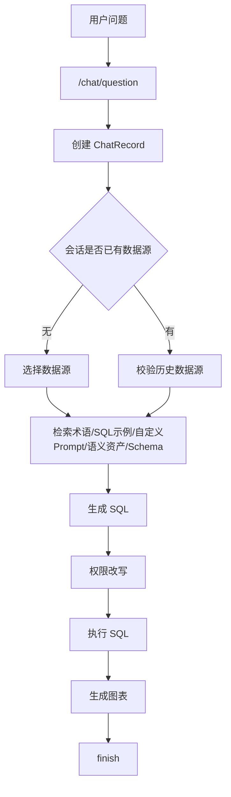
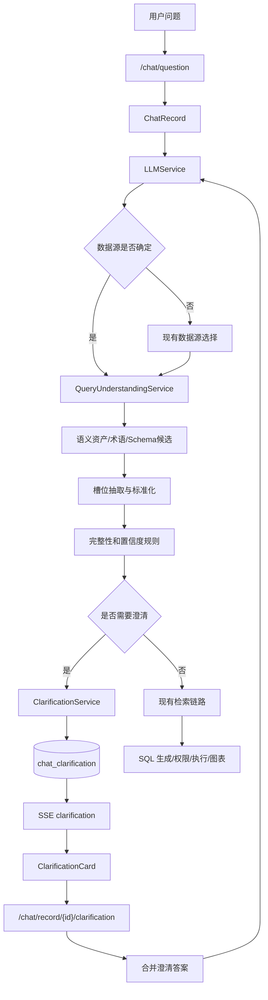
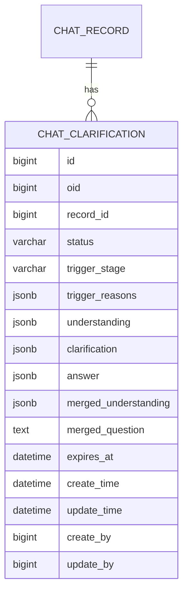
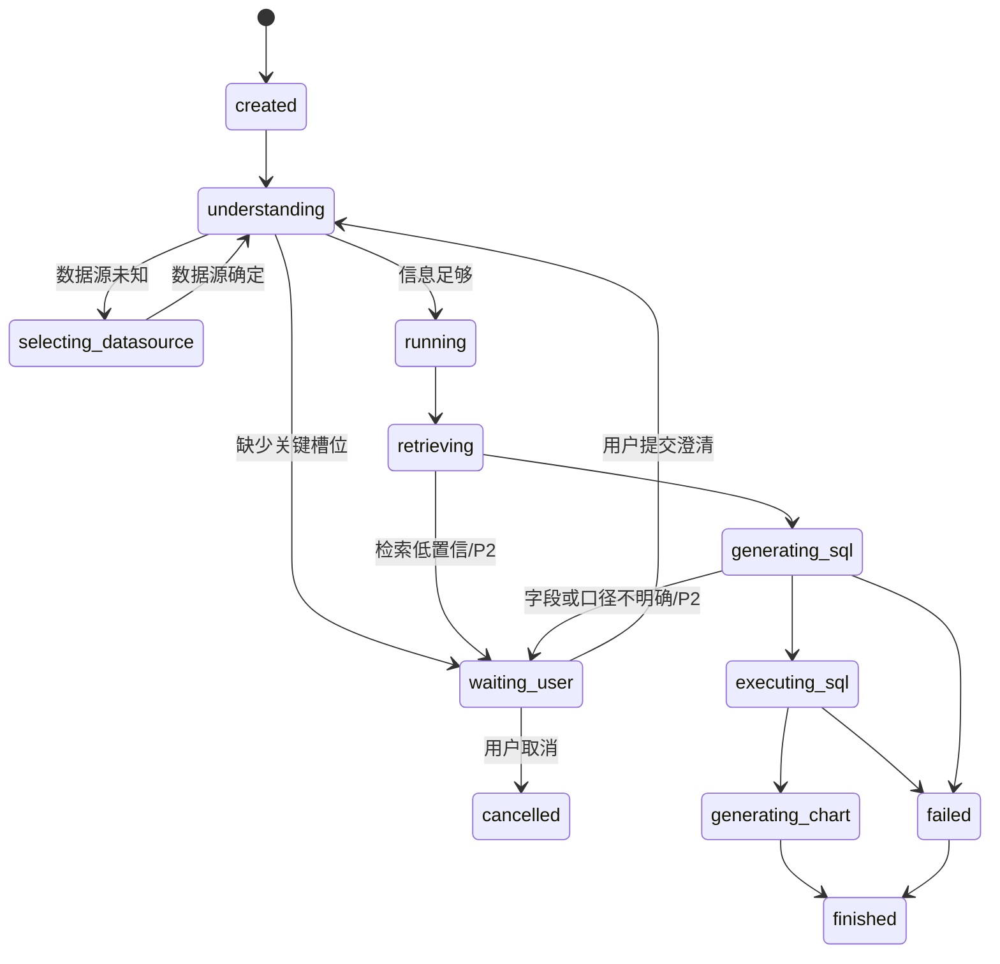
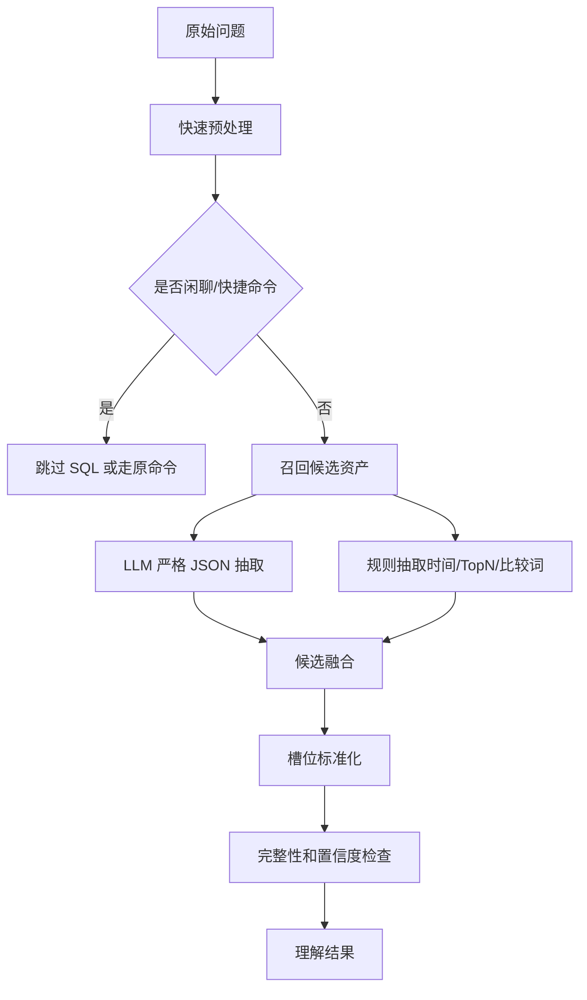
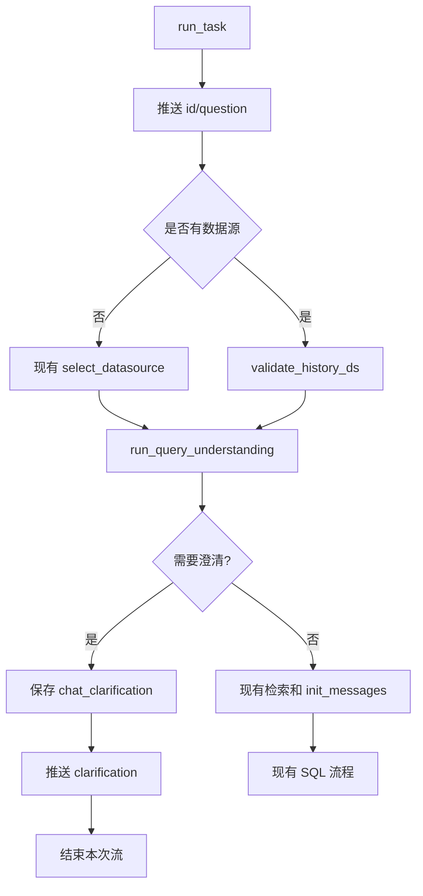

# 问题理解与交互式澄清技术设计

**关联 PRD：** [02-query-understanding-clarification-prd.md](../prd/02-query-understanding-clarification-prd.md)  
**参考资料：** [interactive-clarification-workflow.md](../interactive-clarification-workflow.md)、[colloquial-question-optimization.md](../colloquial-question-optimization.md)、[01-metric-dimension-semantic-layer-tech-design.md](./01-metric-dimension-semantic-layer-tech-design.md)、[03-multi-strategy-agentic-rag-prd.md](../prd/03-multi-strategy-agentic-rag-prd.md)、[04-observability-feedback-memory-prd.md](../prd/04-observability-feedback-memory-prd.md)  
**状态：** 草案  
**创建日期：** 2026-05-26  
**目标版本：** P1 问题理解、槽位检查、澄清卡片与恢复执行，P2 澄清分析与策略路由联动

## 1. 背景与目标

SQLBot 当前问答链路以 `LLMService.run_task` 为核心，收到用户问题后进入数据源选择、术语/SQL 示例/自定义 Prompt/语义资产检索、表 Schema 准备、SQL 生成、权限改写、SQL 执行和图表生成。该链路适合“指标、时间、数据源和分析目标比较明确”的问题，但真实 ChatBI 输入常常是“最近业绩怎么样”“哪个渠道比较差”“销售情况如何”这类短句。系统如果直接生成 SQL，本质是在替用户选择指标、时间范围和业务口径。

本设计在 SQL 执行前增加一个轻量 Query Understanding 层，并在高风险不确定时进入交互式澄清。目标不是重写现有 Text2SQL 链路，而是把“理解、检查、必要时追问、合并补充、恢复执行”作为现有链路前置和中途回退节点。

### 1.1 设计目标

- 在主检索前生成结构化问题理解结果，包括意图、指标、维度、时间范围、过滤条件、对比方式、数据源线索和置信度。
- 用确定性规则结合模型置信度判断是否缺少关键槽位，避免模糊问题带着隐藏假设继续执行。
- 通过 SSE 在聊天流中推送澄清卡片，支持单选、多选、时间范围和自由补充。
- 将用户补充合并回原 `ChatRecord` 的执行状态，并从检索或路由节点继续原工作流。
- 持久化问题理解、澄清请求、用户回答和触发原因，为 P2 策略路由、过程 trace 和澄清分析提供数据。

### 1.2 非目标

- P1 不建设完整多步 Planner，也不把所有低置信模型输出都变成多轮追问。
- P1 不把用户澄清直接沉淀为长期记忆、术语或语义资产。
- P1 不替换现有术语、SQL 示例、表检索、语义资产检索和 SQL 生成模块。
- P1 不要求所有问题都先调用大模型理解；明确的快捷命令、分析/预测、推荐问题生成可跳过。

## 2. 现状与插入点

### 2.1 当前问答链路

当前后端主要入口是：

| 位置 | 职责 |
| --- | --- |
| `backend/apps/chat/api/chat.py` | `/chat/question` 流式问答入口，创建 `LLMService` 并返回 `StreamingResponse` |
| `backend/apps/chat/task/llm.py` | `LLMService.run_task` 编排数据源、检索、SQL、执行、图表和 SSE |
| `backend/apps/chat/models/chat_model.py` | `ChatRecord`、`ChatLog`、`ChatQuestion`、`OperationEnum` 等模型 |
| `frontend/src/views/chat/answer/ChartAnswer.vue` | 消费问答 SSE，并按 `data.type` 更新当前记录 |
| `frontend/src/api/chat.ts` | `questionApi.add` 和 `ChatRecord` 前端模型 |

当前主流程可以概括为：



### 2.2 新增插入点

问题理解需要尽量早发生，但又要兼容“没有数据源时先选数据源”和“语义资产依赖数据源”的现实约束。因此采用两阶段理解：

| 阶段 | 时机 | 作用 | 依赖 |
| --- | --- | --- | --- |
| `PRE_DATASOURCE` | `id/question` SSE 后、数据源选择前 | 识别意图、时间、明显指标词、数据源线索，判断闲聊/无效问题和强数据源歧义 | 工作空间数据源摘要、术语轻量检索 |
| `POST_DATASOURCE` | 数据源确定后、术语/SQL 示例/语义资产检索前 | 基于语义资产、表字段、术语和 SQL 示例候选补全指标/维度/时间/过滤，做完整性检查 | 已选数据源、语义资产、Schema 摘要 |

P1 MVP 可以先实现 `POST_DATASOURCE`，并保留 `PRE_DATASOURCE` 的模型和状态字段。原因是当前语义资产、表 Schema、术语和 SQL 示例大多按数据源隔离；先选数据源后澄清，工程风险更低。

## 3. 方案选择

### 3.1 方案 A：只用 Prompt 在 SQL 生成时自问自答

在 SQL Prompt 中要求模型“如果不明确就返回需要澄清”。改动小，但澄清发生太晚，前端和后端缺少结构化状态，难以恢复执行和统计触发原因。

### 3.2 方案 B：新增独立 Query Understanding 服务

在检索和 SQL 生成前新增服务，输出结构化理解结果、缺槽检查结果和澄清 Payload。该服务可以组合规则、语义资产检索、轻量 LLM JSON 输出和确定性校验。

优点是边界清晰、可测试、可观测，后续可与策略路由共用。缺点是需要新增模型、Prompt、API 和前端状态。

### 3.3 方案 C：完整 Agentic Loop 状态机

把理解、检索、澄清、SQL、执行、修复全部改造成工具循环。扩展性最好，但 P1 改动过大，也会把简单问题引入高成本编排。

### 3.4 推荐方案

采用方案 B，并为方案 C 预留状态和 trace 字段：

- P1.1 实现 `QueryUnderstandingService`、槽位模型、确定性完整性规则和 `QUERY_UNDERSTANDING` 日志。
- P1.2 增加 `chat_clarification` 表、`clarification` SSE、恢复 API 和前端卡片。
- P1.3 将理解结果的 `normalized_question`、`retrieval_queries` 和确认槽位传给现有检索链路。
- P2 与多策略路由合并：路由可以选择 `clarification`、`template_sql`、`semantic_text2sql` 或 `schema_text2sql`。

## 4. 总体架构



### 4.1 新增后端模块

建议新增 `backend/apps/chat/query_understanding`：

| 文件 | 职责 |
| --- | --- |
| `models.py` | Pydantic 槽位、理解结果、检查结果、澄清 Payload、恢复请求响应 |
| `enums.py` | 意图、槽位、澄清类型、状态、触发原因枚举 |
| `service.py` | `QueryUnderstandingService` 主入口，负责编排抽取、候选增强、检查和澄清构建 |
| `slot_rules.py` | 意图到必需槽位的确定性规则、阈值和优先级 |
| `normalizer.py` | 时间、指标、维度、过滤、比较方式和 TopN 的标准化 |
| `clarification.py` | 澄清问题构建、选项排序、答案合并和恢复上下文生成 |
| `crud.py` | `chat_clarification` 持久化、状态更新和查询 |
| `prompt.py` | 问题理解和澄清合并 Prompt 构建 |

不建议把这些逻辑直接塞进 `backend/apps/chat/task/llm.py`。`LLMService` 已经承担流式编排、日志、模型调用、SQL 校验、权限和图表生成，继续膨胀会让状态恢复和单元测试变困难。

### 4.2 与既有模块关系

| 既有模块 | 接入方式 |
| --- | --- |
| `apps.semantic.services.semantic_search` | 数据源确定后召回已审核指标、维度，为槽位候选和澄清选项提供来源 |
| `apps.terminology.curd.terminology` | 提供术语候选、同义词和业务口径说明 |
| `apps.data_training.curd.data_training` | 提供相似 SQL 示例，识别模板/口径冲突 |
| `apps.datasource.crud.datasource.get_table_schema` | 提供表字段摘要，辅助维度、时间字段和实体明细识别 |
| `ChatLog` | 新增理解、澄清、恢复相关 `OperationEnum` |
| `ChatRecord` | 保持结果字段为主，新增少量状态字段或通过 `chat_clarification` 关联 |

## 5. 核心领域模型

### 5.1 枚举定义

| 枚举 | 值 | 说明 |
| --- | --- | --- |
| `QueryIntent` | `metric_query`、`trend_analysis`、`ranking_analysis`、`comparison_analysis`、`detail_query`、`share_analysis`、`anomaly_analysis`、`chitchat`、`unknown` | 用户分析意图 |
| `SlotName` | `datasource`、`metrics`、`dimensions`、`time_range`、`filters`、`comparison`、`top_n`、`entity`、`chart_type` | 可抽取槽位 |
| `SlotSource` | `llm`、`semantic_metric`、`semantic_dimension`、`terminology`、`schema`、`sql_example`、`user_confirmed`、`default_rule` | 槽位来源 |
| `ClarificationType` | `single_choice`、`multi_choice`、`time_range`、`free_text`、`mixed` | 前端渲染类型 |
| `ClarificationStatus` | `pending`、`answered`、`cancelled`、`expired`、`superseded` | 澄清状态 |
| `ClarificationTrigger` | `missing_metric`、`missing_time_range`、`missing_dimension`、`ambiguous_datasource`、`ambiguous_metric`、`ambiguous_dimension`、`ambiguous_term`、`low_retrieval_confidence`、`sql_generation_ambiguity` | 触发原因 |

### 5.2 槽位对象

```json
{
  "name": "metrics",
  "value": "销售额",
  "display_name": "销售额",
  "confidence": 0.87,
  "source": "semantic_metric",
  "asset_type": "METRIC",
  "asset_id": 12,
  "raw_text": "业绩",
  "confirmed": false,
  "metadata": {
    "definition": "支付成功订单金额汇总",
    "default_agg": "SUM"
  }
}
```

设计约束：

- 槽位可以多值，例如多指标、多维度、多过滤条件。
- 所有槽位都保留 `raw_text` 和 `source`，方便解释和追踪。
- 来自用户澄清的槽位必须标记 `confirmed=true`，并在后续规则中优先级最高。
- 指标、维度选项必须经过工作空间、数据源和权限过滤，不允许把无权限资产暴露给用户。

### 5.3 问题理解结果

```json
{
  "original_question": "最近业绩怎么样？",
  "normalized_question": "查询最近一段时间的业绩表现",
  "intent": "trend_analysis",
  "intent_confidence": 0.72,
  "slots": {
    "metrics": [],
    "dimensions": [],
    "time_range": [
      {
        "name": "time_range",
        "value": null,
        "display_name": "最近",
        "confidence": 0.42,
        "source": "llm",
        "raw_text": "最近",
        "confirmed": false
      }
    ]
  },
  "missing_slots": ["metrics", "time_range"],
  "ambiguous_slots": ["time_range"],
  "retrieval_queries": [
    "业绩 销售额 趋势",
    "订单量 趋势",
    "近30天 销售表现"
  ],
  "confidence": 0.58,
  "can_answer_with_assumption": false,
  "trace": {
    "stage": "POST_DATASOURCE",
    "trigger_reasons": ["missing_metric", "missing_time_range"]
  }
}
```

### 5.4 澄清 Payload

```json
{
  "id": 101,
  "record_id": 2001,
  "status": "pending",
  "question": "你想看哪个业绩指标？",
  "description": "系统需要先确认核心指标，避免使用错误口径。",
  "type": "single_choice",
  "target_slots": ["metrics"],
  "options": [
    {
      "slot": "metrics",
      "label": "销售额",
      "value": "销售额",
      "asset_type": "METRIC",
      "asset_id": 12,
      "description": "支付成功订单金额汇总",
      "confidence": 0.86
    },
    {
      "slot": "metrics",
      "label": "订单量",
      "value": "订单量",
      "asset_type": "METRIC",
      "asset_id": 18,
      "description": "支付成功订单数",
      "confidence": 0.79
    }
  ],
  "allow_free_text": true,
  "context": {
    "original_question": "最近业绩怎么样？",
    "understanding_id": "uuid-like-trace-id",
    "trigger_reasons": ["missing_metric"]
  }
}
```

## 6. 数据模型

### 6.1 `chat_record` 最小扩展

建议给 `chat_record` 增加轻量状态字段，便于列表和刷新恢复：

| 字段 | 类型 | 说明 |
| --- | --- | --- |
| `status` | varchar(32) | `created`、`understanding`、`waiting_user`、`running`、`finished`、`failed` |
| `trace_id` | varchar(64) nullable | 本次执行 trace 标识，后续与可观测 PRD 对齐 |

`finish` 仍保留兼容旧逻辑。`waiting_user` 时 `finish=false`，但本次流式响应已经结束；前端应根据 `status` 展示待澄清卡片。

### 6.2 新增 `chat_clarification`



字段说明：

| 字段 | 说明 |
| --- | --- |
| `oid` | 工作空间隔离 |
| `record_id` | 原 `ChatRecord.id`，恢复执行必须沿用该记录 |
| `status` | 等待、已回答、取消、过期或被新澄清取代 |
| `trigger_stage` | `PRE_DATASOURCE`、`POST_DATASOURCE`、`RETRIEVAL`、`SQL_GENERATION` |
| `trigger_reasons` | 结构化触发原因数组 |
| `understanding` | 触发澄清时的问题理解快照 |
| `clarification` | 前端渲染卡片所需 Payload |
| `answer` | 用户选择和自由文本 |
| `merged_understanding` | 合并用户补充后的理解结果 |
| `merged_question` | 合并后的自然语言问题，用于兼容现有检索和 SQL Prompt |
| `expires_at` | 防止长期悬挂；默认 24 小时，可配置 |

约束：

- `(record_id, status='pending')` 同一时间最多一条待处理澄清。PostgreSQL 可用部分唯一索引实现。
- 查询、恢复和取消必须校验 `ChatRecord.create_by == current_user.id`，以及 `oid` 一致。

### 6.3 `ChatLog.OperationEnum` 扩展

新增操作类型：

| 操作 | 说明 |
| --- | --- |
| `QUERY_UNDERSTANDING` | 模型或规则生成问题理解结果 |
| `CHECK_QUERY_SLOTS` | 完整性和置信度规则检查 |
| `BUILD_CLARIFICATION` | 构建澄清问题和选项 |
| `MERGE_CLARIFICATION` | 合并用户补充和原问题 |
| `RETRIEVAL_CONFIDENCE` | P2 检索低置信触发澄清时记录 |

现有枚举值以字符串数字保存，新增值需避免与 `FILTER_SEMANTIC_ASSET = '14'` 冲突。

## 7. 状态机

### 7.1 问答状态



### 7.2 关键状态规则

- `waiting_user` 是可恢复状态，不应调用 `finish_record`。
- 用户提交澄清后，后端将原 `ChatRecord.status` 更新为 `running`，并沿用同一个 `record_id` 继续推送后续 SSE。
- 如果用户修改原问题而不是回答澄清，前端应新建一条 `ChatRecord`，原澄清状态置为 `cancelled`。
- `regenerate` 不复用旧澄清结果，除非用户输入中明确包含已确认槽位。

## 8. 问题理解服务设计

### 8.1 服务接口

```text
QueryUnderstandingService.understand(request) -> QueryUnderstandingResult
QueryUnderstandingService.check_slots(result, context) -> SlotCheckResult
QueryUnderstandingService.build_clarification(result, check, context) -> ClarificationPayload
QueryUnderstandingService.merge_answer(clarification, answer) -> MergeResult
```

上下文参数：

| 字段 | 说明 |
| --- | --- |
| `oid` | 工作空间 ID |
| `user_id` | 当前用户 ID |
| `chat_id` / `record_id` | 会话和记录 |
| `datasource_id` | 已选数据源；未知时为空 |
| `assistant_type` | 普通页面、Assistant、Embedded、动态数据源等 |
| `semantic_candidates` | 已审核指标维度候选 |
| `terminology_candidates` | 术语候选 |
| `schema_summary` | 表、字段和时间字段摘要 |
| `history_slots` | 同会话内最近确认槽位，P2 可启用 |

### 8.2 处理流程



候选融合顺序：

1. 用户已确认槽位。
2. 已审核语义资产精确别名命中。
3. 术语库精确命中。
4. LLM JSON 抽取。
5. embedding 相似候选。
6. 默认规则。

### 8.3 多 Query 检索输出

理解结果输出的 `retrieval_queries` 用于后续增强现有检索：

- `filter_terminology_template`、`filter_training_template`、`filter_semantic_assets` 首期仍用原问题，P1.3 增加多 Query 检索融合。
- 表 Schema 检索可以用 `normalized_question` 和 top 3 `retrieval_queries` 分别召回，再按表 ID 去重。
- SQL Prompt 中保留原问题，同时附加“系统理解结果”和“用户确认槽位”，避免只用改写问题丢失用户原话。

## 9. 槽位完整性规则

### 9.1 意图到必需槽位

| 意图 | 必需槽位 | 可选槽位 | 默认处理 |
| --- | --- | --- | --- |
| `metric_query` | `metrics` | `time_range`、`filters` | 缺指标必须澄清；缺时间可按配置决定是否澄清 |
| `trend_analysis` | `metrics`、`time_range`、时间维度 | `filters`、`comparison` | 缺指标或时间必须澄清 |
| `ranking_analysis` | `metrics`、`dimensions`、`time_range` | `top_n`、`filters` | 缺维度时澄清；缺 TopN 默认 10 |
| `comparison_analysis` | `metrics`、`time_range`、`comparison` | `dimensions`、`filters` | 缺比较方式时澄清 |
| `detail_query` | `entity` 或 `filters` | `columns`、`sort`、`time_range` | 缺实体/过滤且表不明确时澄清 |
| `share_analysis` | `metrics`、`dimensions`、`time_range` | `filters` | 缺维度必须澄清 |
| `anomaly_analysis` | `metrics`、`time_range` | `dimensions`、`threshold` | 缺指标或时间必须澄清 |

### 9.2 置信度阈值

建议配置项：

| 配置 | 默认值 | 说明 |
| --- | --- | --- |
| `QUERY_UNDERSTANDING_ENABLED` | `true` | 总开关 |
| `QUERY_UNDERSTANDING_MODEL_ENABLED` | `true` | 是否调用 LLM 抽取 |
| `QUERY_UNDERSTANDING_TIMEOUT_MS` | `20000` | 不含候选召回的模型超时 |
| `QUERY_UNDERSTANDING_MIN_CONFIDENCE` | `0.65` | 低于该值进入规则复核 |
| `CLARIFICATION_REQUIRED_CONFIDENCE` | `0.55` | 核心槽位低于该值触发澄清 |
| `CLARIFICATION_SCORE_GAP` | `0.08` | Top 候选分差小于该值视为歧义 |
| `CLARIFICATION_EXPIRE_HOURS` | `24` | 澄清过期时间 |
| `CLARIFICATION_MAX_OPTIONS` | `6` | 单次最多选项数 |

### 9.3 触发澄清条件

P1 必须触发：

- 缺少核心指标，且无法从已审核语义资产或默认口径唯一确定。
- 趋势、异常、对比类问题缺少明确时间范围，且无数据源级默认时间配置。
- 排名、占比类问题缺少分析维度。
- 指标、维度或数据源候选 Top2 分数接近，并且映射到不同资产或表。
- 术语或 SQL 示例存在冲突口径，例如“收入”同时命中销售收入和财务确认收入。

P1 可直接执行并展示假设：

- 缺少 TopN，默认 `10`。
- 缺少图表类型，由现有图表生成逻辑决定。
- 时间表达轻微模糊但工作空间配置了默认解释，例如“最近=近30天”。

P2 再扩展：

- Schema 检索分数过低。
- SQL 生成结果返回字段/口径不明确。
- SQL 执行失败原因可归因为字段映射歧义。

### 9.4 澄清优先级

单次最多问一个主要问题。优先级为：

```text
数据源 > 指标 > 时间范围 > 维度 > 比较方式 > 过滤条件 > 图表形式
```

如果同一问题同时缺指标和时间，P1 推荐先问指标；用户回答后，如果时间仍无法确定，再问时间。为减少轮次，也可在 `mixed` 类型中展示指标选项和常用时间快捷项，但问题文案仍聚焦一个主槽位。

## 10. 澄清构建与答案合并

### 10.1 选项来源

| 澄清类型 | 选项来源 |
| --- | --- |
| 指标 | 已审核 `semantic_metric`、术语命中指标、SQL 示例涉及指标 |
| 维度 | 已审核 `semantic_dimension`、Schema 时间/分类字段、指标关联维度 |
| 时间 | 固定安全选项：今天、近 7 天、近 30 天、本月、今年；结合数据源默认时间字段 |
| 数据源 | 当前用户有权限的数据源摘要 |
| 口径 | 术语、语义资产描述和 SQL 示例差异 |

选项排序：

1. 用户原问题精确命中。
2. 已审核语义资产。
3. 候选置信度。
4. 与已确认槽位的关联关系。
5. 管理员配置的推荐优先级。

### 10.2 合并策略

用户回答澄清后生成 `MergeResult`：

```json
{
  "merged_question": "查询近30天销售额趋势",
  "merged_slots": {
    "metrics": [
      {
        "value": "销售额",
        "confirmed": true,
        "source": "user_confirmed",
        "asset_id": 12
      }
    ],
    "time_range": [
      {
        "value": "last_30_days",
        "display_name": "近30天",
        "confirmed": true,
        "source": "user_confirmed"
      }
    ]
  },
  "resume_from": "retrieval"
}
```

合并原则：

- 用户确认覆盖模型推断。
- 用户自由文本需要再次做槽位抽取，但不能删除已经确认的选项，除非自由文本明显表达修改。
- 合并后如果仍缺关键槽位，继续生成下一条澄清；否则进入检索。
- `ChatRecord.question` 建议保留原问题，新增 `merged_question` 存在 `chat_clarification` 中；SQL Prompt 同时传入原问题和确认槽位。这样前端历史记录不被悄悄改写。

## 11. 后端接口设计

### 11.1 提交澄清答案

```text
POST /chat/record/{record_id}/clarification
```

请求：

```json
{
  "clarification_id": 101,
  "answers": [
    {
      "slot": "metrics",
      "value": "销售额",
      "asset_type": "METRIC",
      "asset_id": 12
    },
    {
      "slot": "time_range",
      "value": "last_30_days",
      "label": "近30天"
    }
  ],
  "free_text": "按区域拆分"
}
```

响应使用 `text/event-stream`，继续沿用现有流式事件：

```text
clarification-accepted
understanding
datasource-result / datasource
sql-result
sql
sql-data
chart-result
chart
finish
```

处理步骤：

1. 校验记录存在、归属当前用户、工作空间一致。
2. 查询该 `record_id` 最新 `pending` 澄清，校验 `clarification_id` 和未过期。
3. 校验答案选项来源和权限，拒绝伪造资产 ID。
4. 合并用户回答，更新 `chat_clarification.answer`、`merged_understanding`、`merged_question`、`status=answered`。
5. 更新 `chat_record.status=running`。
6. 创建新的 `LLMService`，通过 `set_record(record)` 复用原记录，设置 `chat_question.confirmed_slots` 或等价上下文，继续执行。

### 11.2 取消澄清

```text
POST /chat/record/{record_id}/clarification/cancel
```

用途：

- 用户点击“修改原问题”或“取消查询”。
- 后端将待处理澄清置为 `cancelled`，`chat_record.status` 置为 `finished` 或 `failed`，按产品文案决定是否展示取消状态。

### 11.3 查询待处理澄清

```text
GET /chat/record/{record_id}/clarification
```

用于刷新恢复。返回当前用户有权查看的待处理澄清 Payload；没有待处理则返回空。

## 12. SSE 事件设计

### 12.1 新增事件

| type | 时机 | 内容 | 前端行为 |
| --- | --- | --- | --- |
| `understanding` | 问题理解完成 | `QueryUnderstandingResult` 摘要 | 记录到 `ChatRecord.understanding`，可在执行详情展示 |
| `clarification` | 需要用户补充 | `ClarificationPayload` | 展示澄清卡片，停止 loading，保持记录未完成 |
| `clarification-accepted` | 用户回答被接受 | 合并后的问题和槽位摘要 | 卡片置为已回答，恢复 loading |
| `clarification-cancelled` | 用户取消 | 取消原因 | 卡片置为取消 |
| `retrieval-confidence` | P2 检索后 | 候选和置信度摘要 | 进入执行详情，不默认打扰用户 |

### 12.2 事件顺序

首次问题需要澄清：

```text
id
question
datasource-result? / datasource?
understanding
clarification
```

用户回答后继续：

```text
clarification-accepted
understanding
sql-result
info
brief
sql
sql-data
chart-result
chart
finish
```

如果数据源未知且数据源本身需要澄清：

```text
id
question
understanding
clarification
```

此时 `clarification.target_slots = ["datasource"]`，恢复后先设置会话数据源，再进入 `POST_DATASOURCE` 理解。

## 13. `LLMService` 改造

### 13.1 新增上下文字段

`ChatQuestion` 建议新增非持久化字段：

| 字段 | 说明 |
| --- | --- |
| `understanding` | 当前问题理解结果 |
| `confirmed_slots` | 用户确认槽位 |
| `normalized_question` | 标准化问题 |
| `retrieval_queries` | 多 Query 检索输入 |
| `clarification_id` | 当前恢复的澄清 ID |

### 13.2 编排改造

`run_task` 中建议新增步骤：



注意事项：

- 当前 `select_datasource` 内部已经调用术语、SQL 示例、自定义 Prompt、语义资产和 `init_messages`。引入问题理解后，需要把“数据源选择”和“上下文检索初始化”拆开，避免澄清前已经构造 SQL Prompt。
- 推荐新增 `prepare_context_after_understanding()`，统一执行 `filter_terminology_template`、`filter_training_template`、`filter_custom_prompts`、`filter_semantic_assets` 和 `init_messages`。
- `select_datasource` 只负责确定 `self.ds` 和保存数据源选择结果，不再隐式启动后续检索。

### 13.3 跳过条件

以下场景跳过问题理解：

- `/analysis`、`/predict`、`/recommend_questions`。
- `ChatQuestion.regenerate_record_id` 存在且用户问题包含明确修正命令时，可只执行轻量理解，不触发澄清。
- `finish_step=GENERATE_SQL` 仍可触发澄清，因为核心风险在 SQL 生成前。
- MCP 非聊天流 `in_chat=false` 首期不展示卡片，可返回结构化错误提示，提示调用方补充槽位。

## 14. Prompt 设计

### 14.1 问题理解 Prompt 原则

- 明确禁止生成 SQL。
- 只输出 JSON，不输出解释文本。
- 候选资产作为可选证据，不允许编造资产 ID。
- 不确定时保留空槽位和低置信度，不要自行填默认业务口径。
- 当前日期必须注入，用于解析“今天、本月、最近”等相对时间。

输出字段：

```json
{
  "normalized_question": "string",
  "intent": "trend_analysis",
  "intent_confidence": 0.0,
  "slots": {},
  "missing_slots": [],
  "ambiguous_slots": [],
  "retrieval_queries": [],
  "confidence": 0.0,
  "can_answer_with_assumption": false
}
```

### 14.2 澄清合并 Prompt 原则

- 输入原问题、澄清问题、用户答案、已确认槽位。
- 输出 `merged_question` 和 `merged_slots`。
- 不能删除已确认槽位，除非用户自由文本明确说“不是/改成/不要”。
- 合并失败时返回 `need_more_clarification=true`，由规则层再构建下一条澄清。

## 15. 前端设计

### 15.1 数据模型扩展

`frontend/src/api/chat.ts` 的 `ChatRecord` 增加：

| 字段 | 说明 |
| --- | --- |
| `status?: string` | 后端记录状态 |
| `understanding?: any` | 问题理解摘要 |
| `clarification?: ClarificationPayload` | 当前澄清卡片 |
| `clarification_answer?: any` | 用户已提交回答 |

新增 API：

```text
chatApi.answerClarification(recordId, data, controller)
chatApi.cancelClarification(recordId)
chatApi.getClarification(recordId)
```

### 15.2 新增组件

建议新增：

```text
frontend/src/views/chat/clarification/ClarificationCard.vue
```

组件职责：

- 渲染问题文案、选项、自由输入和确认/取消按钮。
- 根据 `type` 支持单选、多选、时间范围和混合选择。
- 提交后通过新的恢复接口继续消费 SSE。
- 展示已确认结果，避免用户重复点击。

### 15.3 `ChartAnswer.vue` SSE 分发

新增分支：

```text
case 'understanding':
  currentRecord.understanding = data.content

case 'clarification':
  currentRecord.status = 'waiting_user'
  currentRecord.clarification = data.content
  _loading.value = false
  emits('stop')

case 'clarification-accepted':
  currentRecord.status = 'running'
  currentRecord.clarification_answer = data.content
```

注意：

- 收到 `clarification` 后本次流自然结束，不视为错误。
- `finish` 之前如果处于 `waiting_user`，不应调用 `getRecordUsage` 作为已完成记录统计。
- 刷新页面后通过 `ChatRecord.status` 和 `getClarification` 恢复卡片。

## 16. 权限、安全与隐私

- 澄清选项只能来自当前用户有权访问的数据源、表、字段、语义资产和术语。
- 对 Assistant 和 Embedded 场景，需要沿用 `CurrentAssistant` 的数据源范围、证书和在线状态校验。
- 前端提交的 `asset_id` 不可信，后端必须根据待处理澄清中的 `options` 反查校验。
- 自由文本只作为本次执行上下文，不进入长期记忆和语义资产。
- `ChatLog` 中记录的理解结果和澄清答案需要遵循后续 trace 脱敏策略；P1 先避免写入样例数据和权限过滤值。
- 过期澄清不能恢复执行，用户需要重新提问。

## 17. 可观测与分析

### 17.1 P1 日志

每次启用问题理解必须记录：

- 原始问题和标准化问题。
- 意图、槽位、缺失槽位、歧义槽位和置信度。
- 候选资产 ID、来源和分数。
- 是否触发澄清、触发原因、澄清类型。
- 用户是否回答、回答耗时、是否恢复成功。

### 17.2 P2 聚合指标

| 指标 | 说明 |
| --- | --- |
| 澄清触发率 | 启用问题理解的问题中触发澄清的比例 |
| 澄清完成率 | `pending` 澄清被回答的比例 |
| 澄清后成功率 | 回答澄清后最终 `finish` 且无错误的比例 |
| 不必要澄清率 | 人工评审认为不该澄清的比例 |
| 平均澄清轮次 | 单个原问题产生的澄清次数 |
| 常见缺失槽位 | 按数据源、意图和业务域聚合 |
| 选项命中率 | 用户选择系统推荐选项而非自由文本的比例 |

## 18. 兼容性与迁移

### 18.1 Alembic

需要新增迁移：

- `chat_record.status`
- `chat_record.trace_id`
- `chat_clarification` 表
- `chat_log.operate` 枚举可用值扩展

历史记录迁移：

- `finish=true` 的记录设为 `finished`。
- `finish=false` 且有 `error` 的记录设为 `failed`。
- 其他旧记录可设为 `finished`，避免历史 UI 出现待处理状态。

### 18.2 配置灰度

建议先按工作空间或数据源灰度：

| 配置 | 作用 |
| --- | --- |
| `QUERY_UNDERSTANDING_ENABLED` | 总开关 |
| `CLARIFICATION_ENABLED` | 是否真的打断用户 |
| `CLARIFICATION_DRY_RUN` | 只记录会触发澄清，不向用户展示 |
| `CLARIFICATION_DATASOURCE_ALLOWLIST` | 仅对部分数据源启用 |

上线顺序：

1. Dry run：只记录理解结果和潜在澄清。
2. 内部工作空间启用澄清卡片。
3. 试点数据源启用指标/时间/维度澄清。
4. 接入检索低置信和策略路由。

## 19. 测试策略

### 19.1 后端单元测试

覆盖：

- 时间表达标准化：今天、本月、今年、近 7 天、近 30 天、2025 年 Q4。
- 意图到必需槽位规则。
- Top2 候选分差触发歧义。
- 用户确认槽位覆盖 LLM 推断。
- 澄清过期、取消、重复提交和伪造资产 ID。
- `chat_clarification` 同一记录只能有一个 `pending`。

### 19.2 后端集成测试

覆盖：

- `/chat/question` 遇到缺指标问题返回 `id/question/understanding/clarification`，不生成 SQL。
- `/chat/record/{record_id}/clarification` 回答后继续返回 `sql-result/sql/sql-data/chart/finish`。
- 刷新恢复时 `GET /chat/record/{record_id}/clarification` 返回待处理卡片。
- 用户 A 不能回答用户 B 的澄清。
- Assistant/Embedded 场景只返回可访问数据源选项。

### 19.3 前端测试

覆盖：

- `ChartAnswer.vue` 正确处理 `clarification` 后停止 loading。
- `ClarificationCard.vue` 单选、多选、时间和自由文本提交。
- 提交澄清后复用同一条记录继续流式更新。
- 页面刷新后待处理卡片可恢复。
- 取消澄清后输入框恢复可用。

### 19.4 评测集

建立模糊问题评测集，至少覆盖：

| 类型 | 示例 |
| --- | --- |
| 缺指标 | 最近业绩怎么样 |
| 缺时间 | 销售额趋势如何 |
| 缺维度 | 哪个表现差 |
| 指标歧义 | 成交情况怎么样 |
| 时间歧义 | 这阵子客户增长如何 |
| 数据源歧义 | 客户增长怎么样 |
| 可默认 | 本月销售额 TOP10 商品 |
| 不应问数 | 你好、你能做什么 |

## 20. 风险与应对

| 风险 | 影响 | 应对 |
| --- | --- | --- |
| 过度澄清 | 用户觉得系统变慢 | 设置 Dry run、灰度阈值和不必要澄清评审；只问关键槽位 |
| 选项质量差 | 用户误选导致错误 SQL | 优先用已审核语义资产，选项展示定义，支持自由文本 |
| 恢复状态复杂 | 同一记录多次流式执行导致前端错乱 | `chat_clarification` 单 pending 约束，恢复沿用 record_id，SSE 明确 accepted |
| 模型 JSON 不稳定 | 解析失败或槽位错 | Pydantic 校验、规则兜底、失败时不打断原链路或进入安全澄清 |
| 延迟增加 | 首包变慢 | 先推送 `id/question`，理解服务设置超时，超时降级为原链路 |
| 权限泄露 | 澄清选项暴露无权限资产 | 所有候选按当前用户和 Assistant 范围过滤，提交时二次校验 |

## 21. 分阶段落地

### P1.1 问题理解和日志

- 新增槽位模型、Prompt、规则和 `QUERY_UNDERSTANDING` 日志。
- 在数据源确定后调用，输出 `understanding` SSE。
- Dry run 记录潜在澄清，不打断用户。

### P1.2 澄清状态和卡片

- 新增 `chat_clarification` 表和恢复 API。
- 前端新增 `ClarificationCard`。
- 支持指标、时间和维度三类澄清。

### P1.3 恢复执行和检索增强

- 用户回答后沿用原 `ChatRecord` 继续执行。
- 将确认槽位、标准化问题和多 Query 输入注入现有检索和 SQL Prompt。
- 最终答案说明使用了用户确认选择。

### P2.1 澄清分析

- 聚合缺失槽位、澄清完成率、不必要澄清率和选项命中率。
- 与语义资产治理联动，推动补齐指标别名、默认时间和推荐问题。

### P2.2 策略路由联动

- 将 `QueryUnderstandingResult` 作为多策略路由输入。
- 模板 SQL、语义 Text2SQL 和 Schema Text2SQL 共用槽位完整性检查。
- 检索低置信和 SQL 生成歧义可回退到澄清。

## 22. 验收对应关系

| PRD 需求 | 技术方案覆盖 |
| --- | --- |
| FR-001 主检索前问题理解 | `QueryUnderstandingService` 和 `run_task` 前置接入 |
| FR-002 槽位模型 | 第 5 章领域模型 |
| FR-003 完整性和置信度规则 | 第 9 章槽位规则 |
| FR-004 Chat 工作流澄清状态 | 第 6、7 章状态和数据模型 |
| FR-005 澄清请求 SSE | 第 12 章 SSE 事件 |
| FR-006 澄清响应和恢复 API | 第 11 章接口 |
| FR-007 前端澄清卡片 | 第 15 章前端设计 |
| FR-008 澄清日志和分析 | 第 17 章可观测与分析 |
| NFR-001 每次最多一个主要问题 | 第 9.4 章优先级和澄清策略 |
| NFR-002 p95 延迟控制 | 超时配置、先推送首包、降级原链路 |
| NFR-003 权限过滤 | 第 16 章权限安全 |
| NFR-004 刷新恢复 | `chat_clarification` 和查询接口 |
| NFR-005 触发原因记录 | `trigger_reasons` 和 `ChatLog` 扩展 |

## 23. 待确认问题

- 哪些数据源或工作空间首批启用澄清，需要产品和数据管理员给出灰度名单。
- “最近”的默认解释是否全局为近 30 天，还是按数据源/业务域配置。
- 缺时间的 `metric_query` 是否全部澄清，还是对看板式经营指标允许默认本月。
- 最终答案的“已按用户确认的 xxx 查询”展示位置由前端答案区还是执行详情承载。
