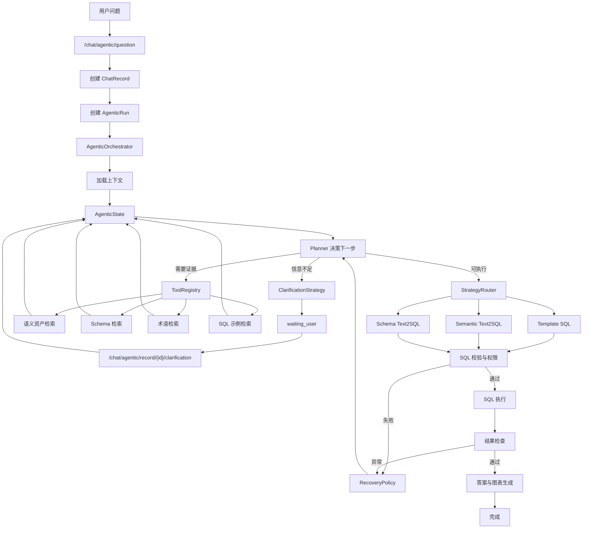
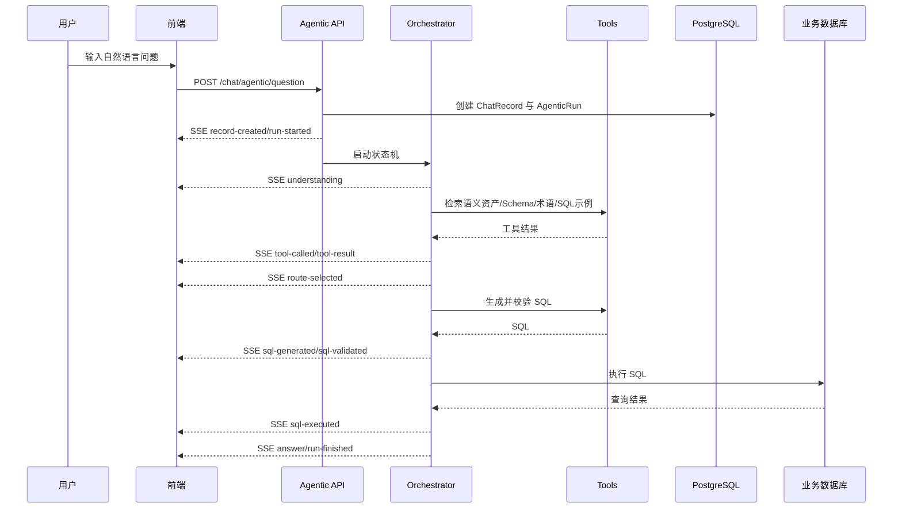
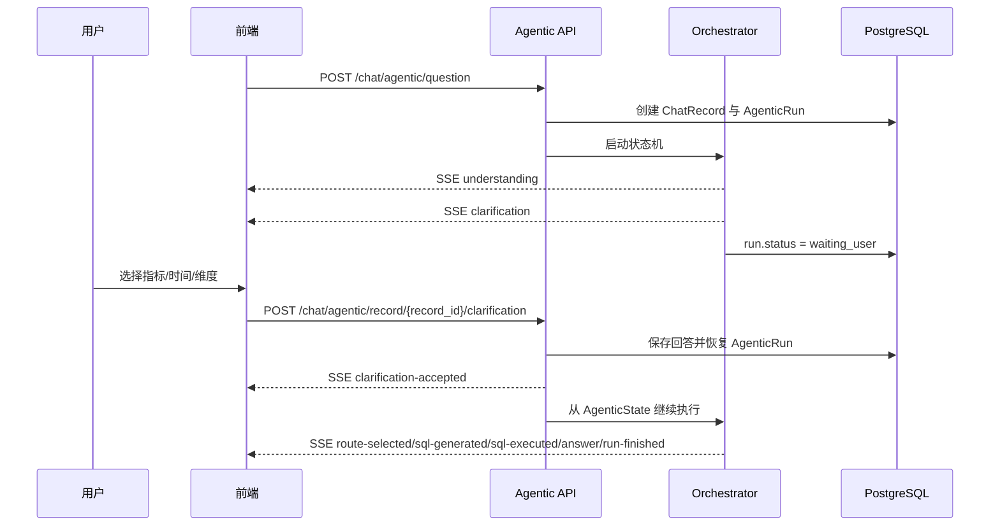

# 独立 Agentic ChatBI 问数流程技术设计

**关联 PRD：** [03-multi-strategy-agentic-rag-prd.md](../prd/03-multi-strategy-agentic-rag-prd.md)、[02-query-understanding-clarification-prd.md](../prd/02-query-understanding-clarification-prd.md)、[04-observability-feedback-memory-prd.md](../prd/04-observability-feedback-memory-prd.md)  
**参考资料：** [agentic-rag-multi-strategy-chatbi.md](../agentic-rag-multi-strategy-chatbi.md)、[sqlbot-agentic-rag-integrated-blueprint.md](../sqlbot-agentic-rag-integrated-blueprint.md)、[interactive-clarification-workflow.md](../interactive-clarification-workflow.md)、[02-query-understanding-clarification-tech-design.md](./02-query-understanding-clarification-tech-design.md)、[development-technical-report.md](../development-technical-report.md)  
**状态：** 草案  
**创建日期：** 2026-05-26  
**目标版本：** P1 独立 Agentic 问数最小闭环，P2 多策略回退与工具循环增强

## 1. 背景与设计结论

`02-query-understanding-clarification-tech-design.md` 的原推荐方案是在现有 `LLMService.run_task` 前后增加问题理解、澄清和恢复节点。该方案改动较小，但仍受旧线性流水线约束：数据源选择、上下文检索、SQL 生成、权限改写、SQL 执行和图表生成都耦合在 `run_task` 中，状态暂停、恢复、回退和多策略调度会越来越难维护。

本设计选择 `02` 文档中的方案 C：完整 Agentic Loop 状态机。但关键约束是：**不在原 `run_task` 上做修改或兼容，而是新增一条独立 Agentic ChatBI 问数流程。**

新流程保留旧问答入口作为 Legacy：

```text
POST /chat/question -> LLMService.run_task
```

新增独立入口：

```text
POST /chat/agentic/question
POST /chat/agentic/record/{record_id}/clarification
GET  /chat/agentic/record/{record_id}/trace
```

新流程不调用 `LLMService.run_task`，只复用底层能力，例如数据源读取、语义资产检索、术语检索、SQL 示例检索、权限规则、SQL 执行、模型工厂和图表生成相关模板。

### 1.1 设计目标

- 建立独立状态机执行器，使理解、检索、澄清、策略路由、SQL 生成、校验、执行、结果检查和回退都是一等步骤。
- 新增受控工具层，Agent 只能调用后端注册工具，不能调用任意外部能力。
- 支持同一个 `ChatRecord` 上暂停等待用户澄清，并从 `agentic_run` 状态恢复执行。
- 支持模板 SQL、语义 Text2SQL、Schema Text2SQL、SQL 修复和澄清之间的策略切换。
- 为每一步写入结构化 trace，满足后续可观测、反馈和记忆闭环。

### 1.2 非目标

- 不改造旧 `/chat/question` 的默认行为。
- 不把 `LLMService.run_task` 抽成通用编排器。
- 不允许 Agent 自由执行任意 SQL 或任意工具。
- 首期不建设完整多 Agent 协作，不做跨数据源复杂 Join 自动规划。
- 首期模板 SQL 可预留接口，不强依赖模板资产全部建成后再上线最小流程。

## 2. Agent 范式定位

本方案采用的是 **状态驱动的 Planner-Executor Agent**，可以理解为 Plan-and-Execute 与 ReAct 的工程化混合形态。

它不是纯 ReAct 范式。纯 ReAct 通常由模型在每一步生成思考、选择工具、观察结果并继续推理，工具选择和中间推理更依赖模型即时输出。本方案不把工具调用权完全交给模型，而是通过显式 `Planner`、`AgenticState`、`ToolRegistry` 和 `RecoveryPolicy` 控制每一步。

它也不是一次性 Plan-and-Execute。传统 Plan-and-Execute 往往先生成完整计划，再由 Executor 顺序执行。本方案不会在开始时固定完整执行计划，因为 ChatBI 问数会受到澄清回答、检索结果、SQL 校验、权限改写、执行错误和结果异常影响。系统必须在每一步之后根据最新状态重新决策。

本方案的执行范式是：

```text
Planner 根据 AgenticState 决定下一步
  -> Executor 调用受控工具或策略
  -> Tool/Strategy 返回结构化结果
  -> AgenticState 更新证据、槽位、SQL、错误和结果
  -> RecoveryPolicy 在失败时修复或回退
  -> Planner 基于新状态继续决策
```

组件职责对应关系：

| 组件 | 在 Agent 范式中的角色 | 说明 |
| --- | --- | --- |
| `AgenticOrchestrator` | 执行循环控制器 | 驱动状态机、调度步骤、写 trace、推 SSE |
| `Planner` | 规划器 | 基于当前状态选择下一步 action，不直接执行工具 |
| `AgenticState` | 工作记忆 | 保存问题理解、槽位、证据、策略、SQL、执行结果和错误 |
| `ToolRegistry` | 工具边界 | 注册后端受控工具，限制 Agent 可调用能力 |
| `strategies/*` | 策略执行器 | 执行澄清、模板 SQL、语义 Text2SQL、Schema Text2SQL、SQL 修复 |
| `RecoveryPolicy` | 再规划策略 | SQL 失败、低置信、空结果等场景下决定修复、换策略或失败 |

因此，后续实现时不应把 `Planner` 写成一个只输出完整计划的 Prompt，也不应让 LLM 直接返回任意工具名并执行。推荐先实现确定性规则 Planner，再在复杂场景中引入 LLM 仲裁，但 LLM 仲裁结果仍必须经过工具白名单、状态校验和预算限制。

## 3. 当前项目可复用能力

新流程不复用旧编排，但复用底层领域服务：

| 能力 | 现有位置 | 新流程复用方式 |
| --- | --- | --- |
| 用户、工作空间、Assistant 上下文 | `common.core.deps`、`apps.system.crud.assistant` | Agentic API 入口统一注入 |
| Chat 与 ChatRecord | `backend/apps/chat/models/chat_model.py`、`backend/apps/chat/curd/chat.py` | 继续作为聊天历史和最终答案载体 |
| 数据源读取和连接检查 | `apps.datasource`、`apps.db.db.check_connection` | 封装成 `DatasourceTool` |
| Schema 检索 | `get_table_schema` | 封装成 `SchemaSearchTool` |
| 语义资产检索 | `retrieve_semantic_assets` | 封装成 `SemanticAssetTool` |
| 术语检索 | `get_terminology_template` | 封装成 `TerminologyTool` |
| SQL 示例检索 | `get_training_template` | 封装成 `SqlExampleTool` |
| SQL 执行 | `apps.db.db.exec_sql` | 封装成 `SqlExecuteTool` |
| 行列权限 | `apps.datasource.crud.permission` | 封装成 `PermissionTool` |
| LLM 实例 | `LLMFactory`、`get_default_config` | 新 Prompt 与新消息结构使用 |
| 语义资产使用记录 | `apps.semantic.services.asset_usage` | 策略成功后记录命中和使用 |

## 4. 总体架构



### 4.1 新旧流程边界

| 维度 | Legacy 流程 | Agentic 流程 |
| --- | --- | --- |
| 入口 | `/chat/question` | `/chat/agentic/question` |
| 编排器 | `LLMService.run_task` | `AgenticOrchestrator` |
| 流程模型 | 线性流水线 | 状态机 + 工具循环 |
| 澄清恢复 | 需要插入兼容逻辑 | 原生 `waiting_user -> running` |
| 回退 | 异常后结束或局部重试 | 策略级回退 |
| trace | `ChatLog` 为主 | `agentic_step` + `agentic_trace_event` |
| 前端消费 | `ChartAnswer.vue` | 建议新增 `AgenticAnswer.vue` |

## 5. 后端模块设计

新增模块：

```text
backend/apps/agentic_chat/
  api.py
  models.py
  schemas.py
  crud.py
  orchestrator.py
  planner.py
  state.py
  events.py
  prompts.py
  tool_registry.py
  tools/
    datasource.py
    semantic_asset.py
    schema.py
    terminology.py
    sql_example.py
    template_sql.py
    sql_generator.py
    sql_validator.py
    permission.py
    sql_executor.py
    result_checker.py
    answer_generator.py
  strategies/
    clarification.py
    template_sql.py
    semantic_text2sql.py
    schema_text2sql.py
    sql_repair.py
    recovery.py
```

### 5.1 `AgenticOrchestrator`

职责：

- 创建或恢复 `AgenticRun`。
- 按状态循环调用 `Planner`。
- 调用工具或策略执行器。
- 写入 step、trace 和 SSE 事件。
- 在 `waiting_user`、`finished`、`failed`、`cancelled` 状态停止。

主循环伪代码：

```python
while run.status == "running":
    decision = planner.next_action(state)
    step = step_repo.start(run.id, decision)
    emit("step-started", step)

    try:
        result = executor.execute(decision, state)
        state = state.apply(result)
        step_repo.finish(step.id, result)
        emit(result.event_type, result.public_payload)
    except RecoverableAgenticError as error:
        state = recovery_policy.apply(state, error)
        step_repo.fail(step.id, error, recoverable=True)
    except Exception as error:
        run_repo.fail(run.id, error)
        emit("run-failed", safe_error(error))
        break
```

实际实现时需要使用中文注释说明复杂状态分支，符合仓库 `AGENTS.md` 要求。

### 5.2 `Planner`

`Planner` 负责决定下一步，不直接执行业务工具。输入是 `AgenticState`，输出是 `AgenticDecision`：

| 决策 | 含义 |
| --- | --- |
| `understand_query` | 需要做问题理解或合并用户澄清 |
| `ask_clarification` | 信息不足，需要用户补充 |
| `retrieve_evidence` | 需要检索语义资产、Schema、术语或 SQL 示例 |
| `route_strategy` | 证据足够，可以选择策略 |
| `generate_sql` | 执行某个 SQL 生成策略 |
| `validate_sql` | 校验 SQL 安全、语法和权限 |
| `execute_sql` | 执行 SQL |
| `check_result` | 检查空结果、异常结果或字段不匹配 |
| `repair_or_fallback` | 修复 SQL 或切换策略 |
| `generate_answer` | 生成图表和自然语言答案 |
| `finish` | 完成 |

P1 推荐先用确定性规则实现 Planner，后续再加入 LLM 仲裁：

```text
缺关键槽位 -> ask_clarification
缺证据 -> retrieve_evidence
证据齐全但无策略 -> route_strategy
已有 SQL 未校验 -> validate_sql
SQL 校验通过未执行 -> execute_sql
执行成功未出答案 -> generate_answer
```

### 5.3 `AgenticState`

`AgenticState` 是新流程的核心，不依赖 `LLMService` 的实例变量。

```json
{
  "question": "最近业绩怎么样？",
  "normalized_question": "查询最近一段时间的业绩表现",
  "intent": "trend_analysis",
  "slots": {
    "metrics": [],
    "dimensions": [],
    "time_range": []
  },
  "confirmed_slots": {},
  "missing_slots": ["metrics", "time_range"],
  "datasource": null,
  "evidence": {
    "semantic_assets": [],
    "schemas": [],
    "terms": [],
    "sql_examples": []
  },
  "strategy": null,
  "strategy_history": [],
  "sql_candidates": [],
  "validated_sql": null,
  "execution_result": null,
  "chart": null,
  "answer": null,
  "errors": []
}
```

状态更新必须只通过明确的 `apply_*` 方法，避免工具直接修改散落字段。

## 6. 数据模型

### 6.1 `agentic_run`

| 字段 | 类型 | 说明 |
| --- | --- | --- |
| `id` | bigint | 主键 |
| `oid` | bigint | 工作空间 |
| `chat_id` | bigint | 会话 ID |
| `record_id` | bigint | `chat_record.id` |
| `status` | varchar(32) | `created`、`running`、`waiting_user`、`finished`、`failed`、`cancelled` |
| `mode` | varchar(32) | `agentic_chatbi` |
| `current_step` | varchar(64) | 当前步骤 |
| `state` | jsonb | `AgenticState` 快照 |
| `config` | jsonb | 步数、超时、成本、启用策略 |
| `error` | text nullable | 安全错误摘要 |
| `created_at` / `updated_at` | datetime | 时间戳 |
| `created_by` | bigint | 创建人 |

### 6.2 `agentic_step`

| 字段 | 类型 | 说明 |
| --- | --- | --- |
| `id` | bigint | 主键 |
| `run_id` | bigint | `agentic_run.id` |
| `step_index` | int | 步骤序号 |
| `step_type` | varchar(64) | `understand_query`、`tool_call`、`route_strategy` 等 |
| `tool_name` | varchar(128) nullable | 工具名 |
| `strategy` | varchar(64) nullable | 策略名 |
| `input_summary` | jsonb | 脱敏输入摘要 |
| `output_summary` | jsonb | 脱敏输出摘要 |
| `status` | varchar(32) | `running`、`success`、`failed`、`skipped` |
| `duration_ms` | int | 耗时 |
| `token_usage` | jsonb nullable | 模型用量 |
| `error` | text nullable | 错误摘要 |
| `created_at` / `finished_at` | datetime | 时间戳 |

### 6.3 `agentic_clarification`

| 字段 | 类型 | 说明 |
| --- | --- | --- |
| `id` | bigint | 主键 |
| `run_id` | bigint | `agentic_run.id` |
| `record_id` | bigint | `chat_record.id` |
| `status` | varchar(32) | `pending`、`answered`、`cancelled`、`expired` |
| `target_slots` | jsonb | 需要补充的槽位 |
| `question` | text | 澄清问题 |
| `options` | jsonb | 选项 |
| `answer` | jsonb nullable | 用户回答 |
| `created_at` / `answered_at` | datetime | 时间戳 |

### 6.4 与 `ChatRecord` 的关系

`ChatRecord` 继续作为聊天列表和最终结果展示载体。Agentic 流程可以扩展 `ChatRecord`：

| 字段 | 说明 |
| --- | --- |
| `status` | 展示 `running`、`waiting_user`、`finished`、`failed` |
| `trace_id` | 对应 `agentic_run.id` 或独立 trace ID |

也可以首期不扩展 `ChatRecord`，通过 `agentic_run.record_id` 查询状态；但前端刷新恢复会更麻烦。推荐扩展轻量状态字段。

## 7. 工具层设计

所有工具实现统一接口：

```python
class AgenticTool:
    name: str
    def run(self, context: AgenticContext, args: dict) -> ToolResult:
        ...
```

工具必须满足：

- 输入输出可序列化。
- 内部做权限校验。
- 输出分为 `public_payload` 和 `private_payload`。
- 写入 step 时只保存脱敏摘要。
- 超时、异常和空结果都返回结构化错误。

### 7.1 P1 工具清单

| 工具 | 职责 | 复用能力 |
| --- | --- | --- |
| `datasource.search` | 选择或校验数据源 | `CoreDatasource`、Assistant 数据源范围 |
| `semantic.search_assets` | 检索指标维度 | `retrieve_semantic_assets` |
| `schema.search` | 检索表字段 Schema | `get_table_schema` |
| `terminology.search` | 检索术语 | `get_terminology_template` |
| `sql_example.search` | 检索 SQL 示例 | `get_training_template` |
| `sql.generate_schema` | Schema Text2SQL | 新 Prompt + LLMFactory |
| `sql.validate` | SQL 安全校验 | 新共享 SQL 校验器 |
| `permission.apply` | 权限过滤 | `get_row_permission_filters` |
| `sql.execute` | 执行 SQL | `exec_sql` |
| `answer.generate` | 生成图表和答案 | 新 Prompt，可复用图表模板 |

### 7.2 P2 工具清单

| 工具 | 职责 |
| --- | --- |
| `template.search` | 检索问题模板和 SQL 模板 |
| `template.fill` | 填充模板 SQL |
| `sql.generate_semantic` | 基于指标维度生成 SQL |
| `sql.repair` | 根据错误修复 SQL |
| `result.check` | 检查空结果、异常值和字段不匹配 |
| `trace.compress` | 长工具循环 trace 压缩 |

## 8. 策略路由

### 8.1 策略集合

| 策略 | 适用场景 | P1/P2 |
| --- | --- | --- |
| `clarification` | 缺指标、时间、维度、数据源或口径冲突 | P1 |
| `schema_text2sql` | 临时探索问题，模板和语义策略不足 | P1 |
| `semantic_text2sql` | 指标维度明确，语义资产命中高 | P2 |
| `template_sql` | 高频标准问题，模板可填充 | P2 |
| `sql_repair` | SQL 校验或执行失败但可修复 | P2 |

### 8.2 路由输入

`StrategyRouter` 输入：

- 意图和槽位完整性。
- 已确认槽位。
- 语义资产命中分数。
- Schema 召回分数。
- SQL 示例和模板候选。
- 历史失败策略。
- 成本、步数和超时预算。

### 8.3 路由优先级

```text
信息不足 -> clarification
高置信模板且槽位可填充 -> template_sql
指标维度明确且语义资产完整 -> semantic_text2sql
开放探索或兜底 -> schema_text2sql
失败可修复 -> sql_repair
超过预算 -> failed
```

每次路由必须记录：

```json
{
  "selected": "schema_text2sql",
  "confidence": 0.72,
  "candidates": [
    {"strategy": "template_sql", "score": 0.31, "reason": "no fillable template"},
    {"strategy": "semantic_text2sql", "score": 0.58, "reason": "metric matched but dimension missing"},
    {"strategy": "schema_text2sql", "score": 0.72, "reason": "schema evidence enough"}
  ]
}
```

## 9. 独立执行流程

### 9.1 首次提问



### 9.2 需要澄清



## 10. API 与 SSE

### 10.1 `POST /chat/agentic/question`

请求复用 `ChatQuestion` 的核心字段：

```json
{
  "chat_id": 1,
  "question": "最近业绩怎么样？",
  "datasource_id": 10
}
```

响应为 `text/event-stream`。

### 10.2 `POST /chat/agentic/record/{record_id}/clarification`

```json
{
  "clarification_id": 1001,
  "answers": [
    {
      "slot": "metrics",
      "value": "销售额",
      "asset_type": "METRIC",
      "asset_id": 12
    }
  ],
  "free_text": "近30天，按区域看"
}
```

### 10.3 SSE 事件

| 事件 | 说明 |
| --- | --- |
| `record-created` | 返回 `record_id`、`run_id` |
| `run-started` | AgenticRun 开始 |
| `step-started` | 某一步开始 |
| `understanding` | 问题理解结果 |
| `tool-called` | 工具调用开始 |
| `tool-result` | 工具调用结果摘要 |
| `route-selected` | 策略路由结果 |
| `clarification` | 需要用户澄清 |
| `clarification-accepted` | 用户澄清已接收 |
| `sql-generated` | SQL 候选生成 |
| `sql-validated` | SQL 校验通过 |
| `sql-executed` | SQL 执行完成 |
| `result-checked` | 结果检查完成 |
| `chart-generated` | 图表配置生成 |
| `answer` | 自然语言答案 |
| `run-finished` | 完成 |
| `run-failed` | 失败 |

### 10.4 前端接入

建议新增：

```text
frontend/src/api/agentic-chat.ts
frontend/src/views/chat/answer/AgenticAnswer.vue
frontend/src/views/chat/clarification/ClarificationCard.vue
frontend/src/views/chat/execution-component/AgenticTrace.vue
```

短期可通过配置控制入口：

| 配置 | 行为 |
| --- | --- |
| `CHAT_AGENTIC_FLOW_ENABLED=false` | 所有问题走旧 `/chat/question` |
| `CHAT_AGENTIC_FLOW_ENABLED=true` | 试点数据源走 `/chat/agentic/question` |
| `CHAT_AGENTIC_FLOW_DATASOURCE_ALLOWLIST` | 控制哪些数据源启用新流程 |

## 11. 安全与边界

- 所有工具必须校验 `oid`、`current_user`、`current_assistant` 和数据源访问范围。
- SQL 生成策略不得直接执行，必须经过 `sql.validate`、`permission.apply` 和 `sql.execute`。
- 只允许 `SELECT` 或数据库方言等价只读查询。
- 权限改写失败时不能绕过权限执行。
- Agentic Loop 必须有最大步数、最大耗时和最大模型调用次数。
- 工具输出给前端前必须脱敏，不展示原始 Prompt、密钥、连接信息和敏感样例值。
- 用户提交的澄清 `asset_id` 不可信，必须与待处理澄清选项或当前权限重新校验。

建议默认限制：

| 配置 | 默认值 |
| --- | --- |
| `AGENTIC_MAX_STEPS` | 12 |
| `AGENTIC_MAX_TOOL_CALLS` | 20 |
| `AGENTIC_MAX_DURATION_SECONDS` | 60 |
| `AGENTIC_SQL_REPAIR_MAX_ATTEMPTS` | 2 |
| `AGENTIC_RESULT_PREVIEW_ROWS` | 100 |

## 12. 错误处理与回退

### 12.1 可恢复错误

| 错误 | 处理 |
| --- | --- |
| 缺少核心槽位 | 进入澄清 |
| 语义资产低置信 | 补充 Schema/术语检索或走 Schema Text2SQL |
| 模板不可填充 | 回退到语义或 Schema Text2SQL |
| SQL 语法错误 | 进入 `sql_repair`，最多 2 次 |
| 权限改写失败 | 停止执行并返回安全错误 |
| SQL 执行空结果 | 检查过滤条件，必要时澄清或提示无数据 |
| 图表生成失败 | 降级为表格答案 |

### 12.2 不可恢复错误

- 无可用数据源。
- 用户无数据源权限。
- 连接失败。
- 超过最大步数或最大耗时。
- SQL 校验发现非只读或危险语句。
- 多次修复后仍无法生成可执行 SQL。

不可恢复错误必须写入 `agentic_run.error` 和 `ChatRecord.error`，并发送 `run-failed`。

## 13. 与 02 问题理解方案的关系

`02-query-understanding-clarification-tech-design.md` 仍可作为问题理解、槽位模型、澄清 Payload 和前端卡片的参考，但本方案不采用其中的 `LLMService.run_task` 改造路线。

关系如下：

| 能力 | 02 方案 | 本方案 |
| --- | --- | --- |
| 问题理解模型 | 可复用 | 作为 AgenticState 的一部分 |
| 澄清 Payload | 可复用 | 由 `ClarificationStrategy` 生成 |
| 恢复 API | 路径不同 | 使用 `/chat/agentic/record/{id}/clarification` |
| 执行编排 | 改造 `run_task` | 独立 `AgenticOrchestrator` |
| trace | ChatLog 扩展 | agentic_step / agentic_trace |

## 14. 分阶段落地

### P1.1 独立最小闭环

- 新增 `agentic_chat` 模块和 `/chat/agentic/question`。
- 新增 `agentic_run`、`agentic_step`、`agentic_clarification`。
- 实现状态机：理解、澄清、检索、Schema Text2SQL、SQL 校验、执行、答案。
- 前端试点 `AgenticAnswer.vue`。

### P1.2 可观测与刷新恢复

- 增加 `GET /chat/agentic/record/{record_id}/trace`。
- 前端展示步骤 trace。
- 刷新后恢复 `waiting_user` 澄清卡片。

### P2.1 多策略路由

- 接入 `semantic_text2sql`。
- 接入模板 SQL 检索和填充。
- 记录策略候选、分数和回退原因。

### P2.2 回退与修复

- 增加 `sql_repair`。
- 增加 `result.check`。
- 增加策略级回退和预算控制。

## 15. 测试策略

### 15.1 后端单元测试

- `Planner` 在不同 `AgenticState` 下返回正确 `AgenticDecision`。
- `AgenticState.apply()` 不丢失已确认槽位。
- 工具权限校验拒绝跨工作空间和跨用户访问。
- SQL 校验拒绝非只读 SQL。
- 超过最大步数时进入 `failed`。

### 15.2 后端集成测试

- `/chat/agentic/question` 可完成 Schema Text2SQL 最小链路。
- 缺指标问题返回 `clarification`，不生成 SQL。
- 澄清恢复接口沿用同一 `record_id` 完成后续执行。
- SQL 执行失败触发修复或失败 trace。
- 用户 A 不能恢复用户 B 的 `agentic_run`。

### 15.3 前端测试

- 新旧入口可按配置切换。
- `AgenticAnswer.vue` 正确消费 `record-created`、`clarification`、`answer`、`run-finished`。
- 刷新后可恢复待澄清状态。
- `AgenticTrace.vue` 不展示敏感 private payload。

## 16. 风险与应对

| 风险 | 影响 | 应对 |
| --- | --- | --- |
| 与旧流程重复代码 | 维护成本上升 | 只复用底层服务，不复制旧 `run_task`；后续逐步抽共享底层能力 |
| 新流程首期能力弱于旧流程 | 试点体验波动 | 通过数据源 allowlist 灰度，保留旧入口回退 |
| Agentic Loop 成本过高 | 延迟和模型成本上升 | 默认用规则 Planner，限制步数、工具数和耗时 |
| trace 数据过大 | 数据库膨胀 | step 只保存摘要，长 trace 压缩，结果数据不入 trace |
| 权限绕过 | 安全风险 | 每个工具独立校验权限，SQL 执行前统一权限改写 |
| 前端复杂度增加 | 维护困难 | 新增 `AgenticAnswer.vue`，不把复杂事件塞进旧 `ChartAnswer.vue` |

## 17. 验收标准

- 新增 `/chat/agentic/question`，并能在不调用 `LLMService.run_task` 的情况下完成最小问数闭环。
- 同一问题在旧 `/chat/question` 和新 `/chat/agentic/question` 可并存，互不影响。
- 缺关键槽位时，新流程进入 `waiting_user`，并通过澄清恢复接口继续执行。
- 所有 SQL 执行前经过 SQL 校验和权限处理。
- 每次 Agentic 请求都有 `agentic_run` 和至少一条 `agentic_step`。
- 前端能按配置选择新旧流程，并能展示 Agentic trace 摘要。
