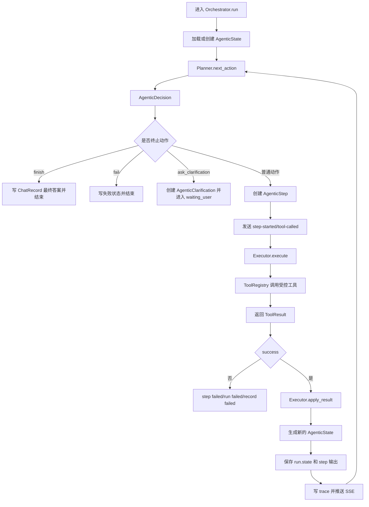
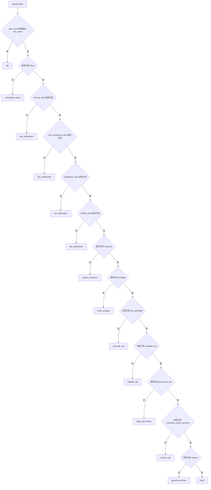
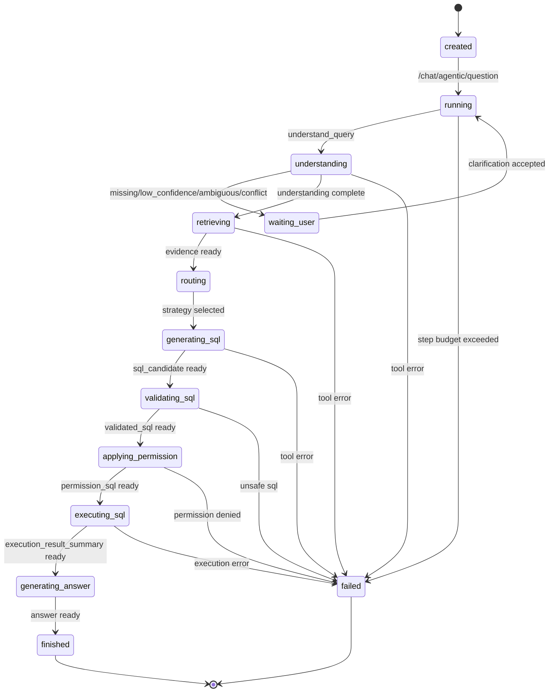
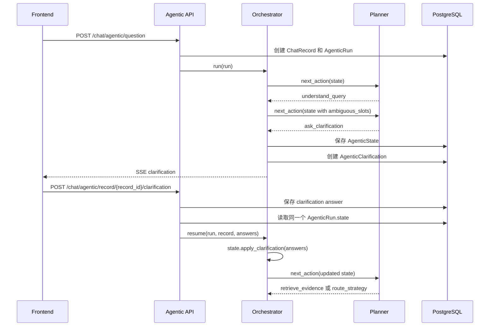
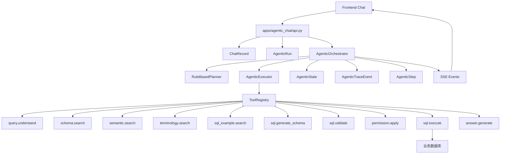
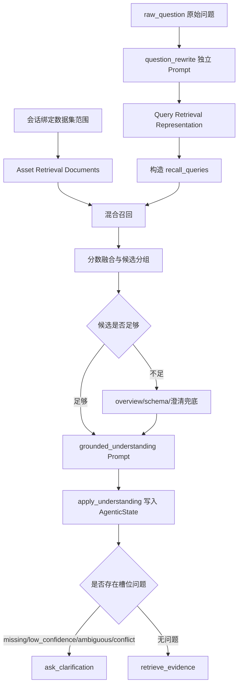

# Agentic ChatBI 全流程详细技术文档

**关联技术设计：** [03-independent-agentic-chatbi-flow-tech-design.md](./03-independent-agentic-chatbi-flow-tech-design.md)  
**关联详细设计：** [../sd/03-independent-agentic-chatbi-flow-sd.md](../sd/03-independent-agentic-chatbi-flow-sd.md)  
**关联实现清单：** [../todo_list/03-independent-agentic-chatbi-flow-implementation-todo.md](../todo_list/03-independent-agentic-chatbi-flow-implementation-todo.md)  
**状态：** 草案  
**创建日期：** 2026-05-27  
**适用范围：** SQLBot 独立 Agentic ChatBI 问数流程，覆盖后端 API、状态机、Planner-Executor、工具节点、澄清恢复、SSE、trace 与前端消费。

## 1. 文档目标

本文档用于描述独立 Agentic ChatBI 流程的完整技术方案。它不是对旧 `LLMService.run_task` 的改造说明，而是对新增 `/chat/agentic/*` 问数链路的端到端设计说明。

本文档需要回答以下问题：

- 新旧问数流程的边界在哪里。
- Agentic 流程采用什么 Agent 范式。
- 一次用户提问从前端到后端、从理解到执行、从 SQL 到答案完整经历哪些节点。
- 每个节点的输入、处理逻辑、输出、状态更新和 SSE 事件是什么。
- 如何在同一个 `record_id` 上暂停澄清并恢复执行。
- trace 如何落库、如何查询、如何给前端展示。
- 当前实现已经完成哪些能力，哪些仍是 P2 待接入能力。

## 2. 总体结论

独立 Agentic ChatBI 流程采用 **状态驱动的 Planner-Executor Agent** 范式。

核心链路如下：

```text
用户问题
  -> /chat/agentic/question
  -> 创建 ChatRecord
  -> 创建 AgenticRun
  -> AgenticOrchestrator 启动循环
  -> Planner 基于 AgenticState 决策下一步
  -> Executor 调用 ToolRegistry 中的受控工具
  -> ToolResult 更新 AgenticState
  -> 写入 AgenticStep 与 AgenticTraceEvent
  -> 推送 SSE 给前端
  -> 必要时 waiting_user 暂停
  -> 澄清接口恢复同一个 run
  -> SQL 生成、校验、权限处理、执行
  -> 生成答案
  -> 完成 ChatRecord 与 AgenticRun
```

新流程与旧流程并存：

| 维度 | Legacy 流程 | Agentic 流程 |
| --- | --- | --- |
| 提问入口 | `POST /chat/question` | `POST /chat/agentic/question` |
| 编排器 | `LLMService.run_task` | `AgenticOrchestrator` |
| 流程形态 | 线性流水线 | 状态机 + Planner-Executor |
| 澄清能力 | 非原生 | 原生 `waiting_user -> running` |
| trace | 以旧日志为主 | `agentic_step` + `agentic_trace_event` |
| SQL 执行 | 旧流程内部控制 | `sql.validate -> permission.apply -> sql.execute` |
| 前端消费 | `ChartAnswer.vue` | `AgenticAnswer.vue` |

## 3. Agent 范式

### 3.1 当前项目中的范式定义

本项目中的 Agent 范式定义为 **状态驱动的 Planner-Executor Agent**。

这里的“状态驱动”指的是：系统不会在请求开始时生成一个固定不变的完整执行计划，也不会让模型直接决定任意工具调用。每一步都以 `AgenticState` 为唯一工作记忆，由 `Planner` 根据当前状态选择下一步，再由 `Executor` 调用后端注册工具，工具结果回写状态后再进入下一轮决策。

在当前项目中，它落到以下对象上：

| 对象 | 项目文件 | 在范式中的职责 |
| --- | --- | --- |
| `AgenticOrchestrator` | `backend/apps/agentic_chat/orchestrator.py` | 状态机循环控制器，负责创建 step、调用 Planner/Executor、写 trace、推 SSE、处理终止状态 |
| `AgenticState` | `backend/apps/agentic_chat/state.py` | Agent 工作记忆，保存问题理解、槽位、证据、策略、SQL、执行结果、答案和错误 |
| `RuleBasedPlanner` | `backend/apps/agentic_chat/planner.py` | 决策器，根据 `AgenticState` 输出下一步 `AgenticDecision` |
| `AgenticExecutor` | `backend/apps/agentic_chat/executor.py` | 执行器，把 `AgenticDecision` 映射成受控工具调用，并把 `ToolResult` 合并回状态 |
| `ToolRegistry` | `backend/apps/agentic_chat/tool_registry.py` | 工具白名单，限制 Agent 只能调用后端注册能力 |
| `AgenticStep` | `backend/apps/agentic_chat/models.py` | 每一次决策执行的持久化记录 |
| `AgenticTraceEvent` | `backend/apps/agentic_chat/models.py` | 前端可回放的执行事件 |
| `AgenticClarification` | `backend/apps/agentic_chat/models.py` | 暂停等待用户补充信息的持久化对象 |

### 3.2 为什么使用这个范式

ChatBI 问数不是一次普通的文本生成任务。用户问题能否继续执行，取决于多个动态条件：

- 问题是否能被理解。
- 指标、维度、时间、过滤条件是否完整。
- 识别出的指标是否正确，而不是仅仅“能识别出来”。
- 语义资产、Schema、术语、SQL 示例是否能召回足够证据。
- SQL 是否能生成。
- SQL 是否安全。
- SQL 是否满足权限约束。
- SQL 执行结果是否可用。
- 是否需要用户补充信息后恢复执行。

这些条件都只能在执行过程中逐步获得，所以当前项目需要一个“每一步执行后重新看状态”的范式。

使用状态驱动 Planner-Executor 的原因：

| 需求 | 对范式的要求 | 当前方案 |
| --- | --- | --- |
| 支持澄清暂停 | 执行中可以停在 `waiting_user`，并保存现场 | `AgenticRun.state` 持久化 `AgenticState`，澄清后恢复同一个 run |
| 支持相似指标确认 | 不能只按 Top1 自动选择 | `query.understand` 写入 `ambiguous_slots`，Planner 转入 `ask_clarification` |
| 支持多步证据检索 | SQL 生成前需要 Schema、语义资产、术语和示例 | `retrieve_evidence` 节点统一补充 `state.evidence` |
| 支持安全执行 | SQL 生成和 SQL 执行必须隔离 | Planner 强制经过 `validate_sql`、`apply_permission`、`execute_sql` |
| 支持前端可观测 | 每一步都要能展示和排障 | Orchestrator 每步写入 step 和 trace，并发送 SSE |
| 支持后续多策略 | P2 需要模板 SQL、语义 Text2SQL、SQL 修复 | `state.strategy` 和 `strategy_history` 为策略路由预留 |
| 控制执行边界 | 避免无限循环和任意工具调用 | `max_steps`、`ToolRegistry`、固定 decision 枚举 |

### 3.3 范式在项目中的执行闭环

一次 Agentic 循环由五个阶段组成：读状态、做决策、执行工具、合并状态、持久化并通知前端。



这个闭环中，`Planner` 不关心工具内部怎么做，`Executor` 不决定下一步走哪里，`Tool` 不直接改 run 状态，`Orchestrator` 不理解业务语义，只负责把状态机跑完整。职责拆开后，后续新增 `result.check`、`sql.repair`、`template_sql` 时，只需要扩展 decision、tool 和状态字段，不需要把旧线性流程越改越复杂。

### 3.4 节点转换总览

当前 P1 的节点转换由 `RuleBasedPlanner` 控制，转换依据全部来自 `AgenticState`。



转换条件说明：

| 当前状态判断 | 下一节点 | 原因 |
| --- | --- | --- |
| 超过最大步数 | `fail` | 防止 Agentic Loop 无边界运行 |
| 无 `intent` | `understand_query` | 必须先完成问题理解 |
| 有 `missing_slots` | `ask_clarification` | 核心信息不足，继续执行会生成不可靠 SQL |
| 有 `low_confidence_slots` | `ask_clarification` | 能识别但不确定，不能默认采用低置信槽位 |
| 有 `ambiguous_slots` | `ask_clarification` | 多个相似指标或维度无法唯一确定 |
| 有 `conflict_slots` | `ask_clarification` | 本轮理解与用户已确认信息冲突 |
| 无 `evidence` | `retrieve_evidence` | SQL 生成需要 Schema、语义资产、术语、示例等证据 |
| 无 `strategy` | `route_strategy` | 需要确定 SQL 生成策略，当前默认 `schema_text2sql` |
| 无 `sql_candidate` | `generate_sql` | 已有策略但还没有 SQL 候选 |
| 无 `validated_sql` | `validate_sql` | SQL 不能直接执行，必须先安全校验 |
| 无 `permission_sql` | `apply_permission` | SQL 执行前必须经过权限处理 |
| 无 `execution_result_summary` | `execute_sql` | 权限 SQL 已准备好，可以查询业务库 |
| 无 `answer` | `generate_answer` | 查询结果需要转成用户可读答案 |
| 以上条件都不满足 | `finish` | 状态满足完成条件 |

### 3.5 节点状态转换图

从业务状态看，一次 run 会在 `running`、`waiting_user`、`finished`、`failed` 之间转换。



当前 P1 中，SQL 校验失败、权限失败、执行失败会直接进入 `failed`。P2 引入 `sql_repair`、`result.check` 和策略回退后，失败边可以变成可恢复转换：

```text
validating_sql failed -> sql_repair -> validating_sql
executing_sql failed -> sql_repair -> validating_sql
empty_result -> result.check -> repair_or_fallback -> route_strategy
semantic_conflict -> ask_clarification -> running
```

### 3.6 各节点在范式中的角色

| 节点 | Planner 判断依据 | Executor 调用 | 状态写入 | 可能的下一节点 |
| --- | --- | --- | --- | --- |
| `understand_query` | `state.intent` 为空 | `query.understand` | intent、slots、slot issues、retrieval queries | `ask_clarification` 或 `retrieve_evidence` |
| `ask_clarification` | 存在缺失、低置信、歧义或冲突槽位 | Orchestrator 创建 clarification | run/record 进入 `waiting_user` | 用户回答后回到 `running` |
| `retrieve_evidence` | `state.evidence` 为空 | schema、semantic、terminology、sql_example | evidence | `route_strategy` |
| `route_strategy` | `state.strategy` 为空 | 当前直接返回默认策略 | strategy、strategy_history | `generate_sql` |
| `generate_sql` | `state.sql_candidate` 为空 | `sql.generate_schema` | sql_candidate | `validate_sql` |
| `validate_sql` | `state.validated_sql` 为空 | `sql.validate` | validated_sql | `apply_permission` 或 `failed` |
| `apply_permission` | `state.permission_sql` 为空 | `permission.apply` | permission_sql | `execute_sql` 或 `failed` |
| `execute_sql` | `state.execution_result_summary` 为空 | `sql.execute` | execution_result_summary、execution_sample | `generate_answer` 或 `failed` |
| `generate_answer` | `state.answer` 为空 | `answer.generate` | answer、chart | `finish` |
| `finish` | answer 已存在 | Orchestrator 写最终结果 | run/record finished | 结束 |

### 3.7 澄清恢复如何嵌入范式

澄清不是独立的新会话，而是状态机的暂停和恢复。



这个设计保证：

- `record_id` 不变。
- `run_id` 不变。
- 前端仍在同一条消息上继续展示。
- 已确认槽位进入 `confirmed_slots`。
- 后续问题理解不能覆盖用户确认值。

### 3.8 当前实现约束

当前项目的范式实现还有几个明确边界：

- Planner 当前是规则型，不是 LLM 仲裁型。
- `route_strategy` 当前固定选择 `schema_text2sql`。
- P1 中工具失败通常直接进入 `failed`，P2 才引入可恢复回退。
- `permission.apply` 当前是透传占位，生产化前必须接入真实权限改写。
- `result.check` 尚未进入主循环，执行结果当前直接进入 `answer.generate`。
- `AgenticState` 是状态事实来源，不能让工具绕过 `apply_*` 方法直接修改 run 状态。

## 4. 总体架构



### 4.1 后端模块

```text
backend/apps/agentic_chat/
  api.py                         # Agentic API 入口
  models.py                      # agentic_run / step / clarification / trace_event
  schemas.py                     # 请求、响应、decision、tool result、config
  crud.py                        # 状态、step、trace、clarification 持久化
  state.py                       # AgenticState 与状态 apply 方法
  planner.py                     # RuleBasedPlanner
  executor.py                    # AgenticExecutor
  orchestrator.py                # 状态机执行循环
  events.py                      # SSE 序列化
  tool_registry.py               # 工具注册与调用边界
  services/query_understanding*  # 问题理解服务、候选构建、Prompt、规则兜底
  tools/*                        # 受控工具
  strategies/*                   # P2 策略预留
```

### 4.2 前端模块

```text
frontend/src/api/agentic-chat.ts
frontend/src/views/chat/answer/AgenticAnswer.vue
frontend/src/views/chat/clarification/ClarificationCard.vue
frontend/src/views/chat/execution-component/AgenticTrace.vue
```

前端职责：

- 根据配置选择旧入口或 Agentic 入口。
- 消费 `text/event-stream`。
- 维护当前 record 的流式状态。
- 展示澄清卡片并提交用户选择。
- 展示 Agentic trace。
- 接收最终答案、SQL、数据摘要和图表配置。

## 5. 数据模型

### 5.1 `ChatRecord`

`ChatRecord` 仍然是聊天列表和最终展示的主载体。

| 字段 | 用途 |
| --- | --- |
| `question` | 用户原始问题 |
| `sql` | 最终 SQL，优先保存权限处理后的 SQL |
| `sql_answer` | 最终自然语言答案 |
| `chart_answer` | 图表答案文案 |
| `chart` | 图表配置 |
| `data` | SQL 执行完整结果，JSON 字符串 |
| `status` | `running`、`waiting_user`、`finished`、`failed` |
| `trace_id` | trace 关联标识，当前可对应 `agentic_run.id` |
| `finish` / `error` | 兼容旧流程展示 |

关键约束：

- 完整查询结果写入 `ChatRecord.data`。
- `AgenticState` 只保留执行摘要和少量样例，避免状态快照过大。

### 5.2 `agentic_run`

`agentic_run` 表示一次 Agentic 问数执行。

| 字段 | 用途 |
| --- | --- |
| `id` | run ID |
| `oid` | 工作空间 |
| `chat_id` | 会话 ID |
| `record_id` | 对应 ChatRecord |
| `status` | `created`、`running`、`waiting_user`、`finished`、`failed`、`cancelled` |
| `mode` | 固定为 `agentic_chatbi` |
| `current_step` | 当前步骤名称 |
| `state` | `AgenticState` 快照 |
| `config` | 执行配置，例如最大步数、默认 limit |
| `error` | 安全错误摘要 |

### 5.3 `agentic_step`

`agentic_step` 表示状态机中的一次具体动作。

| 字段 | 用途 |
| --- | --- |
| `run_id` | 归属 run |
| `step_index` | 步骤序号 |
| `step_type` | action，例如 `understand_query` |
| `tool_name` | 工具名，例如 `query.understand` |
| `strategy` | 策略名，P2 使用 |
| `input_summary` | 脱敏输入摘要 |
| `output_summary` | 脱敏输出摘要 |
| `status` | `running`、`success`、`failed`、`skipped` |
| `duration_ms` | 执行耗时 |
| `token_usage` | 模型用量 |
| `error` | 错误摘要 |

### 5.4 `agentic_clarification`

`agentic_clarification` 表示一次等待用户补充的问题。

| 字段 | 用途 |
| --- | --- |
| `run_id` | 归属 run |
| `record_id` | 归属 record |
| `status` | `pending`、`answered`、`cancelled`、`expired` |
| `target_slots` | 需要补充或确认的槽位 |
| `question` | 澄清问题 |
| `options` | 前端可渲染选项 |
| `answer` | 用户回答 |
| `expires_at` | 过期时间，P2 可强化 |

同一个 `run_id` 只允许存在一个 pending clarification。

### 5.5 `agentic_trace_event`

`agentic_trace_event` 表示前端可回放的执行轨迹。

| 字段 | 用途 |
| --- | --- |
| `run_id` | 归属 run |
| `step_id` | 可选，对应具体 step |
| `event_type` | SSE 事件类型 |
| `public_payload` | 可给前端展示的 payload |
| `private_payload` | 内部诊断 payload，默认不对前端暴露 |
| `created_at` | 事件时间 |

## 6. understand_query 节点作用与优化方案

`understand_query` 是 Agentic 流程中的第一个业务判断节点。它不是简单地把自然语言转成关键词，而是决定后续状态机能不能继续向证据检索和 SQL 生成推进。

当前实现是一轮大模型交互：把用户问题、已确认槽位、候选指标、候选维度、术语候选、Schema 摘要拼接到一个 Prompt 中，由模型一次性输出意图、槽位和澄清问题。这个方式可以完成 P1 闭环，但存在三个核心问题：

- 口语化问题直接召回资产不稳定，例如“今天咋样”“最近起色如何”很难直接命中指标名或字段注释。
- 指标、维度、字段、术语、样例问题与自然语言问题不是同一种结构，直接匹配会丢失大量语义。
- 固定 TopN 候选可能把真正需要的指标或维度截断出去，模型只能在错误候选内判断。

因此，目标方案改为 **Rewrite-first Grounded Query Understanding**：先用独立 Prompt 把口语化问题改写成标准化问题，再把问题侧和资产侧都转换为可检索表示，在绑定数据集范围内做混合召回，最后让模型在候选内做槽位绑定、消歧和澄清判断。

### 6.1 总体流程

每个会话在问答前都已经绑定至少一个数据集，因此 `understand_query` 不做全局数据集路由。数据范围来自当前会话绑定的数据集、表、字段和语义资产。



节点职责拆分：

| 阶段 | 是否调用模型 | 主要职责 | 产物 |
| --- | --- | --- | --- |
| `question_rewrite` | 是 | 处理口语化表达，生成最终标准化问题和检索扩展 | `standardized_question`、`query_expansions`、`intent_hint` |
| `query_representation_build` | 否 | 将问题侧转成检索表示 | `Query Retrieval Representation` |
| `asset_document_build` | 否 | 将指标、维度、字段、术语、样例问题转成统一资产检索文档 | `Asset Retrieval Document` |
| `hybrid_asset_recall` | 否 | 在绑定数据集内做关键词、向量、术语、样例问题、overview 等多路召回 | 候选资产和召回证据 |
| `grounded_understanding` | 是 | 基于候选资产做意图、槽位绑定、消歧和澄清判断 | `slots`、`missing_slots`、`ambiguous_slots` 等 |

### 6.2 question_rewrite：先生成标准化问题

`question_rewrite` 是独立 Prompt，不能与指标、维度、Schema 全量上下文混在一起。它的目标是将口语化问题改写成后续流程可稳定使用的标准化问题。

输入：

```json
{
  "raw_question": "今天咋样",
  "current_date": "2026-05-27",
  "bound_dataset_profiles": [
    {
      "dataset_id": 8,
      "dataset_name": "档口流量指标",
      "business_domain": "流量分析",
      "metric_groups": ["流量表现", "咨询表现", "关注表现", "转化表现"],
      "overview_hint": "整体表现通常包含访问、点击、关注、咨询、转化"
    }
  ],
  "confirmed_slots": {}
}
```

few-shot 示例应覆盖口语化问题、指标别称、概览类问题和时间表达：

```json
[
  {
    "raw_question": "今天咋样",
    "standardized_question": "查询今天绑定数据集的整体表现",
    "query_expansions": ["今日核心指标概览", "今天访问、咨询、关注、转化表现"],
    "intent_hint": "overview",
    "time_range_hint": "today"
  },
  {
    "raw_question": "今天人气如何",
    "standardized_question": "查询今天的人气相关指标表现",
    "query_expansions": ["今天访问人数", "今日流量表现", "今天访客数"],
    "intent_hint": "metric_query",
    "time_range_hint": "today"
  },
  {
    "raw_question": "最近起色怎么样",
    "standardized_question": "查询最近一段时间核心指标的变化趋势",
    "query_expansions": ["最近核心指标趋势", "近期访问、咨询、转化变化"],
    "intent_hint": "trend_analysis",
    "time_range_hint": "recent"
  }
]
```

输出：

```json
{
  "standardized_question": "查询今天绑定数据集的整体表现",
  "query_expansions": [
    "今日核心指标概览",
    "今天访问、咨询、关注、转化表现",
    "今天数据情况"
  ],
  "intent_hint": "overview",
  "time_range_hint": "today",
  "rewrite_confidence": 0.86
}
```

字段规则：

| 字段 | 说明 |
| --- | --- |
| `standardized_question` | 最终标准化问题，写入 `state.normalized_question`，后续流程优先使用它 |
| `query_expansions` | 检索扩展问题，只用于资产召回，不作为最终标准化问题展示 |
| `intent_hint` | 意图提示，用于召回和后续 grounded understanding，不直接作为最终意图 |
| `time_range_hint` | 时间提示，用于规则解析“今天”“昨天”“最近”等 |
| `rewrite_confidence` | 标准化改写置信度，低置信时需要保留原始问题权重或触发澄清 |

### 6.3 问题侧 Query Retrieval Representation

自然语言问题不能直接称为“进入同一个检索空间”。问题侧也需要结构化转换，形成 `Query Retrieval Representation`。它不是最终槽位结果，而是检索表示，用于召回资产。

`business_domain_hints`、`possible_metric_group_hints`、`search_text` 不是由用户问题直接分词得到，而是在问题改写后，由 `query_representation_build` 节点结合改写结果、数据集画像和轻量规则生成：

- `business_domain_hints`：从 `standardized_question`、`query_expansions`、`intent_hint` 中抽取业务短语，并与当前绑定数据集的画像词表、术语别名、核心主题词做对齐。例如 `今天咋样` 被改写为 `查询今天绑定数据集的整体表现` 后，`overall/overview` 类意图会映射到 `整体表现`、`核心指标`；再结合数据集画像中的核心指标组，补充 `流量`、`咨询`、`转化` 等业务域。
- `possible_metric_group_hints`：不是让模型凭空生成指标组，而是从当前绑定数据集的指标分组、核心指标配置和样例问题标签中选择。`intent_hint=overview` 时优先选择被标记为核心概览的指标组；如果问题中已经出现 `流量`、`咨询`、`转化` 等业务域，则只保留与这些业务域相关的指标组。
- `search_text`：由 `raw_question`、`standardized_question`、`query_expansions`、`business_domain_hints`、`possible_metric_group_hints` 合并、清洗、去重后生成。它是检索专用文本，不写回最终问题，也不作为槽位识别结果。

```json
{
  "raw_question": "今天咋样",
  "standardized_question": "查询今天绑定数据集的整体表现",
  "query_expansions": [
    "今日核心指标概览",
    "今天访问、咨询、关注、转化表现",
    "今天数据情况"
  ],
  "intent_hint": "overview",
  "time_range_hint": "today",
  "business_domain_hints": ["整体表现", "核心指标", "流量", "咨询", "转化"],
  "possible_metric_group_hints": ["流量表现", "咨询表现", "关注表现", "转化表现"],
  "search_text": "今天 整体表现 今日核心指标概览 访问 咨询 关注 转化 数据情况"
}
```

字段用途：

| 字段 | 用途 |
| --- | --- |
| `raw_question` | 保留用户原始表达，防止标准化问题改写偏差 |
| `standardized_question` | 主召回文本 |
| `query_expansions` | 扩展召回文本 |
| `intent_hint` | 触发 overview、trend、ranking 等规则召回 |
| `time_range_hint` | 辅助时间槽位解析 |
| `business_domain_hints` | 用于匹配资产业务描述、术语和画像 |
| `possible_metric_group_hints` | 用于匹配数据集内指标分组 |
| `search_text` | 用于关键词和向量检索的合成文本 |

### 6.4 资产侧 Asset Retrieval Document

资产侧也不能直接使用原始指标表、维度表、字段表结构参与召回。需要把指标、维度、字段、术语、样例问题转换成统一的 `Asset Retrieval Document`。

指标文档示例：

```json
{
  "doc_id": "metric:101",
  "asset_type": "METRIC",
  "asset_id": 101,
  "title": "访问人数",
  "aliases": ["UV", "访客数", "人气"],
  "business_text": "去重访问用户数，用于衡量档口流量和人气",
  "technical_text": "visit_uv count distinct user_id",
  "related_terms": ["流量", "人气", "访问情况", "今日表现"],
  "related_examples": ["今天人气怎么样", "最近访问人数如何", "哪个档口流量最高"],
  "metric_group": "流量表现",
  "dataset_id": 8,
  "table": "stall_traffic_metrics",
  "fields": ["visit_uv"],
  "search_text": "访问人数 UV 访客数 人气 访问用户 流量 今日表现 visit_uv 去重访问用户数"
}
```

维度文档示例：

```json
{
  "doc_id": "dimension:201",
  "asset_type": "DIMENSION",
  "asset_id": 201,
  "title": "档口",
  "aliases": ["摊位", "店铺档口"],
  "business_text": "用于按档口分析指标",
  "technical_text": "stall_id",
  "related_examples": ["按档口看", "哪个档口最好"],
  "dataset_id": 8,
  "table": "stall_traffic_metrics",
  "fields": ["stall_id"],
  "search_text": "档口 摊位 店铺档口 stall_id 按档口"
}
```

样例问题文档示例：

```json
{
  "doc_id": "example:301",
  "asset_type": "EXAMPLE_QUESTION",
  "title": "今天人气怎么样",
  "business_text": "查询今天访问人数和访问次数",
  "linked_assets": [
    {"asset_type": "METRIC", "asset_id": 101, "display_name": "访问人数"},
    {"asset_type": "METRIC", "asset_id": 102, "display_name": "访问次数"}
  ],
  "intent": "metric_query",
  "dataset_id": 8,
  "search_text": "今天人气怎么样 今天访问人数 访问次数 流量表现"
}
```

问题侧与资产侧不是完全同构，但它们有可比较的检索字段：

| Query Retrieval Representation | Asset Retrieval Document |
| --- | --- |
| `standardized_question` | `title`、`business_text` |
| `query_expansions` | `related_examples` |
| `business_domain_hints` | `related_terms`、`business_text` |
| `possible_metric_group_hints` | `metric_group` |
| `search_text` | `search_text` |
| `intent_hint` | `intent`、`metric_group`、数据集核心指标配置 |

### 6.5 在绑定数据集内做混合召回

召回不是直接拿 `standardized_question` 去查指标维度，而是使用 `Query Retrieval Representation` 构造多条召回 query，再在当前会话绑定数据集内做多路召回。

召回 query 示例：

```json
[
  {"text": "查询今天绑定数据集的整体表现", "source": "standardized_question", "weight": 1.0},
  {"text": "今日核心指标概览", "source": "query_expansion", "weight": 0.85},
  {"text": "今天访问、咨询、关注、转化表现", "source": "query_expansion", "weight": 0.85},
  {"text": "今天咋样", "source": "raw_question", "weight": 0.6},
  {"text": "overview today", "source": "intent_time_hint", "weight": 0.7}
]
```

召回通道：

| 召回方式 | 匹配对象 | 作用 |
| --- | --- | --- |
| exact / alias match | `title`、`aliases`、字段名 | 精确命中指标名、维度名、别名和字段名 |
| BM25 / keyword | `search_text`、`business_text`、字段注释、样例问题 | 处理标准业务表达 |
| fuzzy / trigram | `title`、`aliases`、字段注释 | 处理轻微错字、简称和近似表达 |
| embedding | `search_text`、`related_examples` | 处理“今天咋样”“人气如何”等口语语义 |
| terminology mapping | 术语文档和 `linked_assets` | 通过术语展开到指标和维度 |
| example question recall | 样例问题文档 | 通过相似问法召回关联资产 |
| overview fallback | 数据集核心指标配置 | `intent_hint=overview` 时召回核心指标 |

建议不要只选关键词或 embedding。关键词负责确定性，embedding 负责口语化表达，术语和样例问题负责业务说法，overview 核心指标负责泛问句兜底。

### 6.6 融合排序与候选分组

每个候选需要保留召回证据，而不是只保留一个分数。

```json
{
  "asset_type": "METRIC",
  "asset_id": 101,
  "display_name": "访问人数",
  "score": 0.86,
  "evidence": [
    {
      "channel": "embedding",
      "query_source": "standardized_question",
      "score": 0.78,
      "reason": "标准化问题与访问人数搜索文本语义相近"
    },
    {
      "channel": "example_question",
      "query_source": "query_expansion",
      "score": 0.82,
      "reason": "样例问题“今天人气怎么样”关联该指标"
    },
    {
      "channel": "overview_fallback",
      "query_source": "intent_hint",
      "score": 0.75,
      "reason": "overview 意图召回数据集核心指标"
    }
  ]
}
```

融合规则：

```text
final_score =
  max(channel_score * query_weight)
  + exact_match_boost
  + alias_match_boost
  + terminology_boost
  + example_question_boost
  + overview_metric_boost
  + confirmed_slot_boost
```

候选进入 Prompt 前按类型和来源分组，不平铺 TopN：

```json
{
  "metric_candidate_groups": [
    {
      "group": "overview_core_metrics",
      "reason": "标准化问题为整体表现，命中 overview 意图",
      "candidates": [
        {"display_name": "访问人数", "asset_id": 101, "score": 0.86},
        {"display_name": "咨询率", "asset_id": 102, "score": 0.82}
      ]
    },
    {
      "group": "exact_or_alias_hits",
      "reason": "原问题或标准化问题直接命中",
      "candidates": []
    }
  ],
  "dimension_candidate_groups": [],
  "term_candidates": [],
  "field_candidates": [],
  "example_candidates": []
}
```

压缩优先级：

```text
confirmed_slots
> exact / alias hits
> terminology mapping
> example question hits
> overview core metrics
> embedding hits
> schema comment hits
```

被用户原文精确命中、已确认槽位命中、术语映射命中和样例问题强命中的候选不可被普通 TopK 裁剪。

### 6.7 grounded_understanding：候选内理解和消歧

`grounded_understanding` 是第二次模型调用。它不再接收全量指标、维度和 Schema，而是接收压缩后的候选分组。

输入：

```json
{
  "raw_question": "今天咋样",
  "standardized_question": "查询今天绑定数据集的整体表现",
  "query_expansions": ["今日核心指标概览", "今天访问、咨询、关注、转化表现"],
  "intent_hint": "overview",
  "time_range_hint": "today",
  "confirmed_slots": {},
  "candidate_groups": {
    "metric_candidate_groups": [],
    "dimension_candidate_groups": [],
    "term_candidates": [],
    "field_candidates": [],
    "example_candidates": []
  }
}
```

输出：

```json
{
  "normalized_question": "查询今天绑定数据集的整体表现",
  "intent": "overview",
  "intent_confidence": 0.86,
  "slots": {
    "metrics": [
      {"display_name": "访问人数", "asset_type": "METRIC", "asset_id": 101, "confidence": 0.82},
      {"display_name": "咨询率", "asset_type": "METRIC", "asset_id": 102, "confidence": 0.8}
    ],
    "time_range": [
      {"display_name": "今天", "value": "today", "confidence": 0.95}
    ]
  },
  "missing_slots": [],
  "low_confidence_slots": [],
  "ambiguous_slots": [],
  "conflict_slots": [],
  "retrieval_queries": [
    "查询今天绑定数据集的整体表现",
    "今日核心指标概览",
    "今天访问、咨询、关注、转化表现"
  ],
  "confidence": 0.84
}
```

约束：

- 模型只能引用候选内 `asset_id`，不能编造资产。
- 如果候选中多个指标语义接近且无法唯一确认，必须写入 `ambiguous_slots`。
- 如果候选覆盖不足，必须写入 `low_confidence_slots` 或 `missing_slots`，不能强行选择。
- 已确认槽位不可删除、不可覆盖。

### 6.8 召回失败兜底

召回失败时不能硬猜，需要分级兜底。

| 场景 | 处理 |
| --- | --- |
| `intent_hint=overview` 且数据集有核心指标 | 召回数据集核心指标，标记来源为 `overview_fallback` |
| 无明确指标但有指标分组 | 向用户澄清指标组，例如流量表现、咨询表现、转化表现 |
| 语义资产无命中但字段命中 | 将字段作为低置信候选，进入澄清或候选内理解 |
| 资产、字段、术语、样例都无命中 | 返回澄清：当前数据集未找到相关指标或字段，请换一种说法或选择具体指标 |
| `rewrite_confidence` 低 | 保留原始问题更高权重，必要时要求用户补充业务范围 |

### 6.9 状态写入

`understand_query` 最终仍通过 `state.apply_understanding()` 写入状态。

| 输出字段 | 写入状态 | 说明 |
| --- | --- | --- |
| `normalized_question` | `state.normalized_question` | 标准化问题，对应 `question_rewrite.standardized_question` |
| `intent` | `state.intent` | grounded understanding 的最终意图 |
| `intent_confidence` | `state.intent_confidence` | 意图置信度 |
| `slots` | `state.slots` | 候选内绑定后的槽位 |
| `missing_slots` | `state.missing_slots` | 缺失槽位 |
| `low_confidence_slots` | `state.low_confidence_slots` | 低置信槽位 |
| `ambiguous_slots` | `state.ambiguous_slots` | 多候选歧义槽位 |
| `conflict_slots` | `state.conflict_slots` | 冲突槽位 |
| `retrieval_queries` | `state.retrieval_queries` | 标准化问题 + 扩展问题 + 必要的原始问题 |
| `confidence` | `state.understanding_confidence` | 整体理解置信度 |

Planner 后续转换不变：

| 理解结果 | 下一节点 | 示例 |
| --- | --- | --- |
| 缺少核心指标 | `ask_clarification` | “今天是多少”缺指标 |
| 指标低置信 | `ask_clarification` | “看下转化”可能是转化人数或转化率 |
| 指标多候选歧义 | `ask_clarification` | “今天额度是多少”可能是销售额度、总额度、订单额度 |
| 与用户已确认槽位冲突 | `ask_clarification` | 用户确认销售额，本轮识别为订单额 |
| 槽位可继续执行 | `retrieve_evidence` | “今天访问人数是多少”识别出时间和指标 |

### 6.10 当前实现与目标实现差异

| 能力 | 当前实现 | 目标实现 |
| --- | --- | --- |
| 问题改写 | 与理解合并在同一 Prompt 中 | 独立 `question_rewrite` Prompt |
| 问题侧检索表示 | 无显式结构 | `Query Retrieval Representation` |
| 资产侧检索表示 | 直接使用指标/维度候选结构 | 统一 `Asset Retrieval Document` |
| 候选召回 | 默认按资产读取和 TopN 压缩 | 绑定数据集内混合召回 |
| 召回方式 | 以候选注入为主 | exact、BM25、fuzzy、embedding、术语、样例、overview 兜底 |
| 候选压缩 | 固定 TopN | 分组压缩，强命中候选不可裁剪 |
| 模型理解 | 单轮大 Prompt | `question_rewrite` + `grounded_understanding` 两段式 |
| 无候选处理 | 容易低置信或失败 | overview、指标分组、Schema、澄清分级兜底 |

## 7. AgenticState

`AgenticState` 是 Agent 的工作记忆。Planner 不读取数据库散落字段，而是读取 `AgenticState` 做决策。

核心字段：

| 字段 | 含义 |
| --- | --- |
| `run_id`、`record_id`、`chat_id` | 当前执行上下文 |
| `question` | 用户原始问题 |
| `normalized_question` | 标准化问题，即对原问题改写后的更标准表达 |
| `intent` / `intent_confidence` | 问题意图和置信度 |
| `slots` | 当前识别槽位 |
| `confirmed_slots` | 用户确认过的槽位 |
| `missing_slots` | 缺失槽位 |
| `low_confidence_slots` | 低置信槽位 |
| `ambiguous_slots` | 多候选歧义槽位 |
| `conflict_slots` | 当前理解与已确认信息冲突的槽位 |
| `retrieval_queries` | 后续检索查询词 |
| `evidence` | Schema、语义资产、术语、SQL 示例等证据 |
| `strategy` / `strategy_history` | 当前策略和历史策略 |
| `sql_candidate` | 原始 SQL 候选 |
| `validated_sql` | SQL 校验后结果 |
| `permission_sql` | 权限处理后 SQL |
| `execution_result_summary` | 执行结果摘要 |
| `execution_sample` | 少量结果样例 |
| `answer` / `chart` | 最终答案与图表 |
| `errors` | 错误列表 |
| `step_count` / `budgets` | 步数和预算 |

状态更新只能通过 `apply_*` 方法完成：

| 方法 | 更新内容 |
| --- | --- |
| `apply_understanding()` | 写入意图、槽位、缺失/低置信/歧义/冲突信息 |
| `apply_clarification()` | 合并用户确认槽位，并移除已解决 issue |
| `apply_evidence()` | 写入某类证据 |
| `apply_route()` | 写入策略和策略历史 |
| `apply_sql_candidate()` | 写入 SQL 候选 |
| `apply_validated_sql()` | 写入校验后 SQL |
| `apply_permission_sql()` | 写入权限处理后 SQL |
| `apply_execution_result()` | 写入结果摘要和样例 |
| `apply_answer()` | 写入答案和图表 |
| `apply_error()` | 写入错误 |
| `increase_step()` | 增加步骤计数 |

重要规则：

- 已确认槽位优先级最高，问题理解不得覆盖用户确认值。
- `execution_result_summary` 只保存 `row_count` 和 `fields`。
- `execution_sample` 当前只保留前 5 条样例。
- 完整执行数据由 Orchestrator 写入 `ChatRecord.data`。

## 8. API 生命周期

### 8.1 首次提问：`POST /chat/agentic/question`

请求示例：

```json
{
  "chat_id": 1,
  "question": "今天额度是多少",
  "datasource_id": 10
}
```

处理过程：

1. API 校验 Agentic 开关与数据源 allowlist。
2. 校验当前用户、工作空间、会话和数据源访问权限。
3. 创建 `ChatRecord`。
4. 创建 `AgenticRun`，状态初始为 `created`。
5. 构造 `AgenticOrchestrator`。
6. 返回 `text/event-stream`。
7. Orchestrator 启动状态机，持续 yield SSE。

### 8.2 澄清恢复：`POST /chat/agentic/record/{record_id}/clarification`

请求示例：

```json
{
  "clarification_id": 1001,
  "answers": [
    {
      "slot": "metrics",
      "value": "销售额度",
      "asset_type": "METRIC",
      "asset_id": 12
    }
  ],
  "free_text": "今天"
}
```

处理过程：

1. 按 `record_id` 查询当前用户可访问的 `ChatRecord`。
2. 查询同一 record 下 pending 的 `AgenticClarification`。
3. 校验 clarification ID、状态和权限。
4. 保存用户回答，状态改为 `answered`。
5. 从 `AgenticRun.state` 恢复 `AgenticState`。
6. 调用 `state.apply_clarification(answers)` 合并确认槽位。
7. 将 run 从 `waiting_user` 改回 `running`。
8. 继续调用 `AgenticOrchestrator.run()`，不创建新的 session。

### 8.3 Trace 查询：`GET /chat/agentic/record/{record_id}/trace`

返回内容：

- run 基本信息。
- step 列表。
- public trace event。
- pending clarification。
- 当前 record 状态。

约束：

- 只能返回当前用户可访问的 record。
- 默认只返回 `public_payload`。
- 不返回 Prompt 全文、连接串、密钥、原始异常堆栈。

## 9. Orchestrator 执行循环

`AgenticOrchestrator` 是状态机控制器。

职责：

- 初始化或恢复 `AgenticState`。
- 设置 `AgenticRun.status` 和 `ChatRecord.status`。
- 每一轮调用 `Planner.next_action(state)`。
- 创建 `agentic_step`。
- 通过 `Executor.execute(decision, state)` 调用工具。
- 成功后调用 `Executor.apply_result()` 合并状态。
- 更新 `agentic_run.state`。
- 写入 `agentic_trace_event`。
- 推送 SSE。
- 在 `finish`、`fail`、`ask_clarification` 处停止循环。

主循环逻辑：

```text
while True:
  decision = planner.next_action(state)

  if decision.action == finish:
    写入最终 ChatRecord
    run.status = finished
    emit run-finished
    break

  if decision.action == fail:
    run.status = failed
    record.status = failed
    emit run-failed
    break

  if decision.action == ask_clarification:
    创建 AgenticClarification
    run.status = waiting_user
    record.status = waiting_user
    emit clarification
    break

  创建 AgenticStep
  emit step-started
  emit tool-called
  result = executor.execute(decision, state)

  if result.success is false:
    step.status = failed
    run.status = failed
    record.status = failed
    emit run-failed
    break

  state = executor.apply_result(decision, state, result)
  state.increase_step()
  step.status = success
  run.state = state
  emit step-finished
  emit action public events
```

当前实现中，未预期异常会被收敛为 `unexpected_error`，写入 run/record 并发送 `run-failed` 与 `error` 事件，避免 SSE 静默中断。

## 10. Planner 决策链

当前 P1 使用 `RuleBasedPlanner`。

决策顺序：

| 顺序 | 条件 | action | 工具 |
| --- | --- | --- | --- |
| 1 | `step_count > max_steps` | `fail` | - |
| 2 | 无 `intent` | `understand_query` | `query.understand` |
| 3 | 存在 `missing_slots` | `ask_clarification` | - |
| 4 | 存在 `low_confidence_slots` | `ask_clarification` | - |
| 5 | 存在 `ambiguous_slots` | `ask_clarification` | - |
| 6 | 存在 `conflict_slots` | `ask_clarification` | - |
| 7 | 无 `evidence` | `retrieve_evidence` | `evidence.retrieve` |
| 8 | 无 `strategy` | `route_strategy` | - |
| 9 | 无 `sql_candidate` | `generate_sql` | `sql.generate_schema` |
| 10 | 无 `validated_sql` | `validate_sql` | `sql.validate` |
| 11 | 无 `permission_sql` | `apply_permission` | `permission.apply` |
| 12 | 无执行结果 | `execute_sql` | `sql.execute` |
| 13 | 无答案 | `generate_answer` | `answer.generate` |
| 14 | 其他 | `finish` | - |

P1 特点：

- 规则确定，便于测试和排障。
- 优先处理信息不足和歧义，不强行生成 SQL。
- 当前 `route_strategy` 默认选择 `schema_text2sql`。

P2 可扩展：

- 引入 LLM 仲裁 Planner。
- 根据语义资产命中、模板命中、Schema 覆盖度、历史失败策略选择不同策略。
- 在 SQL 失败、空结果、字段不匹配时进入 `repair_or_fallback`。

## 11. Executor 与 ToolRegistry

### 11.1 Executor 职责

`AgenticExecutor` 负责把 `AgenticDecision` 映射为工具调用。

| action | 执行逻辑 |
| --- | --- |
| `understand_query` | 调用 `query.understand` |
| `retrieve_evidence` | 顺序调用 `schema.search`、`semantic.search`、`terminology.search`、`sql_example.search` |
| `route_strategy` | 当前返回 `schema_text2sql` |
| `generate_sql` | 调用 `sql.generate_schema` |
| `validate_sql` | 调用 `sql.validate` |
| `apply_permission` | 调用 `permission.apply` |
| `execute_sql` | 调用 `sql.execute` |
| `generate_answer` | 调用 `answer.generate` |

### 11.2 ToolRegistry 职责

`ToolRegistry` 是受控工具白名单。

当前注册工具：

| 工具名 | 实现类 | 当前状态 |
| --- | --- | --- |
| `query.understand` | `QueryUnderstandingTool` | 当前已接入大模型优先、规则兜底；目标方案升级为 Rewrite-first Grounded Understanding |
| `schema.search` | `SchemaTool` | 已接入 Schema 查询 |
| `semantic.search` | `SemanticAssetTool` | P1 骨架，真实语义检索待强化 |
| `terminology.search` | `TerminologyTool` | P1 骨架 |
| `sql_example.search` | `SqlExampleTool` | P1 骨架 |
| `sql.generate_schema` | `SqlGenerateTool` | P1 骨架，当前能力仍需接入真实 Text2SQL Prompt |
| `sql.validate` | `SqlValidateTool` | 已实现只读、安全词、多语句、表白名单与默认 limit |
| `permission.apply` | `PermissionTool` | P1 透传占位，真实权限改写待接入 |
| `sql.execute` | `SqlExecuteTool` | 已接入 `exec_sql` |
| `answer.generate` | `AnswerGenerateTool` | P1 简单答案，图表与 LLM 答案待强化 |

## 12. 节点一：Query Understanding

### 12.1 目标

`query.understand` 节点负责把用户自然语言问题转换成结构化理解结果。完整目标方案见 [第 6 章](#6-understand_query-节点作用与优化方案)，本节从 Agentic 节点视角总结它的输入、输出和事件。

它必须判断：

- 用户想问什么意图。
- 标准化问题是什么。
- 问题中有哪些指标、维度、时间、过滤、排序、TopN、对比等槽位。
- 哪些槽位缺失。
- 哪些槽位低置信。
- 哪些槽位存在多候选歧义。
- 哪些槽位与用户已确认信息冲突。
- 后续检索应该使用哪些查询词。

### 12.2 节点内部阶段

目标实现中，`query.understand` 不再是一轮大 Prompt，而是拆成以下内部阶段：

| 阶段 | 职责 | 输出 |
| --- | --- | --- |
| `question_rewrite` | 将口语化问题改写成最终标准化问题 | `standardized_question`、`query_expansions`、`intent_hint`、`time_range_hint` |
| `query_representation_build` | 把问题侧转换成可检索表示 | `Query Retrieval Representation` |
| `asset_document_build` | 把绑定数据集内指标、维度、字段、术语、样例问题转换成统一检索文档 | `Asset Retrieval Document` |
| `hybrid_asset_recall` | 做 exact、BM25、fuzzy、embedding、术语、样例、overview 多路召回 | 候选资产和召回证据 |
| `candidate_grouping` | 按类型和来源分组压缩候选 | `candidate_groups` |
| `grounded_understanding` | 在候选内做意图、槽位绑定、消歧和澄清判断 | `slots`、`missing_slots`、`ambiguous_slots` 等 |

当前代码仍是模型优先、规则兜底的一轮理解实现；上述拆分是该节点的目标优化方向。

### 12.3 输入

Executor 传入：

```json
{
  "question": "今天咋样",
  "chat_id": 1,
  "record_id": 10,
  "run_id": 20,
  "oid": 1,
  "user_id": 5,
  "datasource_id": 8,
  "confirmed_slots": {},
  "history_slots": {}
}
```

节点内部补充：

- 会话绑定数据集画像。
- 当前日期。
- 已确认槽位。
- 绑定数据集内资产检索文档。
- 绑定数据集内字段和 Schema 摘要。

### 12.4 输出

输出示例：

```json
{
  "normalized_question": "查询今天绑定数据集的整体表现",
  "intent": "overview",
  "intent_confidence": 0.86,
  "slots": {
    "metrics": [
      {"display_name": "访问人数", "asset_type": "METRIC", "asset_id": 101, "confidence": 0.82},
      {"display_name": "咨询率", "asset_type": "METRIC", "asset_id": 102, "confidence": 0.8}
    ],
    "time_range": [
      {"display_name": "今天", "value": "today", "confidence": 0.95}
    ]
  },
  "missing_slots": [],
  "low_confidence_slots": [],
  "ambiguous_slots": [],
  "conflict_slots": [],
  "retrieval_queries": [
    "查询今天绑定数据集的整体表现",
    "今日核心指标概览",
    "今天访问、咨询、关注、转化表现"
  ],
  "confidence": 0.84,
  "can_answer_with_assumption": false
}
```

如果指标歧义，输出示例：

```json
{
  "normalized_question": "查询今天的额度",
  "intent": "metric_query",
  "slots": {
    "time_range": [{"display_name": "今天", "value": "today", "confidence": 0.95}]
  },
  "ambiguous_slots": [
    {
      "slot": "metrics",
      "raw_text": "额度",
      "reason": "额度命中多个相似指标，无法唯一确认。",
      "candidates": [
        {"display_name": "销售额度", "asset_type": "METRIC", "asset_id": 12, "score": 0.81},
        {"display_name": "订单额度", "asset_type": "METRIC", "asset_id": 21, "score": 0.75}
      ]
    }
  ],
  "missing_slots": [],
  "low_confidence_slots": [],
  "conflict_slots": [],
  "retrieval_queries": ["查询今天的额度", "今天额度是多少"],
  "confidence": 0.72
}
```

### 12.5 状态更新

Executor 调用：

```text
state.apply_understanding(...)
```

更新字段：

- `normalized_question`：标准化问题。
- `intent`
- `intent_confidence`
- `slots`
- `confirmed_slots`
- `missing_slots`
- `low_confidence_slots`
- `ambiguous_slots`
- `conflict_slots`
- `retrieval_queries`
- `understanding_confidence`

### 12.6 SSE 事件

成功后发送：

- `step-started`
- `tool-called`
- `tool-result`
- `understanding`
- `step-finished`

如果问题理解失败，则发送：

- `run-failed`
- `error`

## 13. 节点二：Clarification

### 13.1 触发条件

Planner 在以下任一条件成立时进入 `ask_clarification`：

- `missing_slots` 非空。
- `low_confidence_slots` 非空。
- `ambiguous_slots` 非空。
- `conflict_slots` 非空。

### 13.2 澄清边界

澄清不是只看“有没有识别出槽位”，还要看“是否能高置信确认槽位正确”。

因此以下情况必须澄清：

| 场景 | 示例 | 原因 |
| --- | --- | --- |
| 缺核心槽位 | “最近怎么样” | 缺指标或时间 |
| 低置信命中 | “看下转化”但候选分数低 | 可能误选指标 |
| 多候选接近 | “今天额度是多少” | 额度可能对应多个指标 |
| 与历史确认冲突 | 用户已确认销售额，本轮模型识别订单额 | 不能覆盖用户确认 |
| 口径相似但业务含义不同 | “人数”可能是访问人数、咨询人数、转化人数 | 不能强行取 Top1 |

### 13.3 澄清问题生成

当前 Orchestrator 按 issue 类型生成澄清：

- `ambiguous_slots[0].slot == "metrics"`：生成指标选择问题。
- `low_confidence_slots[0].slot == "metrics"`：生成不确定指标确认问题。
- `conflict_slots`：生成冲突确认问题。
- 其他缺失槽位：生成通用补充问题。

“额度”特殊示例：

```text
你想查询哪种额度？
```

选项从 issue candidates 生成：

```json
[
  {
    "slot": "metrics",
    "label": "销售额度",
    "value": "销售额度",
    "asset_type": "METRIC",
    "asset_id": 12
  },
  {
    "slot": "metrics",
    "label": "总额度",
    "value": "总额度",
    "asset_type": "METRIC",
    "asset_id": 16
  },
  {
    "slot": "metrics",
    "label": "其他，请补充",
    "value": "__other__"
  }
]
```

### 13.4 状态与持久化

进入澄清时：

- 创建 `AgenticClarification`。
- `agentic_run.status = waiting_user`。
- `chat_record.status = waiting_user`。
- 持久化当前 `AgenticState`。
- 发送 `clarification` SSE。
- Orchestrator 停止本次循环。

### 13.5 恢复逻辑

用户提交澄清后：

1. API 查询 pending clarification。
2. 保存 answer。
3. 从 `run.state` 重建 `AgenticState`。
4. 执行 `state.apply_clarification(answers)`。
5. 将已回答槽位从 `missing_slots`、`low_confidence_slots`、`ambiguous_slots`、`conflict_slots` 中移除。
6. `run.status = running`。
7. `record.status = running`。
8. 发送 `clarification-accepted`。
9. 继续 Orchestrator 主循环。

## 14. 节点三：Evidence Retrieval

### 14.1 触发条件

当 `state.evidence` 为空时，Planner 进入 `retrieve_evidence`。

### 14.2 执行工具

Executor 当前顺序调用：

```text
schema.search
semantic.search
terminology.search
sql_example.search
```

### 14.3 各类证据

| 证据 | 作用 | 当前状态 |
| --- | --- | --- |
| Schema | 给 SQL 生成提供表、字段、字段类型、注释 | 已接入 |
| Semantic assets | 给指标、维度、口径提供业务语义 | P1 骨架，待强化真实检索 |
| Terminology | 解释业务术语和别名 | P1 骨架 |
| SQL examples | 提供相似 SQL 示例 | P1 骨架 |

### 14.4 状态更新

执行结果写入：

```json
{
  "evidence": {
    "schema": [],
    "semantic": [],
    "terminology": [],
    "sql_example": []
  }
}
```

并通过 `state.apply_evidence()` 写入 `AgenticState.evidence`。

注意：`AgenticState.apply_tool_result()` 内部使用的键名包括 `semantic_assets`、`terms`、`sql_examples`，而当前 Executor 聚合 payload 使用 `semantic`、`terminology`、`sql_example`。后续应统一 evidence key，避免策略层读取不一致。

### 14.5 SSE 事件

- `step-started`
- `tool-called`
- `tool-result`
- `step-finished`

## 15. 节点四：Strategy Routing

### 15.1 目标

Strategy Routing 决定后续使用哪种 SQL 生成策略。

目标策略：

| 策略 | 场景 | 状态 |
| --- | --- | --- |
| `schema_text2sql` | Schema 证据可用，开放探索问题 | P1 默认 |
| `semantic_text2sql` | 指标维度明确且语义资产完整 | P2 |
| `template_sql` | 高频标准问题且模板可填充 | P2 |
| `sql_repair` | SQL 校验或执行失败后修复 | P2 |
| `clarification` | 信息不足或歧义 | P1 |

### 15.2 当前实现

当前 `route_strategy` 固定返回：

```json
{
  "strategy": "schema_text2sql",
  "reason": "default"
}
```

状态更新：

```text
state.apply_route("schema_text2sql", "default")
```

### 15.3 P2 路由建议

P2 路由需要综合：

- 槽位完整性。
- 用户确认槽位。
- 语义资产命中置信度。
- 模板命中置信度。
- Schema 覆盖度。
- SQL 示例相似度。
- 历史失败策略。
- 预算、超时、最大修复次数。

输出应包含候选策略、分数和原因：

```json
{
  "selected": "semantic_text2sql",
  "confidence": 0.83,
  "candidates": [
    {"strategy": "template_sql", "score": 0.42, "reason": "无可填充模板"},
    {"strategy": "semantic_text2sql", "score": 0.83, "reason": "指标和维度均高置信命中"},
    {"strategy": "schema_text2sql", "score": 0.68, "reason": "Schema 可用但业务口径弱"}
  ]
}
```

## 16. 节点五：SQL Generation

### 16.1 触发条件

当 `state.strategy` 已存在但 `state.sql_candidate` 为空时，Planner 进入 `generate_sql`。

### 16.2 输入

当前传入：

```json
{
  "question": "查询今天的销售额度",
  "origin_question": "今天额度是多少",
  "allowed_tables": ["stall_traffic_metrics"]
}
```

`allowed_tables` 来自 `state.evidence.schema` 中的表名。

### 16.3 目标 Prompt 输入

完整版本应注入：

- 原始问题。
- 标准化问题。
- 当前日期。
- 数据库类型。
- 已确认槽位。
- 语义指标候选。
- 语义维度候选。
- Schema 摘要。
- 术语解释。
- SQL 示例。
- 权限边界说明。
- 只读 SQL 约束。
- 默认行数限制。

### 16.4 输出

目标输出：

```json
{
  "sql": "select ...",
  "tables": ["stall_traffic_metrics"],
  "chart_type": "line",
  "brief": "今天销售额度",
  "used_assets": [
    {"asset_type": "METRIC", "asset_id": 12}
  ]
}
```

当前 P1 实现仍是骨架，需要继续接入真实 LLM Text2SQL Prompt。

### 16.5 状态更新

```text
state.apply_sql_candidate(result.payload["sql"])
```

### 16.6 SSE 事件

- `sql-generated`
- `tool-result`
- `step-finished`

## 17. 节点六：SQL Validation

### 17.1 目标

`sql.validate` 是 SQL 执行前的安全闸口。

校验内容：

- 必须是单条 SQL。
- 必须是只读查询。
- 禁止 `INSERT`、`UPDATE`、`DELETE`、`DROP`、`ALTER`、`TRUNCATE`、`CREATE`、`GRANT` 等危险关键字。
- 禁止多语句。
- 表名必须在 `allowed_tables` 内。
- 自动补充默认 `LIMIT`，避免无边界查询。

### 17.2 输入

```json
{
  "sql": "select * from stall_traffic_metrics",
  "allowed_tables": ["stall_traffic_metrics"]
}
```

### 17.3 输出

```json
{
  "sql": "select * from stall_traffic_metrics limit 100"
}
```

### 17.4 状态更新

```text
state.apply_validated_sql(validated_sql)
```

### 17.5 失败处理

当前 P1 中，校验失败会直接使 run 失败。

P2 应进入：

```text
sql_repair -> validate_sql -> apply_permission
```

并限制最大修复次数。

## 18. 节点七：Permission Apply

### 18.1 目标

`permission.apply` 负责将行列权限、用户数据范围、数据源权限合并到 SQL。

目标能力：

- 校验当前用户是否有数据源访问权。
- 注入行权限过滤条件。
- 处理列级权限或敏感字段。
- 权限处理失败时阻断执行。

### 18.2 当前实现

当前 P1 为透传占位：

```json
{
  "sql": "<validated_sql>"
}
```

这意味着生产化前必须补齐真实权限改写，否则只能用于受控试点数据源。

### 18.3 状态更新

```text
state.apply_permission_sql(permission_sql)
```

### 18.4 安全约束

- 权限失败不能降级为直接执行 `validated_sql`。
- 权限工具不能信任前端传入的 `datasource_id`，必须后端重新校验。
- 最终执行 SQL 必须优先使用 `permission_sql`。

## 19. 节点八：SQL Execution

### 19.1 目标

`sql.execute` 调用底层数据库执行能力完成查询。

当前复用：

```text
apps.db.db.exec_sql
```

### 19.2 输入

```json
{
  "sql": "select * from stall_traffic_metrics limit 100",
  "datasource_id": 8
}
```

### 19.3 输出

```json
{
  "fields": ["seller_id", "stall_id", "visit_uv"],
  "data": [
    {"seller_id": 1, "stall_id": 1001, "visit_uv": 230}
  ]
}
```

### 19.4 状态与持久化

执行成功后：

- `AgenticState.execution_result_summary = {"row_count": len(data), "fields": fields}`。
- `AgenticState.execution_sample = data[:5]`。
- `ChatRecord.data = {"fields": fields, "data": data}`。

也就是说：

- state 保存摘要。
- record 保存完整结果。
- trace 只保存摘要，不保存完整数据。

### 19.5 SSE 事件

```json
{
  "type": "sql-executed",
  "content": {
    "record_id": 10,
    "row_count": 100,
    "fields": ["seller_id", "stall_id", "visit_uv"]
  }
}
```

## 20. 节点九：Result Check

### 20.1 目标

`result.check` 用于判断 SQL 执行结果是否可直接生成答案。

检查内容：

- 空结果是否合理。
- 字段是否满足问题需要。
- 是否存在明显异常值。
- 结果行数是否过大。
- 聚合粒度是否符合用户问题。
- 图表需要的字段是否齐全。

### 20.2 当前实现

P1 尚未实现独立 `result.check` 节点。当前执行成功后直接进入 `answer.generate`。

### 20.3 P2 行为

P2 Planner 中应在 `execute_sql` 后增加：

```text
if not state.result_checked:
  return check_result
```

结果异常时：

- 空结果：可提示无数据，或放宽过滤条件后修复。
- 字段不匹配：进入 SQL 修复。
- 聚合粒度错误：进入 SQL 修复或重新路由。
- 业务口径不明确：进入澄清。

## 21. 节点十：Answer Generation

### 21.1 目标

`answer.generate` 将 SQL 执行结果转换为用户可读答案和图表配置。

目标输入：

- 原始问题。
- 标准化问题。
- 已确认槽位。
- 最终 SQL。
- 字段信息。
- 结果摘要。
- 结果样例。
- 图表候选类型。

### 21.2 当前实现

当前 P1 答案生成较轻量，主要基于执行结果摘要生成简单文本。

后续应强化：

- 结合问题意图生成更自然的回答。
- 自动选择图表类型。
- 对趋势、排行、对比、占比类问题生成对应图表配置。
- 对空结果或异常结果给出可解释反馈。

### 21.3 输出

```json
{
  "answer": "查询完成，共返回 10 行数据。",
  "chart": {
    "type": "table"
  }
}
```

### 21.4 完成状态

当 `state.answer` 存在时，Planner 返回 `finish`。

Orchestrator 会：

- `agentic_run.status = finished`。
- `chat_record.status = finished`。
- `chat_record.sql_answer = state.answer`。
- `chat_record.sql = permission_sql or validated_sql or sql_candidate`。
- `chat_record.chart_answer = state.answer`。
- 发送 `answer`、`chart-generated`、`run-finished`、`finish` 事件。

## 22. SSE 事件协议

### 22.1 事件格式

所有 SSE 使用统一格式：

```text
event: message
data: {"type":"step-started","content":{...},"record_id":10,"run_id":20}
```

### 22.2 事件清单

| 事件 | 触发时机 | 前端用途 |
| --- | --- | --- |
| `record-created` | 创建 ChatRecord 后 | 建立消息占位 |
| `run-started` | Orchestrator 启动 | 显示执行开始 |
| `step-started` | 每个 step 开始 | 更新 trace |
| `tool-called` | 工具调用前 | 显示正在调用的工具 |
| `tool-result` | 工具成功返回 | 显示摘要 |
| `understanding` | 问题理解完成 | 展示理解结果或调试信息 |
| `route-selected` | 策略选择完成 | 展示策略 |
| `clarification` | 需要用户澄清 | 渲染澄清卡片 |
| `clarification-accepted` | 澄清已保存 | 隐藏澄清卡片 |
| `sql-generated` | SQL 候选生成 | 展示 SQL |
| `sql-validated` | SQL 校验通过 | 标记安全通过 |
| `sql-executed` | SQL 执行完成 | 展示字段和行数 |
| `chart-generated` | 图表生成完成 | 渲染图表 |
| `answer` | 答案生成完成 | 展示自然语言答案 |
| `run-finished` | 流程完成 | 关闭 loading |
| `finish` | 兼容结束事件 | 兼容旧消费逻辑 |
| `run-failed` | 流程失败 | 展示错误 |
| `error` | 兼容错误事件 | 兼容旧消费逻辑 |

### 22.3 前端消费要求

- 前端必须以 `record_id` 作为消息聚合主键。
- 收到 `clarification` 后不应创建新消息，而是在当前 record 上展示澄清卡片。
- 提交澄清后继续消费同一个 record 的 SSE。
- 收到 `run-finished` 或 `finish` 后结束 loading。
- 收到 `run-failed` 或 `error` 后展示错误，并允许用户重试。
- trace 详情页通过 `GET /trace` 读取历史事件，不依赖前端内存。

## 23. Trace 与可观测性

### 23.1 写入时机

Orchestrator 的 `_emit()` 会同时：

1. 写入 `agentic_trace_event`。
2. 提交事务。
3. 返回 SSE 字符串。

因此 SSE 事件和 trace 事件基本保持一致。

### 23.2 Trace 内容分层

| 层级 | 内容 | 是否给前端 |
| --- | --- | --- |
| public payload | step 名称、工具名、SQL 摘要、字段、行数、澄清问题 | 是 |
| private payload | Prompt 摘要、候选详情、内部诊断 | 默认否 |
| raw data | 完整查询结果 | 不进 trace，写 `ChatRecord.data` |

### 23.3 排障路径

一次异常排查建议顺序：

1. 查 `chat_record.status/error`。
2. 查 `agentic_run.status/current_step/error/state`。
3. 查 `agentic_step` 最后一条失败 step。
4. 查 `agentic_trace_event` 对应 event。
5. 如果是理解问题，查看 `state.low_confidence_slots`、`ambiguous_slots`、`conflict_slots`。
6. 如果是 SQL 问题，查看 `sql_candidate`、`validated_sql`、`permission_sql`。

## 24. 错误处理与恢复

### 24.1 当前 P1 错误处理

当前实现中，工具返回 `success=false` 时：

- `state.apply_error()` 写入错误。
- 当前 step 标记失败。
- `agentic_run.status = failed`。
- `chat_record.status = failed`。
- 写入 `run.error` 和 `record.error`。
- 发送 `run-failed` 和 `error`。

未预期异常同样会收敛为失败事件，避免接口一直没有 event。

### 24.2 可恢复错误目标设计

P2 应将部分错误转为可恢复：

| 错误 | 恢复动作 |
| --- | --- |
| SQL 语法错误 | `sql_repair` |
| 表字段不存在 | 重新检索 Schema 后修复 |
| 空结果 | `result.check` 后放宽条件或说明无数据 |
| 指标口径不明确 | `ask_clarification` |
| 策略失败 | 切换 `semantic_text2sql` / `schema_text2sql` / `template_sql` |
| 模型输出格式错误 | 重试一次或回退规则 |

### 24.3 不可恢复错误

- 用户无数据源权限。
- 数据源不可连接。
- 权限改写失败。
- SQL 被安全规则拒绝且无法修复。
- 超过最大步骤或最大耗时。
- 连续修复超过上限。

## 25. 配置与灰度

Agentic 流程需要通过配置控制启用范围。

推荐配置：

| 配置 | 含义 |
| --- | --- |
| `CHAT_AGENTIC_FLOW_ENABLED` | 是否启用 Agentic 流程 |
| `CHAT_AGENTIC_FLOW_DATASOURCE_ALLOWLIST` | 允许走新流程的数据源 |
| `AGENTIC_MAX_STEPS` | 最大 step 数 |
| `AGENTIC_DEFAULT_LIMIT` | SQL 默认 limit |
| `QUERY_UNDERSTANDING_MODEL_ENABLED` | 问题理解是否走大模型 |
| `QUERY_UNDERSTANDING_TIMEOUT_MS` | 问题理解模型超时 |
| `QUERY_UNDERSTANDING_MIN_CONFIDENCE` | 整体理解最低置信度 |
| `CORE_SLOT_MIN_CONFIDENCE` | 核心槽位最低置信度 |
| `METRIC_ACCEPT_SCORE` | 指标接受阈值 |
| `METRIC_AMBIGUITY_GAP` | 指标歧义差距阈值 |
| `CLARIFICATION_MAX_OPTIONS` | 澄清选项最大数量 |

灰度策略：

- 默认保留旧 `/chat/question`。
- Agentic 只对 allowlist 数据源启用。
- 前端根据配置选择 `AgenticAnswer.vue`。
- Agentic 失败时可以提示用户重试或走旧流程，但不能在同一次 run 内绕过安全校验。

## 26. 安全边界

### 26.1 工具边界

- Agent 只能调用 `ToolRegistry` 注册工具。
- 工具名不能由模型自由决定。
- 工具输入必须由后端构造和校验。
- 工具输出必须结构化。

### 26.2 SQL 边界

- SQL 生成不等于 SQL 执行。
- 必须先校验 SQL。
- 必须先应用权限。
- 只允许只读查询。
- 禁止多语句。
- 默认追加 limit。
- 生产环境必须补齐权限改写。

### 26.3 数据边界

- 前端只能看到 `public_payload`。
- trace 不保存连接信息、密钥、完整 Prompt、原始异常堆栈。
- `ChatRecord.data` 保存完整查询结果，访问仍受聊天记录权限保护。
- 用户提交的 `asset_id` 不可信，必须后端重新校验是否来自候选或当前可访问语义资产。

## 27. 当前实现状态

根据实现清单和当前代码，状态如下：

### 27.1 已完成

- 新增 `backend/apps/agentic_chat` 模块。
- 新增 `/chat/agentic/question`。
- 新增 `/chat/agentic/record/{record_id}/clarification`。
- 新增 `/chat/agentic/record/{record_id}/trace`。
- 新增 `agentic_run`、`agentic_step`、`agentic_clarification`、`agentic_trace_event`。
- 扩展 `ChatRecord.status` 和 `ChatRecord.trace_id`。
- 实现 `AgenticState`。
- 实现 `RuleBasedPlanner`。
- 实现 `AgenticExecutor`。
- 实现 `AgenticOrchestrator`。
- 实现 trace 持久化和 SSE 推送。
- 实现澄清暂停和同 record 恢复。
- 实现问题理解大模型优先、规则兜底。
- 实现 SQL 校验。
- 实现 SQL 执行。
- 前端新增 Agentic 流式消费入口、澄清卡片和 trace 组件。

### 27.2 P1 骨架但待强化

- `SemanticAssetTool`：需要接入真实语义检索与排序。
- `TerminologyTool`：需要接入真实术语检索上下文。
- `SqlExampleTool`：需要接入相似 SQL 示例检索。
- `SqlGenerateTool`：需要接入完整 LLM Text2SQL Prompt。
- `PermissionTool`：当前透传，必须接入真实权限改写。
- `AnswerGenerateTool`：当前简单答案，需接入图表与更完整回答生成。

### 27.3 P2 待实现

- Rewrite-first Grounded Query Understanding。
- `question_rewrite` 独立 Prompt。
- `Query Retrieval Representation` 与 `Asset Retrieval Document`。
- 绑定数据集内混合召回、分数融合、候选分组压缩和召回失败兜底。
- 模板 SQL 策略。
- 语义 Text2SQL 策略。
- SQL 修复策略。
- `result.check`。
- `trace.compress`。
- LLM 仲裁 Planner。
- 过期澄清处理。
- 更完整的监控指标。
- 前端组件测试。

## 28. 已知风险

| 风险 | 影响 | 当前应对 | 后续方案 |
| --- | --- | --- | --- |
| 口语化问题召回不稳定 | “今天咋样”等问题可能召回不到正确指标 | 当前依赖一轮模型理解和候选注入 | `question_rewrite` 先生成标准化问题，再做混合召回 |
| 候选 TopN 截断 | 正确指标/维度可能没进 Prompt | 已记录 bug | 统一资产检索文档、混合召回、分组压缩，强命中候选不可裁剪 |
| 问题侧和资产侧结构不一致 | 自然语言问题难以直接匹配指标、维度、字段 | 当前直接注入候选上下文 | 问题侧转为 `Query Retrieval Representation`，资产侧转为 `Asset Retrieval Document` |
| 权限工具透传 | 生产安全风险 | 仅限受控试点 | 接入真实权限改写 |
| SQL 生成骨架 | 问数能力有限 | P1 闭环验证 | 完整 Text2SQL Prompt 和语义资产注入 |
| Evidence key 不统一 | 策略层读取可能混乱 | 当前流程影响有限 | 统一 `semantic_assets/terms/sql_examples` 命名 |
| 无独立 result.check | 空结果或异常结果不可恢复 | 直接生成答案 | 增加结果检查和修复回退 |
| Planner 纯规则 | 多策略选择能力弱 | 易测试、稳定 | 增加 LLM 仲裁但保留白名单校验 |
| trace 膨胀 | 数据库增长 | payload 摘要化 | trace 压缩与保留策略 |

## 29. 测试建议

### 29.1 单元测试

- `RuleBasedPlanner` 在不同 state 下返回正确 action。
- `AgenticState.apply_clarification()` 正确移除已解决 issue。
- `QueryUnderstandingService` 在模型成功、模型失败、模型输出非法资产 ID 时行为正确。
- `question_rewrite` 能将“今天咋样”“最近起色如何”等口语问题改写成稳定标准化问题。
- `hybrid_asset_recall` 在绑定数据集内通过关键词、向量、术语、样例问题和 overview 兜底召回候选。
- 候选分组压缩不会裁剪已确认槽位、精确命中、术语映射和样例问题强命中的候选。
- `SqlValidateTool` 拒绝非只读、多语句、危险关键字、非白名单表。
- `ToolRegistry` 拒绝未注册工具。

### 29.2 集成测试

- `/chat/agentic/question` 完成最小闭环。
- 歧义问题返回 `clarification`，不生成 SQL。
- 口语化概览问题先生成标准化问题，再召回绑定数据集核心指标。
- 澄清后同一 `record_id` 恢复执行。
- SQL 执行结果写入 `ChatRecord.data`，state 只保存摘要。
- `/trace` 返回 public trace。
- 工具失败时发送 `run-failed`，SSE 不静默中断。

### 29.3 端到端测试问题

| 问题 | 预期 |
| --- | --- |
| “今天咋样” | 标准化为“查询今天绑定数据集的整体表现”，召回核心指标或指标分组 |
| “最近起色如何” | 标准化为趋势类问题，召回核心指标趋势候选 |
| “今天额度是多少” | 进入指标澄清，不强选 Top1 |
| “今天销售额度是多少” | 识别指标和时间，进入 SQL 生成 |
| “最近访问人数趋势” | 识别趋势分析，检索 Schema 后生成按时间聚合 SQL |
| “按档口看今天咨询率” | 识别指标、维度、时间 |
| “删除这个表” | SQL 安全校验必须拒绝 |

## 30. 后续演进路线

建议按以下顺序推进：

1. 补齐 `PermissionTool`，确保生产安全边界成立。
2. 将 `understand_query` 升级为 Rewrite-first Grounded Query Understanding。
3. 补齐 `SqlGenerateTool` 的真实 Text2SQL Prompt。
4. 统一 evidence key 和策略输入结构。
5. 接入真实语义资产、术语和 SQL 示例检索。
6. 实现 `result.check`。
7. 实现 `sql_repair`。
8. 实现 `semantic_text2sql` 和 `template_sql`。
9. 引入 LLM 仲裁 Planner，但保留规则兜底和工具白名单。
10. 增加 trace 压缩、监控指标和前端组件测试。

## 31. 验收标准

文档对应的 Agentic 流程最终应满足：

- 新旧问数入口并存，互不影响。
- Agentic 请求不调用 `LLMService.run_task`。
- 同一次问数有唯一 `AgenticRun`，澄清恢复不创建新 session。
- 每次 run 至少写入一条 `agentic_step` 和对应 trace。
- 问题理解支持先生成标准化问题，再在绑定数据集内混合召回候选并完成候选内理解。
- 大模型输出的资产 ID 必须来自候选资产集合，候选不足时必须澄清或走兜底策略。
- 相似指标、低置信指标、冲突槽位必须进入澄清。
- 所有 SQL 执行前必须通过 SQL 校验和权限处理。
- 完整执行结果写入 `ChatRecord.data`，trace 只存摘要。
- 前端能消费 SSE、展示澄清、展示 trace 和最终答案。
- P2 能在 SQL 失败或结果异常时进行修复或策略回退。
