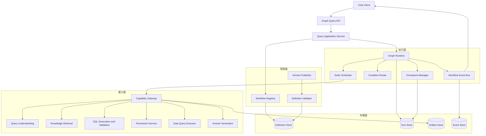
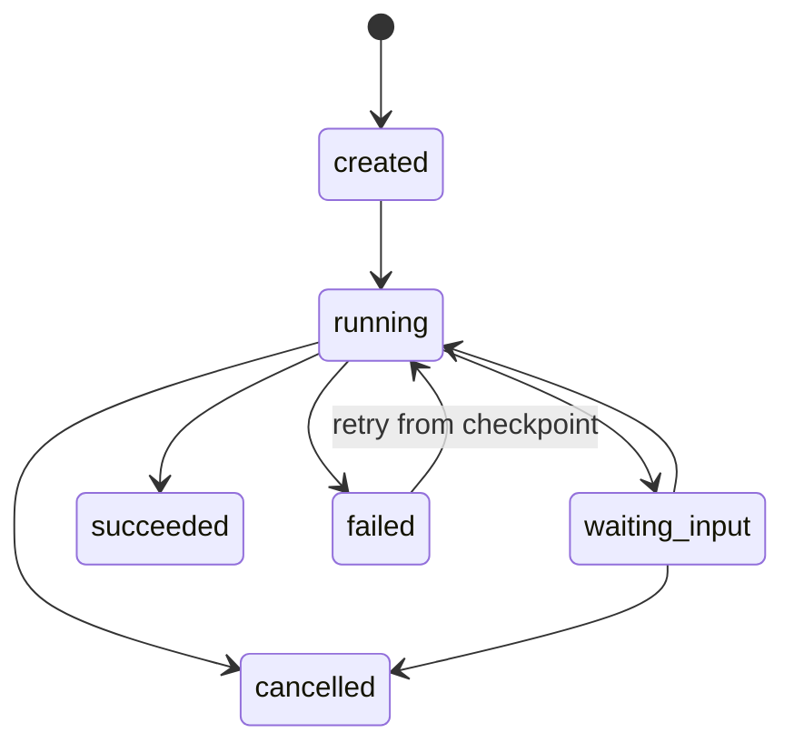
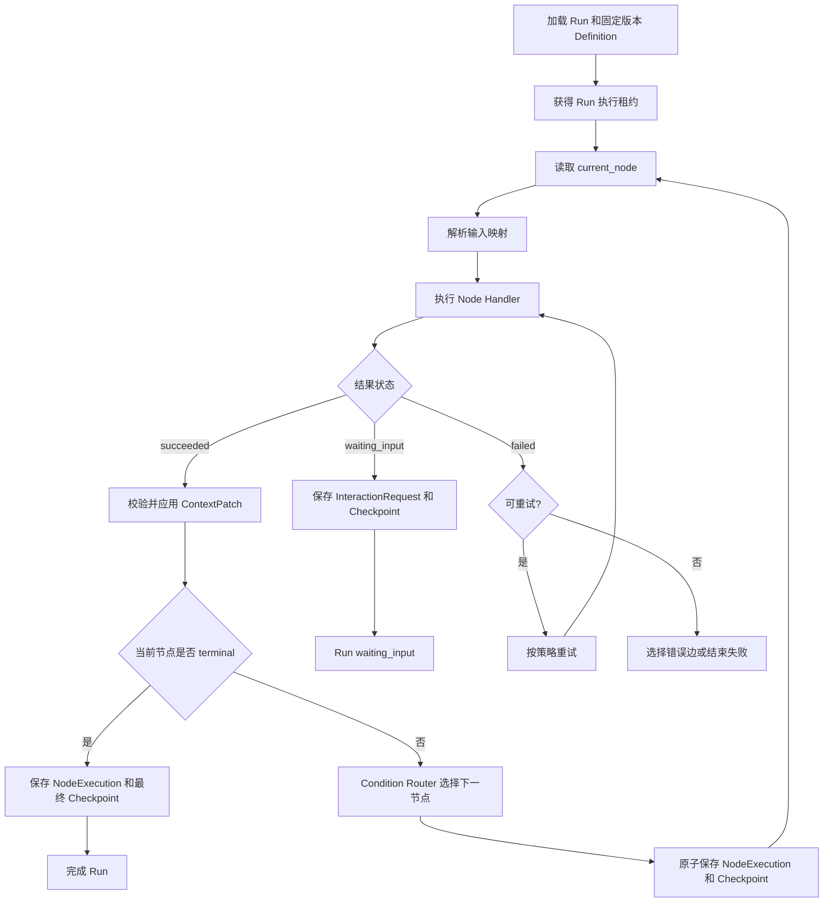
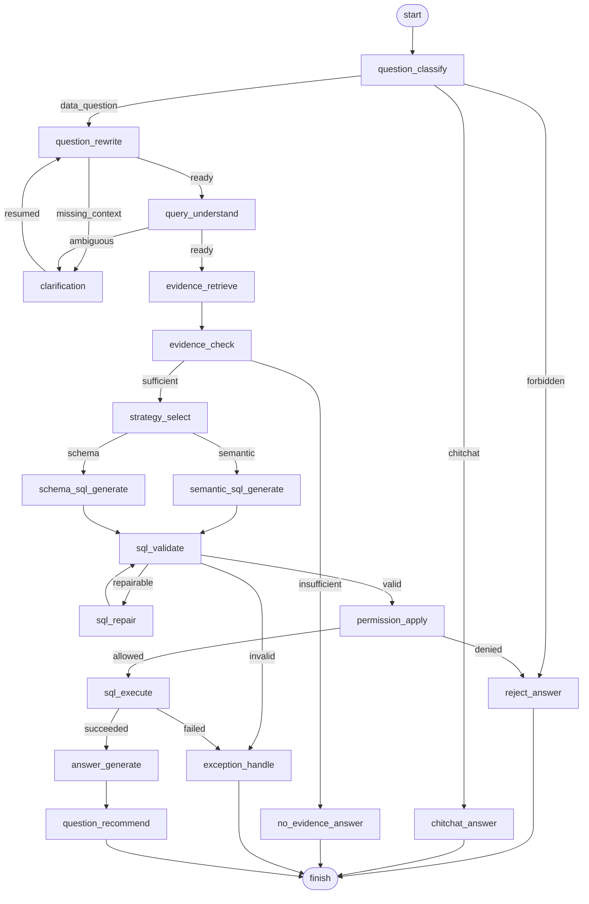
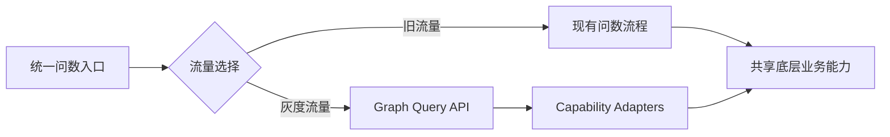

# SQLBot 基于图的问数流程目标架构设计

**状态：** 草案  
**创建日期：** 2026-06-17  
**修订日期：** 2026-06-18  
**适用范围：** SQLBot 下一代基于图的问数流程，覆盖流程定义、图运行时、节点协议、能力接入、状态持久化、人机交互、可观测性、安全治理和迁移策略。

## 1. 文档定位

本文描述 SQLBot 基于图的问数流程的**最终目标架构**，不以当前 Agentic 实现为基础，也不把当前实现中的 Orchestrator、Planner、Executor、State 或持久化模型作为设计约束。

现有 Agentic 方案尚处于演进阶段，将图运行时直接嵌入其中会产生错误耦合：

- 过渡实现的模块边界会固化为长期架构。
- 图的状态、执行记录和恢复语义会被现有数据模型限制。
- 新流程需要兼容尚未稳定的 Planner 和 Executor 行为。
- 后续替换 Agentic 方案时，Graph Runtime 也会被迫重构。

因此，本设计采用以下原则：

```text
Graph 是独立的目标架构。
Agentic 是现状，不是 Graph 的上层或底座。
二者只通过迁移适配器和共享基础能力发生关系。
```

## 2. 目标与非目标

### 2.1 设计目标

- 用显式有向图描述完整问数流程，替代分散的条件分支。
- 图定义与图执行分离，流程版本发布后不可变。
- 建立独立的 Workflow Run、Node Run、Checkpoint 和 Event 模型。
- 支持条件路由、暂停恢复、人工澄清、失败分支、重试和终止。
- 将 SQL、知识检索、权限、LLM 等能力通过稳定接口接入。
- 支持流程灰度、多版本并存、运行回放和问题定位。
- 保证节点输入输出结构化，路由结果可解释、可测试。
- 为未来子图、并行分支和可视化编辑预留边界，但不提前实现。

### 2.2 非目标

- 首期不建设通用低代码工作流平台。
- 首期不支持任意用户自定义代码节点。
- 首期不支持跨业务系统的定时任务编排。
- 首期不实现分布式并行调度。
- 首期不实现完整事件溯源重放引擎。
- 不要求现有 Agentic 接口和数据模型原地升级为 Graph 模型。

## 3. 参考项目与设计取舍

本方案参考成熟项目的核心思想，但不直接绑定其运行时。

| 项目 | 借鉴内容 | SQLBot 取舍 |
| --- | --- | --- |
| LangGraph | State、Node、条件边、Checkpoint、人机中断 | 借鉴状态图和暂停恢复，不强绑定框架 |
| Dify Workflow / Chatflow | 流程与会话区分、变量、节点运行状态 | 借鉴产品语义，首期不做编辑器 |
| n8n | 节点连接、执行历史、错误分支、等待节点 | 借鉴执行记录，不做通用自动化平台 |
| Airflow | Definition、Run、Task Instance 分层 | 借鉴定义与实例分离，不引入调度系统 |
| Temporal | Durable Execution、事件历史、幂等恢复 | 借鉴持久化执行语义，不实现完整 replay |

参考资料：

- [LangGraph Graph API](https://docs.langchain.com/oss/python/langgraph/graph-api)
- [LangGraph Persistence](https://docs.langchain.com/oss/python/langgraph/persistence)
- [Dify Workflow Key Concepts](https://docs.dify.ai/versions/3-0-x/en/user-guide/workflow/key-concepts)
- [n8n Workflows](https://docs.n8n.io/workflows/)
- [Airflow DAGs](https://airflow.apache.org/docs/apache-airflow/stable/core-concepts/dags.html)
- [Temporal Workflow Execution](https://docs.temporal.io/workflow-execution)

### 3.1 自研轻量运行时的理由

SQLBot 的图流程具有强领域约束：SQL 必须校验和鉴权、状态包含语义证据和查询产物、执行结果需要落入问答记录、人机澄清需要恢复同一会话。直接采用通用引擎会引入额外部署、数据模型和调试成本。

首期推荐实现内部轻量运行时，同时保持节点协议和持久化模型与框架无关。当未来出现分布式执行、长事务或复杂并行需求时，可以替换 Runtime 实现，而不修改业务节点和流程定义。

## 4. 架构原则

### 4.1 独立领域边界

Graph 模块使用独立命名和独立模型：

```text
WorkflowDefinition
WorkflowRun
NodeExecution
WorkflowCheckpoint
WorkflowEvent
WorkflowContext
```

目标架构中不出现 `AgenticState`、`AgenticRun`、`AgenticOrchestrator` 等依赖。

### 4.2 定义与运行分离

- `WorkflowDefinition` 是静态、可校验、版本化的流程描述。
- `WorkflowRun` 是一次请求对应的运行实例。
- 已发布定义不可原地修改，新变更生成新版本。
- Run 始终记录启动时使用的 definition name、version 和 digest。

### 4.3 编排与能力分离

```text
Graph 决定何时执行、下一步去哪里。
Node 决定如何调用一项业务能力。
Capability 决定具体业务动作如何完成。
```

图运行时不能直接包含 SQL 生成、知识检索或 LLM Prompt 逻辑。业务能力也不能直接修改 Run 状态或指定全局下一节点。

### 4.4 状态与产物分离

- `WorkflowContext` 保存可恢复的轻量状态和引用。
- SQL、检索证据、查询结果等较大对象存入 Artifact Store。
- Context 只保存 artifact id、摘要和必要元数据。
- 节点通过 Patch 更新 Context，避免共享对象原地修改。

### 4.5 确定性控制流

- 路由条件只读取结构化状态和当前节点结果。
- LLM 可以输出结构化判断结果，但不能直接控制跳转。
- Runtime 通过注册过的 Condition Evaluator 选择边。
- 每次路由记录命中条件和原因。

## 5. 总体架构

### 5.1 分层结构



### 5.2 组件职责

| 组件 | 职责 | 不负责 |
| --- | --- | --- |
| Graph Query API | 接收问题、查询状态、恢复交互、输出事件 | 业务路由和节点执行 |
| Query Application Service | 创建 Run、组装初始上下文、协调事务 | 判断下一节点 |
| Workflow Registry | 按名称和版本加载已发布流程 | 执行流程 |
| Definition Validator | 校验节点、边、条件、循环和能力引用 | 运行期业务校验 |
| Graph Runtime | 驱动 Run 生命周期和节点循环 | 实现具体业务能力 |
| Node Scheduler | 执行当前可运行节点 | 选择业务分支 |
| Condition Router | 根据条件边计算下一节点 | 调用 LLM 或外部系统 |
| Checkpoint Manager | 原子保存 Context 和游标 | 保存大结果集 |
| Capability Gateway | 提供受控、统一的能力调用协议 | 决定流程走向 |
| Artifact Store | 保存证据、SQL、查询结果等大对象 | 保存控制流状态 |
| Workflow Event Bus | 生成可持久化、可推送的运行事件 | 作为唯一事实状态 |

## 6. 核心领域模型

### 6.1 WorkflowDefinition

```python
class WorkflowDefinition(BaseModel):
    name: str
    version: str
    start_node: str
    nodes: dict[str, NodeDefinition]
    edges: list[EdgeDefinition]
    input_schema: dict[str, Any]
    output_schema: dict[str, Any]
    policies: WorkflowPolicies
    metadata: dict[str, Any] = Field(default_factory=dict)
```

发布前必须校验：

- `start_node` 存在。
- 节点名称唯一。
- 边引用的节点存在。
- 每个非终止节点至少有一个出口。
- 同一节点最多有一条默认边。
- 条件、节点处理器和能力名称均已注册。
- 不允许不可达节点。
- 有环流程必须配置循环上限。
- 输入输出映射符合对应 Schema。

### 6.2 NodeDefinition

```python
class NodeDefinition(BaseModel):
    name: str
    type: Literal[
        "capability",
        "decision",
        "interaction",
        "transform",
        "terminal",
        "subgraph",
    ]
    handler: str
    input_mapping: dict[str, str] = Field(default_factory=dict)
    output_mapping: dict[str, str] = Field(default_factory=dict)
    retry_policy: RetryPolicy | None = None
    timeout_ms: int | None = None
    metadata: dict[str, Any] = Field(default_factory=dict)
```

| 节点类型 | 用途 | 副作用要求 |
| --- | --- | --- |
| `capability` | 调用检索、SQL、权限、LLM 等能力 | 必须声明幂等键 |
| `decision` | 生成结构化决策数据 | 不直接跳转 |
| `interaction` | 暂停并等待用户输入 | 创建 Interaction Request |
| `transform` | 确定性状态转换 | 无外部副作用 |
| `terminal` | 结束 Run 并生成输出 | 不再产生后继节点 |
| `subgraph` | 调用独立版本化子图 | 首期预留 |

### 6.3 EdgeDefinition

```python
class EdgeDefinition(BaseModel):
    source: str
    target: str
    condition: str | None = None
    priority: int = 100
    label: str | None = None
```

路由规则：

- 条件边按 `priority` 从小到大求值。
- 第一条命中的边生效。
- `condition=None` 表示默认边，始终最后求值。
- 多条条件同时可能命中不视为错误，但必须通过优先级消除歧义。
- 无边命中时产生 `ROUTE_NOT_FOUND`，进入流程失败处理。

### 6.4 WorkflowContext

Context 分为四个命名空间，避免所有字段堆在一个扁平对象中：

```python
class WorkflowContext(BaseModel):
    request: dict[str, Any]
    conversation: dict[str, Any]
    variables: dict[str, Any]
    artifacts: dict[str, ArtifactRef]
    control: ControlContext
```

| 命名空间 | 内容 |
| --- | --- |
| `request` | 原始问题、数据源、用户、Assistant 等不可变输入 |
| `conversation` | 对话历史、澄清答案和会话摘要 |
| `variables` | 节点产生的结构化业务变量 |
| `artifacts` | Schema 证据、SQL、执行结果等对象引用 |
| `control` | 当前节点、步数、暂停点、循环计数等运行字段 |

节点不能直接修改 Context，只返回 `ContextPatch`：

```python
class ContextPatch(BaseModel):
    set_values: dict[str, Any] = Field(default_factory=dict)
    append_values: dict[str, list[Any]] = Field(default_factory=dict)
    remove_paths: list[str] = Field(default_factory=list)
    artifact_updates: dict[str, ArtifactRef] = Field(default_factory=dict)
```

Runtime 在 Schema 校验通过后原子应用 Patch。

### 6.5 运行模型

| 模型 | 说明 |
| --- | --- |
| `WorkflowRun` | 一次图执行实例，记录定义版本、状态、当前节点和版本号 |
| `NodeExecution` | 某节点的一次执行尝试，包含输入摘要、输出摘要、耗时和错误 |
| `WorkflowCheckpoint` | 节点边界处的 Context 快照和执行游标 |
| `WorkflowEvent` | 面向审计、前端和诊断的追加事件 |
| `InteractionRequest` | 等待用户输入的暂停请求 |
| `WorkflowArtifact` | 大对象、敏感对象或可复用中间产物 |

`WorkflowRun.status` 状态机：



## 7. 节点执行协议

### 7.1 标准输入输出

```python
class NodeExecutionRequest(BaseModel):
    run_id: str
    node_name: str
    attempt: int
    idempotency_key: str
    inputs: dict[str, Any]
    context_view: dict[str, Any]


class NodeExecutionResult(BaseModel):
    status: Literal["succeeded", "failed", "waiting_input"]
    patch: ContextPatch = Field(default_factory=ContextPatch)
    artifacts: list[ArtifactWrite] = Field(default_factory=list)
    interaction: InteractionSpec | None = None
    error: NodeError | None = None
    metrics: dict[str, float] = Field(default_factory=dict)
```

### 7.2 处理器注册

节点定义只能引用已注册处理器：

```text
NodeHandlerRegistry
  query.classify
  query.rewrite
  query.understand
  evidence.retrieve
  strategy.select
  sql.generate
  sql.validate
  permission.apply
  sql.execute
  answer.generate
  interaction.clarify
  workflow.finish
```

处理器负责将通用节点协议适配到 Capability Gateway，不感知数据库表和 HTTP 请求。

### 7.3 幂等与副作用

- 每次节点尝试生成稳定的 `idempotency_key`。
- SQL 查询、记录写入和外部调用必须支持幂等或结果去重。
- Checkpoint 成功前不推进当前节点。
- Checkpoint 成功但事件推送失败时允许重新投递事件。
- 节点超时不代表外部动作一定失败，重试前必须检查幂等结果。

## 8. 图执行模型

### 8.1 单节点执行循环

首期每个 Run 同一时刻只允许一个活跃节点。



### 8.2 Runtime 伪代码

```python
class GraphRuntime:
    def execute(self, run_id: str) -> RunOutcome:
        with self.run_lease.acquire(run_id):
            run = self.run_store.load(run_id)
            definition = self.registry.get(run.definition_name, run.definition_version)

            while run.status == "running":
                self.guard_execution_budget(run, definition.policies)
                node = definition.nodes[run.current_node]
                result = self.scheduler.execute(run, node)

                if result.status == "waiting_input":
                    return self.checkpoints.pause(run, node, result)

                if result.status == "failed":
                    run = self.handle_failure(run, definition, node, result)
                    continue

                context = self.context_patcher.apply(run.context, result.patch)

                if node.type == "terminal":
                    return self.checkpoints.complete(run, node, context, result)

                next_node = self.router.select(definition, node, context, result)
                run = self.checkpoints.advance(run, node, next_node, context, result)

            return RunOutcome.from_run(run)
```

### 8.3 并发控制

- `WorkflowRun` 使用乐观锁版本号防止重复推进。
- Runtime 执行前获取有过期时间的 Run Lease。
- 同一 `InteractionRequest` 只接受一次有效回复。
- 客户端重复提交通过 request id 去重。
- 恢复、取消和后台执行竞争时，以 Run 状态机校验为准。

## 9. 条件路由

### 9.1 Condition Registry

条件通过代码注册，流程定义只引用名称：

```python
class ConditionEvaluator(Protocol):
    name: str

    def evaluate(
        self,
        context: WorkflowContext,
        result: NodeExecutionResult,
    ) -> ConditionDecision: ...
```

```python
class ConditionDecision(BaseModel):
    matched: bool
    reason_code: str
    reason_summary: str
```

### 9.2 路由约束

- Condition 必须无副作用。
- Condition 不调用 LLM、数据库或远程服务。
- 路由依赖的数据必须由前置节点写入 Context。
- `reason_summary` 不保存思维链，只保存业务可解释原因。
- 每次路由生成 `node.routed` 事件。

## 10. Capability Gateway

### 10.1 设计目的

Capability Gateway 是图架构与 SQLBot 业务能力之间的防腐层。Graph Runtime 只依赖稳定协议，不依赖现有服务类、工具注册表或存储实现。

```python
class CapabilityGateway(Protocol):
    def invoke(
        self,
        capability: str,
        request: CapabilityRequest,
    ) -> CapabilityResult: ...
```

### 10.2 能力分类

| 类别 | 能力示例 |
| --- | --- |
| 问题处理 | 分类、重写、意图识别、槽位抽取 |
| 知识与证据 | Schema 检索、术语检索、指标检索、SQL 样例检索 |
| SQL | 策略选择、SQL 生成、语法校验、语义校验、修复 |
| 安全 | 数据权限、行列权限、查询限制、敏感字段处理 |
| 执行 | SQL 执行、结果采样、结果存储 |
| 回答 | 答案生成、图表建议、追问推荐 |

### 10.3 能力治理

- 仅注册能力可被节点调用。
- 每项能力定义输入 Schema、输出 Schema、超时和数据等级。
- 能力调用统一注入 tenant、user、datasource 和 trace context。
- 敏感信息不得进入 Prompt、事件或普通日志。
- 能力返回稳定错误码，不向 Runtime 暴露底层异常细节。

## 11. ChatBI 默认流程

### 11.1 业务图



### 11.2 流程说明

1. 分类节点先判断问题是否属于数据问答、闲聊或禁止处理范围。
2. 重写和理解节点将上下文补全与业务语义解析分开。
3. 缺失信息或歧义通过统一交互节点暂停，不在业务节点内等待。
4. 证据检索与证据充分性判断分离，便于独立测试和替换策略。
5. SQL 策略选择输出结构化结果，再由条件边分流。
6. SQL 必须经过校验、权限处理后才能执行。
7. 可修复 SQL 进入有限次数修复环，其他异常进入统一错误处理。
8. 最终答案和推荐问题是独立节点，任一非核心节点失败可以按策略降级。

## 12. 人机交互与恢复

### 12.1 暂停

交互节点返回 `waiting_input` 后，Runtime 在同一事务中：

1. 创建 `InteractionRequest`。
2. 保存包含 return node 的 Checkpoint。
3. 将 Run 状态改为 `waiting_input`。
4. 追加 `run.waiting_input` 事件。
5. 释放 Run Lease。

### 12.2 恢复

```text
POST /api/graph/runs/{run_id}/interactions/{interaction_id}/responses
```

恢复流程：

1. 校验用户、租户、Run 和 Interaction 状态。
2. 按 Interaction Schema 校验输入。
3. 原子标记 Interaction 已回答。
4. 将答案写入 `conversation` 或允许的 `variables` 路径。
5. 从 Checkpoint 指定位置恢复，Run 重新进入 `running`。

恢复操作不能接受客户端指定的任意下一节点。

## 13. 持久化设计

### 13.1 建议表

```text
workflow_definition
workflow_run
node_execution
workflow_checkpoint
workflow_event
interaction_request
workflow_artifact
```

### 13.2 一致性边界

节点推进事务至少包含：

```text
完成 NodeExecution
保存 WorkflowCheckpoint
更新 WorkflowRun.current_node / status / version
写入 WorkflowEvent Outbox
```

Artifact 可在事务前写入临时状态，Checkpoint 提交后转为已引用状态。定时任务清理未被 Checkpoint 引用的临时 Artifact。

### 13.3 Checkpoint 策略

- 每个节点成功后创建 Checkpoint。
- 进入等待输入前必须创建 Checkpoint。
- 失败节点保留最近成功 Checkpoint 和失败执行记录。
- Checkpoint 默认保留轻量 Context，不复制大 Artifact。
- 恢复时校验 definition digest，禁止用新定义解释旧 Run。

## 14. API 与事件

### 14.1 API 边界

建议提供独立 Graph API，不复用现有 Agentic 路由语义：

```text
POST /api/graph/queries
GET  /api/graph/runs/{run_id}
GET  /api/graph/runs/{run_id}/events
POST /api/graph/runs/{run_id}/interactions/{interaction_id}/responses
POST /api/graph/runs/{run_id}/cancel
POST /api/graph/runs/{run_id}/retry
```

对外响应可以继续关联统一 ChatRecord，但 ChatRecord 不是 Graph Runtime 的状态存储。

### 14.2 标准事件

```text
run.created
run.started
node.started
capability.started
capability.finished
node.succeeded
node.failed
node.routed
run.waiting_input
run.resumed
run.succeeded
run.failed
run.cancelled
```

事件包含：

```text
event_id
run_id
sequence
definition_name
definition_version
node_name
node_execution_id
timestamp
public_payload
internal_payload_ref
```

SSE/WebSocket 只负责投递公开事件。客户端断线后通过 sequence 续传，不依赖内存队列恢复历史。

## 15. 异常处理

### 15.1 错误分类

| 类型 | 示例 | 处理方式 |
| --- | --- | --- |
| 业务拒绝 | 权限不足、问题越界 | 路由至拒绝回答节点 |
| 信息不足 | 缺少时间、指标歧义 | 路由至交互节点 |
| 可重试错误 | 临时网络失败、限流 | 按节点策略重试 |
| 可修复错误 | SQL 校验失败 | 进入有限修复环 |
| 不可恢复错误 | 定义错误、状态损坏 | Run 标记失败并告警 |
| 系统错误 | 存储不可用、未捕获异常 | 保留 Checkpoint，Run 失败或等待恢复 |

### 15.2 执行保护

- `max_nodes_per_run` 防止无限执行。
- `max_loop_iterations` 限制每个环。
- 节点超时和 Run 总时长分别限制。
- 重试采用退避策略并限制总次数。
- 错误边不能绕过 SQL 安全节点。
- 终止节点必须产生稳定的外部结果或错误码。

## 16. 安全设计

- 流程定义只能引用注册处理器、条件和能力。
- 定义发布需要校验和权限控制，运行期只读取已发布版本。
- SQL 执行前强制经过校验、权限和资源限制节点。
- 用户身份、租户和数据源上下文由服务端注入，不接受图节点覆盖。
- Interaction Response 只能更新白名单路径。
- Context、Event 和日志按字段级策略脱敏。
- Artifact 使用租户隔离和访问控制。
- Prompt 与模型输出不作为可信控制指令。
- Run、节点、能力调用和人工输入均保留审计记录。

## 17. 可观测性

### 17.1 Trace

每次 Run 形成完整节点路径：

```text
节点名称
执行尝试
开始和结束时间
输入输出摘要
能力调用摘要
状态 Patch 摘要
路由条件和原因
Artifact 引用
错误码
Token、耗时和查询成本
```

### 17.2 指标

核心指标：

- Run 成功率、失败率、取消率。
- 各节点耗时和错误率。
- 澄清触发率与恢复率。
- SQL 生成、修复和执行成功率。
- 流程版本之间的成功率和耗时对比。
- 单次 Run 的 LLM Token、查询时长和结果规模。
- 卡在 `running` 或 `waiting_input` 的异常 Run 数量。

## 18. 测试策略

### 18.1 定义测试

- 起点、终点、不可达节点和非法边。
- 默认边唯一性和条件优先级。
- 循环上限和执行预算。
- 节点处理器、条件和能力引用。
- 输入输出映射及 Schema 兼容性。

### 18.2 Runtime 单元测试

- 正常执行到终止节点。
- 条件分支和默认边。
- Patch 原子应用和非法 Patch 拒绝。
- 节点失败、重试、错误边和失败终止。
- 暂停、恢复、重复恢复和取消竞争。
- Checkpoint 恢复和 definition digest 校验。
- 幂等执行、乐观锁冲突和 Lease 过期。
- 节点预算和循环预算耗尽。

### 18.3 业务流程测试

- 普通数据问题完整闭环。
- 闲聊与禁止问题直接结束。
- 缺少信息进入澄清并恢复。
- 指标歧义经用户确认后继续。
- 证据不足输出可解释结果。
- 两种 SQL 生成策略正确分流。
- SQL 修复达到上限后终止。
- 权限拒绝时永不执行 SQL。
- SQL 执行失败进入错误处理。
- 推荐节点失败时主答案仍成功。

### 18.4 契约测试

- Node Handler 与 Capability Gateway 契约。
- Capability Adapter 与现有底层服务契约。
- Graph API 与前端事件消费契约。
- Artifact 序列化、权限和生命周期契约。

## 19. 推荐代码结构

目标架构使用独立应用边界，不放入现有 `agentic_chat` 包：

```text
backend/apps/workflow_engine/
  domain/
    definition.py
    run.py
    execution.py
    checkpoint.py
    event.py
    interaction.py
    artifact.py
  runtime/
    graph_runtime.py
    scheduler.py
    router.py
    context_patcher.py
    lease.py
  registry/
    workflow_registry.py
    handler_registry.py
    condition_registry.py
    definition_validator.py
  ports/
    run_store.py
    artifact_store.py
    event_publisher.py
    capability_gateway.py
  infrastructure/
    persistence/
    events/
  api/
    router.py
    schemas.py
  tests/

backend/apps/workflow/
  definitions/
    chatbi_v1.py
  nodes/
    question.py
    evidence.py
    sql.py
    permission.py
    execution.py
    answer.py
    interaction.py
  conditions/
    question.py
    evidence.py
    sql.py
  capabilities/
    gateway.py
    adapters/
  tests/
```

边界说明：

- `workflow_engine` 是领域无关的轻量图运行时。
- `workflow` 定义问数流程、业务节点和条件。
- SQLBot 现有服务通过 `capabilities/adapters` 接入，不被 Runtime 直接依赖。
- 未来其他流程可以复用 Engine，但不能绕过 Registry 和安全策略。

## 20. 分阶段实施

### P0：架构验证

- 固化 Node、Context、Patch、Condition 和 Run 协议。
- 实现内存版 Registry、Store 和最小 Runtime。
- 用纯测试能力跑通分支、暂停、恢复、失败和 Checkpoint。
- 不接入现有线上请求。

### P1：独立最小闭环

- 建立独立持久化表和 Graph API。
- 接入问题理解、Schema 检索、SQL 生成、校验、权限、执行和回答能力。
- 完成最小 ChatBI 图，不包含推荐和 SQL 自动修复。
- 通过白名单租户或内部入口验证。

### P2：完整业务图

- 增加问题分类、问题重写、证据充分性、歧义澄清、SQL 修复和问题推荐。
- 完成公开事件、前端节点路径和运行诊断。
- 建立流程版本指标和质量评估集。

### P3：灰度切换

- 在统一入口增加流程选择层，按租户或 Assistant 灰度。
- Graph 与现有流程并行运行，结果与指标独立记录。
- 达到质量门槛后逐步扩大流量。
- 迁移期间不共享运行状态，也不在两种运行时之间中途切换。

### P4：收敛与演进

- Graph 成为默认问数流程后，停止旧流程新增能力。
- 清理只服务于旧编排的模块和数据模型。
- 根据真实需求评估子图、并行节点、分布式 Worker 和可视化编辑器。

## 21. 与现有 Agentic 方案的关系

### 21.1 明确不继承的内容

- 不继承现有 Planner 的状态判断和动作协议。
- 不继承现有 Executor 的执行循环。
- 不复用 Agentic State 作为 Workflow Context。
- 不复用 Agentic Run、Step、Trace 表作为 Graph 运行模型。
- 不要求 Graph API 兼容 Agentic API 的内部语义。
- 不把现有 Agentic 包作为 Graph Engine 的依赖。

### 21.2 可以通过适配器复用的能力

以下能力如果接口和质量满足要求，可以作为 Capability Adapter 的临时或长期实现：

- 数据源与 Schema 读取。
- 语义模型、术语和 SQL 示例检索。
- LLM Provider 和 Prompt 基础设施。
- SQL 生成、校验、权限与执行服务。
- ChatRecord、用户、租户和数据源基础服务。
- 日志、监控和 SSE 基础设施。

复用标准是“符合 Capability 契约”，而不是“来自现有 Agentic 模块”。

### 21.3 迁移方式



迁移约束：

- 两套流程拥有独立 Run 和 Trace。
- 单个请求一旦选定流程，执行期间不得切换。
- 不以“让 Graph 行为完全复制当前 Agentic”为验收目标。
- 使用统一业务评估集比较正确率、成功率、耗时和成本。
- 当前实现中尚未完成的占位能力不直接迁入新架构。

## 22. 架构决策记录

| 决策 | 结论 |
| --- | --- |
| Graph 与 Agentic 的关系 | Graph 是独立目标架构，Agentic 仅作为迁移现状 |
| 是否直接采用 LangGraph | 首期不强绑定，采用可替换的内部轻量 Runtime |
| 定义方式 | 首期使用 Python 构建并发布不可变定义 |
| 状态模型 | 独立 WorkflowContext，状态与 Artifact 分离 |
| 持久化模型 | 独立 Run、NodeExecution、Checkpoint、Event、Interaction |
| 执行模式 | 首期单 Run 单活跃节点 |
| 路由方式 | 注册条件函数，基于结构化状态确定性路由 |
| 业务能力接入 | 通过 Capability Gateway 和 Adapter |
| 人机交互 | Checkpoint 暂停与显式恢复 |
| 上线方式 | 新旧并行、独立记录、灰度切流 |

## 23. 结论

SQLBot 的基于图问数流程应作为独立的下一代架构建设，而不是现有 Agentic 方案的插件或内部升级。

最终边界为：

```text
WorkflowDefinition 描述不可变流程
GraphRuntime 驱动持久化执行
NodeHandler 实现节点协议
ConditionRouter 负责确定性跳转
CapabilityGateway 隔离业务能力
WorkflowContext 保存轻量状态
ArtifactStore 保存大型业务产物
Checkpoint 支撑暂停、恢复与故障处理
WorkflowEvent 支撑审计、前端和可观测性
```

现有 Agentic 方案只承担迁移期的现状角色。新架构是否成功，应由问数质量、可维护性、可恢复性、可观测性和演进成本衡量，而不是由其对现有 Agentic 内部实现的兼容程度衡量。
