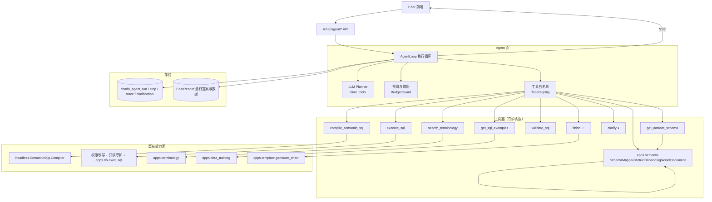
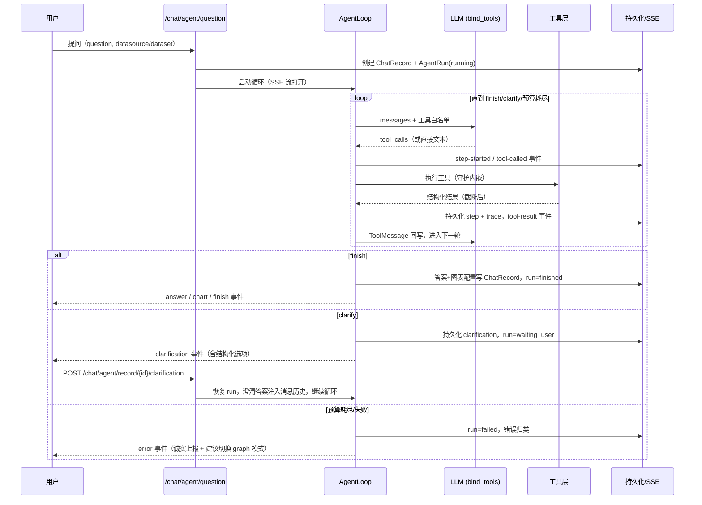
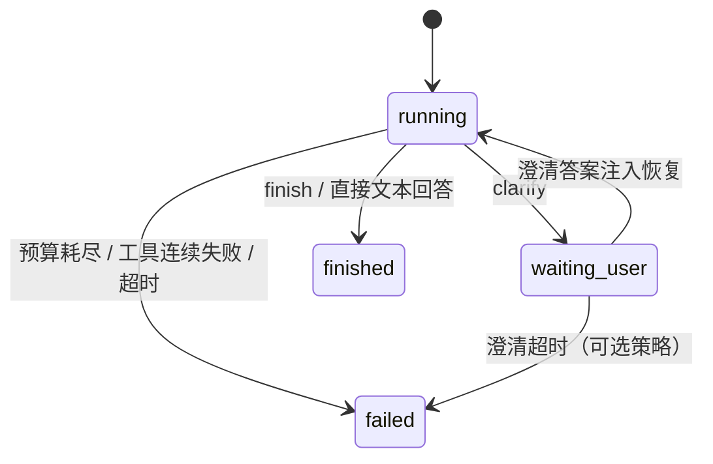

# Agentic ChatBI 问数流程技术设计

**关联背景：** [ChatBI背景与挑战.md](./ChatBI背景与挑战.md)  
**关联技术设计：** [03-independent-agentic-chatbi-flow-tech-design.md](./03-independent-agentic-chatbi-flow-tech-design.md)（Agentic v1，规则 Planner）、[08-graph-workflow-runtime-tech-design.md](./08-graph-workflow-runtime-tech-design.md)（Graph 主线）  
**参考资料：** [youtu-rag-agentic-rag-analysis.md](../youtu-rag-agentic-rag-analysis.md)、[supersonic-headless-semantic-layer-analysis.md](../supersonic-headless-semantic-layer-analysis.md)、[agentic-rag-multi-strategy-chatbi.md](../agentic-rag-multi-strategy-chatbi.md)  
**状态：** 草案  
**创建日期：** 2026-07-10  
**适用范围：** SQLBot Agentic ChatBI 实验模式：LLM 自主规划 + 受控工具循环的问数链路，覆盖范式选型、框架选型、工具层、控制安全、会话持久化、API、评估与分期。

## 1. 背景与目标

### 1.1 三条链路的现状

SQLBot 问数目前存在三条链路：

| 链路 | 入口 | 编排方式 | 状态 |
| --- | --- | --- | --- |
| Legacy | `POST /chat/question` | `LLMService.run_task` 线性流水线 | 维护态 |
| Agentic v1 | `POST /chat/agentic/question` | **规则** Planner-Executor 状态机（`apps/agentic_chat`） | 早期探索，冻结 |
| Graph 主线 | `POST /graph/queries` | 自研图运行时 + `chatbi v1` 业务图（`apps/workflow_engine` + `apps/workflow`） | 当前主线 |

Graph 主线用显式有向图把问数流程工程化：22 个节点、条件路由、澄清交互节点、SQL 纠错回路、checkpoint 与事件回放。它的优势是**确定性、可治理、可观测**；代价是**流程刚性**——每新增一种问数形态（多指标对比、归因下钻、跨数据集拼接、先探查再决策的开放分析），都要改图定义、加节点、加路由条件。

Agentic v1 虽名为 agentic，但 Planner 是确定性规则（`RuleBasedPlanner`），LLM 从未获得工具调用自主权。它验证了受控工具层、run 持久化、澄清暂停恢复等工程骨架，但没有回答本设计要探索的核心问题。

### 1.2 本设计要探索的问题

**当 LLM 拥有规划权（自主决定下一步调用什么工具、何时澄清、何时结束）时，问数的上限与下限各在哪里？**

- 上限假设：对图流程覆盖不了的长尾问法（模糊探索、多步推理、需要先看数据再决定下一步的问题），agentic 模式能靠模型的规划能力自适应完成。
- 下限风险：确定性下降、步数与 token 成本上升、错误路径更难预测。

因此本设计的定位是**与 graph 主线并行的实验模式**：独立入口、独立持久化、共享底层能力资产（headless 语义层、权限、SQL 执行、图表模板），通过同一评测集对照评估，用数据回答"agentic 路线值不值得投入"。

### 1.3 设计目标

- 建立一条 LLM 自主规划的问数链路：LLM 通过 tool-calling 决定每一步动作，系统通过受控工具层与预算护栏约束行为边界。
- 工具全部映射到现有领域能力（headless 语义层、SQL 校验/权限/执行、术语、SQL 示例），不重写业务逻辑。
- 澄清（clarify）与完成（finish）是一等终止动作，支持暂停恢复与跨轮澄清。
- 每一步持久化 + SSE 推送，可观测性不低于 graph 主线。
- 与 graph v1 在同一评测集上可对照评估。

### 1.4 非目标

- 不改造 graph 主线，不做 graph 与 agentic 的运行时混合。
- 首期不做多 Agent 协作拓扑（planner/writer/validator 分体），列为 P2。
- 不允许 LLM 执行任意 SQL 或任意代码；Python 分析沙箱列为 P2。
- 不做前端大改版，SSE 事件契约对齐 v1 已有消费习惯。

## 2. 业界参考

### 2.1 参考对象与借鉴点

| 方案 | 架构形态 | 关键借鉴 | 不采纳的部分 |
| --- | --- | --- | --- |
| **youtu-rag 智能问数 2.0**（腾讯优图，本地代码级分析，见 2.2） | 单步规划循环 + Worker 子代理 + Reporter | 单步重规划、澄清一等动作、跨轮澄清判别、重复任务熔断 | 自建会话内存存储（SQLBot 已有 ChatRecord 体系）；openai-agents SDK 依赖 |
| **SuperSonic**（腾讯，`extra/supersonic`，已有分析文档） | Semantic 语义层 + Chat 双层；Schema Mapper → 规则/LLM 解析 → S2SQL → 真实 SQL | 语义层作为问数的唯一事实源；结构化澄清选项；S2SQL 中间表示 | Java 技术栈；其 Agent 编排较薄 |
| **WrenAI** | 语义层（MDL）接地的多 pipeline 代理；检索→SQL 生成→校验修正循环 | MDL 语义接地 = SQL 生成的上下文来源；生成后强制 dry-run 校验 | 独立引擎部署形态 |
| **DB-GPT** | AWEL 编排 + 多 Agent（Data Scientist 等角色） | 多 Agent 角色划分可作 P2 参考 | 平台化过重，不适合嵌入 |
| **Vanna** | RAG（DDL/文档/SQL 问答对三类训练数据）+ 生成-执行-修正 | SQL 示例召回作为 few-shot（对应 `apps.data_training`） | 无语义层概念，直连 schema |
| **Databricks Genie / Snowflake Cortex Analyst**（商业） | 语义模型强接地 + 受控工具 + 澄清优先；对不确定问题宁可拒答/澄清 | 生产可靠性优先级：接地 > 澄清 > 自由生成；语义模型即护栏 | 闭源，仅借鉴产品行为 |
| **Spider 2.0 / BIRD 基准结论** | — | 企业级问数中 agentic 多步方法显著优于单次生成，但步数与成本需预算控制；错误主要来自 schema 误解与口径歧义——印证语义层接地与澄清的价值 | — |

综合业界共识，可靠的 Agentic ChatBI 有四条不变式，本设计全部采纳：

1. **语义层接地**：模型只能基于语义层给出的指标/维度/表证据行动，不允许凭空编造口径。
2. **工具白名单 + 守护内嵌**：只读、权限、限行数等约束在工具内部强制执行，不依赖 prompt。
3. **澄清优先于猜测**：影响 SQL 正确性的歧义必须问用户，且给结构化选项。
4. **预算与熔断**：步数、重试、澄清轮次、超时都有硬上限，失败诚实上报。

### 2.2 youtu-rag 智能问数 2.0 详解（主要参考）

代码位置：`utu/rag/rag_agents/chatbi_react_agent.py`、`chatbi_plan.py`、`chatbi_workers.py`、`chatbi_context.py`，Planner prompt 在 `utu/prompts/ragref/chatbi/planner.yaml`。

执行范式为**单步规划循环**（iterative single-step planning）：

```text
for turn in range(max_turns=6):
    plan = LLM Planner(question, conversation_history, previous_trajectory, pending_clarification_context)
    plan ∈ {
      KBSearchAgent(task),      # 缺业务语义 → 知识库检索，返回结构化"语义包"
      Text2sqlAgent(task),      # 语义充分 → schema link + 生成 SQL + 带工具自纠错执行
      NEED_CLARIFY(question),   # 关键歧义 → 返回澄清问题并挂起
      COMPLETED,                # 已有真实 SQL 结果 → Reporter 汇总答案
    }
```

值得借鉴的设计细节：

- **每轮只产出一个任务**（`<plan>` 数组最多一个元素），强制小步快走，每步之后基于最新轨迹重新决策——这是 Plan-and-Execute 与 ReAct 的工程化折中。
- **澄清是规划器的输出选项**而不是异常分支；澄清后的会话轮里，Planner 用显式 prompt 规则判别"新问题 vs 澄清回复"（最近一条 assistant 是否为澄清、当前输入是否只是补充口径、是否足以构成独立新问题），并用 `uses_pending_clarification_context` 决定是否复用挂起的语义包，避免重复检索。
- **护栏**：连续 3 次重复任务熔断（`RepeatedTaskError`）；"不得把知识库示例当成真实查询结果"写入规划器约束；Text2SQL 任务必须携带已确认的 scene、指标 Key、维度 Key、候选表。
- **Worker 是子代理**：Text2SQL 内部自带 `execute_sql` 工具循环做执行错误自纠错，主规划器不感知 SQL 细节。

与 SQLBot 的差异：youtu-rag 的知识库是向量化的表 schema 文档，SQLBot 有更强的结构化语义层（headless 指标/维度/SemanticSQLCompiler），因此 SQLBot 的工具可以更"厚"——语义检索返回结构化资产而非文本片段，SQL 可优先走语义编译而非自由生成。

## 3. Agent 范式选择

### 3.1 候选与结论

| 候选范式 | 说明 | 评估 |
| --- | --- | --- |
| A. 单 Agent 受控工具循环（**采纳**） | 一个 LLM 通过 tool-calling 自主选择粗粒度领域工具，`clarify`/`finish` 为终止动作 | 探索成本最小；工具厚、循环薄；与 v1/graph 对照清晰 |
| B. 单步规划循环 + Worker 子代理（youtu 形态） | 规划器输出任务，Worker 内部再起子代理 | 两层 LLM 循环，成本与延迟翻倍；SQLBot 的 Worker 能力（语义检索、SQL 编译）本身是确定性的，不需要子代理 |
| C. 多 Agent 协作（planner/SQL writer/validator/analyst） | 角色分体、消息协作 | 复杂度最高，收益未证实；列为 P2 演进项 |

采纳 A 的核心理由：**SQLBot 的确定性资产决定了"厚工具、薄循环"是最优结构**。语义检索（SemanticSchemaMapper + metric embedding）、语义 SQL 编译（SemanticSQLCompiler）、校验、权限、执行都是高可靠的确定性能力，把它们封装成工具后，LLM 需要做的只是"选择下一步 + 组织查询计划 + 判断歧义"——一个模型循环足够。youtu 用子代理是因为它的 Text2SQL 需要 LLM 做 schema link 与自由 SQL 生成；SQLBot 对应环节大部分可由语义层确定性完成。

### 3.2 与 B 形态的实质等价性

采纳 A 后并未丢失 B 的核心思想：A 的每次 tool-calling 决策就是 B 的"单步计划"；A 的工具 `search_semantic_assets`、`compile_semantic_sql` 对应 B 的 KBSearch/Text2SQL Worker；A 的 `clarify`/`finish` 对应 NEED_CLARIFY/COMPLETED。差别只在 Worker 内部是否再起 LLM 循环——SQLBot 首期不需要。

### 3.3 执行范式定义

```text
while steps < max_steps:
    assistant_msg = LLM.invoke(messages, tools=whitelist)
    if assistant_msg 无工具调用:            # 模型直接给出回答 → 视为 finish 的宽松形态，进入答案整理
        break
    for tool_call in assistant_msg.tool_calls:
        if tool_call is clarify:  → 持久化 clarification，run 转 waiting_user，SSE 推送后挂起返回
        if tool_call is finish:   → 生成答案与图表配置，run 转 finished
        else:                     → 白名单工具执行（守护内嵌），结果截断后以 ToolMessage 回写 messages
    持久化 step + trace，SSE 推送
```

LLM 拥有的自主权：选择工具、组织参数、决定顺序、决定何时澄清与结束。
LLM 没有的权力：越出白名单、绕过权限/只读守护、超出步数与澄清预算、把示例当结果（prompt 约束 + 执行结果核验）。

## 4. 框架选型

### 4.1 候选对比

| 方案 | 优点 | 缺点 | 结论 |
| --- | --- | --- | --- |
| **langchain `bind_tools` + 自研循环**（**采纳**） | 无新依赖（LLMFactory 产出的就是 `BaseChatModel`）；循环、持久化、SSE、澄清挂起完全自控；与 08 文档"框架无关、领域约束内嵌"哲学一致；预计核心循环 ≤300 行 | 工具 schema、消息拼装需自己维护（langchain 已提供大半） | ✅ |
| langgraph `create_react_agent` / StateGraph | 开箱 ReAct、interrupt 原语、checkpointer | checkpointer 需对接自有表结构；澄清挂起要用 interrupt 改造；SSE 事件映射要 hook 事件流；定制点过多，等于在框架里重写一遍自己的需求 | 备选，写入对比后不采纳 |
| openai-agents SDK（youtu 底座） | 工具循环、handoff、tracing 现成 | 新增依赖；与 langchain LLMFactory 体系并行造成两套模型接入；SQLBot 不需要 handoff | 不采纳 |

### 4.2 复用面

自研循环不等于从零开始，以下骨架直接沿用现有代码模式：

| 复用项 | 来源 |
| --- | --- |
| LLM 实例与配置 | `apps/ai_model/model_factory.py` `LLMFactory` + `get_default_config` |
| run/step/trace/clarification 持久化模式 | `apps/agentic_chat/models.py` 四表结构（新建同构表） |
| SSE 事件封装 | `apps/agentic_chat/events.py` `sse_event` |
| 澄清挂起/恢复状态机 | `apps/agentic_chat/orchestrator.py` `waiting_user` → resume 模式 |
| 工具的领域实现 | `apps/workflow/capabilities/adapters/*` 与 `apps/semantic`（见第 6 章） |

## 5. 总体架构与执行循环

### 5.1 分层结构



### 5.2 一次问数的执行时序



### 5.3 Run 状态机

沿用 v1 语义：



## 6. 工具层设计

### 6.1 设计原则

1. **粗粒度**：工具对应一次有业务含义的领域动作（"检索语义资产"而非"查一张表"），减少循环步数。
2. **守护内嵌**：只读、权限、limit、超时、脱敏在工具实现内部强制，prompt 只做引导不做防线。
3. **结构化输入输出**：pydantic schema 定义参数与返回；返回包含 `summary`（进 LLM 上下文）与 `payload`（落库/给前端），大结果只把样本与统计摘要给模型。
4. **全部映射既有能力**：工具层是薄封装，不新写业务逻辑。

### 6.2 工具清单

| 工具 | 输入 → 输出 | 复用实现 | 守护 |
| --- | --- | --- | --- |
| `search_semantic_assets` | question/keywords → 语义包：候选指标（key、口径、置信度）、维度、候选数据集/表、歧义提示 | `workflow/capabilities/adapters/knowledge.py`（SemanticSchemaMapper 精确匹配 + metric embedding 向量召回 + SemanticAssetDocumentBuilder） | 工作空间隔离；top-k 截断 |
| `get_dataset_schema` | dataset_id → 表/字段/类型/注释/join 关系 | `headless.service.SemanticSchemaBuilder` | 字段数截断；敏感列标注 |
| `search_terminology` | term → 业务术语解释与映射 | `apps.terminology` 检索模板 | top-k 截断 |
| `get_sql_examples` | question → 相似问答 SQL 示例（few-shot） | `apps.data_training` 训练示例检索 | 标注"仅供参考，非真实结果" |
| `compile_semantic_sql` | 结构化查询计划（指标 keys、维度 keys、过滤、时间范围、排序、limit） → 编译 SQL + 绑定说明 | `headless.sql_compiler.SemanticSQLCompiler`（`SemanticSQLCompileRequest/Result`） | 只接受语义包中出现过的资产 key，杜绝编造口径 |
| `validate_sql` | sql → 通过/错误分类（语法、非只读、越权对象、缺 limit 自动补） | v1 `tools/sql_validator.py` 模式（sqlparse） | 拒绝非 SELECT；自动 append limit |
| `execute_sql` | sql → `{fields, sample_rows(≤N), row_count, stats_summary}` | v1 `PermissionTool` 行列权限改写 + `apps.db.db.exec_sql` | 权限改写强制前置；只读连接；行数/字节截断；超时；全量结果落 `ChatRecord.data` 不进上下文 |
| `clarify` | question + 结构化 options（含资产候选） → 终止动作 | v1 `AgenticClarification` 模型 | 每 run ≤2 次；必须给选项（自由文本澄清降级允许） |
| `finish` | answer_markdown + chart_intent（图表类型/轴/系列） → 终止动作 | 图表配置经 `apps.template.generate_chart` 模板能力生成 | 必须已存在成功的 `execute_sql` 结果，否则拒绝并提示（防止无数据编造答案） |

### 6.3 SQL 生成的双路径策略

- **优先路径（语义编译）**：语义包命中充分时，LLM 组织结构化查询计划 → `compile_semantic_sql` 确定性生成 SQL。口径由语义层保证，LLM 不手写 SQL。
- **兜底路径（自由生成）**：语义资产未覆盖（临时表、无指标定义的明细查询）时，LLM 基于 `get_dataset_schema` + `get_sql_examples` 直接写 SQL，但必须过 `validate_sql` → `execute_sql` 守护链。
- system prompt 明确优先级：能编译不手写；两条路径的选择本身就是 agentic 模式相对 graph 固定路由的灵活性来源。

### 6.4 上下文预算管理

- 每个工具返回设 `summary` 字数上限（如 2k tokens），超限截断并提示"完整结果已存档"。
- `execute_sql` 只回样本行（默认 10 行）+ 行数 + 数值列统计摘要。
- 消息历史超过阈值时对最早的工具轮做摘要折叠（P1 实现，P0 靠 max_steps 兜底）。

## 7. 控制与安全策略

| 维度 | 策略 | 默认值 |
| --- | --- | --- |
| 步数预算 | 每 run 最大 LLM 轮数 | 12 |
| token 预算 | 每 run 输入+输出 token 上限，超限强制收敛 | 可配置（如 100k） |
| 重复熔断 | 同一工具 + 语义等价参数连续调用 | 3 次即熔断（youtu 模式） |
| SQL 自纠错 | `execute_sql` 失败后允许"改 SQL 重试" | ≤2 次，之后必须 clarify 或 finish(失败说明) |
| 澄清轮次 | 每 run `clarify` 次数 | ≤2 |
| 超时 | run 墙钟超时 | 120s（对齐 graph policies） |
| 工具边界 | 白名单注册表；未注册工具调用 → 拒绝并回写错误 ToolMessage | — |
| SQL 守护 | 只读校验、权限改写、auto-limit、连接超时全部在工具内 | — |
| 失败兜底 | 预算耗尽/连续失败 → run=failed，错误归类（理解失败/检索未命中/SQL 失败/预算耗尽），SSE 诚实上报并提示可切换 graph 模式 | — |

失败不静默降级：agentic 是实验模式，失败样本是评估的一手数据，必须完整记录 trace。

## 8. 会话、持久化与跨轮澄清

### 8.1 持久化模型

新建四张同构于 v1 的表（独立建模，不与 v1 混用，便于对照与清理）：

| 表 | 关键字段 | 说明 |
| --- | --- | --- |
| `chatbi_agent_run` | id, chat_id, record_id, status, **messages**(JSONB), budget_snapshot, error_class, oid, user_id | messages 为 LLM 消息历史型状态（system 除外），是恢复与回放的唯一事实源 |
| `chatbi_agent_step` | run_id, step_index, tool_name, args_summary, result_summary, status, latency_ms, token_usage | 每次工具调用一条 |
| `chatbi_agent_trace_event` | run_id, step_id, event_type, payload, sequence | SSE 事件同构落库，支持断线重放 |
| `chatbi_agent_clarification` | run_id, question, options, answer, status | 澄清请求与回答 |

与 v1 的关键差异：v1 的 `AgenticState` 是槽位型（missing_slots/evidence/sql_candidate…），v2 状态就是**消息历史本身**——LLM 的工作记忆与持久化状态同构，恢复 = 反序列化 messages 继续循环，无需状态翻译层。

最终答案沿用 v1 写回约定：`ChatRecord.sql_answer/sql/data/chart_answer/chart`，前端聊天历史无感。

### 8.2 跨轮澄清（youtu 模式移植）

澄清有两种回答途径，都要支持：

1. **表单恢复**（P1 主路径）：前端对 `clarification` 事件渲染选项，用户提交 → `POST /chat/agent/record/{id}/clarification` → 澄清答案以 ToolMessage（`clarify` 工具的返回）注入 messages，恢复同一 run 继续循环。
2. **自然语言追答**（P1 增强）：用户不点选项、直接发新消息。新消息进入新 run，但 system prompt 注入 `pending_clarification_context`（上一 run 挂起时的语义包与澄清问题），并携带 youtu 的判别规则：仅当最近一条 assistant 是澄清、当前输入明显是补充口径且不足以构成独立新问题时，才按澄清回复处理并复用挂起语义，否则按新问题处理。判别结果写入 trace 供评估。

### 8.3 多轮会话上下文

- 每 run 的 system prompt 注入：数据源/数据集绑定、最近 K 轮问答摘要（question + 最终 SQL + 结果概要，不含全量数据）、当前挂起澄清上下文。
- 追问改写不再是独立节点：LLM 在循环内自行结合历史理解追问（"那上个月呢"），这是 agentic 模式的天然优势，评估时重点观察。

## 9. API 与 SSE 事件契约

### 9.1 API

新 router（`apps/agent/api.py`，挂载到 `apps/api.py`）：

```text
POST /chat/agent/question                          # 提问，SSE 流式返回
POST /chat/agent/record/{record_id}/clarification  # 澄清回答，恢复 run，SSE 续流
GET  /chat/agent/record/{record_id}/trace          # trace 回放（调试/评估）
GET  /chat/agent/runs/{run_id}/events?after_sequence=  # 断线事件补拉（对齐 graph 模式）
POST /chat/agent/runs/{run_id}/cancel              # 取消
```

### 9.2 SSE 事件

对齐 v1 事件名（前端 `AgenticAnswer.vue` 已消费），保留通用事件 + 语义事件双层：

| 事件 | 时机 | payload 要点 |
| --- | --- | --- |
| `record-created` / `run-started` | 启动 | record_id, run_id |
| `step-started` / `step-finished` | 每轮 | step_index, tool_name, summary |
| `tool-called` / `tool-result` | 工具执行前后 | tool_name, args_summary / result_summary |
| `thinking` | LLM 产出决策文本时（增量） | content 增量（v2 新增：模型的行动理由） |
| `sql-generated` / `sql-validated` / `sql-executed` | 对应工具成功后映射 | sql / row_count, fields |
| `clarification` | clarify | question, options, clarification_id |
| `answer` / `chart-generated` | finish | content / chart 配置 |
| `run-finished` / `run-failed` / `finish` / `error` | 终态 | content, error_class |

事件同构落 `chatbi_agent_trace_event`，`after_sequence` 支持断线重放（借鉴 graph 事件模型）。

## 10. 与 v1 / Graph 的关系

| 关系 | 决策 |
| --- | --- |
| Agentic v1（`apps/agentic_chat`） | **被 v2 取代**。v1 冻结不再演进，保留可运行作为评估对照；v2 评估完成后删除 v1（含四张表与前端入口） |
| Graph 主线 | 互不侵入。共享能力面（headless、权限、执行、图表模板）与 ChatRecord 写回约定；评估用同一评测集对照 |
| 能力复用方式 | 工具层**优先复用 `workflow/capabilities/adapters/*` 的领域实现**（knowledge/sql adapter 已封装完整检索与编译逻辑），adapters 不满足处直调 `apps.semantic`。禁止复制粘贴逻辑分叉 |
| 前端 | 新增"智能体模式"开关（实验标识），事件消费复用 v1 组件改造 |

adapters 复用的边界说明：adapters 当前挂在 `workflow` 包下但不依赖图运行时（入参是普通领域对象），可安全被 agentic 工具层 import；若未来产生耦合，则把共享部分下沉到 `apps/semantic` 或独立 `apps/capabilities` 包（届时另行小规模重构，不在本期范围）。

## 11. 评估方案

### 11.1 评测集与对照组

- 评测集：`chatbi_first_phase_20q_evaluation.md` 的 20 题（已有 graph v1 基线结果），补充 10 题 agentic 优势场景题（模糊探索、多步推理、追问链、跨口径对比——graph 覆盖不了或需澄清多轮的问法）。
- 对照组：graph v1（主线基线） vs agentic v2；legacy 可选。

### 11.2 指标

| 维度 | 指标 |
| --- | --- |
| 正确性 | 结果正确率（人工判定 SQL 与数据是否回答了问题）、口径正确率（指标/时间/过滤是否符合语义层定义） |
| 交互 | 澄清触发率、澄清有效率（澄清后是否答对）、无效澄清率 |
| 成本 | 端到端延迟 P50/P95、每题 token 消耗、LLM 轮数分布 |
| 稳定性 | 失败率及失败模式分类（理解/检索/SQL/预算）、重复熔断触发率 |
| 灵活性（agentic 假设验证） | 20 基础题不输 graph 多少；10 道优势场景题赢 graph 多少 |

### 11.3 评估产出

评估报告写入 `docs/result/`，结论回答三个问题：agentic 在长尾问法上是否体现出灵活性优势；成本增幅是否可接受；哪些能力值得反哺 graph 主线（例如把 agentic 的追问理解做成 graph 的一个 capability）。

## 12. 实施分期

| 阶段 | 范围 | 退出标准 |
| --- | --- | --- |
| **P0 最小闭环** | `apps/agent` 模块骨架；AgentLoop + BudgetGuard + ToolRegistry；6 个核心工具（search_semantic_assets / get_dataset_schema / compile_semantic_sql / validate_sql / execute_sql / finish）；run/step/trace 持久化；SSE；`/chat/agent/question` | 20 题评测集可全量跑通（允许失败，trace 完整）；单题成本与延迟有数据 |
| **P1 交互完善** | clarify 工具 + 暂停恢复 API；跨轮澄清判别（youtu 规则移植）；多轮会话上下文注入；search_terminology / get_sql_examples 工具；上下文折叠；前端模式开关与事件渲染 | 30 题（20+10）完整对照评估报告产出 |
| **P2 进阶探索** | 图表意图工具增强；Python 分析沙箱（受控容器）；多 Agent 拆分实验（planner/validator 分体）；few-shot 记忆召回（youtu episodic memory 模式，对接 `data_training` 沉淀）；评估反哺 graph 主线 | 由 P1 评估结论决定是否投入 |

## 13. 风险与开放问题

| 风险 | 缓解 |
| --- | --- |
| LLM 规划质量依赖模型能力，弱模型下步数暴涨 | 预算硬上限 + 评估时记录模型型号；system prompt 提供标准问数路径引导（检索→编译→执行→finish） |
| 语义包截断导致模型看不到关键资产 | top-k 与截断阈值可配置；trace 记录截断量，评估时观察 |
| 自由 SQL 路径的口径风险 | validate + 权限守护保安全；口径正确率单独评估，若过低则 P1 收紧为"仅语义编译路径" |
| 消息历史型状态的存储膨胀 | messages 存摘要化工具结果（与上下文同构）；全量数据只在 ChatRecord.data |
| 与 adapters 的隐性耦合 | 10 章边界说明；出现耦合即触发能力下沉重构 |
