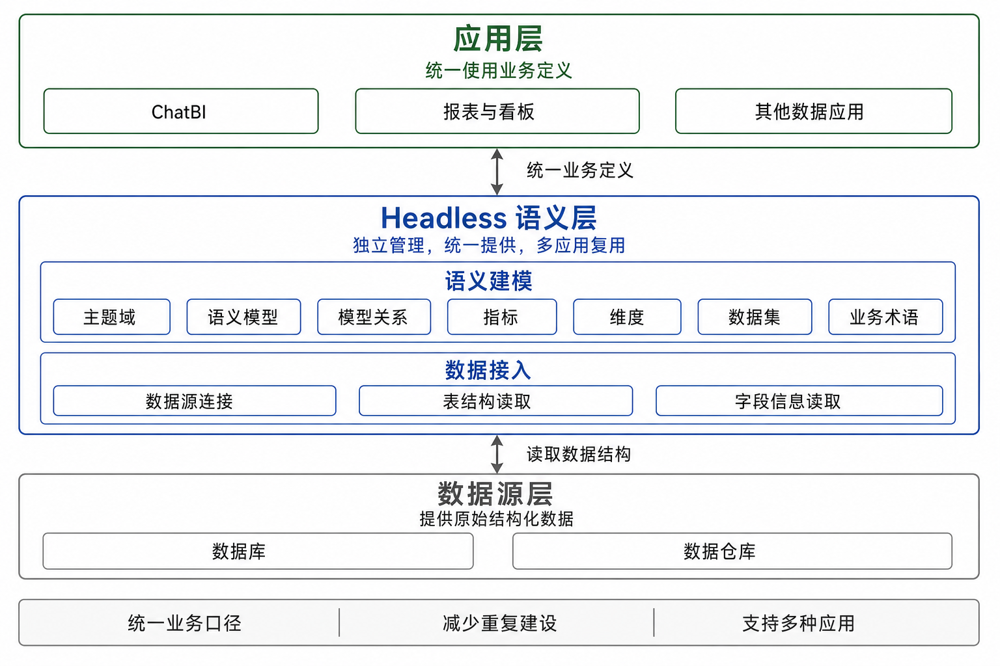
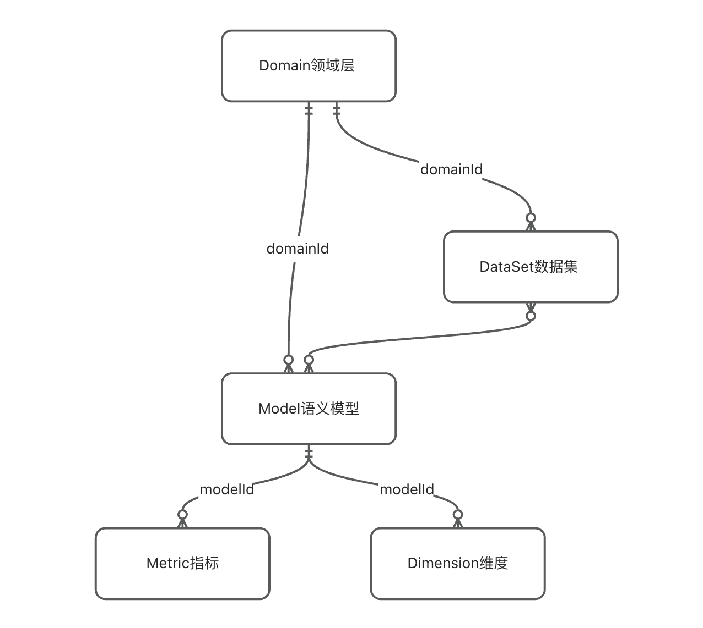
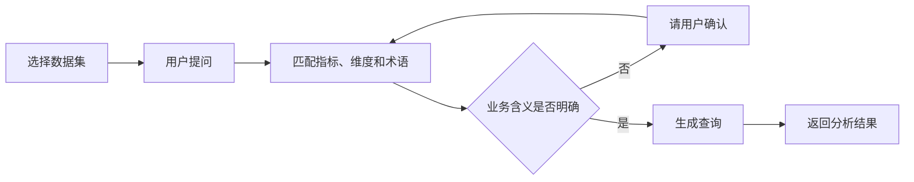

# 语义层

## 1. 背景

随着企业数据不断增加，数据通常分散在数据库、文件和不同的分析系统中，业务定义也可能分散在报表、SQL 和人员经验中。同一个“销售额”可能存在多种计算方式，同一个“客户”也可能对应不同的数据范围，导致不同系统给出不同结果。语义层因此被建立在原始数据和上层应用之间，用统一的业务语言说明数据代表什么、业务指标如何计算以及不同数据之间有什么关系。对于 ChatBI，语义层还可以将用户的自然语言问题与正确的数据和业务规则对应起来，减少理解错误，并保证分析结果使用统一口径。

## 2. Semantic

### 2.1 什么是 Semantic

Semantic 是一种系统设计方式，它将核心能力从具体的页面和应用中独立出来，由后端统一提供。报表、看板、ChatBI 和其他应用可以使用同一套后端能力，同时保留各自的页面和交互方式。Semantic 并不是不需要前端，而是核心能力不与某一个前端绑定，因此增加新的应用或更换使用方式时，不需要重复建设相同的业务逻辑。

### 2.2 Semantic 与语义层的关系

语义层负责定义数据的业务含义，Semantic 则是建设和使用语义层的一种方式。采用 Semantic 方式后，指标、维度、模型关系和业务术语等定义由独立服务统一管理，再提供给 ChatBI、报表和其他应用使用。并不是所有语义层都采用 Semantic，语义层也可以直接建设在某个 BI 产品或数据平台中。SQLBot 采用 Semantic 方式，是为了让同一套业务定义能够独立管理，并被不同的数据应用共同使用。

## 3. 架构

### 3.1 总体架构

SQLBot 的 Semantic 语义层位于数据源和 ChatBI 之间，当前主要面向数据库、数据仓库等结构化数据。系统先通过数据接入获取表和字段等基础信息，再通过语义建模补充业务含义，最后将统一的业务定义提供给 ChatBI 使用。ChatBI 可以处理多种来源的数据，本文介绍的是其中面向结构化数据的 Semantic 语义层。

## 4. 模块

### 4.1 数据接入

数据接入负责连接数据库、数据仓库等结构化数据源，并读取数据表、字段、数据类型和字段说明等基础信息。该过程主要获取数据结构，不改变数据源中的原始数据。

这些基础信息会作为语义建模的起点。建模人员可以从数据源中选择需要分析的表和字段，也可以通过 SQL 组织需要的数据，再补充对应的业务含义。这样可以减少重复录入，并保证语义模型与实际数据结构保持对应。

### 4.2 语义建模

语义建模负责将表名、字段名和关联条件等技术信息，转换为业务人员能够理解的定义。当前语义建模由主题域、语义模型、模型关系、指标、维度、数据集和业务术语组成。

这些模块并不是相互独立的。主题域负责分类，语义模型说明数据来自哪里，模型关系说明数据如何关联，指标和维度说明数据如何分析，数据集确定具体场景可以使用哪些内容，业务术语负责统一企业内部的表达方式。

#### 4.2.1 主题域

主题域用于按照业务范围管理语义内容，例如销售、客户、商品和财务。每个主题域可以包含多个语义模型，使不同业务范围的数据定义保持清晰，方便后续维护和查找。

主题域只负责分类，不直接定义计算规则。实际的数据来源、指标和维度仍由主题域下的其他模块管理。

| 存储信息 | 数据库列名 | 说明 |
| --- | --- | --- |
| 名称和业务名称 | name、biz_name | 用于展示、查找和识别主题域 |
| 说明 | description | 介绍主题域包含的业务范围 |
| 上级主题域 | parent_id | 用于建立主题域之间的层级关系 |
| 负责人和管理员 | owner、admin | 记录主题域的维护责任人 |
| 开放状态和启用状态 | is_open、status | 控制主题域是否开放和是否可以使用 |

#### 4.2.2 语义模型

语义模型是数据源与业务定义之间的基础。一个语义模型可以对应一张数据表，也可以对应一段 SQL 查询，并记录可以使用的字段和可用于统计的数值字段。

语义模型保留数据来源和字段结构，同时为字段补充业务名称和说明。指标、维度和模型关系都建立在语义模型之上。

| 存储信息 | 数据库列名 | 说明 |
| --- | --- | --- |
| 名称、业务名称和说明 | name、biz_name、description | 说明模型的名称、用途和业务含义 |
| 所属主题域 | domain_id | 说明模型属于哪个业务范围 |
| 数据来源 | datasource_id、database_name、schema_name、table_name | 记录使用的数据源、数据库和数据表 |
| 来源类型 | source_type、sql_query | 说明模型来自数据表还是 SQL 查询 |
| 字段信息 | model_detail；规范化列：field_name、name、biz_name、expr、data_type、semantic_type | 记录字段名称、数据类型、业务名称和说明 |
| 可统计字段 | model_detail；规范化列：name、biz_name、expr、agg、data_type | 记录可以用于汇总计算的数值字段及其默认计算方式 |
| 模型规则 | primary_key、model_grain、default_time_field、filter_sql | 记录主键、数据粒度、默认时间字段和默认筛选条件 |
| 别名和版本 | alias、schema_version、last_schema_sync_at | 支持不同名称匹配，并记录模型变更版本和最近同步时间 |

#### 4.2.3 模型关系

模型关系用于说明不同语义模型之间如何关联。例如，订单模型可以通过客户编号关联客户模型，也可以通过商品编号关联商品模型。

每个模型关系需要明确参与关联的模型、关联字段和关联方式。系统生成跨模型查询时会使用这些已确认的关系，避免临时猜测数据表之间的连接条件。

| 存储信息 | 数据库列名 | 说明 |
| --- | --- | --- |
| 所属主题域 | domain_id | 说明模型关系属于哪个业务范围 |
| 参与关联的模型 | left_model_id、right_model_id | 记录需要连接的两个语义模型 |
| 关联方式 | join_type | 记录两个模型采用的连接方式 |
| 关联条件 | join_conditions | 记录双方使用的关联字段和判断条件 |
| 启用状态 | status | 控制该模型关系是否可以使用 |

#### 4.2.4 指标

指标用于定义需要计算的业务结果，例如销售额、订单量和客单价。一个指标需要说明业务含义、计算方式、汇总方式以及使用的数据字段。

指标可以直接基于模型中的数值字段建立，也可以在已有指标基础上继续计算。指标定义完成后，ChatBI 和其他应用可以重复使用同一套计算口径。

| 存储信息 | 数据库列名 | 说明 |
| --- | --- | --- |
| 名称、业务名称和说明 | name、biz_name、description | 说明指标是什么以及用于什么业务场景 |
| 所属模型 | model_id | 说明指标使用哪个语义模型中的数据 |
| 指标类型 | type、define_type | 区分直接计算的指标和基于其他指标计算的指标 |
| 计算方式和汇总方式 | expr、default_agg、type_params | 记录指标的计算表达式以及求和、计数等汇总规则 |
| 使用字段和筛选条件 | field_id、measure_id、fields、filter_sql | 记录计算依赖的数据字段和固定筛选规则 |
| 引用指标 | metric_refs | 记录当前指标依赖的其他指标 |
| 可分析维度 | relate_dimensions | 记录该指标可以按照哪些维度进行分析 |
| 别名 | alias | 支持简称和其他业务说法的匹配 |
| 管理信息 | sensitive_level、quality_status、quality_message、is_publish、version、status | 记录敏感等级、质量状态、发布状态和版本 |

#### 4.2.5 维度

维度用于定义观察和分析数据的角度，例如时间、地区、客户和商品分类。每个维度需要明确对应的数据字段、数据类型和业务含义。

维度还可以维护常用取值及其业务说明。例如，地区维度可以包含华东、华南等取值，帮助 ChatBI 理解用户提出的筛选条件。

| 存储信息 | 数据库列名 | 说明 |
| --- | --- | --- |
| 名称、业务名称和说明 | name、biz_name、description | 说明维度代表的分析角度和业务含义 |
| 所属模型 | model_id | 说明维度使用哪个语义模型中的数据 |
| 对应字段或计算表达式 | field_id、field_name、expr | 记录维度从哪个字段取得或如何计算 |
| 维度类型和数据类型 | type、semantic_type、data_type、value_type | 说明维度是分类、时间等类型以及数据格式 |
| 时间设置 | time_granularities、is_default_time | 记录可用的时间粒度以及是否为默认时间维度 |
| 常用取值 | default_values、dim_value_maps；规范化列：value、display_value、biz_name、alias、description | 记录维度中常用的值及其业务说明 |
| 取值来源 | value_source_type、value_query_sql；规范化列：source_type | 说明维度值来自人工配置还是数据查询 |
| 别名和敏感等级 | alias、sensitive_level、status | 支持不同说法匹配，并标记是否包含敏感信息 |

#### 4.2.6 数据集

数据集用于面向具体分析场景组织语义内容。一个数据集可以选择一个或多个语义模型，并确定其中哪些指标和维度可以提供给上层应用使用。

例如，销售分析数据集可以包含销售额、订单量、时间和地区，但不包含与该场景无关的人事数据。数据集通过缩小可用范围，减少无关内容对 ChatBI 的干扰。

| 存储信息 | 数据库列名 | 说明 |
| --- | --- | --- |
| 名称、业务名称和说明 | name、biz_name、description | 说明数据集面向的分析场景 |
| 所属主题域 | domain_id | 说明数据集属于哪个业务范围 |
| 可用模型 | data_set_detail；规范化列：model_id、includes_all、is_default | 记录该场景可以使用的语义模型 |
| 可用指标和维度 | data_set_detail；规范化列：model_id、asset_type、asset_id、is_default | 记录每个模型中可以提供给应用的分析内容 |
| 默认模型和默认时间维度 | default_model_id、default_time_dimension_id | 为常用查询提供默认的数据范围和时间字段 |
| 查询配置 | query_config | 记录数据集在查询过程中的相关规则 |
| 别名和负责人 | alias、owner | 支持不同名称匹配，并记录维护责任人 |
| 版本 | schema_version、index_version、status | 记录数据结构和检索内容的变更版本 |

#### 4.2.7 业务术语

业务术语用于记录企业内部常用的名称、简称和解释，例如 GMV、有效订单和新增客户。一个业务术语可以关联到对应的指标或维度。

当用户使用简称或内部说法提问时，ChatBI 可以通过业务术语找到对应的业务定义，从而提高问题理解和语义匹配的准确性。

| 存储信息 | 数据库列名 | 说明 |
| --- | --- | --- |
| 术语名称和说明 | name、description | 记录企业内部用语及其标准解释 |
| 所属主题域 | domain_id | 说明术语属于哪个业务范围 |
| 别名 | alias | 记录简称、全称和其他常用说法 |
| 关联指标 | related_metrics | 记录术语对应的业务指标 |
| 关联维度 | related_dimensions | 记录术语对应的分析维度 |
| 启用状态 | status | 控制该业务术语是否可以使用 |

## 5. 使用

语义层完成配置和发布后，需要为 ChatBI 选择对应的数据集。数据集决定当前问数场景可以使用的模型、指标和维度，业务用户不需要了解底层的数据表和字段。

例如，用户在销售分析数据集中提出“查看最近 7 天各地区的销售额”后，ChatBI 会在该数据集范围内找到销售额指标、地区维度和对应的时间字段。如果“地区”存在多个业务含义，系统会先请用户确认；含义明确后，再根据语义层中保存的计算方式和模型关系生成查询并返回结果。
