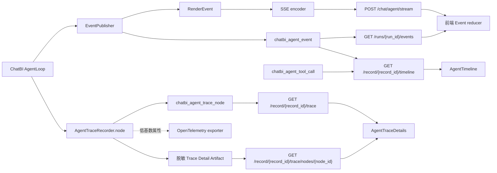

# Agent Event、SSE 与可观测性 Trace 技术方案

**日期：** 2026-07-28  
**状态：** 当前实现说明  
**范围：** ChatBI Agent 的产品事件、实时推送、事件补拉、产品时间线、持久化执行 Trace 和 OpenTelemetry 导出

## 1. 结论

当前实现已经将产品 Event、SSE 传输、产品 Timeline 和执行 Trace 的职责分开：

- `apps/event` 定义产品事件契约，分配序号、持久化事件，并提供 SSE 编码与补拉读取；
- `apps/chatbi` 决定何时产生事件，维护 Run、Step、Clarification，并提供 Agent HTTP 接口；
- 前端消费同一份 Event 契约，实时更新回答并投影简洁产品时间线；
- `apps/trace` 通过统一 `AgentTraceRecorder` 保存完整执行调用树，并将同一节点的低基数属性按配置导出到 OpenTelemetry；
- Agent 执行详情只读取持久化 Trace API，不使用 Event、Step、Tool Call 或 OpenTelemetry 后端拼树。

关闭 OpenTelemetry 导出、采样为零或运行期导出失败，都不能改变持久化 Trace、Event、SSE、Timeline 和最终回答。持久化 Trace 写入失败也不能改变业务结果，但会把根节点标记为 `partial`，页面明确显示数据不完整。

当前尚未完成的是普通网络中断后的端到端自动恢复：后端已经提供按 `sequence` 补拉接口，前端 reducer 已按 `(run_id, sequence)` 去重，但 SSE 异常后还没有自动发起补拉并恢复状态。

本次 Trace 实现更新前后差异：

| 方面 | 变化前 | 当前实现 |
| --- | --- | --- |
| Trace 数据 | 只有 OpenTelemetry Span | 持久化调用树是执行详情唯一数据源，OpenTelemetry 是可选导出 |
| 覆盖范围 | invocation、LLM、Tool 三类边界 | 请求接入、问题理解、ReAct、校验、投影、持久化、澄清和终态 |
| 前端 | 只有 Event/Step/Tool Call 投影的 Timeline | Timeline 保留；新增独立 Trace 树形执行详情 |
| 输入输出 | Span 只保存低基数属性 | 摘要入节点，完整脱敏详情进入 Artifact 并按权限延迟读取 |

## 2. 职责边界

| 能力 | 主要职责 | 不负责 |
| --- | --- | --- |
| Event | 表达前端可消费的产品事实；持久化有序日志 | HTTP 长连接、观测 span |
| SSE | 将 `RenderEvent` 编码为 `data:{json}\n\n` 并实时传输 | 保存事件、决定业务状态 |
| Timeline | 将 Event log、Step 与 Tool Call 投影为用户可读的简洁过程 | 节点级调试、读取 Trace Artifact |
| 持久化 Trace | 保存从请求接入到运行终态的父子调用树、输入输出摘要、状态变化、耗时、Token 和错误 | SSE、产品恢复、业务状态判定 |
| OpenTelemetry 导出 | 从同一 Recorder 导出允许的低基数属性和 Trace/Span ID | 保存执行详情正文、作为前端数据源 |
| ChatBI Agent | 运行问数流程，决定事件触发时机和业务载荷 | 实现事件协议和 OTEL SDK |

这里的 **Timeline** 是回答区面向用户的简洁过程，**执行详情** 是面向调试与追溯的持久化 Trace 调用树。两者可以同时存在，但不能相互拼接或回退。

## 3. 当前数据流



关键约束：

1. Agent 编排分别调用 `EventPublisher` 和 `AgentTraceRecorder`；Event 不写 Trace，Trace 不发布 Event。
2. Event 与对应 Run、Step 或 Tool Call 事实在应用层同一事务提交，提交后才返回给生成器进行 SSE 编码。
3. 实时推送、补拉和 Timeline 复用同一份持久化 Event 契约。
4. Timeline 只读取 Event、Step 和 Tool Call；执行详情只读取持久化 Trace，两者都不读取 Jaeger、Tempo、Phoenix 等观测系统。
5. OpenTelemetry 只由 Recorder 内部导出，不允许业务代码再直接创建 Span，避免双写两套执行链路。

## 4. Event 技术方案与实现

### 4.1 稳定传输契约

`RenderEvent` 的公共字段如下：

| 字段 | 含义 |
| --- | --- |
| `kind` | 渲染类别：`run`、`thinking`、`text`、`tool`、`artifact`、`interaction` |
| `phase` | 生命周期阶段：`start`、`delta`、`end`、`snapshot`、`error` |
| `domain` | 具体业务语义，是前端 reducer 的主要分派字段 |
| `content` | 事件业务载荷 |
| `record_id` | 问数记录 ID |
| `run_id` | Agent 运行 ID |
| `sequence` | 同一 Run 内递增的持久化序号 |
| `block_id` | thinking、text、tool、interaction 的稳定展示块标识 |

内部生产者仍使用 `record-created`、`tool-called` 等 `event_type`。`apps/event/models/dto.py` 在一个映射表中将其转换为稳定的 `kind + phase + domain` 契约。未知 `event_type` 会抛出 `ValueError`，不会静默降级。

当前 `domain` 包括：

- 运行：`run.created`、`run.started`、`step.started`、`run.finished`、`run.failed`、`run.cancelled`；
- 思考与回答：`question.understood`、`reasoning.snapshot`、`answer.completed`；
- 工具：`tool.called`、`workflow.step`、`tool.completed`、`tool.failed`；
- 产物：`sql.generated`、`sql.validated`、`sql.executed`、`chart.generated`；
- 交互：`clarification.required`、`clarification.accepted`。

旧的前端 `type` 字段不属于当前传输契约。

### 4.2 发布与持久化

`EventPublisher.publish()` 当前执行顺序为：

1. 查询当前 Run 的最大 `sequence` 并加一；
2. 写入 `chatbi_agent_event`；
3. 根据内部 `event_type` 创建 `RenderEvent`；
4. 将 `kind`、`phase`、`domain`、`block_id` 写回持久化 payload；
5. 返回 `RenderEvent`，由 ChatBI 应用层提交业务事实和 Event。

表 `chatbi_agent_event` 使用 `(run_id, sequence)` 唯一索引。物理表目前仍服务于 ChatBI Agent，没有提前改造成跨业务通用事件表；通用化的是代码边界和传输契约。

必须保持以下不变量：

- 同一 Run 的已提交事件按 `sequence` 有序；
- 一个发送到前端的事件必须已经能够通过补拉接口读取；
- Tool Call 开始和结束事实必须与对应 Event 在同一事务提交；
- SSE 不自行构造第二份业务事件；
- Trace 成败不能影响 Event 的提交和返回。

## 5. SSE 技术方案与实现

### 5.1 统一实时入口

Agent 只有一个实时接口：

```text
POST /api/v1/chat/agent/stream
```

请求使用 `action` 区分两种操作：

```json
{"action":"start","chat_id":1,"question":"最近 7 天销售额","datasource_id":2}
```

```json
{"action":"resume","record_id":10,"clarification":{"selections":[],"text":"按支付时间"}}
```

`start` 与 `resume` 返回完全相同的 Event 契约，不保留单独的旧澄清恢复接口。

### 5.2 帧格式

`apps/event/protocol/sse.py` 只负责协议编码：

```text
data:{"record_id":10,"run_id":20,"sequence":2,"kind":"run","phase":"start","domain":"run.started"}

```

当前只输出 SSE 的 `data:` 字段，没有输出 `id:`、`event:` 和 `retry:`。前端使用 `fetch` 流读取 POST 响应，因此恢复依据是业务 `sequence`，不是浏览器 `EventSource` 的 `Last-Event-ID`。

### 5.3 前端消费

`AgentAnswer.vue` 负责读取字节流和拆分 SSE 帧，`agentEventReducer.ts` 负责校验并应用事件：

- 缺少 `kind`、`phase` 或 `domain` 时明确报错；
- 按 `domain` 更新记录状态、SQL、图表、回答和澄清卡片；
- 将事件写入 `record.execution_events`；
- `AgentTimeline` 从事件与 Step 投影执行过程。

回答渲染依赖产品 Event，不依赖可观测性 Trace。

## 6. 补拉、断线恢复与 Human-in-the-loop

### 6.1 两类中断不是一回事

用户澄清是业务挂起，不是 SSE 网络断线：

1. Agent 发布 `clarification.required`；
2. Run 进入 `waiting_user`，Clarification 记录保持 `pending`；
3. 当前 SSE 可以正常结束；
4. 用户回答后，前端以 `action=resume` 再次调用统一 `/stream`；
5. 后端校验记录归属、Run 状态和待回答 Clarification 后继续执行。

页面重新打开时，前端会调用 Timeline 接口恢复待澄清状态和历史事件。这部分已经实现。

普通网络断线是传输故障。后端已经提供：

```text
GET /api/v1/chat/agent/runs/{run_id}/events?after_sequence={last_sequence}
```

接口会校验 Run 所有权，并按序返回指定 `sequence` 之后的已持久化事件。当前前端 API 已封装该接口，但执行流还没有在网络异常后自动调用它，也没有基于 `(run_id, sequence)` 做统一去重。因此当前状态是“后端支持补拉”，不是“端到端自动续传已完成”。

### 6.2 Timeline 接口

```text
GET /api/v1/chat/agent/record/{record_id}/timeline
```

返回 Run 状态、Step、Tool Call、Event 和待澄清信息，适用于回答区历史展示、主动刷新和等待用户状态恢复。Step 表示模型推理轮次，Tool Call 表示具体工具调用。它不是实时回答通道，也不是执行详情或 OpenTelemetry Trace 查询接口。

## 7. 持久化执行 Trace 与 OpenTelemetry 导出

### 7.1 唯一记录入口

`AgentTraceRecorder.node()` 是业务代码记录执行节点的唯一入口。一次调用依次完成：

1. 根据 `ContextVar` 中的当前节点确定 `parent_id`；
2. 在独立短 Session 中创建持久化节点；
3. 对输入摘要和详情执行统一脱敏；
4. 按配置创建对应 OpenTelemetry Span；
5. 业务操作结束后写入状态、耗时、Token、错误、状态变化和详情 Artifact 引用；
6. 将 Trace/Span ID 回写持久化节点。

业务代码不存在旧 `AgentTracer.span()` 入口。`.span()` 只存在于 `TraceExportClient` 内部端口，用于把 Recorder 节点可选导出到 OpenTelemetry，不构成第二套业务埋点。

### 7.2 调用树与终态

每个 Agent Run 只有一个 `run` 根节点。首次执行和每次澄清恢复各自形成 `invocation` 子节点；问题理解、ReAct 轮次、LLM、Tool、校验、结果整理、持久化和交互过程继续挂在当前调用节点下。

等待澄清时，当前 invocation 收口为 `waiting`，Run 根节点不结束。恢复请求继续使用同一个根节点。成功、失败或取消时，先关闭 invocation 子树，再由 `finish_run()` 将根节点收口到唯一业务终态。Trace 写入失败时根节点保持 `partial`，并记录业务终态，页面不会把不完整树显示成成功采集。

节点类型包括 `run`、`invocation`、`phase`、`llm`、`tool`、`validation`、`projection`、`persistence` 和 `interaction`。同一 Run 的节点按稳定 `sequence` 排序；并行关系由相同父节点与重叠执行区间表示。

### 7.3 摘要、详情和权限

节点摘要保存在 `chatbi_agent_trace_node`，完整脱敏输入输出通过现有 Result Artifact 保存。摘要限制为 8 KiB，状态差异限制为 16 KiB；API Key、Authorization、Cookie、密码、数据库连接等字段和常见凭据文本会被替换为 `[REDACTED]`。

树接口先校验 ChatRecord 归属，返回扁平摘要节点。只有系统管理员和工作空间管理员可以调用节点详情接口；其他记录所有者只能看到安全摘要，前端不会发起详情请求。历史 Run 没有根节点时返回 `trace_unavailable`，不回退到 Timeline。

### 7.4 OpenTelemetry 导出

OpenTelemetry 只接收固定白名单内的低基数属性，例如 Run、Record、Step、Tool Call、节点 ID、模型、Token、耗时和错误类型。Prompt、SQL、结果行和详情 Artifact 正文不会导出。

导出关闭或采样为零时不加载 OpenTelemetry SDK；启用但缺少可选依赖时，装配阶段抛出明确 `ImportError`。运行期 Span 启动、属性写入或关闭失败会记录日志并切换为空导出对象，不影响持久化 Trace 和 Agent 业务结果。

## 8. 当前代码位置

| 位置 | 职责 |
| --- | --- |
| `backend/apps/event/models/dto.py` | Event 契约与内部事件映射 |
| `backend/apps/event/models/orm.py` | `chatbi_agent_event` ORM |
| `backend/apps/event/repository/sqlmodel.py` | 序号分配、追加、补拉和删除 |
| `backend/apps/event/service.py` | 统一发布、持久化和提交 |
| `backend/apps/event/protocol/sse.py` | SSE 编码 |
| `backend/apps/chatbi/api/interactions.py` | start/resume、Timeline、补拉和取消接口 |
| `backend/apps/chatbi/orchestration/agent/composition.py` | 统一组装模型、工具、业务服务和 Agent 执行组件 |
| `backend/apps/chatbi/orchestration/agent/lifecycle.py` | Run、ChatRecord 与 Clarification 的统一生命周期 |
| `backend/apps/chatbi/orchestration/agent/loop.py` | 协调启动、恢复、ReAct 主循环、invocation 和 Run 根节点终态 |
| `backend/apps/chatbi/orchestration/agent/model_client.py` | 默认模型配置加载和 Function Calling 模型调用适配 |
| `backend/apps/chatbi/orchestration/agent/preparation.py` | 首次问题理解、澄清恢复、系统提示构建和预检澄清 |
| `backend/apps/chatbi/orchestration/agent/reasoning.py` | 单轮 LLM 推理、Token 统计与 Function Calling 决策解析 |
| `backend/apps/chatbi/orchestration/agent/state.py` | 保存 Run 状态，并统一创建预算、工具上下文和初始消息 |
| `backend/apps/chatbi/orchestration/agent/tool_execution.py` | Tool Call 生命周期、Observation、领域重试、取消及 clarify/finish 控制结果 |
| `backend/apps/chatbi/models/orm/agent_run.py` | Run、Step、Tool Call 和 Clarification 持久化模型 |
| `backend/apps/chatbi/orchestration/agent/service.py` | Run 创建、恢复与生成器 Session 生命周期 |
| `backend/apps/trace/recorder.py` | 唯一 Trace Recorder、父子上下文、详情写入和根节点收口 |
| `backend/apps/trace/setup.py` | OpenTelemetry 惰性装配与运行期故障隔离 |
| `backend/apps/chatbi/models/orm/agent_trace.py` | 持久化 Trace 节点模型和索引 |
| `backend/apps/chatbi/adapters/agent_trace.py` | 独立 Session Repository 与详情 Artifact 适配器 |
| `backend/apps/chatbi/services/trace_projection.py` | Trace 概览、扁平节点和详情查询投影 |
| `frontend/src/api/agent-chat.ts` | Agent HTTP 客户端 |
| `frontend/src/views/chat/answer/agentEventReducer.ts` | Event 状态投影 |
| `frontend/src/views/chat/execution-component/AgentTimeline.vue` | 执行时间线展示 |
| `frontend/src/views/chat/AgentTraceDetails.vue` | 树形执行详情抽屉和节点详情 |
| `frontend/src/views/chat/execution-component/agentTraceProjection.ts` | 扁平节点组树、完整性校验、并行和筛选投影 |

## 9. 已完成内容

- 建立独立的 `apps/event` 与 `apps/trace`；
- 将产品事件表命名为 `chatbi_agent_event`，删除旧 trace 命名和 `chat_record.trace_id`；
- 建立 `kind + phase + domain + sequence` 契约，未知事件明确失败；
- 合并 Agent 首次执行与澄清恢复为统一 `/stream`；
- SSE 只传输 Event，不传输 Trace；
- 提供按 `after_sequence` 补拉和 Timeline 查询；
- 每个 Tool Call 独立保存状态、摘要和耗时，并与 `tool.called`、`tool.completed` 或 `tool.failed` 同事务提交；
- 支持 `cancellation_requested` 与 `run.cancelled`，运行中取消不会提前宣称底层操作已终止；
- 前端使用 Event reducer 与 `execution_events`，不再使用产品侧 trace 命名；
- 持久化 Trace 覆盖请求接入、问题理解、ReAct、LLM、Tool、校验、状态迁移和运行终态；
- OpenTelemetry 作为同一 Recorder 的可选导出，支持关闭、采样、OTLP 导出和运行期故障隔离；
- 执行详情提供树形追溯、摘要权限、节点详情懒加载、筛选搜索和 `trace_unavailable`；
- 清理旧 Agent Event/SSE 兼容接口、字段和历史数据。

## 10. 待完善内容

### 10.1 优先级高

1. **完成前端断线恢复。** SSE 异常后根据最后一个已应用 `sequence` 调用补拉接口并继续投影；现有 `(run_id, sequence)` 去重继续作为统一入口，同时区分用户主动取消、业务等待和网络异常。
2. **修正前端本地乐观澄清事件。** 当前本地事件仍附带非契约字段 `type`，且 `domain` 使用泛化值 `interaction`；应改为正式的 `clarification.accepted` 契约，并避免与后端持久化事件重复展示。
3. **保证并发序号分配。** 当前 `max(sequence) + 1` 适合单写者。若同一 Run 允许并行发布，需改为数据库锁、独立计数器或可重试的唯一冲突处理。

### 10.2 优先级中

1. 增加 SSE 心跳、代理超时配置、客户端断开检测和背压处理；
2. 为 Event payload 增加版本、大小限制、敏感字段规则和更具体的类型校验；
3. 增加 Event 保留期限、归档和批量清理策略；
4. 增加补拉次数、序号缺口、SSE 中断、端到端延迟等产品指标，但保持与 Trace 代码解耦；
5. 补充统一契约测试，覆盖“持久化后发送”、SSE 与补拉内容一致、澄清恢复、重复事件和乱序事件。

### 10.3 按需要评估

- 只有第二个业务模块需要复用 Event store 时，再评估 `stream_type + stream_id` 的通用物理表；
- 只有出现真实逐字输出需求时，再将 `reasoning.snapshot` 或回答扩展为 `start/delta/end`；
- 如果未来改为 GET `EventSource`，再评估 `id:`、`retry:` 和 `Last-Event-ID`；当前 POST 流不依赖这些字段。

## 11. 验收标准

后续改动仍需满足：

1. OpenTelemetry 完全关闭或 exporter 故障时，持久化 Trace、Agent 回答和 SSE 结果不变；
2. 每个发送成功的 Event 都能按 `run_id + sequence` 补拉；
3. 前端只以 `kind + phase + domain` 解释服务端事件；
4. Timeline 不访问 Trace 或观测平台，执行详情不使用 Timeline 回退；
5. 澄清恢复只使用统一 `/stream`；
6. 重连补拉后没有事件重复、状态倒退或终态重复通知；
7. Agent 业务代码只调用 `AgentTraceRecorder.node()`，不直接调用 OpenTelemetry Span；
8. 终态 Run 的 Trace 根节点为 succeeded、failed、cancelled 或 partial，不长期停留在 running。
