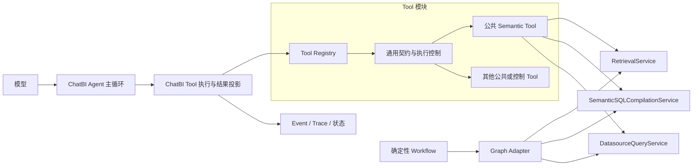
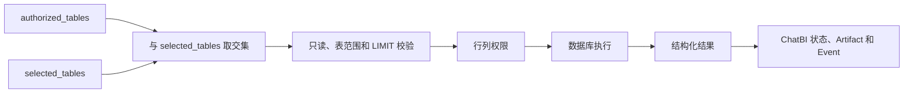
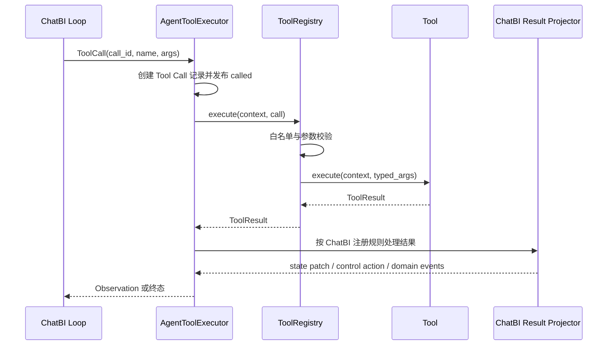
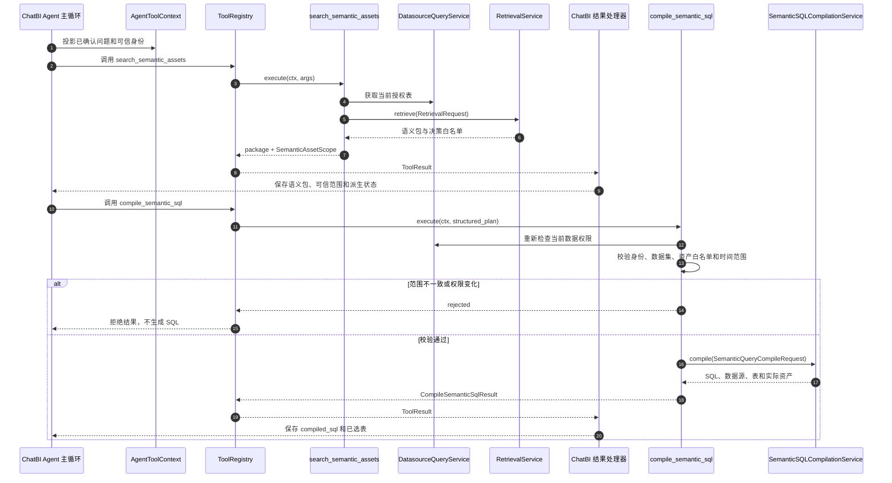

# ChatBI Agent Tool 职责与执行架构设计

**日期：** 2026-07-29

**状态：** 已实施并完成验收

**范围：** 当前 ChatBI Agent 的全部工具、工具执行和可复用能力分层

**关联文档：** `16-agent-event-and-observability-trace-design.md`

**实现说明：** 本文第 2 章保留改造前问题作为决策依据；第 5 章以后描述当前职责边界。阶段 8 已将语义资产检索和语义 SQL 编译 Tool 公共化，实际实施记录和验证命令见 `18-chatbi-agent-tool-architecture-implementation-plan.md`。

## 1. 结论

本轮只优化 ChatBI Agent，不实现多 Agent；但通用工具和领域能力不能依赖 ChatBI，以便后续 Agent 复用。

核心决定：

1. `apps/tool` 根目录保留 Tool 契约、注册、参数校验、结果类型和通用调用机制。
2. 可复用 Tool 集中放在 `apps/tool/tools` 并按领域分类；实际业务逻辑仍由对应领域服务实现。
3. Agent 负责业务前置条件、工具选择、调用顺序、循环、澄清、结束和状态更新。
4. Tool 负责一次结构化能力调用，不直接操作 Run、Step、Event、SSE 或 Trace。
5. 领域服务负责任何调用方都不能绕过的规则，例如数据权限、SQL 只读校验和资源限制。
6. Tool 返回结构化结果，ChatBI 执行层负责生成 Observation、更新状态和发布产品事件。
7. 数据库临时故障重试与模型修正 SQL 分开处理。
8. 不为兼容当前内部接口保留双实现或长期适配层。
9. 保留 LangChain 作为当前模型接入适配层，但 Tool 定义、注册、筛选、执行和结果契约使用项目自有实现；不引入 LangChain Agent、`BaseTool`、`AgentExecutor` 或 LangGraph Tool 运行时。
10. Agent 通过公共 Tool 调用共享能力；确定性 Workflow 可以直接调用相同领域 Service，不为每个业务调用方增加转发 Tool 或转发 Service。

目标依赖方向：



实线表示运行时调用。领域 Service 不依赖 Tool，Graph Adapter 也不经过模型适配层，因此静态依赖中不存在“模型 → Tool → 模型适配层 → 模型”的循环。

## 2. 改造前工具与问题

本章描述 2026-07-27 设计评审时的基线问题，不代表当前实现状态。

### 2.1 全部工具的职责判断

当前默认注册 9 个工具。问题不只在 `ExecuteSqlTool`，而是多个工具同时读取或修改 ChatBI state，通用执行器又按工具名称解释业务语义。

| 工具 | 正确的核心职责 | 当前需要调整的部分 | 能力归属 |
| --- | --- | --- | --- |
| `search_semantic_assets` | 检索指标、维度、术语和候选表 | 不直接写 `semantic_package`、`semantic_asset_ids`、`allowed_tables` | Semantic 能力；ChatBI Tool 适配 |
| `get_dataset_schema` | 读取用户有权查看的物理 Schema | 不通过写 state 扩大允许表；必须使用明确授权范围 | `apps/tool/tools/datasource` |
| `compile_semantic_sql` | 根据已选语义资产确定性编译 SQL | 问题理解门禁、资产来源校验和 state 更新移到 ChatBI 流程边界 | Semantic 编译能力；ChatBI Tool 适配 |
| `validate_sql` | 校验单语句、只读、表范围并补充查询上限 | 不读取问题理解；授权范围由执行上下文明确传入 | `apps/tool/tools/datasource` |
| `execute_sql` | 执行经过安全处理的只读 SQL 并返回结果 | 移出 Artifact、`last_execution`、`full_data`、`sql_source` 和问题理解门禁 | `apps/tool/tools/datasource` |
| `search_terminology` | 查询业务术语及映射 | 不依赖完整 `AgentToolContext`；只接收查询所需身份和数据集 | `apps/tool/tools/semantic` |
| `get_sql_examples` | 召回相似 SQL 示例 | 不在 `execute()` 内临时组装服务；明确示例数据权限 | `apps/tool/tools/knowledge` |
| `clarify` | 向 ChatBI 执行层返回澄清请求 | 保持 ChatBI 专属；挂起和持久化仍由 ChatBI 执行层完成 | ChatBI 控制 Tool |
| `finish` | 向 ChatBI 执行层返回最终回答建议 | 保持 ChatBI 专属；结束 Run 和结果投影仍由 ChatBI 执行层完成 | ChatBI 控制 Tool |

`apps/tool/tools` 中只保存 Tool 定义和模型参数到领域请求的转换，权限、查询和检索实现仍留在 Datasource、Semantic、Knowledge 服务中。本表是改造前判断；阶段 8 已将两项 Semantic Tool 的可信输入从 ChatBI state 中抽离，最终归属见第 7.2 节。

### 2.2 `AgentToolContext` 过大

当前所有工具共享一个上下文，包含 Session、用户、工作空间、数据源、ChatBI 配置、多个服务和可变 state。后果是：

- 工具可以读取未声明的 state 字段；
- 工具的真实依赖只能进入实现后确认；
- 只需要一个查询服务的工具也依赖完整 ChatBI 上下文；
- state 修改、领域调用和安全校验难以分别测试。

目标不是为每个工具建立一个上下文类，而是把稳定的调用身份与工具专属参数分开，并通过构造函数注入所需服务。

### 2.3 业务前置条件重复进入 Tool

`compile_semantic_sql`、`validate_sql` 和 `execute_sql` 都调用 `_execution_gate()` 检查问题理解。问题理解是 ChatBI 必经阶段，应由流程决定当前暴露哪些工具，而不是让每个工具重复检查。

领域服务仍需独立执行安全校验。即使 Agent 错误地调用了 SQL 能力，也不能绕过用户权限、表范围和只读限制。

### 2.4 表范围含义混合

当前 `allowed_tables` 同时表示：

- Agent 已检索或选中的表；
- 用户有权访问的表。

两者必须拆分为：

- `authorized_tables`：平台权限确定的最大范围；
- `selected_tables`：当前 Agent 根据语义或 Schema 选中的范围；
- `effective_tables`：两者交集，作为本次 SQL 的最终表范围。

Tool 或模型只能缩小 `selected_tables`，不能扩大 `authorized_tables`。

### 2.5 通用层包含 ChatBI 业务

当前 `apps/tool` 仍硬编码：

- `clarify`、`finish` 是终止工具；
- soft budget 只允许 `clarify` 和 `finish`；
- SQL 失败次数和澄清次数。

`AgentToolExecutor` 还通过工具名称决定挂起、结束、SQL 重试、结果摘要和领域事件。这使扩展新工具必须修改中心执行器。

目标是：

- `apps/tool` 不认识任何具体工具名称；
- ChatBI 明确注册自己的控制动作和结果处理器；
- 通用层只根据结构化元数据处理并发、参数和调用结果。

### 2.6 Tool Call 与 Step 不一致

一轮模型响应可以包含多个 `tool_call_id`，但当前多个调用复用一个 Step，并反复覆盖 `tool_name` 和 `args_summary`。需要明确：

- Step 表示一次推理轮次；
- Tool Call 表示该轮中的一次工具调用；
- 每个 Tool Call 独立记录名称、参数、状态、结果和耗时；
- `tool_call_id` 贯穿 Observation、Event 和 Trace。

### 2.7 失败、超时和 Trace 仍有混合

- 所有 `Exception` 被转换为 `tool_exception`，可能掩盖程序错误；
- `execute_sql` 的所有非拒绝失败统一计入 SQL 重试，无法区分临时故障和 SQL 错误；
- 当前线程超时只停止等待，不能保证底层调用取消；
- `LatencyMiddleware` 把 `_trace` 写入业务 payload，破坏 Trace 与产品数据的边界。

这些问题应在通用调用契约和具体领域能力中分别解决，不能继续增加按工具名判断。

## 3. 外部方案对照

| 项目 | 可采用的设计 | 不采用的部分 |
| --- | --- | --- |
| AgentScope | Toolkit 执行工具；Agent 管理并发、事件、权限和 Human-in-the-loop；每次调用有独立 ID | 不替换现有 Run、Event 和恢复模型 |
| [LangGraph SQL Agent](https://langchain-ai.github.io/langgraph/tutorials/sql-agent/) | 用流程阶段约束 Schema、生成、检查和执行顺序 | 不引入完整图运行时 |
| [PydanticAI Tools](https://pydantic.dev/docs/ai/tools-toolsets/tools-advanced/) | 区分执行失败、模型修正和未处理异常；动态过滤可用工具 | 不引入其完整依赖注入体系 |
| [AutoGen Tools](https://microsoft.github.io/autogen/stable/reference/python/autogen_core.tools.html) | Tool 与具体执行器分开；保留 `call_id` 和结构化错误 | 不引入多 Agent 会话模型 |
| [LlamaIndex Text-to-SQL](https://docs.llamaindex.ai/en/stable/examples/pipeline/query_pipeline_sql/) | 检索、生成、校验、执行分阶段；数据库使用只读和受限权限 | 不采用仅靠部署约束的安全方式 |
| [MCP Tools](https://modelcontextprotocol.io/specification/2025-06-18/server/tools) | 输入与输出 JSON Schema、结构化结果和行为提示 | 只对齐内部定义，不实现 MCP Server |
| Supersonic | SQL 修正属于查询工作流，数据库服务只执行 SQL | 不复制完整状态机 |
| Youtu-RAG | 工具接入形式简单 | 不采用全局连接配置、任意 SQL 和字符串错误结果 |

共同结论：Tool 是一次能力调用；Agent 或工作流负责调用顺序；安全约束由领域服务强制执行；每次调用需要独立标识和结构化失败。

## 4. 目标与非目标

### 4.1 目标

1. 覆盖全部现有工具，不围绕单个 SQL 工具设计。
2. 让 ChatBI 主流程直接表达问题理解、工具循环、澄清和结束。
3. 让每个 Tool 的输入、输出、依赖、副作用、并发性质和失败类型可判断。
4. 让语义检索、Schema、术语、示例和 SQL 能力可以独立测试与按需复用。
5. 让权限、只读和资源限制在非 Agent 调用下仍然生效。
6. 让 Tool Call、Event、Trace 和持久化记录一一对应。
7. 删除按工具名写死的通用逻辑和旧内部兼容入口。

### 4.2 非目标

- 不实现 Text2SQL Agent 或多 Agent 框架；
- 不替换现有 Function Calling ReAct 主循环；
- 不引入 LangGraph、AgentScope 等外部运行时；
- 不重新设计文档 16 已定义的 SSE 和 Trace 边界；
- 不为尚未出现的 Agent 统一状态和生命周期；
- 不为了分层建立大量只调用一次的类或方法。

面向未来只保留三条约束：公共 Tool 不依赖 ChatBI；共享领域能力不读取 ChatBI state；新 Agent 可以组合自己的工具集合和上下文。

## 5. 职责划分原则

### 5.1 四层职责

| 层级 | 负责 | 不负责 |
| --- | --- | --- |
| ChatBI Agent 流程 | 问题理解、可用工具、调用顺序、澄清、SQL 修正、结束条件 | 领域安全实现 |
| ChatBI 工具执行层 | Tool Call 生命周期、预算、Observation、状态归并、Event 和 Trace 关联 | SQL、语义检索和权限算法 |
| `apps/tool` 核心 | Tool 契约、注册、参数校验、通用结果和调用机制 | 具体工具名称和 ChatBI 规则 |
| `apps/tool/tools` | 按领域集中保存可复用 Tool 定义 | 实现权限、SQL、检索等业务规则 |
| 领域能力 | Semantic、Datasource、Knowledge、Artifact 的具体能力和安全约束 | Agent 循环、SSE 和 Run 生命周期 |

领域能力继续放在已有业务模块中，不新建统一的 `capability` 目录。

### 5.2 Tool 的判断标准

一项能力适合作为 Tool，需要满足：

- 模型可以自主决定是否调用；
- 输入和输出可以使用稳定 schema 表达；
- 单次调用有清晰完成条件；
- 调用失败不会破坏 Agent 状态不变量；
- 调用方可以根据结果决定下一步。

问题理解当前不作为 Tool。它是 ChatBI 每次首次运行的固定前置阶段，允许模型跳过或重复调用会破坏流程。后续工具通过“当前可用工具集合”控制阶段，不再各自调用 `_execution_gate()`。

`clarify` 和 `finish` 可以继续表现为模型可调用的控制 Tool，但它们只返回请求；挂起、恢复和结束仍由 ChatBI 执行层完成。

### 5.3 领域服务与 Tool 的边界

判断逻辑放置位置时使用以下规则：

1. 普通 API、后台任务或其他 Agent 调用时仍必须执行的规则，放在领域服务。
2. 只决定 ChatBI 当前能否调用某工具的规则，放在 ChatBI 流程。
3. 模型参数与领域请求存在转换时，使用薄 Tool 适配器。
4. Tool 返回结果后产生的 Run、state、Artifact 和 Event 更新，由 ChatBI 执行层处理。

例如 SQL 执行链路为：



前五步属于可复用的数据查询能力；最后一步属于 ChatBI。

同样的原则适用于其他工具：语义资产检索返回语义包，术语查询返回术语条目，SQL 示例查询返回参考示例；它们不直接修改 ChatBI state。

### 5.4 结果与状态

Tool 分开返回模型内容、结构化业务数据和内部元数据。ChatBI 集中处理 state、Artifact 和领域 Event；每次调用使用独立 `tool_call_id`。具体字段在第 6、11 章定义。

### 5.5 失败与重试

Tool 只表达错误类别和重试建议。领域服务处理同请求临时重试，ChatBI 处理模型修正、澄清和预算，未声明程序异常直接使 Run 失败。完整矩阵见第 10 章。

### 5.6 Event、SSE 与 Trace

ChatBI 执行层发布工具事件并记录 Trace；具体 Tool 不依赖 Event、Trace 或 SSE。完整调用顺序见第 11 章。

## 6. Tool 模型设计

### 6.1 Tool 契约

保留当前 `Tool + Pydantic args_model + ToolRegistry` 结构，但收紧契约：

```python
class Tool(Generic[ContextT, ArgsT, ResultT]):
    name: ClassVar[str]
    title: ClassVar[str | None]
    description: ClassVar[str]
    args_model: ClassVar[type[ArgsT]]
    result_model: ClassVar[type[ResultT]]
    execution: ClassVar[ToolExecutionPolicy]

    def execute(self, ctx: ContextT, args: ArgsT) -> ToolResult[ResultT]:
        raise NotImplementedError
```

约束如下：

- `execute()` 只接收已校验参数；
- Tool 使用构造函数注入领域服务，不在调用时临时组装服务；
- Context 提供调用身份和可信运行范围，不提供可任意修改的字典；
- Tool 不提交 Agent Session，不更新 Run，也不发布 Event；
- 未声明异常不转换为普通工具失败。

全部 Tool 都声明 `result_model`，用于校验结构化结果并生成 `output_schema`。没有业务数据的 Tool 使用明确的空结果模型，不返回含义不明的任意字典。

### 6.2 执行上下文

通用层只定义调用元数据：

- `tool_call_id`；
- 截止时间；
- 取消信号；
- Trace 关联所需但不进入业务结果的上下文。

ChatBI 另外定义只读的 `ChatBIToolContext`，保存当前用户、工作空间、数据源、数据集和经过服务端确认的查询范围。领域服务通过 Tool 构造函数注入，不再全部挂到 Context。

模型参数与可信上下文必须分开。`user_id`、`workspace_id`、`datasource_id`、授权表范围等字段不能由模型传入。

### 6.3 执行属性

当前 `is_read_only` 不能说明工具是否修改 Agent state、数据库或外部系统。改为两个独立属性：

- `side_effect`：`read`、`write`；
- `concurrency`：`parallel_safe`、`serial`。

每个 Tool 还可以声明 `timeout_seconds`。系统配置提供默认值和上限，Run 提供剩余时间，最终使用三者中的最小值。Tool 声明不能突破系统上限。

`clarify` 和 `finish` 返回控制请求，但自身不修改数据，可保持串行。终止语义由 ChatBI 结果处理器解释，不进入通用并发模块。

### 6.4 参数校验

参数按四层校验：

1. Pydantic schema 检查类型、必填项和字段约束；
2. 可选 `args_validator` 检查跨字段以及参数与可信上下文的关系；
3. ChatBI 流程决定当前阶段是否暴露该 Tool；
4. 领域服务再次执行权限和业务安全校验。

`args_validator` 必须无副作用，不能代替领域服务。适合检查时间范围先后、资产 ID 是否来自本次语义包等；用户权限、SQL 只读和行列权限仍由领域服务处理。问题理解门禁通过阶段化工具暴露解决，不迁入 validator。

### 6.5 结果与错误

删除 `success` 与 `status` 两套可能重复的状态，以一个终态为准：

- `succeeded`；
- `rejected`：权限或业务规则拒绝；
- `failed`：已知领域或基础设施失败；
- `interrupted`：取消或调用方中断。

Tool 返回字段分为三类：

| 字段 | 使用者 | 约束 |
| --- | --- | --- |
| `model_content` | LLM Observation | 必须截断、脱敏，不包含完整结果 |
| `data` | ChatBI 结果处理器 | 使用 `result_model` 校验的结构化业务结果 |
| `metadata` | Tool 执行器和 Trace | 重试次数、内部结果引用等，不发送给模型和前端 |

失败结果另外包含：

- 稳定 `error_code`；
- 面向模型的有限说明；
- 错误类别；
- `retry_advice`：`never`、`same_input`、`correct_input`；
- 可供调用方使用的结构化详情。

未知程序异常不构造 `ToolResult`，由 ChatBI 执行层记录 Tool Call 和 Trace 后使 Run 失败。

### 6.6 Tool Definition 与 MCP 兼容

Tool 先生成与模型厂商无关的 `ToolDefinition`：

- `name`、`title`、`description`；
- `input_schema`、可选 `output_schema`；
- 只读、破坏性和幂等等行为提示。

当前模型适配层把它转换成 OpenAI Function Calling 格式。字段设计与 MCP 的 `name + description + inputSchema + outputSchema + annotations` 对齐，但本轮不实现 MCP Server、`tools/list` 或 `tools/call`。

Tool 结果也不自动导出为 MCP：只有未来的 MCP 适配层可以把经过筛选的 `model_content` 映射为 `content`、把允许公开的 `data` 映射为 `structuredContent`。内部 `metadata` 不能直接映射为 MCP `_meta`。

### 6.7 Tool Registry

`ToolRegistry` 只负责：

- 拒绝未注册工具；
- 校验参数；
- 导出模型 schema；
- 调用通用中间件和 Tool；
- 返回结构化结果。

它不处理预算、终止工具、SQL 重试、状态投影和 Event。工具集合仍由 ChatBI composition 显式组装，避免运行期自动扫描带来不可控工具暴露。

### 6.8 LangChain 使用边界

当前项目已使用 LangChain 统一接入 OpenAI、Azure OpenAI、VLLM、消息、流式输出和 Embedding，因此本轮不以移除 LangChain 依赖为目标。仅为一次 `bind_tools()` 新增 LangChain 依赖并不值得，但在当前项目中继续复用既有模型接入层，可以避免同时维护两套模型调用方式。

LangChain 的职责限制为：

- 在模型适配器内把项目自有 `ToolDefinition` 转换为 `bind_tools()` 可接受的格式；
- 调用模型并读取模型返回的 Tool Call；
- 适配不同模型提供方的消息、流式响应和 Token 使用信息。

以下能力必须使用项目自有实现：

- Tool 定义、显式注册、白名单和阶段化筛选；
- 参数校验、可信执行上下文和领域服务注入；
- Tool 调用、并发、结果、错误分类、重试建议和超时语义；
- ChatBI state、Artifact、预算、澄清、生命周期、Event、SSE、Trace 和持久化。

不使用 LangChain `BaseTool`、`StructuredTool`、`AgentExecutor`、LangGraph `ToolNode` 或其 Agent 状态管理。模型接入依赖 LangChain，不代表 Tool 运行时和 ChatBI 编排也应依赖 LangChain。

目标边界为：

```text
ChatBI Agent / apps/tool
    使用项目自有 AgentMessage、ToolDefinition、ToolCall 和 ModelDecision
        调用 AgentModelClient
            LangChainAgentModelClient
                转换 LangChain Message 和 bind_tools schema
                调用 OpenAI / Azure OpenAI / VLLM
```

当前 `AgentModelClient` 接口可以保留，但其稳定契约应逐步改为项目自有消息和决策类型。`AIMessage`、`HumanMessage`、`SystemMessage`、`ToolMessage` 等 LangChain 类型最终只出现在模型适配器内，不能继续扩散到 Tool 核心、ChatBI state、持久化模型和领域服务。该收敛可随 Tool 契约迁移完成，不单独建立第二套并行模型调用入口。

## 7. 工具归属

### 7.1 归属规则

可复用 Tool 定义集中在 `apps/tool/tools`，便于查看和供不同 Agent 选择；实际业务实现仍放在原领域模块。目标结构为：

```text
apps/tool/
├── base.py
├── registry.py
├── result.py
└── tools/
    ├── context.py
    ├── datasource.py
    ├── semantic.py
    ├── semantic_contracts.py
    └── knowledge.py

apps/chatbi/orchestration/agent/tools/
├── base.py
├── core.py          # finish
└── interaction.py   # clarify
```

`apps/tool/tools` 只是按领域整理 Tool，不接管这些领域的业务代码。以执行 SQL 为例：

```text
ExecuteSqlTool
    调用 DatasourceQueryService
        调用 DatabaseRepository
```

这表示：

- `ExecuteSqlTool` 知道如何调用查询服务；
- 查询服务不知道 `ExecuteSqlTool`，也不返回 `ToolResult`；
- Database Repository 只负责访问数据库，不知道 Agent 和 Tool；
- `apps/tool/__init__.py` 不自动导入 `apps/tool/tools`，具体工具由 ChatBI 显式注册。

因此不会出现查询服务为了执行 SQL 又反过来调用 Tool 的循环关系。

### 7.2 当前工具的目标分组

| 分组 | 工具 | 说明 |
| --- | --- | --- |
| Datasource Tool | `get_dataset_schema`、`validate_sql`、`execute_sql` | 可复用，但必须绑定调用方身份和授权范围 |
| Semantic Tool | `search_semantic_assets`、`compile_semantic_sql`、`search_terminology` | 可复用；检索请求、可信资产范围和身份由调用方上下文提供 |
| Knowledge Tool | `get_sql_examples` | 可复用示例检索，结果不代表真实查询结果 |
| ChatBI 控制 Tool | `clarify`、`finish` | 由 ChatBI 解释为挂起或结束请求 |

公共 Semantic Tool 不读取 ChatBI state。调用方负责把已确认问题投影为 `RetrievalRequest`，并保存检索结果中的 `SemanticAssetScope`；后续编译只能使用该范围内由检索决策放行的资产。

## 8. ChatBI 工具执行流程

### 8.1 单次调用



结果投影集中在一个 ChatBI 组件中即可，不为每个工具建立只调用一次的处理类。该组件可以明确认识 ChatBI 的 9 个工具；需要消除的是通用 `apps/tool` 对这些名称的依赖。

### 8.2 Step 与 Tool Call

新增 Tool Call 子记录，解决一轮多个工具覆盖同一 Step 的问题。最小字段为：

- `run_id`、`step_id`、`tool_call_id`；
- `tool_name`、参数摘要、状态；
- 结果摘要、错误码；
- 开始时间、结束时间和耗时。

`(run_id, tool_call_id)` 唯一。Step 保留模型推理轮次、Token 和轮次状态，不再保存单一 `tool_name` 作为事实来源。

### 8.3 批量与并发

- 只有声明为 `parallel_safe` 的连续调用可以并发；
- 使用共享数据库 Session 或修改同一状态的工具保持串行；
- 每个调用独立完成记录和 Event；
- Observation 按模型原始调用顺序写回，避免并发完成顺序改变模型上下文；
- `clarify` 或 `finish` 产生控制动作后，不再执行后续未开始调用。

并发模块只读取执行属性，不按 `clarify`、`finish` 等名称判断。

### 8.4 可用工具集合

ChatBI 根据当前阶段向模型暴露工具：

- 问题理解未通过：不进入工具循环，直接澄清；
- 语义准备阶段：暴露语义检索、术语和示例工具；
- 已取得可用资产或 Schema：暴露编译、校验和执行工具；
- 已取得有效结果：允许 `finish`；
- 存在影响正确性的歧义：允许 `clarify`。

领域服务仍执行最终安全校验，可用工具过滤不能代替权限控制。

### 8.5 Semantic Tool 的两阶段交互



检索和编译之间传递的是服务端生成的 `SemanticAssetScope`，不是模型重新提交的候选集合。权限在检索前和编译前分别检查，避免长流程中权限变化后继续使用旧范围。

## 9. 各类工具执行示例

### 9.1 检索类工具

`search_semantic_assets`、`search_terminology`、`get_sql_examples` 和 `get_dataset_schema` 统一遵循：

1. Tool 接收模型参数和可信上下文；`search_semantic_assets` 的检索请求由调用方根据已确认问题生成，不由模型重复提交；
2. 领域服务按工作空间、数据源和授权范围查询；
3. Tool 返回有限摘要与结构化结果；
4. ChatBI 结果投影器更新语义包、候选资产或已选表；
5. Tool 本身不修改 Agent state。

Schema 和语义资产在返回模型前就应过滤无权访问的表，不能只依赖最终 SQL 执行时拒绝，以免泄露元数据。

### 9.2 SQL 编译与校验

`compile_semantic_sql` 使用检索阶段保存的 `SemanticAssetScope` 校验模型提交的 `asset_id`，并重新检查身份、数据源、数据集、表权限和时间范围，再调用 Semantic 编译服务。调用方在成功后保存候选 SQL 和选中表。

`validate_sql` 可用于向模型提供提前反馈，但 `execute_sql` 仍必须再次执行相同的只读和表范围校验，不能信任先前调用结果。

### 9.3 SQL 执行

共享数据查询服务接收：

- 服务端身份：用户、工作空间；
- 数据源 ID；
- Agent 当前选中表；
- SQL、查询上限和截止时间。

服务内部按固定顺序执行：

1. 从权限服务获取授权表和行列规则；
2. 计算授权表与选中表的交集；
3. 校验单语句、只读、表范围和 LIMIT；
4. 应用行列权限；
5. 使用驱动级查询超时执行；
6. 返回字段、样本行、总行数和完整结果引用或内部结果对象。

权限提供者是必需依赖，缺失时明确失败，不能默认允许。授权表不能由 Agent 或模型作为可信参数传入。`ExecuteSqlTool` 只转换请求和结果；ChatBI 在成功后保存 Artifact、更新 `last_execution`、判断 `sql_source` 并发布 `sql.executed`。

### 9.4 控制工具

- `clarify` 返回结构化问题和选项；ChatBI 校验预算、创建 Clarification、保存状态并挂起 Run。
- `finish` 返回回答和图表建议；ChatBI 校验是否存在有效执行结果，再生成最终投影并结束 Run。

控制 Tool 不直接访问生命周期服务，因此可以单测其参数与返回契约；真正的状态转换只在 ChatBI 生命周期入口执行。

## 10. 失败、重试与取消

### 10.1 处置矩阵

| 错误类别 | Tool 结果 | 默认处置 |
| --- | --- | --- |
| 参数 schema 错误 | `failed + correct_input` | 写 Observation，让模型修正参数 |
| 权限、非法表、非只读 SQL | `rejected + never` | 不重试，不允许模型绕过 |
| SQL 语法或字段错误 | `failed + correct_input` | ChatBI 计入 SQL 修正预算后继续推理 |
| 明确的临时连接错误 | `failed + same_input` | 数据查询服务有限重试；耗尽后交回 ChatBI |
| 检索或外部服务临时错误 | `failed + same_input` | 对应领域服务有限重试 |
| 用户取消或截止时间到达 | `interrupted + never` | 停止后续调用并结束或取消 Run |
| 未声明程序异常 | 不转换为 ToolResult | 记录失败和 Trace，Run 失败 |

Pydantic schema 或 `args_validator` 失败时，Tool 尚未执行。结果标记为参数失败，并使用 `correct_input` 告知模型修改参数；它不计入领域服务的同请求重试次数。

### 10.2 预算

通用预算只保留步数、Token、墙钟时间和重复调用限制。以下预算移回 ChatBI：

- SQL 修正次数；
- 澄清次数；
- 接近预算上限时允许哪些收口动作。

SQL 修正次数只在模型根据错误生成了新 SQL 后增加，不把领域服务内部的同请求重试计算为 Agent 修正。

### 10.3 超时与取消

通用 Tool 运行时传递截止时间和取消信号，但不假设线程可以被强制终止：

```text
effective_timeout = min(
    Tool 声明超时或系统默认值,
    系统允许的最大 Tool 超时,
    Run 剩余时间,
)
```

- 数据库查询使用驱动或数据库的 statement timeout；
- HTTP 和检索服务使用客户端连接、读取超时；
- 支持取消的执行器接收取消信号；
- 不支持取消时，必须记录“调用方已停止等待但底层操作可能仍在运行”，不能宣称已经取消。

原基于 `ThreadPoolExecutor` 的单工具超时中间件已删除。当前线程池只调度声明为 `parallel_safe` 的并发批次；数据库和检索超时已下沉到实际执行层。

## 11. Event、SSE 与 Trace

### 11.1 Tool Call 记录

新增 `ChatbiAgentToolCall` 作为 Step 的子记录。Step 表示一次模型推理轮次，Tool Call 表示该轮中的一次具体调用。

| 字段 | 说明 |
| --- | --- |
| `run_id`、`step_id` | 所属运行和推理轮次 |
| `tool_call_id` | 模型产生的调用 ID，同一 Run 内唯一 |
| `tool_name` | 实际调用工具 |
| `status` | `running`、`succeeded`、`rejected`、`failed`、`interrupted` |
| `args_summary` | 脱敏、限长后的参数摘要 |
| `result_summary` | 不含完整结果的执行摘要 |
| `error_code` | 稳定错误码 |
| `started_at`、`finished_at`、`latency_ms` | 调用时间 |

Step 只保存推理轮次状态、轮次摘要、Token 和轮次耗时。旧 `tool_name`、`args_summary` 字段已由迁移 `098_remove_agent_step_tool_facts` 删除；工具结果和工具耗时只以 Tool Call 为事实来源。

### 11.2 产品事件

每个 Tool Call 产生配对事件：

- 开始：`kind=tool`、`phase=start`、`domain=tool.called`；
- 成功：`kind=tool`、`phase=end`、`domain=tool.completed`；
- 拒绝或失败：`kind=tool`、`phase=error`、`domain=tool.failed`。

事件内容至少包含 `tool_call_id`、`step_id`、`tool_name` 和状态。`block_id` 使用 `tool:{run_id}:{tool_call_id}`，不再由 Step 和工具名称拼接。

ChatBI 结果处理器可以继续发布 `sql.generated`、`sql.executed` 等领域事件，但这些事件引用同一个 `tool_call_id`。Event 不携带完整参数、全量查询结果和内部 metadata。

### 11.3 事务顺序

Tool 开始和结束分别遵守：

1. 创建或更新 Tool Call 记录；
2. 追加对应产品 Event；
3. 提交同一事务；
4. 提交成功后才允许 SSE 发送 Event。

这要求按文档 16 的待办统一 Event 事务边界，避免 Tool Call 已成功但事件不可补拉，或事件已发送但调用状态尚未保存。

### 11.4 Trace

每个 Tool Call 创建独立 span，并记录：

- Agent、Run、Step 和 `tool_call_id`；
- 工具名称、终态和错误类别；
- 实际耗时与同请求重试次数。

参数全文、SQL 全文、完整结果、用户输入和数据库凭证不进入 span 属性。Trace 故障不改变 ToolResult、Event 和 Run 状态；工具耗时也不再写入业务 `data`。

SSE 仍然只传输 Event，不读取 Tool Call 表和 Trace。

## 12. 目标项目结构

### 12.1 Tool 核心与可复用工具

```text
apps/tool/
├── __init__.py                  # 只导出 Tool 核心契约
├── base.py                      # Tool 泛型协议
├── definition.py                # 与模型厂商无关的 ToolDefinition 和行为提示
├── context.py                   # tool_call_id、截止时间和取消信号
├── result.py                    # ToolResult、错误类别、retry_advice 和三类返回字段
├── validation.py                # args_validator 协议和校验结果
├── registry.py                  # 白名单、schema 导出、参数校验和调用
├── middleware.py               # 与具体工具无关的调用钩子
├── concurrency.py              # 只根据并发属性分批
├── adapters/
│   └── openai.py                # 转换为当前 Function Calling schema，不负责 Tool 注册和执行
└── tools/
    ├── datasource/
    │   ├── get_dataset_schema.py
    │   ├── validate_sql.py
    │   └── execute_sql.py
    ├── context.py                # 公共可信上下文
    ├── datasource.py             # Schema、SQL 校验与执行 Tool
    ├── semantic.py               # 语义检索、编译与术语 Tool
    ├── semantic_contracts.py     # SemanticToolContext、SemanticAssetScope
    └── knowledge.py              # SQL 示例 Tool
```

### 12.2 ChatBI Agent

```text
apps/chatbi/orchestration/agent/
├── composition.py              # 显式选择、构造并注册 ChatBI 工具
├── model_client.py             # 模型适配边界，内部可以使用 LangChain
├── loop.py                     # ReAct 主循环
├── preparation.py              # 固定问题理解和首次澄清
├── reasoning.py                # LLM 调用与 Tool Call 解析
├── state.py                    # ChatBI 运行状态
├── budget.py                   # 步数、Token、SQL 修正和澄清预算
├── tool_execution.py           # Tool Call 生命周期、Observation、Event 和 Trace
├── tool_results.py             # 集中处理 9 个工具的状态、Artifact 和控制结果
└── tools/
    ├── base.py                 # AgentToolContext 对公共可信上下文的投影
    ├── core.py                 # finish
    └── interaction.py          # clarify
```

不为每个结果处理建立单独类。`tool_results.py` 集中表达 ChatBI 对工具结果的解释，`apps/tool` 不导入它。

### 12.3 领域服务

```text
apps/datasource/
├── contracts.py                 # 数据策略提供者和查询执行器接口
├── models/dto/query.py          # 查询请求、授权范围和结构化结果
├── models/rules/sql_query.py    # 单语句、只读、表范围和 LIMIT 规则
├── services/query_service.py    # 权限、校验、执行和结果归一的唯一入口
└── repository/connectors/       # 数据库查询和驱动级超时实现

apps/semantic/services/         # 语义检索、术语查询和 SQL 编译
apps/knowledge/services/        # SQL 示例查询
apps/access_control/services/   # 用户、工作空间和数据策略
```

Datasource 查询服务要求注入数据策略提供者，不直接组装 Access Control。composition 将 Access Control 实现注入查询服务；未注入时明确报配置错误，不能默认放行。Access Control 不调用 Tool。ChatBI Agent 和现有 Graph 都改用同一个 Datasource 查询入口。

### 12.4 持久化

```text
apps/chatbi/models/orm/agent_run.py
    ChatbiAgentRun
    ChatbiAgentStep
    ChatbiAgentToolCall
    ChatbiAgentClarification

apps/chatbi/repository/sqlmodel/agent_run_repository.py
    Step 生命周期
    Tool Call 生命周期
    Run 与 Clarification 生命周期
```

Tool Call 是 ChatBI 当前的运行记录，不提前移动到 `apps/tool`。`apps/tool` 不拥有数据库表。

## 13. 迁移方案

以下六个迁移阶段均已完成。Tool Call 表由迁移 `097_chatbi_agent_tool_call` 建立，Step 旧工具字段由迁移 `098_remove_agent_step_tool_facts` 删除。

### 阶段一：建立 Tool 契约

- 增加 `ToolDefinition`、执行策略、`args_validator` 和新的 `ToolResult`；
- 为全部 9 个工具声明结果边界、并发属性和默认超时；
- 更新 Registry 与模型 schema 转换；
- 明确 LangChain 只存在于模型适配层，Tool 核心使用项目自有定义和调用类型；
- 删除 `success + status` 双状态和 `payload._trace`。

本阶段一次性更新全部工具，不长期保留新旧 ToolOutput 转换。

### 阶段二：提取领域能力并移动工具

- 将 `GuardedQueryService`、SQL 校验、权限应用和执行适配移到 Datasource；
- 同时更新 ChatBI Agent、ChatBI Graph 等现有调用方；
- 将 Schema、SQL、术语和示例 Tool 移入 `apps/tool/tools`；
- 阶段二当时保留 ChatBI 语义适配 Tool，阶段六完成可信上下文拆分后再迁入公共 Semantic Tool；
- 删除 `GuardedQueryService.run()` 等旧入口。

每个移动后的 Tool 只调用领域服务，不读取可变 ChatBI state。

### 阶段三：收回 ChatBI 状态和控制逻辑

- 建立只读 `ChatBIToolContext`；
- 增加集中结果处理，将语义包、已选表、编译 SQL、执行结果和 Artifact 更新移出 Tool；
- 将 SQL 修正、澄清和 soft budget 从 `apps/tool` 移回 ChatBI；
- 删除通用层对 `clarify`、`finish`、`execute_sql` 名称的判断。

### 阶段四：修正持久化和事件

- 新增 `chatbi_agent_tool_call`；
- Step 改为只保存推理轮次信息；
- Event 增加 `tool_call_id` 和 `tool.failed`；
- Tool Call 状态与 Event 使用统一事务；
- 更新 Timeline 和前端 Tool block 标识。

不采用双写兼容。如果开发环境历史 Agent 数据无需保留，可在迁移中明确清理；需要保留时必须编写一次性数据迁移，不能运行期猜测旧结构。

### 阶段五：替换超时并清理旧代码

- 使用领域执行器的真实超时和取消能力；
- 删除当前线程池超时中间件、旧 Tool 文件、旧 Context 字段和旧 Step 工具字段；
- 更新 `BACKEND_STRUCTURE.md`、文档 16 和相关测试。

每个阶段结束时仓库内只能存在一个生产入口，不能留下静默 fallback。

### 阶段六：Semantic Tool 公共化

- 将 `search_semantic_assets` 和 `compile_semantic_sql` 移入 `apps/tool/tools/semantic.py`；
- 使用 `SemanticToolContext` 和 `SemanticAssetScope` 代替对 ChatBI state 的直接读取；
- SQL 编译白名单统一使用 Retrieval 决策中的 `allowed_asset_ids`；
- Graph 的知识检索和 SQL 生成适配器直接调用公共 Retrieval、Semantic 和 Datasource Service；
- 删除 ChatBI 的语义检索、语义编译转发 Service、重复 DTO 和组合工厂。

## 14. 测试、指标与验收

### 14.1 测试范围

| 范围 | 必测内容 |
| --- | --- |
| Tool 契约 | 输入/输出 schema、OpenAI 转换、MCP 字段兼容形状 |
| 参数校验 | Pydantic 后执行 validator；校验失败时 Tool 不执行 |
| 返回边界 | `model_content` 截断脱敏；`data` 类型正确；`metadata` 不进入模型和 Event |
| Registry | 未注册工具、重复注册、并发属性和 per-tool 超时 |
| 领域服务 | 授权表与选中表取交集、只读、LIMIT、行列权限、驱动超时 |
| 各类 Tool | 9 个工具的成功、拒绝、已知失败和未声明异常 |
| ChatBI 执行 | 批量调用、结果顺序、控制动作、SQL 修正预算和状态归并 |
| 持久化 | 一个 Step 多个 Tool Call、唯一 ID、终态和事务一致性 |
| Event/Trace | 调用事件配对、SSE 补拉一致、Trace 关闭与故障隔离 |
| 架构守卫 | Tool 核心不导入 ChatBI；领域服务不导入具体 Tool |

### 14.2 运行指标

按工具名称和低数量状态聚合：

- 调用次数及各终态分布；
- 参数校验失败率；
- 超时率和取消率；
- P50、P95、P99 耗时；
- 同参数重复调用率；
- 请求模型修正的次数；
- 修正后再次调用并成功的比例；
- 领域服务内部同请求重试次数。

运行指标从 Tool Call 记录和 Trace 聚合，不修改产品 Event，也不进入 SSE payload。

“模型修正”是某次调用返回 `correct_input` 后，同一 Run 内模型使用不同参数再次调用同一 Tool；“修正成功”是该后续调用最终成功。

指标不使用 `run_id`、用户 ID、SQL 全文和问题文本作为标签。调用 ID 保留在 Trace 和 Tool Call 记录中，不进入聚合指标标签。

### 14.3 质量评估

运行成功不等于回答正确。离线测试集另外评估：

- 工具选择是否正确；
- 调用顺序是否符合 ChatBI 阶段；
- 澄清是否必要、问题是否准确；
- SQL 是否符合问题和语义口径；
- `finish` 是否基于真实工具结果；
- 最终回答和图表是否与查询结果一致。

第一轮先建立基线，不在缺少历史数据时编造目标数值。上线后再根据真实分布确定告警阈值。

### 14.4 验收标准

1. 9 个 Tool 都不直接提交 Run、发布 Event 或创建 Trace span；
2. 公共 Tool 不读取 ChatBI 可变 state；
3. 任意 SQL 调用方都不能绕过用户、工作空间、表、行列和只读约束；
4. 一轮多个 Tool Call 都有独立记录、Event 和 Trace 关联；
5. Trace 关闭或故障时，Tool、Event、SSE 和回答结果不变；
6. metadata、完整结果和敏感参数不会进入模型 Observation、Event 或指标标签；
7. 已知失败按错误类别处理，未声明异常不会被静默转换；
8. 新旧工具和查询入口不存在双写、别名或静默 fallback。

当前实现已通过以上 8 项验收：9 个 Tool 使用项目自有契约和 Registry；7 个公共 Tool 不依赖 ChatBI state；Agent 与 Graph 共用 Retrieval、Semantic SQL 编译和 Datasource 查询能力；Tool Call、Event、Trace 和前端块使用同一 `tool_call_id`；Trace 故障隔离、摘要脱敏、错误分类和旧入口清理均有自动化测试覆盖。阶段 8 完整后端回归为 1241 项通过。

## 15. 后续扩展边界

### 15.1 新增 Tool

新增 Tool 时依次完成：

1. 确认已有领域服务是否能够独立提供该能力；
2. 定义参数模型、结果模型、执行属性、默认超时和可选 validator；
3. 可复用 Tool 放入 `apps/tool/tools/<domain>.py`，ChatBI 控制 Tool 放入 ChatBI；
4. 在 ChatBI composition 中显式注册；
5. 只有需要更新 state、Artifact 或生命周期时才修改集中结果处理；
6. 增加契约、失败、权限和指标测试。

### 15.2 未来 Agent

未来新增 Agent 时可以复用 `apps/tool` 核心和公共 Tool，但应自行定义：

- 工具集合；
- 可信执行上下文；
- 状态和结果处理；
- 预算与重试策略；
- Event 和生命周期。

当前不抽取统一 Agent 基类，也不实现 Agent 间调用。出现第二个真实 Agent 后，再根据共同代码提取接口。

### 15.3 MCP

当前只按第 6.6 节保持 schema 可转换，不实现 MCP。未来真实需要时再增加协议适配和授权入口，并继续复用相同 Registry、领域服务和权限检查。
