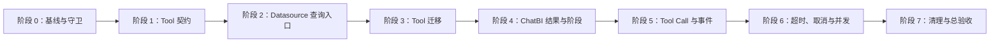

# ChatBI Agent Tool 架构实施计划

**日期：** 2026-07-29

**状态：** 阶段 0 至阶段 8 代码实施完成；总验收保留既有 Mypy 基线问题

**依据：** `17-chatbi-agent-tool-architecture-design.md`

**实施范围：** Tool 核心契约、ChatBI 工具编排、Datasource 安全查询入口、公共 Semantic Tool、Tool Call 持久化、Event、Trace、超时与清理

## 1. 目标与范围

本计划把文档 17 的目标架构拆成可以依次提交、验证和验收的实施阶段。改造保留当前 Function Calling ReAct 主循环，不引入多 Agent、LangChain Agent、LangGraph ToolNode 或新的工作流运行时。

最终需要满足以下结果：

1. `apps/tool` 只提供与 ChatBI 无关的 Tool 契约、注册、校验和通用调用机制。
2. 公共 Tool 不读取 ChatBI 可变 state，不提交 Session，不保存 Run，不发布 Event，不创建 Trace。
3. ChatBI 集中处理 Tool 结果、state、Artifact、控制动作和领域 Event。
4. Agent、Graph 和其他 SQL 调用方统一使用 Datasource 查询服务，不能绕过身份、表、行列、只读和资源限制。
5. Step 表示一次模型推理轮次，每次 Tool Call 都有独立记录、Event 和 Trace 关联。
6. 已知失败按错误类别处理，未声明程序异常使 Run 失败，不转换成可忽略的 Tool 结果。
7. LangChain 只保留在模型适配层，Tool 注册、筛选和执行使用项目自有实现。
8. 每个阶段结束后只保留一个生产入口，不保留运行期别名、双写和静默 fallback。

本次不处理以下内容：

- 多 Agent 和 Agent 间调用；
- MCP Server、`tools/list` 和 `tools/call`；
- 替换当前 ReAct 主循环；
- 重构无关的 Semantic、Knowledge、Conversation 和前端页面；
- 为未来 Agent 提前抽取统一 Agent 基类。

## 2. 当前基线

当前实现已经具备以下能力，可以在改造中保留：

- ChatBI 固定问题理解和首次澄清；
- Function Calling ReAct 循环；
- 9 个 Tool 的显式注册；
- Tool 白名单和 Pydantic 参数校验；
- SQL 执行前再次校验；
- Agent 与 Graph 共用的 `GuardedQueryService`；
- 结果样本和完整 Artifact 分离；
- Run、Step、Clarification、Event、Trace 和预算；
- 澄清挂起后的消息和派生状态恢复。

当前需要消除的主要问题如下：

| 问题 | 当前表现 | 目标状态 |
| --- | --- | --- |
| Tool 契约不足 | 只有输入模型，`success` 与 `status` 重复 | 输入输出都有模型，单一终态和明确重试建议 |
| Context 过大 | Session、全部服务、配置和可变 state 混在一起 | 可信身份只读，服务按 Tool 构造注入 |
| 状态副作用分散 | Tool 直接更新 state、Artifact 和执行结果 | ChatBI 集中投影 Tool 结果 |
| 表范围混合 | `allowed_tables` 同时表示检索范围和授权范围 | `authorized_tables` 与 `selected_tables` 分离 |
| 权限依赖可缺失 | 策略提供者缺失时存在默认允许路径 | 查询服务缺失权限提供者时明确失败 |
| 阶段门禁重复 | SQL Tool 内重复检查问题理解 | ChatBI 按阶段过滤可用工具 |
| 通用层认识工具名 | `clarify`、`finish`、`execute_sql` 被写死 | 通用层只读取结构化属性和结果 |
| Step 与调用混合 | 一轮多个调用覆盖同一个 Step | 每个调用使用独立 Tool Call 记录 |
| 失败分类不足 | 多类错误都成为普通 Tool 错误 | 参数、拒绝、领域失败、中断、程序异常分开 |
| 超时语义不准确 | 线程池停止等待但不能取消底层操作 | 驱动和客户端真实超时，准确记录取消状态 |

实施前先运行现有测试并保存结果，作为回归基线。基线失败必须单独记录，不能在本改造中顺带修改无关问题。

## 3. 实施原则

### 3.1 业务不变量

以下规则在所有阶段都必须成立：

1. 模型不能提交可信身份、数据源授权范围和表级授权范围。
2. `effective_tables = authorized_tables ∩ selected_tables`，空授权范围表示无权访问，不能解释成跳过检查。
3. `execute_sql` 必须自行重新完成安全校验，不能信任之前的 `validate_sql` 结果。
4. 权限提供者、查询执行器等安全关键依赖缺失时明确失败。
5. Tool 返回的模型内容必须限长和脱敏，完整结果不进入模型、Event、Trace 属性和指标标签。
6. Tool 不直接改变 Run、Step、Event、SSE、Trace 和 ChatBI 生命周期。
7. Trace 关闭或故障不能改变 Tool、Event、SSE、Run 和最终回答。
8. 未声明程序异常不能被宽泛捕获并转换成模型可继续忽略的失败。

### 3.2 改动原则

- 每个阶段只修改达成该阶段目标所需的代码，不进行无关重构。
- 同一个业务不变量只保留一个实现入口，调用方不得复制安全规则。
- 不为每个工具建立只调用一次的结果处理类，ChatBI 使用一个集中结果处理组件。
- 不使用自动扫描注册 Tool，工具集合继续在 composition 中显式组装。
- 不增加旧类型到新类型的长期适配层；阶段内一次性更新生产调用方和测试。
- 可选依赖导入失败时使用明确抛出 `ImportError` 的存根或惰性加载函数，禁止把导入失败对象赋值为 `None`。
- 新增或修改 Python 业务代码使用中文注释。

### 3.3 提交要求

每个阶段可以拆成多个提交，但每个提交都应满足：

- 代码可以导入；
- 受影响的定向测试通过；
- 不出现两个可被生产 composition 选择的实现；
- 数据库迁移提交不能早于 ORM 和仓储已经准备好，也不能晚于生产代码开始写新表；
- 删除旧入口必须和最后一个调用方迁移在同一阶段完成。

## 4. 前置决策

下列事项必须在对应阶段编码前确认。未确认时可以编写接口和测试样例，但不能接入生产入口。

| 决策 | 建议方案 | 最迟确认阶段 |
| --- | --- | --- |
| 表级授权来源 | Access Control 提供用户、工作空间、数据源下的明确授权表集合；空集合表示无权限 | 阶段 2 |
| 全表授权表达 | 由权限服务解析成当前数据源的明确表集合，不使用空列表或 `None` 表示全表 | 阶段 2 |
| Tool 结果模型 | 为 9 个 Tool 分别定义结果模型；无业务数据使用明确空模型 | 阶段 1 |
| 错误码 | 建立稳定错误码表，区分参数、权限、安全、SQL、临时故障、取消和程序错误 | 阶段 1 |
| 运行中消息快照 | 发布前清空或结束 `running/waiting_user` Run，或提供一次性消息数据迁移；不在运行时兼容两种消息协议 | 阶段 1 |
| 直接回答 | 建议非问数消息允许直接回答；问数消息必须有成功执行结果后才能结束 | 阶段 4 |
| 历史 Agent 数据 | 开发数据可清理则在迁移说明中明确；需要保留则编写一次性迁移，不运行期猜测 | 阶段 5 |
| 前端事件切换 | 后端与前端在同一交付批次切换到 `tool_call_id` 和 `tool.failed` | 阶段 5 |
| 连接器取消能力 | 逐个确认 PostgreSQL、MySQL、SQL Server、Oracle、ClickHouse 等驱动的超时和取消方式 | 阶段 6 |

表级授权来源是阶段 2 的阻断项。如果当前 Access Control 只能提供行过滤和禁止字段，应先扩展其公开接口，再开始 Datasource 查询服务迁移。

## 5. 实施顺序

各阶段依赖关系如下：



阶段 1 先稳定 Tool 输入输出和模型边界；阶段 2 再建立所有调用方不能绕过的查询安全入口；阶段 3 和阶段 4 才移动 Tool 并收回 ChatBI 状态；阶段 5 在调用语义稳定后修改持久化和前端；阶段 6 最后替换底层超时，避免同时调整过多运行语义。

## 6. 阶段 0：基线与架构守卫

**完成状态：** 已于 2026-07-28 完成。当前实现清单和验证结果见 `19-chatbi-agent-tool-current-baseline.md`。

### 6.1 目标

固定当前行为，建立能够阻止依赖方向回退的测试，再开始结构改造。

### 6.2 任务

1. 记录 9 个 Tool 的当前输入、输出、副作用、服务依赖和失败类型。
2. 为当前多 Tool Call、SQL 权限、澄清恢复、Artifact 和 Event 行为补齐缺失的回归样例。
3. 扩展架构测试，至少表达以下目标规则：
   - `apps/tool` 不导入 `apps/chatbi`；
   - Datasource、Semantic、Knowledge 领域服务不导入具体 Tool；
   - 公共 Tool 不导入 ChatBI state、生命周期、Event 和 Trace；
   - LangChain 不进入 Datasource、Semantic、Knowledge 和 Tool 领域契约。
4. 保存定向测试和完整后端测试结果。
5. 确认当前 Alembic head。当前仓库基线为 `096_remove_agent_event_compat`，实施时如果 head 已变化，以实际 head 为准。

### 6.3 主要文件

- `backend/tests/tool/`
- `backend/tests/agent/`
- `backend/tests/chatbi/test_query_service.py`
- `backend/tests/architecture/`
- `backend/tests/event/`

### 6.4 完成标准

- 已有行为有可重复的测试基线；
- 架构守卫能够在引入反向依赖时失败；
- 没有修改生产行为；
- 基线失败已有独立记录。

## 7. 阶段 1：Tool 核心契约和模型适配边界

**完成状态：** 已于 2026-07-28 完成代码实施与验证。

**实施结果：**

- 新增项目自有 `ToolDefinition`、`ToolCall`、`ToolCallContext`、`ToolExecutionPolicy`、`ToolResult` 和 `AgentMessage`/`ModelDecision`；
- 9 个生产 Tool 均声明输入、输出模型和执行属性，并统一返回新 `ToolResult`；
- Registry 统一处理白名单、参数校验、无副作用 validator、输出模型校验与 Schema 导出，未声明异常继续向 ChatBI 执行层传播；
- LangChain 只保留在 `DefaultAgentModelClient` 适配器内，`apps/tool`、Agent 状态和 Run 消息快照不再依赖 LangChain 消息类型；
- 删除旧 `ToolOutput`、`apps/tool/messages.py`、双状态和 `payload._trace`；
- 定向 Tool、Agent、架构测试 213 项通过，完整后端测试通过，Ruff 检查通过。

**发布前操作：** 当前实现不在运行时兼容旧 LangChain 消息快照。发布前必须结束或清理 `running`、`waiting_user` 状态的旧 Agent Run；如果环境要求保留这些 Run，则应先执行一次性消息快照迁移。

### 7.1 目标

一次性建立新的 Tool 契约，更新全部 9 个 Tool 和模型调用方，不长期保留旧 `ToolOutput` 转换。

### 7.2 Tool 核心任务

1. 新增与模型厂商无关的 `ToolDefinition`：
   - `name`、`title`、`description`；
   - `input_schema`、`output_schema`；
   - 只读、破坏性、幂等等行为提示。
2. 新增 Tool 执行上下文：
   - `tool_call_id`；
   - 截止时间；
   - 取消信号；
   - Trace 关联信息，但不进入业务结果。
3. 新增 Tool 执行策略：
   - `side_effect=read|write`；
   - `concurrency=parallel_safe|serial`；
   - `timeout_seconds`。
4. 新增 `args_validator` 协议，只允许无副作用的跨字段和可信上下文校验。
5. 替换 Tool 结果：
   - 终态：`succeeded`、`rejected`、`failed`、`interrupted`；
   - `model_content`、`data`、`metadata`；
   - `error_code`、错误类别、`retry_advice` 和结构化详情。
6. Registry 只负责白名单、参数校验、结果模型校验、通用调用和 Schema 导出。
7. Pydantic 或 validator 失败返回参数失败和 `correct_input`，不得标记成权限拒绝。
8. 删除 `success + status` 双状态和 `payload._trace`。
9. 删除把全部未知异常转换为 `tool_exception` 的默认中间件；未知异常向 ChatBI 执行层传播。

### 7.3 模型边界任务

1. 保留 `AgentModelClient`，将稳定接口改为项目自有类型：
   - `AgentMessage`；
   - `ToolDefinition`；
   - `ToolCall`；
   - `ModelDecision`。
2. 在 LangChain 模型适配器内部完成：
   - 项目消息到 LangChain Message 的转换；
   - `ToolDefinition` 到 `bind_tools()` 参数的转换；
   - `AIMessage.tool_calls` 到项目 `ToolCall` 的转换；
   - Token 使用信息归一。
3. `AIMessage`、`HumanMessage`、`SystemMessage` 和 `ToolMessage` 不进入 Tool 核心、ChatBI 持久化模型和领域服务。
4. 将 `apps/tool/messages.py` 中依赖 LangChain 消息类型的折叠、补齐和格式化逻辑移到 ChatBI 消息处理或模型适配模块；`apps/tool` 不再保存 Agent 消息协议。
5. Run 的消息快照改为项目自有消息 DTO 的 JSON 结构，并按第 4 章确认的方式处理发布时仍在运行或等待用户的旧 Run。
6. 不新增直接 OpenAI SDK 的第二套生产调用入口。

### 7.4 目标文件

```text
backend/apps/tool/
├── base.py
├── definition.py
├── context.py
├── result.py
├── validation.py
├── registry.py
├── middleware.py
└── adapters/openai.py

backend/apps/chatbi/orchestration/agent/
├── model_client.py
├── reasoning.py
├── state.py
└── preparation.py
```

### 7.5 测试

- 9 个 Tool 的输入和输出 Schema；
- OpenAI Function Calling 格式转换；
- MCP 兼容字段形状，但不实现 MCP；
- validator 在 Pydantic 校验之后执行；
- 输出模型校验失败使 Run 失败；
- `metadata` 不进入模型消息和 Event；
- 未注册、重复注册和非法参数；
- 未声明异常不会变成普通 Tool 失败；
- LangChain 类型依赖守卫。

### 7.6 完成标准

- 全部生产 Tool 只使用新契约；
- 旧 `ToolOutput`、旧状态枚举和旧转换入口已经删除；
- `apps/tool` 不依赖 LangChain 和 ChatBI；
- 模型调用仍能正确绑定 Tool 并解析一轮多个 Tool Call。

## 8. 阶段 2：Datasource 安全查询统一入口

**完成状态：** 已于 2026-07-28 完成代码实施与验证。

**实施结果：**

- Datasource 新增公开查询请求、身份、策略、驱动结果和查询结果模型，并由 `DatasourceQueryService` 统一完成权限解析、安全校验、行策略改写、二次校验、执行和结果归一；
- 查询服务构造时必须显式提供权限提供者和执行器，不存在默认允许实现；
- Access Control 的 `DataPolicy` 新增 `authorized_tables`。当前授权来源是用户工作空间下数据源策略目录返回的明确物理表集合；当前数据模型尚无独立表授权配置，因此工作空间内可访问数据源的表会展开为该数据源的全部明确物理表，后续增加细粒度表授权时只调整权限提供者，不改变查询服务契约；
- 固定执行 `effective_tables = authorized_tables ∩ selected_tables`，授权表、选中表或交集为空均拒绝，SQL 使用交集外物理表也拒绝；
- SQL 规则使用 AST 识别 CTE 内外的真实物理表并排除 CTE 别名；行策略写入物理表所在查询层；存在禁止字段时拒绝显式字段和 `SELECT *`，避免列权限绕过；
- Agent、Graph、历史记录 `data_live` 和 Dashboard 图表刷新均切换到同一个 Datasource 查询服务；Dashboard 在执行保存的 SQL 前先校验资源所有权；
- Physical Schema 按同一身份、授权表和禁止字段过滤；Agent 和 Graph 的语义检索结果按数据集执行数据源对应的授权表递归过滤候选、槽位和多查询计划；
- 删除 `GuardedQueryService`、`SQLPermissionService`、旧 SQL Validator、旧 ChatBI 查询执行适配器和 Graph 权限适配器，生产代码中不再存在绕过统一入口的直接查询调用；
- 临时驱动错误返回 `same_input`，非临时 SQL/字段类驱动失败返回 `correct_input`，未声明异常不被宽泛捕获为普通查询失败；
- 阶段 2 定向测试与架构守卫 328 项通过，完整后端测试 1227 项通过，Ruff 和差异检查通过。

### 8.1 目标

把身份、表范围、行列权限、SQL 安全、LIMIT、超时和执行顺序收敛到 Datasource 领域服务，使 Agent、Graph 和普通调用方无法绕过。

### 8.2 任务

1. 在 Datasource 定义查询请求和结果模型，可信字段与模型参数分开。
2. 定义必需的数据策略提供者接口，至少返回：
   - 是否允许访问数据源；
   - `authorized_tables`；
   - 行过滤规则；
   - 禁止字段或允许字段规则。
3. 权限提供者缺失时在服务构造阶段明确报配置错误，不能创建默认允许实现。
4. 查询服务按固定顺序执行：
   1. 获取授权范围；
   2. 计算 `effective_tables`；
   3. 校验单语句、只读、表范围和 LIMIT；
   4. 应用行列权限；
   5. 再次确认改写后 SQL 仍满足安全约束；
   6. 使用驱动执行；
   7. 归一字段、样本行、总行数和内部完整结果引用。
5. Schema 读取也使用身份和授权表范围，在返回字段前过滤无权访问的表和列。
6. 语义检索结果在返回 ChatBI 前过滤无权访问的物理表，避免元数据泄露。
7. Agent 和 Graph 在同一阶段切换到新查询服务。
8. 删除 `GuardedQueryService.run()`、默认 `SQLPermissionService()` 和其他旧查询入口。

### 8.3 目标文件

```text
backend/apps/datasource/
├── contracts.py
├── models/dto/query.py
├── models/rules/sql_query.py
├── services/query_service.py
└── repository/connectors/

backend/apps/access_control/
backend/apps/chatbi/composition.py
backend/apps/chatbi/orchestration/graph/
```

### 8.4 测试矩阵

| 场景 | 预期 |
| --- | --- |
| 授权表与选中表有交集 | 只允许交集内表 |
| 选中表为空 | 根据明确的业务规则拒绝或要求先选择，不能跳过检查 |
| 授权表为空 | 拒绝执行 |
| SQL 使用交集外表 | `rejected + never` |
| 非只读或多语句 | `rejected + never` |
| 行权限 | 改写后的 SQL 包含正确过滤条件 |
| 禁止字段 | 执行前拒绝 |
| 权限提供者缺失 | 配置错误，不创建服务 |
| 驱动返回临时错误 | 归类为 `same_input` |
| SQL 语法或字段错误 | 归类为 `correct_input` |

### 8.5 完成标准

- Agent 和 Graph 都使用同一个 Datasource 查询服务；
- 空授权范围不会放行；
- Schema、语义检索和 SQL 执行使用一致的授权范围；
- 旧 ChatBI 查询服务和兼容方法已经删除；
- 领域服务测试可以在不创建 Agent 的情况下独立运行。

## 9. 阶段 3：公共 Tool 和 ChatBI Tool 迁移

**完成状态：** 已于 2026-07-28 完成代码实施与验证。

**实施结果：**

- 在 `apps/tool/tools` 新增最小可信上下文协议，以及 Datasource、Semantic、Knowledge 三组公共 Tool；`apps/tool/__init__.py` 不导入具体 Tool；
- `get_dataset_schema`、`validate_sql`、`execute_sql`、`search_terminology`、`get_sql_examples` 已从 ChatBI Tool 文件迁出，不保留别名或转发实现；
- 阶段 3 首先迁移 5 个公共 Tool；阶段 8 再迁移 `search_semantic_assets` 和 `compile_semantic_sql`。当前 7 个公共 Tool 均通过构造函数显式注入领域服务，不读取 ChatBI state、Session、Artifact、Event 或 Trace，也不在 `execute()` 中调用 composition；
- `execute_sql` 改为只读 Tool，只返回受限样本与内部完整数据 metadata。ChatBI 在 Tool 执行边界保存完整结果 Artifact、计算 SQL 来源并投影 `last_execution`，公共 Tool 不再承担 ChatBI 副作用；
- `get_dataset_schema` 不再直接更新 ChatBI state，ChatBI 执行边界根据成功结果更新可信选表范围；
- `clarify`、`finish` 保留为 ChatBI 控制 Tool；`search_semantic_assets` 和 `compile_semantic_sql` 已在阶段 8 移入公共 Semantic Tool；
- SQL Tool 不再重复检查问题理解阶段，阶段门禁由 ChatBI 编排负责；语义资产来源校验仍保留在 ChatBI 编译 Tool；`clarify` 和 `finish` 只返回结构化请求或结果；
- ChatBI composition 显式构造并注册全部 9 个 Tool，所有 Tool 均声明输入模型、输出模型、执行属性和超时时间；
- 架构守卫区分通用 Tool Runtime 与公共业务 Tool：Runtime 仍禁止业务领域依赖，公共 Tool 可依赖领域公开契约但禁止依赖 ChatBI、Conversation、Access Control、Event 和 Trace；
- 公共 Tool 的成功、授权拒绝、配置失败、临时查询失败和副作用边界均有独立测试；完整后端测试 1234 项通过，Ruff 和差异检查通过。

### 9.1 目标

按领域移动可复用 Tool，拆除它们对 ChatBI state 和完整 Context 的依赖。

### 9.2 公共 Tool

移动到 `apps/tool/tools`：

- Datasource：`get_dataset_schema`、`validate_sql`、`execute_sql`；
- Semantic：`search_semantic_assets`、`compile_semantic_sql`、`search_terminology`；
- Knowledge：`get_sql_examples`。

每个公共 Tool 必须：

- 构造函数只注入自身需要的领域服务；
- Context 只读取可信身份和范围；
- 返回经过结果模型校验的数据；
- 不读取或修改 ChatBI state；
- 不临时调用 `build_*_service(session)`；
- 不保存 Artifact 和发布事件。

### 9.3 ChatBI 控制 Tool

保留在 ChatBI：

- `clarify`；
- `finish`。

其中：

- 问题理解门禁不再重复进入 SQL Tool；
- `clarify` 只返回澄清请求；
- `finish` 只返回回答和图表建议，不结束 Run。

### 9.4 Composition

1. ChatBI composition 显式构造并注册 9 个 Tool。
2. `apps/tool/__init__.py` 不自动导入具体 Tool。
3. Tool 不允许在 `execute()` 内临时组装服务。
4. 同一服务的真实 Session 和线程约束在 composition 中可判断。

### 9.5 完成标准

- 公共 Tool 不导入 ChatBI；
- 所有 Tool 都有明确依赖、结果模型、执行策略和超时声明；
- 9 个 Tool 的成功、拒绝和已知失败测试通过；
- 原 ChatBI Tool 文件中不再保留公共 Tool 的别名或转发实现。

## 10. 阶段 4：ChatBI 结果处理和阶段化工具暴露

**完成状态：** 已于 2026-07-28 完成代码实施与验证。

**实施结果：**

- 新增 `tool_results.py`，由 `ChatBIToolResultProcessor` 统一把 Tool 返回值解释为状态补丁、控制动作、审计摘要和领域事件建议；语义包、合法资产、选表、编译 SQL、SQL 来源、执行摘要和 Artifact 保存不再散落在 Tool 与执行器中；
- 生产 Tool 不再直接修改 ChatBI state 或保存 Artifact。`AgentToolExecutor` 只在统一边界应用状态补丁，并处理 `clarify`、`finish` 两类控制动作；
- 新增 `tool_visibility.py`，正常模式按问题理解、语义准备、关键歧义和成功查询结果计算可见 Tool；soft budget 只暴露当前合法的 `clarify` 或 `finish`，无合法收口动作时直接进入预算收口；
- 通用 `BudgetGuard` 只保留步数、Token、墙钟和重复调用预算；新增 `ChatBIBudgetPolicy` 管理 SQL 修正与澄清预算，并统一合并、持久化和恢复预算快照；
- SQL 修正只在 `correct_input` 失败后提交不同 SQL 时计数，相同 SQL 或临时错误不计数；权限和安全约束仍由统一 Datasource 查询服务最终校验；
- 问数消息只有存在成功查询结果后才能直接回答或 `finish`，工具失败、未知工具和澄清预算拒绝均不能以普通文本伪装成功；已有查询结果时仍可按预算安全收口；
- 更新 Agent、Tool 与架构测试，覆盖阶段可见性、soft budget、SQL 修正计数、Tool 无状态副作用、Artifact 集中保存、澄清恢复和直接回答限制；完整后端测试 1237 项通过，Ruff 和差异检查通过。

### 10.1 目标

把 Tool 返回结果对 ChatBI 的含义集中到一个地方，并让主流程直接表达可用工具、状态更新、SQL 修正、澄清和结束条件。

### 10.2 集中结果处理

新增 `tool_results.py`，集中处理：

- 语义包和合法资产集合；
- `selected_tables`；
- 编译 SQL 和 SQL 来源；
- SQL 执行摘要与完整结果内部对象；
- Artifact 保存；
- `clarify` 控制请求；
- `finish` 控制请求；
- `sql.generated`、`sql.validated`、`sql.executed` 等领域事件建议。

结果处理返回结构化状态补丁、控制动作和领域事件，不直接在 Tool 内修改共享字典。

### 10.3 阶段化工具集合

ChatBI 根据状态计算当前可用 Tool：

| 阶段 | 可用工具 |
| --- | --- |
| 问题理解未通过 | 不进入工具循环，执行确定性澄清 |
| 语义准备 | 语义检索、术语、SQL 示例、Schema |
| 已有语义资产或 Schema | 编译、校验、执行，以及必要的补充检索 |
| 存在关键歧义 | `clarify` |
| 已有成功查询结果 | `finish` |
| soft budget | 只暴露当前合法的收口动作 |

工具可见性只控制 ChatBI 流程，不能代替领域权限和 SQL 安全校验。

### 10.4 预算和重试

1. 步数、Token、墙钟和重复调用属于通用预算。
2. SQL 修正次数、澄清次数和 soft budget 收口策略属于 ChatBI。
3. 只有模型在 `correct_input` 后生成不同 SQL 并再次调用时，才增加 SQL 修正次数。
4. 领域服务相同输入的临时重试不计入 Agent SQL 修正次数。
5. 权限、安全拒绝不能通过重新提交相同或变形参数绕过。
6. 拆分当前 `BudgetGuard`：通用部分不认识 `clarify`、`finish` 和 SQL，ChatBI 预算负责这些业务规则。

### 10.5 直接回答

编码前落实第 4 章的决策。建议规则为：

- 问题理解判断为非问数消息时允许直接回答；
- 问数消息没有成功执行结果时不能以普通回答伪装成功；
- 有明确失败时应返回失败或受控说明，不生成看似来自数据库的答案；
- `finish` 的图表字段必须来自真实执行结果。

### 10.6 完成标准

- Tool 不再修改 ChatBI state 和 Artifact；
- `AgentToolExecutor` 不再散落 9 个工具的状态更新逻辑；
- 正常模式也按阶段过滤 Tool，不再仅在 soft budget 过滤；
- SQL 修正、临时重试和权限拒绝计数正确；
- 澄清挂起和恢复测试通过。

## 11. 阶段 5：Tool Call 持久化、Event、Trace 和前端

**完成状态：** 已于 2026-07-28 完成代码实施与验证。

**实施结果：**

- 新增 Alembic 迁移 `097_chatbi_agent_tool_call` 和 `ChatbiAgentToolCall` 模型，以 `(run_id, tool_call_id)` 保证调用唯一性，并按 `(run_id, step_id)` 建立查询索引；本地测试数据库已升级到 097 head；
- Step 保留为模型推理轮次，不再写入单个 Tool 的名称、参数和结果；同一轮中的每个 Tool Call 独立记录开始、成功、拒绝、失败或中断状态、摘要、错误码和耗时；
- Tool Call 记录与对应 `tool.called`、`tool.completed` 或 `tool.failed` 事件在同一应用层事务提交，提交成功后才返回 SSE 事件；`EventPublisher` 只追加事件并构造渲染对象，不再无条件提交 Session；
- Tool 事件统一携带 `tool_call_id`、`step_id`、状态及限长脱敏摘要，块标识调整为 `tool:{run_id}:{tool_call_id}`；SQL 和图表领域事件引用同一个 Tool Call；
- 每个 Tool Call 使用独立 Trace span，记录 Agent、Run、Step、Tool Call ID、工具名、终态、错误类别、实际耗时和领域重试次数；SQL、完整参数、完整结果、用户问题和凭证不进入 Trace 属性；
- Timeline 接口新增 `tool_calls`，会话删除同步清理 Tool Call；前端按 `tool_call_id` 投影独立工具块，支持同一 Step 多调用和 `tool.failed`，单个失败不会覆盖同轮其他调用；
- SSE 实时事件与按 sequence 补拉事件使用同一渲染契约，前端按 `(run_id, sequence)` 去重；Observation 仍按模型原始调用顺序回写；
- 完整后端测试 1237 项通过，Ruff 和差异检查通过；前端 Timeline 测试 10 项、TypeScript 检查和定向 ESLint 均通过。

### 11.1 目标

让一次模型推理中的每个 Tool Call 都有独立且一致的数据库记录、产品事件、Trace span 和前端展示。

### 11.2 数据库迁移

从实施时的 Alembic head 新增迁移，当前基线可命名为 `097_chatbi_agent_tool_call`，如果 head 已变化则调整 revision 和 down revision。

新增 `chatbi_agent_tool_call`：

- `id`；
- `run_id`、`step_id`；
- `tool_call_id`；
- `tool_name`；
- `status`；
- `args_summary`、`result_summary`；
- `error_code`；
- `started_at`、`finished_at`、`latency_ms`。

约束：

- `(run_id, tool_call_id)` 唯一；
- 按 `run_id、step_id` 提供查询索引；
- Step 不再作为单个工具调用的事实来源；
- 是否删除 Step 上的旧字段根据历史数据决策一次完成，不双写。

### 11.3 仓储与事务

新增 Tool Call 的开始、成功、拒绝、失败和中断方法。每次开始和结束遵守：

1. 创建或更新 Tool Call；
2. 追加对应 Event；
3. 同一事务提交；
4. 提交成功后返回 `RenderEvent`，SSE 才能发送。

调整 `EventPublisher`，避免其无条件提交 Session 中所有待处理对象。事务由 ChatBI 应用层统一控制，Event 层只追加事件并构造渲染对象。

### 11.4 Event

每个调用使用：

- 开始：`tool.called`；
- 成功：`tool.completed`；
- 拒绝或失败：`tool.failed`。

事件至少包含：

- `tool_call_id`；
- `step_id`；
- `tool_name`；
- 调用状态；
- 限长、脱敏的参数或结果摘要。

Tool block ID 改为 `tool:{run_id}:{tool_call_id}`。SQL 领域事件引用同一个 `tool_call_id`。

### 11.5 Trace

每个 Tool Call 创建独立 span，记录：

- Agent、Run、Step、Tool Call ID；
- 工具名称、终态和错误类别；
- 实际耗时和领域服务同请求重试次数。

SQL 全文、完整参数、完整结果、用户问题和凭证不进入 span 属性。

### 11.6 前端

更新：

- `frontend/src/views/chat/answer/agentEventReducer.ts`；
- `frontend/src/views/chat/execution-component/agentTimelineProjection.ts`；
- Timeline 相关测试。

前端按 `tool_call_id` 建立独立 Tool block，同一个 Step 下可以显示多个调用；`tool.failed` 显示失败状态，不能覆盖同一轮的其他调用。

### 11.7 完成标准

- 一轮两个以上 Tool Call 各自有记录、Event、Trace 和前端块；
- Observation 仍按模型原始调用顺序写回；
- Tool Call 状态和 Event 不出现部分提交；
- SSE 实时内容与按 sequence 补拉内容一致；
- Trace 关闭和导出故障不影响产品结果；
- Timeline 不再依赖 Step 上的单一 `tool_name`。

## 12. 阶段 6：并发、超时、取消和失败处理

**完成状态：** 已于 2026-07-28 完成代码实施与验证。

**实施结果：**

- 通用并发模块只依据 `ToolExecutionPolicy.concurrency` 分批，不再识别具体工具名；共享 SQLAlchemy Session 的生产 Tool 均保持串行，只有明确声明 `parallel_safe` 且依赖线程安全的 Tool 才能并发；
- 并发批次仍按模型调用顺序返回结果；新增 `ToolBatchExecutionError` 保存每个调用的实际结果，使部分成功、已知失败和程序异常能够分别落库，首个未声明异常继续上抛并使 Step、Run 失败；
- 删除单 Tool 的线程池超时中间件，线程池只承担已声明安全的并发调度；有效超时统一取 Tool 声明或默认值、系统最大值和 Run 剩余时间的最小值，并通过 `ToolCallContext` 向领域服务传递截止时间与取消信号；
- Datasource 查询服务在执行前检查剩余时间，并把剩余时间下沉到连接层；PostgreSQL SQLAlchemy 路径设置事务级 `statement_timeout`，其他连接器使用已有驱动连接、读取或语句超时配置；截止时间到达后不再启动驱动调用；
- 语义检索把剩余时间传入检索总超时、HTTP Embedding 超时和 PostgreSQL 检索语句超时；没有截止时间时不改变原公开服务调用方式；
- 相同输入的临时 Datasource 错误在领域服务内按配置重试，成功和耗尽均记录 `retry_count`，不占用 Agent SQL 修正预算；
- 新增数据库 Run 取消信号和 `cancellation_requested` 状态。运行中的取消请求只记录“已请求取消”，由执行循环在安全检查点收口为 `cancelled`；等待用户或尚未运行的 Run 可以立即取消；
- Tool 默认不声明支持执行中取消。对于不支持的底层执行，事实记录明确说明底层操作会继续到返回且可能已经完成，不再虚构已主动终止；取消、截止时间及底层操作状态进入 Tool Call 审计摘要；
- 新增 `run.cancelled` 事件及前端投影，运行中 Tool 节点会在取消事件后正确结束；
- 测试覆盖有效超时取最小值、截止时间前拒绝启动、临时错误重试成功与耗尽、并发顺序、部分成功、已知失败、未声明异常、运行中取消请求及等待态立即取消；完整后端测试 1244 项通过，Ruff 变更范围检查通过；前端 Timeline 测试 11 项、TypeScript 检查和定向 ESLint 均通过。

### 12.1 目标

替换当前线程池超时和按工具名分批逻辑，使运行行为与真实底层能力一致。

### 12.2 并发

1. 只根据 `concurrency` 属性分批，不识别 `clarify`、`finish` 等名称。
2. 使用共享 SQLAlchemy Session 的调用保持串行。
3. `parallel_safe` Tool 必须使用线程安全依赖或独立 Session。
4. 并发完成顺序不改变 Observation 写回顺序。
5. 控制动作出现后，尚未开始的调用不再执行。
6. 并发线程的未声明异常传播到 ChatBI 执行层，不转换成普通结果。

### 12.3 超时和取消

按以下规则计算有效超时：

```text
effective_timeout = min(
    Tool 声明超时或系统默认值,
    系统最大 Tool 超时,
    Run 剩余时间,
)
```

分别落实：

- 数据库使用驱动或数据库 statement timeout；
- HTTP 和检索使用连接、读取和总请求超时；
- 支持取消的执行器接收取消信号；
- 不支持取消时记录“调用方停止等待，底层操作可能继续”；
- 截止时间到达后不启动后续调用。

删除 `ThreadPoolExecutor` 单工具超时中间件。并发线程池如果继续使用，只负责已声明安全的并发调度，不承担取消语义。

### 12.4 失败测试

- 参数错误；
- 权限和只读拒绝；
- SQL 语法和字段错误；
- 临时连接错误重试后成功；
- 临时错误重试耗尽；
- Tool 截止时间；
- 用户取消；
- 不支持底层取消；
- 未声明异常；
- Trace 故障；
- 并发调用部分成功、部分已知失败和程序异常。

### 12.5 完成标准

- 运行时不再宣称已经取消无法取消的操作；
- SQL、HTTP 和检索都有真实超时配置；
- 通用并发模块不认识具体工具名；
- 未声明异常使 Tool Call 和 Run 正确失败；
- 已知失败的重试行为符合错误矩阵。

## 13. 阶段 7：清理、文档和总验收

**完成状态：** 已于 2026-07-28 完成代码清理、数据库迁移、文档同步和功能验收。项目既有 Mypy 基线未在本阶段清零。

**实施结果：**

- 删除旧 ChatBI `ToolResult(success, payload)` DTO 和公共导出，Graph SQL 适配测试使用测试文件内局部返回类型；生产 Tool 只保留 `apps.tool.ToolResult`；
- 新增迁移 `098_remove_agent_step_tool_facts`，删除 `chatbi_agent_step.tool_name` 和 `args_summary`；Step 只保存推理轮次事实，工具名称、参数、结果和耗时由 `chatbi_agent_tool_call` 保存；
- Timeline Step 后端响应和前端类型同步删除旧字段，工具展示只读取 Tool Call 或产品 Event；
- 全仓确认生产代码不存在旧 `ToolOutput`、`TimeoutMiddleware`、`GuardedQueryService`、`payload._trace`、旧 ChatBI 公共 Tool 转发入口和通用层具体工具名并发判断；
- LangChain 只存在于 ChatBI 模型适配相关模块，不进入 Tool、Datasource、Semantic 和 Knowledge 领域契约；
- 同步 `BACKEND_STRUCTURE.md`、文档 16、文档 17、兼容台账和迁移变更日志，当前实现、Event 事务、Tool Call、超时和取消描述与代码一致；
- 本地 PostgreSQL 完成 `097 → 098 → 097 → 098`，验证升级、降级和再升级，最终位于 `098_remove_agent_step_tool_facts`；
- 架构守卫 124 项、完整后端测试 1244 项、前端 Timeline 11 项、前端生产构建、变更范围 Ruff、定向 ESLint 和差异格式检查均通过；生产构建仅有既有包体积警告；
- 全目录 Mypy 仍有 288 项项目既有错误；本阶段涉及的旧 ORM/仓储文件有 48 项既有类型错误，主要来自 SQLModel 类型识别、裸集合类型和旧仓储参数未注解。该问题未通过总验收，不在 Tool 架构清理中扩大修改范围。

### 13.1 清理

删除：

- 旧 Tool 契约、状态和输出类型；
- `payload._trace`；
- 旧 ChatBI 公共 Tool 文件和转发入口；
- 旧 `GuardedQueryService` 和 `run()` 兼容方法；
- 通用层按 `clarify`、`finish`、`execute_sql` 名称判断的代码；
- 线程池单工具超时中间件；
- Step 上不再使用的工具事实字段；
- 已失效测试、Fixture 和文档描述。

使用全仓搜索确认没有旧入口调用方。禁止保留“暂时兼容”但没有删除日期和唯一调用方的代码。

### 13.2 文档

同步更新：

- `BACKEND_STRUCTURE.md`；
- `16-agent-event-and-observability-trace-design.md`；
- `17-chatbi-agent-tool-architecture-design.md` 的实现状态；
- API、SSE 和 Timeline 契约说明；
- 数据库迁移和开发环境数据处理说明。

### 13.3 总验收

逐项验证文档 17 第 14.4 节的 8 条验收标准，并增加：

1. LangChain 类型只出现在模型适配相关模块，不进入 Tool 和领域服务。
2. Agent 和 Graph 的 SQL 调用都能证明经过同一个 Datasource 查询入口。
3. 空授权范围、缺失权限提供者和未选表不会默认放行。
4. 前端能够在同一个 Step 下展示多个 Tool Call。
5. 数据库升级和降级路径在测试数据库验证通过。

## 14. 测试与验证命令

命令从 `backend` 目录执行。实施时根据实际变更补充路径，但不能用减少测试范围的方式掩盖失败。

### 14.1 Tool 契约

```bash
PYTHONDONTWRITEBYTECODE=1 uv run pytest tests/tool tests/agent/test_agent_tool_registry.py tests/agent/test_core_tools.py -q
```

### 14.2 Datasource 安全入口

```bash
PYTHONDONTWRITEBYTECODE=1 uv run pytest tests/datasource tests/access_control tests/chatbi/test_query_service.py -q
```

### 14.3 ChatBI Agent

```bash
PYTHONDONTWRITEBYTECODE=1 uv run pytest tests/agent -q
```

### 14.4 Event、持久化和恢复

```bash
PYTHONDONTWRITEBYTECODE=1 uv run pytest tests/event tests/workflow_engine/test_event_outbox.py tests/workflow_engine/test_event_stream.py -q
```

### 14.5 架构守卫

```bash
PYTHONDONTWRITEBYTECODE=1 uv run pytest tests/architecture tests/agent/test_agent_dependency_rules.py -q
```

### 14.6 静态检查

```bash
PYTHONDONTWRITEBYTECODE=1 uv run ruff check apps/tool apps/chatbi/orchestration/agent apps/datasource tests/tool tests/agent tests/datasource tests/architecture
PYTHONDONTWRITEBYTECODE=1 uv run mypy apps/tool apps/chatbi/orchestration/agent apps/datasource
```

### 14.7 数据库迁移

```bash
uv run alembic current
uv run alembic upgrade head
uv run alembic downgrade 097_chatbi_agent_tool_call
uv run alembic upgrade head
```

如果实施时 down revision 已变化，降级命令使用新迁移的实际父版本。

### 14.8 后端全量回归

```bash
PYTHONDONTWRITEBYTECODE=1 uv run pytest -q
```

### 14.9 前端

命令从 `frontend` 目录执行：

```bash
npm run build
node --test src/views/chat/execution-component/agentTimelineProjection.test.mjs
```

`npm run lint` 当前带 `--fix`，会修改文件，不作为只读验收命令；需要运行时先确认变更范围。

## 15. 提交与集成策略

建议按以下交付批次组织：

| 批次 | 内容 | 合入条件 |
| --- | --- | --- |
| A | 阶段 0 基线和守卫 | 不改变生产行为，测试稳定 |
| B | 阶段 1 Tool 契约和模型边界 | 9 个 Tool 全部切换，无旧输出契约 |
| C | 阶段 2 Datasource 查询入口 | Agent、Graph 同时切换，权限测试通过 |
| D | 阶段 3、4 Tool 迁移和 ChatBI 结果处理 | Tool 无 ChatBI 副作用，阶段工具测试通过 |
| E | 阶段 5 数据库、Event、Trace 和前端 | 后端与前端契约同步切换 |
| F | 阶段 6、7 超时和清理 | 全量回归、迁移验证和架构验收通过 |

批次之间的分支可以短期存在中间代码，但主分支和生产 composition 不允许出现两套可选实现。数据库和前端契约变更必须作为同一发布批次交付。

## 16. 风险与回滚

| 风险 | 预防措施 | 回滚边界 |
| --- | --- | --- |
| 表授权定义不完整 | 阶段 2 前确认 Access Control 契约，先写拒绝测试 | 不接入新查询服务生产入口 |
| 新结果契约遗漏字段 | 9 个 Tool 建立契约快照和结果模型测试 | 回滚整个阶段 1 提交，不保留双协议 |
| 旧消息快照无法恢复 | 发布前结束旧 Run 或执行一次性消息迁移，并验证澄清恢复 | 回滚批次 B；不启用运行期双协议解析 |
| Agent 与 Graph 行为不一致 | 同一阶段切换并运行共享服务测试 | 回滚批次 C |
| Tool 状态迁移遗漏 | 集中结果处理覆盖 9 个工具的成功和失败测试 | 回滚批次 D |
| Tool Call 迁移破坏历史数据 | 提前确认保留或清理策略，升级前备份 | 数据库降级到实际父版本并回滚批次 E |
| 前后端事件不一致 | 同批次更新事件契约和 Timeline 测试 | 后端、前端和迁移一起回滚 |
| 底层查询无法真正取消 | 分连接器声明能力，不虚构取消成功 | 保留原驱动执行，关闭该连接器的主动取消 |
| LangChain 类型继续扩散 | 架构测试限制导入方向 | 阻止相关提交合入 |

回滚只能按完整交付批次执行，不能通过运行期配置切回旧 Tool 或旧查询入口。涉及数据库结构时，先停止新版本写入，再执行对应降级迁移和应用回滚。

## 17. 交付检查表

### 17.1 开发完成

- [x] 9 个 Tool 都使用新输入、输出和错误契约。
- [x] 公共 Tool 不读取 ChatBI state。
- [x] Tool 不保存 Artifact、不发布 Event、不创建 Trace。
- [x] 服务依赖通过构造函数注入。
- [x] Tool Registry 不包含 ChatBI 工具名判断。
- [x] LangChain 只存在于模型适配边界。
- [x] `authorized_tables` 与 `selected_tables` 已分离。
- [x] 权限提供者缺失和空授权范围明确失败。
- [x] Agent 和 Graph 使用同一个 Datasource 查询入口。
- [x] ChatBI 使用集中结果处理和阶段化工具集合。
- [x] SQL 修正和领域临时重试分别计数。
- [x] 每个 Tool Call 有独立记录、Event 和 Trace。
- [x] 前端按 `tool_call_id` 展示调用。
- [x] 驱动和客户端真实超时已配置。
- [x] 旧入口、旧字段和静默 fallback 已删除。

### 17.2 测试完成

- [x] Tool 契约测试通过。
- [x] Datasource 权限和 SQL 安全测试通过。
- [x] Agent 工具选择、批量调用、澄清和结束测试通过。
- [x] Tool Call 唯一约束和事务测试通过。
- [x] Event、SSE 补拉和 Trace 隔离测试通过。
- [x] 前端 Timeline 测试和构建通过。
- [x] Alembic 升级、降级、再升级通过。
- [ ] Ruff、Mypy 和架构守卫通过。
- [x] 后端全量测试通过。

Ruff 和架构守卫已通过；该组合项仅因项目既有 Mypy 基线未清零而保留未勾选。

### 17.3 评审完成

- [x] 安全不变量只在领域服务统一表达。
- [x] 没有无关重构和只调用一次的过度抽象。
- [x] 没有宽泛异常捕获吞掉程序错误。
- [x] 没有完整 SQL、结果或敏感参数进入 Event、Trace 和指标标签。
- [x] 没有新旧协议双写、别名或运行期 fallback。
- [x] 文档 16、17、18、20 与实际实现一致。

## 18. 完成定义

本计划只有在以下条件全部满足时才算完成：

1. 文档 17 的 8 条验收标准全部通过；
2. 本文第 17 章检查项全部完成；
3. 生产 composition 只有一套 Tool 和查询实现；
4. 数据库、后端和前端可以作为同一版本部署；
5. 全量回归没有新增失败；
6. 实际项目结构和文档描述一致。

## 19. 阶段 8：Semantic Tool 公共化追加实施

**完成状态：** 已于 2026-07-29 完成代码实施与验证。

### 19.1 目标

将语义资产检索和语义 SQL 编译从 ChatBI 专属实现调整为公共 Tool，使其他 Agent 可以直接组合这两项能力，同时保持可信身份、数据权限、检索决策白名单和时间范围约束。

### 19.2 实施结果

- `search_semantic_assets` 与 `compile_semantic_sql` 移入 `apps/tool/tools/semantic.py`，ChatBI 不保留别名或转发 Tool；
- 新增 `SemanticToolContext` 与 `SemanticAssetScope`，公共 Tool 通过稳定协议读取调用方提供的可信检索请求和编译范围，不读取 ChatBI state；
- 检索 Tool 在调用 Retrieval 前获取当前授权表，并过滤返回包中明确关联未授权表的资产；
- 编译 Tool 只接受 Retrieval 决策 `allowed_asset_ids` 中的资产，并在编译前重新检查身份、数据源、数据集、授权表和已确认时间范围；
- `SemanticSQLCompilationService` 统一返回 `datasource_id` 和 `used_assets`，Agent 结果处理器只负责状态投影；
- Graph 的 `SemanticKnowledgeAdapter` 和 `SqlAdapter` 直接调用公共 Retrieval、Semantic SQL 编译及 Datasource Service，不通过 ChatBI 转发 Service，也不调用 Agent Tool；
- 删除 ChatBI 的语义检索、语义编译转发 Service、重复 DTO、错误类型和组合工厂；
- 时间范围归一化迁入 Semantic 公共模块，Retrieval、Agent 和 Graph 共用同一实现。

### 19.3 验证结果

- 完整后端回归：1241 项通过；
- 依赖基线：6 项通过；
- 变更范围 Ruff、差异格式检查通过；
- 8 个核心源文件严格 Mypy 通过，项目既有全目录 Mypy 基线未在本阶段清零；
- 架构守卫确认公共 Semantic Tool 不依赖 ChatBI，且旧转发 Service 与重复 DTO 已删除。
