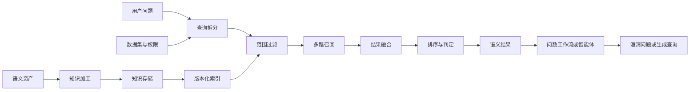
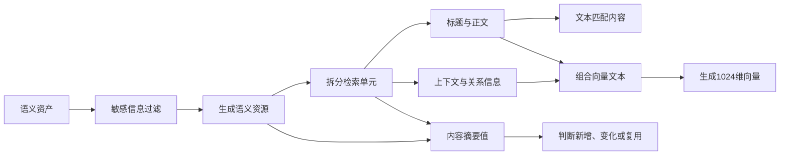
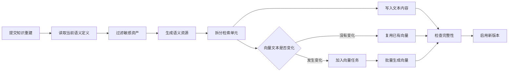
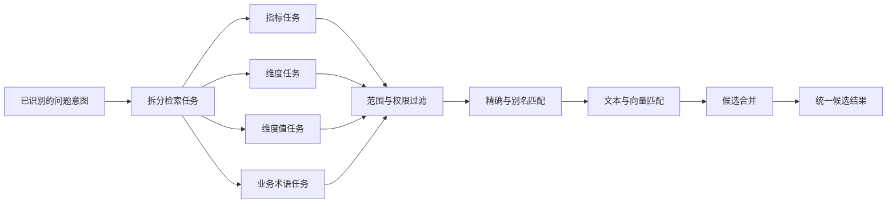
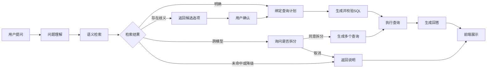

# 检索模块

## 1. 背景

语义层统一定义了数据集、模型、指标、维度和业务术语，但这些语义资产只有被准确找到后，才能在问数过程中发挥作用。随着语义资产不断增加，如果每次提问都将全部内容交给大模型，不仅会增加处理成本，还容易受到无关信息干扰，导致指标或维度选择错误。因此，语义层建设完成后还需要建立检索模块，将语义资产加工并存储为可检索的知识，再根据用户问题、数据集范围和访问权限找到最相关的内容，供问数工作流和智能体完成语义理解、查询计划生成和后续数据查询。

## 2. 架构

检索模块连接语义层与问数应用，整体过程包括知识准备和在线检索。语义资产发生新增或变更后，系统先对资产内容进行整理和安全过滤，再生成可以查询的文本索引和向量数据。用户提问时，系统根据问题内容和使用范围查找候选资产，经过结果融合、排序和判定后，将确认的指标、维度等内容提供给问数工作流或智能体使用。



知识准备不直接影响正在使用的索引。系统会先完成新版本索引的构建和检查，再将其切换为当前使用版本。在线检索只查询已经启用的索引，并始终受到数据集和访问权限限制。这样既能保证语义资产持续更新，也能避免未完成的数据或无权限内容进入问数过程。

## 3. 知识

### 3.1 知识来源

检索模块的知识来自已经完成治理的语义资产，当前包括数据集、语义模型、指标、维度、业务术语和常用维度值。模型之间的关系也会作为辅助信息，用于判断指标和维度是否可以组合使用。检索模块不直接把原始数据表或全部业务数据当作知识，而是使用语义层已经确认的名称、定义和关系。

不同知识解决的问题不同。数据集限定本次问数可以使用的范围，语义模型说明数据的业务主题，指标说明需要计算什么，维度说明按照什么角度分析，业务术语用于统一业务表达，常用维度值用于识别用户问题中的筛选条件。

### 3.2 知识加工

语义层中的一项资产通常包含名称、定义、规则、关系和权限等多类信息。如果直接把整项资产作为一段文本进行检索，名称匹配、定义匹配和使用范围容易相互干扰。当前系统先将资产转换为稳定的语义资源，再按用途拆分为多个检索单元，最后分别建立文本索引和向量数据。



#### 3.2.1 资产转换

系统以数据集为单位读取当前语义定义，并将数据集、语义模型、指标、维度、业务术语和维度值转换为不同类型的语义资源。每条资源保留原始资产标识、所属数据集、所属模型、访问权限、语义版本和业务关系等信息，确保检索结果能够重新对应到语义层中的真实资产。敏感指标、敏感维度、敏感业务术语和敏感维度值会在这一阶段被过滤，不会进入后续索引。

不同资产会根据自身特点拆分为不同的检索单元。

| 语义资产 | 形成的检索单元 | 主要内容 |
| --- | --- | --- |
| 数据集 | 身份、定义、主题域 | 数据集名称、别名、说明以及包含的主题域 |
| 语义模型 | 身份、分析范围 | 模型名称、所属主题域、可用指标和可用维度 |
| 指标 | 身份、定义、用法 | 指标名称、别名、业务定义、默认汇总方式和指标类型 |
| 维度 | 身份、定义、角色 | 维度名称、别名、业务定义、数据类型、业务角色和是否为默认时间维度 |
| 业务术语 | 定义、关联资产 | 术语名称、别名、定义以及关联的指标和维度 |
| 维度值 | 每个值形成一个检索单元 | 所属维度、标准值、展示名称和别名 |

维度值不会全部进入索引。当前系统只处理已经治理、标记为常用或明确配置允许进入索引的维度值。对于配置接入的维度，单个维度默认最多处理 200 个值，避免大量明细数据占用索引空间。

以项目中的商城店铺数据集为例，fct_stall_order_daily 是档口订单日事实表。当前数据库中，这张表包含 2026 年 6 月 1 日至 6 月 30 日的数据，共 180 行，覆盖 6 个档口。

| 数据库字段 | 字段说明 | 示例数据 |
| --- | --- | --- |
| stat_date | 统计日期 | 2026-06-01 |
| stall_id | 档口ID | 100011 |
| gmv_sale | 销售类 GMV | 16113.00 |
| order_cnt_sale | 销售订单数 | 5 |

这些业务数据不会整行写入检索库。项目基于 gmv_sale 和 order_cnt_sale 建立了“销售订单平均客单价”指标，检索模块处理的是这项指标的语义定义。

| 语义信息 | 项目中的实际内容 |
| --- | --- |
| 指标名称 | 销售订单平均客单价 |
| 业务标识 | aov_sale |
| 指标别名 | 销售客单价 |
| 所属模型 | fct_stall_order_daily |
| 使用字段 | gmv_sale、order_cnt_sale |
| 计算规则 | ROUND(SUM(gmv_sale) / NULLIF(SUM(order_cnt_sale), 0), 2) |

经过资产转换后，系统会形成一条类型为“指标”的语义资源，标题为“销售订单平均客单价”，并记录其原始资产标识、业务标识、所属数据集、所属模型、访问权限和语义版本。计算规则仍由语义层管理，不会作为普通检索正文保存。

#### 3.2.2 检索单元

一个检索单元是可以独立参与文本匹配和向量匹配的最小内容。每个单元包含标题、正文、上下文、内容类型、附加信息和语言等内容。

| 组成内容 | 处理方式 | 主要用途 |
| --- | --- | --- |
| 标题 | 保存资产名称或当前检索内容的名称 | 用于精确名称匹配和文本匹配 |
| 正文 | 按“信息名称：信息内容”的形式整理 | 用于文本匹配和语义理解 |
| 上下文 | 补充所属数据集等范围信息 | 参与向量生成，帮助区分相似资产 |
| 附加信息 | 保存别名、资产标识、模型标识和关联资产等结构化内容 | 用于别名匹配、范围过滤和关系判断 |
| 内容摘要值 | 根据完整内容生成固定摘要 | 判断内容是否发生变化 |
| 向量文本摘要值 | 根据实际参与向量化的文本生成固定摘要 | 判断是否需要重新生成向量 |

以上述“销售订单平均客单价”指标为例，资产转换完成后，系统继续将这条指标资源拆分为三个检索单元。

| 检索单元 | 标题 | 实际形成的正文 |
| --- | --- | --- |
| 身份单元 | 销售订单平均客单价 | 指标名称：销售订单平均客单价；指标别名：销售客单价 |
| 定义单元 | 销售订单平均客单价定义 | 指标定义：销售订单平均客单价 |
| 用法单元 | 销售订单平均客单价用法 | 默认聚合：NONE；指标形态：MEASURE |

当前项目中，该指标没有单独填写业务说明，因此定义单元使用指标名称作为定义内容。NONE 表示指标已经包含完整计算方式，不需要检索模块再次指定汇总方法；MEASURE 表示该指标基于度量字段进行计算。这些值是当前项目实际保存的配置，不是检索模块临时推断的结果。

这三个检索单元分别保存在 retrieval_unit 中，但共同指向 retrieval_resource 中的同一条指标资源。用户可能命中其中一个或多个检索单元，系统最终都会将结果合并回同一项指标，不会返回三个重复指标。

#### 3.2.3 文本处理

检索单元的标题和正文会以文本形式保存在数据库中，别名和关系信息会以结构化形式保存。名称精确匹配直接使用资源名称，别名匹配读取已经治理的别名，普通文本匹配则比较资源名称、单元标题和正文。当前系统使用 PostgreSQL 的文本相似度能力支持包含匹配和近似匹配。

以项目中的 stall_id 字段为例，它在语义层中对应“档口ID”维度，并配置了“店铺”“档口”“门店”等别名。该维度的身份单元会形成以下内容：

| 存储内容 | 实际示例 |
| --- | --- |
| 标题 | 档口ID |
| 正文 | 维度名称：档口ID；维度别名：店铺、档口、门店 |
| 上下文 | 数据集：商城店铺数据集 |
| 附加信息 | 维度标识、模型标识、数据集标识和别名列表 |

用户输入“档口ID”时可以通过名称精确匹配找到该维度，输入“门店”时可以通过别名精确匹配找到该维度，输入“各档口统计”时可以通过文本匹配找到该维度。

源表中实际存在 100011、100012、100013、100021、100022 和 100023 六个档口编号，但这些值不会因为出现在业务数据中就自动进入检索索引。只有完成治理、标记为常用或明确配置允许接入的维度值，才会形成维度值检索单元。这可以避免把事实表中的大量明细值复制到检索库。

指标计算表达式、模型连接条件等内容不会被整理成普通检索文本。检索模块只负责找到资产，真正生成查询时仍然从当前语义层读取计算规则，避免使用过期或不完整的检索内容执行查询。

#### 3.2.4 向量化

每个检索单元会将标题、正文和上下文按照固定顺序组合成向量文本，再通过向量模型转换为 1024 维向量。以上述指标的身份单元为例，实际参与向量化的文本形式如下：

```text
销售订单平均客单价
指标名称：销售订单平均客单价
指标别名：销售客单价
数据集：商城店铺数据集
```

身份、定义和用法三个检索单元会分别生成向量，不会合并成一个向量。这样，用户提到“销售客单价”时可以匹配身份单元，使用接近业务定义的表达时可以匹配定义单元，检索结果再统一合并到“销售订单平均客单价”指标。

当前系统支持调用兼容 OpenAI 协议的向量服务，也支持使用本地 Sentence Transformers 模型。当前本地项目配置使用 BAAI/bge-m3 模型生成 1024 维向量。索引建设时，系统批量生成检索单元的向量，并记录使用的服务、模型、向量规格、索引版本和处理状态。在线检索时，用户问题必须使用相同的向量配置生成查询向量，才能在同一个向量空间中计算相似程度。

系统会分别计算完整内容摘要值和向量文本摘要值。资产权限、关系等信息发生变化时，系统可以更新资源或检索单元；只有实际参与向量化的文字发生变化时，才重新生成向量。文字没有变化时直接复用原有向量，减少重复计算。

### 3.3 知识存储

当前系统使用统一的检索存储结构，同时保存文本检索信息和向量检索信息。知识并不是集中存放在一张表中，而是按照来源、版本、资源、检索单元、向量和任务进行管理。

| 存储对象 | 数据库存储 | 存储内容 | 作用 |
| --- | --- | --- | --- |
| 知识来源 | retrieval_source | 租户、数据集、来源类型、访问范围和当前索引版本 | 确定一批知识属于哪个业务范围，并记录当前可以使用的版本 |
| 索引版本 | retrieval_index_generation | 语义版本、向量模型、资源数量、构建状态和启用状态 | 保存一次完整的索引结果，支持新旧版本切换 |
| 语义资源 | retrieval_resource | 资产类型、资产标识、名称、所属数据集、业务信息和访问权限 | 表示一项稳定的业务资产，例如一个指标或一个维度 |
| 检索单元 | retrieval_unit | 标题、正文、上下文、内容类型、附加信息和索引版本 | 将一项语义资源拆分为可以独立匹配的内容 |
| 知识向量 | retrieval_embedding | 检索单元对应的 1024 维向量、向量模型和生成状态 | 支持按照语义相似程度查找内容 |
| 索引任务 | retrieval_index_job | 任务类型、执行状态、重试次数和错误信息 | 负责可靠地完成知识新增、更新、删除和重建 |

这种存储方式将业务资产与具体检索内容分开。同一个指标可以有多个检索单元，但最终仍对应同一项指标，系统合并检索结果时不会把它们误认为多个不同资产。

### 3.4 索引构建与更新

当前项目中的“索引”包含三部分：一套完整的知识版本、用于文字相似度查询的数据库索引，以及用于语义相似度查询的向量数据。三部分共同构成可以被在线检索使用的知识索引。

| 索引内容 | 当前实现 | 作用 |
| --- | --- | --- |
| 知识版本 | 按数据集管理语义资源，并为检索单元和向量生成完整版本快照 | 保证一次检索使用同一版本的可检索内容 |
| 文本索引 | PostgreSQL GIN 和 pg_trgm 文字相似度索引 | 加快名称、标题和正文的包含与近似匹配 |
| 向量数据 | PostgreSQL pgvector 保存的 1024 维向量 | 支持按照语义相似程度查找检索单元 |

#### 3.4.1 构建触发

语义资产完成调整后，需要提交知识重建。系统会增加数据集的索引版本，并根据当前语义版本和索引版本生成本次构建标识。语义版本说明资产定义发生了什么变化，索引版本说明当前是第几次知识构建。

以项目中的商城店铺数据集为例，该数据集的标识是 243。每次重建都会生成类似 dataset-243-index-索引版本 的新版本名称，并记录当前使用的向量服务、向量模型和 1024 维规格。此时只创建构建记录和后台任务，不在用户请求中等待全部向量生成完成。

#### 3.4.2 快照构建

系统读取数据集当前的完整语义定义，再按照知识加工规则生成数据集、模型、指标、维度、业务术语和维度值资源。每项资源继续拆分为检索单元，并写入新的索引版本。已经从语义层删除的资产会在新快照中标记为删除，不再进入后续检索。



以“销售订单平均客单价”指标为例，新快照会写入一条指标资源、身份单元、定义单元和用法单元，并为三个单元准备对应向量。如果该指标已经从语义层删除，新快照不会继续保留这项指标的可用状态。

#### 3.4.3 文本索引

检索单元写入数据库时，系统保存资源名称、单元标题、正文和上下文。PostgreSQL 会自动维护名称和组合文本上的 GIN 文字相似度索引，不需要为每条资产单独执行一次建索引操作。在线文本检索只查询当前启用版本中的正常资源和检索单元。

以“销售订单平均客单价”为例，它的资源名称、三个检索单元标题和正文都会写入数据库。用户输入“销售订单客单价”时，系统可以利用文字包含关系和相似度找到该指标。别名“销售客单价”以结构化列表保存，别名精确匹配会直接读取该列表，不依赖普通文字相似度。

#### 3.4.4 向量数据

系统将每个检索单元的标题、正文和上下文组合为向量文本，并计算向量文本摘要值。新文本与旧版本一致时，直接复用已有向量；只有向量文本发生变化时，才创建待处理向量。后台任务默认每批最多处理 64 条文本，并使用当前配置的 BAAI/bge-m3 模型生成 1024 维向量。

以“销售订单平均客单价”为例，如果只修改指标的访问权限，向量文本没有变化，三个向量可以继续复用。如果将别名从“销售客单价”改为“销售平均客单价”，身份单元的向量文本发生变化，需要重新生成身份向量；定义单元和用法单元没有变化，可以继续复用原有向量。

当前项目将向量保存在 pgvector 字段中，检索时先按租户、数据集、权限和当前版本缩小范围，再计算用户问题向量与知识向量的余弦相似度。当前数据库结构尚未建立 HNSW 或 IVFFlat 近似向量加速索引，因此目前属于范围过滤后的向量相似度计算。数据规模继续增长时，需要根据实际数据量和查询耗时评估是否增加近似向量索引。

#### 3.4.5 版本启用

每项资源对应一个可重试的索引任务。任务生成向量后会记录成功数量、复用数量和错误信息。当前任务默认最多尝试 3 次，可重试错误会等待后再次执行，无法恢复的错误会将本次索引版本标记为失败。

只有全部任务成功、每个检索单元都有对应向量时，新版本才会被启用。系统在同一次数据库操作中将旧版本标记为已替换，并将新资源、检索单元和向量切换为正常使用状态。在线检索始终只读取当前启用版本。

例如，商城店铺数据集正在构建新版本时，用户问数仍然使用旧版本的检索单元和向量。新版本全部完成后，后续问题统一切换到新版本；如果向量服务异常导致构建失败，系统不会将未完成的新版本设为当前版本。

## 4. 检索

检索模块不会直接使用整句问题搜索全部知识。当前系统先接收问数流程已经识别的指标、维度、维度值和业务主题，再为每项内容建立独立的检索任务。每个任务都在指定数据集和访问权限范围内执行，最后将不同方式找到的结果合并为统一候选。



### 4.1 查询拆分

查询拆分的作用是明确每次检索要找什么。当前系统使用已经完成识别的问题意图，不在检索阶段重新猜测用户需要的指标或维度。一个问题中出现多个指标或维度时，系统会分别建立检索任务，避免不同内容相互影响。

以“2026 年 6 月销售 GMV 最高的 5 个档口是哪些”为例，问数流程会先识别出指标“销售 GMV”和维度“档口”，检索模块再形成两个独立任务。

| 检索任务 | 检索内容 | 允许返回的资产类型 |
| --- | --- | --- |
| 指标任务 | 销售 GMV | 指标 |
| 维度任务 | 档口 | 维度 |

问题中的“2026 年 6 月”属于时间范围，“最高的 5 个”属于排序和数量要求，它们不会被当作语义资产进行检索，而是由后续查询计划处理。如果问题是“查询 100011 档口的销售 GMV”，系统还会为“档口 100011”建立维度值任务，用于判断 100011 属于哪个维度。

当前问数检索主要处理指标、维度、维度值和业务术语。数据集和语义模型不会在每次提问时作为普通候选返回，而是用于限定检索范围和补充资产关系。

### 4.2 范围过滤

每个检索任务执行前，系统都会先确定允许查询的知识范围。当前语义检索要求一次只能指定一个数据集，避免同名指标或维度在不同数据集之间相互干扰。

| 过滤条件 | 处理方式 | 作用 |
| --- | --- | --- |
| 租户 | 只查询当前租户的知识 | 隔离不同企业的数据 |
| 数据集 | 只查询本次问数指定的数据集 | 限定业务范围 |
| 资产类型 | 指标任务只查指标，维度任务只查维度 | 避免不同类型资产相互竞争 |
| 索引版本 | 只查询当前已经启用的完整版本 | 避免使用构建中的知识 |
| 资产状态 | 只查询正常启用的来源、资源、检索单元和向量 | 排除停用或已删除内容 |
| 访问权限 | 根据公开范围、用户和角色进行判断 | 防止返回无权限资产 |
| 权限版本 | 权限发生变化时只使用匹配的新版本 | 避免继续使用旧权限结果 |

这些条件属于必须满足的限制，不参与相关性打分。候选资产即使名称完全一致，只要不属于当前数据集或当前用户没有访问权限，也不会进入检索结果。

### 4.3 多路召回

召回是从知识库中初步找到可能相关的候选资产。范围确定后，系统使用多种方式进行召回，不同方式解决的问题不同，不能只依赖其中一种。

| 召回方式 | 判断依据 | 适合处理的问题 | 项目示例 |
| --- | --- | --- | --- |
| 精确匹配 | 用户表达与资产名称一致 | 用户直接使用标准名称 | “销售订单平均客单价”找到同名指标 |
| 别名匹配 | 用户表达与已治理别名一致 | 用户使用企业常用说法 | “销售客单价”找到“销售订单平均客单价” |
| 文本匹配 | 比较名称、标题和正文的包含关系与文字相似程度 | 表达接近但不完全一致 | “销售订单客单价”匹配指标名称 |
| 向量匹配 | 比较用户问题与检索单元向量的相似程度 | 用词不同但含义接近 | “每笔销售订单平均多少钱”匹配客单价指标 |

系统先执行精确匹配和别名匹配。如果它们能够唯一确定一项资产，就直接使用该候选，不再执行文本匹配和向量匹配。这样可以减少不必要的计算，也可以避免明确名称被相似候选干扰。

无法唯一确定资产时，系统继续执行文本匹配和向量匹配。文本匹配基于 PostgreSQL 的包含判断和文字相似度，向量匹配则将用户表达转换为 1024 维向量，再与知识向量计算相似程度。向量服务不可用时，系统可以按照配置继续使用文本结果，并在检索诊断中记录向量通道不可用，避免静默忽略异常。

当前检索配置中预留了关系召回通道，但普通混合召回尚未启用该通道。模型关系和默认时间维度等信息目前在候选判定阶段按明确规则使用，不能将其描述为已经完成的通用关系检索。

### 4.4 结果融合

同一项资产可能通过多个检索单元和多种召回方式被找到。例如，“销售订单平均客单价”可能同时通过名称文本、别名和向量匹配进入候选。系统会先按照语义资源标识合并重复结果，确保同一项指标只保留一条候选记录。

不同召回方式的分数含义并不相同，文本相似度不能直接与向量相似度比较。当前系统采用基于排名的融合方式，重点参考一项资产在各个召回结果中的位置，而不是直接相加不同类型的原始分数。一项资产如果在多个召回方式中都排在前面，融合后的顺序会更靠前。

系统会保留每个候选来自哪些召回方式、在各个方式中的排名和分数，便于后续排序、结果判断和问题定位。当前每个检索任务的各路召回最多保留 20 条候选，经过合并和后续处理后，最多保留 5 条结果供问数流程使用。

## 5. 重排

重排是在多路召回和结果融合之后，对候选资产重新确定顺序。排序第一并不代表结果一定可以使用，系统还需要判断第一名是否达到要求、是否存在接近的候选，以及指标和维度能否组合使用。因此，当前重排过程包括候选排序、结果判定和关系校验三个部分。

### 5.1 候选排序

当前系统优先使用确定性规则进行候选排序。确定性规则是指相同输入、相同索引和相同配置会得到相同顺序，便于解释结果和定位问题。

候选排序依次参考以下信息：

| 排序顺序 | 判断依据 | 说明 |
| --- | --- | --- |
| 1 | 名称精确匹配 | 标准名称是最直接的资产身份证明 |
| 2 | 别名精确匹配 | 已治理别名优先于普通文本和向量相似度 |
| 3 | 外部重排分数 | 只有配置外部重排模型时才会使用 |
| 4 | 支持该候选的召回方式数量 | 同时被多种方式找到的候选更可靠 |
| 5 | 多路融合排名 | 比较候选在各个召回结果中的综合位置 |
| 6 | 稳定资源标识 | 前面条件相同时保证结果顺序固定 |

以“销售客单价”为例，它是项目中“销售订单平均客单价”的已治理别名。系统通过别名精确匹配找到唯一指标后，会将它排在普通文本候选和向量候选之前，并跳过后续文本召回、向量召回和外部重排。

对于“销售订单客单价”这类没有完全命中名称或别名的表达，系统可能同时找到“销售订单平均客单价”“订货订单平均客单价”和“订单平均客单价”。如果“销售订单平均客单价”同时得到文本匹配和向量匹配支持，而其他候选只由一种方式找到，它的排序会更靠前。

系统已经预留外部重排模型的接入位置。启用后，模型最多可以对前 20 个已有候选重新评分，但不能增加检索阶段没有找到的资产。当前正式问数链路没有配置外部重排模型，因此这一能力属于扩展能力，当前实际使用的是上述确定性规则。

### 5.2 结果判定

候选完成排序后，系统还会判断第一名是否可以被接受。名称精确匹配和别名精确匹配属于明确的身份依据；文本匹配、向量匹配和外部重排分数则必须达到对应资产类型的最低要求。

当前项目使用的判定标准如下：

| 资产类型 | 文本最低分 | 向量最低分 | 外部重排最低分 | 第一名与第二名最小差距 |
| --- | --- | --- | --- | --- |
| 指标 | 0.60 | 0.72 | 0.72 | 0.08 |
| 维度 | 0.60 | 0.72 | 0.72 | 0.08 |
| 维度值 | 0.78 | 0.82 | 0.82 | 0.10 |
| 业务术语 | 0.50 | 0.68 | 0.68 | 0.06 |

维度值的要求最高，因为错误的维度值会直接形成错误筛选条件。指标和维度的要求相同，业务术语主要用于辅助理解，因此要求相对较低。

系统按照以下规则形成结果：

| 判定结果 | 触发条件 | 后续处理 |
| --- | --- | --- |
| 明确 | 第一名达到最低要求，并且不存在接近或冲突的候选 | 选择该资产进入问数流程 |
| 存在歧义 | 多个名称或别名同时命中，或者前两名差距不足 | 保留候选并要求用户确认 |
| 未命中 | 没有候选，或者第一名没有达到最低要求 | 不选择资产，停止直接生成查询 |
| 部分命中 | 一个问题包含多个必需内容，但只有部分内容确定 | 保留已确定内容，并补充缺失信息 |
| 能力降级 | 向量等必要通道不可用 | 返回可用结果和明确的异常说明 |

第一名和第二名只有使用同一种分数时才比较差距。例如，两个候选都依靠向量分数时可以直接比较；如果一个候选主要依靠文本分数，另一个主要依靠向量分数，系统不会强行比较两个不同含义的分数，而是将结果判断为存在歧义。

以项目中的三个客单价指标为例，用户输入“销售客单价”时可以通过唯一别名确认“销售订单平均客单价”，结果为明确。用户只输入“客单价”时，可能同时接近“销售订单平均客单价”“订货订单平均客单价”和“订单平均客单价”；如果第一名与第二名差距不足，系统不会直接选择，而是返回候选供用户确认。

另一个例子是“100011 档口”。如果 100011 尚未作为受治理的维度值进入索引，即使它真实存在于业务表中，维度值任务仍然会判定为未命中，不会临时猜测它对应哪个维度。

### 5.3 关系校验

指标和维度分别确定后，系统还需要检查它们是否属于同一个语义模型，或者是否存在已经治理的可用关系。关系校验使用语义层中的模型标识和兼容维度信息，不根据名称临时猜测关联关系。

当多个模型中存在同名维度时，系统可以根据已经选中的指标缩小范围。例如，用户查询某个销售指标并提到“档口”，如果多个模型都包含档口维度，系统会优先选择与该指标所属模型兼容的档口维度。只有关系能够唯一确定一个维度时，系统才会自动消除歧义。

时间维度也通过明确关系补充。项目中的 fct_stall_order_daily 模型将 stat_date 配置为默认时间字段。用户查询“2026 年 6 月销售订单平均客单价”时，即使没有单独说“按统计日期”，系统也可以根据指标所属模型绑定 stat_date，用它处理时间范围。如果一个模型没有默认时间维度，结果会标记为部分命中；如果同时存在多个默认时间维度，结果会标记为存在歧义。

如果已经选择的指标和维度分属不同模型，并且语义层中没有可用关系，系统会将结果标记为跨模型问题，交给后续流程拆分或提示用户调整。当前关系处理主要用于模型兼容性判断和默认时间维度绑定，尚未形成通用的关系召回能力。

## 6. 使用

检索模块的结果主要由服务端的问数工作流和智能体使用，不直接作为底层检索数据返回给前端。服务端根据检索结果决定继续生成查询、要求用户确认、拆分跨模型问题或停止查询，前端负责展示问题、候选选项和最终结果。

### 6.1 结果内容

检索完成后，系统会将候选、判定结果和执行限制整理为统一的语义结果。这个结果不仅说明找到了什么，还说明为什么选择、是否存在歧义以及后续允许使用哪些资产。

| 结果内容 | 包含的信息 | 主要用途 |
| --- | --- | --- |
| 检索状态 | 明确、歧义、未命中、部分命中、跨模型或能力降级 | 决定问数流程下一步如何处理 |
| 已选资产 | 已确认的指标、维度和维度值 | 建立查询计划 |
| 候选资产 | 每个检索任务保留的候选及其顺序 | 支持用户确认和问题分析 |
| 槽位绑定 | 用户问题中的指标、维度和值分别对应哪个语义资产 | 将自然语言要求转换为结构化查询要求 |
| 歧义信息 | 存在冲突的内容、原因和可选资产 | 生成用户可以理解的确认问题 |
| 允许使用的资产 | 已经通过检索和判定的指标、维度标识 | 限制后续查询只能使用已确认资产 |
| 版本信息 | 数据集语义版本、当前索引版本和检索策略版本 | 保证结果可以追踪 |
| 检索依据 | 各种召回方式的分数、排名、耗时和运行状态 | 解释结果并定位异常 |

以“2026 年 6 月销售订单平均客单价”为例，当检索结果明确时，语义结果会包含“销售订单平均客单价”指标、根据所属模型补充的 stat_date 时间维度、2026 年 6 月的时间范围，以及允许后续查询使用的指标和维度标识。查询生成阶段只能使用这些已经确认的资产。

检索候选只是找到资产的依据，不是最终计算规则。系统形成语义结果时，会重新从当前语义层读取指标表达式、模型字段和关系等执行信息。如果检索结果指向的资产已经不在当前语义版本中，系统不会继续使用旧索引中的内容生成查询。

### 6.2 问数流程

当前问数流程先理解用户问题，再调用检索模块绑定语义资产。检索结果明确时进入查询计划和 SQL 生成；存在歧义或跨模型问题时，先由前端展示确认问题，用户选择后再继续处理。



以“客单价”为例，如果“销售订单平均客单价”“订货订单平均客单价”和“订单平均客单价”无法唯一确定，检索模块会返回歧义结果。问数工作流将候选整理为选择项交给前端，用户选择“销售订单平均客单价”后，系统使用该选择绑定查询计划，不再重新猜测指标。

如果检索确认的指标和维度来自不同模型，系统会询问用户是否拆分查询。用户同意后，工作流分别生成和执行查询，再整理结果；用户取消时，不会强行生成跨模型 SQL。

智能体问数使用同一套检索能力。检索完成后，已选资产和允许使用的资产范围会保存在智能体当前任务中，后续查询编译只能引用这些资产。这样可以保证工作流问数和智能体问数使用相同的语义定义和安全限制。
