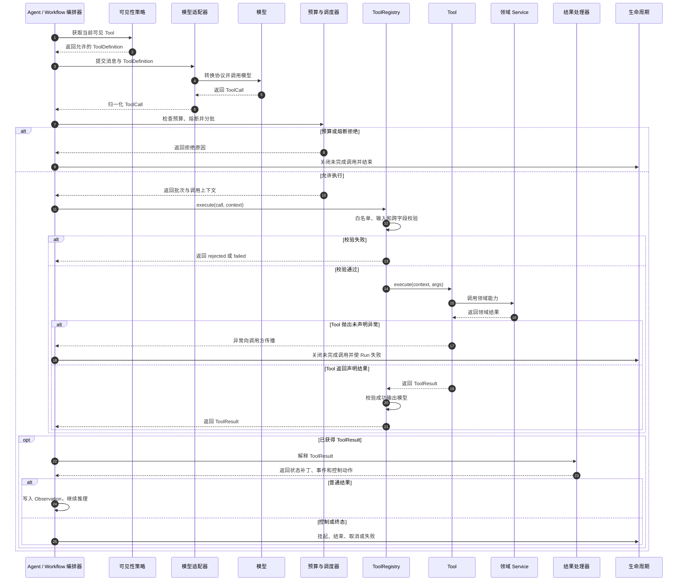
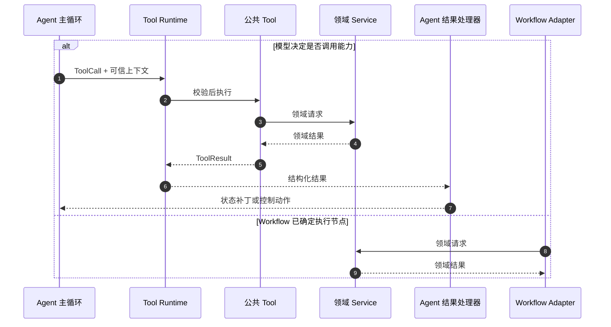
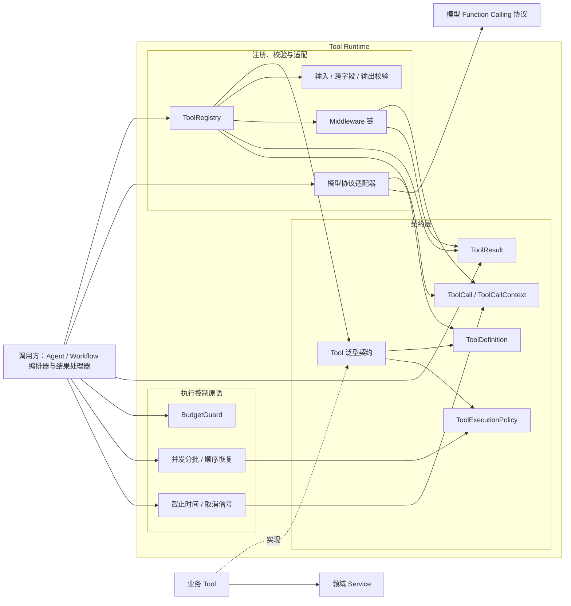
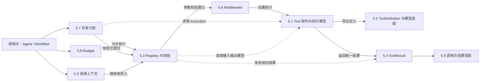
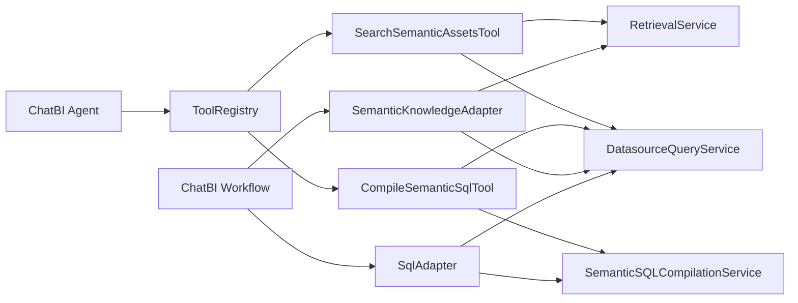

# Tool 运行时技术设计与实施指南

**日期：** 2026-07-29

**状态：** 基于 SQLBot 当前实现提炼

**目标读者：** 需要在其他项目中设计、实现或演进 Tool 运行时的架构师和开发者

## 文档定位

本文不是 SQLBot 工具清单或源码导读，而是一份可迁移的 Tool 运行时技术方案。设计结论来自 SQLBot 已落地代码，正文使用无业务背景的示例解释契约和机制；SQLBot 的类、文件和业务 Tool 集中放在第 8 章，作为实现依据。

本文与现有文档的关系：

- `17-chatbi-agent-tool-architecture-design.md`：SQLBot Tool 架构目标。
- `18-chatbi-agent-tool-architecture-implementation-plan.md`：SQLBot 分阶段实施计划。
- `19-chatbi-agent-tool-current-baseline.md`：改造前的阶段 0 基线。
- 本文：从已落地实现中提炼出的通用设计、实施方法和项目映射。

## 1. 概览

Tool 运行时位于模型与业务能力之间，负责把模型提出的结构化调用转换为受控、可校验、可观测的本地执行。

它解决五类问题：

- **契约明确**：每个 Tool 都有稳定名称、说明、输入模型、输出模型和执行属性。
- **调用受控**：模型只能提出 Tool 和参数，最终可见性、白名单和授权由系统决定。
- **结果统一**：成功、拒绝、失败和中断使用同一结果信封表达。
- **运行可靠**：提供超时、取消、预算、并发分批、中间件和异常边界。
- **业务隔离**：Runtime 不拥有业务状态、生命周期、持久化或产品事件，这些由调用方（例如 Agent 主循环或 Workflow 执行器）处理。

### 1.1 设计不变量

1. 模型只能提出调用，不能绕过白名单、权限和业务校验。
2. Tool 的输入和成功输出必须有明确 Schema，并由运行时校验。
3. Tool 结果只有一个终态，不能同时维护容易冲突的 `success` 和 `status`。
4. 通用 Runtime 不依赖具体业务域、模型 SDK、产品 Event 或 Trace 实现。
5. Tool 不直接控制调用方生命周期；挂起、结束和状态更新由调用方的结果处理器执行。
6. 可预期错误返回结构化结果，未声明程序错误向调用方传播，不能被宽泛异常处理吞掉。

### 1.2 适用范围

该设计适合使用 Function Calling（函数调用）或类似结构化调用协议的 Agent、工作流和自动化系统。业务 Tool 可以是查询、计算、外部 API、文件处理或控制请求；Runtime 本身不限定业务类型。

## 2. 核心功能全景

| 功能 | 说明 | 对应位置 |
| --- | --- | --- |
| Tool 契约 | 声明名称、描述、输入模型、输出模型和执行策略 | `backend/apps/tool/base.py:39-85` |
| 厂商无关定义 | 生成输入输出 Schema 和行为注解，不绑定模型 SDK | `backend/apps/tool/definition.py:10-30` |
| 白名单注册 | 显式注册 Tool、拒绝重复名称、按允许集合导出定义 | `backend/apps/tool/registry.py:25-50` |
| 输入输出校验 | 调用前校验参数，成功后校验结构化结果 | `backend/apps/tool/registry.py:52-108` |
| 统一结果信封 | 隔离模型内容、业务数据、内部元数据和错误处置 | `backend/apps/tool/result.py:20-139` |
| 调用上下文 | 携带 Tool Call ID、截止时间、取消信号和 Trace 上下文 | `backend/apps/tool/context.py:13-73` |
| 中间件 | 用洋葱模型承载耗时等技术横切逻辑 | `backend/apps/tool/middleware.py:17-74` |
| 并发分批 | 根据 Tool 声明分批执行，并保持模型调用顺序 | `backend/apps/tool/concurrency.py:28-119` |
| 通用预算 | 控制步数、Token、墙钟时间和重复调用 | `backend/apps/tool/budget.py:17-129` |
| 模型适配 | 把厂商无关定义转换为具体模型协议 | `backend/apps/tool/adapters/openai.py:10-26` |
| 调用方编排 | 组合预算、调用事实、Trace、Event、状态和生命周期 | `backend/apps/chatbi/orchestration/agent/tool_execution.py:65-669` |
| 结果投影 | 把 ToolResult 转换为状态补丁、控制动作和事件建议 | `backend/apps/chatbi/orchestration/agent/tool_results.py:21-304` |

### 2.1 职责分层

| 层 | 应负责 | 不应负责 |
| --- | --- | --- |
| 模型适配层 | Schema 转换、模型消息转换、调用结果归一 | 白名单、业务授权、业务状态 |
| Tool Runtime | 契约、注册、校验、结果、上下文、调度原语 | 业务流程、持久化、产品事件 |
| 业务 Tool | 参数到领域 Service 的翻译、局部业务硬门 | Run 生命周期、Event、Trace、Repository |
| 领域 Service | 权限、安全、业务规则和实际能力执行 | 反向调用具体 Tool |
| 调用方 | 可见性、预算策略、执行编排、状态投影和终态 | 在 Runtime 内植入业务特例 |

### 2.2 Tool 类型

| 类型 | 典型行为 | 设计要求 |
| --- | --- | --- |
| 查询 Tool | 读取数据并返回结果 | 默认只读、幂等；确认依赖是否并发安全 |
| 命令 Tool | 修改外部系统 | 明确写操作、幂等性、破坏性和审计要求 |
| 控制 Tool | 请求调用方挂起、结束或转移流程 | Tool 只返回控制请求，由调用方执行生命周期变化 |

## 3. 使用流程与交互

### 3.1 一次完整 Tool 调用



流程中有三个不同的安全门：

1. **可见性**决定模型本轮能看到什么。
2. **Registry 白名单**决定本地允许执行什么。
3. **领域授权**决定当前身份能否操作具体资源。

三者不能互相替代。

### 3.2 共享业务能力的两种调用方式

Agent 与确定性 Workflow 可以复用同一领域能力，但调用方式不同。Agent 让模型选择公共 Tool，由 Tool Runtime 完成白名单和契约校验；确定性 Workflow 已经知道当前要执行的节点，可以由 Adapter 直接调用领域 Service。两条路径共享权限和业务规则，不互相转发。



公共 Tool 是模型调用领域能力的受控入口，不是领域 Service 的上层公共 API。Workflow 不需要为了复用能力先伪造 ToolCall，也不需要经过 Agent 的状态和结果处理器。

## 4. 系统架构



Tool Runtime 由三部分组成：契约层定义稳定的输入输出边界；注册、校验与适配层负责受控分发和协议转换；执行控制原语负责预算、并发、截止时间和取消。调用方组合这些能力并解释 `ToolResult`，业务 Tool 实现泛型契约并调用领域 Service。Runtime 不直接依赖具体业务实现或模型 SDK。

## 5. 核心模块详解

各子模块通过定义发布和运行时执行两条路径协作：



| 协作路径 | 模块关系 |
| --- | --- |
| 定义发布 | 5.1 生成厂商无关定义，5.2 将定义转换为模型协议 |
| 调用准备 | 调用方组合 5.8 的预算判定、5.7 的分批结果和 5.5 的调用上下文 |
| 核心执行 | 5.3 完成白名单和 Schema 校验，5.6 包裹 5.1 的 `execute` |
| 结果处理 | 5.4 统一表达执行结果，5.9 将结果转换为调用方状态和控制动作 |
| 声明约束 | 5.7 读取 5.1 的并发属性，5.3 读取 5.1 的输入输出模型 |

### 5.1 Tool 定义与执行属性

`Tool` 是由执行上下文、输入模型和输出模型参数化的通用执行契约，其结构包含三个泛型参数、七个类属性和两个固定方法。

三个泛型参数分别约束执行入口的输入和输出：

| 泛型参数 | 含义 | 约束 |
| --- | --- | --- |
| `ContextT` | 调用方创建的可信业务上下文 | 不来自模型参数 |
| `ArgsT` | 模型提出、Registry 校验后的输入 | 必须是结构化输入模型 |
| `ResultT` | Tool 成功返回的业务数据 | 必须是结构化输出模型 |

基类的类属性结构如下。它们属于 Tool 定义，不应藏在 `execute` 的业务逻辑中：

```python
class Tool(Generic[ContextT, ArgsT, ResultT]):
    name: ClassVar[str]
    title: ClassVar[str | None] = None
    description: ClassVar[str]
    args_model: ClassVar[type[ArgsT]]
    result_model: ClassVar[type[ResultT]]
    execution: ClassVar[ToolExecutionPolicy] = ToolExecutionPolicy()
    args_validator: ClassVar[ToolArgsValidator | None] = None
```

| 属性 | 作用 | 是否必填 | 是否模型可见 |
| --- | --- | --- | --- |
| `name` | 稳定且唯一的调用标识 | 是 | 是 |
| `title` | 面向界面的短标题 | 否 | 由模型协议决定 |
| `description` | 说明调用时机、参数语义和返回内容 | 是 | 是 |
| `args_model` | 生成输入 Schema，并校验模型参数 | 是 | 是 |
| `result_model` | 校验成功结果的结构 | 是 | 由模型协议决定 |
| `execution` | 声明读写、并发、超时、幂等和取消属性 | 否，有保守默认值 | 部分转换为注解 |
| `args_validator` | 执行依赖上下文的跨字段校验 | 否 | 否 |

基类还固定了定义导出和业务执行两个方法：

| 方法 | 完整签名 | 职责 |
| --- | --- | --- |
| `definition` | `definition() -> ToolDefinition` | 汇总标识、输入输出 Schema 和执行注解，生成厂商无关定义 |
| `execute` | `execute(self, ctx: ContextT, args: ArgsT) -> ToolResult[ResultT]` | 使用可信上下文和已校验参数执行业务能力，返回统一结果信封 |

`execute` 的参数及返回值语义如下：

- `self` 保存通过构造函数注入的领域 Service；基类不限制具体构造函数。
- `ctx` 由调用方组装，可以承载身份、资源范围和本轮共享状态，模型不能修改这些字段。
- `args` 已由 Registry 从原始字典转换为 `args_model` 实例，Tool 不应再次解析原始参数。
- 返回值必须是 `ToolResult[ResultT]`，不能直接返回字典、字符串或领域对象。

一个完整的 Tool 类型关系包含业务上下文、输入模型和输出模型：

```python
@dataclass(frozen=True)
class EchoContext:
    workspace_id: str

class EchoArgs(BaseModel):
    text: str

class EchoData(BaseModel):
    text: str
```

`EchoTool` 通过泛型参数绑定三类对象，并实现类型完整的执行入口：

```python
class EchoTool(Tool[EchoContext, EchoArgs, EchoData]):
    name = "echo"
    title = "Echo"
    description = "返回输入文本"
    args_model = EchoArgs
    result_model = EchoData
    execution = ToolExecutionPolicy(timeout_seconds=3)

    def execute(self, ctx: EchoContext, args: EchoArgs) -> ToolResult[EchoData]:
        return ToolResult.succeeded(args.text, EchoData(text=args.text))
```

执行属性的含义：

| 属性 | 设计问题 | 保守默认值 |
| --- | --- | --- |
| `side_effect` | 是否修改外部系统 | `read` |
| `concurrency` | 能否与同轮其他 Tool 并发 | `serial` |
| `timeout_seconds` | 单次调用期望上限 | 由系统默认值补齐 |
| `idempotent` | 相同输入重复执行是否等价 | `True` |
| `destructive` | 是否可能产生不可逆影响 | `False` |
| `supports_cancellation` | 底层能否执行中取消 | `False` |

### 5.2 ToolDefinition 与模型适配

Runtime 先生成厂商无关定义，再由适配器转换为具体协议：

```python
definition = EchoTool.definition()
model_spec = {
    "type": "function",
    "function": {
        "name": definition.name,
        "description": definition.description,
        "parameters": definition.input_schema,
    },
}
```

`ToolDefinition` 是内部稳定契约，模型 SDK 的格式只存在于 Adapter。更换模型供应商时，应新增 Adapter，不修改 Tool。

### 5.3 Registry 与校验

最小使用示例：

```python
registry = ToolRegistry(middlewares=default_middlewares())
registry.register(EchoTool())
call = ToolCall("echo", {"text": "hello"}, "call-1")
result = registry.execute(call, ctx=None)
assert result.data.text == "hello"
```

执行顺序固定为：


| 情况 | 处置 |
| --- | --- |
| 名称未注册 | 返回 `rejected/tool_not_allowed` |
| 输入模型失败 | 返回 `failed/invalid_tool_args`，建议修正输入 |
| 跨字段校验失败 | 返回相同的参数错误契约 |
| 成功结果没有 `data` | 抛出实现错误 |
| 输出模型不匹配 | 抛出校验错误 |
| Tool 未声明异常 | 向调用方传播 |

### 5.4 ToolResult

| 状态 | 含义 | 是否应重试 |
| --- | --- | --- |
| `succeeded` | 正常完成并产生结构化数据 | 否 |
| `rejected` | 被权限、安全或业务规则拒绝 | 默认不重试 |
| `failed` | 参数、配置、领域或暂时性错误 | 由 `retry_advice` 决定 |
| `interrupted` | 因取消或截止时间不再使用结果 | 不重试 |

成功结果：

```python
data = EchoData(text="hello")
result = ToolResult.succeeded(
    model_content="hello",
    data=data,
    metadata={"source": "local"},
)
```

可修正失败：

```python
result = ToolResult.failed(
    "text 不能为空",
    error_code="invalid_text",
    error_category=ToolErrorCategory.VALIDATION,
    retry_advice=RetryAdvice.CORRECT_INPUT,
)
```

结果字段按使用方隔离：

- `model_content`：受控写入模型 Observation。
- `data`：交给业务和结果处理器。
- `metadata`：交给调用方、审计和 Artifact，不直接暴露给模型。
- `details`：保存结构化错误细节。

### 5.5 调用上下文、截止时间与取消

有效超时取 Tool 声明、系统上限和 Run 剩余时间的最小值：

```python
timeout = effective_timeout_seconds(
    declared_timeout=3,
    default_timeout=30,
    maximum_timeout=60,
    run_remaining=8,
)
assert timeout == 3
```

调用方应执行前后两次检查：

```python
if cancellation.is_cancelled() or timeout <= 0:
    return ToolResult.interrupted("调用未开始", error_code="interrupted")
result = registry.execute(call, ctx, call_context=call_context)
if cancellation.is_cancelled() or call_context.deadline_exceeded():
    return ToolResult.interrupted("结果不再使用", error_code="interrupted")
return result
```

“调用方停止等待”和“底层操作已经停止”不是同一件事。只有底层 Service 明确支持取消或截止时间，才能声明真实中止。

### 5.6 Middleware

中间件适合耗时、审计字段、指标和统一技术上下文，不适合权限或业务门禁。

```python
class LatencyMiddleware:
    def around(self, tool, ctx, args, call):
        started = time.monotonic()
        result = call()
        metadata = dict(result.metadata)
        metadata["latency_ms"] = int((time.monotonic() - started) * 1000)
        return result.with_updates(metadata=metadata)
```

先注册的 Middleware 位于最外层。未知异常不应在 Middleware 中转成普通 Tool 失败，否则实现缺陷会被掩盖。

### 5.7 并发分批

假设四个 Tool Call 的并发声明如下：

```python
calls = [a_parallel, b_parallel, c_serial, d_parallel]
batches = [[a_parallel, b_parallel], [c_serial], [d_parallel]]
completed_order = [b_parallel, a_parallel, c_serial, d_parallel]
returned_order = [a_parallel, b_parallel, c_serial, d_parallel]
```

分批规则：

1. 只有明确声明 `parallel_safe` 的连续调用才能合并。
2. 串行或未知 Tool 独立成批。
3. 并发完成顺序不能改变模型 Observation 顺序。
4. 并发批次发生程序错误时，要保留同批已经完成的结果。

声明并发安全前，必须同时确认 Tool、领域 Service、数据库 Session 和上下文对象都可跨线程或任务使用。

### 5.8 Budget

通用预算只表达跨业务可复用的资源约束：

| 预算 | 用途 |
| --- | --- |
| 最大步骤 | 防止无限规划循环 |
| Token 总量 | 控制模型成本 |
| 墙钟时间 | 限制单次 Run 总耗时 |
| 重复调用熔断 | 阻止相同 Tool 和参数无限重试 |
| 软阈值 | 接近上限时促使调用方结束当前处理 |

```python
mode = budget.planning_mode()
if mode == "normal":
    tools = normal_tools
elif mode == "soft":
    tools = closure_tools
else:
    tools = []
```

业务重试次数、审批次数、澄清次数等属于业务预算，应由调用方策略实现，不应加入通用 Runtime。

### 5.9 调用方结果投影

Tool 只返回事实或控制请求；调用方决定如何改变状态：

```python
projection = processor.process(tool_name, result)
state.update(projection.state_patch)
for event in projection.events:
    publisher.publish(event)
if projection.control is not None:
    lifecycle.apply(projection.control)
```

| ToolResult 内容 | 调用方可能执行的动作 |
| --- | --- |
| 查询数据 | 保存 Artifact、更新派生状态、写 Observation |
| 澄清请求 | 创建澄清记录并挂起 Run |
| 结束请求 | 投影最终回答并结束 Run |
| 普通失败 | 写 Observation，让模型决定是否修正 |
| 取消 | 关闭未完成调用并取消 Run |

集中投影可以让状态更新、事件和终态在一个入口表达，但应避免长期使用工具名称字符串分派；规模增大后可以让 ToolDefinition 声明稳定的结果处理类型。

## 6. 关键技术实现

### 6.1 一份契约驱动定义、模型和校验

输入模型同时用于生成模型 Schema 和运行时校验，输出模型用于成功结果复验。这样可以避免模型协议、实现参数和测试契约分别维护后逐渐不一致。

权衡是 Schema 生成能力依赖所选验证库；更换 Pydantic 等基础库时，应保持 `ToolDefinition` 对外结构稳定。

### 6.2 可见性、白名单和授权分离

| 控制点 | 回答的问题 | 失败后果 |
| --- | --- | --- |
| 可见性 | 模型当前应该看到什么 | 不向模型暴露 |
| Registry 白名单 | 系统允许执行什么 | `tool_not_allowed` |
| 领域授权 | 当前身份能操作什么资源 | 授权拒绝 |

把三层合并会产生两类风险：仅隐藏 Tool 但本地仍可绕过调用，或把流程状态误当成真实数据权限。

### 6.3 截止时间和取消使用真实语义

Runtime 负责计算截止时间、传递取消信号和决定返回结果是否仍有效；底层 Service 负责真正停止 I/O 或数据库执行。Runtime 不能仅因外层等待超时，就声称底层副作用已经取消。

收益是状态和审计更可信；代价是每个重要领域 Service 都要支持 deadline 或 cancellation，不能只在最外层加超时包装。

## 7. 已知限制与实施注意事项

| 限制或风险 | 影响 | 实施建议 |
| --- | --- | --- |
| 并发声明错误 | Session 冲突、状态竞争、重复副作用 | 默认串行，逐个验证后放开 |
| 底层不支持取消 | 调用方停止后操作仍可能完成 | 在领域 Service 传递 deadline/cancellation |
| 长结果只存内存 | 恢复后 `offload_ref` 失效 | 需要跨恢复时使用持久化 Artifact |
| 结果处理按名称分派 | 重命名或扩展容易漏改 | 使用稳定处理类型或注册处理器 |
| 同步线程池并发 | 不适合原生异步或进程隔离任务 | 根据技术栈增加 async/process 调度器 |
| 输出 Schema 未发送给模型 | 模型不知道结构化输出约束 | 继续内部强校验，或使用支持输出 Schema 的协议 |
| 未声明异常传播 | 当前批次和 Run 失败 | 完整映射可预期错误，保留程序错误传播 |
| 公共 Semantic Tool 尚无第二个生产 Agent 接入 | 多 Agent 可复用性目前由契约和测试验证 | 新 Agent 直接实现可信上下文并注册公共 Tool，不增加转发 Tool |

模型注解中的 `read_only`、`destructive` 和 `idempotent` 只是提示和调度依据，不能替代业务授权。

## 8. SQLBot 当前实现映射

本章只用于证明前述设计已经在真实项目中落地，并帮助 SQLBot 维护者定位代码。

### 8.1 模块映射

| 通用概念 | SQLBot 实现 | 位置 |
| --- | --- | --- |
| Tool 契约和执行策略 | `Tool`、`ToolExecutionPolicy` | `backend/apps/tool/base.py` |
| 厂商无关定义 | `ToolDefinition`、`ToolAnnotations` | `backend/apps/tool/definition.py` |
| 统一结果 | `ToolResult`、`ToolStatus`、`RetryAdvice` | `backend/apps/tool/result.py` |
| 注册和校验 | `ToolRegistry` | `backend/apps/tool/registry.py` |
| 调用上下文 | `ToolCall`、`ToolCallContext` | `backend/apps/tool/context.py` |
| 并发分批 | `batch_tool_calls()`、`execute_tool_batch()` | `backend/apps/tool/concurrency.py` |
| 通用预算 | `BudgetGuard` | `backend/apps/tool/budget.py` |
| OpenAI 适配 | `to_openai_tool_specs()` | `backend/apps/tool/adapters/openai.py` |
| 调用方执行器 | `AgentToolExecutor` | `backend/apps/chatbi/orchestration/agent/tool_execution.py` |
| 结果处理器 | `ChatBIToolResultProcessor` | `backend/apps/chatbi/orchestration/agent/tool_results.py` |
| 公共 Semantic 上下文 | `SemanticToolContext`、`SemanticAssetScope` | `backend/apps/tool/tools/semantic_contracts.py` |
| 公共语义检索 Tool | `SearchSemanticAssetsTool` | `backend/apps/tool/tools/semantic.py` |
| 公共语义编译 Tool | `CompileSemanticSqlTool` | `backend/apps/tool/tools/semantic.py` |
| 公共语义检索 Service | `RetrievalService` | `backend/apps/retrieval/query/service.py` |
| 公共语义编译 Service | `SemanticSQLCompilationService` | `backend/apps/semantic/services/sql_compilation_service.py` |

### 8.2 九个生产 Tool

| Tool | 类型 | 当前职责 | 位置 |
| --- | --- | --- | --- |
| `search_semantic_assets` | 公共语义查询 | 使用可信检索请求召回语义资产，按当前表权限过滤，并生成编译可信范围 | `backend/apps/tool/tools/semantic.py` |
| `compile_semantic_sql` | 公共语义计算 | 重新检查权限、资产白名单和时间范围，确定性编译 SQL | `backend/apps/tool/tools/semantic.py` |
| `finish` | ChatBI 控制 | 返回结束请求以及分析回复和图表配置 | `backend/apps/chatbi/orchestration/agent/tools/core.py` |
| `clarify` | ChatBI 控制 | 返回结构化澄清请求 | `backend/apps/chatbi/orchestration/agent/tools/interaction.py` |
| `get_dataset_schema` | 公共查询 | 读取权限过滤后的物理结构 | `backend/apps/tool/tools/datasource.py` |
| `validate_sql` | 公共查询 | 预检 SQL 安全、权限和资源限制 | `backend/apps/tool/tools/datasource.py` |
| `execute_sql` | 公共查询 | 再次校验并执行 SQL | `backend/apps/tool/tools/datasource.py` |
| `search_terminology` | 公共查询 | 查询当前数据集业务术语 | `backend/apps/tool/tools/semantic.py` |
| `get_sql_examples` | 公共查询 | 召回相似 SQL 示例 | `backend/apps/tool/tools/knowledge.py` |

九个 Tool 在 `build_agent_tool_registry()` 中显式注册。ChatBI composition 只选择和注入公共 Tool，不实现语义检索或 SQL 编译转发服务。来源：`backend/apps/chatbi/orchestration/agent/composition.py`。

Semantic 公共能力有两条真实调用路径：



Agent 通过公共 Tool 获得模型可调用契约；Graph 节点已经确定执行动作，因此 Adapter 直接调用公共领域 Service。领域 Service 不反向依赖 Tool，两条路径不会形成循环。

### 8.3 SQLBot 状态投影

| Tool 结果 | 状态补丁 | Event 或控制动作 |
| --- | --- | --- |
| `search_semantic_assets` | `semantic_package`、`semantic_scope`、`semantic_asset_ids`、`allowed_tables` | 无控制动作 |
| `get_dataset_schema` | 合并 `allowed_tables` | 无控制动作 |
| `compile_semantic_sql` | `compiled_sql`、合并 `allowed_tables` | `sql-generated` |
| `validate_sql` | 无 | `sql-validated` |
| `execute_sql` | `last_execution`、`full_data`，保存 Artifact | `sql-executed` |
| `clarify` | 无 | `CLARIFY`，挂起 Run |
| `finish` | 无 | `FINISH`，结束 Run |

来源：`backend/apps/chatbi/orchestration/agent/tool_results.py:43-304`。

### 8.4 架构守卫

SQLBot 通过测试约束以下依赖：

- Tool Runtime 不依赖业务域、Event 或 Trace。
- 公共 Tool 不依赖 ChatBI 状态和生命周期。
- Datasource、Semantic、Knowledge Service 不反向依赖具体 Tool。
- ChatBI 控制 Tool 不直接依赖调用方执行器、Repository、Event 或 Trace。
- Graph 的 Semantic Adapter 直接依赖公共 Retrieval、Semantic 和 Datasource Service，不依赖 ChatBI 语义转发 Service。

来源：`backend/tests/architecture/test_structure_rules.py:45-115`、`backend/tests/architecture/test_boundaries.py:832-876`。

### 8.5 当前运行时约束

| 约束 | 当前实现依据 |
| --- | --- |
| 九个生产 Tool 均使用默认串行策略 | `backend/apps/tool/base.py:39-59`、生产 Tool 的 `execution` 声明 |
| SQL 和语义检索会接收调用截止时间 | `backend/apps/tool/tools/datasource.py`、`backend/apps/tool/tools/semantic.py` |
| 长结果卸载不跨恢复持久化 | `backend/apps/chatbi/orchestration/agent/messages.py:151-185`、`backend/apps/chatbi/orchestration/agent/state.py:53-60` |
| ChatBI 结果投影按 Tool 名称分派 | `backend/apps/chatbi/orchestration/agent/tool_results.py:72-143` |
| 并发批次使用同步线程池 | `backend/apps/tool/concurrency.py:80-119` |
| OpenAI Adapter 只发送输入 Schema | `backend/apps/tool/adapters/openai.py:10-19` |
| 未声明异常由调用方关闭调用事实并使 Run 失败 | `backend/apps/chatbi/orchestration/agent/tool_execution.py:215-286` |

Semantic Tool 的检索结果同时返回模型可见的语义包和服务端可信范围。`SemanticAssetScope` 保存身份、数据源、数据集、检索决策状态、允许资产、授权表和归一化时间范围；编译 Tool 在每次执行前重新验证这些字段以及当前权限。ChatBI 结果处理器只把成功结果投影到 Agent state，Graph 则直接消费公共 Service 结果。
