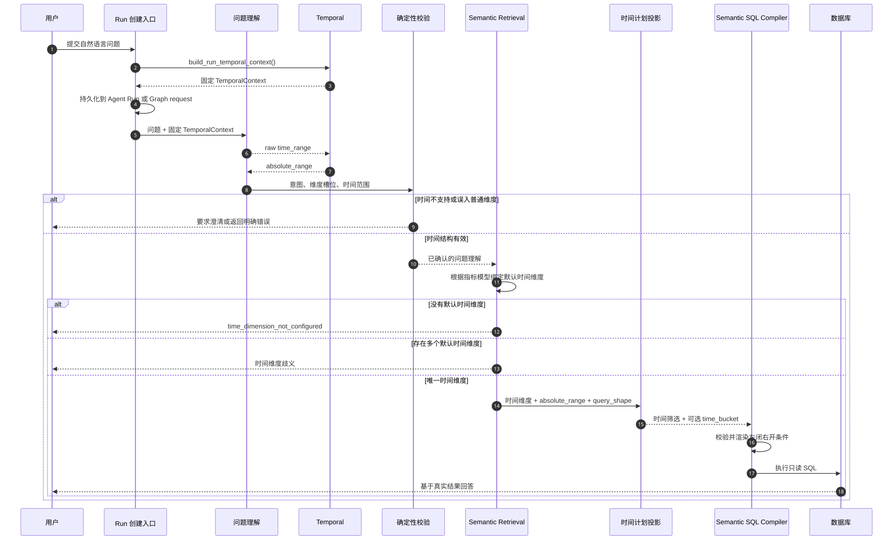

# ChatBI 确定性时间处理技术文档

## 1. 概览

ChatBI 将时间处理从指标、维度检索和 SQL 编译中独立出来，由
`backend/apps/temporal` 提供统一实现。它负责把用户的自然语言时间表达转换为
可审计、可恢复、可安全编译的绝对时间范围。

当前实现遵循以下原则：

- 每个 Agent Run 或 Graph Run 只创建一次时间上下文。
- 问题理解阶段只识别并保存 `time_range.raw`；Agent 进入 ReAct 后由 `parse_time_range` Tool
  使用固定时间上下文转换为绝对日期范围。
- 时间范围统一使用左闭右开形式：`[start, end_exclusive)`。
- 指标、普通维度、时间维度和时间值分别处理。
- 时间筛选和时间分桶由服务端生成，模型不能自行替换。
- Agent 与 Graph 共用同一套解析、绑定和 SQL 渲染规则。

当前文本时间解析使用 JioNLP，并由项目适配层转换为统一的日期范围；暂不处理财年文本、工作日、节假日和企业日历计算。

模型时间理解的目标方案、数据契约和实施阶段见
[ChatBI 模型时间理解技术设计](./22-llm-temporal-interpretation-design.md)。

## 2. 核心功能全景

| 功能 | 说明 | 对应位置 |
| --- | --- | --- |
| Run 时间上下文 | 固定基准时间、时区和自然周配置；财政字段仅保留在结构化兼容契约中 | `apps/temporal/models.py` |
| 结构化时间计划 | 严格表达时间类型、作用、分组和歧义状态 | `apps/temporal/plan.py` |
| 结构化计划解析 | 将校验后的计划转换为可信绝对范围 | `apps/temporal/resolver.py::resolve_temporal_plan` |
| 时间表达识别 | 判断文本是否为时间表达，防止进入普通维度值 | `apps/temporal/extractor.py` |
| 时间范围解析 | 调用 JioNLP，并将结果转换为绝对日期范围 | `apps/temporal/resolver.py`、`apps/temporal/jionlp_adapter.py` |
| 日历边界计算 | 计算自然周、月、季度和年度边界 | `apps/temporal/calendar.py` |
| 时间维度绑定 | 根据指标所属语义模型绑定默认时间维度 | `apps/retrieval/query/policy.py` |
| 时间筛选投影 | 把绝对时间范围绑定到时间维度资产 | `apps/retrieval/projection/payload.py` |
| 时间分桶 | 根据可信查询形态生成日、周、月等分桶计划 | `apps/temporal/binder.py` |
| 编译计划保护 | 使用服务端时间计划覆盖模型提交的时间参数 | `apps/tool/tools/semantic_contracts.py`、`apps/tool/tools/semantic.py` |
| SQL 条件渲染 | 将绝对范围渲染为 `>= start AND < end_exclusive` | `apps/temporal/sql_renderer.py` |
| 方言分桶渲染 | 通过 sqlglot 生成不同数据库方言的时间分桶表达式 | `apps/semantic/services/sql_compiler.py` |
| Run 持久化 | Agent 保存到 `temporal_context`，Graph 保存到 Run request | `apps/chatbi/models/orm/agent_run.py`、`apps/chatbi/orchestration/graph/api_extension.py` |
| 兼容出口 | 旧 Semantic 时间入口仅转发到 Temporal | `apps/semantic/time_range.py`、`apps/temporal/parser.py` |

## 3. 核心数据契约

### 3.1 TemporalContext

`TemporalContext` 是一次 Run 内不可变的时间解释上下文。

```json
{
  "reference_at": "2026-07-31T15:22:39.106146+08:00",
  "timezone": "Asia/Shanghai",
  "locale": "zh-CN",
  "week_start": "monday",
  "fiscal_year_start_month": 1,
  "fiscal_year_label": "start_year",
  "business_calendar_id": null
}
```

| 字段 | 类型 | 当前作用 |
| --- | --- | --- |
| `reference_at` | 带时区的 datetime | 解释“今天”“最近 N 天”等相对时间的唯一基准 |
| `timezone` | IANA 时区名称 | 将基准时间转换为业务日期 |
| `locale` | 字符串 | 保存语言区域配置；当前解析规则尚未按 locale 分流 |
| `week_start` | 受控星期枚举 | 决定自然周的起始日，由统一企业配置写入 Run |
| `fiscal_year_start_month` | 1～12 | 财政年度起始月份 |
| `fiscal_year_label` | `start_year` 或 `end_year` | 财年名称按起始年还是结束年解释 |
| `business_calendar_id` | 可空字符串 | 企业日历标识；当前仅持久化，尚未参与计算 |

`reference_at` 必须带时区。无时区时间和非法 IANA 时区会被明确拒绝。

`fiscal_year_start_month` 和 `fiscal_year_label` 仍存在于 `TemporalContext` 数据结构中，主要用于既有
结构化计划契约；当前 JioNLP 原文解析入口不使用财年文本规则。

### 3.2 TimeRange

问题理解阶段使用 `TimeRange` 保存原始表达和系统解析结果。

```json
{
  "raw": "2026年6月",
  "value_status": "provided",
  "normalized": {
    "kind": "absolute_range",
    "start": "2026-06-01",
    "end_exclusive": "2026-07-01",
    "timezone": "Asia/Shanghai", "source_raw": "2026年6月"
  }
}
```

字段职责：

- `raw`：保留用户原始时间表达，用于解释、澄清和审计。
- `value_status`：表示用户是否提供了时间条件。
- `normalized`：Temporal 模块生成的可信时间结构。

生产执行路径要求 `normalized.kind` 为 `absolute_range`。相对结构只能存在于旧兼容接口中，
不能直接进入 SQL 编译器。

### 3.3 JioNLP 时间适配结果

普通文本时间由 JioNLP 解析，项目适配层只负责调用基准时间、校验边界并转换为项目的左闭右开日期范围。

```json
{
  "kind": "absolute_range",
  "start": "2026-06-01",
  "end_exclusive": "2026-07-01",
  "timezone": "Asia/Shanghai",
  "source_raw": "2026年6月1日至30日"
}
```

对于 `2026年6月1日至30日`，解析结果为 `[2026-06-01, 2026-07-01)`。
SQL 编译器只消费 `start` 和 `end_exclusive`。
当前依赖版本在 `backend/pyproject.toml` 中固定为 `jionlp==1.5.29`。

### 3.4 SemanticCompilePlan.temporal_plan

时间筛选和时间分桶在编译计划中独立保存。

```json
{
  "temporal_plan": {
    "filters": [{
      "asset_id": 304, "operator": "=",
      "value": {"kind": "absolute_range",
                "start": "2026-06-01",
                "end_exclusive": "2026-07-01"}
    }],
    "time_bucket": {"dimension_id": 304, "grain": "day"}
  }}
```

两者含义不同：

- `filters` 决定查询哪些日期。
- `time_bucket` 决定结果是否按日、周、月、季度或年分组。

“2026 年 6 月总 GMV”只有时间筛选；“2026 年 6 月总 GMV 按天趋势”同时具有时间筛选和
日分桶。

### 3.5 TemporalPlan 与 ResolvedTemporalPlan

当前已经增加结构化时间计划契约、独立模型时间任务，以及默认关闭的 Agent 与 Graph 权威执行路径：

- `TemporalPlan` 保存表达原文、来源位置、时间类型、查询作用、分组和歧义状态，不能直接进入 SQL。
- `validate_temporal_plan()` 集中校验表达来源和第一版单一全局时间范围。
- `resolve_temporal_plan()` 只读取固定 `TemporalContext`，生成 `ResolvedTemporalPlan`。
- `project_time_range_payload()` 将可信解析结果投影为现有下游使用的 `TimeRange`。
- `TemporalInterpretationService` 复用统一结构化模型调用，严格校验 `TemporalPlan`，并最多执行一次结构修复。
- Agent 可通过 `TEMPORAL_MODEL_SHADOW_ENABLED` 开启旁路观察，将模型计划、解析结果及其与旧
  `TimeRange` 的差异写入 Run 派生状态。
- `TEMPORAL_MODEL_AUTHORITY_ENABLED` 启用后，Agent 与 Graph 使用同一模型时间任务、校验器和解析器；
  `TemporalPlan` 成为时间语义来源，`TimeRange` 只保留为解析后的兼容投影。
- 旁路和权威开关互斥。权威模式的模型调用、输出或解析错误明确终止，不静默回退旧规则。
- 权威时间模式下，时间计划为 `clarification_required` 或 `unsupported` 时，统一校验会在资产检索前生成时间澄清。
  默认 Agent 路径则把未解析时间留给 `parse_time_range` Tool；Tool 返回 `unsupported` 后才进入 Agent 澄清。
- 默认 Agent 路径可以在同一轮并发调用 `parse_time_range` 和 `search_semantic_assets`。两者结果投影后，
  服务端会刷新语义查询计划，确保并发返回先后不影响时间过滤。
- Agent 的 `question_understanding.temporal_interpretation` 和 Graph 的 `intent.temporal_plan`、
  `resolved_temporal_plan` 保存计划、解析结果和解释来源，并复用 Run 固定时间上下文。
- `TimeRange.interpretation_source` 统一记录 `jionlp`、`model` 或 `user_confirmation`；历史数据仍可能出现
  `legacy_rule`。`scripts/evaluate_temporal_source_usage.py` 可以只读统计来源使用情况。
- 权威模式不调用 JioNLP 原文解析器。默认 Agent 的 `parse_time_range` Tool 调用 JioNLP；Retrieval
  只负责语义候选检索，SQL 编译 Tool 只接受结果投影阶段生成的 `absolute_range`，不会自行解释 `raw`。
- `summarize_temporal_shadow_observations()` 对观察状态、字段差异和错误分类计数；
  `scripts/evaluate_temporal_shadow.py` 可以按租户和时间窗口只读汇总 Run，不输出用户问题或计划原文。
- `scripts/replay_temporal_shadow.py` 可以只读加载既有 Agent Run 的问题理解快照，按重写问题去重后执行
  2～10 轮离线旁路回放；它比较排除置信度后的完整时间语义，统计跨轮稳定性，不更新 Run，不执行检索
  或 SQL，只输出聚合统计。模型客户端日志被限制为 WARNING，避免请求正文进入调试日志。
- 时间计划统一限制歧义代码；指标定义内部时间不能成为全局筛选或全局歧义；第一版“最近/近/过去 N 个
  周期”统一包含 Run 基准日。
- 时间模型调用使用 `QUERY_UNDERSTANDING_TIMEOUT_MS` 请求超时，超时和非法配置均明确失败。

默认 Agent 配置使用 `TimeRange` 兼容投影，但实际原文解析由 ReAct 的 `parse_time_range` Tool
触发。旁路模型失败只记录明确错误和已发生的模型用量，不改变检索、计划或 SQL 输入；当前环境尚无线上开关
产生的真实旁路记录。
对既有 Run 中 20 个不同问题进行两次只读回放时，所有可比较结果都与旧权威时间一致，但两次运行的澄清
数量和模型输出合法性不同。随后对 10 个问题执行三轮回放，30 条观察中有 28 条匹配和 2 条模型调用失败，
完整时间语义稳定率为 70%，累计使用 59,499 tokens，耗时约 9 分 15 秒。因此当前证据只能用于继续离线
评估。虽然权威接入代码已完成，但在增加租户范围、采样比例和延迟预算控制，并达到稳定性门槛前，旁路和
权威开关都不应在当前环境全量开启。

## 4. 运行时流程

### 4.1 完整时序



图源：`docs/tech/assets/temporal-runtime-sequence.mmd`。

关键规则：

1. `reference_at` 在 Run 创建时固定，而不是在 SQL 编译时读取系统当前时间。
2. 澄清恢复、失败重试和 Run 回放复用原 TemporalContext。
3. 检索层不重新解释“今天”，只绑定时间维度资产。
4. SQL 编译器不使用 `CURRENT_DATE`，也不根据数据库最大日期猜测“今天”。

### 4.2 Agent 与 Graph 的差异

| 项目 | Agent | Graph |
| --- | --- | --- |
| 时间上下文创建 | `agent_run_repository.create_run` | `build_run_request_context` |
| 持久化位置 | `chatbi_agent_run.temporal_context` | `workflow_run.request.temporal_context` |
| 读取入口 | `AgentRuntimeState.temporal_context` | `ChatBIRunContext.temporal_context` |
| 问题理解 | `QuestionUnderstandingService` | `QuestionAdapter` |
| 时间核心规则 | 共用 `apps.temporal` | 共用 `apps.temporal` |
| 时间分桶 | `project_semantic_compile_plan` | `QueryPlanBinder` |

二者持久化方式不同，但时间结构、解析算法、默认时间维度绑定和 SQL 渲染规则相同。

## 5. 系统架构



图源：`docs/tech/assets/temporal-module-architecture.mmd`。

依赖方向是单向的：

- Temporal 不依赖 Semantic、Retrieval、Agent 或 Graph。
- 上层模块只能调用 Temporal 的公共函数。
- `apps.semantic.time_range` 是兼容转发，不再保存独立实现。
- 架构测试会阻止时间规则重新散落到 Semantic 或 Graph。

## 6. 核心模块详解

### 6.1 Run 时间上下文

公开契约：

```python
def build_temporal_context(
    *,
    reference_at: datetime | None = None,
    timezone: str = "Asia/Shanghai",
    locale: str = "zh-CN",
    week_start: WeekStart = "monday",
    fiscal_year_start_month: int = 1,
    fiscal_year_label: Literal["start_year", "end_year"] = "start_year",
    business_calendar_id: str | None = None,
) -> TemporalContext
```

`build_run_temporal_context()` 从统一配置读取参数，调用方不能分别读取环境变量。首次创建后，
上下文必须随 Run 一起持久化。

迁移 `099_agent_run_temporal_context` 对既有数据执行两类回填：

- Agent Run 使用原 Run 的 `created_at` 作为基准。
- Graph Run 将时间上下文加入原有不可变 request。

### 6.2 时间表达识别

`is_time_expression()` 用于判断普通维度值是否误装入时间表达。例如：

| 输入 | 结果 |
| --- | --- |
| `今天` | 时间表达 |
| `最近7天` | 时间表达 |
| `2026年6月1日至30日` | 时间表达 |
| `按月` | 时间表达 |
| `店铺100011` | 普通业务值 |

如果模型把“今天”放进普通维度筛选值，问题理解校验会产生
`dimension_value_is_time_expression`，不会继续进入资产检索和 SQL 编译。

### 6.3 时间解析

生产入口：

```python
def resolve_time_range(
    raw: Any,
    temporal_context: TemporalContext,
) -> dict[str, Any] | None
```

解析结果只有三类：

- `None`：没有时间表达。
- `absolute_range`：可以进入后续执行。
- `unsupported`：识别到输入但无法安全解释。

`resolve_time_range_payload()` 具备幂等性：如果 payload 已有绝对范围，恢复和重复投影时
保持原结果，不重新依据当前日期解释。

`resolve_time_range()` 的普通文本解析流程如下：

1. 使用 Run 中固定的 `TemporalContext.reference_at` 调用 JioNLP。
2. 校验 JioNLP 返回的时间类型和两个时间边界。
3. 将完整日期边界转换为项目的 `start` 和 `end_exclusive`。
4. 无法转换时返回 `kind=unsupported`，不猜测默认日期。

JioNLP 解析结果到项目结构的转换位于 `apps/temporal/jionlp_adapter.py`。按天、按月等粒度后缀只影响
解析输入的清洗，不会改变 `absolute_range` 的日期边界。

### 6.4 日历计算

`calendar.py` 负责不依赖模型和数据库的纯日期计算：

- `shift_months`：按月份平移，目标月份天数不足时收敛到月末。
- `period_bounds`：自然周、月、季度、年度边界。
例如 2026 年 3 月 31 日向前平移一个月会得到 2026 年 2 月 28 日；闰年对应
2 月 29 日。

### 6.5 默认时间维度绑定

时间范围只有绑定到具体 Semantic 时间维度后才能生成 SQL。

`bind_default_time_dimensions()` 按以下顺序处理每个已选指标模型：

1. 如果该模型已经绑定时间维度，保留现有绑定。
2. 优先读取模型的 `default_time_field`。
3. 未配置时，查找同模型中 `is_default_time=true` 的维度。
4. 唯一候选直接绑定，并加入编译白名单。
5. 多个候选产生 `MULTIPLE_DEFAULT_TIME_DIMENSIONS_FOR_METRIC_MODEL`。
6. 没有候选产生 `TIME_DIMENSION_NOT_CONFIGURED_FOR_METRIC_MODEL`。

该过程是语义关系绑定，不是用“今天”“6 月”等值去检索维度资产。

### 6.6 时间分桶

公开契约：

```python
def derive_time_bucket(
    query_shape: dict[str, Any] | None,
    time_dimension_ids: list[int] | tuple[int, ...],
) -> dict[str, Any] | None
```

只有同时满足以下条件才生成分桶：

- `query_shape.time_grain` 是 `day`、`week`、`month`、`quarter` 或 `year`。
- 已绑定至少一个正整数时间维度 ID。

模型不能直接控制 `time_bucket`。Agent 和 Graph 都从可信问题形态与已绑定时间维度重新派生。

### 6.7 编译参数保护

`CompileSemanticSqlTool.prepare_args()` 会用 `SemanticCompilePlan` 覆盖模型提交的：

- 指标资产。
- 普通分组维度。
- 普通筛选。
- 时间筛选。
- 时间分桶。
- 排序和数量限制。

即使模型提交了错误日期或自造 `time_bucket`，实际编译仍使用服务端计划。

如果当前问题确认了时间范围，但编译参数中没有同一时间筛选，会返回
`time_filter_mismatch`。这可以防止以下行为：

- 省略用户时间条件。
- 把“今天”替换成数据库最新有数据日期。
- 使用其他日期绕过当天无数据。

### 6.8 SQL 渲染

`render_time_filter_condition()` 只接受有效的 `absolute_range`。

输入：

```json
{
  "kind": "absolute_range",
  "start": "2026-06-01",
  "end_exclusive": "2026-07-01"
}
```

输出：

```sql
stat_date >= '2026-06-01'
AND stat_date < '2026-07-01'
```

左闭右开规则避免在 `DATE`、`DATETIME` 或 `TIMESTAMP` 字段上使用
`23:59:59.999` 作为人工上界。

趋势查询的分桶表达式由 `SemanticSQLCompiler` 使用 sqlglot 转换为目标数据库方言，
并自动：

- 将分桶表达式加入 SELECT。
- 将分桶表达式加入 GROUP BY。
- 在没有显式排序时按时间结果升序排序。

## 7. 已支持的时间表达

以下语义均使用 Run 的固定 `reference_date` 解释。

| 类型 | 示例 | 解析规则 |
| --- | --- | --- |
| 单日相对时间 | 今天、昨天、明天、today | 解析为单日左闭右开范围 |
| 绝对日期 | 2026年7月31日、2026-07-31、2026/07/31 | 结束时间为次日 |
| 绝对日期范围 | 2026年6月1日至2026年6月30日 | 用户结束日期按包含处理，再加一天 |
| 绝对月份 | 2026年6月 | 月初到下月月初 |
| 滚动天数 | 最近7天、近30日 | 包含基准日期 |
| 滚动周数 | 最近2周 | 连续 `2×7` 天，包含基准日期 |
| 滚动月数 | 最近3个月 | 按月平移并包含基准日期 |
| 滚动年数 | 最近1年 | 按 12 个月平移并包含基准日期 |
| 当前自然周期 | 本周、本月、本季度、今年 | 周期起点到下一周期起点 |
| 上一自然周期 | 上周、上月、上季度、去年 | 完整上一周期 |
| 时间粒度 | 按天、按周、按月、按季度、按年 | 进入 `query_shape.time_grain`，不是时间范围 |

“最近 N 个月”是滚动窗口，不等于“最近 N 个完整自然月”。例如基准日期为
2026 年 7 月 4 日时，“最近 3 个月”解析为：

```text
[2026-04-05, 2026-07-05)
```

## 8. 典型数据流示例

### 8.1 今天店铺 100011 的总 GMV

问题理解：

```json
{
  "time_range": {
    "raw": "今天",
    "value_status": "provided",
    "normalized": {
      "kind": "absolute_range",
      "start": "2026-07-31", "end_exclusive": "2026-08-01"
    }
  }
}
```

检索层绑定指标模型的默认日期维度，编译结果使用：

```sql
WHERE stat_date >= '2026-07-31'
  AND stat_date < '2026-08-01'
```

如果当天无数据，返回无数据；不会自动改查 7 月 30 日或最大数据日期。

### 8.2 2026 年 6 月总 GMV 按天趋势

可信时间计划同时包含：

```json
{
  "filter": "[2026-06-01, 2026-07-01)",
  "time_bucket": {
    "dimension_id": 304,
    "grain": "day"
  }
}
```

SQL 同时具备日期范围、按日分组和时间升序，不能退化成 6 月总量单行。

### 8.3 2026 年 6 月 1 日至 30 日

JioNLP 返回包含结束日的时间跨度，项目适配层将其转换为左闭右开范围：

```text
2026年6月1日至30日 = [2026-06-01, 2026-07-01)
```

## 9. 错误与诊断

| 错误或原因码 | 触发条件 | 处理方式 |
| --- | --- | --- |
| `TEMPORAL_TIMEZONE_INVALID` | 时区不是有效 IANA 名称 | 修正时间配置 |
| `TEMPORAL_REFERENCE_AT_TIMEZONE_REQUIRED` | 基准时间没有时区 | 在 Run 创建入口提供带时区时间 |
| `time_range_unsupported` | 用户提供时间但无法解析为绝对范围 | 问题理解阶段澄清 |
| `dimension_value_is_time_expression` | 时间被模型放进普通维度值 | 修复问题理解输出，不进入检索 |
| `TIME_DIMENSION_NOT_CONFIGURED_FOR_METRIC_MODEL` | 指标模型没有默认时间维度 | 修复 Semantic 模型配置 |
| `MULTIPLE_DEFAULT_TIME_DIMENSIONS_FOR_METRIC_MODEL` | 同模型存在多个默认时间维度 | 明确默认字段或让用户澄清 |
| `time_filter_mismatch` | 编译参数省略或替换已确认时间 | 拒绝编译，使用可信时间计划 |
| `TEMPORAL_SQL_TIME_RANGE_INVALID` | 开始、结束日期非法或顺序错误 | 修复上游时间结构 |
| `TEMPORAL_SQL_TIME_RANGE_UNSUPPORTED` | 非绝对范围进入 SQL 渲染 | 在问题理解阶段完成绝对化 |
| `SEMANTIC_SQL_TIME_GRAIN_UNSUPPORTED` | 分桶粒度不受支持 | 修复查询形态 |
| `SEMANTIC_SQL_TIME_BUCKET_DIMENSION_NOT_FOUND` | 分桶维度不在 Schema 中 | 修复语义绑定或数据集 Schema |

排查顺序：

1. 检查 Run 中持久化的 `temporal_context`。
2. 检查 `question_understanding.intent.time_range`。
3. 检查语义决策是否绑定默认时间维度。
4. 检查 `compile_plan.temporal_plan`。
5. 检查编译工具实际参数是否被可信计划覆盖。
6. 最后检查生成 SQL 的边界与目标数据库方言。

## 10. 配置与持久化

统一配置位于 `backend/common/core/config.py`：

| 配置 | 默认值 |
| --- | --- |
| `TEMPORAL_TIMEZONE` | `Asia/Shanghai` |
| `TEMPORAL_LOCALE` | `zh-CN` |
| `TEMPORAL_FISCAL_YEAR_START_MONTH` | `1` |
| `TEMPORAL_FISCAL_YEAR_LABEL` | `start_year` |
| `TEMPORAL_BUSINESS_CALENDAR_ID` | `None` |

修改时间配置后，只影响新建 Run。已经创建的 Run 继续使用原上下文，以保证恢复和回放结果稳定。

## 11. 测试与验证入口

| 测试文件 | 主要覆盖 |
| --- | --- |
| `tests/temporal/test_temporal_parser.py` | 相对时间绝对化、JioNLP 日期范围、幂等恢复、时区校验 |
| `tests/temporal/test_temporal_components.py` | 日历边界、月末收敛、分桶、SQL 渲染 |
| `tests/semantic/test_sql_compiler_time_filters.py` | 时间范围到 SQL、非法结构拒绝 |
| `tests/workflow/test_time_slots.py` | 时间表达与普通维度分离、可信分桶 |
| `tests/workflow/test_query_plan_binding.py` | Graph 计划和趋势 SQL |
| `tests/agent/test_core_tools.py` | Agent 可信时间计划覆盖、`time_filter_mismatch` |
| `tests/agent/test_agent_loop.py` | 固定时间上下文进入 Agent 问题理解 |
| `tests/architecture/test_boundaries.py` | Temporal 单一实现和依赖边界 |

新增时间表达时，至少同时补充：

- 解析结果测试。
- 非法边界测试。
- SQL 渲染测试。
- Agent 或 Graph 端到端计划测试。

## 12. 已知限制与注意事项

### 12.1 当前明确未实现

- 财年文本表达；例如 `本财年` 不进入 JioNLP 适配后的可执行时间范围。
- 工作日、节假日和企业日历计算。
- “上周三”“三个月前”“下个月第二个周五”等组合相对表达。
- “最近”“前段时间”等没有明确数量的模糊表达。
- 环比、同比、自定义基期和同期区间推导。
- 同一查询中分别约束创建时间、支付时间等多个时间字段。
- 小时、分钟和实时窗口。
- 数据库存储为 `YYYYMMDD` 字符串、epoch 数字或拆分年月日字段时的适配。
- 多语言完整解析；当前只有少量英文关键词和 FY 表达。

### 12.2 已保存但尚未完全生效的配置

- `locale` 已持久化，但解析器尚未按 locale 选择规则。
- `business_calendar_id` 已持久化，但没有企业日历解析器。

### 12.3 日期与时区边界

当前绝对范围精确到日期，时区用于确定 `reference_date`。SQL 渲染阶段不会自动对数据库
时间戳字段执行时区转换，因此：

- 适合语义层已经统一为业务日期的字段。
- 对 UTC 时间戳、夏令时切换和跨时区事件，需要新增字段级时区适配。
- 不能仅凭 `timezone` 字段假设底层数据库已经按该时区存储。

### 12.4 兼容接口

`normalize_time_range()` 在没有 TemporalContext 时仍可返回 `single_date`、
`relative_range` 等旧结构，用于兼容旧调用和输入比较。

`normalize_time_range_payload()` 是兼容入口，发生原文解析时写入
`interpretation_source=jionlp`。历史数据可能保留 `legacy_rule`，权威模式不调用该兼容入口。

新生产路径必须在 SQL 编译边界获得 `absolute_range`。问题理解可以暂存 `raw`，但只能由带有 Run
`TemporalContext` 的时间 Tool 完成解析；Retrieval、Semantic 和 SQL 编译不得根据 `raw` 自行补解析。

## 13. 维护规则

后续扩展时间处理时，应继续保持以下边界：

1. 新解析规则放入 `apps.temporal`，不得复制到 Agent、Graph、Retrieval 或 Semantic。
2. 解析过程必须显式接收 TemporalContext，不能直接调用 `datetime.now()`。
3. 新时间结构必须先绝对化，再允许进入 SQL 编译器。
4. 数据库方言差异留在 SQL 编译边界，不进入自然语言解析器。
5. 时间维度绑定依赖 Semantic 配置，不从数据库字段名猜测。
6. 不支持的表达返回稳定错误或进入澄清，不静默使用默认日期。
7. 恢复、重试和回放必须复用原 Run 的时间上下文和绝对范围。
