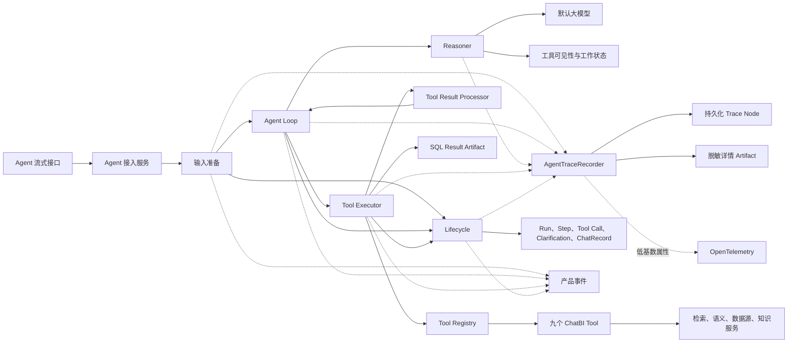
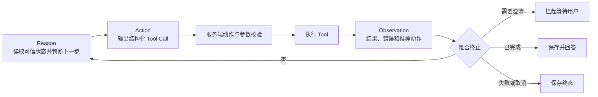
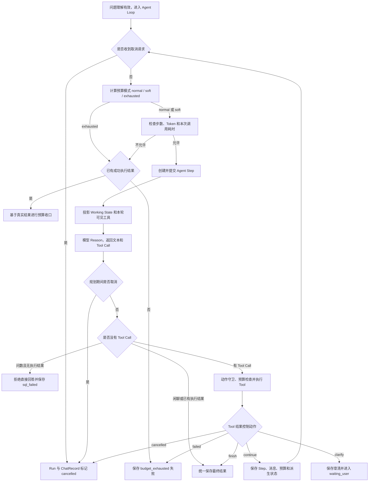
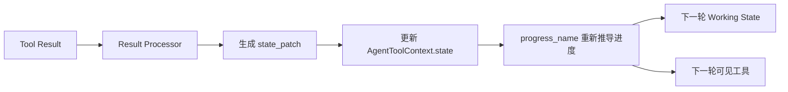
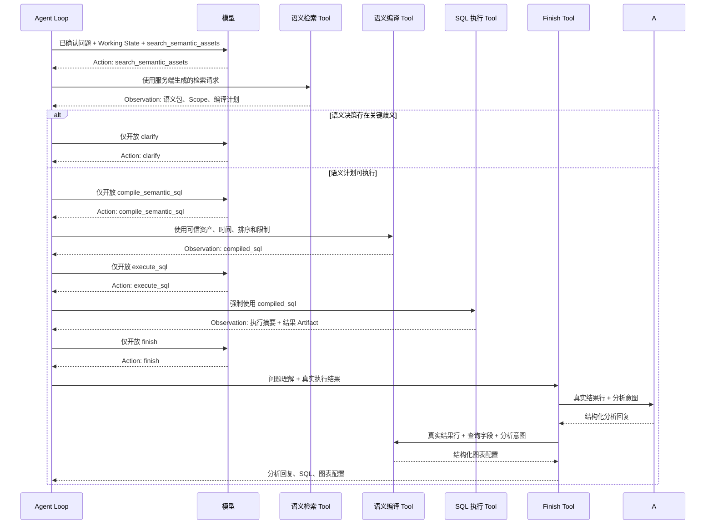
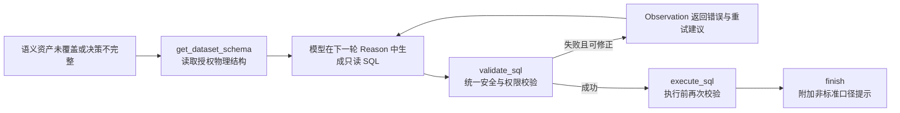
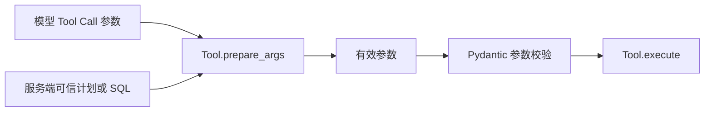
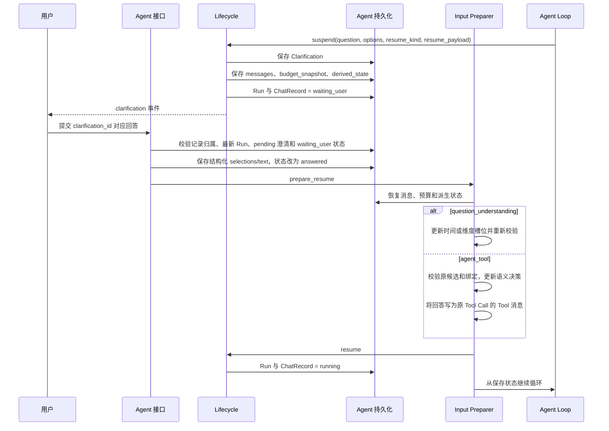
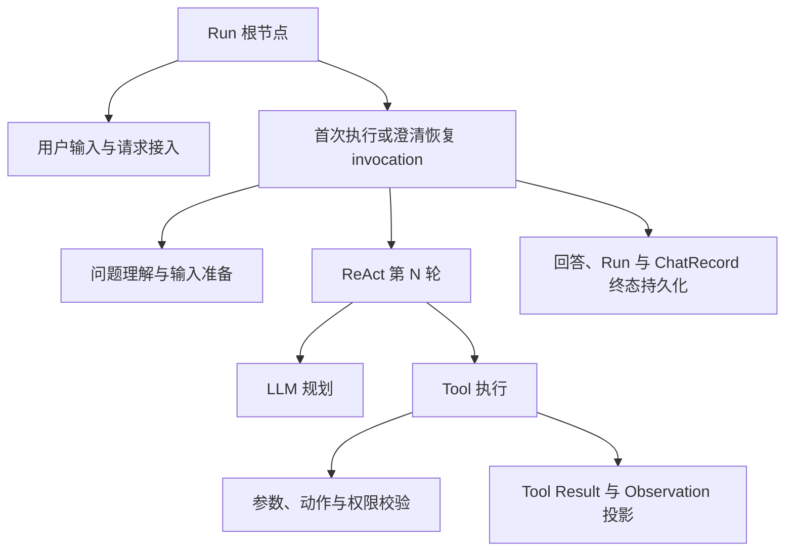

# ChatBI Agent Loop 当前实现

> **P0 实现勘误（2026-08-16）**：进入 ReAct 前已增加确定性分诊和完整澄清目录：`chitchat` 允许直答，`meta_query` 基于数据集语义资产作答，`out_of_scope` 明确拒答；理解校验失败必须澄清或拒答。工具可见性不再因非 valid/非 PROVEN 直接变为空集，缺失时间计划时 `parse_time_range` 可重新出现。执行结果摘要采用可解析的结构化截断，finish 失败或预算软收口可输出已成功结果的部分回答。语义检索已透传可信主体与权限版本，并可携带 verified query 的问题和语义计划摘要。当前仍是单查询 ReAct 编排；AnalysisPlan、命名结果集及 FAST/PLAN 模式属于 P1，本文不提前描述。

本文说明问题理解完成后，ChatBI Agent 如何通过 Function Calling ReAct 循环完成语义检索、SQL 生成、SQL 校验、SQL 执行、澄清、分析回复和图表配置生成。文档描述的是当前项目真实实现，不包含 Graph Workflow 路径。

问题理解阶段的详细实现见 [23-chatbi-agent-question-understanding-current-implementation.md](./23-chatbi-agent-question-understanding-current-implementation.md)。本文从“问题理解结果已经形成”这一边界开始，但会说明进入 Agent Loop 前必须满足的条件。

本次可观测性更新将原先仅记录 invocation、LLM 和 Tool Span 的方案，调整为统一 Recorder 驱动的持久化执行调用树；原有 Event 和 Timeline 职责保持不变，OpenTelemetry 改为同一节点的可选安全导出。

## 1. 概览

当前 Agent Loop 的实现可以概括为：**模型负责选择下一步动作，服务端负责限定动作范围、校验参数、执行工具、解释结果和维护可信状态。**

它不是让模型自由执行 SQL，也不是把所有路径预先画成固定节点的 Graph。核心运行形式是一个持续执行的 `while` 循环：

1. 服务端根据当前可信状态计算本轮可见工具。
2. 模型读取固定系统提示、历史消息、末尾动态上下文、工作状态和工具定义，选择一个或多个 Tool Call。
3. 服务端再次检查工具是否适用于当前阶段，并将关键参数替换为服务端可信参数。
4. 工具完成真实业务操作，统一返回成功、拒绝、失败或中断结果。
5. 结果处理器将 Tool 结果转换为状态补丁、控制动作、产品事件和审计摘要。
6. Tool Observation 写回消息历史，模型进入下一轮判断。
7. 查询成功后调用 `finish`；需要用户确认时调用 `clarify` 并挂起；超过约束或发生不可恢复错误时结束运行。

核心能力包括：

- 采用标准的 Reason → Action → Observation 循环组织多轮工具调用。
- 标准问数优先使用语义资产和确定性 SQL 编译，语义资产无法覆盖时才进入物理 SQL 路径。
- 根据可信状态动态收缩模型可见工具，阻止越阶段调用。
- 对语义资产、SQL、数据权限、执行结果和最终回答进行分层校验。
- 支持问题理解澄清、语义资产澄清、挂起恢复、取消、预算控制和重复调用熔断。
- 分别保存运行快照、步骤、Tool Call、澄清记录、查询结果、产品事件和持久化执行 Trace。

主要实现入口：

- `backend/apps/chatbi/orchestration/agent/service.py`
- `backend/apps/chatbi/orchestration/agent/composition.py`
- `backend/apps/chatbi/orchestration/agent/loop.py`

## 2. 核心功能全景

| 功能 | 说明 | 对应位置 |
| --- | --- | --- |
| 请求接入 | 校验功能开关、数据源白名单、会话归属，创建 ChatRecord 和 Agent Run | `service.py` |
| 运行时组装 | 统一装配模型、九个工具、状态工厂、生命周期、事件和 Trace | `composition.py` |
| 输入准备 | 执行问题理解、构造系统提示、处理进入循环前的确定性澄清 | `preparation.py` |
| ReAct 主循环 | 检查取消和预算，创建 Step，调用模型，执行动作，决定继续或终止 | `loop.py` |
| 单轮推理 | 构造模型输入、计算可见工具、调用模型并准备 Tool Call | `reasoning.py` |
| 提示词 | 定义标准路径、兜底路径、澄清规则和硬性规则 | `prompts.py` |
| 可信工作状态 | 根据真实工具产物推导当前进度、推荐动作和最小完成步数 | `working_state.py` |
| 工具可见性 | 根据问题理解、语义状态、SQL 和执行结果动态收缩可用工具 | `tool_visibility.py` |
| 工具执行 | 动作守卫、预算检查、超时、取消、Tool Call 持久化和 Observation 回写 | `tool_execution.py` |
| 结果解释 | 将不同工具结果集中转换为状态补丁、控制动作、事件和审计摘要 | `tool_results.py` |
| 澄清恢复 | 保存等待状态，校验用户选择，恢复消息、预算和语义决策 | `preparation.py`、`lifecycle.py` |
| 最终结果 | 要求真实 SQL 执行结果，由独立模型分别生成分析回复和图表配置，并由服务端校验后保存 | `tools/core.py`、`services/generation/agent_finalization.py` |
| 持久化 | 保存 Run、Step、Tool Call、Clarification、ChatRecord 和结果 Artifact | `models/orm/agent_run.py`、`repository/sqlmodel/agent_run_repository.py` |
| 事件与执行追溯 | Event 提供实时产品进度；统一 Recorder 保存完整调用树并可选导出 OpenTelemetry | `lifecycle.py`、`apps/event`、`apps/trace`、`services/trace_projection.py` |

## 3. 整体架构与职责边界



图中各组件的边界如下：

- `AgentLoop` 只组织运行顺序，不直接实现语义检索、SQL 校验或数据库查询。
- `AgentReasoner` 负责单轮模型交互，不直接修改业务状态。
- `ToolRegistry` 负责工具定义、参数模型、白名单分发和执行中间件。
- 具体 Tool 调用已有领域服务，不在 Agent 中复制业务实现。
- `ChatBIToolResultProcessor` 是工具结果进入 Agent 状态的集中解释入口。
- `AgentLifecycle` 统一维护 Agent Run 和 ChatRecord 的一致状态迁移。
- Event 用于实时产品过程和简洁 Timeline；持久化 Trace 用于完整执行详情；OpenTelemetry 只导出同一 Trace 节点的安全属性。三者互不控制业务终态。

## 4. 采用的 Agent 范式与设计考虑

### 4.1 Function Calling ReAct

当前实现采用 Function Calling 形式的 ReAct：

- **Reason**：模型结合当前问题、工作状态和历史 Observation 判断下一步。
- **Action**：模型输出结构化 Tool Call，而不是在文本中描述要调用什么。
- **Observation**：服务端执行工具，把结构化结果和纠错建议作为 Tool 消息写回。
- **Loop**：只要工具结果没有触发完成、澄清、失败或取消，主循环就进入下一轮 Reason。



模型输出的思考文本会通过 `thinking` 事件对外发送，但真正驱动流程的是结构化 Tool Call 和服务端状态，而不是自然语言中的步骤描述。

### 4.2 模型和服务端分别负责什么

| 决策内容 | 模型负责 | 服务端负责 |
| --- | --- | --- |
| 下一步做什么 | 从本轮可见工具中选择动作 | 计算可见工具并在执行前再次检查 |
| 工具参数 | 生成普通检索参数和手写 SQL；`finish` 不接收回答或图表参数 | Pydantic 校验；覆盖语义编译计划和执行 SQL 等可信参数 |
| 查询口径 | 识别当前需要使用标准路径还是兜底路径 | 语义资产白名单、已确认意图和时间计划决定合法口径 |
| 失败处理 | 根据 Observation 决定重试、换工具或结束 | 给出错误类别、重试建议、预算和熔断结果 |
| 用户澄清 | 决定是否需要澄清并组织问题 | 校验选项必须来自原始候选，保存挂起点并恢复 |
| 最终结果 | 选择 `finish` | 要求真实执行结果，并调用分析回复模型和图表配置模型；服务端校验图表字段并保存两类结果 |

因此，当前实现中的“自主”是**在允许范围内选择动作**，不是让模型拥有数据权限、状态修改权或直接执行权。

### 4.3 为什么没有采用固定 Graph

当前代码使用显式 `while` 循环，而不是将每个业务步骤注册为 Graph 节点。原因可以从现有实现直接看出：同一个问题在检索后可能进入语义编译、物理 SQL、术语查询、示例查询或语义澄清，下一步依赖本轮工具返回结果。ReAct 循环可以让模型在服务端允许的动作中选择分支，不需要为每种组合预先增加节点和边。

代价是：循环本身不能只靠静态图保证正确顺序，因此项目增加了工作状态投影、工具可见性、动作守卫、参数覆盖和预算控制。

### 4.4 为什么没有采用完全自由的 ReAct

完全自由的 ReAct 会让模型同时决定意图、资产、表、SQL 和结束条件，无法保证以下业务不变量：

- 后续查询必须以已确认的问题理解为唯一意图来源。
- 语义 SQL 只能使用本次检索形成的资产白名单。
- 用户确认的时间范围不能被模型改写。
- 数据查询必须服从当前用户、组织、数据源和表权限。
- 没有真实查询结果时不能生成看似来自数据库的回答。

因此，当前实现保留模型的规划能力，但将上述不变量放在服务端统一执行。

### 4.5 为什么标准路径不让模型直接写 SQL

标准指标问题优先走 `search_semantic_assets → compile_semantic_sql → execute_sql → finish`。模型只选择动作，指标、维度、筛选、时间和排序最终由服务端语义计划覆盖并确定性编译。

这样做的主要原因是：模型生成的 SQL 即使语法正确，也可能使用错误指标公式、错误时间字段或错误聚合方式；语义层编译能够复用已经配置的业务口径。只有语义资产无法覆盖问题时，才允许模型在已授权的物理表结构上生成 SQL，并强制先通过 `validate_sql`。

### 4.6 为什么不保存独立的“当前阶段”字段

`working_state.py` 不维护另一份可修改的阶段枚举，而是根据以下可信事实推导进度：问题理解、语义范围、物理结构、已生成 SQL、已执行结果。

这样可以避免“阶段字段显示已执行，但实际没有执行结果”一类状态漂移。当前阶段始终由真实产物决定。

## 5. 进入 Agent Loop 前的准备与边界

### 5.1 请求接入阶段已经完成的操作

正式进入循环前，接入服务已经完成：

1. 检查 `CHAT_AGENT_ENABLED` 功能开关。
2. 当请求显式指定数据源时，检查 Agent 数据源白名单。
3. 使用当前用户读取所属会话，校验会话归属。
4. 根据会话绑定和请求数据源解析本次执行的数据集、数据源。
5. 在同一事务创建 ChatRecord 和 `ChatbiAgentRun`。
6. 创建 Run 时固定时间上下文 `temporal_context`，后续恢复继续复用。
7. 为流式执行创建独立数据库 Session 和数据库取消信号。

### 5.2 问题理解结果如何进入循环

`AgentInputPreparer.prepare_initial()` 将问题理解输出写入运行上下文：

- `original_question`：用户原始问题。
- `question`：上下文化重写后的完整问题。
- `question_understanding`：结构化意图、时间、维度和校验结果。
- `temporal_shadow_observation`：存在时只用于评估，不参与检索和 SQL。

消息历史会重置为一条重写后问题的 User 消息。固定规则进入 System 消息；最近问答摘要和完整的问题理解单独放入末尾的动态上下文消息，不再拼接到 System 消息。

### 5.3 进入循环的硬条件

问题理解校验状态必须为 `valid`，模型才会看到标准工具。若状态为 `clarification_required`，输入准备阶段会先创建一个确定性澄清步骤，保存现场并将 Run 和 ChatRecord 都切换为等待用户，不会提前进入语义检索。

前置澄清当前覆盖：

- 时间范围冲突、时间表达不支持或无法形成绝对时间范围。
- 维度究竟用于分组、筛选还是忽略。
- 已确认维度用于筛选，但缺少具体筛选值。

用户回答后，只更新对应的问题理解槽位，再重新检查是否仍需澄清。已经完成的问题理解结果不会无条件重跑。

## 6. 每轮模型输入与提示词设计

### 6.1 模型每轮实际接收的内容

正常模式下，模型输入按以下顺序组成：

1. **System 消息**：只包含角色、标准路径、兜底路径、澄清规则和硬性规则。
2. **消息历史**：重写后问题、此前 Assistant Tool Call 和对应 Tool Observation。
3. **动态上下文消息**：最近问答摘要和已确认的问题理解，仅用于补充当前请求。
4. **Agent Working State**：服务端根据可信产物生成的当前进度、语义状态、已有产物、最近 Observation、推荐动作、可见动作和预算。
5. **Tool Definitions**：项目内部定义同时包含输入和输出 Schema；转换为当前模型的 Function Calling 协议时，只下发本轮允许使用工具的名称、说明和输入 Schema。

预算进入 soft 模式时，会在动态上下文和 Working State 之间额外加入 System Reminder，要求立即执行已有 SQL、结束已有结果或处理关键澄清，不再开始新的探索。

### 6.2 System Prompt 的结构

当前 Agent Prompt 不是问题理解 Prompt，也不重新抽取指标和维度。System 消息只包含以下固定规则：

| 部分 | 作用 |
| --- | --- |
| 角色 | 明确模型是工具规划器，并要求基于真实结果回答 |
| 标准问数路径 | 要求优先检索语义资产、确定性编译、执行、完成 |
| 兜底路径 | 规定何时可以读取物理结构、手写 SQL、校验和执行 |
| 澄清规则 | 规定什么时候澄清、询问什么以及候选来源 |
| 硬性规则 | 固定意图、时间、资产、编译参数、真实结果和只读 SQL 约束 |

最近几轮问答摘要和已确认问题理解不再放入 System 消息，而是由 `build_runtime_context()` 构造为末尾动态消息。历史只用于回答背景；上游已经完成问题重写，Agent 不得再次从历史继承或修改查询口径。

### 6.3 动态上下文和 Working State 为什么每轮放在末尾

消息历史告诉模型“发生过什么”，动态上下文补充当前请求的历史和问题理解，Working State 告诉模型“当前哪些事实仍然有效”。例如一次 SQL 执行失败且需要修正时，结果处理器会清除旧的 `compiled_sql` 或 `validated_sql`；下一轮 Working State 就不会继续显示 SQL 已就绪。

动态上下文和 Working State 都放在历史消息之后，原因有两个：

- 它们会随每轮状态变化，不应破坏 System 消息和历史消息形成的稳定前缀。
- 它们是当前轮的补充信息，不应写入 `run.messages`，避免把同一份状态重复保存为永久历史。

Working State 只投影必要内容，不把整个运行上下文交给模型。其主要结构是：

```json
{
  "progress": "semantic_resolved",
  "semantic": {"status": "resolved", "resolved": true},
  "artifacts": {"compiled_sql": null, "execution_ready": false},
  "actions": {"recommended": ["compile_semantic_sql"]},
  "budget": {"mode": "normal", "exploration_allowed": true}
}
```

### 6.4 Prompt 和服务端校验的关系

Prompt 用于提高模型选择正确动作的概率，但不作为安全边界。工具可见性、Pydantic 参数校验、动作守卫、权限校验、语义白名单、SQL 校验和最终结果生成校验都会在服务端再次执行。

当前 Agent Prompt 以路径说明和规则为主，没有配置 Agent Loop 专用 few-shot 示例。问题理解阶段的 few-shot 不会自动进入 Agent Loop Prompt。

## 7. 标准 ReAct 循环和状态转移

### 7.1 主循环完整流程



### 7.2 可信进度的推导规则

进度按从上到下的优先级判断：

| 进度 | 可信事实 | 推荐动作 |
| --- | --- | --- |
| `executed` | 存在 `last_execution` | `finish` |
| `sql_ready` | 存在 `validated_sql` 或 `compiled_sql` | `execute_sql` |
| `clarification_required` | 语义状态属于关键歧义 | `clarify` |
| `semantic_resolved` | 语义决策可执行且存在编译计划 | `compile_semantic_sql` |
| `physical_schema_ready` | 已加载授权物理结构 | `validate_sql` |
| `semantic_incomplete` | 已有语义范围，但决策未收敛 | 进入物理结构兜底 |
| `understood` | 问题理解存在且有效 | `search_semantic_assets` |
| `initial` | 尚无有效问题理解 | 无可用动作 |

这里的“可信进度”**属于 Agent 每轮运行时的派生状态**，既不是数据库中单独保存的 `AgentRun.status`，也不是某个 Tool 返回的原始状态。

三类容易混淆的状态需要分开理解：

| 状态 | 示例 | 回答的问题 |
| --- | --- | --- |
| Run 生命周期状态 | `running`、`waiting_user`、`finished` | 整次 Agent Run 是否仍在运行 |
| Tool Result 状态 | `succeeded`、`rejected`、`failed`、`interrupted` | 某一次 Tool Call 是否执行成功 |
| Agent 可信进度 | `understood`、`semantic_resolved`、`sql_ready`、`executed` | 当前已经具备哪些可信产物，下一步可以做什么 |

可信进度由 `progress_name(context)` 每次即时计算，不单独写入一个 `current_stage` 字段。它读取的是 `AgentToolContext.state` 中已经存在的事实，例如 `question_understanding`、`semantic_scope`、`compiled_sql` 和 `last_execution`。

工具结果会**间接推动**可信进度，但原始 Tool Result 不能直接决定进度。完整关系是：



例如，`compile_semantic_sql` 返回成功并不意味着系统直接把阶段设置成 `sql_ready`。结果处理器先从成功结果中取出 SQL，生成 `{"compiled_sql": "..."}` 状态补丁；Tool Executor 更新上下文；下一轮 `progress_name()` 发现存在 `compiled_sql`，才推导出 `sql_ready`。

这个设计的关键作用是：Agent 进度必须有真实产物支撑。即使 Tool Call 状态是 `succeeded`，如果结果处理器没有形成对应的可信产物，也不会仅凭“调用成功”把 Agent 推进到下一阶段。

### 7.3 正常模式下的工具可见性

| 当前事实 | 模型可见的标准工具 |
| --- | --- |
| 问题理解缺失或校验不是 `valid` | 无 |
| 已成功执行 SQL | `finish` |
| 语义状态存在关键歧义 | `clarify` |
| 已有编译或校验 SQL | `execute_sql` |
| 语义计划已经收敛 | `compile_semantic_sql` |
| 已加载物理结构 | `validate_sql`、`get_sql_examples`、`get_dataset_schema` |
| 语义检索已完成但无法形成可执行计划 | `search_terminology`、`get_sql_examples`、`get_dataset_schema` |
| 只有有效问题理解 | `search_semantic_assets`、`search_terminology`、`get_sql_examples`、`get_dataset_schema` |

项目允许注册不属于九个标准工具的扩展 Tool。正常模式下，这些扩展 Tool 会继续可见；soft 模式只保留当前完成任务所需的标准后继动作。

### 7.4 单一后继动作的纠正

当可信状态只允许 `compile_semantic_sql`、`execute_sql` 或 `finish` 中的一个动作，而供应商模型仍返回上一阶段工具时，Reasoner 会将 Tool 名称纠正为唯一合法后继动作。

其中：

- `compile_semantic_sql` 使用空的模型参数进入服务端可信参数准备。
- `execute_sql` 的 SQL 被替换为当前 `validated_sql` 或 `compiled_sql`。
- `finish` 使用空参数进入最终结果生成；真实查询结果由服务端传给最终生成服务。

纠正前后的参数会记录到 `tool_call_preparations`，最多保留最近 20 条，便于审计模型输出和实际执行之间的差异。

#### 对自动纠正工具名的判断

当前纠正能够安全运行，前提非常严格：本轮可见工具必须只剩一个，并且只针对 `compile_semantic_sql`、`execute_sql`、`finish` 三个动作；编译计划、执行 SQL 和最终数值又都由服务端可信状态控制。因此，它不会让模型借纠正扩大数据范围。

这项处理解决的是模型返回“过期动作”的兼容问题。例如语义检索已经完成，本轮只下发了 `compile_semantic_sql`，但部分模型仍重复返回上一轮的 `search_semantic_assets`。当前代码会保留原 `call_id`，将动作改成 `compile_semantic_sql` 后继续执行，少消耗一次失败步骤。

但从 Agent 行为和可观测性看，**不建议长期保留这种静默工具名纠正**，原因包括：

- 持久化消息记录的是纠正后的 Tool Call，模型最初选择错误工具这一事实只能从 `tool_call_preparations` 间接查看。
- 系统执行的不是模型实际提出的动作，容易掩盖模型或工具协议兼容问题。
- 如果未来某一阶段出现两个合法后继动作，继续扩展这套纠正规则会产生不明确的选择逻辑。
- 当前测试只明确覆盖了“重复语义检索被纠正为语义编译”；`execute_sql` 和 `finish` 的工具名纠正分支没有对应的独立测试。

更清晰的处理有两种：

1. 保持完整 ReAct 语义：不修改模型 Tool Call，由动作守卫返回 `ACTION_NOT_AVAILABLE` Observation，让模型下一轮自行纠正。
2. 对确定性阶段取消模型选择：当只剩一个后继动作时，由服务端直接推进并明确记录 `system_action`，不再为这个动作调用一次模型。

当前架构强调模型选择 Action，因此更一致的方案是第一种。若后续目标是减少模型轮次，则应明确采用第二种，而不是继续在 Reasoner 内静默改名。**参数覆盖仍应保留**，因为它保护的是查询计划和 SQL；工具名静默纠正与参数覆盖不是同一类安全措施。

## 8. 工具体系与两条业务路径

### 8.1 九个当前工具

| Tool | 作用 | 关键输入来源 | 关键输出或控制 |
| --- | --- | --- | --- |
| `search_semantic_assets` | 根据已确认意图检索指标、维度、表和语义候选 | 检索请求由服务端从问题理解生成，模型无参数 | 语义包、可信 Scope、资产白名单、编译计划 |
| `compile_semantic_sql` | 按语义口径确定性编译 SQL | 模型可提交计划，但服务端用可信编译计划覆盖 | `compiled_sql`、涉及表、`sql-generated` 事件 |
| `get_dataset_schema` | 查询当前身份允许访问的物理表和字段 | 数据源、用户、组织来自运行上下文 | 授权表结构、`allowed_tables` |
| `validate_sql` | 校验手写 SQL 的只读性、单语句、表范围和资源限制 | 模型在 Reason 阶段生成 SQL 参数 | `validated_sql` |
| `execute_sql` | 执行只读 SQL | SQL 强制使用服务端已有的编译或校验结果 | 样例、统计、完整结果 Artifact、`last_execution` |
| `search_terminology` | 查询业务术语、简称和同义词 | 模型提供待查询术语 | 术语解释，仅作为 Observation |
| `get_sql_examples` | 召回相似问题的历史 SQL | 模型提供问题文本 | 最多 5 条参考示例，不能作为真实结果 |
| `clarify` | 对检索后才能发现的关键语义歧义提问 | 问题和来自原候选的结构化选项 | 挂起运行，等待用户回答 |
| `finish` | 完成分析回复和图表配置 | 无业务参数；必须已有成功的 `execute_sql` 结果 | 独立调用两个结构化模型，校验后保存最终结果并结束 |

表中的可信 Scope 对应 `SemanticAssetScope`。它不是模型生成的检索摘要，而是服务端在语义检索成功后保存的 SQL 编译范围，包含当前组织、用户、数据源、数据集、检索 ID、语义决策状态、允许资产、授权表、归一化时间范围、编译计划和权限版本。后续编译和语义澄清都必须与这份 Scope 一致。

### 8.2 标准语义路径



语义检索阶段还会执行当前用户和数据源的表权限检查。检索结果如果包含未授权表，整个工具调用会被拒绝。语义编译阶段会重新检查当前权限，防止检索后权限发生变化。

### 8.3 物理 SQL 兜底路径



兜底路径没有单独的“生成 SQL Tool”。SQL 由模型在选择 `validate_sql` 时写入 Tool 参数，服务端校验成功后将标准化 SQL 保存为 `validated_sql`。下一轮 `execute_sql` 强制使用该可信 SQL。

兜底路径不能绕过语义层配置错误。当语义状态为 `time_dimension_not_configured` 时，Prompt 明确要求报告配置问题，禁止读取物理表后手写 SQL 规避时间维度配置。

### 8.4 示例问题的实际流转

以“本月新增客户数-线上最高的5个店铺ID是哪些？”为例，问题理解阶段应先形成已确认意图：新增客户数、店铺 ID 分组、渠道等于线上、本月、按指标降序、Top 5。

进入 Agent Loop 后的标准流转是：

1. `search_semantic_assets` 根据已确认意图检索对应指标、店铺维度、渠道筛选维度和时间维度。
2. 若语义决策返回多个“新增客户数”口径且无法确定，模型只能调用 `clarify`，选项必须来自检索候选。
3. 语义计划收敛后，`compile_semantic_sql` 使用服务端计划中的指标、分组、渠道筛选、本月时间范围、降序和 5 条限制编译 SQL。
4. `execute_sql` 使用编译后的 SQL 查询真实数据，并保存完整结果。
5. `finish` 的分析回复模型根据完整真实结果行返回店铺 ID 和新增客户数；图表配置模型独立选择图表类型和字段。服务端只允许图表使用查询结果中的字段，不接受模型创造字段。

文档不填写虚构的资产 ID、表名或 SQL；这些内容必须来自本次真实检索和编译结果。

## 9. Tool Call 执行和 Observation

### 9.1 Tool 契约

通用 Tool 使用明确的参数模型、结果模型和执行属性。每个 Tool 都提供：

- `name` 和 `description`，用于模型选择。
- `args_model`，用于生成 JSON Schema 和运行时参数校验。
- `result_model`，用于约束成功结果结构。
- `execution`，声明读写属性、串并行策略、超时、幂等性、破坏性和取消能力。
- `prepare_args()`，在参数校验前将模型参数投影为服务端可信参数。
- `execute()`，调用真实领域服务并返回统一 `ToolResult`。

当前九个 ChatBI Tool 都是只读、幂等、非破坏性操作。

### 9.2 执行前的双重动作守卫

模型只能看到本轮允许的工具定义，但 Tool Executor 仍会在执行前重新调用 `visible_tool_names()`。这可以处理模型适配器异常、过期 Tool Call 或扩展代码绕过可见性计算的情况。

越阶段动作不会直接抛出未结构化异常，而是返回 `ACTION_NOT_AVAILABLE` Observation，其中包含：

- 当前可信进度。
- 当前可用工具。
- 推荐动作。
- 不允许使用相同 Tool 原样重试的提示。

### 9.3 关键参数不信任模型

当前有三层参数处理：

1. Tool Registry 根据 Pydantic Schema 校验字段和类型；是否拒绝额外字段由具体参数模型的 `extra` 配置决定。
2. `prepare_args()` 使用服务端状态覆盖需要信任的数据。
3. Reasoner 在 `execute_sql` 前强制使用当前可信 SQL。

`compile_semantic_sql` 会覆盖模型提交的指标资产、维度资产、筛选、时间分桶、排序和限制；`execute_sql` 会覆盖模型提交的 SQL。因此模型可以发起动作，但不能替换已经确认的查询计划和 SQL。

这里的“覆盖”是指：**服务端不会把模型提交的这些关键字段直接交给 Tool 执行，而是以服务端可信状态中的值替换同名字段，再进行参数校验和执行。**它不是在模型缺少参数时只补默认值，而是当模型值与可信值冲突时，也以可信值为准。

以 `compile_semantic_sql` 为例，语义检索已经将问题理解和资产候选收敛为 `scope.compile_plan`。该计划包含确定的：

- `metric_asset_ids`：指标资产。
- `dimension_asset_ids`：分组维度资产。
- `filters`：维度筛选和时间筛选。
- `time_bucket`：时间维度及粒度。
- `order_by`：排序字段和方向。
- `limit`：TopN 数量。

假设可信计划要求“指标 101、按店铺维度 202、渠道等于线上、本月、降序、Top 5”，但模型调用时提交了错误指标 999、升序和 Top 10，执行前形成的有效参数仍然是指标 101、降序和 Top 5。模型提交的错误值不会进入语义编译服务。

`execute_sql` 的处理更加直接：无论模型在 Tool Call 中提交什么 SQL，Reasoner 都会读取当前 `validated_sql`，若不存在则读取 `compiled_sql`，然后把 `args` 整体替换为 `{"sql": "服务端可信 SQL"}`。因此，模型只能决定“现在执行”，不能在执行动作中偷偷换一条 SQL。

覆盖过程发生在 Tool 参数模型校验之前，流程如下：



为避免覆盖过程不可追踪，Reasoner 会同时记录 `original_args` 和 `prepared_args`。需要注意：写入 Assistant 消息并交给执行器的是覆盖后的 Tool Call，原始参数只保存在 `tool_call_preparations` 审计记录中。

### 9.4 串行和并行

通用工具运行时支持将连续且声明为 `parallel_safe` 的 Tool Call 放入线程池，并按原始调用顺序返回结果，最大工作线程默认是 4。

当前九个 ChatBI Tool 都没有声明 `parallel_safe`，使用默认 `serial` 策略；同时 Agent Prompt 要求一次只做一个动作。因此当前标准业务路径实际是串行执行。这里的并发能力只是通用运行时能力，不代表当前语义检索、编译和执行会并行。

### 9.5 Tool Result 和错误语义

Tool 统一返回四类状态：

| 状态 | 含义 | Agent 处理 |
| --- | --- | --- |
| `succeeded` | 业务操作成功 | 更新状态并进入下一轮或触发控制动作 |
| `rejected` | 输入、权限或业务规则不允许 | 不修改成功状态，返回纠错 Observation |
| `failed` | 操作执行失败 | 按错误类别和 RetryAdvice 判断是否允许修正 |
| `interrupted` | 取消或超时导致结果不可继续使用 | 结束当前运行或标记底层操作可能已完成 |

失败结果还包括 `error_code`、`error_category`、`details` 和 `retry_advice`。模型不需要自行猜测错误属于换参数、原样重试还是不可重试。

### 9.6 结果处理器

`ChatBIToolResultProcessor` 不直接修改共享状态，而是返回 `ToolResultProjection`：

- `state_patch`：允许写入运行上下文的可信状态变更。
- `control`：`none`、`clarify` 或 `finish`。
- `control_data`：澄清问题或最终结果数据。
- `events`：建议发布的业务事件。
- `audit_summary`：写入 Tool Call 记录的摘要。

Tool Executor 统一应用状态补丁，并在状态真正变化时增加 `state_revision`。这种集中处理避免每个 Tool 各自修改 Agent 状态、发送事件和控制生命周期。

是的，它是 **ChatBI 对所有 Tool Result 的统一解释层**，但需要区分“Tool 返回结果”和“结果处理器返回投影”两层结构。

第一层是 Tool 自己返回的 `ToolResult`，主要字段包括：

| 字段 | 含义 |
| --- | --- |
| `status` | `succeeded`、`rejected`、`failed` 或 `interrupted` |
| `model_content` | 作为 Tool 消息提供给模型的正文摘要 |
| `data` | 经过具体 Tool `result_model` 校验的结构化业务数据 |
| `error_code`、`error_category` | 失败或拒绝的稳定错误语义 |
| `retry_advice` | 原样重试、修正输入或禁止重试 |
| `details` | 供模型和审计使用的错误详情 |
| `metadata` | 不直接作为普通业务输出的附加信息，例如 `full_data`、语义快照和 Artifact 引用 |

第二层是结果处理器生成的 `ToolResultProjection`：

```text
ToolResultProjection(
  result, state_patch, control,
  control_data, events, audit_summary
)
```

它回答的不是“Tool 返回了什么”，而是“这个结果对 Agent 运行意味着什么”。不同 Tool 的投影规则如下：

| Tool | `state_patch` | `control` | 事件或审计摘要 |
| --- | --- | --- | --- |
| `search_semantic_assets` | 语义包、Scope、资产 ID、授权表和检索快照 | `none` | 语义状态、指标、维度和表 |
| `get_dataset_schema` | `allowed_tables`、`physical_schema_loaded=true` | `none` | 表数量 |
| `compile_semantic_sql` | `compiled_sql`、清空旧 `validated_sql`、合并允许表 | `none` | `sql-generated` |
| `validate_sql` | `validated_sql` | `none` | `sql-validated` |
| `execute_sql` | `last_execution`、`full_data` | `none` | `sql-executed`、行数和字段 |
| `clarify` | 无普通状态补丁 | `clarify` | 澄清问题和选项进入 `control_data` |
| `finish` | 无普通状态补丁 | `finish` | 最终回复、SQL 和图表进入 `control_data` |
| 术语和 SQL 示例 | 无阶段性状态补丁 | `none` | 返回条数 |

例如，语义编译 Tool 的业务数据中有 `sql` 和 `tables`，结果处理器不会把整个结果对象直接塞入 Agent 状态，而是只生成类似下面的补丁和事件：

```json
{"state_patch":{"compiled_sql":"SELECT ...","validated_sql":null},
 "control":"none","events":["sql-generated"]}
```

若 Tool 失败，通常不会产生成功状态补丁。一个重要例外是：`execute_sql` 失败且明确要求修正输入时，结果处理器会把旧 `compiled_sql` 和 `validated_sql` 清空，使下一轮回到 SQL 生成或校验，而不是继续执行同一条错误 SQL。

### 9.7 Observation 和上下文控制

每次 Tool Call 都会形成统一 Observation，至少包含工具名、状态、进度、状态是否变化和推荐动作。失败时额外包含错误编码、错误分类、详情和重试建议。

运行上下文只保存最近 20 条结构化 Observation，每轮模型输入只投影最近 5 条。工具返回给模型的正文超过配置长度时，会保存到运行期 offload 存储，并在消息中保留缩短内容和引用；消息总长度超过阈值时，较早的 Tool 消息会被折叠，默认保留最近 6 条消息不折叠。

#### Observation 如何进入下一轮模型输入

Observation 是服务端在 Tool 原始正文之外追加的统一运行反馈。成功调用的典型结构如下：

```json
{"tool":"compile_semantic_sql","status":"succeeded",
 "progress":"sql_compiled","state_changed":true,
 "recommended_actions":["execute_sql"]}
```

失败调用还会增加 `error_code`、`error_category`、`details` 和 `retry`。例如越阶段重复检索会明确告诉模型当前进度、是否允许重试以及推荐的下一工具。

它会通过两条路径进入下一轮模型输入：

1. **Tool 消息**：紧跟在对应 Assistant Tool Call 后，使用同一个 `tool_call_id`。正文格式是“Tool 自己的 `model_content` + `<tool-observation>JSON</tool-observation>`”。这是 Function Calling 协议中对该次调用的正式响应。
2. **Working State**：下一轮开始前，服务端把 `last_observation` 和最近 5 条 `recent_observations` 放入 `<agent-working-state>` User 消息。它们与当前进度、可见动作一起出现，便于模型直接判断下一步。

模型实际看到的简化消息顺序是：

```text
assistant: tool_call(name="compile_semantic_sql", id="call-2")
tool(call-2): 编译结果摘要
  <tool-observation>{..."recommended_actions":["execute_sql"]}</tool-observation>
user: <agent-working-state>{..."recent_observations":[...]}</agent-working-state>
```

#### 为什么保存 20 条，但 Working State 只投影 5 条

这两个数量服务于不同目的：

- 最近 20 条保存在 `AgentToolContext.state.tool_observation_history`，用于运行恢复、审计和生成稳定的“近期事实”窗口，避免该数组无限增长。
- 最近 5 条放入每轮 Working State，用于让模型快速看到最近失败和进展，同时控制每轮重复注入的 Token。

“只投影 5 条”不表示模型只能看到 5 次历史调用。此前的 Assistant Tool Call 和 Tool 消息仍保存在 `state.messages` 中，也会进入下一轮；只有当消息总字符数超过 `context_fold_chars` 时，较早的 Tool 消息才会被折叠。因此，Working State 中的 5 条是一个额外的短摘要窗口，不是完整消息历史的替代品。

#### offload 是什么

offload 是**本次连续 Agent 调用中的长 Tool 结果临时存放机制**，目的是避免一个很长的检索结果或表结构占满模型上下文。

当 `ToolResult.model_content` 超过 `summary_max_chars`（当前默认 4000 字符）时：

1. 服务端为结果生成形如 `tool:工具名:随机标识` 的 `offload_ref`。
2. 将完整 `model_content` 和结构化 `data` 保存到内存中的 `context.state.tool_offloads`。
3. Tool 消息只保留前部摘要、原始字符数和 `[offload_ref=...]` 标记。
4. 后续消息折叠时继续保留这个引用标记。

当前实现中的 offload **不是可跨请求读取的 Artifact，也没有按 `offload_ref` 取回内容的 Tool**。`tool_offloads` 不写入 `derived_state`，澄清挂起后恢复时不会恢复；模型如果确实需要完整信息，只能重新调用原工具。SQL 完整结果使用独立的 Result Artifact 持久化，不依赖 offload。

## 10. 约束与校验

当前 Agent 的可靠性不是由单个校验器完成，而是由多层约束共同保证。

| 层级 | 约束与校验 | 失败后的处理 |
| --- | --- | --- |
| 请求接入 | 功能开关、数据源白名单、会话归属、数据集和数据源绑定 | 请求拒绝，不创建或不启动运行 |
| 问题理解 | 输出结构校验、时间和维度确定性校验 | 前置澄清或理解失败 |
| 模型工具范围 | 只下发当前阶段可见 Tool Definitions | 模型无法正常选择不可见工具 |
| 动作守卫 | 执行前再次核对当前进度和允许工具 | 返回结构化拒绝 Observation |
| 参数结构 | Pydantic Schema、必填和类型校验；严格参数模型额外禁止未定义字段 | Tool Call 被拒绝 |
| 可信参数 | 语义编译计划和执行 SQL 由服务端覆盖 | 记录调整后按可信参数执行 |
| 语义范围 | 数据集、组织、用户、数据源、资产白名单、授权表、权限版本 | 拒绝检索或编译 |
| 时间约束 | 使用问题理解中的归一化时间；服务端时间计划覆盖模型参数 | 不允许编译不一致的查询 |
| SQL 安全 | 单条只读 SELECT/WITH、危险语句、授权表、默认 LIMIT、资源限制 | SQL 拒绝或返回可修正错误 |
| SQL 执行 | 执行入口重新做身份、表、行列权限和安全校验 | 不信任此前仅调用过 validate |
| 结果保存 | 完整 SQL 结果必须先写入 Result Artifact | Artifact 写入失败则执行 Tool 整体失败 |
| 最终结果 | 问数必须存在成功 `last_execution`；由两个最终生成模型基于真实结果生成回复和图表 | 禁止 finish 或直接回答 |
| 运行资源 | 步数、Token、时间、重复调用、SQL 修正、澄清次数 | soft 收口、失败或取消 |

### 10.1 语义编译的关键校验

`compile_semantic_sql` 不是简单地把模型参数拼成 SQL。执行前会检查：

- 当前是否存在语义 Scope。
- 语义决策是否已经达到可执行状态。
- 编译计划是否覆盖已确认的分析形态。
- Scope 中的组织、用户、数据源和数据集是否与当前运行一致。
- 当前权限是否仍然覆盖检索时授权的表。
- 所有指标和维度资产是否属于本次允许资产集合。
- 时间计划和时间维度是否可执行。

### 10.2 SQL 校验和执行为什么都要检查

`validate_sql` 负责让模型看到规范化 SQL 和明确错误，便于下一轮修正；`execute_sql` 再次校验是实际安全边界。这样即使模型跳过显式校验、状态被错误修改或权限在两次调用间变化，执行入口仍不能直接信任 SQL。

这里的两次校验调用的是同一个 `DatasourceQueryService._prepare()`，核心检查基本一致。区别不是第二次校验了另一套规则，而是第一次只返回校验后的 SQL，第二次在实际访问数据库前重新执行全部规则。

| 检查顺序 | `validate_sql` | `execute_sql` |
| --- | --- | --- |
| 使用可信身份解析当前数据源策略 | 检查 | 重新检查 |
| 数据源访问是否允许 | 检查 | 重新检查 |
| 当前身份的授权表是否为空 | 检查 | 重新检查 |
| 本次 `selected_tables` 是否已经由服务端确定 | 检查 | 重新检查 |
| 选中表与当前授权表是否存在交集 | 检查 | 重新检查 |
| SQL 是否为空或包含多条语句 | 检查 | 重新检查 |
| 首条语句是否为 `SELECT` 或 `WITH` | 检查 | 重新检查 |
| 是否包含写入、删除、建表、授权、存储过程等危险关键字 | 检查 | 重新检查 |
| SQL 是否能被 `sqlglot` 解析 | 检查 | 重新检查 |
| 实际引用表是否全部处于有效表范围 | 检查 | 重新检查 |
| 是否访问策略禁止的列，`SELECT *` 是否会泄露禁止列 | 检查 | 重新检查 |
| 应用当前行权限过滤条件 | 应用 | 重新按当前策略应用 |
| 对权限改写后的 SQL 再做一次只读、表范围校验 | 检查 | 重新检查 |
| SQL 没有 LIMIT 时补默认 LIMIT | 处理 | 重新规范化 |
| 调用数据库驱动 | 不调用 | 全部通过后才调用 |

两次都必须执行的主要原因是权限和可信状态可能变化：

- `validate_sql` 和 `execute_sql` 是两个不同的 Agent 轮次，中间可能发生权限调整。
- 执行 Tool 不能仅依赖上下文中存在 `validated_sql` 就假设它仍然安全。
- 其他调用方将来也可能直接使用 `execute_sql`，执行入口必须自身完整。
- 行权限需要基于执行当时的最新策略改写，不能永久信任之前改写过的 SQL。

`execute_sql` 通过校验后还会处理数据库调用截止时间和瞬时错误重试；这些属于执行控制，不属于 SQL 安全校验本身。

### 10.3 最终分析回复和图表配置如何生成

当前 `finish` 不再接收模型提交的 `answer_markdown`、图表类型或坐标字段。`FinishTool` 校验成功的 SQL 执行结果后，调用 `AgentFinalizationService` 完成两个独立的结构化模型任务：

1. 分析回复模型读取用户问题、分析意图、查询字段和完整真实结果行，生成用户可见的 Markdown 回复。
2. 图表配置模型读取相同的真实结果上下文，选择 `none`、`table`、`bar`、`line` 或 `pie`，并返回标题、分类字段和指标字段。
3. 服务端校验分析回复非空，并校验图表字段必须属于 SQL 返回字段；校验失败时 `finish` 不会进入成功终态。

分析回复模型可以进行比较、差异或比例分析，但所有数字都必须来自输入的真实结果行。图表配置模型只负责展示配置，不生成或修改数据。

若 SQL 来源不是语义编译，而是模型手写并校验的 SQL，最终分析回复会自动追加“非标准指标口径”提示。

## 11. 预算、重试、超时、重复调用和取消

### 11.1 默认配置

| 控制项 | 默认值 | 说明 |
| --- | ---: | --- |
| Agent 最大步骤 | 12 | 问题理解产生的确定性澄清也计一步 |
| Token 预算 | 100000 | 问题理解模型用量与 Agent 规划用量共同累计 |
| 单次连续调用时长 | 120 秒 | 澄清恢复会恢复累计步数和 Token，但墙钟重新计时 |
| soft 阈值 | 80% | 步数或 Token 达到 80% 后进入收口模式 |
| 重复 Tool Call 熔断 | 连续 3 次 | Tool 名称和排序后的参数完全相同时触发 |
| SQL 修正次数 | 2 | 执行失败且要求修正输入后，限制不同 SQL 的修正次数 |
| 澄清次数 | 2 | 问题理解澄清和 Agent Tool 澄清共同累计 |
| Tool 最大超时 | 60 秒 | 还会受 Tool 自身声明和 Run 剩余时间约束 |
| Tool 默认超时 | 30 秒 | Tool 未声明超时时使用 |
| 查询默认 LIMIT | 100 | 由数据源查询服务统一处理 |
| 返回模型的样例行 | 10 | 完整数据不直接进入模型消息 |

### 11.2 normal、soft 和 exhausted

- `normal`：按当前阶段开放探索和完成工具。
- `soft`：只开放最短完成路径，例如已有 SQL 只允许执行，已有结果只允许结束；不再启动新检索。
- `exhausted`：如果已有真实执行结果，基于该结果进行确定性收口；否则以预算耗尽失败。

Working State 还会计算从当前状态完成任务至少需要多少步，并告诉模型是否仍允许额外探索。

### 11.3 SQL 修正预算

只有 `execute_sql` 返回失败且 `retry_advice=correct_input` 时，系统才把失败 SQL 记录为待修正。下一次执行不同 SQL 时计为一次修正；相同 SQL 会由重复 Tool Call 熔断处理。需要修正的执行失败还会清除旧 `compiled_sql` 和 `validated_sql`，避免下一轮继续重放错误 SQL。

### 11.4 Tool 超时

每次 Tool Call 的有效超时取以下约束的最小可用值：

- Tool 自身声明超时。
- Agent 默认 Tool 超时。
- Agent 最大 Tool 超时。
- 当前 Run 剩余墙钟时间。

工具在截止时间后才返回成功时，结果会改为 `interrupted`，不再写入本次运行的成功状态。若底层操作不支持执行中取消，结果会明确标记“底层操作可能已经完成”，避免把取消解释为数据库一定没有执行。

### 11.5 取消

主循环在每轮开始和模型规划完成后检查取消；Tool 执行前后也检查。数据库取消信号每次使用独立 Session 读取 Run 状态，避免工具并发或长事务导致取消状态不可见。

确认取消后，未闭合的 Tool Call 会补齐跳过消息，Run 和 ChatRecord 一起切换为 `cancelled`，并发送 `run-cancelled` 事件。

## 12. 澄清、挂起和恢复

### 12.1 两种恢复边界

| `resume_kind` | 触发位置 | 用户回答如何回填 |
| --- | --- | --- |
| `question_understanding` | 进入 Agent Loop 前的时间或维度确定性澄清 | 修改对应问题理解槽位，必要时重新检查澄清 |
| `agent_tool` | 语义检索后由 `clarify` Tool 发起 | 作为原 Tool Call 的 Tool 消息，并更新可信语义绑定 |

### 12.2 挂起和恢复时序



### 12.3 语义澄清的服务端校验

语义澄清不能只信任模型生成的选项，也不能只信任用户提交的字符串。恢复时会检查：

- 澄清记录的 `retrieval_id` 必须与当前语义 Scope 一致。
- 回答必须使用结构化 `selections`。
- 用户选择值必须存在于挂起时保存的选项中。
- 选项绑定必须能映射到原始语义歧义候选。
- 绑定后的语义决策必须覆盖所有必需子查询。
- 若指标在澄清后才确定，需要重新绑定默认时间维度并重建编译计划。

语义绑定发生变化后，旧的编译 SQL、校验 SQL、执行结果和内存完整数据都会清空，防止旧产物继续用于新口径。

## 13. 最终回答与结果数据

### 13.1 SQL 执行结果分成两部分

`execute_sql` 成功后同时产生：

- 给模型的结果摘要：字段、样例行、行数和统计信息。
- 完整结果 `full_data`：不进入普通 Tool 消息，先写入 Result Artifact，并暂存在运行内存供 `AgentFinalizationService` 的分析回复模型和图表配置模型使用。

Result Artifact 写入是 SQL 执行成功状态的一部分。如果 Artifact 服务缺失或写入失败，结果处理器会将本次 Tool Call 改为失败，不设置 `last_execution`。

### 13.2 标准 SQL 和手写 SQL 的区分

结果处理器比较实际执行 SQL 与 `compiled_sql`：

- 相同则记为 `sql_source=compiled`。
- 不同则记为 `sql_source=manual`。

这个标记决定最终回答是否自动附加非标准口径提示。

### 13.3 Finish 的结束条件

`finish` 必须读取：

- `last_execution`：实际 SQL、字段、行数、样例和 Artifact 引用。
- `full_data`：完整结果行。
- `question_understanding.intent`：用于指导分析回复和图表选择。
- `question`、查询字段和完整真实结果行：作为两个最终生成模型的输入。

没有 `last_execution` 时，Finish Tool 返回 `execution_required_before_finish`。即使模型完全不调用 Tool 而直接输出文本，问数消息也会被主循环拒绝；只有闲聊或已经存在成功执行结果时允许直接回答。

### 13.4 最终持久化

完成时会：

1. 调用分析回复模型和图表配置模型，分别得到 `answer` 与 `chart`。
2. 校验分析回复非空，并校验图表字段属于查询字段。
3. 将答案、SQL、图表配置和结果数据写入 ChatRecord。
4. 将 Artifact 引用一并写入记录数据。
5. 将 Agent Run 标记为 `finished`。
6. 保存最终消息和预算快照。
7. 发布 `chart-generated`、`answer` 和 `run-finished` 事件；其中 `run-finished` 同时携带 `answer` 和 `chart`，是前端最终状态的一致性事件。

## 14. 状态与持久化

### 14.1 持久化对象

| 对象 | 保存内容 | 主要用途 |
| --- | --- | --- |
| `ChatRecord` | 用户问题、最终答案、SQL、图表、数据和运行状态 | 用户历史问答和前端展示 |
| `ChatbiAgentRun` | Run 状态、消息快照、预算、固定时间、派生状态、配置和错误 | 运行级恢复和审计 |
| `ChatbiAgentStep` | 每轮模型规划或确定性澄清步骤、Token、耗时和结果摘要 | 查看循环轮次 |
| `ChatbiAgentToolCall` | Tool Call ID、工具名、参数摘要、结果摘要、状态和错误 | 单次工具事实记录 |
| `ChatbiAgentClarification` | 问题、选项、回答、恢复类型、恢复载荷和有效期 | 挂起与确定性恢复 |
| Result Artifact | 完整 SQL 结果行、字段、行数和元数据 | 避免完整数据进入模型消息，支持结果读取 |
| Event | 连续序号和产品事件负载 | 流式展示和运行时间线 |
| Trace Node | 节点父子关系、类型、状态、摘要、耗时、Token、错误、状态变化和详情引用 | 从用户接入到运行终态的树形执行详情 |
| Trace Detail Artifact | 已脱敏的 Prompt、模型输出、Tool 参数、SQL 和运行状态详情 | 节点详情按需加载，不放大树接口响应 |

### 14.2 消息和派生状态保存规则

`run.messages` 保存除 System 消息和动态上下文消息外的 User、Assistant 和 Tool 消息。System Prompt 在首次运行和恢复时重新构造；历史摘要和已确认问题理解也在准备阶段重新构造为动态上下文，避免把可能过期的提示文本当成恢复事实。

`run.derived_state` 保存语义包、语义 Scope、允许资产、允许表、SQL、最近执行摘要和 Observation 等可恢复状态，但明确排除：

- `full_data`：完整结果由 Result Artifact 和最终 ChatRecord 保存。
- `tool_offloads`：只在本次连续调用内用于控制模型上下文。

### 14.3 何时保存

关键保存边界包括：

- Run 和 ChatRecord 创建时。
- 问题理解完成后。
- 每个 Step 创建时。
- 每个 Tool Call 开始和结束时。
- 一轮工具执行完成、准备进入下一轮时。
- 澄清挂起和澄清恢复时。
- 最终完成、失败或取消时。

Tool Call 记录和对应产品事件由编排层在同一事务边界提交，降低“界面显示已完成但事实记录仍在运行”一类不一致。

## 15. 产品事件、执行详情与 OpenTelemetry

### 15.1 主要产品事件

| 阶段 | 事件 |
| --- | --- |
| 启动 | `record-created`、`run-started` |
| 问题理解 | `question-understood` |
| 每轮规划 | `step-started`、`thinking` |
| 工具执行 | `tool-called`、`tool-result`、`tool-failed` |
| SQL | `sql-generated`、`sql-validated`、`sql-executed` |
| 澄清 | `clarification`、`clarification-accepted` |
| 图表配置 | `chart-generated`；携带图表配置，供前端先行显示图表 |
| 分析回复 | `answer`；携带模型生成的 Markdown 回复 |
| 最终一致性 | `run-finished`；同时携带 `answer` 和 `chart`，前端以其中的两类结果更新最终状态 |
| 异常终态 | `run-failed`、`run-cancelled` |

`chart-generated` 在 `finish` 生成图表配置后发布；`answer` 和 `run-finished` 在生命周期完成持久化后发布。前端 `AgentAnswer` 将最终 Markdown 放在执行时间线之后、图表之前，`run-finished` 同时携带两类结果用于最终状态一致性。Repository 可以把 Run、Step、Tool Call 和按序号保存的 Event 组合为产品时间线。这个时间线不读取 Trace。

### 15.2 Trace

`AgentTraceRecorder.node()` 是 Agent 业务代码唯一使用的 Trace 入口。Recorder 使用 `ContextVar` 传播当前父节点，在独立短 Session 中持久化节点，并将同一节点按配置导出到 OpenTelemetry。业务代码不直接创建 Span，也不存在旧 `AgentTracer` 双写入口。

一次 Run 的主要层级为：



问题理解的上下文化重写、并行意图与维度识别、格式修复、合并、时间处理和确定性校验都有独立节点。ReAct 内部记录预算与取消检查、Step、模型输入输出、Tool 准备与执行、结果投影、Observation 和最终状态迁移。

等待澄清时只把当前 invocation 标记为 `waiting`，根节点保留并在恢复请求下继续增加新的 invocation。成功、失败或取消时，所有子节点关闭后再收口根节点。Trace 写入失败不改变 Agent 结果，根节点改为 `partial` 并保留业务终态。

树接口只返回按 `sequence` 排序的摘要节点。前端根据 `parent_id` 构建调用树，并检查缺失父节点、重复节点和循环关系；完整输入输出通过节点详情接口延迟读取。记录所有者可查看安全摘要，系统管理员和工作空间管理员可查看完整脱敏详情。旧 Run 没有 Trace 时显示 `trace_unavailable`，不使用 Timeline 拼接替代。

OpenTelemetry 只接收白名单内的低基数属性和节点关联 ID，不接收 Prompt、SQL、结果行或详情正文。导出关闭、零采样或运行期故障不影响持久化 Trace、Event 和业务结果。

## 16. 关键实现取舍总结

| 取舍 | 当前选择 | 收益 | 代价 |
| --- | --- | --- | --- |
| 流程组织 | `while` 形式的 Function Calling ReAct | 分支灵活，新增工具不需要重画固定流程 | 必须额外建设阶段守卫和预算控制 |
| 意图来源 | 问题理解结果唯一可信 | 防止 Agent 运行中改变用户需求 | 上游错误会继续影响后续，需要澄清和评估保障 |
| SQL 主路径 | 语义层确定性编译 | 指标、维度和时间口径稳定 | 依赖语义资产配置完整度 |
| SQL 兜底 | 物理结构 + 模型写 SQL + 双重校验 | 可以覆盖明细和临时需求 | 属于非标准口径，准确性低于语义编译 |
| 阶段状态 | 从可信产物推导 | 避免独立状态漂移 | 推导规则必须覆盖新增产物和工具 |
| Tool 结果处理 | 集中生成状态补丁和控制动作 | 状态、事件和审计规则统一 | 新增会推进流程的 Tool 必须补充结果投影 |
| 最终文本和图表 | 两个独立结构化模型基于真实结果生成，服务端校验字段和结果契约 | 保留分析表达能力，同时禁止图表引用不存在字段 | 需要两次模型调用，并要维护结构化输出校验 |
| 完整数据 | Artifact 和 ChatRecord 保存 | 降低模型上下文和敏感数据暴露 | 恢复时需要依赖持久化结果服务 |
| 工具执行 | 当前九工具串行 | 顺序明确，避免共享状态并发冲突 | 独立只读检索尚未利用并发能力 |

## 17. 已知限制与注意事项

### 17.1 标准路径“优先”主要由 Prompt 表达

只有有效问题理解、尚未产生语义 Scope 时，正常模式会同时开放 `search_semantic_assets`、`search_terminology`、`get_sql_examples` 和 `get_dataset_schema`。因此“标准问数先做语义检索”不是此阶段的唯一硬编码动作，而是由 Prompt 和推荐动作共同引导。执行层的硬约束主要从语义 Scope 形成后开始收紧。

### 17.2 当前九个工具没有实际并发

通用运行时具备 `parallel_safe` Tool 并发执行能力，但当前九个工具均为默认串行。后续若要并行术语检索、示例检索等只读能力，需要先确认它们不共享请求级 Session 或可变状态，再显式声明并发属性。

### 17.3 Offload 不是持久化结果仓库

过长 Tool 内容的 `tool_offloads` 只存在于本次连续运行内，并从 `derived_state` 中排除。澄清恢复后，消息中的缩短摘要仍在，但 offload 引用对应的内存对象不会恢复；需要完整信息时应重新调用工具。完整 SQL 结果不受该限制，因为它单独写入 Result Artifact。

### 17.4 当前恢复入口面向澄清，不是任意崩溃续跑

当前公开恢复流程要求存在 pending Clarification 且 Run 状态为 `waiting_user`。虽然运行过程中持续保存消息和派生状态，但代码中没有提供对任意 `running` 状态异常中断进行自动续跑的入口。

### 17.5 System Prompt 和动态上下文不持久化

System Prompt 和动态上下文消息都不写入 `run.messages`，在首次运行和恢复时根据当前代码、历史摘要和已确认问题理解重新构造。这样可以避免保存重复内容，但也意味着运行中如果提示词模板代码发生变化，澄清恢复后的规则可能与挂起前不同。Run 会保存配置和已确认问题理解，但不会保存当时完整的模型输入。

### 17.6 完整结果不进入可恢复派生状态

`full_data` 不写入 `derived_state`。正常路径在 SQL 执行后只开放 `finish`，通常会在同一连续调用内完成；如果进程恰好在 Artifact 写入成功、Finish 之前异常退出，当前代码没有从 Artifact 自动重载 `full_data` 并继续执行两个最终生成模型的逻辑。

### 17.7 历史 Run 不补造 Trace

持久化 Trace 只记录功能启用后的真实执行节点。旧 Run 没有 Trace 根节点时，执行详情明确返回 `trace_unavailable`；系统不会根据 Event、Step 或 Tool Call 推测并补造一棵调用树。这样会使旧记录无法使用树形调试，但避免把不完整的历史事实显示为完整执行过程。

## 18. 当前实现映射

| 主题 | 主要代码 |
| --- | --- |
| 接入、创建和恢复 | `backend/apps/chatbi/orchestration/agent/service.py` |
| 运行时装配和九工具注册 | `backend/apps/chatbi/orchestration/agent/composition.py` |
| ReAct 主循环 | `backend/apps/chatbi/orchestration/agent/loop.py` |
| 单轮 Reason 和 Tool Call 准备 | `backend/apps/chatbi/orchestration/agent/reasoning.py` |
| 系统提示 | `backend/apps/chatbi/orchestration/agent/prompts.py` |
| 输入准备、前置澄清和恢复 | `backend/apps/chatbi/orchestration/agent/preparation.py` |
| 工作状态和 Observation | `backend/apps/chatbi/orchestration/agent/working_state.py` |
| 动态工具可见性 | `backend/apps/chatbi/orchestration/agent/tool_visibility.py` |
| Tool 执行和控制分支 | `backend/apps/chatbi/orchestration/agent/tool_execution.py` |
| Tool 结果投影 | `backend/apps/chatbi/orchestration/agent/tool_results.py` |
| 生命周期 | `backend/apps/chatbi/orchestration/agent/lifecycle.py` |
| 内存状态 | `backend/apps/chatbi/orchestration/agent/state.py` |
| 预算 | `backend/apps/chatbi/orchestration/agent/budget.py`、`backend/apps/tool/budget.py` |
| 消息、折叠和 offload | `backend/apps/chatbi/orchestration/agent/messages.py` |
| 模型适配 | `backend/apps/chatbi/orchestration/agent/model_client.py` |
| 澄清和 Finish Tool | `backend/apps/chatbi/orchestration/agent/tools/interaction.py`、`tools/core.py` |
| 语义 Tool | `backend/apps/tool/tools/semantic.py` |
| 数据源 Tool | `backend/apps/tool/tools/datasource.py` |
| 知识 Tool | `backend/apps/tool/tools/knowledge.py` |
| 通用 Tool 契约和并发 | `backend/apps/tool/base.py`、`backend/apps/tool/concurrency.py` |
| 最终分析回复和图表配置 | `backend/apps/chatbi/services/generation/agent_finalization.py`、`backend/apps/chatbi/orchestration/agent/tools/core.py` |
| Agent ORM 和 Repository | `backend/apps/chatbi/models/orm/agent_run.py`、`backend/apps/chatbi/repository/sqlmodel/agent_run_repository.py` |
| Trace Recorder 与节点契约 | `backend/apps/trace/recorder.py`、`backend/apps/trace/models.py` |
| Trace 持久化适配 | `backend/apps/chatbi/adapters/agent_trace.py`、`backend/apps/chatbi/repository/sqlmodel/agent_trace_repository.py` |
| Trace 查询与权限 | `backend/apps/chatbi/api/interactions.py`、`backend/apps/chatbi/services/trace_projection.py` |
| Trace 树形执行详情 | `frontend/src/views/chat/AgentTraceDetails.vue`、`frontend/src/views/chat/execution-component/agentTraceProjection.ts` |
| Timeline 产品进度 | `frontend/src/views/chat/execution-component/AgentTimeline.vue`、`agentTimelineProjection.ts` |
| 最终回复展示与事件投影 | `frontend/src/views/chat/answer/AgentAnswer.vue`、`agentEventReducer.ts` |
