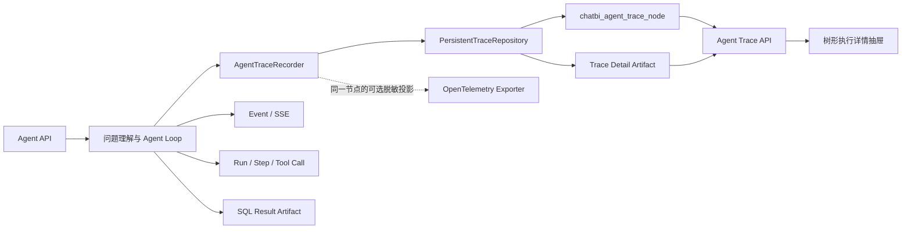

# ChatBI Agent 树形执行 Trace 实施计划

**日期：** 2026-08-12

**状态：** 已实施（阶段 1～阶段 7 已完成）

**当前进度（2026-08-12）：**

- 阶段 1 已完成：公共契约、Trace Node ORM/Repository、迁移、详情 Artifact Gateway、会话清理和定向测试；
- 阶段 2 已完成：统一 `AgentTraceRecorder`、ContextVar 父子传播、独立 Session Repository、可选 OpenTelemetry 导出，以及 `invoke_agent`、`chat`、`execute_tool` 三处旧埋点迁移；
- 阶段 3 已完成：请求接入、问题理解三模型调用、并行父子关系、合并和确定性校验已接入统一 Trace；
- 阶段 4 已完成：ReAct 轮次、规划模型、工具执行、结果投影、澄清恢复和最终结束已接入统一 Trace；
- 阶段 5 已完成：Trace 摘要与节点详情 API、归属校验、详情权限、Artifact 懒加载和 unavailable/partial 契约已完成；
- 阶段 6 已完成：Agent 执行详情调用树、前端树投影与完整性校验、筛选搜索、默认展开、并行标记、详情懒加载、权限降级和状态轮询已完成；
- 阶段 7 已完成：确认生产代码不存在旧 `AgentTracer.span()` 入口，以架构守卫禁止业务代码直接创建 Span；补齐 Run 根节点成功、失败、取消和 partial 终态；更新 Event/Timeline/Trace 与 Agent Loop 文档并完成迁移、权限、后端和前端验收。

**依据：** `25-chatbi-agent-loop-current-implementation.md`、当前 Trace/Event/Timeline 实现和已确认的执行详情展示需求

**实施范围：** 持久化 Trace、OpenTelemetry 导出、问题理解与 Agent Loop 埋点、Trace 查询 API、执行详情树形界面、权限脱敏、Artifact 和清理

## 1. 目标与结论

本计划将当前只负责 OpenTelemetry Span 的 Agent Trace，升级为一次 Agent Run 从用户问题到最终结束的完整树形执行记录。

实施后的职责必须收敛为：

1. **持久化 Trace 是 Agent 执行详情的唯一数据源。**
2. 业务代码只通过一套 Trace Recorder 记录节点，不分别编写“执行详情埋点”和 OpenTelemetry 埋点。
3. OpenTelemetry 是同一 Trace 节点的可选脱敏导出，不是前端执行详情的数据源。
4. Event 继续负责实时产品进度；Agent Run 继续负责生命周期和恢复；Result Artifact 继续负责完整 SQL 结果和其他大数据。
5. 执行详情以树形结构展示父子调用，每个节点可以查看输入、输出、状态、耗时、Token、错误和必要的状态变化。
6. Trace 记录失败不能改变 Agent 的业务结果，但页面必须明确显示 Trace 不完整，不能静默伪装成完整流程。

目标界面覆盖：

- 用户输入和请求接入；
- 问题理解内部的模型调用、并行任务、结果合并和确定性校验；
- 每轮 ReAct 的 Working State、模型规划、工具准备、工具执行、结果投影和 Observation；
- SQL 生成、校验、权限改写、执行和结果 Artifact；
- 澄清挂起与恢复；
- 最终分析回复与图表配置生成、状态持久化和运行终态。

## 2. 非目标

本次不处理：

- 将 Event 改造成 Trace；
- 使用 Event、Step 和 Tool Call 在前端再次拼接一棵执行树；
- 将完整 SQL 结果集直接写入 Trace 节点；
- 将 API Key、Authorization、数据库密码等秘密写入任何 Trace；
- 为旧 Agent Run 根据 Event 猜测或补造历史 Trace；
- 替换当前 Function Calling ReAct 主循环；
- 增加火焰图、调用积分等与本次树形详情无关的展示；
- 将 Graph Workflow Trace 一并迁移到新 Agent Trace。

## 3. 当前基线与缺口

### 3.1 当前 Trace

当前 `apps/trace` 是 OpenTelemetry 的轻量适配层，只创建：

- `invoke_agent`：一次首次执行或澄清恢复调用；
- `chat`：一次 Agent 规划模型调用；
- `execute_tool`：一次工具执行。

当前属性白名单只允许低基数、非敏感属性，例如 Run、Step、Tool Call ID、模型名称、Token、耗时和错误类型。Prompt、模型输出、SQL、语义候选和状态变化都不进入 Trace。

当前 Trace 还具有以下运行特征：

- `AGENT_TRACING_ENABLED=false` 时完全关闭；
- `AGENT_TRACING_SAMPLE_RATE=0` 时不创建 Span；
- 通过 OTLP 导出，没有应用内查询 API；
- 导出和 Span 写入异常会被隔离，不能影响 Agent；
- 首次执行和每次澄清恢复分别产生独立根 Span，当前没有跨请求的持久化树根。

### 3.2 当前执行过程数据

| 数据 | 当前用途 | 对完整执行树的不足 |
| --- | --- | --- |
| `ChatbiAgentRun` | 生命周期、消息、预算、固定时间和恢复状态 | 没有节点父子关系和单节点输入输出 |
| `ChatbiAgentStep` | 一次模型规划轮次 | 不记录问题理解子任务和模型完整输入输出 |
| `ChatbiAgentToolCall` | Tool Call 事实、摘要、耗时和错误 | 不记录 Tool 内部校验、结果投影和 Observation |
| Event | SSE 进度、历史恢复和产品时间线 | 载荷是产品摘要，不是调试数据 |
| Result Artifact | 完整 SQL 结果 | 不保存模型、校验和状态变化详情 |
| `AgentTimeline` | 用户可读的扁平执行过程 | 没有完整父子调用树，数据来自 Event/Step/Tool Call 拼接 |
| 旧 `ExecutionDetails` | 旧 Chat Log 列表 | 不适用于 Agent 的 ReAct 和工具树 |

### 3.3 需要解决的问题

1. Trace 目前不是持久化产品数据，无法保证每个 Agent Run 都能查询。
2. Trace 只有三类 Span，无法表示问题理解和 Agent 内部关键步骤。
3. 当前业务埋点和 OpenTelemetry Span 接口只允许属性，没有输入、输出和状态差异契约。
4. 问题理解中的意图识别与维度识别在线程池并行执行，父节点上下文需要显式复制。
5. 澄清恢复跨 HTTP 请求，需要复用同一个持久化 Run 根节点。
6. 调试详情包含 Prompt、SQL、Schema 和语义候选，需要独立权限、脱敏和大小控制。
7. 前端当前有旧执行详情抽屉和 AgentTimeline，但没有 Agent 调用树组件。

## 4. 目标职责

| 组件 | 实施后的唯一职责 |
| --- | --- |
| Trace | 完整执行调用树、节点输入输出、状态、耗时、Token、错误和状态差异 |
| OpenTelemetry Exporter | 将同一 Trace 节点的低基数、脱敏字段导出到外部观测平台 |
| Event | 实时推送用户可见进度，支持补拉，不承载调试详情 |
| Agent Run | 维护运行、等待、完成、失败和取消状态，保存恢复快照 |
| Step | 保留一次 ReAct 推理轮次的业务事实和预算统计 |
| Tool Call | 保留模型 Tool Call 的业务事实、状态和错误 |
| Result Artifact | 保存完整 SQL 结果等大对象；Trace 只保存引用和安全摘要 |
| Trace API | 校验记录归属和调试权限，返回树节点及按需加载的详情 |
| 执行详情页面 | 只读取 Trace API，不再拼接 Event、Step 和 Tool Call |

AgentTimeline 可以继续作为回答区中的简洁产品进度，不属于执行详情页面，也不承担调试追溯。

## 5. 业务不变量

实施各阶段必须保持：

1. 每个已接受并创建 Agent Run 的请求只能有一个持久化 Trace 根节点。
2. 首次执行和所有澄清恢复都挂在同一个 Run 根节点下。
3. 每个子节点的 `run_id` 必须与父节点一致。
4. 节点顺序由同一 Run 内的稳定 `sequence` 表示；并行关系由相同父节点和重叠时间表示。
5. 节点输入输出必须先经过节点类型对应的投影和统一脱敏，禁止任意对象直接序列化入库。
6. API Key、Authorization、Cookie、密码、数据库连接信息和模型密钥永不记录。
7. 完整 SQL 结果行不进入 Trace；Trace 只记录字段、行数、样例摘要和 Artifact 引用。
8. 持久化 Trace 全量记录，不使用 OpenTelemetry 的采样开关。
9. OpenTelemetry 是否开启、采样多少、导出是否失败，都不能影响持久化 Trace 和 Agent 结果。
10. Trace 持久化失败不能使问数失败；失败必须记录日志，并在能够继续写入时将根节点标记为 `partial`。
11. 未知程序异常仍按 Agent 当前规则使 Run 失败，不能被 Trace 层吞掉。
12. Trace Recorder 只捕获明确的 Trace 存储或导出错误，不使用宽泛异常掩盖业务问题。
13. 前端没有 Trace 时明确展示“该运行没有详细 Trace”或“Trace 不完整”，不从旧 Event 静默重建。

## 6. 目标架构



箭头含义：

- `AgentTraceRecorder` 是业务代码唯一调用的 Trace 入口。
- `PersistentTraceRepository` 是执行详情的事实存储。
- OpenTelemetry Exporter 读取同一个节点上下文，输出有限属性；业务代码不再直接创建 OpenTelemetry Span。
- Trace API 只读取持久化节点和详情 Artifact，不读取 OTLP 后端。

## 7. Trace 调用树

### 7.1 节点划分原则

以下操作需要独立节点：

- LLM 调用；
- Tool 调用；
- 外部服务或数据源调用；
- 会改变后续路径的确定性校验；
- 并行、重试、澄清、恢复和终态边界；
- 重要状态投影或持久化边界。

普通字段转换、只调用一次且没有独立输入输出的小函数不单独建节点，避免把完整业务流程拆成大量没有调试价值的微节点。

### 7.2 节点类型

| `node_type` | 用途 | 示例 |
| --- | --- | --- |
| `run` | 整个 Agent Run 根节点 | Agent Run #123 |
| `invocation` | 一次首次调用或恢复调用 | 首次执行、澄清恢复 #1 |
| `phase` | 可展开的业务阶段 | 请求接入、问题理解、Agent Loop、最终结束 |
| `llm` | 一次真实模型调用 | 问题重写、意图识别、Agent Reason |
| `tool` | 一次 Tool Call | `search_semantic_assets`、`execute_sql` |
| `validation` | 确定性校验或动作守卫 | 问题理解校验、SQL 安全校验 |
| `projection` | 结果合并或状态投影 | 理解结果合并、Tool Result Projection、最终结果生成校验 |
| `persistence` | 重要持久化操作 | Result Artifact、Run 终态保存 |
| `interaction` | 用户澄清和恢复边界 | 请求澄清、接受澄清 |

### 7.3 节点状态

`status` 使用以下稳定值：

- `running`
- `succeeded`
- `failed`
- `rejected`
- `interrupted`
- `waiting`
- `cancelled`
- `skipped`
- `partial`

Tool Result 的四种状态按原值映射；Run 和阶段节点使用运行、等待、完成、失败、取消和不完整状态。

### 7.4 目标树示例

```text
Agent Run
├── 用户输入与请求接入
│   ├── 会话归属与执行绑定
│   └── 创建 ChatRecord 和 Agent Run
├── 首次执行
│   ├── 问题理解
│   │   ├── 读取会话上下文
│   │   ├── 加载维度候选
│   │   ├── 问题重写 LLM
│   │   ├── 并行理解
│   │   │   ├── 意图识别 LLM
│   │   │   └── 维度识别 LLM
│   │   ├── 理解结果合并
│   │   ├── 时间处理
│   │   └── 问题理解校验
│   ├── Agent Loop
│   │   ├── ReAct Step 1
│   │   │   ├── Working State 与可见工具
│   │   │   ├── Agent Reason LLM
│   │   │   ├── Tool Call 参数准备
│   │   │   ├── Tool 执行
│   │   │   ├── Tool Result Projection
│   │   │   └── Observation
│   │   └── ReAct Step N
│   └── 最终回答与持久化
└── 澄清恢复 #1（存在时）
    ├── 恢复消息、预算和派生状态
    ├── 合并用户回答
    └── Agent Loop
```

问题理解中的意图识别和维度识别拥有同一个父节点，开始结束时间允许重叠。前端显示为同级子节点，并使用“并行”标记，不人为改成先后关系。

## 8. 持久化模型

### 8.1 `chatbi_agent_trace_node`

新增一张统一节点表。目标字段如下：

| 字段 | 类型 | 说明 |
| --- | --- | --- |
| `id` | BigInteger | 节点主键 |
| `run_id` | BigInteger | 所属 `ChatbiAgentRun.id` |
| `parent_id` | BigInteger，可空 | 根节点为空，其他节点指向父节点 |
| `node_key` | String(160) | 同一 Run 内稳定唯一键 |
| `node_type` | String(32) | 节点类型 |
| `name` | String(128) | 稳定技术名称，如 `question_rewrite` |
| `display_name` | String(160) | 前端展示名称，如“问题重写模型” |
| `status` | String(32) | 节点状态 |
| `sequence` | Integer | 同一 Run 内创建顺序 |
| `started_at` | DateTime | 开始时间 |
| `finished_at` | DateTime，可空 | 结束时间 |
| `latency_ms` | Integer，可空 | 节点耗时 |
| `input_summary` | JSONB | 默认可展示的输入摘要 |
| `output_summary` | JSONB | 默认可展示的输出摘要 |
| `input_artifact_ref` | JSONB，可空 | 完整脱敏输入详情引用 |
| `output_artifact_ref` | JSONB，可空 | 完整脱敏输出详情引用 |
| `state_diff` | JSONB | 节点前后的可信状态差异 |
| `token_usage` | JSONB | 输入、输出和总 Token |
| `error_code` | String(128)，可空 | 稳定错误码 |
| `error_category` | String(64)，可空 | 错误分类 |
| `error` | Text，可空 | 脱敏后的错误详情 |
| `trace_id` | String(64)，可空 | OpenTelemetry Trace ID |
| `span_id` | String(32)，可空 | OpenTelemetry Span ID |
| `metadata` | JSONB | Step ID、Tool Call ID、模型、尝试次数等扩展字段 |

索引与约束：

- 唯一索引：`(run_id, node_key)`；
- 唯一索引：`(run_id, sequence)`；
- 查询索引：`(run_id, parent_id, sequence)`；
- 查询索引：`(run_id, started_at)`；
- Repository 创建子节点时校验父节点与子节点属于同一 Run；
- 不允许修改节点的 `run_id`、`parent_id`、`node_key` 和 `sequence`。

### 8.2 节点详情 Artifact

节点表只保存可快速加载的摘要。以下数据超过配置阈值或属于详细调试内容时，写入 Trace Detail Artifact：

- 完整脱敏后的 System Prompt 和 User Prompt；
- 模型原始响应与结构化解析结果；
- Schema、语义候选和检索决策详情；
- Tool 原始模型正文和结构化数据；
- SQL 校验前后内容；
- Working State、Observation 和完整状态差异。

Trace 使用独立 `TraceDetailGateway` 端口，底层复用当前 Artifact Gateway。不要把 Trace 详情伪装成 SQL Result Artifact；Artifact `kind` 明确使用：

- `agent_trace_input`
- `agent_trace_output`

每个 Artifact 的 metadata 至少包含 `run_id`、`node_id`、`chat_id`、`record_id` 和 `side=input|output`。

### 8.3 历史数据

新表上线前的历史 Agent Run 不回填调用树，原因是现有 Event 和摘要无法还原真实模型输入输出及父子关系。

旧记录打开执行详情时显示：

```text
该运行生成于详细 Trace 上线前，没有可用的树形执行记录。
```

禁止根据旧 Timeline 静默生成一棵看似完整的树。

## 9. 统一 Trace Recorder

### 9.1 目标接口

`apps/trace` 从只提供 `span()` 升级为提供节点生命周期。建议稳定接口如下：

```python
with recorder.node(spec, input_data=input_data) as node:
    result = operation()
    node.set_output(result)
    node.set_token_usage(usage)
```

节点句柄至少提供：

- `set_output(data)`
- `set_state_diff(before, after)`
- `set_token_usage(usage)`
- `set_attribute(name, value)`
- `set_status(status)`
- `set_error(code, category, message)`

接口接受的输入输出必须是明确 DTO 或经过节点投影器生成的字典。禁止传入 Session、ORM、模型客户端或任意对象后使用通用序列化器猜测。

### 9.2 单一记录路径

一次 `recorder.node()` 内部顺序为：

1. 从 ContextVar 读取当前父节点；
2. 持久化 `running` 节点并取得节点 ID、sequence；
3. 将节点 ID 压入当前调用上下文；
4. 如果配置了 OpenTelemetry Exporter，创建对应 Span；
5. 执行业务操作；
6. 投影、脱敏并保存输出、状态、错误、耗时和 Token；
7. 关闭可选 OpenTelemetry Span；
8. 恢复父节点上下文。

业务代码不能同时调用 `recorder.node()` 和 OpenTelemetry SDK，也不能保留第二套生产 `AgentTracer.span()` 调用。

### 9.3 Session 和并发

Trace Store 每次开始或结束节点使用独立短 Session，不能复用 Agent 主 Session，原因包括：

- 问题理解有线程池并发；
- Tool 运行时未来允许并行工具；
- Agent 主 Session 可能存在尚未提交的业务状态；
- Trace 写入失败不能污染业务事务。

并行任务创建前使用 `copy_context()` 将当前父节点 ContextVar 复制到工作线程。意图识别和维度识别分别复制上下文，不能让两个 Future 共享同一个可变 Context。

### 9.4 首次执行与恢复

Run 根节点在 `ChatbiAgentRun` 创建并提交后立即建立。API 接收请求的开始时间和接入校验结果先保存在当前请求的轻量结构中，Run 创建后写入“用户输入与请求接入”节点。

范围约束：只有成功创建 ChatRecord 和 Agent Run 的请求进入执行详情。功能开关关闭、会话无权访问等在 Run 创建前被 HTTP 拒绝的请求，继续进入安全审计日志，不创建没有业务归属的 Trace 根节点。

首次执行和每次恢复分别创建 `invocation` 子节点：

```text
Agent Run
├── 首次执行
├── 澄清恢复 #1
└── 澄清恢复 #2
```

恢复时通过 `run_id` 查询并复用根节点，不依赖上一次 HTTP 请求的内存 ContextVar 或 OpenTelemetry Trace ID。

### 9.5 Trace 故障

新增稳定错误 `TraceWriteError`。Trace Recorder 只隔离：

- 节点持久化错误；
- Trace Detail Artifact 写入错误；
- OpenTelemetry 创建、属性和关闭错误。

隔离后的处理：

1. 记录明确日志，包含 `run_id`、父节点和节点名称；
2. 后续能够写入时，将 Run 根节点标记为 `partial` 并增加丢失节点计数；
3. Agent 业务继续执行；
4. 执行详情页面显示“Trace 不完整”；
5. 不把 Trace 错误转换成 Tool Observation，避免模型处理基础设施问题。

## 10. 输入、输出和脱敏规则

### 10.1 两级展示

| 级别 | 内容 | 权限 |
| --- | --- | --- |
| 摘要 | 节点名称、状态、耗时、Token、数量、错误码和安全摘要 | 记录所有者 |
| 详细 | Prompt、模型响应、SQL、Schema、语义候选、状态差异和 Observation | 记录所有者且具备 Agent 调试详情权限 |

如果当前权限系统还没有独立的 Agent 调试权限，需要在 Trace Detail API 上线前增加明确权限项。不能只依靠前端隐藏按钮。

### 10.2 永不记录

- API Key 和模型密钥；
- Authorization、Cookie、Session Token；
- 数据库用户名、密码、连接串和私钥；
- HTTP 请求头中的认证信息；
- 未经限制的完整 SQL 结果行；
- Python Traceback 中可能包含的秘密环境变量。

### 10.3 节点投影器

按节点类型建立集中投影器：

- LLM：模型名称、Prompt、响应、结构化结果、Token、尝试次数；
- Tool：原始 Tool Call、准备后参数、Tool Result、状态补丁和 Observation；
- Validation：校验输入、规则结果、错误码和修正结果；
- Persistence：对象类型、对象 ID、大小、摘要和 Artifact 引用；
- State Projection：只记录允许字段的 before/after 和差异。

投影器先使用字段白名单，再执行统一秘密字段清理。只使用秘密字段黑名单不足以保证安全。

### 10.4 大小限制

建议首版限制：

- 节点 `input_summary` 和 `output_summary` 各不超过 8 KB；
- `state_diff` 不超过 16 KB；
- 超过摘要限制的脱敏详情写入 Artifact；
- Trace Tree API 首次响应不返回 Artifact 正文；
- 节点详情 API 按点击懒加载；
- SQL Result Artifact 只通过原结果权限接口读取，不复制到 Trace Detail Artifact。

阈值应统一配置并由投影器执行，不能由每个埋点自行截断。

## 11. 埋点范围和代码位置

### 11.1 请求接入

| 节点 | 输入 | 输出 | 主要位置 |
| --- | --- | --- | --- |
| 用户输入与请求接入 | chat_id、question、requested datasource | record_id、run_id、执行绑定 | `agent/service.py` |
| 会话归属与执行绑定 | 当前用户、会话和请求数据源摘要 | dataset_id、datasource_id、校验状态 | `agent/service.py` |
| 创建运行记录 | 绑定、配置、固定时间上下文 | Run 和 ChatRecord 标识 | `agent/service.py` |

### 11.2 问题理解

| 节点 | 输入 | 输出 | 主要位置 |
| --- | --- | --- | --- |
| 读取会话上下文 | chat_id、history_rounds | 最近问答摘要、上次重写问题 | `agent/preparation.py` |
| 加载维度候选 | tenant_id、dataset_id | 候选数量和脱敏候选详情 | `understanding_service.py` |
| 问题重写 LLM | System Prompt、问题、上下文 | 原始响应、结构化重写、Token | `understanding_service.py` |
| 意图识别 LLM | Prompt、重写问题 | 意图、指标、时间、查询形态、Token | `understanding_service.py` |
| 维度识别 LLM | Prompt、重写问题、维度候选 | 维度槽位、筛选和 Token | `understanding_service.py` |
| 模型修复尝试 | 校验错误和 repair_feedback | 修复响应或失败 | `_invoke_validated_model()` |
| 理解结果合并 | rewrite、intent、dimensions | 合并后的 Intent | `understanding_service.py` |
| 时间处理 | 时间表达、固定时间上下文 | 归一化时间或时间澄清 | `understanding_service.py` |
| 问题理解校验 | 完整理解结果 | valid 或 clarification_required | `validation.py`、`preparation.py` |

问题重写是并行理解的父级前置节点；意图识别和维度识别必须是并行阶段下的同级节点。修复重试作为对应 LLM 节点的子节点或 `attempt` 子节点记录，不能覆盖第一次失败事实。

### 11.3 Agent Loop

每个 ReAct Step 建立一个 `phase` 节点，并关联当前 `ChatbiAgentStep.id`：

| 子节点 | 输入 | 输出 | 主要位置 |
| --- | --- | --- | --- |
| 预算与取消检查 | 预算快照、Run 状态 | planning mode、verdict | `loop.py` |
| Working State 与可见工具 | 可信 Context | progress、recommended、available tools | `reasoning.py`、`working_state.py` |
| Agent Reason LLM | System、Working State、messages、Tool definitions | reasoning、原始 Tool Calls、Token | `reasoning.py` |
| Tool Call 参数准备 | 原始 Tool Call、可信状态 | 准备后 Tool Call、调整记录 | `reasoning.py`、`registry.py` |
| 动作守卫 | 当前进度、Tool Call | allowed 或 rejection | `tool_execution.py` |
| Tool 执行 | 准备后参数、超时、取消状态 | Tool Result | `tool_execution.py` |
| Tool Result Projection | Tool Result、当前状态 | state_patch、control、events、audit | `tool_results.py` |
| Observation | Tool Result 和更新后状态 | 模型 Observation | `working_state.py`、`tool_execution.py` |
| Step 快照保存 | messages、budget、derived_state 摘要 | 持久化状态 | `tool_execution.py` |

### 11.4 Tool 内部

首版只展开对调试有直接价值的内部子节点：

- `search_semantic_assets`
  - 查询权限策略；
  - 语义检索；
  - 授权表过滤；
  - Scope 和编译计划投影。
- `compile_semantic_sql`
  - Scope 与资产白名单校验；
  - 权限变化检查；
  - 时间计划校验；
  - 语义编译服务。
- `validate_sql`、`execute_sql`
  - 解析查询权限；
  - 初次 SQL 安全校验；
  - 禁止字段检查；
  - 行权限改写；
  - 改写后 SQL 二次校验；
  - 数据库驱动执行；
  - SQL Result Artifact 保存。
- `clarify`
  - 原始候选校验；
  - 结构化选项规范化；
  - 挂起状态保存。
- `finish`
  - 真实结果存在性校验；
  - 分析回复模型生成并校验最终回复；
  - 图表配置模型生成并校验图表配置。

术语和 SQL 示例工具首版只记录工具整体节点，不展开内部 Repository 查询。

### 11.5 最终结束

| 节点 | 输入 | 输出 | 主要位置 |
| --- | --- | --- | --- |
| 最终回答与图表生成 | 真实执行结果、问题和 Intent | 结构化分析回复、SQL、图表配置 | `agent_finalization.py` |
| 保存 ChatRecord | 最终结果摘要和 Artifact 引用 | ChatRecord succeeded | `lifecycle.py` |
| 保存 Run 终态 | messages、budget、错误或结果 | finished/failed/cancelled | `lifecycle.py` |
| 发布终态 Event | Run 终态摘要 | answer/run-finished 等 Event | `lifecycle.py` |

## 12. Trace 查询 API

### 12.1 树查询

新增：

```text
GET /api/v1/chat/agent/record/{record_id}/trace
```

后端必须先使用 `ChatRecordService.get_owned()` 校验记录归属，再查询最新 Agent Run 的 Trace。

响应采用“根信息 + 扁平节点列表”，不直接返回递归 JSON，前端根据 `parent_id` 构造树。这样可以稳定排序，也避免深层递归结构难以分页和增量更新。

根信息至少包含：

- record_id、run_id、Run 和 Trace 状态；
- 开始、结束和总耗时；
- 总 Token、LLM 调用数、Tool 调用数、失败数；
- Trace 是否完整；
- 首次执行和恢复次数。

节点摘要至少包含：

- id、parent_id、node_type、name、display_name；
- status、sequence、开始结束时间和耗时；
- token_usage、error_code、error_category；
- input_summary、output_summary；
- 是否存在输入或输出详情；
- metadata 中允许公开的 Step ID、Tool Call ID、模型名和并行标记。

### 12.2 节点详情

新增：

```text
GET /api/v1/chat/agent/trace/nodes/{node_id}
```

查询步骤：

1. 根据节点取得 run_id；
2. 根据 Run 取得 record_id；
3. 校验当前用户拥有该 ChatRecord；
4. 校验 Agent 调试详情权限；
5. 读取输入、输出 Artifact；
6. 再次执行响应字段白名单；
7. 返回节点详情。

详情响应包含输入、输出、状态差异、错误、Token、Trace/Span ID 和关联 Artifact，不返回秘密字段和完整 SQL 结果集。

### 12.3 运行中刷新

不增加第二条 Trace SSE：

- Agent 运行仍通过现有 Event/SSE 推送状态；
- 执行详情抽屉打开且 Run 为运行态时，前端按固定间隔刷新 Trace Tree；
- Run 到达等待、完成、失败或取消后停止轮询；
- 页面提供手动刷新；
- 后续如果数据库压力证明轮询不可接受，再单独评估按 sequence 增量查询。

## 13. 前端设计

### 13.1 组件结构

建议新增：

```text
frontend/src/views/chat/execution-component/
├── AgentTraceDetailsDrawer.vue
├── AgentTraceTree.vue
├── AgentTraceTreeNode.vue
├── AgentTraceNodeDetail.vue
└── agentTraceProjection.ts
```

`ExecutionDetails.vue` 根据 ChatRecord 的 `execution_type` 明确选择：

- Agent：使用 `AgentTraceDetailsDrawer`；
- 旧 Chat：保留当前 Chat Log 详情；
- Graph Workflow：继续使用 Graph 自有 Trace 页面。

不能在 Agent Trace API 返回 404 时静默退回旧 Chat Log。

### 13.2 抽屉布局

顶部概览：

- Trace 状态；
- 总耗时；
- 总 Token；
- LLM 调用次数；
- Tool 调用次数；
- 失败和恢复次数。

主体使用上下或左右两区：

- 调用树：展示层级、类型图标、状态、耗时和 Token；
- 节点详情：展示概览、输入、输出、状态变化、错误和原始 JSON。

默认展开：

- Run 根节点；
- 一级阶段；
- 当前运行、等待或失败节点的祖先链。

默认收起：

- 成功 LLM 的完整 Prompt；
- 成功 Tool 的原始 JSON；
- 重复的持久化和事件节点。

### 13.3 节点交互

- 点击节点选中并加载详情；
- 展开图标只负责展开，不同时触发选择；
- 支持“仅看失败”“仅看 LLM”“仅看 Tool”；
- 支持按名称搜索；
- JSON、Prompt 和 SQL 使用等宽字体并支持复制；
- 大详情加载时显示独立 loading，不阻塞整棵树；
- `partial` 节点和 Trace 根部展示明确警告；
- 并行节点展示同级关系和并行标识，不根据返回顺序伪造成串行。

## 14. 分阶段实施

### 阶段 0：基线与契约确认

**目标：** 固定当前 Trace、Event、Timeline 和 Agent 行为，避免改造过程中混淆职责。

任务：

1. 保存当前 `invoke_agent/chat/execute_tool` Span 层级测试。
2. 保存问题理解三模型调用、并行顺序、修复重试测试。
3. 保存标准语义路径、物理 SQL 路径、澄清恢复、失败、预算和取消测试。
4. 确认当前 Alembic head；当前仓库为 `099_agent_run_temporal_context`，实施时以实际 head 为准。
5. 确认 Agent 调试详情权限的产品范围。
6. 确认 Trace 数据保留期限；首版建议跟随 ChatRecord 生命周期。

完成标准：不修改生产行为，定向测试基线可重复。

### 阶段 1：Trace 契约、Repository 和迁移

**目标：** 建立不依赖 OpenTelemetry 的持久化 Trace 核心。

任务：

1. 新增 Trace Node DTO、状态枚举、节点规范和 Repository 协议。
2. 新增 `ChatbiAgentTraceNode` ORM 和 Repository。
3. 新增 Alembic 迁移；按当前 head 预计使用 `100_chatbi_agent_trace_node`。
4. 实现 run 内 sequence 分配、父子 run_id 校验和节点终态更新。
5. 实现 Trace Detail Writer，复用 Artifact Gateway。
6. 将 Trace 节点加入会话删除清理；Trace Detail Artifact 使用现有会话 Artifact 清理机制。
7. 增加节点摘要和详情大小限制。

主要文件：

- `backend/apps/trace/`
- `backend/apps/chatbi/models/orm/agent_trace.py`
- `backend/apps/chatbi/repository/sqlmodel/agent_trace_repository.py`
- `backend/alembic/versions/`
- `backend/apps/chatbi/adapters/execution_cleanup.py`

完成标准：可以创建、结束、失败、查询一棵脱离 OpenTelemetry 的持久化测试树。

### 阶段 2：统一 Recorder 与 OpenTelemetry 导出

**目标：** 业务只使用一个 Trace Recorder，OpenTelemetry 成为可选导出器。

任务：

1. 实现 `AgentTraceRecorder`、节点句柄和 ContextVar 父节点传播。
2. 实现独立 Session 的 PersistentTraceRepository Adapter。
3. 将当前 `OpenTelemetryAgentTracer` 改为 Trace Node Exporter。
4. 保留当前低基数属性白名单，增加 node_type、node_name 和持久化 node_id 等安全关联字段。
5. 替换 `invoke_agent/chat/execute_tool` 的旧 `span()` 调用。
6. 删除生产调用方对旧 `AgentTracer.span()` 的使用；阶段结束后只保留一个生产 Recorder 入口。
7. 验证 OpenTelemetry 关闭、零采样和导出故障时，持久化 Trace 仍完整。
8. 验证持久化 Trace 故障时 Agent 结果不变且 Trace 标记不完整。

主要文件：

- `backend/apps/trace/api.py`
- `backend/apps/trace/setup.py`
- `backend/apps/trace/attributes.py`
- `backend/apps/chatbi/composition.py`
- `backend/apps/chatbi/orchestration/agent/composition.py`

完成标准：一次 `recorder.node()` 同时满足持久化和可选 OTEL 导出，业务代码没有双埋点。

### 阶段 3：请求接入和问题理解 Trace

**目标：** 从用户问题开始完整展示问题理解内部过程。

任务：

1. 记录用户输入、会话归属、执行绑定和 Run 创建。
2. 在 Agent 首次执行和恢复入口建立 invocation 节点。
3. 为读取会话上下文和维度候选建立节点。
4. 为问题重写、意图识别和维度识别建立 LLM 节点。
5. 为每次格式修复尝试保留独立 attempt 节点。
6. 使用 `copy_context()` 保证并行意图和维度节点拥有相同父节点。
7. 记录理解结果合并、时间处理、确定性校验和前置澄清。
8. Prompt、模型原始响应和结构化结果经过投影、脱敏和 Artifact 限长。

主要文件：

- `backend/apps/chatbi/orchestration/agent/service.py`
- `backend/apps/chatbi/orchestration/agent/preparation.py`
- `backend/apps/chatbi/services/understanding/understanding_service.py`
- `backend/apps/chatbi/services/understanding/model_invocation.py`
- `backend/apps/chatbi/services/understanding/validation.py`

完成标准：真实问题理解执行能形成重写父节点以及并行意图、维度子树，输入输出和 Token 可查。

### 阶段 4：Agent Loop、Tool 和结束 Trace

**目标：** 完整记录每轮 ReAct 和关键 Tool 内部处理。

任务：

1. 每个 Agent Step 创建一个 ReAct 节点，并关联 `step_id`。
2. 记录预算、取消、Working State、可见工具和规划模式。
3. 记录 Agent LLM 的完整脱敏输入、原始输出、准备前后 Tool Call 和 Token。
4. 记录动作守卫、重复熔断、SQL 修正预算和澄清预算。
5. 记录 Tool 整体节点及第 11.4 节规定的关键内部子节点。
6. 记录 Tool Result Projection 的 state_patch、control、events 和 audit summary。
7. 记录 Observation 的 Tool 消息形态和 Working State 投影。
8. 记录预算软收口、直接回答拒绝、取消和失败分支。
9. 记录最终分析回复与图表配置生成、ChatRecord 保存、Run 终态和终态 Event。
10. 澄清挂起时关闭当前 invocation 节点为 `waiting`；恢复时新建 invocation 子节点并继续同一 Run 根树。

主要文件：

- `backend/apps/chatbi/orchestration/agent/loop.py`
- `backend/apps/chatbi/orchestration/agent/reasoning.py`
- `backend/apps/chatbi/orchestration/agent/tool_execution.py`
- `backend/apps/chatbi/orchestration/agent/tool_results.py`
- `backend/apps/chatbi/orchestration/agent/working_state.py`
- `backend/apps/chatbi/orchestration/agent/lifecycle.py`
- `backend/apps/tool/tools/semantic.py`
- `backend/apps/tool/tools/datasource.py`
- `backend/apps/chatbi/services/generation/agent_finalization.py`

完成标准：标准问数、兜底问数、澄清、失败和取消均能从根节点追踪到唯一终态。

### 阶段 5：Trace API、权限和详情加载

**目标：** 提供前端唯一使用的执行详情接口。

任务：

1. 新增 Trace Tree 和 Trace Node Detail DTO。
2. 新增树查询和节点详情接口。
3. 所有接口执行 ChatRecord 归属校验。
4. 详情接口执行 Agent 调试详情权限校验。
5. 实现 Artifact 懒加载、字段白名单、响应大小限制和不存在语义。
6. 根节点为 `partial` 或 Run 已终止但根仍是 `running` 时返回 `trace_complete=false`。
7. 历史 Run 无 Trace 时返回明确的 `trace_unavailable`，不 fallback 到 Timeline。
8. 增加按 run_id、parent_id、sequence 的稳定排序和并行标记投影。

主要文件：

- `backend/apps/chatbi/api/interactions.py`
- `backend/apps/chatbi/models/dto/agent_trace.py`
- `backend/apps/chatbi/services/trace_query_service.py`
- `backend/apps/chatbi/repository/sqlmodel/agent_trace_repository.py`

完成标准：授权用户可以先加载完整树摘要，再按节点加载详细输入输出；越权请求返回 404 或明确权限拒绝。

### 阶段 6：前端树形执行详情

**目标：** 在现有执行详情抽屉中展示调用树和节点详情。

任务：

1. 扩展 `agent-chat.ts` 的 Trace Tree 和 Node Detail API 类型。
2. 新增树投影、状态映射和父子完整性校验。
3. 实现概览卡片、调用树、节点详情、筛选、搜索和刷新。
4. Agent 记录从 `ExecutionDetails.vue` 明确路由到 Agent Trace 组件。
5. 运行态打开抽屉时轮询，终态后停止。
6. 处理 waiting、partial、failed、cancelled 和 trace_unavailable。
7. Prompt、JSON、SQL 使用懒加载和复制功能。
8. 未具备详情权限时只显示摘要，不发起详情请求。
9. 保留 `AgentTimeline` 作为回答区简洁进度，不将其数据混入执行详情。

完成标准：用户可以从根节点展开到任一 LLM、Tool、校验和持久化节点，并查看对应的安全输入输出。

### 阶段 7：清理、文档与总验收

**目标：** 删除旧 Trace 生产入口并完成端到端验证。

任务：

1. 删除旧业务代码中的 `AgentTracer.span()` 入口和不再使用的适配类。
2. 保留 OpenTelemetry SDK 的惰性加载和明确 ImportError 规则。
3. 更新 `16-agent-event-and-observability-trace-design.md`，重新定义 Trace、Event 和 Timeline 职责。
4. 更新 `25-chatbi-agent-loop-current-implementation.md`，加入树形 Trace 数据流。
5. 补充 Trace 节点类型、输入输出字段和脱敏规则说明。
6. 执行后端、前端、迁移、权限和端到端验收。
7. 检查不存在旧 Trace 与新 Trace 双写、Timeline fallback 和未清理的详情 Artifact。

完成标准：生产执行详情只有持久化 Trace 一条数据路线，OpenTelemetry 只通过 Recorder Exporter 输出。

## 15. 测试计划

### 15.1 Trace 核心单元测试

- 根节点和嵌套子节点；
- 同 Run sequence 连续且唯一；
- 跨 Run 父节点拒绝；
- 成功、失败、拒绝、中断、等待、取消和 partial；
- ContextVar 入栈和出栈；
- 异常时节点正确结束且业务异常继续抛出；
- TraceWriteError 被隔离，其他异常不被吞掉；
- 输入输出投影、白名单和秘密字段清理；
- 摘要截断和 Artifact 写入；
- Artifact 写入失败后的 partial 标记；
- 节点详情删除和会话清理。

### 15.2 并发测试

- 意图和维度任务为同一父节点的两个子节点；
- 两个并行节点时间允许重叠；
- 子线程不共享可变 Context；
- 并发 sequence 不重复；
- Trace 独立 Session 不污染 Agent 主 Session；
- OpenTelemetry 父 Span 与持久化 parent_id 一致。

### 15.3 问题理解集成测试

- 三个模型调用输入输出完整；
- 意图调用不接收维度输出；
- 维度调用不接收意图输出；
- 格式错误后的 repair attempt 保留第一次失败；
- 确定性 validation 输出可查；
- 时间权威、时间旁路和时间澄清分支；
- 前置维度澄清和恢复。

### 15.4 Agent Loop 集成测试

- 标准语义路径；
- 语义歧义与澄清恢复；
- 物理 SQL 兜底路径；
- SQL 校验失败后修正；
- 重复 Tool Call 熔断；
- SQL 修正预算和澄清预算；
- soft 模式和预算耗尽；
- 模型直接回答被拒绝；
- 用户取消；
- Tool 超时和底层操作可能完成；
- Result Artifact 失败；
- 最终回答确定性投影；
- 每条路径只有一个 Run 根节点和正确终态。

### 15.5 OpenTelemetry 测试

- 启用时 Span 层级与持久化树关键节点对应；
- Trace/Span ID 正确回写节点；
- 关闭和零采样时持久化树不受影响；
- 导出失败时持久化树和 Agent 结果不受影响；
- 导出属性不包含 Prompt、SQL、结果行和秘密字段。

### 15.6 API 测试

- 记录所有者读取树；
- 非所有者无法读取；
- 没有调试详情权限只能读取摘要；
- 节点详情懒加载；
- Artifact 不存在或损坏；
- trace_unavailable 和 partial；
- 树节点排序和父子完整性；
- 运行中、等待、完成、失败和取消状态。

### 15.7 前端测试

- 扁平节点正确构造成树；
- 缺失父节点时显示数据异常，不挂死页面；
- 默认展开和失败祖先展开；
- 并行节点展示；
- 节点详情加载、失败和无权限；
- 搜索和类型筛选；
- 运行态轮询和终态停止；
- 历史记录 trace_unavailable；
- Agent、旧 Chat 和 Graph 执行详情明确路由。

## 16. 性能与容量验证

实施前使用真实模型路径记录当前基线，实施后比较：

- Agent 总耗时；
- Trace 节点写入次数和数据库耗时；
- 单 Run 节点数量；
- 单 Run 摘要 JSONB 大小；
- Trace Detail Artifact 数量和总大小；
- Trace Tree API 首次响应大小和耗时；
- 节点详情 API 耗时；
- 线程池并行任务是否因 Trace 写入退化为串行。

首版优化顺序：

1. 只把有调试价值的边界建成节点，避免微节点；
2. 树接口只返回摘要；
3. 详情按节点懒加载；
4. Artifact 复用现有存储和会话清理；
5. 如果独立 Session 每节点两次写入成为瓶颈，再评估批量更新，但不能先牺牲异常节点完整性。

## 17. 发布与迁移

### 17.1 数据库顺序

1. 合入 ORM、Repository 和向前兼容的新表迁移；
2. 部署后端 Recorder 和埋点；
3. 验证新 Run 可以查询完整 Trace；
4. 部署 Trace API；
5. 部署前端树形执行详情；
6. 删除旧生产 Trace Span 入口；
7. 更新技术文档。

新表是新增结构，不修改现有 Run、Step、Tool Call 和 Event 数据，回滚前端或 API 不影响 Agent 执行。

### 17.2 切换规则

- 不进行旧 Trace 和新 Trace 两套业务埋点双写；
- OpenTelemetry 导出必须从新 Recorder 内完成；
- 前端通过 `execution_type=agent` 明确使用 Trace API；
- 新 Run 缺少 Trace 视为异常并展示 unavailable/partial，不 fallback；
- 旧 Run 根据创建时间或 Trace 根节点不存在展示历史提示。

### 17.3 回滚

- 前端可以回滚为不展示 Agent 详细执行树，Agent 回答不受影响；
- Trace API 可以停用，持久化节点继续保留；
- Recorder 如出现性能问题，可关闭详细 Artifact 写入并保留节点摘要，不能恢复成从 Event 拼树；
- OpenTelemetry Exporter 可以独立关闭；
- 数据库表只在确认没有版本读取后通过后续迁移删除，不在应用回滚时直接删除。

## 18. 验收标准

### 18.1 数据完整性

1. 每个新 Agent Run 恰好一个 Trace 根节点。
2. 根节点能够覆盖用户输入、问题理解、全部 ReAct Step、最终回答或失败终态。
3. 问题理解的意图和维度模型显示为并行同级节点。
4. 每个 LLM 节点记录模型、输入输出摘要、Token、耗时和错误。
5. 每个 Tool 节点记录准备前后参数、Tool Result、状态投影和 Observation。
6. 澄清恢复继续挂在原 Run 根节点。
7. Trace 缺失时明确显示 unavailable/partial，不生成虚假节点。

### 18.2 安全

1. 非记录所有者不能访问 Trace。
2. 无调试详情权限不能读取 Prompt、SQL、Schema 和原始输出。
3. Trace 数据、Artifact、API 和 OpenTelemetry 中均不存在密钥、密码和认证头。
4. 完整 SQL 结果不复制到 Trace。
5. 会话删除后 Trace 节点和 Trace Detail Artifact 都进入清理流程。

### 18.3 单一路线

1. 执行详情页面只调用 Trace API。
2. 业务代码只调用 `AgentTraceRecorder`。
3. OpenTelemetry 只由 Recorder 的 Exporter 产生。
4. Event、Timeline、Step 和 Tool Call 不再作为执行详情树的数据源。
5. 代码中不存在旧 `AgentTracer.span()` 与新 Recorder 并行生产的路径。

### 18.4 稳定性

1. Trace 和 OpenTelemetry 故障不改变 Agent 最终答案和 Event 顺序。
2. 未声明业务异常仍使 Run 正确失败。
3. 并行理解、工具取消、超时和澄清恢复均保持原业务语义。
4. 定向测试、完整后端测试、前端类型检查和前端测试通过。
5. Alembic upgrade、downgrade 和重新 upgrade 验证通过。

## 19. 实施完成后的文档变化

代码验收后同步更新：

- `16-agent-event-and-observability-trace-design.md`
  - Trace 从“仅 OpenTelemetry”改为“持久化执行 Trace + 可选 OTEL 导出”；
  - Timeline 继续描述为产品进度，不再承担执行详情。
- `25-chatbi-agent-loop-current-implementation.md`
  - 在问题理解、ReAct、Tool、澄清和最终持久化章节增加 Trace 节点映射；
  - 更新当前已知限制。
- 新增执行详情使用说明
  - 节点类型；
  - 输入输出字段；
  - 权限和脱敏；
  - unavailable、partial 和历史记录的含义。
