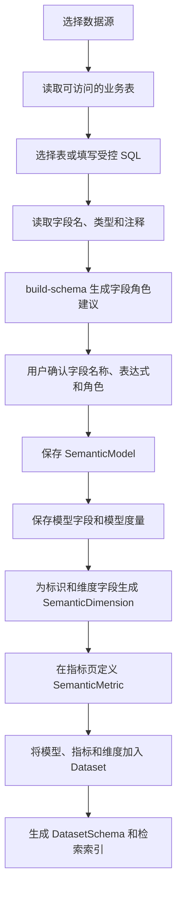
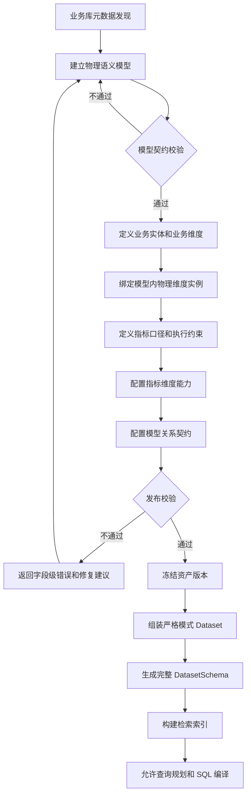
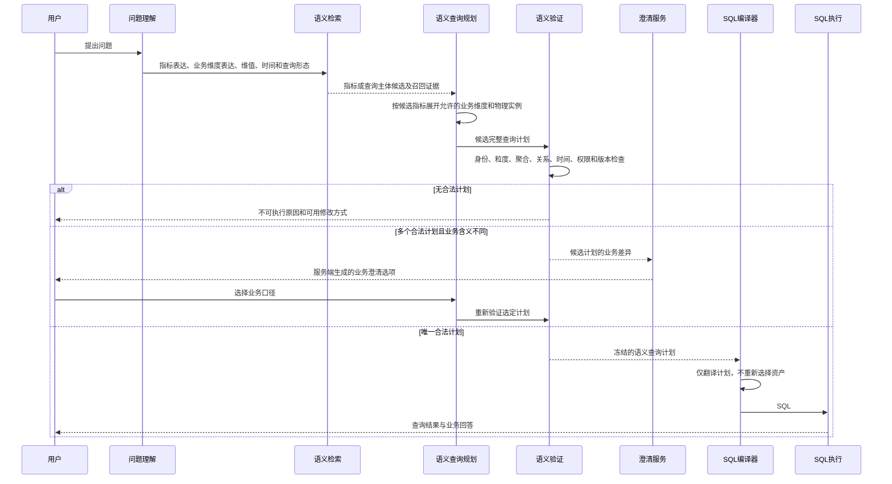

# 可证明查询正确性的完整语义模型升级方案

**状态：** 技术设计与执行计划

**创建日期：** 2026-08-13

**适用范围：** `backend/apps/semantic/`、`backend/apps/retrieval/`、`backend/apps/chatbi/`、`backend/apps/tool/`、Semantic 管理端
**关联文档：** [指标维度语义层技术设计](./01-metric-dimension-semantic-layer-tech-design.md)、[Semantic 语义资产存储差距与表结构改造方案](./07-headless-semantic-asset-storage-gap-tech-design.md)、[Agent Loop 当前实现](./25-chatbi-agent-loop-current-implementation.md)

## 1. 概览

本方案将当前语义层从“管理并检索指标、维度资产”升级为“能够生成、验证并冻结完整语义查询计划”的系统。业务数据库仍是物理数据根源，发布后的语义资产仍是标准 SQL 的唯一业务来源；变化集中在指标与维度之间增加可执行约束，使系统能够在编译前证明所选指标、维度、时间和模型关系可以共同组成正确查询。

升级后的语义层需要同时保证：

- 用户表达只绑定到业务指标、业务实体和业务维度，不向用户暴露表、模型或物理资产选择。
- 每个指标必须声明基础模型、数据粒度、聚合规则、时间语义和允许使用的业务维度。
- 每个业务维度可以有多个模型内实例，由语义查询计划根据指标和关系自动选择。
- 每条跨模型路径必须具备基数、传播方向和聚合安全信息；仅“能够 JOIN”不足以放行查询。
- SQL 编译器只翻译已经验证通过且版本固定的语义查询计划，不再根据问题文本、同名资产或失败表重新选择语义资产。
- 直接业务表必须先形成受控语义模型和发布资产，不能静默绕过语义层进入标准查询链路。

### 1.1 保留的架构原则

以下原则不变：

1. 业务数据库提供真实表、字段和数据，是物理事实来源。
2. 语义层定义业务含义、计算口径和允许的查询关系，是标准查询事实来源。
3. 问题理解模型只识别自然语言意图，不选择表、字段、模型关系和 SQL 表达式。
4. 检索只召回语义候选及证据，不直接证明候选组合可执行。
5. 编译器不创造指标、维度、模型关系或 JOIN 条件。
6. 不能由语义契约证明正确的查询，不进入标准 SQL 编译。

### 1.2 本次改造不包含

- 不建设另一条绕过语义层的 LLM 任意 SQL 主链路。
- 不把主题域直接等同于查询模型或物理表。
- 不依赖提示词解决粒度、关联放大和快照可加性问题。
- 不允许通过维度名称相同就自动认定业务身份相同。
- 不在 SQL 编译失败后静默切换到另一个同名指标或维度。

## 2. 当前实现与差距

### 2.1 已有基础能力

当前项目已经具备完整语义模型所需的部分基础，升级不需要推翻现有模块。

| 已有能力 | 当前实现 | 可复用部分 | 主要差距 |
| --- | --- | --- | --- |
| 语义模型 | `SemanticModel` | 数据源、表或 SQL、主键、`model_grain`、默认时间字段 | 缺少模型类型、行语义和发布完整性约束 |
| 模型关系 | `SemanticModelRelation`、`JoinRelation` | 左右模型、JOIN 类型、JOIN 条件 | 缺少关系基数、指标传播方向、聚合安全和有效时间规则 |
| 指标 | `SemanticMetric` | 表达式、聚合、依赖字段、指标引用、`relate_dimensions`、质量状态 | 缺少统一的粒度、可加性、快照语义和规范化维度能力关系 |
| 维度 | `SemanticDimension` | 模型内字段、表达式、类型、默认时间、维值 | 缺少独立于模型的业务维度身份 |
| 数据集 | `SemanticDataset`、模型与资产配置 | 限定上层可以使用的模型和资产范围 | 多模型资产在运行时仍以物理实例平铺 |
| 检索 | `SemanticBindingQueryPlanner`、混合召回、`SemanticBindingPolicy` | 分槽召回、门控、歧义和资产白名单 | 指标与维度独立决策，组合正确性在后面补判 |
| 编译范围 | `SemanticAssetScope`、`SemanticCompilePlan` | 服务端可信计划覆盖 LLM 参数，资产白名单校验 | 计划主要包含资产 ID、过滤、排序和时间，缺少关系、粒度与验证报告 |
| SQL 编译 | `SemanticSQLCompilationService`、`SemanticSQLCompiler` | 确定性表达式和 JOIN 渲染、返回已使用资产 | 仍能按问题文本匹配资产，并在修复时按同名资产切换 |

### 2.2 当前运行链路的问题

当前主流程近似为：

```text
问题理解
  -> 独立生成指标检索槽位
  -> 独立生成维度检索槽位
  -> 每个槽位分别召回并门控
  -> 汇总已选资产
  -> 判断是否跨模型
  -> 生成资产 ID 计划
  -> SQL 编译
```

这条流程有四个结构性问题。

#### 指标与维度的决策时机错误

维度能否使用取决于指标基础模型、指标粒度、关系路径和聚合规则。当前先独立选择维度，后检查是否兼容，容易产生“指标尚未确定，却先让用户选择维度所属模型”的错误澄清。

#### 物理实例被当成业务歧义

同一个 `stall_id` 可以分别存在于订单、库存、客户交易和欠款模型中。当前每个 `SemanticDimension` 都是独立资产，检索层会把多个精确命中判定为 `MULTIPLE_IDENTITY_MATCHES`。用户实际只表达了一个业务对象，系统却把多个模型内实例暴露成多个候选。

#### 模型关系的能力范围过宽

当前检索投影会根据模型关系生成 `compatible_dimension_ids`。只要模型可连接，关联模型中的维度就可能进入兼容范围。该事实只能证明存在 JOIN 路径，不能证明指标经过该路径后不会重复、失真或违反时间口径。

#### 编译器仍承担部分语义选择

`SemanticSQLCompiler` 可以在没有明确 ID 时根据问题文本匹配资产，也可以根据候选表将资产切换为同名实例。这会使检索决策与最终编译资产不完全一致。升级后，这类行为只能用于旧链路兼容，不能进入严格语义编译。

### 2.3 根本原因

当前语义层已经能够回答：

- 有哪些指标和维度；
- 指标和维度如何计算；
- 哪些模型存在 JOIN 条件；
- 数据集暴露哪些资产。

但还不能稳定回答：

> 指标 M 是否能够在时间 T 下，按照业务维度 D 分组或筛选，并通过关系路径 P 计算，同时保证聚合结果不会因粒度和 JOIN 发生变化。

因此当前语义层是可检索的资产目录和基础编译 Schema，还不是完整的可执行查询契约。

## 3. 目标架构

### 3.1 分层职责


各层职责如下：

| 层级 | 核心问题 | 是否允许推断 |
| --- | --- | --- |
| 业务数据库 | 数据实际存在哪里 | 只读取数据库事实 |
| 物理模型层 | 一行数据代表什么、如何连接 | 建模时可以生成建议，发布前必须确认 |
| 业务语义层 | 用户使用的业务概念是什么 | 可以检索候选，最终必须绑定发布资产 |
| 查询能力层 | 哪些组合可以正确计算 | 只能使用发布契约和确定性规则 |
| 语义查询计划 | 本次查询最终使用什么 | 不允许 LLM 修改可信字段 |
| SQL 编译 | 如何把已确定计划翻译为 SQL | 不允许重新选择业务资产 |

### 3.2 领域、模型和表的关系

升级后禁止使用“一领域一模型一表”的隐含假设。

- 主题域负责资产分类和治理范围，不决定 SQL 的基础表。
- 语义模型描述一张表或一段受控 SQL 的行语义。
- 一个领域可以包含多个事实模型、快照模型、实体维表、明细模型和桥接模型。
- 同一个模型可以通过数据集向多个分析场景提供能力。
- SQL 是否可执行由指标契约、业务维度绑定和关系契约共同决定，不由主题域是否相同决定。

### 3.3 当前从业务库到语义层的过程

当前实现已经具备以业务库表为起点的建模入口，但流程主要完成“发现字段并配置资产”，尚未完成“验证资产组合能否正确查询”。真实链路如下：



当前流程中各步骤的责任如下：

| 步骤 | 输入 | 系统操作 | 人工操作 | 输出 |
| --- | --- | --- | --- | --- |
| 数据源选择 | 当前工作空间、数据源 ID | 校验数据源是否可访问 | 选择业务数据源 | 可访问数据源 |
| 表发现 | 数据源连接 | 读取表名和表注释 | 选择业务表 | `SemanticTableMeta` |
| 字段发现 | 数据源 ID、表名 | 读取字段名、字段类型和字段注释 | 无 | `SemanticColumnMeta` |
| 初始分类 | 字段元数据 | 按字段名和数据类型建议 `IDENTIFIER`、`DIMENSION`、`MEASURE` 或 `FIELD` | 无 | `ModelBuildSchemaResult` |
| 模型确认 | 字段分类建议 | 生成模型详情结构 | 修改名称、表达式、角色、聚合和时间属性 | 模型提交数据 |
| 模型保存 | 模型提交数据 | 保存模型、字段、度量和维度 | 确认保存 | 模型内语义资产 |
| 指标定义 | 模型度量、字段或已有指标 | 校验依赖并保存表达式 | 定义业务口径和计算表达式 | `SemanticMetric` |
| 数据集组装 | 多个模型及其资产 | 形成查询可见范围 | 选择全部或部分指标、维度 | `SemanticDataset` |
| 运行时投影 | 数据集和资产 | 生成 `DatasetSchema`、索引语料和编译白名单 | 触发发布或重建索引 | 当前运行时 Schema |

当前前端和服务端的职责边界是：

- 数据库只提供表、字段、类型、注释和可能存在的物理约束，不提供指标口径和聚合安全结论。
- `build-schema` 只生成初始建议。数值字段不一定是度量，`*_id` 字段也不一定是稳定业务主键，建议不能直接视为已发布契约。
- 前端负责让建模人员确认字段角色和业务名称。当前页面会创建模型和维度，但模型度量不会自动发布为正式指标。
- 当前模型关系主要通过 `depends` JSON 配置；虽然服务端已有模型关系接口，前端尚未提供完整的结构化关系管理。
- 当前 `DatasetSchema` 是检索和编译输入，但缺少指标粒度、业务维度身份、关系基数和指标维度能力，因此不能独立证明查询组合正确。

### 3.4 升级后的完整建模与发布过程

升级后仍以业务数据库为数据根源，不改变现有数据源接入方式；变化发生在“字段分类之后”和“进入运行时之前”。完整过程如下：



#### 步骤一：发现数据库事实

读取数据源、表、字段、类型、注释、主键和唯一约束。数据库事实只能作为物理建模依据，不能自动生成业务口径。发现结果需要保留来源和同步版本，以便识别表结构变化。

#### 步骤二：建立物理语义模型

每张表或受控 SQL 建立一个 `SemanticModel`，并明确：

- 模型类型；
- 一行数据代表什么；
- 模型主键和粒度；
- 事件时间、快照时间和默认时间；
- 可用字段、标识、模型度量及表达式。

系统可以根据字段名、类型和数据库约束生成建议，但 `row_description`、`model_grain` 和时间含义必须由建模人员确认。`row_description` 只说明一行数据在业务上代表什么；确定性校验读取 `model_grain`、主键和时间字段，不解析该自然语言字段。

#### 步骤三：建立业务概念

先定义跨模型稳定的 `BusinessEntity` 和 `LogicalDimension`，再将模型内的 `SemanticDimension` 绑定到业务维度。此步骤把“用户说的店铺ID”与“订单表中的 `shop_id`、店铺表中的 `id`”分开表达。

#### 步骤四：定义指标契约

指标不仅包含名称和表达式，还必须声明基础模型、聚合方式、结果粒度、去重键、可加性、时间语义和默认时间维度。指标只能引用已存在的模型字段、模型度量或已发布指标。

#### 步骤五：配置可查询能力

为每个指标明确可以使用哪些业务维度，以及用途、物理实例、关系路径和聚合安全策略。未配置能力的指标和维度组合在严格模式下默认不可执行。

#### 步骤六：配置关系契约

模型关系除 JOIN 条件外，还需要声明基数、两侧唯一性、指标传播方向、聚合安全和有效时间条件。数据库外键可以作为关系候选，但不能代替业务确认。

#### 步骤七：统一发布校验

发布服务一次性校验模型、维度、指标、能力和关系。任何关键契约缺失时，不允许资产进入严格模式数据集。校验错误必须定位到对象和字段，不能只返回“发布失败”。

#### 步骤八：生成运行时资产

发布成功后冻结契约版本，生成完整 `DatasetSchema` 和检索索引。检索只负责召回业务候选；查询规划服务基于契约生成并验证 `SemanticQueryPlan`；SQL 编译器只翻译验证通过的计划。

### 3.5 字段来源与维护原则

| 来源类别 | 典型字段 | 维护规则 |
| --- | --- | --- |
| 数据库发现 | 表名、字段名、字段类型、数据库主键、表注释 | 自动同步；结构变化后触发契约重新校验 |
| 系统建议 | 初始字段角色、候选时间字段、候选关系、默认聚合 | 只能保存为草稿，不能直接发布 |
| 业务确认 | 行语义、模型粒度、业务实体、业务维度、指标口径、可加性 | 由有权限的建模人员维护 |
| 确定性计算 | 关系路径连续性、字段存在性、类型兼容性、版本指纹 | 由服务端统一计算，前端不得自行决定 |
| 运行时生成 | `DatasetSchema`、查询计划、验证报告、SQL | 不允许人工直接修改 |

不能把所有信息都交给用户手工填写。能够从数据库确定的事实自动读取；能够由规则验证的内容由服务端计算；只有数据库和规则无法证明的业务事实才要求人工确认。

## 4. 核心术语

### 4.1 业务实体

业务实体是跨模型保持稳定身份的业务对象，例如客户、商品、档口、商家和订单。业务实体不直接提供 SQL 表达式，负责定义业务身份和值域。

示例：

```text
业务实体：档口
业务标识：stall
业务键类型：bigint
值域：商城档口主数据
```

### 4.2 业务维度

业务维度是用户能够理解的分析角度，例如档口ID、客户等级和商品分类。它独立于具体模型，可以在多个模型内拥有不同的物理实例。

### 4.3 物理维度实例

当前 `SemanticDimension` 继续表示模型内的可执行维度表达式。它需要绑定到一个业务维度，说明该业务维度在当前模型中的字段或表达式。

### 4.4 指标契约

指标契约是在当前 `SemanticMetric` 定义之上补充的执行约束，包括基础模型、结果粒度、聚合语义、时间语义、去重键和允许使用的业务维度。

### 4.5 维度能力

维度能力描述某个指标是否允许使用某个业务维度，以及可以用于分组、筛选还是明细展示。能力默认拒绝，只有明确发布的能力才能进入严格语义查询。

### 4.6 关系契约

关系契约是在 JOIN 条件之上补充关系基数、方向、聚合安全和有效时间。它说明关系能否承载指标，而不只是说明表如何连接。

### 4.7 语义查询计划

语义查询计划是一次请求中已经完成指标、维度实例、时间、关系和权限绑定的不可变结构。SQL 编译器只接收该结构。

### 4.8 查询验证报告

查询验证报告记录语义查询计划通过或未通过的检查、原因代码和证据。本文中的“证明”指可追溯的确定性验证链，不指形式化数学证明。

## 5. 业务不变量

以下规则必须集中在语义层表达，不能散落在 Prompt、Agent Tool 和 SQL 修复逻辑中。

1. 每个已发布指标必须绑定唯一基础模型。
2. 每个用于聚合查询的基础模型必须声明模型类型和行粒度。
3. 每个已发布指标必须声明聚合类型、可加性和时间语义；时间语义不是 `NONE` 时必须声明默认时间维度。
4. 每个已发布物理维度必须绑定业务维度；迁移期未绑定资产只能走旧链路。
5. 业务维度在同一模型内最多存在一个当前有效的默认实例。
6. 指标使用业务维度必须存在明确的维度能力记录。
7. 跨模型维度能力必须引用一条可验证的关系路径。
8. 关系路径中的每条关系必须声明基数和指标传播方向。
9. 一对多或多对多关系默认禁止承载可加指标，除非能力明确要求预聚合或分摊规则。
10. 快照指标默认不能沿时间求和；需要明确的期末、期初、平均或最大值策略。
11. 多指标查询必须分别生成子计划，只有粒度、时间和业务维度可对齐时才允许合并结果。
12. 查询计划绑定 `dataset.schema_version` 和资产版本；编译前版本变化必须重新规划。
13. SQL 中每个表、字段、表达式和 JOIN 都必须能追溯到查询计划中的发布契约。
14. 编译器不得根据自然语言、资产名称或执行失败替换指标和维度 ID。
15. LLM 不得生成或修正关系路径、基数、聚合安全结论和物理资产绑定。

## 6. 目标数据模型与字段字典

本章同时说明变更内容和目标状态下的完整字段。字段状态含义如下：

| 状态 | 含义 |
| --- | --- |
| 现有 | 当前 ORM 或 DTO 已存在，升级时继续使用 |
| 新增 | 本方案需要新增的持久化字段或对象 |
| 调整 | 当前字段继续保留，但需要收紧结构、枚举或运行规则 |
| 运行时 | 不直接持久化，由发布、规划或验证过程生成 |

### 6.1 新增 `headless_business_entity`

用于定义跨模型稳定的业务对象。

| 字段 | 类型 | 说明 |
| --- | --- | --- |
| `id` | bigint | 主键 |
| `oid` | bigint | 工作空间 |
| `domain_id` | bigint | 治理所属主题域 |
| `name` | varchar(128) | 展示名称 |
| `biz_name` | varchar(128) | 稳定业务标识 |
| `description` | text | 实体定义 |
| `key_type` | varchar(64) | 业务键数据类型 |
| `value_domain_key` | varchar(128) nullable | 值域标识，相同标识表示值可以直接对齐 |
| `status` | int | 状态 |
| `version` | bigint | 契约版本 |
| `created_at` / `updated_at` | timestamp | 时间字段 |

唯一约束：

```text
(oid, domain_id, biz_name)
```

### 6.2 新增 `headless_logical_dimension`

用于定义独立于模型的业务维度。

| 字段 | 类型 | 说明 |
| --- | --- | --- |
| `id` | bigint | 主键 |
| `oid` | bigint | 工作空间 |
| `domain_id` | bigint | 主题域 |
| `entity_id` | bigint nullable | 所属业务实体 |
| `name` | varchar(128) | 业务展示名 |
| `biz_name` | varchar(128) | 稳定业务标识 |
| `description` | text | 业务含义 |
| `semantic_type` | varchar(64) | 标识、分类、组织、地域等 |
| `value_type` | varchar(64) | 值类型 |
| `value_domain_key` | varchar(128) nullable | 值域标识 |
| `status` | int | 状态 |
| `version` | bigint | 版本 |

唯一约束：

```text
(oid, domain_id, biz_name)
```

不能仅凭 `biz_name` 自动发布业务维度。同名候选还需要检查实体、类型和值域；无法确定时进入建模审核。

### 6.3 扩展 `headless_dimension`

新增字段：

| 字段 | 类型 | 说明 |
| --- | --- | --- |
| `logical_dimension_id` | bigint nullable | 绑定的业务维度 |
| `binding_role` | varchar(32) | `KEY`、`ATTRIBUTE`、`TIME` |
| `binding_priority` | int | 同一业务维度在模型内的实例优先级 |
| `contract_version` | bigint | 物理绑定版本 |

约束：

- 严格模式下发布维度必须存在 `logical_dimension_id`。
- `(oid, model_id, logical_dimension_id, binding_role, status)` 需要防止多个默认实例。
- `field_id`、`field_name` 或 `expr` 必须至少存在一种合法来源。
- 数据类型必须与业务维度 `value_type` 兼容。
- 实体标识维度的 `value_domain_key` 必须与业务实体一致。

### 6.4 扩展 `headless_model`

当前已有 `primary_key`、`model_grain` 和 `default_time_field`，新增：

| 字段 | 类型 | 说明 |
| --- | --- | --- |
| `model_kind` | varchar(32) | `FACT`、`DETAIL`、`ENTITY`、`SNAPSHOT`、`BRIDGE` |
| `row_description` | text | 一行数据代表什么；用于治理、审核、展示和追溯，不参与确定性执行判断 |
| `event_time_field` | varchar(128) nullable | 业务发生时间 |
| `snapshot_time_field` | varchar(128) nullable | 快照时间 |
| `contract_status` | varchar(32) | `DRAFT`、`READY`、`INVALID` |
| `contract_version` | bigint | 模型契约版本 |

发布校验：

- `FACT`、`DETAIL`、`SNAPSHOT` 必须声明 `model_grain`。
- `ENTITY` 必须声明稳定主键。
- `SNAPSHOT` 必须声明 `snapshot_time_field`。
- 模型粒度中的字段必须存在并可用。
- `row_description` 在模型进入 `READY` 前不能为空，避免建模和审核人员仅从表名推断业务含义；程序不得解析该字段生成粒度、关系或聚合安全结论。

### 6.5 扩展 `headless_metric`

新增字段：

| 字段 | 类型 | 说明 |
| --- | --- | --- |
| `result_grain` | jsonb | 指标结果的最低业务粒度 |
| `additivity` | varchar(32) | `FULL`、`SEMI`、`NON_ADDITIVE` |
| `distinct_keys` | jsonb | 去重键 |
| `time_semantics` | varchar(32) | `EVENT`、`SNAPSHOT`、`PERIODIC_SNAPSHOT`、`NONE` |
| `default_time_dimension_id` | bigint nullable | 指标的默认物理时间维度 |
| `snapshot_aggregation` | varchar(32) nullable | `ENDING`、`BEGINNING`、`AVG`、`MAX`、`MIN` |
| `contract_version` | bigint | 指标契约版本 |

保留当前 `relate_dimensions` 作为迁移兼容快照，新的执行主逻辑改读规范化维度能力表。

当前 `default_agg` 继续作为指标聚合类型的唯一字段，收紧为 `SUM`、`COUNT`、`COUNT_DISTINCT`、`AVG`、`MIN`、`MAX`、`CUSTOM` 等受控值，不新增含义重复的聚合字段。

发布校验：

- 基础模型必须处于 `READY`。
- 指标依赖字段、度量和引用指标必须有效。
- `COUNT_DISTINCT` 必须存在去重键。
- `SNAPSHOT` 指标必须配置快照时间和快照聚合策略。
- `SEMI` 指标必须声明不可直接相加的维度，至少包括时间或实体之一。
- 时间语义不是 `NONE` 时，默认时间维度必须属于基础模型或存在已发布的安全绑定路径。

### 6.6 新增 `headless_metric_dimension_capability`

该表是完整语义模型的核心，明确指标可以如何使用业务维度。

| 字段 | 类型 | 说明 |
| --- | --- | --- |
| `id` | bigint | 主键 |
| `oid` | bigint | 工作空间 |
| `metric_id` | bigint | 指标 |
| `logical_dimension_id` | bigint | 业务维度 |
| `usages` | jsonb | `GROUP_BY`、`FILTER`、`DETAIL` |
| `binding_strategy` | varchar(32) | `SAME_MODEL`、`RELATION_PATH`、`PRE_AGGREGATED`、`ALLOCATION_RULE` |
| `relation_path` | jsonb | 有序关系 ID 列表 |
| `target_model_id` | bigint | 最终物理维度所在模型 |
| `physical_dimension_id` | bigint nullable | 默认物理实例；为空时由模型内唯一实例确定 |
| `aggregation_safety` | varchar(32) | `SAFE`、`PRE_AGGREGATE_REQUIRED`、`ALLOCATION_REQUIRED`、`FORBIDDEN` |
| `pre_aggregation_grain` | jsonb | 需要预聚合时的粒度 |
| `time_alignment_policy` | varchar(32) | `SAME_TIME`、`AS_OF`、`NONE` |
| `status` | int | 状态 |
| `version` | bigint | 能力版本 |

唯一约束：

```text
(oid, metric_id, logical_dimension_id)
```

执行规则：

- 没有能力记录即不支持，禁止通过同名字段或任意 JOIN 补全。
- `SAME_MODEL` 必须能在指标模型中唯一找到物理维度实例。
- `RELATION_PATH` 必须引用连续、已发布且允许指标传播的关系。
- `PRE_AGGREGATED` 必须提供预聚合粒度。
- `ALLOCATION_RULE` 首期只保留契约，不实现分摊编译时不得发布为可执行能力。

### 6.7 扩展 `headless_model_relation`

新增字段：

| 字段 | 类型 | 说明 |
| --- | --- | --- |
| `cardinality` | varchar(16) | 从左到右的 `ONE_TO_ONE`、`MANY_TO_ONE`、`ONE_TO_MANY`、`MANY_TO_MANY` |
| `left_unique` | boolean | 左侧关联键是否唯一 |
| `right_unique` | boolean | 右侧关联键是否唯一 |
| `metric_propagation` | varchar(32) | `LEFT_TO_RIGHT`、`RIGHT_TO_LEFT`、`BOTH`、`NONE` |
| `aggregation_safety` | varchar(32) | `SAFE`、`PRE_AGGREGATE_REQUIRED`、`FORBIDDEN` |
| `valid_time_condition` | jsonb | 拉链或时态关系的有效时间条件 |
| `contract_status` | varchar(32) | `DRAFT`、`READY`、`INVALID` |
| `contract_version` | bigint | 关系版本 |

发布校验：

- JOIN 字段必须存在且类型兼容。
- `MANY_TO_MANY` 默认 `FORBIDDEN`。
- 未声明基数的历史关系不得用于严格模式跨模型指标传播。
- `metric_propagation` 必须与关系方向和唯一性一致。
- 时态关系如果缺少有效时间条件，只允许静态实体维度，不允许历史切片。

### 6.8 扩展数据集查询策略

在 `SemanticDataset.query_config` 中引入严格 DTO，并逐步从自由字典迁移：

```json
{
  "semanticEnforcement": "STRICT",
  "maxRelationHops": 2,
  "allowMultiQuery": true,
  "allowUnmanagedTables": false,
  "requiredContractVersion": 1
}
```

规则：

- `STRICT`：只能使用完整契约和验证通过的查询计划。
- `LEGACY`：迁移期间继续使用现有资产白名单逻辑，但需要记录缺失契约。
- 同一请求不能在 `STRICT` 失败后静默切换为 `LEGACY`。
- `allowUnmanagedTables` 在标准问数数据集中必须为 `false`。

### 6.9 完整对象字段字典

前述 6.1 至 6.8 重点说明数据库变更，本节给出目标状态下各对象的完整字段。实施时以本节作为 API、ORM、前端表单、发布校验和迁移脚本的共同字段依据。

#### 6.9.1 数据库表元数据 `SemanticTableMeta`

该对象是建模输入，不是可供问数检索的语义资产。

| 字段 | 状态 | 作用 | 来源与规则 |
| --- | --- | --- | --- |
| `id` | 现有 | 已缓存表元数据的内部 ID | 数据源元数据仓库生成；未缓存时可为空 |
| `table_name` | 现有 | 物理表名 | 从业务数据库读取；禁止模型发布后自动改名 |
| `table_comment` | 现有 | 数据库表注释 | 从数据库注释或自定义注释读取，只能作为建模建议 |
| `checked` | 现有 | 是否纳入本次建模 | 前端选择，默认 `true` |

#### 6.9.2 数据库字段元数据 `SemanticColumnMeta`

| 字段 | 状态 | 作用 | 来源与规则 |
| --- | --- | --- | --- |
| `id` | 现有 | 已缓存字段元数据的内部 ID | 数据源元数据仓库生成；未缓存时可为空 |
| `field_name` | 现有 | 物理字段名 | 从业务数据库读取，是字段表达式的默认来源 |
| `field_type` | 现有 | 数据库字段类型 | 用于类型兼容、角色建议和 SQL 编译 |
| `field_comment` | 现有 | 数据库字段注释 | 用于生成初始展示名，不等于正式业务定义 |
| `field_index` | 现有 | 字段在表中的顺序 | 用于稳定展示和同步比对 |
| `checked` | 现有 | 是否纳入模型 | 前端选择，未选字段不进入模型构建结果 |

#### 6.9.3 主题域 `SemanticDomain`

主题域负责资产分类、权限和治理范围，不决定模型如何 JOIN。

| 字段 | 状态 | 作用 | 来源与规则 |
| --- | --- | --- | --- |
| `id` | 现有 | 主题域主键 | 系统生成 |
| `oid` | 现有 | 工作空间隔离键 | 从当前登录上下文注入，前端不得提交其他工作空间 |
| `name` | 现有 | 主题域展示名称 | 人工维护，例如“商城店铺” |
| `biz_name` | 现有 | 稳定业务标识 | 同一工作空间唯一，不随展示名变化 |
| `description` | 现有 | 主题域职责和业务边界 | 人工维护，参与检索但不决定查询正确性 |
| `parent_id` | 现有 | 上级主题域 | 可为空，只表达治理层级 |
| `status` | 现有 | 启用或停用状态 | 停用后其资产不得进入新数据集 Schema |
| `admin` | 现有 | 管理员信息 | 用于管理展示和权限扩展 |
| `owner` | 现有 | 业务负责人 | 用于发布审批和问题追踪 |
| `is_open` | 现有 | 是否开放使用 | 与工作空间权限共同决定可见性 |
| `created_by` / `updated_by` | 现有 | 创建人和修改人 | 服务端从用户上下文记录 |
| `created_at` / `updated_at` | 现有 | 创建和更新时间 | 系统维护 |

#### 6.9.4 语义模型 `SemanticModel`

语义模型绑定一张业务表或一段受控 SQL，并声明结果中一行数据的含义。

| 字段 | 状态 | 作用 | 来源与规则 |
| --- | --- | --- | --- |
| `id` | 现有 | 模型主键 | 系统生成 |
| `oid` | 现有 | 工作空间隔离键 | 服务端注入 |
| `domain_id` | 现有 | 所属主题域 | 必须引用当前工作空间有效主题域 |
| `datasource_id` | 现有 | 数据来源 | 必须是当前用户可访问的数据源 |
| `name` | 现有 | 模型展示名称 | 人工维护 |
| `biz_name` | 现有 | 模型稳定业务标识 | 同一主题域唯一，SQL 和引用使用 ID 或该稳定标识 |
| `description` | 现有 | 模型用途说明 | 回答“模型用于什么场景”，参与检索，不代替 `row_description` |
| `status` | 现有 | 数据记录状态 | 停用模型不得用于新计划 |
| `source_type` | 现有 | `TABLE` 或 `SQL` | 决定读取物理表还是受控 SQL |
| `database_name` | 现有 | 物理数据库名 | 元数据同步或人工确认，用于限定物理对象 |
| `schema_name` | 现有 | 物理 Schema 名 | 元数据同步或人工确认 |
| `table_name` | 现有 | 物理表名 | `TABLE` 模型必填 |
| `sql_query` | 现有 | 受控 SQL | `SQL` 模型必填，必须经过只读和字段校验 |
| `filter_sql` | 现有 | 模型固定过滤条件 | 所有使用该模型的查询都必须应用，例如有效记录过滤 |
| `model_detail` | 调整 | 兼容当前模型编辑接口使用的字段、标识、维度和度量组合 JSON | 当前代码仍用它同步模型字段和模型度量；切换后由独立表作为唯一数据来源，该字段只作为旧接口的只读投影，严格查询不得读取 |
| `depends` | 调整 | 兼容当前前端手工填写的模型依赖 JSON | 当前用于表达简化的模型依赖；切换后由模型关系表作为唯一数据来源，该字段只作为旧接口的只读投影，规划和编译不得读取 |
| `alias` | 现有 | 模型别名 | 用于检索召回 |
| `primary_key` | 现有 | 模型主键字段列表 | `ENTITY` 必填；字段必须存在且具有唯一性证据 |
| `model_grain` | 现有 | 一行数据的最小业务粒度 | `FACT`、`DETAIL`、`SNAPSHOT` 必填 |
| `default_time_field` | 现有 | 模型默认时间字段 | 存量兼容字段，目标运行时优先使用指标默认时间维度 |
| `is_view` | 现有 | 是否为视图或逻辑结果 | 元数据同步或建模时设置 |
| `schema_version` | 现有 | 物理字段结构版本 | 字段同步发生变化时递增 |
| `last_schema_sync_at` | 现有 | 最近元数据同步时间 | 系统维护 |
| `ext` | 现有 | 非关键扩展信息 | 不能存放影响查询正确性的关键规则 |
| `model_kind` | 新增 | `FACT`、`DETAIL`、`ENTITY`、`SNAPSHOT` 或 `BRIDGE` | 人工确认，决定发布校验规则 |
| `row_description` | 调整 | 明确一行数据代表什么 | 目标字段名；当前实现字段名为 `row_semantics`，需要在迁移中重命名。进入 `READY` 前必填，只用于治理、审核、展示、Trace 和辅助检索，不作为确定性校验输入 |
| `event_time_field` | 新增 | 业务事件发生时间 | 事件事实模型按需必填 |
| `snapshot_time_field` | 新增 | 快照所属时间 | `SNAPSHOT` 模型必填 |
| `contract_status` | 新增 | `DRAFT`、`READY` 或 `INVALID` | 发布服务计算，前端只展示 |
| `contract_version` | 新增 | 模型业务契约版本 | 影响粒度、时间或行语义的配置变化时递增 |
| `created_at` / `updated_at` | 现有 | 创建和更新时间 | 系统维护 |

`schema_version` 与 `contract_version` 必须分开：前者表示物理结构是否变化，后者表示业务语义是否变化。

##### `model_detail` 和 `depends` 为什么暂时保留

这两个字段都是当前实现先于规范化存储存在的组合 JSON。保留它们的目的，是让旧数据和旧前端能够平稳迁移，不是让新语义层长期维护两套事实来源。

`model_detail` 当前包含：

```text
物理表或 SQL 信息
字段列表
标识列表
维度列表
模型度量列表
SQL 变量
```

当前前端读取 `model_detail.fields` 和 `model_detail.measures` 编辑模型；保存模型后，服务端的 `sync_model_structure()` 又根据该 JSON 重建 `SemanticModelField` 和 `SemanticModelMeasure`。部分 Schema 构建逻辑在没有读到规范化字段和度量时，也会回退读取 `model_detail`。因此现在立即删除它，会导致旧模型无法编辑，旧 API 数据结构变化，并可能影响运行时 Schema。

`depends` 当前由前端以 JSON 文本编辑，用来记录模型依赖和简化的 JOIN 信息。它与已经存在的 `SemanticModelRelation` 职责重叠，但旧模型数据和旧页面仍可能只写入 `depends`，因此迁移开始时不能直接删除。

目标状态必须只有一个可写的数据来源：

| 阶段 | `model_detail` | `depends` | 唯一数据来源 |
| --- | --- | --- | --- |
| 当前 | 前端可写，并向字段、度量表同步 | 前端可写 | 组合 JSON 仍参与业务写入 |
| 数据迁移 | 读取 JSON，回填并核对规范表 | 读取 JSON，回填模型关系表 | 迁移任务负责消除差异 |
| 前端切换后 | 禁止直接编辑，由规范字段、度量和维度生成只读返回 | 禁止直接编辑，由模型关系表生成只读返回 | 独立规范表 |
| 兼容结束 | 删除字段及相关回退读取逻辑 | 删除字段及相关回退读取逻辑 | 独立规范表 |

迁移期间必须遵守以下规则：

1. 严格模式的发布、查询规划和 SQL 编译只读取独立规范表，不读取 `model_detail` 和 `depends`。
2. 旧写接口需要保留时，服务端先把旧 JSON 转换为规范对象，并在同一事务中写入；不能分别修改两套数据。
3. 旧读接口需要保留时，由规范对象生成 `model_detail` 和 `depends` 返回值；生成结果不能重新写回规范对象。
4. 回填发现 JSON 与规范表不一致时，标记迁移失败并要求处理，不能静默选择其中一份。
5. 当前前端和所有旧调用方切换完成后，删除两个字段以及 Schema 构建中的回退逻辑。

因此，两者更准确的定位是“旧接口迁移字段”，不是完整语义模型的正式组成部分。若没有兼容旧前端和存量数据的要求，可以在完成一次性迁移后直接删除，不需要长期保留。

#### 6.9.5 模型字段 `SemanticModelField`

模型字段是数据库字段或受控表达式在模型内的规范表示。

| 字段 | 状态 | 作用 | 来源与规则 |
| --- | --- | --- | --- |
| `id` | 现有 | 模型字段主键 | 系统生成 |
| `oid` | 现有 | 工作空间隔离键 | 服务端注入 |
| `model_id` | 现有 | 所属模型 | 必须引用有效模型 |
| `field_name` | 现有 | 物理字段名 | 从数据库发现；计算字段可使用内部稳定名 |
| `name` | 现有 | 字段展示名称 | 默认取字段注释，允许人工修改 |
| `biz_name` | 现有 | 模型内稳定业务标识 | 同一模型唯一 |
| `expr` | 现有 | 字段 SQL 表达式 | 普通字段默认等于物理字段名；只允许受控表达式 |
| `data_type` | 现有 | 语义层数据类型 | 从数据库类型归一化，用于类型校验 |
| `field_role` | 现有 | `IDENTIFIER`、`DIMENSION`、`MEASURE` 或 `FIELD` | 系统建议、人工确认；角色变化触发重新发布 |
| `semantic_type` | 现有 | 时间、金额、地域等语义类型 | 用于类型校验和候选建议 |
| `alias` | 现有 | 字段别名 | 用于检索和映射 |
| `type_params` | 调整 | 角色特有配置 | 需按角色使用受控 DTO，不能长期保留自由 JSON |
| `source_order` | 现有 | 原始字段顺序 | 用于稳定展示 |
| `is_available` | 现有 | 当前物理字段是否可用 | Schema 同步发现字段消失时置为不可用 |
| `status` | 现有 | 数据记录状态 | 停用字段不得被新资产引用 |
| `created_at` / `updated_at` | 现有 | 创建和更新时间 | 系统维护 |

#### 6.9.6 模型度量 `SemanticModelMeasure`

模型度量是模型内部可复用的聚合表达式，不等于面向用户发布的指标。

| 字段 | 状态 | 作用 | 来源与规则 |
| --- | --- | --- | --- |
| `id` | 现有 | 度量主键 | 系统生成 |
| `oid` | 现有 | 工作空间隔离键 | 服务端注入 |
| `model_id` | 现有 | 所属模型 | 必须引用有效模型 |
| `field_id` | 现有 | 来源模型字段 | 基于单字段定义时引用，可为空 |
| `name` | 现有 | 展示名称 | 建模人员维护 |
| `biz_name` | 现有 | 模型内稳定标识 | 同一模型唯一 |
| `expr` | 现有 | 聚合前字段或计算表达式 | 必须能在所属模型内解析 |
| `agg` | 现有 | 默认聚合函数 | 受控为 `SUM`、`COUNT`、`AVG` 等允许值 |
| `data_type` | 现有 | 度量结果类型 | 用于指标表达式类型校验 |
| `alias` | 现有 | 度量别名 | 用于创建指标时搜索 |
| `description` | 现有 | 度量技术说明 | 描述计算来源，不代替指标业务口径 |
| `type_params` | 调整 | 度量特有参数 | 改为受控 DTO |
| `status` | 现有 | 数据记录状态 | 停用后引用它的指标发布失败 |
| `created_at` / `updated_at` | 现有 | 创建和更新时间 | 系统维护 |

#### 6.9.7 业务实体 `BusinessEntity`

| 字段 | 状态 | 作用 | 来源与规则 |
| --- | --- | --- | --- |
| `id` | 新增 | 实体主键 | 系统生成 |
| `oid` | 新增 | 工作空间隔离键 | 服务端注入 |
| `domain_id` | 新增 | 治理所属主题域 | 必须引用有效主题域 |
| `name` | 新增 | 实体展示名 | 人工维护，例如“店铺” |
| `biz_name` | 新增 | 跨模型稳定业务标识 | 同一主题域唯一 |
| `description` | 新增 | 实体业务定义 | 发布必填，明确实体边界 |
| `key_type` | 新增 | 业务键的数据类型 | 用于不同模型标识字段的类型兼容校验 |
| `value_domain_key` | 新增 | 实体标识值域 | 相同值域表示键可以直接对齐；为空时不能仅凭同名认定相同 |
| `status` | 新增 | 数据记录和发布状态 | 未启用实体不得被严格模式维度引用 |
| `version` | 新增 | 实体契约版本 | 键类型或值域变化时递增 |
| `created_at` / `updated_at` | 新增 | 创建和更新时间 | 系统维护 |

#### 6.9.8 业务维度 `LogicalDimension`

业务维度描述用户使用的分析概念，不包含具体 SQL 字段。

| 字段 | 状态 | 作用 | 来源与规则 |
| --- | --- | --- | --- |
| `id` | 新增 | 业务维度主键 | 系统生成 |
| `oid` | 新增 | 工作空间隔离键 | 服务端注入 |
| `domain_id` | 新增 | 所属主题域 | 必须引用有效主题域 |
| `entity_id` | 新增 | 所属业务实体 | 实体属性或实体标识维度应填写；普通分类维度可为空 |
| `name` | 新增 | 用户可见名称 | 例如“店铺ID”“商品分类” |
| `biz_name` | 新增 | 稳定业务标识 | 同一主题域唯一 |
| `description` | 新增 | 维度的业务含义和使用边界 | 发布必填 |
| `semantic_type` | 新增 | 标识、分类、组织、地域、时间等类型 | 受控枚举，用于检索和绑定校验 |
| `value_type` | 新增 | 维值数据类型 | 所有物理实例必须与其兼容 |
| `value_domain_key` | 新增 | 维值所属值域 | 用于判断不同模型实例是否可直接对齐 |
| `status` | 新增 | 启用或停用状态 | 停用后不参与候选召回 |
| `version` | 新增 | 业务维度契约版本 | 业务含义、实体或值域变化时递增 |
| `created_at` / `updated_at` | 新增 | 创建和更新时间 | 系统维护 |

#### 6.9.9 物理维度 `SemanticDimension`

物理维度负责把业务维度落实到某个模型字段或表达式。

| 字段 | 状态 | 作用 | 来源与规则 |
| --- | --- | --- | --- |
| `id` | 现有 | 物理维度主键 | 系统生成 |
| `oid` | 现有 | 工作空间隔离键 | 服务端注入 |
| `model_id` | 现有 | 所属模型 | 决定维度表达式在哪个模型执行 |
| `logical_dimension_id` | 新增 | 绑定的业务维度 | 严格模式发布必填 |
| `name` | 现有 | 当前模型内展示名 | 可与业务维度名称不同 |
| `biz_name` | 现有 | 当前模型内稳定标识 | 同一模型唯一，不再承担跨模型统一身份 |
| `description` | 现有 | 当前物理实现说明 | 说明字段含义或特殊映射 |
| `status` | 现有 | 数据记录状态 | 停用后不参与新计划 |
| `sensitive_level` | 现有 | 敏感级别 | 用于权限和输出控制 |
| `type` | 现有 | 分类、主键、外键、时间等维度类型 | 与字段角色和业务维度类型兼容 |
| `semantic_type` | 现有 | 时间、地域等语义类型 | 用于类型和时间校验 |
| `alias` | 现有 | 物理维度别名 | 迁移期参与检索；目标检索优先业务维度别名 |
| `default_values` | 现有 | 默认候选维值 | 仅用于小规模人工维值 |
| `dim_value_maps` | 现有 | 原始值与展示值映射 | 用于规范化筛选值和展示值 |
| `type_params` | 调整 | 时间粒度等类型参数 | 改为按维度类型校验的受控 DTO |
| `field_id` | 现有 | 来源模型字段 ID | 基于字段定义时优先使用 |
| `field_name` | 现有 | 来源字段名 | 兼容存量和编译定位 |
| `expr` | 现有 | 可执行 SQL 表达式 | 必须只引用允许的模型字段 |
| `data_type` | 现有 | 表达式结果类型 | 必须与业务维度 `value_type` 兼容 |
| `is_primary_key` | 现有 | 是否为当前模型主键维度 | 必须与模型主键契约一致 |
| `is_default_time` | 调整 | 是否为模型默认时间维度 | 迁移期保留；目标查询优先指标默认时间维度 |
| `time_granularities` | 现有 | 支持的时间粒度 | 时间维度必填且使用受控值 |
| `value_type` | 现有 | 维值类型 | 与 `data_type` 和业务维度值类型一致 |
| `value_source_type` | 现有 | 维值来源方式 | 人工、查询或同步等受控类型 |
| `value_query_sql` | 现有 | 查询维值的 SQL | 只能访问当前维度允许的数据来源并执行只读校验 |
| `is_tag` | 现有 | 是否作为标签 | 用于展示和检索分类 |
| `ext` | 现有 | 非关键扩展信息 | 不得承载执行正确性规则 |
| `binding_role` | 新增 | `KEY`、`ATTRIBUTE` 或 `TIME` | 说明该实例如何实现业务维度 |
| `binding_priority` | 新增 | 同模型多实例优先级 | 只能在业务允许多个实例时使用 |
| `contract_version` | 新增 | 物理绑定版本 | 字段、表达式或业务维度绑定变化时递增 |
| `created_at` / `updated_at` | 现有 | 创建和更新时间 | 系统维护 |

#### 6.9.10 指标 `SemanticMetric`

指标是面向用户发布的业务计算契约。模型度量解决表达式复用，指标解决业务口径和可查询范围。

| 字段 | 状态 | 作用 | 来源与规则 |
| --- | --- | --- | --- |
| `id` | 现有 | 指标主键 | 系统生成 |
| `oid` | 现有 | 工作空间隔离键 | 服务端注入 |
| `model_id` | 现有 | 指标基础模型 | 已发布指标必须唯一绑定有效基础模型 |
| `name` | 现有 | 用户可见名称 | 参与检索和展示 |
| `biz_name` | 现有 | 模型内稳定业务标识 | 同一模型唯一 |
| `description` | 现有 | 指标业务口径 | 发布必填，应说明统计对象、范围和排除条件 |
| `status` | 现有 | 数据记录状态 | 停用指标不得进入新计划 |
| `sensitive_level` | 现有 | 敏感级别 | 控制查询权限和结果展示 |
| `type` | 现有 | 原子指标或派生指标 | 决定依赖校验方式 |
| `default_agg` | 调整 | 指标聚合类型 | 作为唯一聚合字段，使用受控枚举 |
| `data_format_type` | 现有 | 数字、金额、百分比等展示类型 | 只影响结果格式，不改变 SQL 口径 |
| `data_format` | 现有 | 小数位、单位等展示参数 | 只用于结果格式化 |
| `alias` | 现有 | 指标别名 | 用于检索召回 |
| `classifications` | 现有 | 指标分类 | 用于管理和检索过滤 |
| `relate_dimensions` | 调整 | 存量关联维度快照 | 迁移期保留，严格执行改读能力表 |
| `type_params` | 调整 | 不同定义方式的参数 | 改为受控 DTO，禁止与规范字段冲突 |
| `ext` | 现有 | 非关键扩展信息 | 不得存放聚合安全等关键规则 |
| `define_type` | 现有 | `MEASURE`、`FIELD` 或 `METRIC` | 指定指标依赖来源 |
| `measure_id` | 现有 | 引用的模型度量 | `MEASURE` 定义按需必填 |
| `field_id` | 现有 | 引用的模型字段 | 单字段定义按需填写 |
| `expr` | 现有 | 指标计算表达式 | 只能引用声明的字段、度量或指标 |
| `filter_sql` | 现有 | 指标固定口径过滤 | 每次计算必须应用，不允许查询时删除 |
| `fields` | 现有 | 指标依赖字段列表 | 服务端从定义中校验和规范化 |
| `metric_refs` | 现有 | 引用指标 ID 列表 | 派生指标必填且禁止循环依赖 |
| `version` | 现有 | 指标资产版本 | 口径变化时递增 |
| `quality_status` | 现有 | 当前质量校验状态 | 服务端计算 |
| `quality_message` | 现有 | 质量问题说明 | 返回可定位的校验问题 |
| `is_publish` | 现有 | 是否发布 | 只有质量和契约校验通过后才能为 `true` |
| `is_tag` | 现有 | 是否作为标签类指标 | 用于资产分类 |
| `result_grain` | 新增 | 指标结果的最低业务粒度 | 用于分组、合并和 JOIN 安全验证 |
| `additivity` | 新增 | `FULL`、`SEMI` 或 `NON_ADDITIVE` | 决定指标可沿哪些维度求和 |
| `distinct_keys` | 新增 | 去重键 | 去重计数或重复风险指标必填 |
| `time_semantics` | 新增 | `EVENT`、`SNAPSHOT`、`PERIODIC_SNAPSHOT` 或 `NONE` | 决定时间过滤和跨期聚合规则 |
| `default_time_dimension_id` | 新增 | 默认物理时间维度 | 时间语义不为 `NONE` 时必填 |
| `snapshot_aggregation` | 新增 | 期末、期初、平均、最大或最小策略 | 快照指标必填 |
| `contract_version` | 新增 | 指标执行契约版本 | 粒度、时间或可加性变化时递增 |
| `created_at` / `updated_at` | 现有 | 创建和更新时间 | 系统维护 |

#### 6.9.11 指标维度能力 `MetricDimensionCapability`

该对象回答“某指标能否按某业务维度筛选、分组或展示，以及如何执行”。

| 字段 | 状态 | 作用 | 来源与规则 |
| --- | --- | --- | --- |
| `id` | 新增 | 能力记录主键 | 系统生成 |
| `oid` | 新增 | 工作空间隔离键 | 服务端注入 |
| `metric_id` | 新增 | 指标 ID | 必须引用已发布指标 |
| `logical_dimension_id` | 新增 | 业务维度 ID | 必须引用已发布业务维度 |
| `usages` | 新增 | 允许 `GROUP_BY`、`FILTER`、`DETAIL` 的集合 | 人工配置、服务端校验；空集合不能发布 |
| `binding_strategy` | 新增 | 同模型、关系路径、预聚合或分摊策略 | 决定如何找到物理维度和保护聚合结果 |
| `relation_path` | 新增 | 有序模型关系 ID | 跨模型能力必填，必须连续且方向合法 |
| `target_model_id` | 新增 | 物理维度最终所在模型 | 必须与关系路径终点一致 |
| `physical_dimension_id` | 新增 | 默认物理维度实例 | 存在多个实例时必填；唯一实例时可由服务端补齐 |
| `aggregation_safety` | 新增 | 安全、需预聚合、需分摊或禁止 | 服务端根据关系和指标契约验证，人工不能绕过 |
| `pre_aggregation_grain` | 新增 | JOIN 前预聚合粒度 | `PRE_AGGREGATE_REQUIRED` 时必填 |
| `time_alignment_policy` | 新增 | 同时间、截至时间或无时间对齐 | 跨模型且包含时间语义时校验 |
| `status` | 新增 | 启用或停用状态 | 停用等价于不支持该组合 |
| `version` | 新增 | 能力契约版本 | 路径、用途或安全策略变化时递增 |
| `created_at` / `updated_at` | 新增 | 创建和更新时间 | 系统维护 |

#### 6.9.12 模型关系 `SemanticModelRelation`

| 字段 | 状态 | 作用 | 来源与规则 |
| --- | --- | --- | --- |
| `id` | 现有 | 关系主键 | 系统生成 |
| `oid` | 现有 | 工作空间隔离键 | 服务端注入 |
| `domain_id` | 现有 | 所属治理主题域 | 两侧模型必须在允许的治理范围内 |
| `left_model_id` | 现有 | 左侧模型 | 必须引用有效模型 |
| `right_model_id` | 现有 | 右侧模型 | 必须引用有效模型且不能与左侧相同 |
| `join_type` | 现有 | SQL JOIN 类型 | 使用受控枚举 |
| `join_conditions` | 调整 | 两侧字段或表达式对应关系 | 改为受控 DTO；字段必须存在且类型兼容 |
| `status` | 现有 | 数据记录状态 | 停用关系不得进入新计划 |
| `ext` | 现有 | 非关键扩展信息 | 不得继续承载基数和聚合安全规则 |
| `cardinality` | 新增 | 一对一、多对一、一对多或多对多 | 人工确认，可用唯一约束辅助验证 |
| `left_unique` | 新增 | 左侧 JOIN 键是否唯一 | 来自数据库约束或数据质量证明 |
| `right_unique` | 新增 | 右侧 JOIN 键是否唯一 | 来自数据库约束或数据质量证明 |
| `metric_propagation` | 新增 | 指标允许传播的方向 | 必须与基数和唯一性一致 |
| `aggregation_safety` | 新增 | 安全、需预聚合或禁止 | 服务端根据关系和传播方向校验 |
| `valid_time_condition` | 新增 | 时态关联的有效时间条件 | 拉链表或历史实体关系按需必填 |
| `contract_status` | 新增 | `DRAFT`、`READY` 或 `INVALID` | 发布服务计算 |
| `contract_version` | 新增 | 关系契约版本 | JOIN、基数或安全规则变化时递增 |
| `created_at` / `updated_at` | 现有 | 创建和更新时间 | 系统维护 |

#### 6.9.13 数据集 `SemanticDataset`

数据集定义一次问数允许看到的模型和资产范围，并固定运行策略。

| 字段 | 状态 | 作用 | 来源与规则 |
| --- | --- | --- | --- |
| `id` | 现有 | 数据集主键 | 系统生成 |
| `oid` | 现有 | 工作空间隔离键 | 服务端注入 |
| `domain_id` | 现有 | 所属主题域 | 必须引用有效主题域 |
| `name` | 现有 | 数据集展示名称 | 面向问数用户展示 |
| `biz_name` | 现有 | 稳定业务标识 | 同一主题域唯一 |
| `description` | 现有 | 数据集适用场景 | 用于选择数据集和权限说明 |
| `status` | 现有 | 数据记录状态 | 停用后不允许新建会话使用 |
| `alias` | 现有 | 数据集别名 | 用于检索和选择 |
| `data_set_detail` | 调整 | 兼容模型及资产选择 JSON | 迁移期保留；规范执行读取配置表和资产表 |
| `query_config` | 调整 | 查询策略 | 改为受控 DTO，关键字段见 6.8 |
| `schema_version` | 现有 | 数据集运行时 Schema 版本 | 任一可见契约变化后递增 |
| `index_version` | 现有 | 当前检索索引版本 | 索引成功重建后更新，必须可判断是否落后于 Schema |
| `default_model_id` | 现有 | 默认模型 | 仅用于缺少主体线索的查询，不能覆盖指标基础模型 |
| `default_time_dimension_id` | 调整 | 数据集默认时间维度 | 只作无指标或兼容场景默认值，指标自己的默认时间优先 |
| `owner` | 现有 | 数据集负责人 | 用于治理和问题追踪 |
| `created_at` / `updated_at` | 现有 | 创建和更新时间 | 系统维护 |

`query_config` 目标字段如下：

| 字段 | 状态 | 作用 | 规则 |
| --- | --- | --- | --- |
| `semanticEnforcement` | 新增 | `STRICT` 或 `LEGACY` | 严格模式失败后禁止静默切换 |
| `maxRelationHops` | 新增 | 最大跨模型关系跳数 | 防止不可控长路径，默认建议为 2 |
| `allowMultiQuery` | 新增 | 是否允许多指标拆成多个子查询 | 关闭时无法安全单 SQL 合并的查询应拒绝 |
| `allowUnmanagedTables` | 新增 | 是否允许未治理表 | 标准问数必须为 `false` |
| `requiredContractVersion` | 新增 | 最低完整契约版本 | 用于逐数据集迁移和兼容控制 |

#### 6.9.14 数据集模型配置 `SemanticDatasetModelConfig`

| 字段 | 状态 | 作用 | 来源与规则 |
| --- | --- | --- | --- |
| `id` | 现有 | 配置主键 | 系统生成 |
| `oid` | 现有 | 工作空间隔离键 | 服务端注入 |
| `dataset_id` | 现有 | 数据集 ID | 必须引用有效数据集 |
| `model_id` | 现有 | 纳入数据集的模型 ID | 必须引用已发布模型 |
| `includes_all` | 现有 | 是否自动纳入模型全部已发布资产 | 严格模式下仍只纳入契约有效资产 |
| `is_default` | 现有 | 是否为默认模型 | 一个数据集最多一个默认模型 |
| `sort_order` | 现有 | 展示顺序 | 不影响查询正确性 |
| `status` | 现有 | 数据记录状态 | 停用后从数据集 Schema 移除 |
| `created_at` / `updated_at` | 现有 | 创建和更新时间 | 系统维护 |

#### 6.9.15 数据集资产 `SemanticDatasetAsset`

| 字段 | 状态 | 作用 | 来源与规则 |
| --- | --- | --- | --- |
| `id` | 现有 | 资产配置主键 | 系统生成 |
| `oid` | 现有 | 工作空间隔离键 | 服务端注入 |
| `dataset_id` | 现有 | 所属数据集 | 必须引用有效数据集 |
| `model_id` | 现有 | 资产所属模型 | 必须与资产真实所属模型一致 |
| `asset_type` | 现有 | 指标、维度等资产类型 | 使用受控枚举 |
| `asset_id` | 现有 | 资产 ID | 必须引用已发布且契约有效的资产 |
| `is_default` | 现有 | 是否为默认资产 | 仅对支持默认语义的类型生效 |
| `sort_order` | 现有 | 展示和索引顺序 | 不影响执行规则 |
| `status` | 现有 | 数据记录状态 | 停用后从 Schema 和索引移除 |
| `created_at` / `updated_at` | 现有 | 创建和更新时间 | 系统维护 |

#### 6.9.16 业务术语 `SemanticTerm`

术语用于把业务说法映射到指标和维度，不提供 SQL 表达式。

| 字段 | 状态 | 作用 | 来源与规则 |
| --- | --- | --- | --- |
| `id` | 现有 | 术语主键 | 系统生成 |
| `oid` | 现有 | 工作空间隔离键 | 服务端注入 |
| `domain_id` | 现有 | 所属主题域 | 限定术语治理范围 |
| `name` | 现有 | 标准术语 | 例如“新客”“动销店铺” |
| `alias` | 现有 | 常见说法 | 用于检索扩展 |
| `description` | 现有 | 业务定义 | 说明术语含义，不直接生成 SQL |
| `related_metrics` | 现有 | 关联指标 ID | 只能引用有效指标 |
| `related_dimensions` | 现有 | 关联维度 ID | 迁移后应优先关联业务维度 ID |
| `related_datasets` | 现有 | 生效的数据集范围 | 为空表示主题域内全部允许数据集 |
| `status` | 现有 | 启用或停用状态 | 停用后不进入检索索引 |
| `created_at` / `updated_at` | 现有 | 创建和更新时间 | 系统维护 |

#### 6.9.17 维度值 `SemanticDimensionValue`

维度值用于把用户输入的业务值映射到某个物理维度的真实筛选值。

| 字段 | 状态 | 作用 | 来源与规则 |
| --- | --- | --- | --- |
| `id` | 现有 | 维度值主键 | 系统生成 |
| `oid` | 现有 | 工作空间隔离键 | 服务端注入 |
| `dimension_id` | 现有 | 所属物理维度 | 必须引用有效维度 |
| `model_id` | 现有 | 所属模型 | 必须与维度所属模型一致 |
| `value` | 现有 | 查询实际使用的原始值 | 来自数据库同步、查询或人工配置 |
| `display_value` | 现有 | 面向用户展示的值 | 可为空，默认展示原始值 |
| `biz_name` | 现有 | 稳定业务标识 | 用于外部映射和治理，可为空 |
| `alias` | 现有 | 用户可能使用的其他说法 | 用于维值召回，不能改变原始值 |
| `description` | 现有 | 维值说明 | 说明特殊含义或适用范围 |
| `source_type` | 现有 | 人工、同步或查询等来源 | 用于更新和追溯 |
| `frequency` | 现有 | 历史使用或出现频次 | 用于检索排序，不参与正确性判断 |
| `enabled` | 现有 | 是否允许用于新查询 | 禁用后不参与候选召回 |
| `status` | 现有 | 数据记录状态 | 停用后从 Schema 和索引移除 |
| `created_at` / `updated_at` | 现有 | 创建和更新时间 | 系统维护 |

#### 6.9.18 资产别名 `SemanticAssetAlias`

资产别名是指标、维度、字段、度量、术语和维值的规范化检索信息，由各资产的别名配置同步生成。

| 字段 | 状态 | 作用 | 来源与规则 |
| --- | --- | --- | --- |
| `id` | 现有 | 别名记录主键 | 系统生成 |
| `oid` | 现有 | 工作空间隔离键 | 服务端注入 |
| `asset_type` | 现有 | 资产类型 | 使用受控枚举 |
| `asset_id` | 现有 | 资产 ID | 与资产类型共同定位来源资产 |
| `alias` | 现有 | 单个规范化别名 | 从资产别名字段、展示值等同步生成 |
| `alias_type` | 现有 | 手工、维值等别名类型 | 用于召回策略和追溯 |
| `language` | 现有 | 别名语言 | 可为空，用于多语言检索 |
| `priority` | 现有 | 召回优先级 | 只影响检索排序 |
| `status` | 现有 | 数据记录状态 | 停用后不参与索引 |
| `created_at` / `updated_at` | 现有 | 创建和更新时间 | 系统维护 |

#### 6.9.19 资产关系索引 `SemanticAssetRelation`

该对象保存数据集包含资产、术语关联资产等通用关系，服务检索和投影。它不能替代模型关系或指标维度能力。

| 字段 | 状态 | 作用 | 来源与规则 |
| --- | --- | --- | --- |
| `id` | 现有 | 关系记录主键 | 系统生成 |
| `oid` | 现有 | 工作空间隔离键 | 服务端注入 |
| `source_type` | 现有 | 来源资产类型 | 使用受控枚举 |
| `source_id` | 现有 | 来源资产 ID | 与来源类型共同定位资产 |
| `relation_type` | 现有 | 关系类型 | 例如包含、关联、维值从属 |
| `target_type` | 现有 | 目标资产类型 | 使用受控枚举 |
| `target_id` | 现有 | 目标资产 ID | 与目标类型共同定位资产 |
| `weight` | 现有 | 检索或推荐权重 | 不得用于判断 JOIN 和聚合安全 |
| `relation_metadata` | 现有 | 非关键关系附加信息 | 不能存放执行所需的唯一契约 |
| `status` | 现有 | 数据记录状态 | 停用后不参与投影 |
| `created_at` / `updated_at` | 现有 | 创建和更新时间 | 系统维护 |

#### 6.9.20 发布产物 `DatasetSchema`

`DatasetSchema` 是持久化语义资产的运行时只读投影，不应由前端直接编辑。

| 字段 | 状态 | 作用 | 来源与规则 |
| --- | --- | --- | --- |
| `database_type` / `database_version` | 现有 | SQL 方言和数据库版本 | 从数据源读取 |
| `data_set` | 现有 | 数据集运行时信息 | 从 `SemanticDataset` 投影 |
| `subject_domains` | 现有 | 可见主题域 | 从数据集治理范围投影 |
| `models` | 调整 | 可用模型及物理、粒度和时间契约 | 只包含已发布且版本一致的模型 |
| `model_relations` | 调整 | 可用关系契约 | 增加基数、传播方向和聚合安全信息 |
| `metrics` | 调整 | 可用指标契约 | 增加粒度、可加性和时间语义 |
| `dimensions` | 调整 | 可执行物理维度 | 增加业务维度绑定和版本 |
| `tags` | 现有 | 标签资产 | 从数据集资产投影 |
| `dimension_values` | 现有 | 可用维值 | 只包含权限允许和索引需要的值 |
| `terms` | 调整 | 术语映射 | 迁移后关联业务维度和指标 |
| `query_config` | 调整 | 严格查询策略 | 使用受控 DTO |
| `business_entities` | 新增 | 可见业务实体 | 用于身份和值域校验 |
| `logical_dimensions` | 新增 | 可见业务维度 | 用于问题理解和跨模型统一 |
| `metric_dimension_capabilities` | 新增 | 指标维度能力 | 用于候选计划生成和验证 |
| `asset_versions` | 新增 | 本次 Schema 使用的资产版本 | 用于计划指纹和编译前一致性校验 |

### 6.10 对象关系与来源示例

以业务表 `sales_order_detail` 为例：

| 业务库内容 | 形成的语义对象 | 关键确认内容 |
| --- | --- | --- |
| 表 `sales_order_detail` | `SemanticModel`：销售订单明细 | 一行代表一个订单商品明细，粒度为 `order_id + product_id` |
| 字段 `order_id` | `SemanticModelField` + 标识类 `SemanticDimension` | 是否为明细唯一键的一部分 |
| 字段 `shop_id` | 物理 `SemanticDimension` | 绑定业务维度“店铺ID”和业务实体“店铺” |
| 字段 `product_id` | 物理 `SemanticDimension` | 绑定业务维度“商品ID”和业务实体“商品” |
| 字段 `paid_at` | 时间 `SemanticDimension` | 绑定业务维度“支付时间”，作为事件时间 |
| 字段 `paid_amount` | `SemanticModelMeasure` | 表达式为 `paid_amount`，默认聚合为 `SUM` |
| 业务口径“销售额” | `SemanticMetric` | 基于销售模型，时间语义为事件时间，可加性为完全可加 |
| “销售额按店铺分析” | `MetricDimensionCapability` | 同模型维度，允许分组和筛选，聚合安全 |
| 销售表到店铺主数据表 | `SemanticModelRelation` | 多对一、店铺侧唯一、允许销售指标从左向右传播 |
| 商城销售分析范围 | `SemanticDataset` | 纳入销售额、店铺、商品、支付时间和安全关系 |

这个例子中，数据库字段只决定“数据在哪里”；模型粒度、业务维度身份、销售额口径以及销售额能否按店铺或商品分析，都由语义对象明确表达并通过发布校验。

## 7. 目标运行时契约

### 7.1 扩展 `DatasetSchema`

当前 `DatasetSchema` 包含模型、关系、指标、维度和术语。目标增加：

```text
business_entities
logical_dimensions
metric_dimension_capabilities
model_contracts
relation_contracts
schema_version
contract_version
```

`SchemaElement` 继续承载可执行资产快照，但物理维度需要包含 `logical_dimension_id`。运行时 Schema 必须只暴露数据集授权且契约状态可用的资产。

### 7.2 替换 `SemanticCompilePlan`

当前 `SemanticCompilePlan` 主要包含指标 ID、维度 ID、过滤、排序和时间。目标结构升级为不可变的 `SemanticQueryPlan`：

```json
{
  "planId": "...",
  "datasetId": 243,
  "schemaVersion": 12,
  "contractVersion": 3,
  "bindings": {"metrics": [], "dimensions": [], "filters": []},
  "execution": {"timeBinding": {}, "modelPlan": {}, "aggregationPlan": {}},
  "validation": {"status": "PROVEN", "checks": []},
  "fingerprint": "..."
}
```

核心子结构：

| 子结构 | 必填内容 |
| --- | --- |
| `metrics` | 指标 ID、模型 ID、版本、聚合语义 |
| `dimensions` | 业务维度 ID、物理维度 ID、模型 ID、用途 |
| `filters` | 物理维度 ID、操作符、规范化值、值来源 |
| `timeBinding` | 指标时间语义、时间维度、范围、分桶粒度 |
| `modelPlan` | 基础模型、关系路径、JOIN 顺序、预聚合要求 |
| `aggregationPlan` | 聚合表达式、去重键、结果粒度、快照策略 |
| `validation` | 状态、检查项、原因代码和证据 |

该结构由服务端生成和持久化到 Agent Run 派生状态及 Trace，LLM 只读取业务摘要。

### 7.3 查询验证报告

建议 DTO：

```text
SemanticPlanValidationReport
  status: PROVEN | CLARIFICATION_REQUIRED | INFEASIBLE | INVALID_CONTRACT
  checks: SemanticValidationCheck[]
  reason_codes: string[]
  alternatives: SemanticPlanAlternative[]
  evidence: map
```

每个检查项包含：

```text
check_type
status
subject_refs
reason_code
message
evidence_refs
```

## 8. 查询计划生成与验证流程

### 8.1 运行时流程



### 8.2 候选召回顺序

查询主体决定后续检索范围。

#### 指标查询

```text
指标表达
  -> 召回指标候选
  -> 为每个指标读取维度能力
  -> 在允许的业务维度中绑定用户维度表达
  -> 选择物理维度实例和关系路径
```

不能再对数据集全部物理维度做独立最终决策。维度索引仍可用于理解“店铺”可能表示档口还是商家，但最终物理绑定必须在指标能力范围内完成。

#### 明细查询

没有指标时，以业务实体或明细模型为查询主体：

```text
查询主体表达
  -> 召回业务实体或允许明细查询的模型
  -> 绑定可展示字段、维度和筛选
  -> 验证明细粒度和权限
```

明细查询不能把任意数值字段自动提升为正式指标。

### 8.3 候选计划生成

对于每个指标候选，按以下步骤生成完整计划：

1. 固定指标资产、基础模型和资产版本。
2. 读取指标结果粒度、聚合规则和时间语义。
3. 将用户维度表达绑定到业务维度候选。
4. 读取指标对应的维度能力。
5. 根据能力选择模型内物理维度实例。
6. 如果需要跨模型，加载能力指定的关系路径。
7. 绑定默认时间维度、时间范围和分桶粒度。
8. 推导预聚合、去重和最终结果粒度。
9. 校验权限和数据集暴露范围。
10. 生成验证报告和计划指纹。

为避免多模型资产组合爆炸，规划器只展开指标契约明确允许的能力，不计算指标候选与数据集所有维度的笛卡尔积。关系路径长度受 `maxRelationHops` 限制。

### 8.4 验证维度

| 检查 | 通过条件 | 失败示例 |
| --- | --- | --- |
| 资产身份 | 资产存在、发布、属于数据集且版本匹配 | `SEMANTIC_ASSET_VERSION_CHANGED` |
| 业务维度 | 业务维度含义唯一，物理实例类型和值域一致 | `LOGICAL_DIMENSION_AMBIGUOUS` |
| 模型粒度 | 模型和指标粒度完整，维度使用不会改变指标含义 | `METRIC_GRAIN_INCOMPATIBLE` |
| 聚合安全 | 聚合类型、去重键和可加性支持当前查询 | `METRIC_NOT_ADDITIVE` |
| 关系路径 | 路径连续、方向正确、基数完整 | `RELATION_PATH_INVALID` |
| JOIN放大 | 路径不会重复事实行，或已配置预聚合 | `JOIN_CAUSES_METRIC_DUPLICATION` |
| 时间语义 | 事件时间或快照时间与范围、分桶一致 | `TIME_SEMANTICS_INCOMPATIBLE` |
| 多指标对齐 | 子计划业务维度、时间和结果粒度可对齐 | `MULTI_METRIC_GRAIN_MISMATCH` |
| 权限 | 所有模型、表、字段和行策略均授权 | `SEMANTIC_PLAN_PERMISSION_DENIED` |
| 编译完整性 | 所需表达式、字段、关系和方言信息完整 | `SEMANTIC_CONTRACT_INCOMPLETE` |

### 8.5 计划状态

| 状态 | 含义 | 后续行为 |
| --- | --- | --- |
| `PROVEN` | 所有强制检查通过 | 允许编译 |
| `CLARIFICATION_REQUIRED` | 存在多个业务含义不同且都合法的计划 | 生成业务澄清 |
| `INFEASIBLE` | 用户要求在当前语义能力中无法正确计算 | 返回原因和替代方案 |
| `INVALID_CONTRACT` | 资产配置缺失或互相矛盾 | 阻断查询并通知治理人员 |

检索通道降级不能直接变成 `PROVEN`。降级只影响候选证据；执行正确性仍必须通过语义契约验证。

## 9. 典型场景处理

### 9.1 同一业务维度存在多个模型实例

问题：

```text
2026年6月店铺100011的销售额是多少？
```

处理：

1. “店铺”召回业务维度“档口ID”，不向用户展示五个模型实例。
2. “销售额”如果有多个业务指标候选，先比较完整指标计划。
3. 用户选择“销售类GMV”后，计划固定订单模型。
4. 指标维度能力指定 `stall_id` 可以 `SAME_MODEL` 使用。
5. 服务端自动绑定订单模型中的物理维度实例。

### 9.2 指标与维度来自不同模型但安全

问题：

```text
按客户等级查看销售额
```

只有在以下事实同时存在时放行：

- 销售额指标存在“客户等级”维度能力；
- 能力引用订单到客户的关系；
- 关系为订单多对一客户；
- 指标允许从订单向客户传播；
- 客户等级是客户实体的属性；
- 时间和权限检查通过。

### 9.3 指标与维度可以 JOIN 但业务上不成立

问题：

```text
按商品查看客户欠款余额
```

即使欠款、订单和商品表能够关联，只要没有欠款到商品的分摊规则，就不能生成能力记录。规划结果为：

```text
INFEASIBLE
reason_code = DIMENSION_NOT_COMPATIBLE_WITH_METRIC
```

替代方案从指标已有能力中生成，例如按客户或档口查看欠款余额。

### 9.4 快照指标跨时间

问题：

```text
统计6月份每天库存并计算月度库存总量
```

库存属于快照指标，默认不能把每日库存相加。只有配置 `AVG`、`ENDING` 或其他明确策略后才能生成月度值。否则返回 `METRIC_NOT_ADDITIVE_OVER_TIME`。

### 9.5 多指标跨事实模型

问题：

```text
按店铺查看销售额和欠款余额
```

处理：

- 分别生成销售额和欠款余额子计划。
- 两个子计划各自绑定对应模型中的档口维度实例。
- 分别在本模型内聚合到业务维度“档口”。
- 只有值域、时间范围和结果粒度可对齐时，才允许按业务维度合并结果。
- 禁止直接连接两张事实表后聚合两个指标。

## 10. 澄清机制调整

### 10.1 澄清对象

允许向用户澄清：

- 指标业务口径不同，例如销售类 GMV 与总 GMV。
- 业务实体不同，例如商家与档口。
- 时间口径不同，例如订单发生时间与库存快照时间。
- 查询目标不同，例如分别查看还是比较两个无法直接对齐的指标。

禁止向用户澄清：

- 模型 ID、物理表或 JOIN 路径。
- 同一业务维度在不同模型中的物理实例。
- SQL 字段或聚合修复方式。

### 10.2 服务端生成选项

LLM只提交需要澄清的计划差异类型和可选问题文案。服务端根据候选计划生成选项并附带不可修改的绑定：

```text
option_id
label
business_definition
plan_candidate_id
binding_fingerprint
```

用户选择后，服务端验证选项仍属于当前候选集合，再重新生成和验证最终计划。当前 `ClarifyTool` 允许 LLM拼装资产绑定的方式应逐步收缩。

## 11. SQL编译契约调整

### 11.1 编译输入

目标 `SemanticQueryCompileRequest` 不再接受供编译器选择业务资产的 `question` 和自由 `slots`，改为：

```text
workspace_id
dataset_id
semantic_query_plan
```

查询计划必须满足：

- `validation.status == PROVEN`；
- 指纹校验通过；
- 数据集 Schema 和契约版本未变化；
- 资产、权限和关系仍然有效。

### 11.2 编译器职责

编译器只负责：

- 渲染模型来源。
- 展开指标表达式。
- 渲染物理维度表达式。
- 按计划渲染 JOIN 和预聚合。
- 渲染时间、过滤、分组、Having、排序和 Limit。
- 返回 SQL 与完整资产使用清单。

编译器不再负责：

- 根据问题文本匹配指标和维度。
- 根据候选表切换同名资产。
- 自行寻找替代 JOIN 路径。
- 在计划缺失时补默认业务口径。

当前 `_repair_element_by_candidate_tables()` 的资产替换能力只能留在旧编译入口；严格入口必须移除该行为。执行失败后的修复只能调整物理 SQL 表达方式，不能改变语义计划中的资产、关系和粒度。

### 11.3 Agent Tool 调整

当前 `compile_semantic_sql` 仍接收指标和维度 ID，再由服务端可信计划覆盖。目标是进一步收口：

```text
compile_semantic_sql(plan_fingerprint)
```

Tool只允许编译当前 Run 中已经验证的计划。LLM不能重复提交资产ID、过滤和时间参数，从根源上避免模型参数与服务端计划不一致。

## 12. 直接业务表接入方案

### 12.1 统一主链路

直接业务表不是第二种 SQL 来源。接入后仍必须经过：

```text
数据库元数据发现
  -> 语义模型草稿
  -> 字段角色和模型粒度建议
  -> 指标、维度和关系草稿
  -> 发布校验
  -> 数据集暴露
  -> 检索、规划、验证和编译
```

### 12.2 自动发现与人工确认边界

可以自动发现：

- 表、字段、字段类型和注释。
- 主键、唯一索引和明确外键。
- 时间字段候选。
- 数值度量候选和枚举维度候选。
- 基于数据库约束的关系基数候选。

只能生成建议、不能自动认定：

- `amount` 是否代表正式销售额。
- 快照金额能否跨日期求和。
- 同名字段是否表示同一业务实体。
- 无数据库约束的 JOIN 基数。
- 一对多关系是否允许指标传播。
- 欠款、成本、退款等金额的分摊规则。

### 12.3 接入成熟度

| 级别 | 条件 | 可用能力 |
| --- | --- | --- |
| `DISCOVERED` | 仅完成元数据发现 | 不进入问数 |
| `MODEL_READY` | 已确认模型类型、粒度、主键和时间 | 可以配置资产，仍不进入严格问数 |
| `ASSET_READY` | 指标和维度已发布 | 支持单模型严格查询 |
| `RELATION_READY` | 关系基数和维度能力已发布 | 支持经过验证的跨模型查询 |

不允许从较低级别自动降级执行。如果产品需要“直接探索原始表”，应作为明确标识的独立产品能力设计，不能在标准语义查询失败后静默触发。

## 13. 具体代码修改范围

### 13.1 Semantic 持久化与 DTO

| 位置 | 修改内容 |
| --- | --- |
| `backend/apps/semantic/models/orm/model.py` | 扩展模型契约和模型关系字段；将当前 `row_semantics` 重命名为 `row_description` |
| `backend/apps/semantic/models/orm/metric.py` | 增加指标粒度、可加性、时间语义和版本字段 |
| `backend/apps/semantic/models/orm/dimension.py` | 绑定业务维度，增加绑定角色和版本 |
| `backend/apps/semantic/models/orm/dataset.py` | 增加严格查询策略的规范字段或校验入口 |
| `backend/apps/semantic/models/orm/` 新文件 | 新增业务实体、业务维度和指标维度能力模型 |
| `backend/apps/semantic/models/dto/model.py` | 增加模型类型、行语义、粒度和关系契约请求字段 |
| `backend/apps/semantic/models/dto/metric.py` | 增加指标执行契约和维度能力 DTO |
| `backend/apps/semantic/models/dto/dimension.py` | 增加业务维度及物理绑定 DTO |
| `backend/apps/semantic/models/dto/dataset_schema.py` | 扩展运行时完整语义 Schema |
| `backend/apps/semantic/models/dto/sql_compilation.py` | 增加语义查询计划和验证报告，收缩编译输入 |

### 13.2 Repository、Service 与规则

| 位置 | 修改内容 |
| --- | --- |
| `backend/apps/semantic/repository/` | 新增业务实体、业务维度和维度能力 Repository 接口 |
| `backend/apps/semantic/repository/sqlmodel/` | 新增持久化实现和契约版本查询 |
| `backend/apps/semantic/services/model_service.py` | 模型发布前校验模型类型、粒度和时间 |
| `backend/apps/semantic/services/model_relation_service.py` | 校验关系基数、方向和聚合安全 |
| `backend/apps/semantic/services/metric_service.py` | 统一发布指标契约和维度能力 |
| `backend/apps/semantic/services/dimension_service.py` | 管理业务维度绑定和值域一致性 |
| `backend/apps/semantic/services/rules/metric_quality.py` | 从字段完整性检查升级为完整指标契约检查 |
| `backend/apps/semantic/services/rules/model_relation.py` | 增加字段、类型、基数、方向和安全性校验 |
| `backend/apps/semantic/services/builders/schema_builder.py` | 构建完整运行时契约和版本快照 |

建议新增两个职责明确的服务：

```text
SemanticQueryPlanningService
SemanticQueryValidationService
```

规划服务只生成候选完整计划；验证服务集中表达本文业务不变量。Agent、Graph、Tool 和 Compiler 不重复实现这些规则。

### 13.3 Retrieval

| 位置 | 修改内容 |
| --- | --- |
| `backend/apps/retrieval/sources/semantic_projector.py` | 指标和业务维度作为用户可检索资源；物理维度实例改为关系证据，不再平铺成同级业务候选 |
| `backend/apps/retrieval/projection/planner.py` | 指标查询先召回查询主体，维度召回只产生业务含义候选 |
| `backend/apps/retrieval/query/policy.py` | 删除用模型关系扩大所有兼容维度的规则；返回召回决策，不承担最终执行证明 |
| `backend/apps/retrieval/query/decision.py` | 澄清应用到候选查询计划，不直接拼装物理资产组合 |
| `backend/apps/retrieval/query/semantic_binding.py` | 在召回后调用语义查询规划与验证服务 |
| `backend/apps/retrieval/projection/payload.py` | 输出业务候选、候选计划摘要和验证报告，停止按名称寻找等价执行维度 |
| `backend/apps/retrieval/query/compilation.py` | 从资产白名单校验升级为计划指纹、版本和验证状态校验 |

检索索引调整：

- 指标、业务实体、业务维度和术语建立用户可见检索文档。
- 物理维度实例、关系和能力建立结构化证据，不以重复名称占据用户候选排名。
- 指标文档可以包含允许的业务维度名称作为召回上下文，但检索命中不能替代能力校验。

### 13.4 ChatBI Agent、Graph 与公共 Tool

| 位置 | 修改内容 |
| --- | --- |
| `backend/apps/tool/tools/semantic_contracts.py` | 用完整 `SemanticQueryPlan` 替代当前资产 ID 计划 |
| `backend/apps/tool/tools/semantic.py` | `compile_semantic_sql` 只接收计划指纹；检索结果返回计划和验证摘要 |
| `backend/apps/chatbi/orchestration/agent/tools/interaction.py` | 澄清选项由服务端候选计划生成，不允许LLM拼资产绑定 |
| `backend/apps/chatbi/orchestration/agent/preparation.py` | 恢复澄清后重新验证计划并清除旧SQL和执行结果 |
| `backend/apps/chatbi/orchestration/agent/prompts.py` | 提示词只说明业务计划，不暴露模型选择职责 |
| `backend/apps/chatbi/orchestration/graph/capabilities/planning.py` | 调用共享语义规划服务，移除 Graph 内独立的维度裁剪与同名重映射主逻辑 |
| `backend/apps/chatbi/orchestration/graph/capabilities/adapters/sql.py` | 只编译已验证计划 |

Agent 与 Graph 必须共用同一个规划和验证服务。不能分别维护两套“指标维度兼容”规则。

### 13.5 SQL Compiler

| 位置 | 修改内容 |
| --- | --- |
| `backend/apps/semantic/services/sql_compilation_service.py` | 加载并复核计划版本后调用严格编译入口 |
| `backend/apps/semantic/services/sql_compiler.py` | 新增只消费完整计划的严格入口；删除问题文本匹配和资产替换 |

迁移期可以保留现有 `compile(SemanticSQLCompileRequest)` 作为旧入口，新增严格方法或独立 Compiler。切换完成后再删除旧路径，避免一次重构影响全部现有测试。

### 13.6 API 与管理端

后端 API 需要支持：

- 业务实体和业务维度管理。
- 物理维度绑定和冲突检查。
- 模型类型、行语义、粒度和时间配置。
- 模型关系基数、传播方向和安全策略配置。
- 指标聚合语义、可加性、时间语义和维度能力配置。
- 数据集契约完整度检查和发布预检。
- 给定指标、维度和时间的查询能力试算。

前端 `frontend/src/views/system/semantic/index.vue` 需要增加：

- 模型“类型与粒度”配置区。
- 模型自然语言字段使用“模型用途说明”和“一行数据代表什么”两个明确标签，后者提交 `row_description`。
- 模型关系“基数与指标传播”配置区。
- 指标“计算与可分析维度”配置区。
- 业务维度及模型实例映射视图。
- 数据集发布前完整性报告。
- 查询能力试算页，展示合法路径、阻断原因和替代维度。

前端 API 集中在 `frontend/src/api/semantic.ts` 扩展，避免组件直接拼接新增接口。

### 13.7 数据库迁移

新增 Alembic 迁移，按当前主干最新 revision 继续编号。迁移必须：

1. 先新增可空字段和新表，不直接收紧历史数据约束。
2. 将当前 `row_semantics` 数据无损迁移到 `row_description`；DTO 可以在一个兼容版本内接受旧输入名，但响应和新前端统一使用新名称。
3. 创建唯一索引、状态索引和按数据集构建运行时契约所需索引。
4. 提供独立回填脚本，不在 DDL 迁移中执行复杂业务推断。
5. 回填完成并通过覆盖率检查后，再增加严格发布约束。
6. 保留可逆 downgrade，严格约束启用与数据删除分开执行。

## 14. 现有数据迁移

### 14.1 迁移原则

- 不能把同名维度直接自动发布为同一业务维度。
- 自动规则只生成候选映射和置信度，存在风险时必须人工审核。
- 旧 `relate_dimensions` 生成维度能力候选，但不能直接把跨模型能力标记为安全。
- 基数未知的模型关系在严格模式中不可用于指标传播。
- 迁移过程中旧数据集继续使用 `LEGACY`，单个数据集完成后独立切换 `STRICT`。

### 14.2 回填步骤

1. 根据模型主键、`model_grain`、默认时间和表特征生成模型契约完整度报告。
2. 根据维度 `biz_name`、语义类型、数据类型、实体标识和值域生成业务维度候选组。
3. 同一候选组内出现类型、实体或值域冲突时标记 `REVIEW_REQUIRED`。
4. 将当前指标的 `relate_dimensions` 映射为同模型维度能力候选。
5. 跨模型关联维度一律标记待审核，要求补充关系基数和传播方向。
6. 根据指标类型生成聚合语义候选；快照和派生指标必须人工确认。
7. 生成每个数据集的契约覆盖率和不可迁移资产清单。
8. 完成治理审核后重建 `DatasetSchema` 和检索 generation。
9. 在影子模式比较新旧语义决策和 SQL。
10. 逐数据集切换严格模式。

### 14.3 覆盖率指标

每个数据集至少统计：

- 已发布模型中粒度完整率。
- 已发布指标契约完整率。
- 已发布物理维度的业务维度绑定率。
- 指标维度能力覆盖率。
- 模型关系基数和传播方向完整率。
- 默认时间维度有效率。
- 历史成功问题在新规划器中的可证明率。

## 15. 执行计划

### 阶段0：建立基线和错误样本

**目标：** 固定现有行为，防止改造过程中只验证正向示例。

**工作内容：**

- 建立同名维度、跨领域维度、快照指标、多事实指标和直接业务表测试集。
- 保存当前语义 Bundle、资产白名单、SQL 和执行结果。
- 增加必须阻断的负向样本。
- 定义查询计划和验证原因代码。

**验收：** 测试集覆盖本文第9章场景，并能稳定复现当前错误。

### 阶段1：新增完整语义契约存储

**目标：** 完成业务实体、业务维度、指标维度能力和关系契约的数据模型。

**工作内容：**

- 新增 ORM、DTO、Repository、Service 和 Alembic 迁移。
- 扩展模型、指标、维度和关系字段。
- 增加配置保存、读取和基础一致性测试。
- 不切换当前运行链路。

**验收：** 新旧字段可以并存，现有 Semantic API 和测试不回归。

### 阶段2：发布校验和运行时 Schema

**目标：** 让配置数据形成统一、版本化的运行时契约。

**工作内容：**

- 实现模型、指标、维度和关系发布校验。
- 扩展 `DatasetSchema`。
- 建立契约版本和数据集版本指纹。
- 实现数据集完整度报告。

**验收：** 缺少粒度、基数、默认时间或维度能力的资产不能进入严格运行时 Schema。

### 阶段3：语义查询规划与验证服务

**目标：** 建立唯一的指标维度兼容判断入口。

**工作内容：**

- 实现 `SemanticQueryPlanningService`。
- 实现 `SemanticQueryValidationService`。
- 支持单指标、明细、跨模型维度、快照和多指标子计划。
- 生成不可变查询计划、验证报告和计划指纹。

**验收：** 规划器不扫描未授权维度组合；相同输入和契约版本得到相同计划指纹。

### 阶段4：检索与澄清切换

**目标：** 检索负责候选，语义规划负责完整查询决策。

**工作内容：**

- 索引业务实体和业务维度。
- 物理实例从用户候选中移除。
- 调整 `SemanticBindingRunner`，在召回后生成候选计划。
- 服务端生成澄清选项。
- 影子运行新旧决策并记录差异。

**验收：** 同一业务维度的多个模型实例不再触发模型选择；澄清只展示业务差异。

### 阶段5：严格 SQL 编译与 Agent/Graph 切换

**目标：** SQL 的每个业务决定都来自验证通过的语义查询计划。

**工作内容：**

- 新增严格编译入口。
- `compile_semantic_sql` 只使用当前 Run 的计划指纹。
- Agent 和 Graph 共用规划、验证和编译入口。
- 禁止编译器按问题文本和同名资产切换。
- 将计划和验证报告写入 Trace。

**验收：** 没有 `PROVEN` 计划无法进入编译；编译实际使用资产与计划完全一致。

### 阶段6：存量数据治理和逐数据集切换

**目标：** 在不中断现有业务的情况下启用严格模式。

**工作内容：**

- 运行回填脚本并生成审核任务。
- 先治理商城店铺数据集等回归数据集。
- 对历史问题执行新旧 SQL 和结果差异测试。
- 按数据集切换 `STRICT`。
- 保留显式回退开关，但禁止单次请求静默回退。

**验收：** 目标数据集契约覆盖率达到100%，核心回归问题结果一致，负向问题被正确阻断。

### 阶段7：直接业务表治理与旧逻辑清理

**目标：** 新接入业务表统一进入完整语义模型建设流程。

**工作内容：**

- 建设元数据发现、模型草稿和发布预检。
- 增加接入成熟度状态。
- 删除严格模式中的旧维度兼容列表和同名资产修复。
- 删除 `model_detail` 和 `depends` 的写入口、回退读取及字段；删除前确认旧前端和旧 API 调用方已经切换。
- 数据集全部迁移后删除旧编译入口和兼容 DTO。

**验收：** 新表在未发布语义契约前不能参与标准问数；代码中只保留一个严格语义决策入口。

## 16. 测试方案

### 16.1 单元测试

- 模型粒度和模型类型校验。
- 指标可加性、去重键和快照策略校验。
- 业务维度和值域一致性校验。
- 关系基数和指标传播方向校验。
- 指标维度能力路径校验。
- 查询计划指纹稳定性。
- 编译计划版本和验证状态校验。

### 16.2 场景测试矩阵

| 场景 | 预期 |
| --- | --- |
| 同模型指标和维度 | 自动生成唯一计划 |
| 同一业务维度的多个模型实例 | 根据指标能力自动选择，不澄清模型 |
| 同名但不同业务实体的维度 | 澄清业务含义 |
| 多对一安全维度 | 允许跨模型分组 |
| 一对多导致事实放大 | 阻断或要求预聚合 |
| 多对多关系 | 默认阻断 |
| 快照指标跨时间求和 | 阻断 |
| 两个事实指标共享业务维度 | 分别聚合后对齐 |
| 指标与维度无能力关系 | 返回不可执行和替代维度 |
| 契约版本在规划后变化 | 拒绝编译并重新规划 |
| 未治理直接业务表 | 不进入标准查询 |

### 16.3 集成测试

- 问题理解到语义计划的完整输出快照。
- 检索召回与候选计划之间的证据映射。
- 澄清前后计划变化和旧结果清理。
- Agent 与 Graph 对同一输入产生相同语义计划。
- 严格编译 SQL 与计划资产逐项对应。
- 权限变化后计划失效。
- Trace 完整记录候选计划、检查项、终态和编译资产。

### 16.4 迁移测试

- Alembic upgrade/downgrade。
- 历史资产回填幂等。
- 候选业务维度不会因同名被错误自动发布。
- `LEGACY` 与 `STRICT` 数据集并存。
- 重建索引前后数据集版本一致。

## 17. 验收标准

### 17.1 正确性

- 标准 SQL 中所有指标、维度、字段、模型和关系均能追溯到已发布契约。
- 未经能力声明的指标维度组合生成率为0。
- 编译器自行替换语义资产的次数为0。
- 因同一业务维度多模型实例而要求用户选择模型的次数为0。
- 快照跨时间误求和、一对多事实放大等负向样本全部阻断。

### 17.2 一致性

- Agent 与 Graph 共用同一规划和验证结果。
- 同一问题、数据集、权限和契约版本生成相同计划指纹。
- 编译结果使用资产集合与查询计划一致。

### 17.3 可追溯性

执行详情至少展示：

- 召回的业务候选及证据。
- 候选查询计划。
- 每项验证结果和原因代码。
- 用户澄清选择。
- 最终计划和版本。
- 编译实际使用的资产和关系。

### 17.4 迁移安全

- 可以按数据集切换严格模式。
- 旧链路回退必须是管理配置行为，不能由单次请求自动触发。
- 新表和新字段上线不影响未迁移数据集。

## 18. 方案取舍

### 18.1 不采用“同名维度直接合并”作为最终方案

同名只能用于生成治理候选。不同模型可能使用相同 `biz_name` 表示不同实体、值域和历史范围，直接合并会把检索歧义转换成执行错误。

### 18.2 不采用“指标选中后在同模型找同名维度”作为完整方案

该规则可以处理档口ID等简单场景，但无法处理跨模型实体属性、快照、桥接关系和多事实指标。最终必须以业务维度身份和指标维度能力为依据。

### 18.3 不让 LLM 判断关联安全

基数、事实放大、快照和可加性属于确定性业务约束。LLM可以解释验证结果，不能生成安全结论。

### 18.4 不让编译器继续补语义决策

编译器越晚替换资产，越难保证检索、澄清、审计和最终 SQL 一致。严格编译器只接收冻结计划。

### 18.5 不默认开放直接业务表跨表查询

表结构和外键只能证明技术关系，不能证明业务指标可以安全传播。直接表必须先完成对应级别的语义治理。

## 19. 风险与控制

| 风险 | 影响 | 控制措施 |
| --- | --- | --- |
| 存量资产缺少粒度和基数 | 严格模式覆盖率低 | 分数据集治理，不全局一次切换 |
| 配置成本增加 | 建模效率下降 | 元数据生成建议、完整度报告和批量审核 |
| 维度能力数量较多 | 管理复杂 | 以业务维度为单位配置，支持模型内批量生成候选 |
| 查询规划性能下降 | 首次响应变慢 | 预构建运行时契约、限制关系跳数、缓存版本化 Schema |
| 多指标计划复杂 | 结果难以对齐 | 首期优先分别聚合，只有明确对齐时合并 |
| 新旧路径结果不同 | 上线风险 | 影子运行、SQL差异和结果差异评估 |
| 原始表探索需求与严格语义冲突 | 产品体验分裂 | 明确区分标准问数与原始表探索，不静默互相回退 |

## 20. 当前实现映射

| 目标概念 | 当前实现基础 | 改造结论 |
| --- | --- | --- |
| 物理模型契约 | `SemanticModel.primary_key/model_grain/default_time_field` | 补充模型类型、行语义和发布校验 |
| 关系契约 | `SemanticModelRelation.join_conditions` | 补充基数、传播方向和聚合安全 |
| 指标契约 | `SemanticMetric`、`validate_metric_quality()` | 补充粒度、可加性、时间语义和完整发布校验 |
| 业务维度 | 当前没有独立资产 | 新增业务实体和业务维度 |
| 物理维度实例 | `SemanticDimension` | 绑定业务维度并增加版本 |
| 维度能力 | `relate_dimensions`、`ANALYZABLE_BY` | 升级为规范化能力表，默认拒绝 |
| 候选召回 | `SemanticBindingQueryPlanner`、Hybrid Retriever | 改为查询主体优先，维度只召回业务含义 |
| 执行决策 | `SemanticBindingPolicy`、`compatible_dimension_selections()` | 下沉到统一查询规划和验证服务 |
| 查询计划 | `SemanticCompilePlan` | 升级为完整、不可变、带验证报告的计划 |
| 编译白名单 | `validate_compilation_allowlist()` | 升级为计划状态、指纹、版本和资产一致性校验 |
| 确定性编译 | `SemanticSQLCompiler` | 删除严格入口中的文本匹配和资产替换 |
| Agent编译工具 | `CompileSemanticSqlTool` | 仅接受当前 Run 的计划指纹 |
| 澄清 | `ClarifyTool` | 服务端从候选计划生成业务选项 |
| 可观测性 | Agent Trace | 记录候选计划、验证报告和最终计划 |

## 21. 最终实施顺序

实施时应保持以下依赖顺序：

```text
数据契约
  -> 发布校验
  -> 运行时 Schema
  -> 查询规划
  -> 查询验证
  -> 检索接入
  -> 澄清接入
  -> 严格编译
  -> Agent/Graph 切换
  -> 数据集迁移
  -> 旧逻辑清理
```

不能先修改提示词或澄清页面，再补语义契约；也不能先删除旧编译逻辑，再完成存量数据治理。完整语义模型是规划、澄清和编译共同依赖的唯一事实来源。
