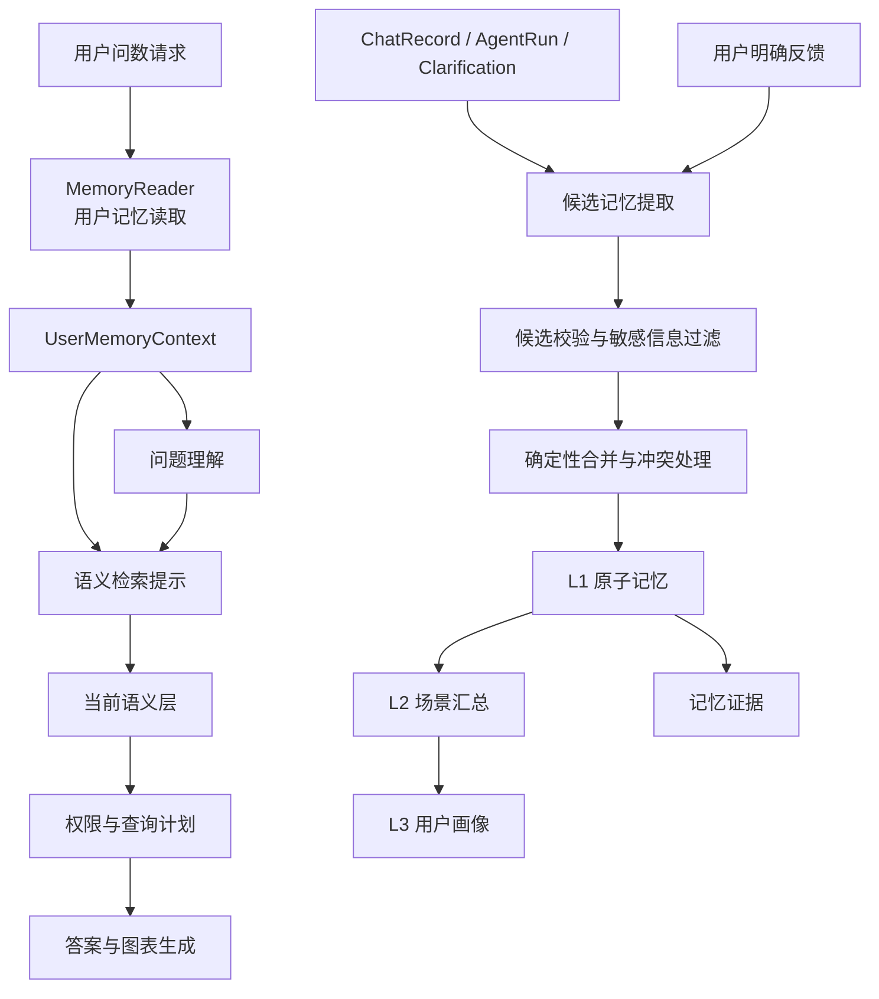

# ChatBI 用户长期记忆技术设计

**日期：** 2026-08-14  
**状态：** 分阶段实施中
**适用范围：** ChatBI Agent 用户私有长期记忆  
**模块名称：** `apps/memory`

## 1. 概览

ChatBI 用户长期记忆用于保存跨会话仍然有效的用户偏好、用户确认过的解释和用户主动纠正，减少重复澄清和重复配置。记忆只属于当前用户，不承担团队知识库、数据集语义层、权限系统或查询结果存储职责。

本方案借鉴 TencentDB Agent Memory 的分层沉淀思路：原始对话作为证据，逐步提炼为原子事实、场景偏好和长期画像；召回时优先使用高层摘要，需要具体事实时再检索低层记录。腾讯项目采用 `L0 Conversation → L1 Atom → L2 Scenario → L3 Core / Persona` 的分层结构，并使用分层召回和预算限制避免完整历史占满上下文，参见 [TencentDB Agent Memory README_CN](https://github.com/TencentCloud/TencentDB-Agent-Memory/blob/feat/server_team/README_CN.md)。

SQLBot 保留 L0 作为已有会话和执行记录证据层，新增的长期记忆为 L1、L2、L3：

| 层级 | 存储内容 | 主要用途 |
| --- | --- | --- |
| L0 | 原始问题、澄清、反馈、执行和回答记录 | 追溯事实来源，不直接注入 Prompt |
| L1 | 单条用户偏好、纠正和确认过的解释 | 精确影响当前问题理解 |
| L2 | 用户在某种分析形态下的稳定习惯 | 快速恢复用户分析方式 |
| L3 | 用户长期稳定的展示和交互偏好 | 构造请求级基础上下文 |

## 2. 设计目标与非目标

### 2.1 目标

1. 记忆业务归属固定为 `tenant_id + user_id`。
2. 记忆不设置团队范围、数据集范围或数据源范围。
3. 采用“规则提取明确事实、模型提取隐含候选、代码确定性合并”的写入流程。
4. 采用 L3 直读、L2 结构化匹配、L1 混合检索的读取流程。
5. 记忆只能作为问题理解、候选排序和回答展示提示，不能直接绑定 SQL 资产。
6. 记忆条目可追溯、可停用、可删除，冲突不会被静默覆盖。
7. 记忆读取和写入不阻塞问数主链路。

### 2.2 非目标

- 不保存完整长期聊天记录；L0 继续使用现有会话记录和 Agent Run。
- 不保存原始查询结果、明细数据、完整 SQL 或权限判断结果。
- 不替代语义层中的指标、维度、术语、物理关系和版本管理。
- 不把某次查询中的指标 ID、维度 ID、表名或字段名提升为用户长期绑定。
- 不自动把一次查询行为总结为确定的用户偏好。

## 3. 设计不变量

1. **当前输入优先。** 当前用户明确表达覆盖历史记忆。
2. **语义层负责可执行性。** 记忆不能绕过当前语义资产检索、查询计划验证和权限校验。
3. **显式证据优先。** 用户主动设置和明确纠正的权重高于模型推断。
4. **推断先候选。** 单次成功查询产生的记忆只能处于 `candidate`，不能立即成为有效长期偏好。
5. **冲突不覆盖。** 相互矛盾的记忆保留证据并标记冲突，必要时向用户澄清。
6. **不跨用户读取。** 所有读取、写入、修改和删除都必须由当前身份确定 `tenant_id` 和 `user_id`。
7. **摘要可重建。** L2、L3 必须能由有效的 L1 重新生成，不能只保存不可追溯的自然语言总结。

## 4. 系统架构



`apps/memory` 只依赖身份、会话证据和通用检索能力，不依赖具体 Agent Tool 或 ChatBI Agent 编排。ChatBI 在组合入口装配记忆服务；语义层和权限服务继续作为当前查询的事实和安全来源。

### 4.1 项目目录

`memory` 与 `chatbi` 位于 `backend/apps` 同一层级：

```text
backend/apps/
├── memory/
│   ├── models/
│   │   ├── dto/
│   │   └── orm/
│   ├── repository/
│   │   └── sqlmodel/
│   ├── services/
│   │   ├── reader.py
│   │   ├── extractor.py
│   │   ├── consolidator.py
│   │   └── summarizer.py
│   ├── api/
│   │   └── memories.py
│   └── composition.py
└── chatbi/
    ├── orchestration/agent/
    └── composition.py
```

`apps/memory` 是独立的用户记忆应用模块；`apps/chatbi` 只通过组合入口装配和调用它，不把记忆实现放入 ChatBI Agent 的编排目录。

## 5. 记忆数据模型

### 5.1 `chatbi_memory`

建议新增表 `chatbi_memory`，所有层级共用一个记忆实体，通过 `layer` 区分。

| 字段 | 类型 | 说明 |
| --- | --- | --- |
| `id` | `BIGINT` | 记忆 ID |
| `oid` | `BIGINT` | 租户隔离字段 |
| `user_id` | `BIGINT` | 用户唯一归属 |
| `layer` | `VARCHAR(16)` | `atom`、`scenario`、`profile` |
| `memory_type` | `VARCHAR(64)` | 偏好、纠正、术语理解等 |
| `memory_key` | `VARCHAR(160)` | 规范化匹配键 |
| `statement` | `TEXT` | 可读描述 |
| `payload` | `JSONB` | 结构化记忆内容 |
| `confidence` | `NUMERIC` | 当前置信度 |
| `evidence_count` | `INTEGER` | 证据数量 |
| `status` | `VARCHAR(32)` | `candidate`、`active`、`conflicting`、`disabled`、`expired` |
| `last_confirmed_at` | `TIMESTAMP` | 最近确认时间 |
| `last_used_at` | `TIMESTAMP` | 最近使用时间 |
| `expires_at` | `TIMESTAMP` | 可选过期时间 |
| `created_at` | `TIMESTAMP` | 创建时间 |
| `updated_at` | `TIMESTAMP` | 更新时间 |

表中不设置 `team_id`、`dataset_id`、`datasource_id`、`metric_id` 和 `dimension_id`。来源记录可以放在证据表中用于审计，但不能作为记忆检索范围。

### 5.2 `chatbi_memory_evidence`

证据表记录记忆为什么成立：

| 字段 | 说明 |
| --- | --- |
| `memory_id` | 关联的记忆 |
| `evidence_type` | `explicit_confirmation`、`explicit_correction`、`user_setting`、`repeated_behavior`、`successful_query`、`manual_edit` |
| `source_ref` | 澄清、ChatRecord 或反馈记录的引用 |
| `evidence_text` | 经脱敏的证据摘要 |
| `strength` | 该证据的权重 |
| `created_at` | 证据时间 |

原始问题、完整消息和查询数据继续保存在现有会话与执行记录中，不在证据表中复制完整内容。

### 5.3 记忆类型

| 类型 | 示例 |
| --- | --- |
| `semantic_preference` | 用户通常把“客户数”理解为去重客户数 |
| `term_preference` | 用户提到“新客”时通常指首次购买客户 |
| `query_shape_preference` | 用户查看趋势时倾向按月分组 |
| `presentation_preference` | 用户希望先给结论，再给表格 |
| `correction` | 用户纠正订单数不能直接统计数据行 |
| `negative_preference` | 用户不希望默认生成图表 |

语义偏好保存自然语言解释或逻辑条件，不保存当前数据集中的资产 ID。

## 6. 记忆提取

### 6.1 提取来源

记忆提取只处理有限的事件窗口，不对全部历史进行无约束总结。主要来源包括：

- 用户回答语义或时间澄清；
- 用户明确纠正 Agent 结果；
- 用户主动设置答案或图表偏好；
- 用户对结果进行明确评价；
- 成功问数中的问题理解和查询形态；
- 已有 `ChatRecord`、`AgentRun` 和澄清记录。

### 6.2 两级候选提取

#### 一级：确定性事件提取

对有明确结构的事件直接提取，不调用 LLM。例如澄清问题是“销售额按哪个时间字段统计”，用户回答“支付日期”，系统可以直接形成原子候选。

候选内容应保存为用户偏好，而不是语义资产绑定：

```json
{
  "layer": "atom",
  "memory_type": "semantic_preference",
  "memory_key": "sales_time_semantics",
  "statement": "用户通常希望销售额按支付日期统计",
  "payload": {
    "subject": "销售额",
    "preference": "支付日期"
  },
  "evidence_type": "explicit_confirmation",
  "confidence": 0.95
}
```

#### 二级：LLM 结构化提取

对于“我还是习惯先看总数”“以后别给我画图”这类自然语言，使用 LLM 提取候选，但要求严格结构化输出。输入只包含本轮问题、澄清、反馈和最终结果摘要。

LLM 输出必须包含：

- `memory_type`；
- `memory_key`；
- `statement`；
- `payload`；
- `explicit`；
- `evidence`；
- `confidence`；
- `sensitive`。

提示词必须禁止模型输出 SQL、资产 ID、原始数据、权限判断和未被用户表达的业务事实。

### 6.3 候选校验

LLM 候选进入仓储前经过确定性校验：

1. 校验 DTO 字段和记忆类型；
2. 校验 `tenant_id`、`user_id` 来自当前身份，不能由模型提供；
3. 拒绝 SQL、表名、字段名、资产 ID 和原始数据；
4. 过滤敏感信息；
5. 校验候选是否确实有当前事件证据；
6. 根据证据类型设置初始状态和置信度。

### 6.4 记忆合并与升级

候选合并由代码执行，不依赖 LLM：

```text
user_id + memory_type + normalized(memory_key)
```

建议状态规则：

| 条件 | 状态 |
| --- | --- |
| 用户主动设置或明确纠正 | 直接 `active` |
| 用户明确选择澄清项 | `active` |
| 单次成功查询推断 | `candidate` |
| 多个独立会话中重复出现 | `candidate` 提升为 `active` |
| 新旧记忆相互矛盾 | `conflicting` |
| 用户删除或停用 | `disabled` |

“多次”由数据库统计确定，不由 LLM 判断。建议至少满足 3 个独立会话、3 次成功行为，且最近 90 天没有相反证据；阈值应配置化。

例如：

```text
用户问题：最近三个月销售额趋势
问题理解：trend_analysis + time_grain=month
用户问题：按月查看客户数变化
问题理解：trend_analysis + time_grain=month
用户问题：看一下月度订单量
问题理解：trend_analysis + time_grain=month
```

经过聚合后形成结构化 L1：

```json
{
  "memory_key": "trend_time_grain",
  "payload": {
    "intent_type": "trend_analysis",
    "value": "month"
  },
  "evidence_count": 3,
  "status": "active"
}
```

L2 只是在此基础上的可读汇总：

```text
用户进行趋势分析时倾向按月查看。
```

“用户偏好先展示总体结果”不能从普通问数行为直接推断，必须来自用户明确表达、主动设置或多次明确纠正。

### 6.5 L2 和 L3 汇总

L2、L3 由有效 L1 异步重建：

- L2 按 `intent_type`、`query_shape` 等用户行为标签聚合；
- L3 聚合长期稳定的展示和交互偏好；
- 汇总记录来源 L1 ID、生成时间和版本；
- L1 失效或冲突后重新生成对应 L2、L3。

第一阶段可以使用确定性模板生成摘要，避免过早依赖 LLM 总结。后续如使用 LLM，只允许根据结构化 L1 生成摘要，不能直接从原始对话跳到 L3。

## 7. 记忆检索

### 7.1 检索输入

记忆检索器接收：

- 当前用户身份；
- 原始问题；
- 重写后的问题；
- 当前自然语言意图；
- 指标和维度文本；
- 查询形态；
- 当前用户反馈。

记忆检索器不接收也不保存 `dataset_id` 作为记忆范围条件。当前数据集只在后续语义资产检索和查询计划阶段使用。

### 7.2 硬过滤

所有记忆检索必须先执行：

```text
oid = 当前租户
user_id = 当前用户
status = active
```

不得存在“先向量召回，再在应用层过滤用户”的实现。用户边界必须进入数据库查询条件。

### 7.3 分层检索策略

| 层级 | 检索方式 | 说明 |
| --- | --- | --- |
| L3 | 直接读取 | 数量少，作为基础运行上下文 |
| L2 | 结构化匹配 | 按意图、查询形态和场景键匹配 |
| L1 | 混合检索 | 精确、别名、关键词和向量检索融合 |

L1 的推荐顺序：

1. `memory_key` 精确匹配；
2. 术语和别名匹配；
3. 关键词检索；
4. 精确匹配不足时再使用向量检索；
5. 统一重排和冲突过滤。

当前项目的检索层已经存在 exact、alias、lexical、dense 等通道，可以复用通道实现和结果融合思想；但用户记忆应由独立的 `MemoryRetriever` 负责，不能直接混入语义资产检索。参见 [hybrid.py](/Users/twenty/LLM/ChatBI/SQLBot/backend/apps/retrieval/query/hybrid.py) 和 [service.py](/Users/twenty/LLM/ChatBI/SQLBot/backend/apps/retrieval/query/service.py)。

### 7.4 重排规则

检索结果不能只按文本或向量相似度排序，建议优先级为：

```text
当前明确确认
> 用户主动设置
> 多个独立会话验证
> 最近确认
> 文本或向量相似度
> 单次行为推断
```

重排还应考虑：

- 记忆层级；
- `confidence`；
- `evidence_count`；
- 最近使用和确认时间；
- 是否存在相反证据；
- 是否被用户停用。

`conflicting` 记忆不能直接注入 Agent，只能转换为澄清候选。

### 7.5 结果预算

建议单次请求限制：

- L3：3～5 条；
- L2：1～3 个场景；
- L1：5～8 条；
- 记忆提示总字符数：由配置控制；
- 超出预算时，优先保留显式确认和当前意图相关记忆。

### 7.6 检索结果契约

`MemoryReader` 返回 `UserMemoryContext`，只表达提示，不表达可执行资产绑定：

```json
{
  "profile": [
    {
      "memory_id": 11,
      "type": "presentation_preference",
      "instruction": "先给结论，再给表格",
      "confidence": 0.96
    }
  ],
  "scenarios": [],
  "hints": [
    {
      "memory_id": 23,
      "type": "semantic_preference",
      "trigger": "客户数",
      "instruction": "优先考虑去重客户数",
      "confidence": 0.88,
      "evidence_count": 3
    }
  ],
  "conflicts": []
}
```

## 8. 运行时接入

### 8.1 Agent 读取时机

当前 [AgentInputPreparer](/Users/twenty/LLM/ChatBI/SQLBot/backend/apps/chatbi/orchestration/agent/preparation.py) 已负责加载会话上下文。建议由 ChatBI 组合层装配 `apps/memory`，并按三个时机接入：

1. 问题理解前读取 L3；
2. 问题重写和意图识别后检索 L1、L2；
3. 最终回答阶段只读取展示偏好。

记忆提示通过类型化的 `UserMemoryContext` 传递给问题理解和检索适配层，不直接修改原始问题，不直接修改语义资产 ID。

### 8.2 语义检索边界

当前语义检索继续使用当前数据集、当前权限和当前版本。用户记忆只参与：

- 问题理解提示；
- 候选排序；
- 澄清选项建议；
- 答案和图表展示。

它不能参与：

- 绕过语义层；
- 直接确认歧义资产；
- 绕过权限；
- 复用旧 SQL；
- 修改当前明确时间条件。

### 8.3 运行时优先级

```text
当前用户输入
> 当前澄清回答
> 当前语义层有效候选
> 用户明确记忆
> 多次行为推断
> L2 场景总结
> L3 用户画像
```

## 9. 用户管理和隐私控制

记忆必须提供用户自管理能力：

- 查看自己的记忆；
- 查看来源和创建时间；
- 修改记忆内容；
- 停用记忆；
- 删除单条记忆；
- 清空全部个人记忆。

接口实现必须从当前登录身份取得 `user_id`，不能从请求参数接受任意用户 ID。记忆页面不展示原始查询结果和敏感证据，只展示脱敏后的来源摘要。

建议接口能力：

```text
GET    /chatbi/memories
GET    /chatbi/memories/{memory_id}
PATCH  /chatbi/memories/{memory_id}
POST   /chatbi/memories/{memory_id}/disable
DELETE /chatbi/memories/{memory_id}
```

具体路由名称应在现有 ChatBI API 路由命名约定确认后落地。

## 10. 实现映射

| 设计能力 | 当前项目对应位置 | 接入方式 |
| --- | --- | --- |
| L0 会话证据 | `apps/conversation`、`apps/chatbi/models/orm/agent_run.py` | 作为记忆提取输入，不复制完整内容 |
| 最近问答上下文 | `apps/chatbi/orchestration/agent/preparation.py` | 与用户记忆分开读取 |
| 问题重写和意图 | `apps/chatbi/services/understanding` | 提取 query shape 和显式反馈证据 |
| 澄清恢复 | `apps/chatbi/models/orm/agent_run.py`、`preparation.py` | 直接生成高置信候选 |
| 语义检索 | `apps/retrieval/query` | 继续负责当前数据环境的资产检索 |
| 语义事实源 | `apps/semantic/models`、`apps/semantic/services` | 不被用户记忆覆盖 |
| 记忆模块 | `apps/memory` | 独立提供记忆 DTO、服务、仓储和管理接口 |
| Agent 装配 | `apps/chatbi/composition.py` | 注入 MemoryReader 和写入服务 |
| Agent 首次准备 | `apps/chatbi/orchestration/agent/preparation.py` | 分阶段加载 L3、L2、L1 |

## 11. 分阶段实施

### P0：用户原子记忆

1. 新增 `chatbi_memory` 和 `chatbi_memory_evidence`；
2. 新增 L1 DTO、Repository、Reader 和 Consolidator；
3. 从澄清回答、用户明确纠正和用户主动设置中提取记忆；
4. L3 只做固定字段直接读取；
5. 使用精确匹配和关键词检索；
6. Agent 只接收记忆提示，不修改语义绑定；
7. 提供用户查看、修改、停用和删除接口。

### P1：行为提取和场景汇总

1. 从成功问数中提取 `query_shape` 候选；
2. 以独立会话数和成功次数确定是否升级；
3. 生成 L2 场景记忆；
4. 增加混合检索中的向量召回；
5. 增加记忆冲突检测和自动过期。

### 12.2 P1 当前执行结果

本次已完成 P1 的行为提取和场景汇总部分：

- 成功问数结束时读取结构化 `intent.query_shape`，不读取 SQL、结果明细或语义资产 ID；
- 以 `run.chat_id` 作为独立会话标识，分别记录成功次数和独立会话数；
- 成功次数达到 3 次且独立会话达到 2 个后，原子行为候选才升级为 active；
- 对趋势、对比和排名场景生成确定性原子记忆；
- 根据 active 原子记忆生成 L2 场景摘要；
- 新旧查询形态同时达到条件时保留冲突状态，不直接覆盖旧记忆；
- 新增 `chatbi_memory.session_count` 和证据来源会话字段。
- active 记忆读取前自动处理过期记录，过期记录转为 `expired`，不再进入 Agent 上下文；
- 从已通过校验的澄清回答中提取明确的展示、时间粒度和纠正偏好，普通澄清回答不会写入长期记忆；
- 新增独立的 `chatbi_memory_embedding` 向量表和余弦相似度索引，结构化匹配与向量召回合并后再按预算返回；
- 记忆向量通过 `CHATBI_MEMORY_EMBEDDING_ENABLED` 单独开启，不与语义资产 embedding 配置混用。

### P2：画像重建和效果优化

1. 从 L1、L2 重建 L3；
2. 增加记忆版本和摘要版本；
3. 建立按用户的记忆命中和采用率统计；
4. 通过离线评测和 A/B 测试调整提取、升级和召回阈值。

### 12.3 P2.1 当前执行结果

- 使用 `profile` 层保存由有效展示偏好和负向偏好重建的 L3 画像；
- 画像只根据 active 原子记忆生成，不直接读取原始对话或查询结果；
- 画像记录增加 `version`，源记忆变化时生成新版本，旧版本进入冲突或停用状态；
- 新增 `chatbi_memory_usage`，记录用户、会话、Run、使用阶段和记忆 ID；
- Agent 构建记忆上下文时记录实际进入上下文的记忆，并更新 `last_used_at`；
- 新增迁移 `107_chatbi_memory_profile_usage`。

### 12.4 P2.2 当前执行结果

- `chatbi_memory_usage` 增加可空的 `adopted` 和 `adopted_at` 字段；`NULL` 表示尚未评估，`true` 表示采用，`false` 表示未采用；
- 新增用户级统计接口 `GET /chatbi/memories/metrics`，统计 active 记忆数量、使用次数、独立会话数、独立 Run 数、最近使用时间以及按记忆拆分的明细；
- 新增采用判定接口 `PATCH /chatbi/memories/usages/{usage_id}`，更新前按 `oid + user_id + usage_id` 查询，不能操作其他用户的使用记录；
- 采用率只在存在明确判定时计算，分母为已评估记录数，不把未评估记录当作未采用；
- 新增迁移 `108_chatbi_memory_adoption`；
- 当前采用判定提供给用户反馈和离线评估流程使用，Agent 只记录“进入上下文”，不会把“进入上下文”直接当作“被采用”。

### 12.5 P2.3 当前执行结果

- 新增离线评测样本结构，使用期望记忆 ID、实际召回记忆 ID、已采用记忆 ID 和未采用记忆 ID 表达标注结果；
- 新增 `MemoryEvaluationService`，计算召回率、准确率、F1、错误记忆比例和采用率，并同时返回汇总结果与单样本结果；
- 新增 `POST /chatbi/memories/evaluations` 评测入口，接口需要当前用户认证，但只计算请求中的样本，不保存原始问题、查询结果和评测样本；
- 评测服务会拒绝重复 ID、非正 ID、同一记忆同时标记为采用和未采用，以及标记对象不在实际召回结果中的样本；
- 评测结果暂不写入业务数据库，离线评测任务负责保存样本和结果，避免把评测数据混入用户长期记忆。

### 12.6 P2.4 当前执行结果

- 新增 `disabled`、`control`、`treatment` 三种召回变体；默认使用 `disabled`，保持已有召回行为不变；
- 灰度开启后，以 `oid + user_id + salt` 的稳定哈希进行用户分组，同一用户不会在不同请求间切换分组；
- `control` 使用结构化和词面排序，`treatment` 使用当前的向量与词面合并召回；只有 `treatment` 明确使用向量召回，避免实验分支隐式改变默认行为；
- Agent 记忆使用记录新增 `recall_variant`，用户级统计增加按变体拆分的使用次数、独立会话数、独立 Run 数和采用率；
- 新增配置 `CHATBI_MEMORY_RECALL_EXPERIMENT_ENABLED`、`CHATBI_MEMORY_RECALL_TREATMENT_PERCENT` 和 `CHATBI_MEMORY_RECALL_EXPERIMENT_SALT`；
- 新增迁移 `109_chatbi_memory_recall_variant`；灰度默认关闭，尚未配置向量索引时 treatment 与 control 的效果差异不会产生。

### 12.1 P0 执行结果

P0 已按以下范围落地：

- 在 `backend/apps/memory` 建立独立用户记忆模块，与 `apps/chatbi` 同级；
- 新增 `chatbi_memory` 和 `chatbi_memory_evidence`，记忆范围固定为 `oid + user_id`；
- 提供 L1 DTO、SQLModel ORM、仓储接口、SQLModel 仓储、`MemoryService` 和组合入口；
- 支持明确记忆的创建、修改、停用、删除，以及候选证据累积和三次证据升级；
- 通过 `MemoryService.build_context()` 输出 profile、scenario、atom 三层提示，冲突记录不进入 active 上下文；
- 在 ChatBI Agent 组合入口注入记忆服务，问题理解和 Agent 动态上下文只接收提示，不修改原始问题、语义资产绑定和权限边界；
- 提供 `/chatbi/memories` 用户自助管理接口；
- 对记忆 payload 统一拒绝数据集、数据源、指标、维度、表、字段和 SQL 等绑定信息。

本阶段的候选记忆入口已经由 `MemoryService.consolidate_candidate()` 固定，澄清事件和明确反馈的自动事件适配，以及成功问数行为提取，放在 P1 接入，避免在没有稳定事件契约时直接把普通查询行为写入长期记忆。

## 12. 评估指标

- 相同用户重复澄清率；
- 记忆命中率；
- 记忆提示被当前语义检索采用的比例；
- 语义候选 Top-1 和 Top-k 准确率；
- SQL 修正次数；
- 因错误记忆导致的澄清或查询失败率；
- 每次请求新增 Token 和延迟；
- 用户主动修改、停用和删除记忆的比例。

P2.2 已落地的在线统计字段与指标映射如下：

| 指标 | 统计方式 | 用途 |
|---|---|---|
| 使用次数 | 使用记录总数 | 观察记忆被放入上下文的次数 |
| 独立会话数 | `session_id` 去重 | 判断是否跨会话持续使用 |
| 独立 Run 数 | `run_id` 去重 | 判断是否被多个问数执行使用 |
| 采用次数 | `adopted = true` 的记录数 | 观察明确采用的次数 |
| 采用率 | 采用次数 / 已评估次数 | 只在有明确反馈时计算 |
| 最近使用时间 | 使用记录最大 `created_at` | 支持活跃度和衰减分析 |

灰度对比必须使用同一用户在不同请求中的稳定分组，不能按请求随机分组。只有在样本量、采用率和错误记忆比例达到预设观察条件后，才允许调整 treatment 比例或切换默认策略。

P2.3 离线评测指标按样本中的记忆 ID 计算：

- 召回率 = `期望记忆 ∩ 实际召回记忆` / `期望记忆`；
- 准确率 = `期望记忆 ∩ 实际召回记忆` / `实际召回记忆`；
- F1 = `2 × 相关记忆数` / `期望记忆数 + 实际召回记忆数`；
- 错误记忆比例 = `实际召回记忆 - 期望记忆` / `实际召回记忆`；
- 采用率 = `已采用记忆数` / `已评估记忆数`，未标注记录不进入分母。

### 12.7 P2.5 当前执行结果

- 新增 `GET /chatbi/memories/metrics/comparison`，比较当前用户 control 和 treatment 的使用与采用数据；
- 当两个变体的已评估记录数都达到 `CHATBI_MEMORY_RECALL_MIN_EVALUATED_PER_VARIANT` 时，计算 treatment 相对 control 的采用率差；
- 当采用率差小于 `-CHATBI_MEMORY_RECALL_MAX_ADOPTION_DROP` 时，返回 `rollback_treatment`；否则返回 `continue_treatment`；
- 任一变体样本不足时返回 `collect_more_data`，不根据小样本做策略判断；
- 比较接口只返回建议，不自动修改配置或切换线上召回策略，回滚仍由发布配置流程执行；
- 增加配置校验，拒绝无效的最小样本数和采用率下降阈值。

### 12.8 P2 离线评测执行状态

- 新增 `backend/scripts/evaluate_memory_recall.py`，读取 `MemoryEvaluationRequest` 格式的 JSON 文件并输出评测报告；
- 新增 `backend/scripts/collect_memory_recall_samples.py`，按租户、可选用户和时间范围从 `chatbi_memory_usage` 生成待标注样本；
- 新增 `backend/scripts/memory_recall_evaluation.sample.json` 作为样本格式模板，模板中的记忆 ID 仅用于验证脚本，不代表真实数据；
- 示例流程已经验证召回率、准确率、F1、错误记忆比例和采用率的计算链路；
- 当前仓库没有真实的用户记忆标注集，因此尚未根据示例结果调整提取阈值、升级阈值或召回阈值；
- 已对当前数据库执行租户范围采集检查，`chatbi_memory_usage` 当前没有使用记录，因此本次没有生成可供标注的真实样本，也没有执行线上阈值调整；
- 真实评测时，应使用用户实际记忆 ID、实际召回结果和人工采用标注生成 JSON，再执行：

```bash
python scripts/evaluate_memory_recall.py \
  --samples /path/to/memory_recall_evaluation.json \
  --output /path/to/memory_recall_report.json
```

### 12.9 隐含偏好提取当前执行结果

- 新增 `apps/memory/services/memory_extraction.py`，使用结构化模型调用边界提取用户明确表达但无法完全由规则识别的长期偏好；
- 模型输入只包含澄清问题和用户回答，模型输出只允许包含记忆类型、记忆键、用户偏好描述、结构化偏好值、显式标记、敏感信息标记和置信度；
- 归属字段、证据类型、来源会话、来源引用和记忆层级由代码生成，模型不能指定用户、租户或数据范围；
- 模型候选在入库前经过 DTO 校验和用户记忆载荷校验，包含数据集、数据源、指标、维度、表、字段或 SQL 的候选会被拒绝；
- 确定性规则候选和模型候选可以同时合并，最终仍由 `MemoryService.consolidate_candidate()` 处理重复、升级和冲突；
- 记忆模型提取失败或输出不符合契约时返回空候选，不影响问数主链路；
- 通过 `CHATBI_MEMORY_LLM_EXTRACTION_ENABLED` 控制是否启用，默认关闭，启用后只对澄清恢复事件执行提取；
- 当前已覆盖模型候选转换、敏感候选过滤、资产绑定拒绝和 Agent 澄清回归测试。

评测报告只用于离线分析，不写入用户长期记忆，也不应把包含原始问题、SQL 或结果明细的文件提交到代码仓库。

真实数据采集流程如下：

```bash
python scripts/collect_memory_recall_samples.py \
  --tenant-id 1 \
  --since-hours 168 \
  --limit 100 \
  --output /path/to/memory_recall_pending.json
```

采集文件中的 `expected_memory_ids` 初始为空，需要由标注人员根据受保护的会话上下文补充；补充完成后才能交给评测脚本。`recall_variant` 用于拆分 control 和 treatment，记忆数据本身仍按用户范围隔离。

记忆模块的成功标准不是保存数量，而是减少重复解释，同时不增加错误查询。任何“记忆命中率提升但查询正确率下降”的情况，都应视为回归。
