# Agent ChatBI

## 1. 背景

语义层和检索模块建成后，ChatBI 已经能够统一管理业务口径，并从大量语义资产中找到与问题相关的指标、维度和数据集。但是，不同问数任务需要使用的能力和执行顺序并不完全相同。例如，标准指标查询可以直接使用语义资产生成 SQL，明细查询可能需要查看数据结构，问题存在歧义时还需要先向用户确认。固定流程需要提前设置所有执行步骤和判断分支，随着问数场景增加，流程会越来越复杂。为此，系统建设 Agent ChatBI 路径，由 Agent 根据问题和执行结果选择下一步操作，统一调用问题理解、语义检索、SQL 生成、SQL 校验和数据查询等能力。同时，Agent 的操作仍然受到业务口径、资产范围、SQL 安全和运行资源等规则限制，确保执行过程可控制、结果可追踪。

## 2. Agent

### 2.1 什么是 Agent

Agent 是一种由大模型负责判断步骤，并通过工具完成任务的执行方式。用户只需要提出目标，Agent 会结合当前问题、已有信息和工具返回结果，决定下一步需要做什么，直到任务完成、需要用户补充信息或无法继续执行。

Agent 并不等同于大模型。大模型主要负责理解问题和选择操作，Agent 还需要工具、状态和运行规则共同配合。

| 构成 | 作用 |
| --- | --- |
| 大模型 | 理解当前任务，并决定下一步操作 |
| 工具 | 执行检索、计算、查询和结果生成等具体操作 |
| 状态 | 保存问题、工具结果和已经完成的步骤 |
| 规则 | 限制可以使用的工具、数据范围和执行次数 |

固定流程会提前规定每一步的执行顺序，Agent 则可以根据实际情况选择步骤。例如，同一个问数入口收到明确的指标问题时，可以直接进入语义检索；收到含义不明确的问题时，可以先向用户确认；语义资产不能覆盖问题时，也可以在允许的范围内改用其他查询方式。

### 2.2 Agent 与 ChatBI

ChatBI 是使用自然语言完成数据查询和分析的业务场景，Agent 是组织问数能力的一种实现方式。Agent 不负责替代语义层、检索模块或数据查询模块，而是根据问题选择并调用这些能力。

在 ChatBI 中，语义层提供统一的指标和维度口径，检索模块找到与问题相关的语义资产，SQL 能力负责生成、校验和执行查询，Agent 负责安排这些能力的使用顺序，并根据每一步的结果决定继续查询、请求澄清或返回答案。因此，Agent 解决的是“如何完成一次问数任务”，语义层和检索模块解决的是“使用什么业务知识和数据口径”。

这种关系使问数过程既可以根据问题灵活调整，也不会脱离已经建立的业务口径和数据访问规则。Agent 可以决定下一步做什么，但只能在系统允许的能力和数据范围内执行。

## 3. 架构

Agent ChatBI 以问题理解和 Agent 运行为核心，将已经建设的语义层、检索模块和数据查询能力组织成一条完整的问数路径。Agent 不直接访问底层数据，而是通过系统提供的工具完成检索、SQL 生成、SQL 校验和数据查询。

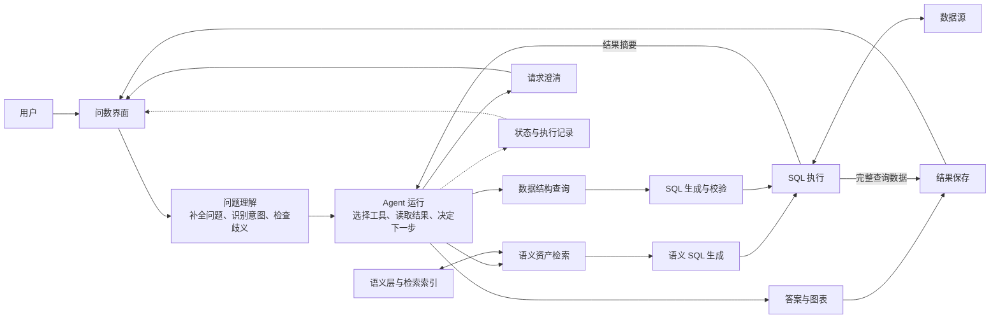

用户提交问题后，系统首先结合当前问题和历史对话完成问题理解，形成明确的指标、维度、时间和筛选条件。存在关键歧义时，系统会先向用户确认；问题明确后，再将理解结果交给 Agent。

Agent 根据问题和已有执行结果选择下一步操作。标准指标查询优先检索语义资产，并根据统一业务口径生成 SQL；语义资产无法覆盖的明细或临时查询，可以在允许范围内查询数据结构，再生成并校验 SQL。两种方式最终都通过统一的数据查询能力执行。

数据查询完成后，少量结果样例和统计信息会返回给 Agent，用于生成答案和图表；完整查询数据不会进入大模型上下文，而是直接保存并提供给前端展示。系统同时保存运行状态、执行步骤和交互记录，使用户能够查看处理过程，并在澄清后继续原来的问数任务。

## 4. 模块

Agent ChatBI 主要由问题理解、Agent 循环、工具、状态与恢复、结果与追踪五个模块组成。这些模块分别负责确认用户意图、安排执行步骤、完成具体操作、保存运行现场和返回问数结果。

### 4.1 问题理解

问题理解模块负责将用户输入整理成结构化的问数要求。它只识别用户想查询什么，不选择语义资产、数据表或执行工具，避免在问题尚未明确时直接进入数据查询。

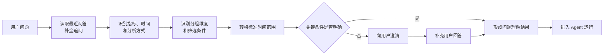

| 处理内容 | 形成的信息 | 作用 |
| --- | --- | --- |
| 问题补全 | 完整问题、问题类型、继承的上下文 | 将“那上个月呢”等追问补全为可以独立理解的问题 |
| 意图识别 | 指标、分析方式、时间条件 | 判断用户要查询什么，以及要看趋势、排行、对比还是明细 |
| 维度识别 | 分组维度、筛选维度、筛选值 | 区分“按门店统计”和“查询某个门店” |
| 时间处理 | 原始时间表达、标准时间范围 | 将“今天”“最近 7 天”等表达转换为明确的查询范围 |
| 完整性检查 | 是否可以继续、需要确认的内容 | 在关键条件存在歧义时阻止后续查询 |

系统会读取最近几轮已经完成的问答摘要，并使用最近一次成功问题帮助理解追问。只有当前问题确实依赖上文时才会继承历史信息，当前问题可以独立理解时不会被历史问题覆盖。

例如，上一轮问题是“按城市看本月销售额”，用户继续提问“那上个月呢”。系统会将本轮问题补全为“按城市看上个月销售额”，并识别出指标为销售额、分组维度为城市、时间范围为上个月。后续 Agent 和工具都以这份确认后的理解结果为准。

### 4.2 Agent 循环

Agent 循环负责持续判断下一步操作。每一轮运行都会读取问题理解结果、已有消息、前面工具的返回结果和剩余运行额度，再由大模型选择允许使用的工具。

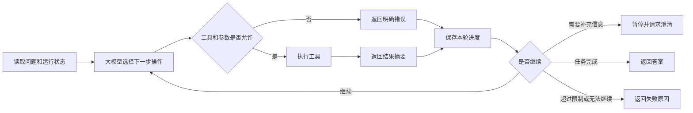

大模型只能选择系统已经登记的工具，不能直接执行数据库操作，也不能自行扩大数据范围。工具调用失败时，失败原因会返回给 Agent，Agent 可以在剩余次数内调整操作；重复调用、执行超时或超过最大步骤数时，系统会终止任务。

### 4.3 工具

工具负责执行具体操作。Agent 只负责选择工具和提供参数，工具内部仍然按照系统规则访问语义资产、数据结构和数据源。

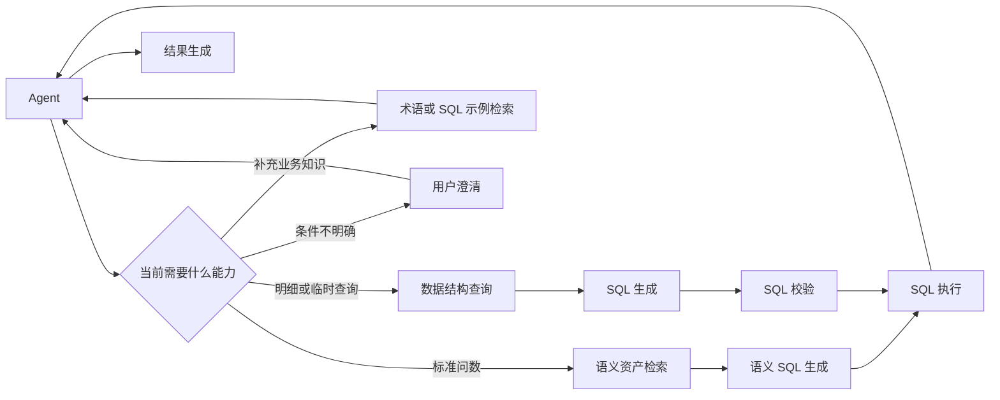

| 工具 | 主要作用 | 使用方式 |
| --- | --- | --- |
| 语义资产检索 | 根据已经确认的问题理解结果查找指标、维度和数据集 | 标准问数的起点 |
| 数据结构查询 | 查询允许访问的数据表、字段和字段说明 | 语义资产无法覆盖明细或临时查询时使用 |
| 语义 SQL 生成 | 根据检索到的语义资产和统一口径生成 SQL | 标准问数优先使用 |
| SQL 校验 | 检查 SQL 类型、数据表范围、危险操作和查询条数 | 手工生成 SQL 后必须使用 |
| SQL 执行 | 统一执行通过检查的 SQL，并返回样例和统计信息 | 所有数据查询的统一入口 |
| 术语检索 | 查询业务术语和表达之间的对应关系 | 用户使用业务简称或同义表达时使用 |
| SQL 示例检索 | 查找相似历史问题和 SQL 示例 | 仅作为生成 SQL 的参考，不能作为查询结果 |
| 用户澄清 | 向用户提出问题并提供可选项 | 关键条件无法确定时使用 |
| 结果生成 | 根据实际查询结果形成答案和图表 | 数据查询成功后使用 |

标准问数优先使用“语义资产检索、语义 SQL 生成、SQL 执行”这组工具。只有语义资产无法覆盖问题时，才会查询数据结构并生成 SQL。这样既优先使用统一业务口径，也保留处理明细和临时查询的能力。

### 4.4 状态与恢复

状态与恢复模块负责保存 Agent 当前已经知道什么、已经完成什么以及下一次从哪里继续。系统不会只保存最终答案，而是在每一步完成后同步保存运行现场。

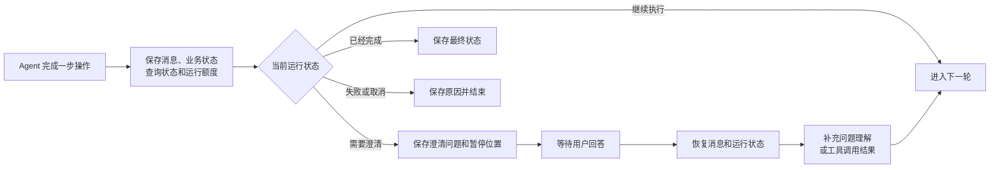

| 状态内容 | 保存的信息 | 作用 |
| --- | --- | --- |
| 消息状态 | 用户问题、大模型判断和工具结果摘要 | 保留 Agent 下一轮判断所需的上下文 |
| 业务状态 | 问题理解结果、语义资产、允许访问的数据表和已生成 SQL | 防止恢复后丢失已经确认的业务信息 |
| 查询状态 | 最近一次执行结果、结果样例和统计信息 | 支持继续生成答案或调整查询 |
| 运行额度 | 已执行步骤、SQL 失败次数、澄清次数和模型用量 | 恢复后继续执行原有约束 |
| 澄清状态 | 澄清问题、可选项、用户回答和暂停位置 | 支持用户回答后继续原任务 |

当问题理解阶段发现歧义时，系统会保存当前状态并暂停运行。用户回答后，系统将答案补充到原问题理解结果中，再继续执行。Agent 在使用工具过程中主动发起澄清时，用户回答会作为该次工具调用的结果返回，Agent 从原来的工具调用位置继续判断。

当消息内容过长时，系统会保留最近的工具结果，并将较早的详细结果折叠为简短记录。这样可以控制大模型接收的内容长度，同时保留任务已经执行过哪些步骤。

### 4.5 结果与追踪

结果与追踪模块负责将运行过程实时返回前端，并保存最终结果和执行记录。用户可以看到当前正在进行的操作，也可以在任务结束后查看 SQL、答案、图表和查询数据。

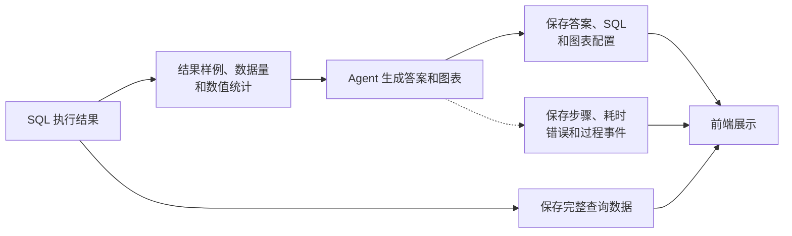

| 信息 | 处理方式 | 用途 |
| --- | --- | --- |
| 运行进度 | 按执行顺序实时返回 | 展示问题理解、工具调用和查询进度 |
| 查询摘要 | 将少量样例、数据量和数值统计返回给 Agent | 用于生成答案，避免完整数据进入大模型上下文 |
| 完整数据 | 不返回给大模型，直接保存 | 提供表格、图表和后续查看 |
| 最终结果 | 保存答案、SQL 和图表配置 | 保证历史问答可以重新打开 |
| 执行记录 | 保存每一步的工具、参数摘要、结果摘要、耗时和错误 | 展示处理过程并支持问题定位 |

运行过程使用流式方式返回前端，因此 SQL 生成、SQL 执行、澄清和结果生成可以随执行过程逐步展示。后端还按照连续序号保存过程事件，具备按序号补充读取事件的能力；当前前端主要使用实时事件和完整运行记录，还没有接入自动补充读取事件的处理。

## 5. 流程

Agent ChatBI 根据问题是否能够被语义资产覆盖，选择标准问数或兜底问数。执行过程中出现影响查询准确性的歧义时，两条路径都可以暂停并请求用户澄清。

### 5.1 标准问数

标准问数用于查询已经在语义层中定义的指标和维度。检索条件直接来自已经确认的问题理解结果，Agent 不能在调用工具时自行修改用户意图。

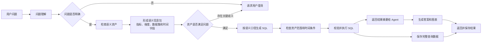

语义资产检索会返回与问题相关的指标、维度、数据集及它们之间的关系。后续 SQL 生成只能使用本次检索返回的资产，不能使用未检索到的资产编号或数据表。用户明确给出时间时，SQL 中必须使用问题理解阶段形成的标准时间范围，不能省略或替换。

例如，用户提问“按城市看最近 7 天销售额”。系统会识别销售额、城市和最近 7 天，检索对应的指标、维度、数据集和时间字段，再由语义层按照统一口径生成 SQL。查询完成后，Agent 根据真实数据生成文字答案和图表。

### 5.2 兜底问数

兜底问数用于语义资产尚未覆盖的明细或临时查询。它不是标准问数的替代路径，也不能用于绕过问题澄清、数据范围或 SQL 安全检查。

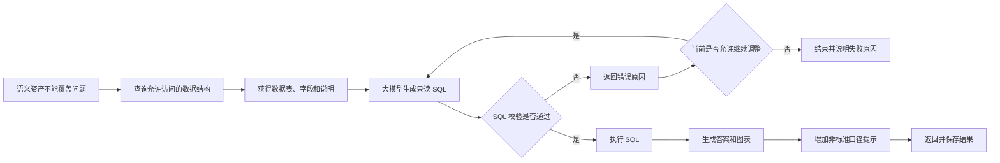

Agent 只能查看当前数据源允许访问的数据表和字段，并且只能生成一条只读查询语句。SQL 在执行前会检查语句类型、危险操作、数据表范围和查询条数；即使 Agent 已经主动调用过 SQL 校验，实际执行入口仍会再次进行统一检查。

例如，用户需要查看“最近 20 条订单明细”，但语义层只管理订单金额、订单数等汇总指标。Agent 可以查询订单相关的数据结构，选择允许访问的明细字段，生成并校验 SQL，再执行查询。由于该 SQL 不是根据标准语义指标生成，最终答案会提示这是非标准口径查询结果。

### 5.3 澄清与恢复

当问题中的指标、维度作用或筛选值不能确定，并且不同理解会生成不同 SQL 时，系统会暂停任务并向用户澄清。用户回答后继续原来的运行记录，不会重新创建一条问数任务。

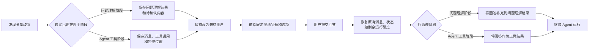

问题理解阶段的澄清主要处理确定性问题，例如“门店销售额”中的“门店”是按门店分组，还是查询某个门店；工具阶段的澄清用于处理检索后才能发现的问题，例如多个语义资产都符合用户表达，但口径不同。两种澄清都会保存当前执行现场，用户回答后从原位置继续，已经完成的步骤不需要重新执行。

## 6. 保障

Agent 可以根据问题选择执行步骤，但每次工具调用和数据查询都要经过系统检查。现有保障主要覆盖问题意图、语义资产、SQL 安全和运行资源四个方面。

### 6.1 意图与资产限制

问题理解结果是后续问数的统一依据。语义资产检索直接读取这份结果，不接收 Agent 临时编写的检索问题，从入口上避免查询意图在执行过程中被修改。

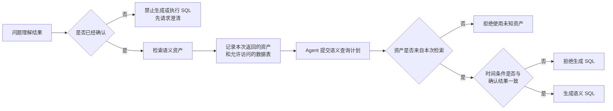

语义 SQL 只能使用本次检索返回的指标和维度。用户已经给出时间条件时，生成 SQL 必须使用问题理解阶段形成的标准时间范围，不能省略时间，也不能替换成数据中的最新日期。语义指标缺少必要的时间字段时，应向用户说明或请求澄清，不能改用数据结构查询绕过语义限制。

兜底问数同样受到范围限制。系统只返回当前数据源中已经启用的数据表和字段，并将这些表加入本次运行的允许范围，后续 SQL 应当只使用这些数据表。

### 6.2 SQL 限制

SQL 不会由 Agent 直接发送到数据源。无论 SQL 来自语义层还是大模型生成，实际执行时都会进入统一的检查和执行过程。

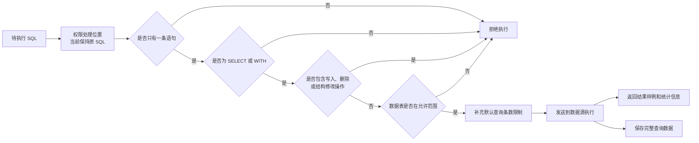

当前 SQL 检查包括：只允许一条语句，只允许只读查询，禁止写入、删除、授权和修改数据结构等操作，限制可访问的数据表，并在 SQL 没有设置查询条数时自动增加限制。默认最多返回 100 条数据给本次查询结果。

### 6.3 运行限制

系统在每轮执行前检查剩余运行资源，并在工具调用后更新使用情况。达到限制后，系统会保存已有记录并停止继续调用模型或数据源。

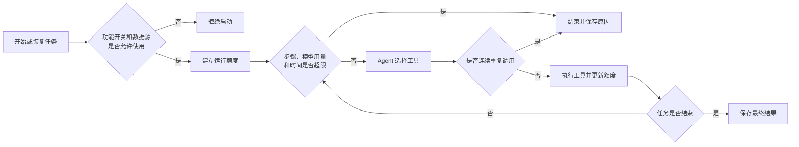

| 控制项 | 当前默认值 | 处理方式 |
| --- | --- | --- |
| 最大执行步骤 | 12 步 | 下一轮开始前发现超限后终止 |
| 最大运行时间 | 120 秒 | 单次连续运行超时后终止，澄清恢复后重新计时 |
| 模型用量 | 100000 Token | 问题理解和 Agent 调用共同累计 |
| 重复工具调用 | 相同参数连续 3 次 | 第 3 次调用时终止，避免无效循环 |
| SQL 执行失败 | 最多调整 2 次 | 第 3 次执行仍失败时终止 |
| 用户澄清 | 最多 2 次 | 再次请求澄清时拒绝挂起，要求基于现有信息继续或说明无法完成 |
| 默认查询条数 | 100 条 | SQL 未设置限制时自动补充 |
| 返回 Agent 的样例 | 10 条 | 完整数据单独保存，不进入模型上下文 |

### 6.4 当前边界

以下内容是根据当前代码确认的实现边界，需要与已经完成的能力区分。

| 能力 | 当前情况 | 影响 |
| --- | --- | --- |
| 行列权限 | SQL 执行过程已经预留权限处理位置，但当前只保持原 SQL，没有进行行级或列级改写 | 需要结合正式的数据权限方案补充实现 |
| 数据表范围 | 标准问数和兜底问数都会形成允许访问的数据表清单；但执行工具没有强制要求该清单不能为空 | 当前主要依靠标准工具顺序建立清单，后续应增加执行前的强制检查 |
| 数据后作答 | 结果生成工具要求先成功执行 SQL；但 Agent 没有调用工具而直接返回文字时，可以结束任务 | 数据问题的直接回答还没有与 SQL 成功结果建立统一的强制关系 |
| SQL 调整 | SQL 执行失败后由 Agent 根据错误信息重新判断和生成 SQL | 当前没有独立的确定性 SQL 修复流程 |
| 事件恢复 | 后端已经保存连续编号的过程事件，并支持按编号读取 | 当前前端尚未接入断开后的自动补充读取 |
| 澄清恢复 | 运行中提交澄清回答可以继续原任务 | 页面刷新后重新加载待澄清内容的前后端处理尚未完整接通 |

这些边界不影响当前标准流程的基本运行，但涉及权限、执行约束和中断恢复的能力仍需要在正式扩大使用范围前继续完善。
