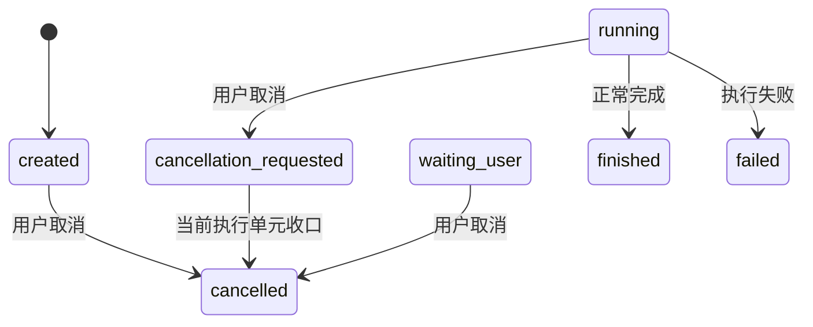
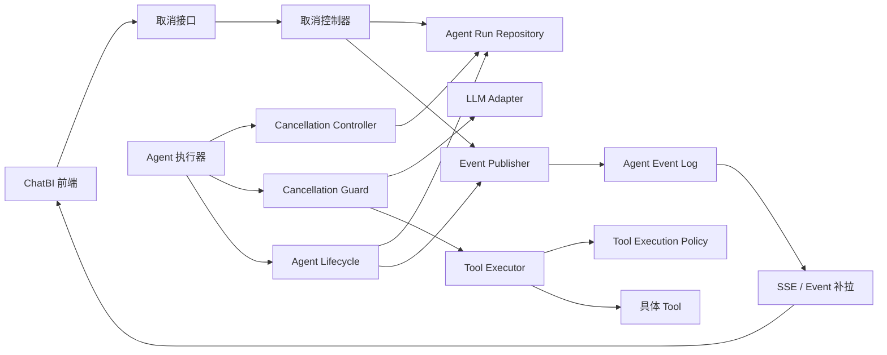
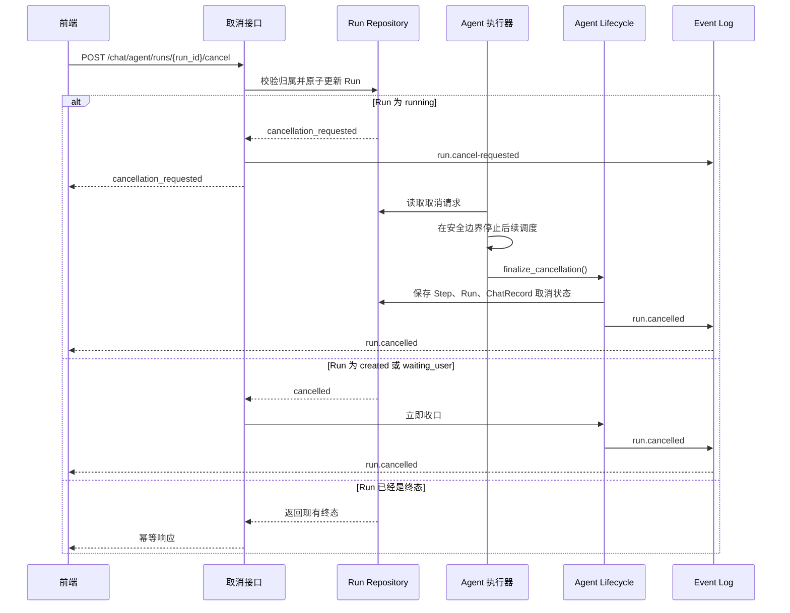
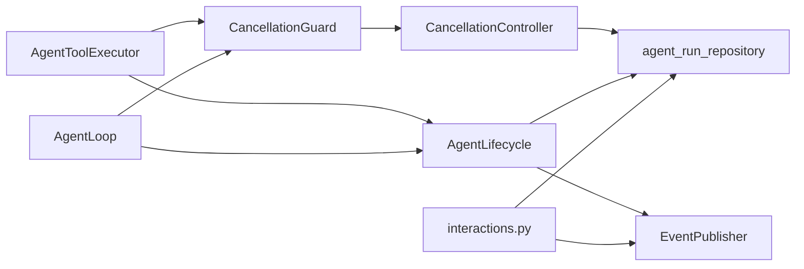

# ChatBI Agent 取消执行设计

## 1. 概览

本文定义 ChatBI Agent 在用户点击“取消”后的执行语义、状态迁移、LLM 请求处理、Tool 处理、并行任务收口、事件协议和代码结构。

本文只处理“取消”，不包含取消后的恢复、用户干预或新的执行指令。

取消的最终含义是：**Agent 不再产生新的 LLM 调用、Tool 调用、重试或最终结果。** 当前正在执行的 LLM 或 Tool 是否能够立即停止，取决于底层调用是否提供取消能力；不能立即停止的操作必须在返回后丢弃结果，不得继续驱动 Agent。

## 2. 当前实现与问题

当前实现已经具备跨请求取消信号，但取消过程仍分散在 API、AgentLoop 和 ToolExecutor 中。

| 能力 | 当前行为 | 代码位置 |
| --- | --- | --- |
| 取消请求 | 运行中的 Run 变为 `cancellation_requested`；创建态和等待用户态直接变为 `cancelled` | `backend/apps/chatbi/api/interactions.py` 的 `agent_cancel` |
| 取消信号 | 每次使用独立 Session 查询 Run 状态，将 `cancellation_requested` 和 `cancelled` 转为 `True` | `backend/apps/chatbi/orchestration/agent/cancellation.py` |
| 主循环检查 | 循环开始和模型返回后检查取消；检测到后调用 `lifecycle.cancel()` | `backend/apps/chatbi/orchestration/agent/loop.py` |
| Tool 检查 | Tool 开始前和 Tool 返回后检查取消；已取消的 Tool 转为 `ToolStatus.INTERRUPTED` | `backend/apps/chatbi/orchestration/agent/tool_execution.py` |
| 并行 Tool | 使用 `ThreadPoolExecutor` 执行；已开始的线程不能由通用运行时强制停止 | `backend/apps/tool/concurrency.py` |
| 前端停止 | `stop()` 主要中止 SSE 和本地 loading，不等同于服务端取消 | `frontend/src/views/chat/answer/AgentAnswer.vue` |

当前存在以下边界问题：

1. API 可以写入 `cancellation_requested`，但运行中的 LLM 请求没有统一的取消句柄。
2. 同步 LLM 调用不能安全地被 Python 线程强制终止，只能在返回后丢弃结果。
3. Tool 结果处理需要在“结果投影前”再次检查取消，避免取消后的结果更新 Agent 上下文。
4. 并行 Tool 需要等待已开始的任务收口，不能只处理第一个返回的任务。
5. 当前 Agent 在 SSE 生成器中直接执行；客户端断开连接后，服务端运行生命周期不独立。

## 3. 取消状态与不变量

### 3.1 Run 状态



`cancellation_requested` 不是最终状态，只表示取消请求已经提交。`cancelled` 表示 Agent 已停止后续调度。

### 3.2 关键不变量

1. 取消接口不直接终止运行中的 Python 线程。
2. 取消请求确认后，不再启动新的 LLM、Tool 或重试。
3. 取消请求之后返回的 LLM 结果不能执行 Tool Call。
4. 取消请求之后返回的 Tool 结果不能更新 Agent 工作状态，也不能触发下一轮 LLM。
5. 已经提交的外部操作不能假设能够回滚，必须记录其是否可能已经完成。
6. `cancelled` 只允许由统一生命周期组件写入，API、Loop 和 ToolExecutor 不分别收口终态。
7. 取消接口和完成流程存在竞争时，以数据库中的原子状态迁移结果为准。
8. 取消操作必须幂等，重复点击不能创建新的执行或覆盖已完成状态。

## 4. 目标架构

### 4.1 组件关系



### 4.2 组件职责

| 组件 | 职责 | 不负责 |
| --- | --- | --- |
| 取消接口 | 校验权限，提交取消请求，返回请求状态 | 等待 LLM 或 Tool 结束 |
| 取消控制器 | 读取取消请求、提供统一检查入口、记录取消阶段 | 修改 ChatRecord 终态 |
| Cancellation Guard | 在执行边界阻止新的 LLM、Tool 和重试 | 取消底层任意线程 |
| LLM Adapter | 在供应商支持时关闭模型请求；返回后提供结果丢弃边界 | 决定 Run 最终状态 |
| Tool Executor | 取消前置任务，向正在执行的 Tool 传递取消信号，收口 Tool Call | 直接修改 Run 最终状态 |
| Agent Lifecycle | 统一保存 Step、Run、ChatRecord，并发布终态事件 | 发起取消请求 |
| Event Publisher | 保存 `run.cancel-requested` 和 `run.cancelled` 等事件 | 驱动 Agent 执行 |

## 5. 取消请求处理流程

### 5.1 用户点击取消



### 5.2 取消请求的线性化点

取消请求通过数据库状态更新确定生效顺序：

- 如果 `finished` 先提交，取消接口返回 `finished`，不能再改成 `cancelled`。
- 如果 `cancellation_requested` 先提交，Agent 返回的 LLM 或 Tool 结果只能被丢弃。
- 如果创建态或等待用户态先提交取消，则直接进入 `cancelled`。

不能只依赖内存中的标志位，也不能用前端断开 SSE 作为取消确认。

## 6. 各执行阶段的处理规则

### 6.1 LLM 调用前

在调用模型前检查取消：

```text
检查取消
    ├── 已取消：不创建 LLM 请求，直接收口
    └── 未取消：创建 LLM 请求
```

### 6.2 LLM 调用中

| LLM 能力 | 处理方式 |
| --- | --- |
| 支持流式关闭或请求取消 | 关闭底层请求，等待返回，丢弃结果 |
| 不支持主动取消 | 等同步调用返回，返回后检查并丢弃结果 |
| 返回结果与取消请求同时发生 | 以数据库取消状态为准，不执行 Tool Call |

LLM 调用记录应保存：

```text
started_at
finished_at
cancel_requested_at
cancel_stage
result_used_by_agent
```

### 6.3 LLM 返回后、Tool 执行前

这是最重要的检查点。模型返回的所有 Tool Call 必须先经过取消检查：

```text
LLM 返回 Decision
    ↓
检查 cancellation_requested
    ├── 是：丢弃 Decision，不执行 Tool
    └── 否：进入 Tool 参数和动作校验
```

该检查必须早于 `AgentToolExecutor.execute()`。

### 6.4 Tool 调用前

- 尚未开始的 Tool 不执行。
- 对应 Tool Call 标记为 `interrupted`。
- 当前 Step 不再进入正常成功流程。
- 不把未执行的 Tool Call 写入可供模型继续使用的 Observation。

### 6.5 Tool 调用中

现有 `ToolExecutionPolicy.supports_cancellation` 可以作为能力声明：

| Tool 能力 | 处理方式 |
| --- | --- |
| 支持取消 | 通过 `ToolCallContext.cancellation` 通知 Tool，并调用底层取消方法 |
| 不支持取消 | 等待 Tool 返回或超时，不再使用返回结果 |
| 已产生外部副作用 | 不能依赖取消回滚，必须记录可能已完成 |

Tool 结果应区分“执行事实”和“Agent 是否使用”：

```json
{
  "status": "interrupted",
  "result_used_by_agent": false,
  "underlying_operation_started": true,
  "underlying_operation_may_have_completed": true
}
```

### 6.6 Tool 返回后

Tool 返回后先检查取消，再决定是否投影结果：

```text
Tool 返回
    ↓
保存 Tool 执行事实
    ↓
检查 cancellation_requested
    ├── 是：不更新 Agent 上下文，不追加 Observation
    └── 否：正常执行结果投影和事件发布
```

取消后的 Tool 结果只用于审计和故障排查，不能触发：

- 下一轮 LLM；
- SQL 重试；
- `finish`；
- 图表生成；
- 最终答案生成。

### 6.7 并行 Tool

当前 `execute_tool_batch()` 使用线程池并按原调用顺序返回结果。目标行为为：

1. 取消后不提交新的 Future。
2. 尚未开始的 Future 调用 `future.cancel()`。
3. 已开始的 Tool 共享同一个取消控制器。
4. 支持取消的 Tool 主动结束。
5. 不支持取消的 Tool 等待返回。
6. 等已开始任务完成后，统一关闭未完成 Tool Call。
7. 不处理任何结果投影，不进入下一轮。

如果仍使用线程池，不能在已有 Tool 线程仍可能写入共享 Session 时提前关闭该 Session。长期方案应让执行器拥有独立的运行上下文和数据库 Session。

## 7. 终态收口

### 7.1 统一生命周期方法

建议在 `AgentLifecycle` 增加统一方法：

```python
def finalize_cancellation(
    self,
    state: AgentRuntimeState,
    *,
    stage: str,
    reason: str,
) -> Iterator[RenderEvent]:
    """保存取消终态并发布 run.cancelled。"""
```

该方法负责：

1. 关闭未完成 Tool Call。
2. 将当前 Step 标记为取消。
3. 将 ChatRecord 置为 `cancelled`。
4. 将 Run 置为 `cancelled`。
5. 保存消息、预算和派生上下文快照。
6. 保存取消阶段、时间和原因。
7. 发布 `run.cancelled`。

AgentLoop 和 ToolExecutor 只返回“需要取消”的结果，不直接重复写 Run 终态。

### 7.2 取消后的禁止路径

`cancelled` 之后不得执行：

- `reasoner.decide()`；
- `execute_tool_batch()`；
- SQL 重试；
- `AgentFinalizationService.generate()`；
- `lifecycle.finish()`；
- `answer`、`run.finished` 或 `answer.completed` 事件。

## 8. 事件契约

现有 Event 契约已经包含 `run.cancelled`，建议新增取消请求事件：

| 内部事件名 | 公共 domain | phase | 触发方 |
| --- | --- | --- | --- |
| `run-cancel-requested` | `run.cancel-requested` | `start` | 取消接口 |
| `run-cancelled` | `run.cancelled` | `end` | Agent Lifecycle |

`run.cancel-requested` 载荷：

```json
{
  "record_id": 10,
  "run_id": 20,
  "status": "cancellation_requested",
  "request_id": "cancel-uuid"
}
```

`run.cancelled` 载荷：

```json
{
  "record_id": 10,
  "run_id": 20,
  "status": "cancelled",
  "cancel_stage": "during_tool",
  "reason": "user_requested",
  "active_tool_call_id": "call_abc",
  "underlying_operation_may_have_completed": true
}
```

事件定义位置：

- `backend/apps/event/models/dto.py`
- `backend/apps/event/service.py`
- `backend/apps/event/repository/sqlmodel.py`
- `frontend/src/views/chat/answer/agentEventReducer.ts`
- `frontend/src/views/chat/execution-component/agentTimelineProjection.ts`

## 9. 建议代码结构

### 9.1 当前结构

```text
backend/apps/chatbi/
├── api/
│   └── interactions.py                 # Agent Stream、Timeline、Cancel API
├── orchestration/agent/
│   ├── cancellation.py                  # 数据库取消信号
│   ├── loop.py                          # ReAct 主循环和取消检查
│   ├── lifecycle.py                     # Run / ChatRecord 状态迁移
│   ├── service.py                       # SSE 生成器和 Agent 入口
│   ├── state.py                         # AgentRuntimeState
│   └── tool_execution.py                # Tool 批次和取消结果处理
├── models/orm/agent_run.py              # Run、Step、Tool Call 状态
└── repository/sqlmodel/
    └── agent_run_repository.py          # Run、Step、Tool Call 持久化

backend/apps/tool/
├── context.py                           # CancellationSignal、ToolCallContext
├── base.py                              # ToolExecutionPolicy
├── concurrency.py                       # 并行 Tool 执行
└── result.py                            # ToolResult、ToolStatus
```

### 9.2 建议目标结构

```text
backend/apps/chatbi/
├── api/
│   └── interactions.py
├── orchestration/agent/
│   ├── cancellation/
│   │   ├── __init__.py
│   │   ├── controller.py                # 取消请求读取和统一状态判断
│   │   ├── guard.py                     # 执行边界检查
│   │   └── model.py                     # 取消阶段和处理结果模型
│   ├── loop.py                          # 只负责循环调度
│   ├── lifecycle.py                     # 唯一终态收口入口
│   ├── runner.py                        # 独立 Agent 运行任务（建议新增）
│   ├── service.py                       # 创建 Run 和订阅事件
│   └── tool_execution.py                # Tool 执行和批次收口
├── models/orm/agent_run.py              # Run / Step / Tool Call 状态字段
└── repository/sqlmodel/
    └── agent_run_repository.py          # 原子状态更新和取消字段持久化

backend/apps/tool/
├── context.py                           # CancellationSignal、ToolCallContext
├── base.py                              # ToolExecutionPolicy
├── concurrency.py                       # Future 取消和批次收口
└── result.py                            # ToolResult、ToolStatus

backend/apps/event/
└── models/dto.py                        # run.cancel-requested / run.cancelled
```

### 9.3 模块依赖规则



依赖约束：

- API 只提交取消请求，不直接处理活动中的 LLM 或 Tool。
- AgentLoop 不直接修改数据库状态，只调用取消守卫和生命周期收口。
- ToolExecutor 不直接把 Run 改成 `cancelled`。
- 取消控制器不依赖具体 Tool。
- Agent Lifecycle 是 Run、Step、ChatRecord 和终态事件的一致入口。
- `apps/tool` 只提供通用取消信号和执行策略，不依赖 ChatBI ORM。

## 10. 持久化接口设计

建议在 Repository 增加以下操作：

```python
def request_cancel(
    session: Session,
    run_id: int,
    *,
    request_id: str,
    user_id: int,
    reason: str,
) -> ChatbiAgentRun: ...

def mark_cancelled(
    session: Session,
    run: ChatbiAgentRun,
    *,
    stage: str,
    reason: str,
) -> None: ...
```

`request_cancel()` 必须满足：

- 校验当前 Run 归属由应用服务完成；
- 只允许从 `created`、`running`、`waiting_user` 进入取消路径；
- `running` 只能写入 `cancellation_requested`；
- 已经存在取消请求时返回原请求结果；
- `finished`、`failed`、`cancelled` 不允许被覆盖；
- 使用 `request_id` 保证重复请求幂等。

## 11. SSE 与执行任务的关系

当前 `service.py` 在 SSE 生成器中直接调用 `loop.run()`。目标结构建议拆为两部分：

```text
HTTP start 请求
    ├── 创建 ChatRecord 和 Agent Run
    └── 提交 Agent Runner

SSE 连接
    └── 读取 Agent Event Log 并推送

取消接口
    └── 更新 Run 取消状态并写入取消事件

Agent Runner
    └── 独立执行 AgentLoop，并处理取消收口
```

这样用户关闭页面或 SSE 连接断开时，服务端仍然能够处理取消请求并发布最终 `run.cancelled`。

如果暂时保留当前的同步 SSE 执行方式，取消逻辑只能在 SSE 生成器仍然存活时可靠收口；这不应作为长期结构。

## 12. 前端代码结构

建议前端将“取消请求”和“断开流”分开：

```text
frontend/src/
├── api/agent-chat.ts                    # cancel API 和事件查询
├── views/chat/answer/
│   ├── AgentAnswer.vue                  # 触发取消、展示取消中状态
│   └── agentEventReducer.ts             # 处理取消请求和取消终态事件
└── views/chat/execution-component/
    └── agentTimelineProjection.ts       # 显示取消阶段和终态
```

前端处理顺序：

1. 点击取消后调用 `agentQuestionApi.cancel(runId)`。
2. 收到 `cancellation_requested` 后显示“正在停止”。
3. 可以关闭当前 SSE，但不能把网络断开当成取消完成。
4. 通过事件补拉等待 `run.cancelled`。
5. 收到 `run.cancelled` 后关闭 loading，显示“已取消”。

## 13. 关键技术取舍

### 13.1 不强制终止 Python 线程

Python 线程不能安全地被业务代码强制杀掉。强制终止可能导致数据库连接、事务、文件写入和共享状态处于未知状态。因此取消采用协作式处理：底层支持取消时主动取消；不支持时等待返回并丢弃结果。

### 13.2 取消请求与取消终态分离

如果 API 直接把运行中的 Run 改为 `cancelled`，会造成数据库状态已经结束，但 LLM 或 Tool 仍在执行。将 `cancellation_requested` 和 `cancelled` 分开，可以准确表示“用户已经请求取消”和“Agent 已经停止调度”。

### 13.3 结果事实与 Agent 使用分离

Tool 可能在取消请求前已经完成，或在取消请求后才返回。系统应保存实际执行事实，但单独记录 `result_used_by_agent=false`。这样既不丢失审计信息，也不会让取消后的结果推动新的 Agent 动作。

## 14. 已知限制

1. 当前 `DefaultAgentModelClient` 使用同步模型调用，未提供统一的底层请求取消句柄；短期只能在返回后丢弃结果。
2. 当前并行 Tool 运行在进程线程池中，非取消安全的 Tool 可能继续占用线程直到返回或超时。
3. 当前 Agent 执行绑定 SSE 生成器，客户端断开后服务端执行生命周期不独立。
4. 当前 `ChatbiAgentStep` 没有单独的取消状态，需要补充 `cancelled` 或使用统一的结果状态字段。
5. 当前前端 `AgentAnswer.stop()` 只负责停止当前流消费，需要改为调用服务端取消接口。

## 15. 测试结构

建议增加以下测试：

```text
backend/tests/agent/
├── test_agent_cancel_api.py              # 权限、状态迁移、幂等
├── test_agent_cancellation_signal.py     # 跨请求读取取消状态
├── test_agent_cancel_llm.py              # LLM 返回前后取消
├── test_agent_cancel_tool.py             # Tool 前、中、后取消
├── test_agent_cancel_parallel.py         # 并行 Tool 收口
└── test_agent_cancel_lifecycle.py        # Run、Step、ChatRecord 和事件终态
```

必须验证以下不变量：

- 取消后不会再次调用 LLM。
- 取消后不会执行新的 Tool。
- 取消后不会重试 SQL。
- 取消后不会调用 `finish`。
- 取消后不会发布成功事件。
- 正在执行的不可取消操作返回后，其结果不会更新 Agent 上下文。
- 重复取消请求不会产生重复终态。
- 取消与完成并发时，最终状态由数据库原子迁移决定。

## 16. 当前项目实现映射

| 设计概念 | 当前实现 | 目标调整 |
| --- | --- | --- |
| 取消接口 | `backend/apps/chatbi/api/interactions.py:agent_cancel` | 保留接口，改为只提交取消请求并发布请求事件 |
| 取消信号 | `backend/apps/chatbi/orchestration/agent/cancellation.py:DatabaseRunCancellationSignal` | 增加统一取消控制器和取消阶段信息 |
| 循环检查 | `backend/apps/chatbi/orchestration/agent/loop.py:_loop` | 将检查统一收敛到 Cancellation Guard |
| Tool 检查 | `backend/apps/chatbi/orchestration/agent/tool_execution.py:_execute_one` | 结果投影前增加取消检查 |
| Tool 取消状态 | `backend/apps/tool/result.py:ToolStatus.INTERRUPTED` | 保留，并增加底层操作状态摘要 |
| Tool 取消能力 | `backend/apps/tool/base.py:ToolExecutionPolicy` | 保留 `supports_cancellation`，由具体 Tool 实现底层取消 |
| 并行执行 | `backend/apps/tool/concurrency.py:execute_tool_batch` | 增加未开始 Future 取消和已开始任务统一收口 |
| Run 终态 | `backend/apps/chatbi/orchestration/agent/lifecycle.py:cancel` | 改为统一 `finalize_cancellation()` |
| 取消事件 | `backend/apps/event/models/dto.py` 的 `run-cancelled` | 新增 `run-cancel-requested`，保留 `run-cancelled` |
| 前端停止 | `frontend/src/views/chat/answer/AgentAnswer.vue:stop` | 调用后端取消，不以 AbortController 作为取消完成依据 |

