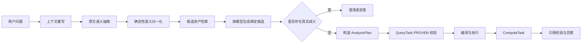

# 35. 智能问数运行时重构设计

> ⚠️ **本稿已停止维护（2026-08-17）**：已与《语义契约重构设计》合并为单一终稿——见 `35-agentic-chatbi-semantic-contract-redesign.md`（v3，含实施评审闭环）。本文件仅存档；合并取舍、命名对照与本稿 §1 部分案例归因相对三轮真实跑批数据的勘误，见合并稿附录 B/C。

> 状态：设计评审稿 v1
> 日期：2026-08-17
> 依据：`docs/tech/32-agentic-chatbi-architecture-redesign.md`、`docs/tech/33-agentic-chatbi-implementation-plan.md`、P1 黄金用例 G001–G012 真实运行结果
> 目标：修正智能问数运行时的语义契约、绑定顺序、澄清判定和验收方式，使新增指标、维度、模型和问题表达时仍然具备可解释、可测试、可回退的行为。

## 0. 结论与范围

### 0.1 结论

现有重设计方案的执行层方向正确，以下能力继续保留：

- `AnalysisPlan`、`QueryTask`、`ComputeTask` 和 `ResultStore`；
- 语义资产存储模型、语义 SQL 编译器和 PROVEN 校验；
- 权限三道闸、Temporal 域、执行安全和事件 Trace；
- FAST / PLAN / RESEARCH 三种模式的总体分层；
- DuckDB 确定性计算和答案引用校验。

需要重构的是执行层之前的语义运行时：

```text
问题理解 → 语义归一化 → 资产检索 → 按模型绑定 → 澄清判定 → AnalysisPlan
```

当前这部分存在四个结构性问题：

1. 一个字符串字段同时承担原始指标、检索文本、基础指标和计算指标的含义；
2. 绑定结果是全局单槽，不能表达跨模型查询的按任务绑定；
3. 系统内部尚未完成绑定时，被错误地当成用户歧义并要求澄清；
4. 模型格式错误通过重新生成完整 JSON 修复，可能丢失已经正确识别的语义。

因此，本设计不针对 G001–G012 做个例判断，而是建立一套新的运行时契约，并用这些案例作为回归样本。

### 0.2 非目标

本阶段不做以下事情：

- 重写语义资产数据库；
- 重写 SQL 执行权限链路；
- 引入自由生成物理 SQL 的兜底路径；
- 通过固定问题、固定指标或固定模型 ID 修复单个案例；
- 在没有中间结果证据时，仅用最终答案判断链路正确。

## 1. 现有设计问题归因

### 1.1 问题理解输出过载

当前问题理解输出同时表达“用户说了什么”和“系统应该如何执行”。这导致模型必须一次性完成：

- 原文短语抽取；
- 指标语义拆分；
- 派生计算识别；
- 时间比较结构识别；
- 维度用途判断；
- 查询组织方式判断；
- 歧义判断。

其中任何一项出错，都会污染下游所有阶段。

典型表现：

| 案例 | 设计层问题 |
|---|---|
| G001 | “增长率”被当成基础指标，而不是计算结果 |
| G009 | “环比增长率”被当成基础指标，同时默认时间维度被当成用户歧义 |
| G012 | “当前期末库存”和“库存量”被重复识别为两个指标 |
| G008 | “总GMV高于10000元”没有成为聚合后指标条件 |

### 1.2 绑定顺序与多模型计划不一致

现有目标链路是“先绑定、后计划”，但跨模型问题需要先知道指标所属模型，再决定每个查询任务使用哪个维度资产。

G005 表明：

```text
指标绑定已经成功
→ 发现两个指标属于不同模型
→ 需要拆成两个 QueryTask
→ 每个 QueryTask 应绑定自己的同名维度
```

而现有绑定结果只能表达一个全局维度资产，因此计划层虽然支持多 QueryTask，绑定层却无法提供必要输入。

### 1.3 内部待绑定状态与用户歧义未分层

以下状态当前都可能被压缩成 `ambiguous_slots`：

- 用户没有说清楚；
- 指标候选没有达到绑定阈值；
- 同名维度等待指标模型约束；
- 默认时间维度尚未根据指标模型确定；
- DTO 或归一化失败。

这些状态的处理方式完全不同，不能共用“请用户选择”。

G003、G004、G005、G008、G011、G012 的“档口ID澄清”都不是用户明确表达了真实歧义，而是指标绑定或跨模型投影尚未完成。

### 1.4 双重时间契约造成语义丢失

当前同时保留：

- `time_range`；
- `time_ranges`；
- `comparison`；
- `ComparisonSpec`；
- `TemporalPlan`；
- `TemporalInterpretationResult`。

兼容字段过多且没有明确唯一事实源，导致：

- G002 的字符串时间范围无法进入 DTO；
- G006 缺少 `base` 时无法从多个区间推导；
- G010 首轮正确的多区间结构在格式修复中丢失。

### 1.5 格式修复实际上重新理解了问题

格式错误应该是确定性字段迁移问题，但当前流程允许修复模型重新生成完整语义 JSON。

G010 说明这种方式不安全：首轮语义正确，仅因为多了一个 DTO 禁止字段而被拒绝；修复过程删除了 `comparison` 和 `time_ranges`，最终得到错误计划。

### 1.6 评测不能证明阶段能力

当前 P1 黄金题主要依赖 `expected_points`，缺少以下可执行断言：

- 期望的规范化语义；
- 期望的检索请求；
- 期望的模型分组；
- 期望的 QueryTask / ComputeTask；
- 期望的 SQL 条件；
- 期望的结果集关系。

因此，`finished` 不等于业务正确，`waiting_user` 也不一定表示用户问题真的有歧义。

## 2. 重构后的运行时链路

### 2.1 总体流程



### 2.2 各阶段职责

| 阶段 | 允许做的事情 | 禁止做的事情 |
|---|---|---|
| 上下文重写 | 补全追问上下文，保持当前问题语义 | 选择指标、维度或资产 ID |
| 原文语义抽取 | 抽取连续短语、时间表达、维度表达、计算关系 | 绑定语义资产、猜测物理字段 |
| 确定性归一化 | 字段迁移、别名兼容、语义不变量检查 | 重新解释自然语言 |
| 候选检索 | 根据完整短语召回候选 | 把整个问题临时当作指标名 |
| 按模型绑定 | 组合指标、维度、时间维度和值 | 直接向用户暴露尚未收敛的内部候选 |
| 澄清判定 | 只处理真实用户歧义或真实业务口径歧义 | 处理 DTO 错误、绑定顺序错误、内部缺失 |
| AnalysisPlan | 把已绑定的查询组织成 QueryTask / ComputeTask | 猜测资产 ID 或改写指标口径 |
| SQL 编译执行 | 只编译 PROVEN 计划并执行权限校验 | 接受未绑定或未经验证的计划 |
| AnswerComposer | 读取结果集并绑定数字引用 | 重新计算数字或补造缺失结果 |

### 2.3 模型调用边界

标准路径最多保留三类模型调用：

1. 追问上下文重写：仅在问题依赖上文时调用；
2. 结构化语义抽取：输出原文语义，不绑定资产；
3. 答案表达：只读取已执行结果集和口径元数据。

复杂 PLAN 可以增加一次规划模型调用，但规划模型只能引用绑定阶段已经确认的资产和计算关系。

归一化、绑定、澄清分类、时间默认、计划校验和 SQL 编译必须确定性完成。

## 3. 规范语义契约

### 3.1 原文语义抽取结果

新增一个权威的 `QuestionSemanticDraft`，替代问题理解结果中含义过载的字符串字段。

示例：

```json
{
  "intent_type": "comparison_analysis",
  "metrics": [
    {
      "raw": "总GMV",
      "role": "base",
      "span": {"start": 27, "end": 30}
    }
  ],
  "computations": [
    {
      "type": "growth",
      "metric_ref": "metric:1",
      "difference": true,
      "rate": true
    }
  ],
  "time": {
    "ranges": [
      {"raw": "2026年6月30日", "role": "compare"},
      {"raw": "6月29日", "role": "base"}
    ],
    "method": "custom"
  },
  "dimensions": [
    {
      "raw": "店铺100023",
      "name_hint": "档口ID",
      "role": "filter",
      "value": "100023"
    }
  ],
  "conditions": [],
  "order": null
}
```

约束：

- `metrics` 只表示用户明确表达的基础指标候选；
- `computations` 表示增长率、占比、差值等计算结果；
- `order.metric_ref` 引用已有指标，不重复创建指标；
- 所有自然语言短语保留完整连续文本和字符范围；
- 不出现资产 ID、物理字段名或 SQL；
- 不把默认时间维度写入用户语义抽取结果。

### 3.2 指标语义规则

指标候选统一使用以下结构：

```json
{
  "raw": "销售订单平均客单价",
  "role": "base | derived_reference | order_target",
  "span": {"start": 0, "end": 10},
  "base_metric_refs": [],
  "operation": null
}
```

其中：

- `base`：需要从语义资产中检索的基础指标；
- `derived_reference`：用户要求的计算结果，必须转换为 `computations`；
- `order_target`：排序使用已有指标引用，不生成第二个指标。

典型转换：

| 用户表达 | 规范结果 |
|---|---|
| “总GMV变化多少，增长率是多少” | 一个 `总GMV` 基础指标 + 一个 `growth` 计算关系 |
| “总GMV及环比增长率” | 一个 `总GMV` 基础指标 + 一个 `mom` 计算关系 |
| “当前期末库存并按库存量降序” | 一个库存基础指标 + `order.metric_ref` 指向该指标 |
| “销售订单平均客单价” | 一个完整派生指标短语；绑定后按资产定义展开或生成比率计算 |

### 3.3 时间语义规则

时间域只保留一个权威结构：

```json
{
  "expressions": [],
  "grouping": {"grain": "month"},
  "comparison": {
    "base": "2026年5月",
    "compare": ["2026年6月"],
    "method": "custom"
  }
}
```

规范：

- 外部模型可以输出字符串或旧字段，但进入主链路前必须由确定性归一化转换；
- 主链路只使用规范结构；
- `time_range` 只作为旧接口适配字段，不参与计划决策；
- `comparison` 缺失 `base` 时，只有在多个明确时间表达可以唯一推导时才自动补齐，否则进入内部错误或真实澄清；
- 时间默认字段在指标模型绑定后确定，不属于用户问题理解阶段。

### 3.4 指标条件规则

用户表达的“总GMV高于10000元”必须进入规范条件：

```json
{
  "metric_ref": "metric:1",
  "operator": ">",
  "value": 10000,
  "stage": "having"
}
```

`stage` 由确定性规则根据聚合层级决定，不由计划模型自由选择：

- 聚合前字段条件进入 `WHERE`；
- 聚合后指标条件进入 `HAVING`；
- 无法判断时拒绝生成计划，不静默放错位置。

## 4. 语义检索与按模型绑定

### 4.1 检索请求

指标检索必须使用 `QuestionSemanticDraft.metrics[].raw` 的完整连续短语。

```json
{
  "purpose": "metric",
  "text": "销售订单平均客单价",
  "semantic_role": "base",
  "context": {
    "question": "2026年6月各店铺销售订单平均客单价是多少？",
    "intent_type": "metric_query"
  }
}
```

规则：

- `text` 不使用整个问题替代指标短语；
- 整个问题只能作为独立的重排上下文；
- 指标短语找不到候选时，返回 `metric_missed`，不能让维度槽位先进入用户澄清；
- 维度检索可以并行，但维度不能在指标模型确定前做最终选择。

### 4.2 绑定结果按查询任务分组

检索和绑定不再返回“一个指标列表 + 一个维度列表”的全局结果，而是返回候选查询组：

```json
{
  "query_groups": [
    {
      "group_id": "model:246",
      "model_id": 246,
      "metrics": ["METRIC:271"],
      "dimensions": ["DIMENSION:278"],
      "time_dimension": "DIMENSION:279"
    },
    {
      "group_id": "model:247",
      "model_id": 247,
      "metrics": ["METRIC:304"],
      "dimensions": ["DIMENSION:283"],
      "time_dimension": "DIMENSION:284"
    }
  ]
}
```

### 4.3 绑定规则

1. 先对基础指标候选按模型分组；
2. 对每个模型组分别筛选兼容维度；
3. 如果一个模型组内所有候选唯一，自动绑定；
4. 如果多个模型组都被用户明确要求，生成多个 QueryTask；
5. 如果用户只表达一个指标，但候选模型仍有多个，才进入指标口径澄清；
6. 默认时间维度在模型确定后由语义模型能力表绑定；
7. 值归一在维度资产确定后执行；
8. 不能把跨模型的同名维度压缩成一个全局资产。

### 4.4 澄清判定

澄清只允许由以下三类状态触发：

| 状态 | 处理 |
|---|---|
| `user_semantic_ambiguous` | 展示业务口径或意图选项 |
| `asset_binding_ambiguous` | 候选资产均合法且无法由模型关系确定，展示资产口径 |
| `asset_not_found` | 按数据集策略拒答或进入受控兜底 |

以下状态禁止向用户澄清：

- DTO 字段错误；
- 字符串时间范围未归一化；
- 比较字段缺少兼容转换；
- 指标尚未绑定导致维度候选过多；
- 默认时间维度尚未根据模型确定；
- 计划校验内部错误。

## 5. AnalysisPlan 重构

### 5.1 计划输入

`AnalysisPlanner` 的输入必须是：

```text
CanonicalQuestionSemantic
BindingResult（按 QueryTask 分组）
VerifiedQuery / Instructions（可选）
```

计划模型不能直接读取未经绑定的 `metric_mentions` 或任意检索候选。

### 5.2 QueryTask

每个 QueryTask 必须保存完整资产绑定：

```json
{
  "id": "q1",
  "type": "query",
  "binding": {
    "model_id": 246,
    "metrics": [271],
    "dimensions": [278],
    "time_dimension": 279
  },
  "spec": {
    "filters": [],
    "having": [],
    "time": {},
    "group_by": [],
    "order_by": []
  }
}
```

计划校验必须确保：

- QueryTask 使用的资产全部来自绑定结果；
- 指标和维度属于同一模型或满足明确关系契约；
- `HAVING` 条件不能被降级为 `WHERE`；
- 时间范围数量和比较关系没有丢失；
- 排序指标必须引用已有指标；
- 每个 QueryTask 有独立的 PROVEN 计划和指纹。

### 5.3 ComputeTask

计算任务由规范语义中的 `computations` 确定，不由答案模型临时决定。

例如 G001：

```json
{
  "id": "c1",
  "type": "compute",
  "op": "growth",
  "inputs": ["q_compare", "q_base"],
  "metric_ref": "metric:1",
  "outputs": ["difference", "growth_rate"]
}
```

没有明确计算关系时，多个 QueryTask 的结果必须全部交给 AnswerComposer；不能默认只展示第一个结果。

## 6. 模型输出修复与兼容

### 6.1 修复顺序

模型输出处理固定为：

```text
提取 JSON → 确定性字段归一化 → DTO 校验 → 语义不变量校验
```

只有 JSON 无法解析时，才允许调用一次格式修复模型。

### 6.2 格式修复模型限制

修复模型只能输出补丁，不得重新生成完整问题理解结果：

```json
{
  "operations": [
    {"op": "remove_unknown_field", "path": "/comparison/metric"},
    {"op": "convert_string_to_time_range", "path": "/time_ranges/0"}
  ]
}
```

补丁应用后必须检查：

- 指标数量没有无理由变化；
- 时间范围数量没有减少；
- comparison 没有被删除；
- 计算关系没有被删除；
- 维度槽位和筛选值没有被重写；
- 规范化前后的语义指纹一致。

不满足不变量时，返回明确的 `understanding_contract_error`，不进入检索，也不向用户伪装成普通歧义。

## 7. 代码落地方案

### 7.1 新增或调整的稳定契约

| 位置 | 调整 |
|---|---|
| `backend/apps/chatbi/models/dto/semantic_intent.py` | 新增 `QuestionSemanticDraft`、`CanonicalQuestionSemantic`、`MetricIntent`、`ComputationIntent`、`TimeIntent` |
| `backend/apps/chatbi/services/understanding/` | 增加确定性归一化和语义不变量校验；保留模型调用边界 |
| `backend/apps/retrieval/models/dto/` | 新增按查询组表达的 `BindingResult`、`QueryBinding` |
| `backend/apps/retrieval/query/` | 将指标、维度、默认时间维度和值绑定按模型组处理 |
| `backend/apps/chatbi/services/planning/` | `AnalysisPlanner` 只消费规范语义和 `BindingResult` |
| `backend/apps/chatbi/orchestration/pipeline/` | 按新阶段顺序编排，并记录每阶段规范快照 |
| `backend/scripts/` | 将黄金题从文本命中改为结构化阶段断言 |

遵守现有模块边界：

- 跨模块只依赖公开 DTO 和 Service；
- 纯归一化、绑定和校验规则使用模块级函数；
- 不新增无状态单方法 Service；
- 新兼容字段登记 `backend/COMPAT_LEDGER.md`；
- 不在检索层导入语义 ORM，不在理解层绑定物理字段。

### 7.2 现有代码处理方式

| 现有部分 | 处理方式 |
|---|---|
| `IntentRecognitionOutput` | 保留旧接口适配，禁止继续作为主链路事实源 |
| `time_range` | 仅用于旧调用方投影，主链路改用规范时间结构 |
| `_metric_retrieval_text` | 删除基于中文相邻字符的全文回退逻辑 |
| `RetrievalBundle` | 兼容读取，新增按查询组的绑定结果 |
| `bind_default_time_dimensions` | 移到模型组确定之后执行 |
| `react_legacy` | 只作为回滚路径，不作为新设计验收路径 |
| `AnalysisPlan` | 增加 QueryTask 绑定快照和规范语义指纹 |

## 8. 分阶段实施计划

### R0：契约冻结与观测补齐（1 周）

目标：不改变用户行为，先建立可验证的新契约。

工作内容：

- 新增规范语义 DTO 和样例；
- 把 G001–G012 转成阶段级 fixture；
- Trace 保存原始模型输出、归一化结果、检索请求、绑定结果和计划快照；
- 修正评测脚本的 SQL 执行判定；
- `expected_points` 改为结构化断言；
- 增加 `semantic_contract_version` 和 `binding_contract_version`。

退出条件：

- 新旧链路行为不变；
- 12 个案例都能定位到明确阶段；
- 没有“只有最终答案、没有中间证据”的运行记录。

### R1：问题理解与确定性归一化（2 周）

工作内容：

- 接入 `QuestionSemanticDraft`；
- 指标、计算、排序目标分离；
- 时间和比较结构统一归一化；
- 实现补丁式格式修复；
- 增加语义不变量校验；
- G001、G002、G006、G009、G010、G012 阶段测试先通过。

退出条件：

- 不再出现字符串时间范围直接进入 DTO；
- 格式修复不能丢失时间段、比较关系或计算关系；
- 派生结果和排序目标不再产生重复指标槽位。

### R2：按模型绑定与澄清重构（2 周）

工作内容：

- 指标检索使用完整指标短语；
- 指标候选按模型分组；
- 每个模型组分别绑定维度和值；
- 绑定完成后确定默认时间维度；
- 区分内部待绑定状态和真实用户歧义；
- G003、G004、G005、G008、G011、G012 阶段测试先通过。

退出条件：

- 跨模型同名维度能生成多组绑定；
- 指标未命中时不先澄清无关维度；
- 默认时间维度不再要求用户选择；
- 只有真实候选歧义才进入澄清。

### R3：AnalysisPlan 接入新绑定结果（2 周）

工作内容：

- QueryTask 保存完整模型和资产绑定；
- ComputeTask 从规范计算关系生成；
- HAVING、快照、预聚合和时间偏移全部从规范计划投影；
- 计划校验增加语义指纹和资产来源校验；
- G001、G005、G008、G009、G010、G012 端到端验证。

退出条件：

- G005 能生成按模型拆分的 QueryTask；
- G008 生成真实 HAVING；
- G009 生成月分组和环比计算；
- G010 保留两个时间区间并生成同比计算。

### R4：灰度切换与旧链路收敛（1–2 周）

切换开关：

```text
CHATBI_SEMANTIC_RUNTIME_V2=false  # 影子运行
CHATBI_SEMANTIC_RUNTIME_V2=shadow
CHATBI_SEMANTIC_RUNTIME_V2=10%
CHATBI_SEMANTIC_RUNTIME_V2=100%
```

切换原则：

- 影子运行只记录新旧语义、绑定和计划差异，不影响用户答案；
- 先在固定数据集和管理员用户灰度；
- 新链路出现契约错误时可以回滚到旧链路，但回滚必须记录原因；
- 不允许静默降级为错误答案；
- 新链路稳定后再移除旧字段和兼容适配。

## 9. 分层测试与验收

### 9.1 问题理解层

每个黄金案例必须断言：

- 基础指标列表；
- 计算关系；
- 时间表达和比较关系；
- 维度用途和值；
- 排序指标引用；
- 指标条件的聚合阶段。

### 9.2 检索和绑定层

必须断言：

- 指标检索文本等于完整指标短语；
- 指标候选的模型集合；
- 每个 QueryTask 的指标、维度和值绑定；
- 默认时间维度来源；
- 真实澄清原因及候选。

### 9.3 计划和 SQL 层

必须断言：

- QueryTask 数量；
- ComputeTask 类型和输入；
- HAVING / WHERE 位置；
- 时间区间数量；
- 预聚合和快照表达；
- 每个 QueryTask 的 PROVEN 状态。

### 9.4 P1 发布门槛

以下条件全部满足，才能判定 P1 通过：

1. G001–G012 全部进入期望的链路，不出现未预期澄清或理解契约失败；
2. G002、G006、G010 的格式修复语义保持率为 100%；
3. G003、G004、G008、G011 的指标检索请求不使用完整问题替代指标短语；
4. G005 至少生成两个按模型绑定的 QueryTask；
5. G008 的指标条件最终位于 HAVING；
6. G009 不因默认时间维度产生用户澄清；
7. G012 只生成一个库存基础指标和一个排序引用；
8. 三连跑规范语义和绑定结果一致率不低于 95%；
9. 新链路和旧链路在已通过的 P0 控制题上结果集等价；
10. 评测报告能够展示每个失败发生的阶段和责任层。

### 9.5 评测脚本修正

评测脚本必须：

- 将 `task.finished` 且任务成功的 QueryTask 计入执行结果；
- 以结果集和结构化断言为主，不以答案文本关键词为主；
- 区分“应澄清”和“错误澄清”；
- 区分“计划生成成功”和“业务结果正确”；
- 同时记录 `react_legacy`、`fast`、`plan` 的执行模式；
- 保存原始运行、规范语义、绑定结果、AnalysisPlan 和 SQL 指纹。

## 10. 风险与处理

| 风险 | 处理方式 |
|---|---|
| 模型仍然漏掉完整指标短语 | 原文 span 保留 + 语义不变量校验；不能用下游全文检索掩盖 |
| 资产候选确实存在多个业务口径 | 在绑定完成后澄清，展示指标定义和模型范围 |
| 多模型结果缺少可比较键 | 计划校验拒绝 ComputeTask，但仍可分别展示 QueryTask 结果 |
| 旧链路和新链路结果不一致 | 影子运行记录差异，未通过控制题前不切换默认 |
| 新契约增加迁移成本 | 只在边界保留兼容适配，主链路不双重维护事实源 |
| 评测结果受模型随机性影响 | 三连跑、阶段断言和结果集比较同时使用 |

## 11. 最终设计原则

1. LLM 负责抽取用户表达，不负责猜测资产和物理字段；
2. 检索负责召回候选，不负责重新拆分指标短语；
3. 绑定负责按模型形成查询组，不返回无法用于计划的全局单槽；
4. 默认语义由资产和能力契约确定，不让用户为系统内部缺失信息澄清；
5. 格式修复只能做确定性迁移或受限补丁，不能重新生成完整语义；
6. 计划只能消费已经绑定的资产和规范计算关系；
7. 任何失败必须归因到具体阶段，不用“歧义”掩盖内部错误；
8. 评测必须验证中间契约，不能只看最终是否生成答案；
9. 旧链路只作为灰度和回滚路径，不作为新架构验收依据；
10. 先完成语义契约和分层验收，再继续扩展新的复杂分析能力。

