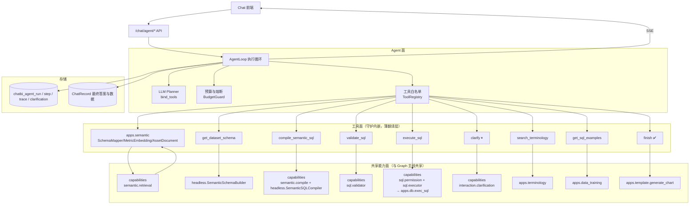
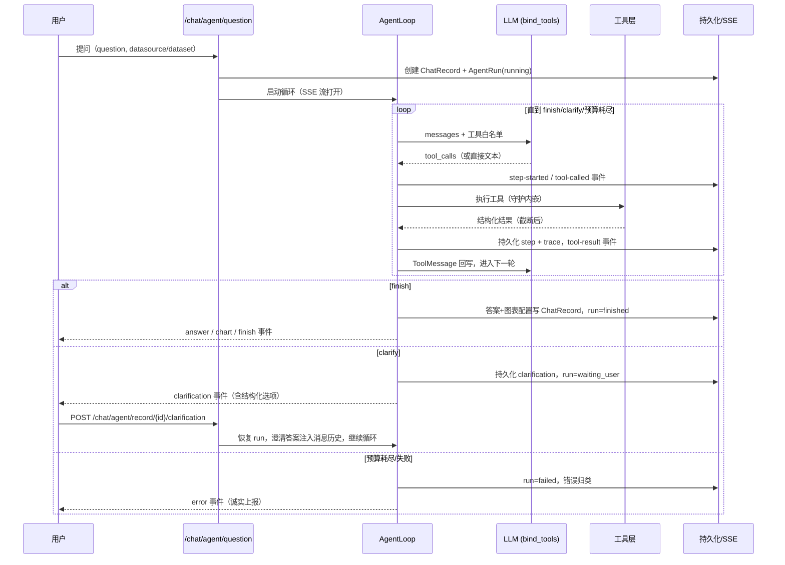
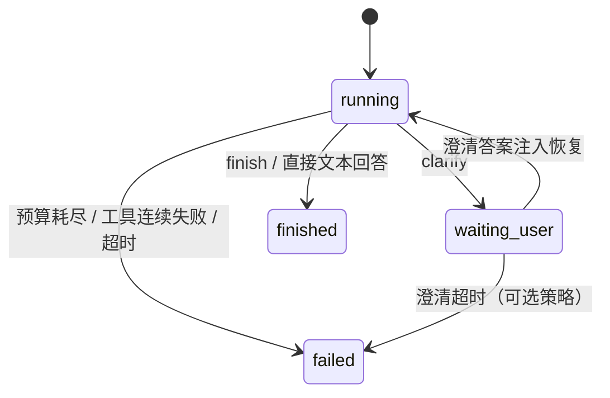

# Agentic ChatBI 技术文档

**定位：** SQLBot Agentic ChatBI（LLM 自主规划问数链路）的技术文档，覆盖背景、技术选型、总体架构与各项技术细节。
**代码位置：** `apps/agent`（工具层依赖共享能力层 `apps/capabilities`，见 [10-graph-agentic-capability-overlap-analysis.md](./10-graph-agentic-capability-overlap-analysis.md)）
**日期：** 2026-07-10

---

## 1. 背景

### 1.1 ChatBI 的本质

ChatBI 不是单点 Text-to-SQL，而是一条端到端问数链路：

```text
自然语言问题 → 问题理解与澄清 → 指标/维度/时间口径识别
  → 数据与知识检索 → SQL 生成、校验和执行 → 结果解释与可视化
```

核心矛盾：**用户希望像聊天一样自由提问（自然语言是模糊的），而企业数据分析要求结果严谨、权限可控、过程可解释（数据系统是确定性的）**。ChatBI 系统就是这两者之间稳定、可治理的转换链路。

### 1.2 为什么需要 Agentic 模式

Graph 主线（`apps/workflow_engine` + `apps/workflow`）用显式有向图把问数流程工程化，优势是**确定性、可治理、可观测**；代价是**流程刚性**——每新增一种问数形态（多指标对比、归因下钻、跨数据集拼接、先探查再决策的开放分析）都要改图定义、加节点、加路由条件。

Agentic 模式把规划权交给 LLM：模型通过 tool-calling 自主决定每一步做什么（检索语义资产、编译/生成 SQL、执行、澄清、结束作答），以此获得对长尾问法（模糊探索、多步推理、追问链）的自适应能力。它与 Graph 主线并行运行，共享底层能力资产（headless 语义层、权限、SQL 执行、图表模板），独立入口、独立持久化。

### 1.3 设计目标

- 建立一条 LLM 自主规划的问数链路：LLM 通过 tool-calling 决定每一步动作，系统通过受控工具层与预算护栏约束行为边界。
- 工具全部映射到现有领域能力（headless 语义层、SQL 校验/权限/执行、术语、SQL 示例），不重写业务逻辑。
- 澄清（clarify）与完成（finish）是一等终止动作，支持暂停恢复与跨轮澄清。
- 每一步持久化 + SSE 推送，可观测性不低于 graph 主线。

**边界：** 不改造 graph 主线，不做运行时混合；不允许 LLM 执行任意 SQL 或任意代码；单 Agent 架构（不做多 Agent 协作拓扑）。

---

## 2. 技术选型

### 2.1 Agent 范式：单 Agent 受控工具循环

一个 LLM 通过 tool-calling 自主选择粗粒度领域工具，`clarify`/`finish` 为终止动作。

架构判断依据：**SQLBot 的确定性资产决定了"厚工具、薄循环"是最优结构**。语义检索（SemanticSchemaMapper + metric embedding）、语义 SQL 编译（SemanticSQLCompiler）、校验、权限、执行都是高可靠的确定性能力，封装成工具后，LLM 需要做的只是"选择下一步 + 组织查询计划 + 判断歧义"——一个模型循环足够，不需要 Worker 子代理或多 Agent 分体。

四条设计不变式：

1. **语义层接地**：模型只能基于语义层给出的指标/维度/表证据行动，不允许凭空编造口径。
2. **工具白名单 + 守护内嵌**：只读、权限、限行数等约束在工具内部强制执行，不依赖 prompt。
3. **澄清优先于猜测**：影响 SQL 正确性的歧义必须问用户，且给结构化选项。
4. **预算与熔断**：步数、重试、澄清轮次、超时都有硬上限，失败诚实上报。

### 2.2 框架：langchain `bind_tools` + 自研循环

不引入 agent 框架（langgraph、openai-agents SDK 等），直接用 langchain 的 `bind_tools` 做工具调用，循环、持久化、SSE、澄清挂起自研：

- 无新依赖：`LLMFactory` 产出的就是 `BaseChatModel`，`bind_tools` 开箱可用。
- 循环、持久化、SSE、澄清挂起完全自控，与图运行时"框架无关、领域约束内嵌"的哲学一致。
- 核心循环预计 ≤300 行，框架带来的定制成本高于自研成本。

自研循环直接沿用现有代码骨架：

| 复用项 | 来源 |
| --- | --- |
| LLM 实例与配置 | `apps/ai_model/model_factory.py` `LLMFactory` + `get_default_config` |
| run/step/trace/clarification 持久化模式 | `apps/agentic_chat/models.py` 四表结构（新建同构表） |
| SSE 事件封装 | `apps/agentic_chat/events.py` `sse_event` |
| 澄清挂起/恢复状态机 | `apps/agentic_chat/orchestrator.py` `waiting_user` → resume 模式 |
| 工具的领域实现 | 共享能力层 `apps/capabilities`（由现有 v1 工具与 graph adapters 的领域逻辑下沉而来）与 `apps/semantic` |

---

## 3. 总体架构

### 3.1 分层结构

架构分四层：**Agent 面**（执行循环 + 预算护栏 + 工具白名单）、**工具面**（9 个守护内嵌的领域工具，只做 tool-schema → 领域参数的翻译）、**共享能力面**（`apps/capabilities` 领域能力层 + headless 语义层等底层资产，与 Graph 主线共享）、**存储面**（run/step/trace/clarification 四表 + ChatRecord 写回）。



依赖规则：`agent` 只 import `capabilities` 与底层资产包（headless/terminology/data_training/template/db），**禁止 import `workflow` 与 `agentic_chat`**；`capabilities` 反向禁止 import 任何运行时包。Graph 主线与 Agentic 通过同一能力层共享领域逻辑，各自的 adapter/tool 只做上下文翻译。

### 3.2 执行循环（核心范式）

```text
while steps < max_steps:
    assistant_msg = LLM.invoke(messages, tools=whitelist)
    if assistant_msg 无工具调用:            # 模型直接给出回答 → 视为 finish 的宽松形态，进入答案整理
        break
    for tool_call in assistant_msg.tool_calls:
        if tool_call is clarify:  → 持久化 clarification，run 转 waiting_user，SSE 推送后挂起返回
        if tool_call is finish:   → 生成答案与图表配置，run 转 finished
        else:                     → 白名单工具执行（守护内嵌），结果截断后以 ToolMessage 回写 messages
    持久化 step + trace，SSE 推送
```

权力边界：

- **LLM 拥有的自主权**：选择工具、组织参数、决定顺序、决定何时澄清与结束。
- **LLM 没有的权力**：越出白名单、绕过权限/只读守护、超出步数与澄清预算、把示例当结果（prompt 约束 + 执行结果核验）。

### 3.3 一次问数的执行时序



### 3.4 Run 状态机



---

## 4. 技术细节

### 4.1 工具层

**设计原则：**

1. **粗粒度**：工具对应一次有业务含义的领域动作（"检索语义资产"而非"查一张表"），减少循环步数。
2. **守护内嵌**：只读、权限、limit、超时、脱敏在工具实现内部强制，prompt 只做引导不做防线。
3. **结构化输入输出**：pydantic schema 定义参数与返回；返回包含 `summary`（进 LLM 上下文）与 `payload`（落库/给前端），大结果只把样本与统计摘要给模型。
4. **全部映射既有能力**：工具层是薄封装，不新写业务逻辑。

**工具清单（9 个）：**

| 工具 | 输入 → 输出 | 领域实现（能力层） | 守护 |
| --- | --- | --- | --- |
| `search_semantic_assets` | question/keywords → 语义包：候选指标（key、口径、置信度）、维度、候选数据集/表、歧义提示 | `capabilities.semantic.retrieval`（检索核心 + CandidateGate，底座为 headless SchemaMapper 精确匹配 + metric embedding 向量召回 + AssetDocument） | 工作空间隔离；top-k 截断 |
| `get_dataset_schema` | dataset_id → 表/字段/类型/注释/join 关系 | `headless.service.SemanticSchemaBuilder` | 字段数截断；敏感列标注 |
| `search_terminology` | term → 业务术语解释与映射 | `apps.terminology` 检索 | top-k 截断 |
| `get_sql_examples` | question → 相似问答 SQL 示例（few-shot） | `apps.data_training` 训练示例检索 | 标注"仅供参考，非真实结果" |
| `compile_semantic_sql` | 结构化查询计划（指标 keys、维度 keys、过滤、时间范围、排序、limit）→ 编译 SQL + 绑定说明 | `capabilities.semantic.compile`（数据集解析 + 编译请求组装）→ `headless.sql_compiler.SemanticSQLCompiler` | 只接受语义包中出现过的资产 key，杜绝编造口径 |
| `validate_sql` | sql → 通过/错误分类（语法、非只读、越权对象、缺 limit 自动补） | `capabilities.sql.validator`（sqlparse） | 拒绝非 SELECT；自动 append limit |
| `execute_sql` | sql → `{fields, sample_rows(≤N), row_count, stats_summary}` | `capabilities.sql.permission`（行列权限改写）→ `sql.executor`（执行 + 采样/截断/输出构造，底座 `apps.db.db.exec_sql`） | 权限改写强制前置；只读连接；行数/字节截断；超时；全量结果落 `ChatRecord.data` 不进上下文 |
| `clarify` ⏸ | question + 结构化 options（含资产候选）→ 终止动作 | `capabilities.interaction.clarification`（澄清选项/卡片领域结构） | 每 run ≤2 次；必须给选项（自由文本澄清降级允许） |
| `finish` ✅ | answer_markdown + chart_intent（图表类型/轴/系列）→ 终止动作 | 图表配置经 `apps.template.generate_chart` 生成 | 必须已存在成功的 `execute_sql` 结果，否则拒绝（防止无数据编造答案） |

以上能力层模块与 Graph 主线共用同一实现（Graph 侧经其 adapter 调用），任何守护或口径逻辑的修改两条链路同时生效，不允许各自维护分叉副本。SQL 自纠错所需的修复策略同样来自能力层（`capabilities.sql.repair`），由 AgentLoop 在 `execute_sql` 失败后的重试轮次内使用。

**SQL 生成双路径策略：**

- **优先路径（语义编译）**：语义包命中充分时，LLM 组织结构化查询计划 → `compile_semantic_sql` 确定性生成 SQL。口径由语义层保证，LLM 不手写 SQL。
- **兜底路径（自由生成）**：语义资产未覆盖（临时表、无指标定义的明细查询）时，LLM 基于 `get_dataset_schema` + `get_sql_examples` 直接写 SQL，但必须过 `validate_sql` → `execute_sql` 守护链。生成核心复用能力层 `capabilities.sql.llm_generate`（与 Graph 的 constrained_llm 通道同一实现，设计见 [chatbi-v1-vector-retrieval-llm-sql-design.md](../chatbi-v1-vector-retrieval-llm-sql-design.md)）；表白名单限定为命中数据集/模型的物理表；结果携带 `non_standard` 非标准口径标识透传到最终答案，明确告知用户口径可能与标准指标定义不同。
- system prompt 明确优先级：能编译不手写。

**上下文预算管理：**

- 每个工具返回设 `summary` 字数上限（如 2k tokens），超限截断并提示"完整结果已存档"。
- `execute_sql` 只回样本行（默认 10 行）+ 行数 + 数值列统计摘要。
- 消息历史超过阈值时对最早的工具轮做摘要折叠。

### 4.2 控制与安全策略

| 维度 | 策略 | 默认值 |
| --- | --- | --- |
| 步数预算 | 每 run 最大 LLM 轮数 | 12 |
| token 预算 | 每 run 输入+输出 token 上限，超限强制收敛 | 可配置（如 100k） |
| 重复熔断 | 同一工具 + 语义等价参数连续调用 | 3 次即熔断 |
| SQL 自纠错 | `execute_sql` 失败后允许"改 SQL 重试" | ≤2 次，之后必须 clarify 或 finish(失败说明) |
| 澄清轮次 | 每 run `clarify` 次数 | ≤2 |
| 超时 | run 墙钟超时 | 120s |
| 工具边界 | 白名单注册表；未注册工具调用 → 拒绝并回写错误 ToolMessage | — |
| SQL 守护 | 只读校验、权限改写、auto-limit、连接超时全部在工具内 | — |
| 失败兜底 | 预算耗尽/连续失败 → run=failed，错误归类（理解失败/检索未命中/SQL 失败/预算耗尽），SSE 诚实上报 | — |

失败不静默降级：失败必须完整记录 trace，诚实上报。

### 4.3 会话、持久化与跨轮澄清

**持久化模型（四张表）：**

| 表 | 关键字段 | 说明 |
| --- | --- | --- |
| `chatbi_agent_run` | id, chat_id, record_id, status, **messages**(JSONB), budget_snapshot, error_class, oid, user_id | messages 为 LLM 消息历史型状态（system 除外），是恢复与回放的唯一事实源 |
| `chatbi_agent_step` | run_id, step_index, tool_name, args_summary, result_summary, status, latency_ms, token_usage | 每次工具调用一条 |
| `chatbi_agent_trace_event` | run_id, step_id, event_type, payload, sequence | SSE 事件同构落库，支持断线重放 |
| `chatbi_agent_clarification` | run_id, question, options, answer, status | 澄清请求与回答 |

核心设计：**状态就是消息历史本身**——LLM 的工作记忆与持久化状态同构，恢复 = 反序列化 messages 继续循环，无需状态翻译层。

最终答案写回 `ChatRecord.sql_answer/sql/data/chart_answer/chart`，前端聊天历史无感。

**跨轮澄清，两种回答途径都支持：**

1. **表单恢复**（主路径）：前端对 `clarification` 事件渲染选项，用户提交 → `POST /chat/agent/record/{id}/clarification` → 澄清答案以 ToolMessage（`clarify` 工具的返回）注入 messages，恢复同一 run 继续循环。
2. **自然语言追答**（增强）：用户不点选项、直接发新消息。新消息进入新 run，但 system prompt 注入 `pending_clarification_context`（上一 run 挂起时的语义包与澄清问题），并按判别规则处理：仅当最近一条 assistant 是澄清、当前输入明显是补充口径且不足以构成独立新问题时，才按澄清回复处理并复用挂起语义，否则按新问题处理。判别结果写入 trace。

**多轮会话上下文：**

- 每 run 的 system prompt 注入：数据源/数据集绑定、最近 K 轮问答摘要（question + 最终 SQL + 结果概要，不含全量数据）、当前挂起澄清上下文。
- 追问改写不是独立节点：LLM 在循环内自行结合历史理解追问（"那上个月呢"）。

### 4.4 API 与 SSE 事件契约

Router：`apps/agent/api.py`，挂载到 `apps/api.py`：

```text
POST /chat/agent/question                          # 提问，SSE 流式返回
POST /chat/agent/record/{record_id}/clarification  # 澄清回答，恢复 run，SSE 续流
GET  /chat/agent/record/{record_id}/trace          # trace 回放（调试/评估）
GET  /chat/agent/runs/{run_id}/events?after_sequence=  # 断线事件补拉
POST /chat/agent/runs/{run_id}/cancel              # 取消
```

SSE 事件（通用事件 + 语义事件双层）：

| 事件 | 时机 | payload 要点 |
| --- | --- | --- |
| `record-created` / `run-started` | 启动 | record_id, run_id |
| `step-started` / `step-finished` | 每轮 | step_index, tool_name, summary |
| `tool-called` / `tool-result` | 工具执行前后 | tool_name, args_summary / result_summary |
| `thinking` | LLM 产出决策文本时（增量） | content 增量（模型的行动理由） |
| `sql-generated` / `sql-validated` / `sql-executed` | 对应工具成功后映射 | sql / row_count, fields |
| `clarification` | clarify | question, options, clarification_id |
| `answer` / `chart-generated` | finish | content / chart 配置 |
| `run-finished` / `run-failed` / `finish` / `error` | 终态 | content, error_class |

事件同构落 `chatbi_agent_trace_event`，`after_sequence` 支持断线重放。

### 4.5 与 Graph 主线的关系

- **互不侵入**：独立入口、独立持久化，运行时零耦合；`agent` 与 `workflow` 禁止互相 import。
- **共享能力层**：两条链路的领域逻辑统一收敛在 `apps/capabilities`（SQL 校验/权限/执行/修复、语义检索核心、编译请求组装、澄清结构），加上共同的底层资产（headless 语义层、术语、SQL 示例、图表模板）与 ChatRecord 写回约定。能力层禁止 import 任何运行时包（`workflow_engine`/`workflow`/`agent`）。
- **各自只保留翻译层**：Graph 的 adapter 负责节点上下文（`ChatBIRunContext`）→ 领域参数的翻译；Agentic 的 tool 负责 tool-schema → 领域参数的翻译 + `summary`/`payload` 分离。翻译层不含领域逻辑，禁止复制粘贴分叉。
- **能力层的形成路径**：由现有 v1 工具五件套与 graph adapters 中的领域逻辑分步下沉而来，迁移步骤与依赖规则见 [10-graph-agentic-capability-overlap-analysis.md](./10-graph-agentic-capability-overlap-analysis.md)。
- **前端**：新增"智能体模式"开关，事件消费复用现有组件改造。

---

## 5. 实施分期

| 阶段 | 范围 | 退出标准 |
| --- | --- | --- |
| **前置：能力层就位** | `apps/capabilities` 建包；v1 五件套（ToolResult/validator/executor/permission/repair）平移；execution 领域逻辑下沉（对应 10 号分析文档 Step 1–2） | Graph 全量回归通过；`workflow` 不再 import `agentic_chat` |
| **P0 最小闭环** | `apps/agent` 模块骨架；AgentLoop + BudgetGuard + ToolRegistry；6 个核心工具（search_semantic_assets / get_dataset_schema / compile_semantic_sql / validate_sql / execute_sql / finish）；run/step/trace 持久化；SSE；`/chat/agent/question`。检索核心解耦（Step 4）完成前，`search_semantic_assets` 可经临时翻译垫片调用现有 adapter，完成后切换到 `semantic.retrieval` | 评测集可全量跑通（允许失败，trace 完整）；单题成本与延迟有数据 |
| **P1 交互完善** | clarify 工具 + 暂停恢复 API；跨轮澄清判别；多轮会话上下文注入；search_terminology / get_sql_examples 工具；上下文折叠；前端模式开关与事件渲染 | 完整对照评估报告产出 |
| **P2 进阶探索** | 图表意图工具增强；Python 分析沙箱（受控容器）；few-shot 记忆召回（对接 `data_training` 沉淀） | 由 P1 评估结论决定是否投入 |

## 6. 风险与缓解

| 风险 | 缓解 |
| --- | --- |
| LLM 规划质量依赖模型能力，弱模型下步数暴涨 | 预算硬上限；system prompt 提供标准问数路径引导（检索→编译→执行→finish） |
| 语义包截断导致模型看不到关键资产 | top-k 与截断阈值可配置；trace 记录截断量 |
| 自由 SQL 路径的口径风险 | validate + 权限守护保安全；口径正确率单独评估，若过低则收紧为"仅语义编译路径" |
| 消息历史型状态的存储膨胀 | messages 存摘要化工具结果（与上下文同构）；全量数据只在 ChatRecord.data |
| 能力层下沉引入的行为回归（尤其语义检索核心解耦） | 分步迁移、每步独立合入；Graph 评测集全量回归作为每步退出标准（见 10 号分析文档迁移步骤） |
