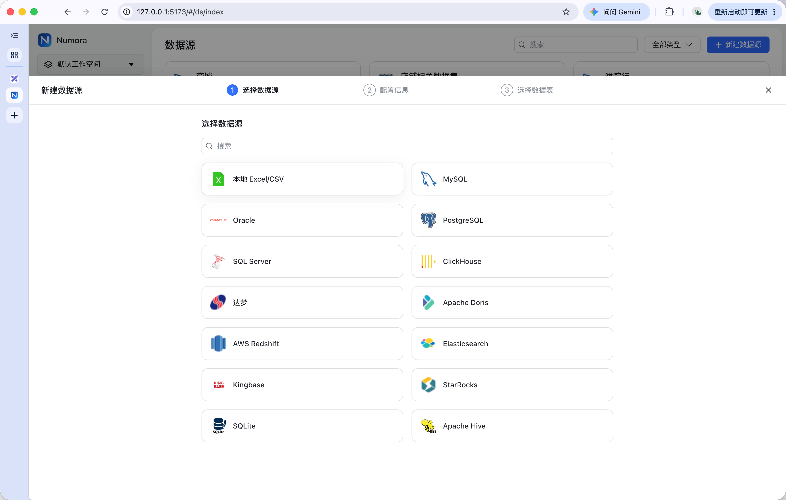
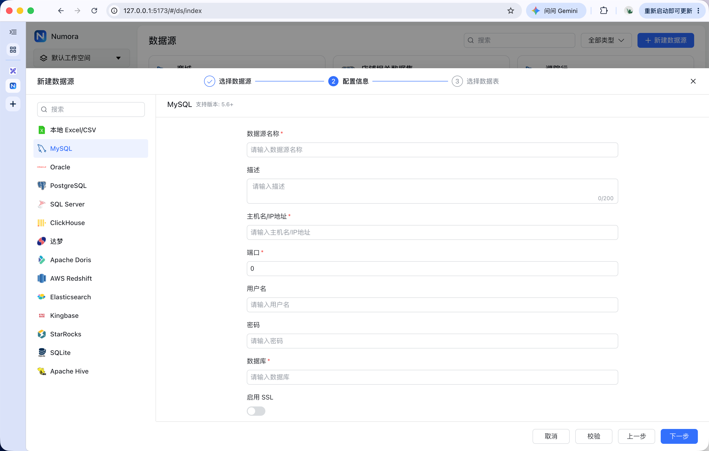
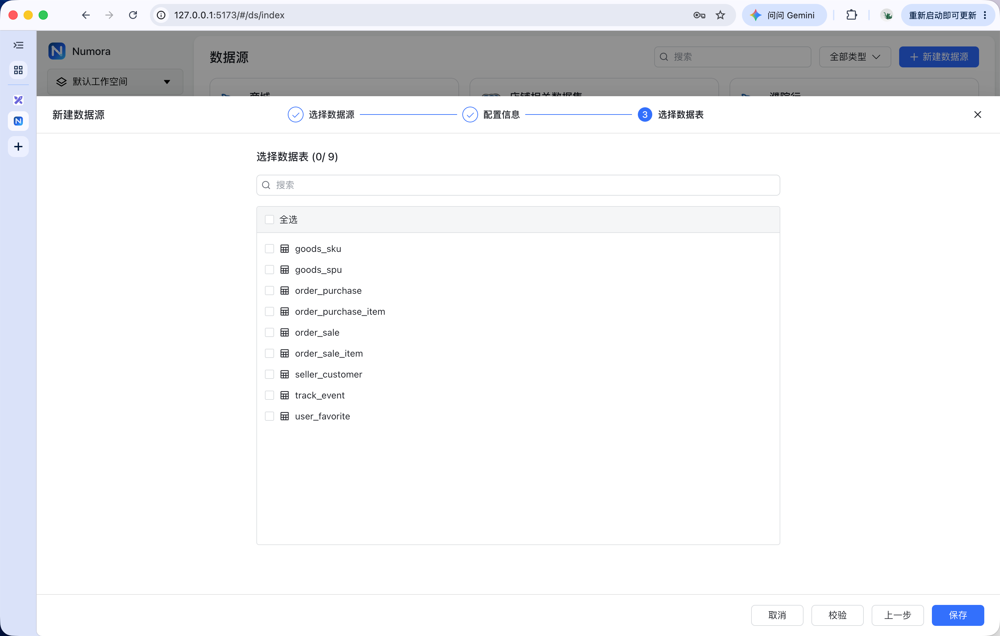

# 数据源

## 作用

数据源为语义层提供可访问的物理业务数据，语义模型再基于这些数据定义业务指标、维度及其统计口径。

## 基础功能

### 选择数据源
支持多种数据库类型与Excel文件的处理


### 配置信息
通过填充数据源信息，即可完成数据源的配置


### 选择数据表
校验连接成功后，可以选择数据表，即可完成数据源的配置


## 存储结构

数据源模块的物理元数据由三张表组成：

### `core_datasource`：数据源连接信息

| 字段 | 类型 | 可为空 | 说明 |
| --- | --- | --- | --- |
| `id` | `BIGINT` | 否 | 主键，自增 |
| `name` | `VARCHAR(128)` | 否 | 数据源名称 |
| `description` | `VARCHAR(512)` | 是 | 数据源描述 |
| `type` | `VARCHAR(64)` | 否 | 数据源类型 |
| `type_name` | `VARCHAR(64)` | 是 | 数据源类型名称 |
| `configuration` | `TEXT` | 是 | 加密保存的连接配置 JSON |
| `create_time` | `TIMESTAMP` | 是 | 创建时间 |
| `create_by` | `BIGINT` | 是 | 创建人 ID |
| `status` | `VARCHAR(64)` | 是 | 数据源状态 |
| `num` | `VARCHAR(256)` | 是 | 表数量统计 |
| `oid` | `BIGINT` | 是 | 所属工作空间 ID |
| `table_relation` | `JSONB` | 是 | 物理表关系配置 |
| `embedding` | `TEXT` | 是 | 历史 Embedding 字段，兼容保留 |
| `recommended_config` | `BIGINT` | 是 | 推荐配置标记 |

### `core_table`：物理表信息

| 字段 | 类型 | 可为空 | 说明 |
| --- | --- | --- | --- |
| `id` | `BIGINT` | 否 | 主键，自增 |
| `ds_id` | `BIGINT` | 是 | 所属数据源 ID，对应 `core_datasource.id` |
| `checked` | `BOOLEAN` | 否 | 是否选中 |
| `table_name` | `TEXT` | 是 | 物理表名 |
| `table_comment` | `TEXT` | 是 | 数据库表说明 |
| `custom_comment` | `TEXT` | 是 | 自定义表说明 |
| `embedding` | `TEXT` | 是 | 历史 Embedding 字段，兼容保留 |

### `core_field`：物理字段信息

| 字段 | 类型 | 可为空 | 说明 |
| --- | --- | --- | --- |
| `id` | `BIGINT` | 否 | 主键，自增 |
| `ds_id` | `BIGINT` | 是 | 所属数据源 ID，对应 `core_datasource.id` |
| `table_id` | `BIGINT` | 是 | 所属物理表 ID，对应 `core_table.id` |
| `checked` | `BOOLEAN` | 否 | 是否选中 |
| `field_name` | `TEXT` | 是 | 物理字段名 |
| `field_type` | `VARCHAR(128)` | 是 | 物理字段类型 |
| `field_comment` | `TEXT` | 是 | 数据库字段说明 |
| `custom_comment` | `TEXT` | 是 | 自定义字段说明 |
| `field_index` | `BIGINT` | 是 | 字段顺序 |

三张表通过 `ds_id` 和 `table_id` 在代码中关联；当前迁移定义未设置数据库外键约束。

# 语义层

语义层是在配置的数据源的基础上进行进一步的处理，能够根据数据库表字段进行指标与维度的配置，并建立对应的领域模型进行指标的分类，然后通过配置数据集来开发开放问数数据给智能体

## 主题域
按业务范围组织和隔离语义内容，例如“交易域”“用户域”，下面可以包含多个数据集和术语

## 数据集
定义一个可被查询的业务分析范围，绑定语义模型、指标、维度及查询配置，供智能问答或查询使用。

### 存储结构

当前语义模块的数据集由以下四张表组成：

#### `headless_dataset`：数据集主表

| 字段 | 类型 | 可为空 | 说明 |
| --- | --- | --- | --- |
| `id` | `BIGINT` | 否 | 主键，自增 |
| `oid` | `BIGINT` | 否 | 所属工作空间 ID |
| `domain_id` | `BIGINT` | 否 | 所属主题域 ID |
| `name` | `VARCHAR(128)` | 否 | 数据集名称 |
| `biz_name` | `VARCHAR(128)` | 否 | 数据集业务标识 |
| `description` | `TEXT` | 是 | 数据集描述 |
| `status` | `INTEGER` | 否 | 数据集状态 |
| `alias` | `JSONB` | 否 | 数据集别名 |
| `data_set_detail` | `JSONB` | 否 | 数据集模型配置明细 |
| `query_config` | `JSONB` | 否 | 查询配置 |
| `schema_version` | `BIGINT` | 否 | 数据集结构版本 |
| `index_version` | `BIGINT` | 否 | 数据集索引版本 |
| `default_model_id` | `BIGINT` | 是 | 默认模型 ID |
| `default_time_dimension_id` | `BIGINT` | 是 | 默认时间维度 ID |
| `owner` | `VARCHAR(128)` | 是 | 数据集负责人 |
| `created_at` | `TIMESTAMP` | 是 | 创建时间 |
| `updated_at` | `TIMESTAMP` | 是 | 更新时间 |

#### `headless_dataset_model_config`：数据集与模型关联表

| 字段 | 类型 | 可为空 | 说明 |
| --- | --- | --- | --- |
| `id` | `BIGINT` | 否 | 主键，自增 |
| `oid` | `BIGINT` | 否 | 所属工作空间 ID |
| `dataset_id` | `BIGINT` | 否 | 数据集 ID |
| `model_id` | `BIGINT` | 否 | 语义模型 ID |
| `includes_all` | `BOOLEAN` | 否 | 是否包含模型全部资产 |
| `is_default` | `BOOLEAN` | 否 | 是否为默认模型配置 |
| `sort_order` | `INTEGER` | 否 | 模型选择顺序 |
| `status` | `INTEGER` | 否 | 配置状态 |
| `created_at` | `TIMESTAMP` | 是 | 创建时间 |
| `updated_at` | `TIMESTAMP` | 是 | 更新时间 |

#### `headless_dataset_asset`：数据集与语义资产关联表

| 字段 | 类型 | 可为空 | 说明 |
| --- | --- | --- | --- |
| `id` | `BIGINT` | 否 | 主键，自增 |
| `oid` | `BIGINT` | 否 | 所属工作空间 ID |
| `dataset_id` | `BIGINT` | 否 | 数据集 ID |
| `model_id` | `BIGINT` | 否 | 语义模型 ID |
| `asset_type` | `VARCHAR(32)` | 否 | 资产类型，如指标、维度 |
| `asset_id` | `BIGINT` | 否 | 语义资产 ID |
| `is_default` | `BOOLEAN` | 否 | 是否为默认资产 |
| `sort_order` | `INTEGER` | 否 | 资产顺序 |
| `status` | `INTEGER` | 否 | 关联状态 |
| `created_at` | `TIMESTAMP` | 是 | 创建时间 |
| `updated_at` | `TIMESTAMP` | 是 | 更新时间 |

#### `headless_schema_index`：数据集检索索引表

| 字段 | 类型 | 可为空 | 说明 |
| --- | --- | --- | --- |
| `id` | `BIGINT` | 否 | 主键，自增 |
| `oid` | `BIGINT` | 否 | 所属工作空间 ID |
| `dataset_id` | `BIGINT` | 否 | 数据集 ID |
| `element_type` | `VARCHAR(32)` | 否 | 索引元素类型 |
| `element_id` | `BIGINT` | 否 | 索引元素 ID |
| `search_text` | `TEXT` | 否 | 用于检索的文本 |
| `payload` | `JSONB` | 否 | 索引元素附加信息 |
| `updated_at` | `TIMESTAMP` | 是 | 更新时间 |

数据集主表只保存数据集本身的信息；模型通过 `headless_dataset_model_config` 绑定，指标和维度等语义资产通过 `headless_dataset_asset` 绑定，`headless_schema_index` 保存数据集的检索索引。当前迁移定义未设置这些关联的数据库外键约束。

历史迁移中还存在 `semantic_dataset` 表，但当前语义模块 ORM 和服务使用的是 `headless_dataset`。


## 模型

### 作用

模型是语义层中对一组可分析数据的业务定义。它以数据源中的物理表，或数据源上配置的 SQL 查询结果为基础，建立一个具有明确业务粒度、主键、时间字段、字段角色和度量定义的逻辑数据结构，供数据集选择和组织。

模型不是新建的物理表，也不是对原始表字段的简单复制。模型字段可以直接对应原始表字段，也可以对应 SQL 执行结果中的字段，包括别名字段、计算字段和关联后的字段。

模型通过 `datasource_id` 指向实际数据源，通过 `domain_id` 归属主题域；数据集再通过模型配置表选择一个或多个模型，智能体加载数据集时才能获得模型对应的指标、维度、关系和数据源。

模型主要解决以下问题：

- 明确查询的物理来源是单表、视图还是 SQL 查询。
- 明确一行数据代表的业务对象和统计粒度。
- 明确哪些字段是标识字段、维度字段或可聚合度量。
- 保存字段表达式、默认聚合方式、默认时间字段和模型级过滤条件。
- 描述多个模型之间的连接方式、基数和聚合安全规则。
- 为指标、维度和数据集提供统一的物理来源与查询边界。

模型负责保存这些业务定义，不负责理解用户问题或直接生成最终 SQL；智能体和查询规划流程使用数据集选中的模型定义完成后续查询规划。

模型字段是后续维度和指标的基础来源：字段经过模型层定义后，可以形成维度和基础度量，复杂业务指标再基于这些维度、度量及其关系进行定义。模型创建时不会自动把数据处理结果物化为新的数据库表，实际取数仍由后续查询流程根据模型来源执行。

### 模型来源

模型支持两种主要来源：

| 来源类型 | 使用字段 | 说明 |
| --- | --- | --- |
| `TABLE` | `table_name`、`database_name`、`schema_name` | 直接读取数据源中的物理表或视图 |
| `SQL` | `sql_query` | 使用配置的 SQL 查询作为模型基础数据集 |

模型创建和更新时会校验数据源和主题域是否属于当前工作空间。系统也提供根据数据源表字段生成模型结构的能力：读取物理字段后，根据字段名和类型推断字段角色，生成模型字段、维度和度量的初始定义；复杂业务指标仍需要人工配置。

### `model_detail` 配置结构

`headless_model.model_detail` 保存模型来源和字段角色的 JSON 配置，主要包含以下部分：

| 配置项 | 说明 |
| --- | --- |
| `queryType` | 查询来源类型，使用 `table_query` 或 `sql_query` |
| `tableQuery` | 表查询配置，保存表名及数据库、schema 信息 |
| `sqlQuery` | SQL 查询配置，保存模型基础 SQL |
| `fields` | 模型字段列表，保存字段名、业务名称、数据类型和表达式 |
| `identifiers` | 标识字段列表，说明主键或业务唯一标识 |
| `dimensions` | 维度字段列表，保存维度类型、语义类型和时间参数 |
| `measures` | 度量字段列表，保存表达式和默认聚合方式 |
| `sqlVariables` | SQL 变量配置 |

### 模型与数据集的关系

```text
headless_dataset
        │
        └── headless_dataset_model_config
                │
                └── headless_model ── datasource_id ── core_datasource
                        │
                        ├── headless_model_field
                        ├── headless_model_measure
                        └── headless_model_relation
```

数据集决定本次问数可以使用哪些模型；模型决定这些模型从哪里取数、字段如何解释以及模型之间如何关联。指标和维度可以通过数据集资产关联表限制在数据集的可用范围内，但它们的基础定义归属于模型。

### 存储结构

模型模块的核心存储表如下：

#### `headless_model`：模型主表

| 字段 | 类型 | 可为空 | 说明 |
| --- | --- | --- | --- |
| `id` | `BIGINT` | 否 | 主键，自增 |
| `oid` | `BIGINT` | 否 | 所属工作空间 ID |
| `domain_id` | `BIGINT` | 否 | 所属主题域 ID |
| `datasource_id` | `BIGINT` | 否 | 来源数据源 ID |
| `name` | `VARCHAR(128)` | 否 | 模型名称 |
| `biz_name` | `VARCHAR(128)` | 否 | 模型业务标识 |
| `description` | `TEXT` | 是 | 模型描述 |
| `status` | `INTEGER` | 否 | 模型状态 |
| `model_detail` | `JSONB` | 否 | 模型字段、标识、维度、度量和查询来源的完整配置 |
| `depends` | `JSONB` | 否 | 模型依赖信息 |
| `filter_sql` | `TEXT` | 是 | 模型级过滤条件 |
| `alias` | `JSONB` | 否 | 模型别名 |
| `source_type` | `VARCHAR(32)` | 否 | 来源类型，如 `TABLE`、`SQL` |
| `database_name` | `VARCHAR(256)` | 是 | 数据库名称 |
| `schema_name` | `VARCHAR(256)` | 是 | 数据库 schema 名称 |
| `table_name` | `VARCHAR(256)` | 是 | 物理表或视图名称 |
| `sql_query` | `TEXT` | 是 | 模型基础 SQL |
| `primary_key` | `JSONB` | 否 | 主键字段列表 |
| `model_grain` | `JSONB` | 否 | 模型业务粒度字段列表 |
| `default_time_field` | `VARCHAR(128)` | 是 | 默认时间字段 |
| `is_view` | `BOOLEAN` | 否 | 是否按视图处理 |
| `schema_version` | `BIGINT` | 否 | 模型结构版本 |
| `last_schema_sync_at` | `TIMESTAMP` | 是 | 最近一次结构同步时间 |
| `ext` | `JSONB` | 否 | 扩展配置 |
| `model_kind` | `VARCHAR(32)` | 是 | 模型类型，如实体、事实、明细、快照、桥接 |
| `row_description` | `TEXT` | 是 | 行记录业务含义说明 |
| `event_time_field` | `VARCHAR(128)` | 是 | 事件时间字段 |
| `snapshot_time_field` | `VARCHAR(128)` | 是 | 快照时间字段 |
| `contract_status` | `VARCHAR(32)` | 是 | 数据契约状态 |
| `contract_version` | `BIGINT` | 是 | 数据契约版本 |
| `created_at` | `TIMESTAMP` | 是 | 创建时间 |
| `updated_at` | `TIMESTAMP` | 是 | 更新时间 |

`model_detail` 是模型配置的完整 JSON 表达；模型保存或更新后，系统会根据其中的 `fields` 和 `measures` 内容同步下面两张结构化表。

#### `headless_model_field`：模型字段表

| 字段 | 类型 | 可为空 | 说明 |
| --- | --- | --- | --- |
| `id` | `BIGINT` | 否 | 主键，自增 |
| `oid` | `BIGINT` | 否 | 所属工作空间 ID |
| `model_id` | `BIGINT` | 否 | 所属模型 ID |
| `field_name` | `VARCHAR(128)` | 否 | 物理字段名 |
| `name` | `VARCHAR(128)` | 否 | 字段显示名称 |
| `biz_name` | `VARCHAR(128)` | 否 | 字段业务标识 |
| `expr` | `TEXT` | 否 | 字段表达式 |
| `data_type` | `VARCHAR(64)` | 是 | 字段数据类型 |
| `field_role` | `VARCHAR(32)` | 否 | 字段角色，如 `FIELD`、`DIMENSION`、`MEASURE` |
| `semantic_type` | `VARCHAR(64)` | 是 | 语义类型，如时间类型 |
| `alias` | `JSONB` | 否 | 字段别名 |
| `type_params` | `JSONB` | 否 | 字段类型参数 |
| `source_order` | `INTEGER` | 否 | 来源字段顺序 |
| `is_available` | `BOOLEAN` | 否 | 是否可用于查询 |
| `status` | `INTEGER` | 否 | 字段状态 |
| `created_at` | `TIMESTAMP` | 是 | 创建时间 |
| `updated_at` | `TIMESTAMP` | 是 | 更新时间 |

模型字段是物理字段到语义字段的映射。`field_name` 标识物理字段，`expr` 可以保存字段表达式，`name`、`biz_name`、`alias` 和 `semantic_type` 提供业务层识别信息。

#### `headless_model_measure`：模型度量表

| 字段 | 类型 | 可为空 | 说明 |
| --- | --- | --- | --- |
| `id` | `BIGINT` | 否 | 主键，自增 |
| `oid` | `BIGINT` | 否 | 所属工作空间 ID |
| `model_id` | `BIGINT` | 否 | 所属模型 ID |
| `field_id` | `BIGINT` | 是 | 关联的模型字段 ID |
| `name` | `VARCHAR(128)` | 否 | 度量名称 |
| `biz_name` | `VARCHAR(128)` | 否 | 度量业务标识 |
| `expr` | `TEXT` | 否 | 度量表达式 |
| `agg` | `VARCHAR(32)` | 是 | 默认聚合方式，如 `SUM`、`COUNT` |
| `data_type` | `VARCHAR(64)` | 是 | 度量结果类型 |
| `alias` | `JSONB` | 否 | 度量别名 |
| `description` | `TEXT` | 是 | 度量说明 |
| `type_params` | `JSONB` | 否 | 度量类型参数 |
| `status` | `INTEGER` | 否 | 度量状态 |
| `created_at` | `TIMESTAMP` | 是 | 创建时间 |
| `updated_at` | `TIMESTAMP` | 是 | 更新时间 |

模型度量只描述基础度量及其默认聚合方式。需要过滤、去重、跨度量计算或时间窗口的复杂指标，应在指标模块中定义，不能仅依赖模型度量表。

#### `headless_model_relation`：模型关系表

| 字段 | 类型 | 可为空 | 说明 |
| --- | --- | --- | --- |
| `id` | `BIGINT` | 否 | 主键，自增 |
| `oid` | `BIGINT` | 否 | 所属工作空间 ID |
| `domain_id` | `BIGINT` | 否 | 所属主题域 ID |
| `left_model_id` | `BIGINT` | 否 | 左侧模型 ID |
| `right_model_id` | `BIGINT` | 否 | 右侧模型 ID |
| `join_type` | `VARCHAR(32)` | 否 | 连接类型，默认 `left join` |
| `join_conditions` | `JSONB` | 否 | 连接条件列表 |
| `status` | `INTEGER` | 否 | 关系状态 |
| `ext` | `JSONB` | 否 | 扩展配置 |
| `cardinality` | `VARCHAR(16)` | 是 | 关系基数，如一对一、一对多 |
| `left_unique` | `BOOLEAN` | 是 | 左侧连接键是否唯一 |
| `right_unique` | `BOOLEAN` | 是 | 右侧连接键是否唯一 |
| `metric_propagation` | `VARCHAR(32)` | 是 | 指标传播方向 |
| `aggregation_safety` | `VARCHAR(32)` | 是 | 聚合安全级别 |
| `valid_time_condition` | `JSONB` | 是 | 有效时间条件 |
| `contract_status` | `VARCHAR(32)` | 是 | 关系数据契约状态 |
| `contract_version` | `BIGINT` | 是 | 关系数据契约版本 |
| `created_at` | `TIMESTAMP` | 是 | 创建时间 |
| `updated_at` | `TIMESTAMP` | 是 | 更新时间 |

模型关系不只是保存 SQL 的连接条件，还保存基数、唯一性、指标传播和聚合安全信息。查询规划使用这些信息判断是否可以直接连接，还是必须先按模型粒度预聚合。

模型相关表通过 `model_id`、`left_model_id`、`right_model_id` 在代码中关联，当前迁移定义未设置数据库外键约束。

### 生命周期与结构同步

1. 创建或更新模型时，服务层校验数据源和主题域的工作空间归属。
2. 模型保存后，根据 `model_detail.fields` 重建 `headless_model_field` 记录。
3. 根据 `model_detail.measures` 重建 `headless_model_measure` 记录，并关联对应模型字段。
4. 模型结构同步后递增 `schema_version`，同时标记同一主题域下数据集的结构版本发生变化。
5. 创建模型关系时，服务层校验左右模型存在、属于当前工作空间且属于同一主题域。

## 指标

### 作用

指标是基于模型字段、模型度量或其他指标定义的业务数值。它负责说明数值如何计算、采用什么默认聚合方式、适用什么统计粒度和时间语义，供数据集和智能体选择。

指标必须归属于一个模型，通过 `model_id` 找到数据来源和字段表达式。模型度量是指标的基础来源，但模型度量不等于完整业务指标：模型度量通常只描述字段和基础聚合，过滤、去重、比例、时间窗口和跨指标计算应在指标层定义。

### 指标定义方式

指标通过 `define_type` 区分主要定义方式：

| 定义方式 | 依赖 | 适用场景 |
| --- | --- | --- |
| `MEASURE` | 模型度量 | 将模型中的基础度量登记为可查询指标，例如订单金额、订单数量 |
| `FIELD` | 模型字段 | 直接基于模型字段定义指标，并指定聚合方式 |
| `METRIC` | 其他指标 | 定义派生指标，例如转化率、客单价 |

指标还可以通过 `filter_sql` 保存指标专属过滤条件，通过 `expr` 保存表达式，通过 `metric_refs` 保存被引用的指标 ID，通过 `fields` 保存依赖字段或指标业务标识。

当前 SQL 编译器会根据指标的表达式和默认聚合生成 `SUM`、`COUNT`、`COUNT DISTINCT`、`AVG`、`MIN`、`MAX` 等聚合，但当前没有消费单独存储在 `headless_metric.filter_sql` 中的过滤条件，因此该字段目前只会被保存和归一化，不会自动影响最终 SQL。

### 指标契约属性

| 属性 | 作用 |
| --- | --- |
| `result_grain` | 指标结果对应的统计粒度 |
| `additivity` | 指标是否可跨维度累加：完全可加、半可加或不可加 |
| `distinct_keys` | 去重统计所依据的字段 |
| `time_semantics` | 时间语义：事件、快照、周期快照或无时间语义 |
| `default_time_dimension_id` | 指标默认使用的时间维度 |
| `snapshot_aggregation` | 快照指标的聚合方式：期末、期初、平均、最大或最小 |

这些属性用于指标契约校验和查询规划，避免将不可加指标、快照指标或去重指标按普通 `SUM` 处理。

### 存储结构

#### `headless_metric`：指标表

| 字段 | 类型 | 可为空 | 说明 |
| --- | --- | --- | --- |
| `id` | `BIGINT` | 否 | 主键，自增 |
| `oid` | `BIGINT` | 否 | 所属工作空间 ID |
| `model_id` | `BIGINT` | 否 | 所属模型 ID |
| `name` | `VARCHAR(128)` | 否 | 指标名称 |
| `biz_name` | `VARCHAR(128)` | 否 | 指标业务标识 |
| `description` | `TEXT` | 是 | 指标说明 |
| `status` | `INTEGER` | 否 | 指标状态 |
| `sensitive_level` | `INTEGER` | 否 | 敏感级别 |
| `type` | `VARCHAR(32)` | 否 | 指标类型，如原子指标或派生指标 |
| `default_agg` | `VARCHAR(32)` | 是 | 默认聚合方式 |
| `data_format_type` | `VARCHAR(64)` | 是 | 数据格式类型 |
| `data_format` | `JSONB` | 否 | 数据格式配置 |
| `alias` | `JSONB` | 否 | 指标别名 |
| `classifications` | `JSONB` | 否 | 指标分类 |
| `relate_dimensions` | `JSONB` | 否 | 关联维度配置 |
| `type_params` | `JSONB` | 否 | 指标定义参数 |
| `ext` | `JSONB` | 否 | 扩展配置 |
| `define_type` | `VARCHAR(32)` | 否 | 指标定义方式：`MEASURE`、`FIELD`、`METRIC` |
| `measure_id` | `BIGINT` | 是 | 来源模型度量 ID |
| `field_id` | `BIGINT` | 是 | 来源模型字段 ID |
| `expr` | `TEXT` | 是 | 指标表达式 |
| `filter_sql` | `TEXT` | 是 | 指标专属过滤条件 |
| `fields` | `JSONB` | 否 | 依赖字段或指标业务标识 |
| `metric_refs` | `JSONB` | 否 | 引用的指标 ID 列表 |
| `version` | `BIGINT` | 否 | 指标版本 |
| `quality_status` | `VARCHAR(32)` | 是 | 指标质量状态 |
| `quality_message` | `TEXT` | 是 | 指标质量校验信息 |
| `is_publish` | `BOOLEAN` | 否 | 是否发布 |
| `is_tag` | `INTEGER` | 否 | 是否作为标签指标 |
| `result_grain` | `JSONB` | 否 | 指标结果粒度 |
| `additivity` | `VARCHAR(32)` | 是 | 指标可加性 |
| `distinct_keys` | `JSONB` | 否 | 去重字段列表 |
| `time_semantics` | `VARCHAR(32)` | 是 | 时间语义 |
| `default_time_dimension_id` | `BIGINT` | 是 | 默认时间维度 ID |
| `snapshot_aggregation` | `VARCHAR(32)` | 是 | 快照聚合方式 |
| `contract_version` | `BIGINT` | 是 | 指标契约版本 |
| `created_at` | `TIMESTAMP` | 是 | 创建时间 |
| `updated_at` | `TIMESTAMP` | 是 | 更新时间 |

指标以 `oid + model_id + biz_name` 建立唯一业务标识。指标创建和更新时会校验依赖字段是否存在、派生指标引用的指标是否存在，并更新所属模型的结构版本。

## 维度

### 作用

维度是用于分组、筛选、排序和时间分析的业务属性。维度通常来源于模型字段，也可以通过 `expr` 使用字段表达式；维度本身不负责计算指标数值。

常见维度包括店铺、档口、商品、用户、订单状态和日期。一个维度可以作为查询分组项，也可以作为指标过滤条件或时间分桶字段。

### 维度类型与值

| 类型 | 作用 |
| --- | --- |
| `categorical` | 普通枚举或分类维度 |
| `primary_key` | 标识实体或记录的主键维度 |
| `partition_time` / `time` | 时间维度，可按日、周、月、季度或年分桶 |

维度的值可以直接来自模型字段，也可以通过 `dim_value_maps` 或 `headless_dimension_value` 配置技术值、展示值、别名和说明。维度值配置用于把用户说法映射到实际查询值，不等同于数据库中的枚举约束。

### 存储结构

#### `headless_dimension`：维度表

| 字段 | 类型 | 可为空 | 说明 |
| --- | --- | --- | --- |
| `id` | `BIGINT` | 否 | 主键，自增 |
| `oid` | `BIGINT` | 否 | 所属工作空间 ID |
| `model_id` | `BIGINT` | 否 | 所属模型 ID |
| `name` | `VARCHAR(128)` | 否 | 维度名称 |
| `biz_name` | `VARCHAR(128)` | 否 | 维度业务标识 |
| `description` | `TEXT` | 是 | 维度说明 |
| `status` | `INTEGER` | 否 | 维度状态 |
| `sensitive_level` | `INTEGER` | 否 | 敏感级别 |
| `type` | `VARCHAR(64)` | 否 | 维度类型 |
| `semantic_type` | `VARCHAR(64)` | 是 | 语义类型 |
| `alias` | `JSONB` | 否 | 维度别名 |
| `default_values` | `JSONB` | 否 | 默认值列表 |
| `dim_value_maps` | `JSONB` | 否 | 维度值映射配置 |
| `type_params` | `JSONB` | 否 | 类型参数，如时间粒度 |
| `field_id` | `BIGINT` | 是 | 关联模型字段 ID |
| `field_name` | `VARCHAR(128)` | 是 | 来源字段名 |
| `is_primary_key` | `BOOLEAN` | 否 | 是否为主键维度 |
| `is_default_time` | `BOOLEAN` | 否 | 是否为默认时间维度 |
| `time_granularities` | `JSONB` | 否 | 支持的时间粒度 |
| `value_type` | `VARCHAR(64)` | 是 | 维度值类型 |
| `value_source_type` | `VARCHAR(32)` | 是 | 维度值来源类型 |
| `value_query_sql` | `TEXT` | 是 | 获取维度值的查询 SQL |
| `expr` | `TEXT` | 是 | 维度表达式 |
| `data_type` | `VARCHAR(64)` | 是 | 维度数据类型 |
| `logical_dimension_id` | `BIGINT` | 是 | 关联逻辑维度 ID |
| `binding_role` | `VARCHAR(32)` | 是 | 绑定角色：`KEY`、`ATTRIBUTE`、`TIME` |
| `binding_priority` | `INTEGER` | 是 | 绑定优先级 |
| `contract_version` | `BIGINT` | 是 | 维度契约版本 |
| `is_tag` | `INTEGER` | 否 | 是否作为标签维度 |
| `ext` | `JSONB` | 否 | 扩展配置 |
| `created_at` | `TIMESTAMP` | 是 | 创建时间 |
| `updated_at` | `TIMESTAMP` | 是 | 更新时间 |

#### `headless_dimension_value`：维度值表

| 字段 | 类型 | 可为空 | 说明 |
| --- | --- | --- | --- |
| `id` | `BIGINT` | 否 | 主键，自增 |
| `oid` | `BIGINT` | 否 | 所属工作空间 ID |
| `dimension_id` | `BIGINT` | 否 | 所属维度 ID |
| `model_id` | `BIGINT` | 否 | 所属模型 ID |
| `value` | `TEXT` | 否 | 数据库中的实际值 |
| `display_value` | `TEXT` | 是 | 页面和问数中展示的值 |
| `biz_name` | `VARCHAR(128)` | 是 | 维度值业务标识 |
| `alias` | `JSONB` | 否 | 维度值别名 |
| `description` | `TEXT` | 是 | 维度值说明 |
| `source_type` | `VARCHAR(32)` | 否 | 值来源类型，默认 `MANUAL` |
| `frequency` | `BIGINT` | 否 | 值的使用频次 |
| `enabled` | `BOOLEAN` | 否 | 是否启用 |
| `status` | `INTEGER` | 否 | 值状态 |
| `created_at` | `TIMESTAMP` | 是 | 创建时间 |
| `updated_at` | `TIMESTAMP` | 是 | 更新时间 |

维度以 `oid + model_id + biz_name` 建立唯一业务标识；维度值通过 `dimension_id` 归属维度。创建或更新维度时，系统会同步维度值和相关检索关系，并更新所属模型的结构版本。

### 维度与逻辑维度

`headless_dimension` 是绑定具体模型字段的物理维度；完整语义契约中还可以使用独立的逻辑维度，把不同模型中表示同一业务概念的物理维度统一起来。指标使用逻辑维度时，需要通过指标维度能力配置指定绑定策略、关系路径、目标模型和聚合安全规则。
