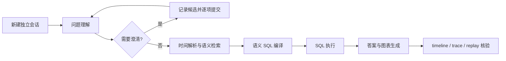

# 商城店铺 Agent 20 题全链路测试报告

## 1. 结论

本轮使用“商城店铺数据集”（dataset_id=243，datasource_id=13），基于当前语义资产和源数据重新设计 20 个问题，没有复用或参考旧测试问题。

测试结论：当前 Agent 已具备基础指标、多指标、趋势、对比、TopN、明细和语义澄清能力，但不建议按当前状态发布到要求数据准确的生产场景。主要原因不是单纯的运行失败，而是存在“Run 显示 finished、SQL 也执行成功，但业务答案错误或口径不安全”的情况。

- N01—N19 基准批次：13/19 完成并执行 SQL，运行成功率 68.4%。
- 为核验澄清稳定性补跑 N13、N17 后，N13 仍完成、N17 从完成变为失败；因此机器结果文件中的最新主 Run 为 12/19 完成。这一变化作为稳定性缺陷记录，不回写覆盖基准批次的首次业务判定。
- 严格业务正确：9/19，正确率 47.4%。
- 已执行 SQL 的 13 题中：9 题正确，执行后正确率 69.2%。
- 业务错误或不安全：N07、N10、N17、N19，共 4 题。
- 未执行 SQL：N02、N04、N09、N14、N15、N16，共 6 题。
- N20：按用户要求停止，不纳入 N01—N19 的通过率。停止前已覆盖 5 个客户指标候选，但候选树出现明显漂移，二层路径未完成。
- 全部 N01—N19 主 Run 的 timeline、trace、事件补拉均可读取，事件序号有序，说明可观测性链路总体完整。

发布判断：**不通过**。建议至少修复 N10 的布尔筛选类型错误、N17 的条件指标聚合错误、排名问题的校验与澄清断路后，再重新回归。

## 2. 测试范围与方法

### 2.1 数据范围

涉及 5 个当前语义模型：

| 模型ID | 物理表 | 主要测试内容 |
|---:|---|---|
| 246 | `fct_stall_order_daily` | 订单、GMV、商品件数、下单客户数 |
| 247 | `snap_unshipped_order` | 未发订单、超时、订单金额 |
| 248 | `snap_product_inventory` | 库存、销量、未动销、负库存 |
| 249 | `fct_customer_trade_daily` | 客户GMV、订单、首单、渠道 |
| 250 | `snap_customer_arrears` | 欠款、逾期金额、逾期客户 |

问题使用店铺 100013、100021、100022、100023，并覆盖单日、日期范围、整月、快照、跨日聚合和缺少时间等情况。

### 2.2 执行方式

测试通过公开 HTTP 流程执行：创建会话、启动 Agent SSE、恢复澄清、读取 timeline、读取 trace、补拉 Run 事件。每个主问题使用独立会话，避免问题间上下文污染。

测试脚本：`backend/scripts/run_mall_store_agent_fresh_20.py`。机器明细：`docs/test-results/mall_store_agent_fresh_20_results_2026-08-15.json`。

说明：自动关键字命中只用于快速筛查，最终结论以源数据基准、实际 SQL、查询结果和回答内容人工核验为准。例如日期展示格式和四舍五入会产生自动匹配假阴性。

## 3. 20 个问题与逐题结果

### 3.1 N01—N10

| ID | 新设计问题 | 数据基准 | 实际结果 | 判定 |
|---|---|---|---|---|
| N01 | 2026-06-10 店铺100013销售、订货、总订单数 | 7、0、7 | 返回 7、0、7 | 通过 |
| N02 | 2026-06-08至14日店铺100021哪天总GMV最高 | 06-08，40407.48 | 问题理解要求澄清，但未真正发起澄清；0 个工具调用，Run 失败 | 失败 |
| N03 | 2026-06-30 对比100022和100023总商品件数 | 57 对 50，100022高7件 | 完整返回，并计算高14% | 通过 |
| N04 | 店铺100013六月订货GMV最高3天 | 06-19 24934.87；06-12 13562.81；06-09 11404.80 | 识别为排名但缺少排名维度；0 个工具调用 | 失败 |
| N05 | 店铺100021六月哪些日期订货GMV高于销售GMV | 06-12、06-20、06-26 | 返回三天及两项金额 | 通过，但条件由答案阶段从结果中筛选，存在大结果集风险 |
| N06 | 店铺100022 06-30销售AOV和总AOV | 3398.634、2457.93375 | 返回 3398.63、2457.93 | 通过 |
| N07 | 店铺100023 06-30比06-29 GMV减少额和降幅 | 11358.72、7621.32、减少3737.40、降幅约32.9% | 时间工具只保留06-30，回答称缺少06-29 | 部分失败 |
| N08 | 店铺100013 06-24至30日每日总下单客户数 | 每天均为3 | 返回7天均为3 | 通过 |
| N09 | 店铺100021超时天数最多的未发订单 | USO202606300004、C1000201007、13天 | 排名校验要求澄清但未发起；0 个工具调用 | 失败 |
| N10 | 店铺100022所有超时未发订单的未发件数和金额 | 16件、14780元 | 返回17件、12873元 | **错误** |

### 3.2 N11—N20

| ID | 新设计问题 | 数据基准/期望行为 | 实际结果 | 判定 |
|---|---|---|---|---|
| N11 | 店铺100023未发件数最多3笔订单 | 018=12、012=11、030=9 | 三笔及商品摘要正确 | 通过 |
| N12 | 店铺100021历史销量最高3个商品及库存 | 1016=19341/61；1023=18878/400；1017=18651/493 | 返回正确 | 通过 |
| N13 | 店铺100022负库存商品明细 | P1000202025、复古牛仔夹克、-5 | 主结果正确；SQL查询25个商品后由回答阶段识别负数，并未在SQL层筛选负库存 | 结果通过，查询实现有风险 |
| N14 | 店铺100023连续30天未动销商品数及其中库存最多商品 | 9个；P1000203006，479件 | 被识别为排名但缺少维度；0 个工具调用 | 失败 |
| N15 | 按线上/线下拆分店铺100013客户GMV与订单数 | 线上28906.32/8；线下13560.48/4 | 两次编译均被 `semantic_query_plan_incomplete` 拒绝 | 失败 |
| N16 | 店铺100021六月累计客户GMV Top5 | 1004=74808.38；1006=59583.43；1007=56358.56；1001=53818.21；1009=52405.69 | 检索被 `semantic_metric_dimension_incompatible` 拒绝 | 失败 |
| N17 | 店铺100022 06-07首单成交客户数及这些客户GMV | 2人、6630.30元 | 首轮完成但返回10467.50元；SQL统计了当日全部客户GMV，未限定首单客户。重复运行又变为客户ID用途澄清并最终失败 | **错误且不稳定** |
| N18 | 店铺100023逾期客户数、欠款余额、逾期金额 | 6、483545、175179.45 | 返回6、48.35万、17.52万，占比36.2% | 通过 |
| N19 | 店铺100022总GMV是多少 | 应先确认时间范围 | 未澄清时间，直接汇总全部可见数据为583687.37 | **口径不安全** |
| N20 | 店铺100023 06-30有多少位客户 | 应澄清客户口径 | 已按要求停止；停止前5个指标候选均有一次可执行结果，其他维度/二层路径不完整 | 中止，不计分 |

## 4. 澄清测试结果

所有澄清均归入产生澄清的原问题，不把一个候选分支计作新的问题。

### 4.1 N13：负库存口径

首次观测到两个候选：

| 候选 | 观测结果 | 结论 |
|---|---|---|
| 负库存商品数 | 首次 Run 自动选择后完成，答案正确 | 已执行 |
| 是否负库存 | 独立分支运行时没有稳定复现同一澄清；后续补跑中 N13 直接执行，不再出现候选 | 未能可靠提交，候选不稳定 |

N13 的同一问题在不同 Run 中有时出现指标澄清、有时不澄清。即使答案正确，也不能把它判定为稳定的澄清流程通过。

### 4.2 N17：首单客户口径与客户ID用途

首次 Run 观测到两个指标候选：

| 候选 | 结果 |
|---|---|
| 是否首单成交 | Run 完成，但GMV错误：10467.50，而首单客户GMV应为6630.30 |
| 新增成交客户数 | 在独立分支中问题理解改成“客户ID用途”澄清，原候选无法稳定复现，发生 `CLARIFICATION_DIMENSION_ROLE_INVALID` |

补跑时，同一原问题改为以下三个首层候选，三项均已实际提交：

| 候选 | 后续行为 | 终态 |
|---|---|---|
| 按客户ID分组查看 | 未执行 SQL | failed / sql_failed |
| 筛选某个具体客户ID | 进入第二层“补充具体客户ID”自由输入；本轮自动测试未提供有效客户ID值 | failed / sql_failed |
| 不使用客户ID维度，查看汇总结果 | 未执行 SQL | failed / sql_failed |

结论：选项提交接口可恢复 Run，但候选集合不稳定，选择后也不能稳定收敛到可执行查询。N17 不能判定为澄清通过。

### 4.3 N19：应澄清但未澄清

问题缺少时间范围。问题理解将其判定为合法普通指标查询，直接生成不带时间条件的全量汇总 SQL。该行为可能符合“全历史汇总”的某种产品定义，但当前回答没有说明数据起止范围，因此从业务安全角度判为失败。

### 4.4 N20：按要求停止

停止前已成功执行的首层客户指标候选如下：

| 候选 | 已观测结果 |
|---|---:|
| 总下单客户数 | 3 |
| 订货下单客户数 | 1 |
| 销售下单客户数 | 2 |
| 欠款客户数 | 9 |
| 新增成交客户数 | 0 |

同时还出现过 5 个显示名称完全相同、但分别绑定模型246—250的“档口ID（stall_id）”候选。部分路径成功，部分返回 `SEMANTIC_CLARIFICATION_SLOT_NOT_AMBIGUOUS`，部分仍停留在 waiting_user。由于用户明确要求不再运行 N20，本报告不补齐这些路径，也不把此前为了匹配候选产生的重试 Run 计入主通过率。

## 5. 各流程环节运行分析

### 5.1 问题理解

N01—N19 均产生 `question.understood` 事件，基础可观测性完整。

- 15题被判为 valid。
- N02、N04、N09、N14 被判为 `clarification_required`，原因均涉及 `ranking_dimension_missing`，其中 N02、N09 还包含 `ranking_limit_missing`。
- 上述4题没有生成可交互的排名澄清，而是继续进入 Agent；模型输出工具调用文本后没有形成真实工具调用，最终被直接回答保护拦截。
- N19 未因缺少时间被拦截。当前确定性校验只要求趋势问题必须有时间，没有对普通指标查询建立时间范围策略。

四题的事件证据完全一致：

| 问题 | Run | 问题理解校验 | 后续真实工具调用 | 最终失败 |
|---|---:|---|---|---|
| N02 | 509 | `ranking_dimension_missing`、`ranking_limit_missing` | 0 | `sql_failed` |
| N04 | 528 | `ranking_dimension_missing` | 0 | `sql_failed` |
| N09 | 533 | `ranking_dimension_missing`、`ranking_limit_missing` | 0 | `sql_failed` |
| N14 | 540 | `ranking_dimension_missing` | 0 | `sql_failed` |

因此问题不在“没有识别为排名”，而在“识别结果没有驱动状态迁移”：`question.understood` 事件已经把校验结果发给前端，但后端没有把这组 ranking reason code 转换成 `clarification.required`，仍然返回主循环继续执行。

### 5.2 时间解析

N01—N19 共调用 `parse_time_range` 14 次，工具状态均为 succeeded，但 N07 的成功状态不代表语义完整。输入“2026年6月30日 vs 6月29日”被解析成单一范围 `[2026-06-30, 2026-07-01)`，第二个日期丢失。

当前兼容入口把整段原文交给 JioNLP，并只接受单一时间点或时间段结果。对“两日期比较”应由权威时间计划生成两个查询过滤范围，不能把两个日期压成一个 `time_range.raw` 后按单范围解析。

### 5.3 语义检索

基准批次共调用 `search_semantic_assets` 15 次：14 次成功，N16 1 次被拒绝。

- N16 的问题理解已正确识别“客户ID分组、累计客户GMV、Top5、六月”。
- 检索层仍返回 `semantic_metric_dimension_incompatible`，说明指标与维度的模型兼容性或槽位绑定没有形成可执行组合。
- N13、N17、N20 暴露同一自然语言在独立 Run 中候选集合变化的问题。候选生成依赖模型输出，缺少足够稳定的确定性归并和排序。

### 5.4 SQL 编译

基准批次共调用编译 15 次：13 次成功、2 次失败；两次失败均来自 N15。

N15 的问题理解同时给出 `needs_group_by=true`，却把线上/线下识别为多值 filter。理解校验允许多值 filter 满足“有分组目标”，但编译计划要求明确的 `group_dimension_asset_ids`，导致校验层和编译层契约不一致。Agent 第二次口头声明会加入分组维度，实际提交参数仍没有 dimension_asset_ids，因此再次失败。

### 5.5 SQL 执行与数据正确性

基准批次 13 次 SQL 执行在技术上全部成功，没有数据库执行错误，但其中存在三类风险：

1. **类型错误导致静默错数（N10）**：物理字段 `is_overtime` 是 tinyint，SQL 使用 `is_overtime = '超时'`。在 MySQL 类型转换下，中文字符串可能按0参与比较，实际筛选到非超时数据，因而得到17件、12873元，而正确超时数据是16件、14780元。
2. **条件指标没有转成行过滤（N17）**：SQL同时 `SUM(customer_gmv)` 和 `SUM(is_first_deal)`，却没有 `WHERE is_first_deal=1` 或条件聚合。人数2正确，但GMV统计了当日全部客户。
3. **SQL未承载业务条件（N05、N13）**：N05先取整月每日两项GMV，再由回答阶段找出订货高于销售的日期；N13查询25条库存明细，再由回答阶段找负数。当前数据量小且在100行限制内，所以答案正确；数据增大后可能漏数。

### 5.6 答案生成

答案生成对 N01、N03、N05、N06、N08、N11、N12、N13、N18 的结果总结总体清晰，能够计算差值、比例和排序说明。

需要改进：

- N10、N17 基于错误查询结果生成了确定性语气的错误答案，没有口径警告。
- N19 没有说明“583687.37”覆盖的实际数据起止范围。
- N12 从历史销量和当前库存差异推断“可能存在热销品备货不足”，属于合理提示，但应明确这是推断，不是数据库事实。

### 5.7 生命周期、事件和可观测性

N01—N19 基准主 Run：

- timeline 可用：19/19。
- trace 可用：19/19。
- Run 事件补拉完整：19/19。
- SSE 批次内 sequence 有序：19/19。
- 累计步骤 64，工具记录 72。
- 累计模型 token 356064，平均每题约18740。
- 平均耗时 21.13秒，中位数20.02秒，最短10.13秒，最长36.05秒。
- 完成题平均21.61秒；失败题平均20.08秒。失败没有显著更快，说明部分失败在模型规划或重复编译上仍消耗较多资源。

直接回答保护工作正常：当没有成功 SQL 结果时，`loop.py` 会拒绝模型直接结束，避免生成看似来自数据库的答案。该保护成功阻止了 N02、N04、N09、N14 等问题输出无依据数字，但终态统一归为 `sql_failed`，会掩盖其真正发生在问题理解或工具调用协议阶段的原因。

## 6. 根因定位

### P0：布尔/枚举自然语言值未做类型绑定，导致静默错数

证据：N10 生成 `is_overtime = '超时'`，字段类型为 tinyint，结果与源数据基准相反。

根因是语义层把自然语言标签直接作为物理过滤值，缺少“展示值 → 存储值”的统一映射和编译前类型校验。这不是 N10 单题问题，所有布尔、枚举、状态字段都可能受影响。

建议：在语义资产中统一定义值域映射，并在 SQL 编译入口校验过滤值类型；tinyint 布尔字段禁止接受无法转换的任意字符串。

### P0：条件指标与被条件限定的金额没有共享同一过滤口径

证据：N17 人数为2但GMV从正确的6630.30变成10467.50。

根因是“首单成交客户”被绑定成可聚合指标 `SUM(is_first_deal)`，而“这些客户的GMV”没有继承 `is_first_deal=1` 过滤条件。业务不变量应是：同一问题中由状态限定出的客户集合，后续所有金额指标必须在同一客户集合上计算。

建议：在查询计划层表达条件集合或条件指标依赖，使计数和GMV共享同一个谓词；不要依赖答案模型自行关联“这些客户”。

### P1：排名校验发现问题，但前置澄清不处理排名原因码

证据：N02、N04、N09、N14 都产生 `ranking_dimension_missing`，却没有暂停为用户澄清。

代码位置：

- `backend/apps/chatbi/services/understanding/validation.py:138` 生成排名缺失问题。
- `backend/apps/chatbi/orchestration/agent/preparation.py:830` 的前置澄清只处理时间、维度角色歧义和缺少筛选值，最后对排名问题返回 None。
- `backend/apps/chatbi/orchestration/agent/loop.py:485` 最终只能用直接回答保护将 Run 置为失败。

建议：不要简单为每个排名问题新增交互。应先修正问题理解：问题中“哪一天”“最高3天”“最多的订单”已经提供排名维度或Top1语义时，确定性归一化应补齐 group_by 和 limit=1；只有用户确实未给排名对象或数量且业务无法默认时才澄清。

### P1：两个日期的比较被单时间范围解析器吞掉一个日期

证据：N07 的 parse_time_range 成功返回单日06-30。

代码位置：`backend/apps/temporal/resolver.py:40` 将原文交给适配器；`backend/apps/temporal/jionlp_adapter.py:30` 接受单个 JioNLP 解析结果并投影为一个范围。

建议：比较问题使用结构化 temporal plan 保存两个时间表达；如果比较目标需要两个独立范围，而兼容解析器只返回一个范围，应拒绝并要求修正，不能返回 succeeded。

### P1：理解校验与编译计划对多值筛选的分组含义不一致

证据：N15 在理解阶段 valid，在编译阶段两次缺少 group_dimension_asset_ids。

代码位置：`backend/apps/chatbi/services/understanding/validation.py:128` 允许 multi_value_filters 满足 needs_group_by；`backend/apps/tool/tools/semantic.py:530` 在编译入口拒绝不完整计划。

建议：把“多值筛选是否同时承担分组”作为单一规则在查询计划投影处表达。用户说“按线上和线下拆分”时，channel_type 应是 group_by，同时可带 IN 过滤，不应只保存为 filter。

### P1：澄清候选在相同输入下不稳定

证据：N13 在一次运行中出现两个负库存指标候选，补跑时完全不澄清；N17 从两个指标候选切换成三个客户ID用途候选；N20 出现5个同名档口ID候选。

建议：候选生成后按“语义槽位 + 资产类型 + 模型兼容性”确定性归并，候选 value 和顺序保持稳定；同名不同模型候选必须在 label 中显示模型或业务主题差异。恢复时只允许使用当前 clarification_id 对应的候选，测试侧也应记录实际匹配而不是目标路径。

### P1：普通指标缺少时间时直接做无界汇总

证据：N19 直接对店铺100022所有可见事实求和。

代码位置：`backend/apps/chatbi/services/understanding/validation.py:163` 只对 trend_analysis 强制时间，metric_query 没有时间策略。

建议：建立统一数据集时间策略，例如“必须明确时间”“默认最新快照”“允许全历史但答案必须展示范围”，由数据集配置决定，不让模型自行选择。

### P2：语义资产兼容性和大结果集后处理

- N16 说明客户GMV与客户ID在当前资产绑定中无法形成兼容组合，需要检查模型249的维度归属和指标可聚合性。
- N05、N13 依赖答案阶段从最多100行样本中二次筛选。条件比较、负值、状态条件应进入 SQL 的 WHERE/HAVING/条件聚合。

## 7. 修复与回归优先级

建议按以下顺序处理：

1. 修复布尔/枚举值映射和编译类型校验，回归 N10，并增加 0/1、是/否、超时/未超时的参数化测试。
2. 在查询计划中支持“条件限定集合上的多个指标”，回归 N17 的人数和GMV必须共享首单过滤。
3. 统一排名维度、Top1默认和前置澄清规则，回归 N02、N04、N09、N14。
4. 支持双日期/双区间比较时间计划，回归 N07。
5. 统一多值筛选与分组计划，回归 N15。
6. 修复模型249客户GMV与客户ID兼容性，回归 N16。
7. 配置缺少时间的指标查询策略，回归 N19。
8. 固定澄清候选归并、标签和顺序，再进行 N13、N17、N20 的全候选回归。N20 只有在用户允许后再运行。

建议发布门槛：

- 20 个主问题 SQL 执行率不低于 95%。
- 严格业务正确率不低于 95%。
- 所有布尔/枚举筛选必须通过类型校验，不允许数据库隐式转换。
- 相同问题连续运行5次，澄清候选 value 集合和顺序保持一致。
- 每个澄清候选都能恢复到明确终态；需要自由输入的分支必须提供有效测试值。
- `finished` 必须同时满足 SQL 已执行、答案与源数据基准一致、时间和业务口径可解释。

## 8. 证据文件

- 详细机器结果：`docs/test-results/mall_store_agent_fresh_20_results_2026-08-15.json`
- 自动概览：`docs/test-results/mall_store_agent_fresh_20_overview_2026-08-15.md`
- 本轮测试脚本：`backend/scripts/run_mall_store_agent_fresh_20.py`
- 问题理解校验：`backend/apps/chatbi/services/understanding/validation.py`
- 前置澄清：`backend/apps/chatbi/orchestration/agent/preparation.py`
- Agent 直接回答保护：`backend/apps/chatbi/orchestration/agent/loop.py`
- 时间解析入口：`backend/apps/temporal/resolver.py`
- JioNLP 适配：`backend/apps/temporal/jionlp_adapter.py`
- 语义检索与编译保护：`backend/apps/tool/tools/semantic.py`

## 9. 限制说明

- N20 在用户要求停止后没有再次运行；其未完成路径不做推断。
- N13/N17 的补跑仅用于验证澄清稳定性，不替换基准批次的业务正确性结论。
- 首次运行期间曾出现上游模型 APIConnectionError，相关题随后单独重试；本报告的业务结论不把连接失败当作产品功能失败。
- 本报告没有修改 Agent 业务代码，也没有修复上述问题；仅新增测试脚本和测试结果文档。
